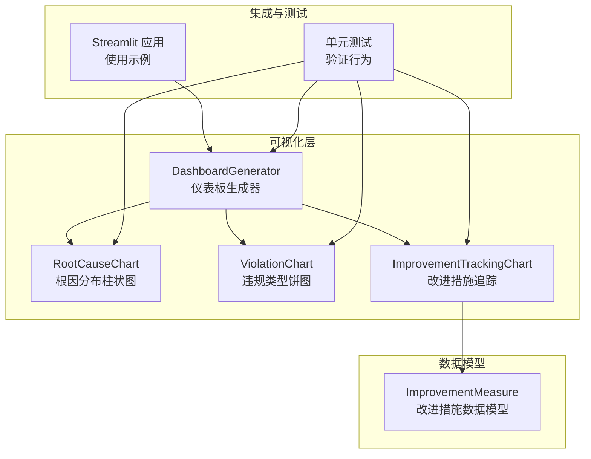
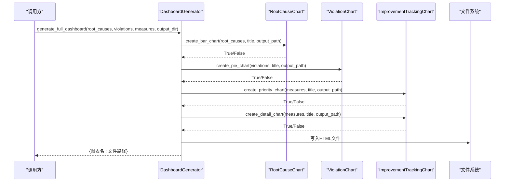
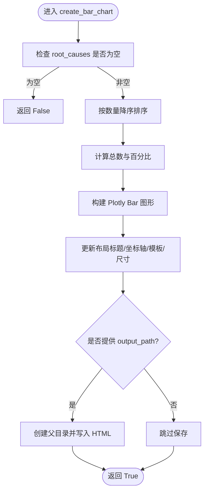
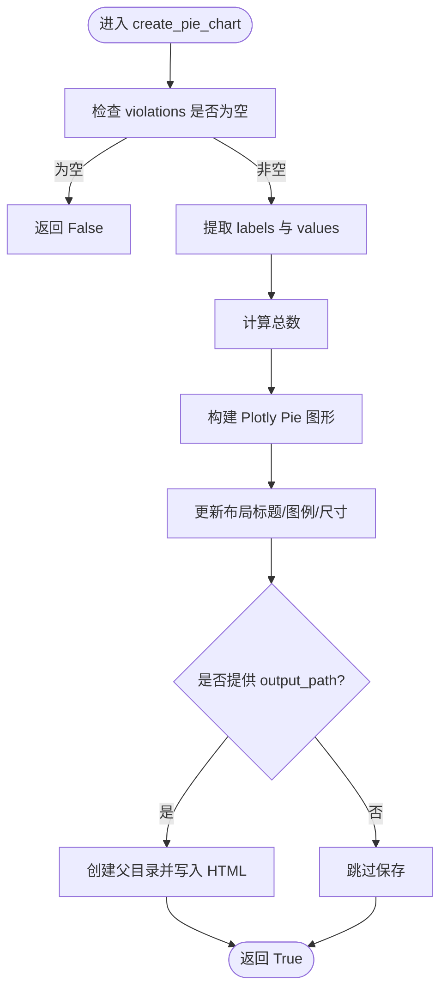
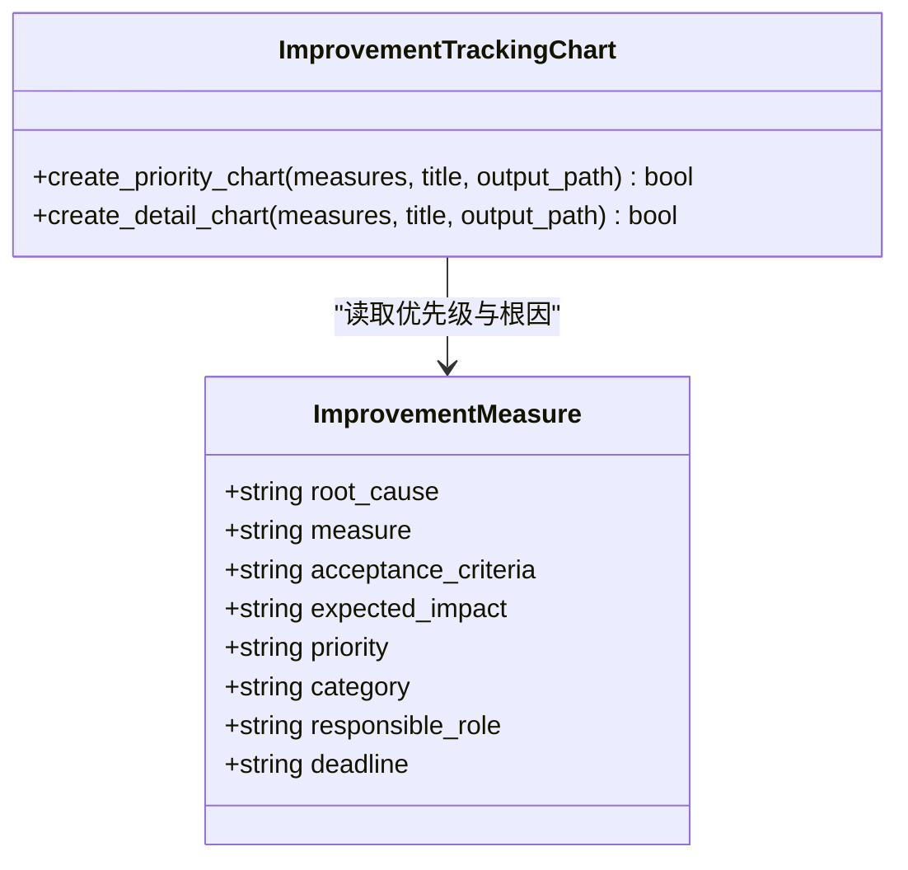
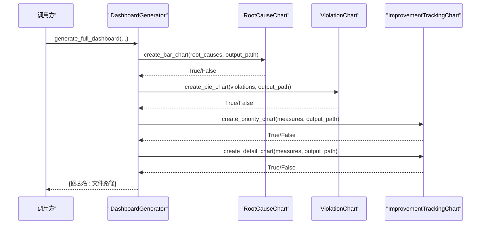
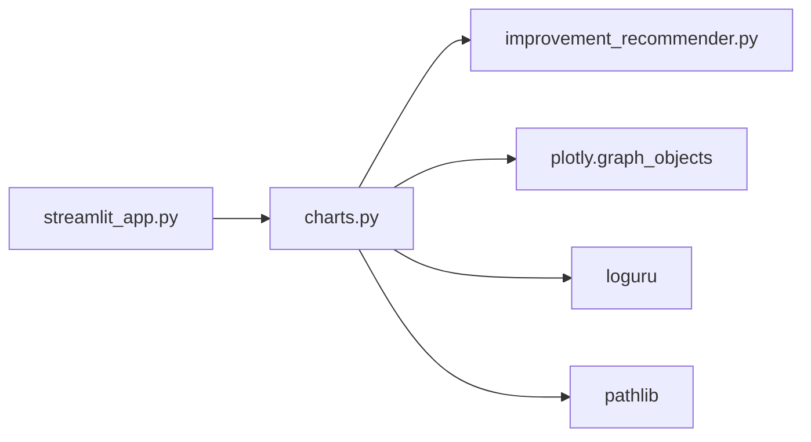

# 图表生成模块

<cite>
**本文引用的文件**
- [charts.py](file://src/visualization/charts.py)
- [improvement_recommender.py](file://src/analysis/improvement_recommender.py)
- [streamlit_app.py](file://src/ui/streamlit_app.py)
- [test_charts.py](file://tests/visualization/test_charts.py)
</cite>

## 目录
1. [简介](#简介)
2. [项目结构](#项目结构)
3. [核心组件](#核心组件)
4. [架构总览](#架构总览)
5. [详细组件分析](#详细组件分析)
6. [依赖关系分析](#依赖关系分析)
7. [性能考虑](#性能考虑)
8. [故障排查指南](#故障排查指南)
9. [结论](#结论)
10. [附录：使用示例与最佳实践](#附录使用示例与最佳实践)

## 简介
本模块提供面向“根因分布、违规类型、改进措施”三类分析的可视化图表生成能力，并支持通过仪表板生成器一次性输出完整的数据分析页面。核心类包括：
- RootCauseChart：根因分布柱状图
- ViolationChart：违规类型饼图
- ImprovementTrackingChart：改进措施追踪（优先级分布与详情）
- DashboardGenerator：整合上述图表，批量生成 HTML 报告

该模块基于 Plotly 渲染交互式 HTML 图表，适用于离线报告与在线界面嵌入两种场景。

## 项目结构
图表生成相关代码位于 src/visualization/charts.py；数据模型 ImprovementMeasure 定义于 src/analysis/improvement_recommender.py；UI 集成示例在 src/ui/streamlit_app.py；单元测试位于 tests/visualization/test_charts.py。

图示来源
- [charts.py:15-399](file://src/visualization/charts.py#L15-L399)
- [improvement_recommender.py:13-25](file://src/analysis/improvement_recommender.py#L13-L25)
- [streamlit_app.py:352-430](file://src/ui/streamlit_app.py#L352-L430)
- [test_charts.py:14-165](file://tests/visualization/test_charts.py#L14-L165)

章节来源
- [charts.py:1-399](file://src/visualization/charts.py#L1-L399)
- [improvement_recommender.py:1-300](file://src/analysis/improvement_recommender.py#L1-L300)
- [streamlit_app.py:1-548](file://src/ui/streamlit_app.py#L1-L548)
- [test_charts.py:1-165](file://tests/visualization/test_charts.py#L1-L165)

## 核心组件
- RootCauseChart
  - 功能：将“根因名称 -> 数量”的映射转换为按数量降序排列的柱状图，自动计算百分比并在文本标签中显示。
  - 输入：dict[str, int]
  - 输出：HTML 文件（可选），返回布尔值表示是否成功。
- ViolationChart
  - 功能：将“违规类型 -> 数量”的映射转换为带中心孔的饼图，展示占比与总数信息。
  - 输入：dict[str, int]
  - 输出：HTML 文件（可选），返回布尔值表示是否成功。
- ImprovementTrackingChart
  - 功能：
    - create_priority_chart：统计高/中/低优先级的措施数量，绘制堆叠式条形图。
    - create_detail_chart：对前 N 条措施绘制横向条形图，颜色与长度反映优先级与预期影响。
  - 输入：list[ImprovementMeasure]
  - 输出：HTML 文件（可选），返回布尔值表示是否成功。
- DashboardGenerator
  - 功能：统一编排上述三类图表，批量写入指定目录，返回各图表路径字典。
  - 输入：root_causes、violations、measures、output_dir
  - 输出：dict[str, str] 键为图表名，值为生成的 HTML 路径。

章节来源
- [charts.py:15-399](file://src/visualization/charts.py#L15-L399)
- [improvement_recommender.py:13-25](file://src/analysis/improvement_recommender.py#L13-L25)

## 架构总览
下图展示了从数据到图表输出的端到端流程，以及 DashboardGenerator 如何协调多个子组件完成批量生成。

图示来源
- [charts.py:335-399](file://src/visualization/charts.py#L335-L399)

## 详细组件分析

### RootCauseChart（根因分布柱状图）
- 处理逻辑
  - 校验输入非空
  - 按数量降序排序
  - 计算总数与百分比
  - 构建 Plotly Bar 图形，设置标题、坐标轴、模板、尺寸等布局
  - 可选写入 HTML 文件
- 数据格式要求
  - root_causes: dict[str, int]，键为根因名称，值为出现次数
- 参数配置选项
  - title: 图表标题
  - output_path: 输出 HTML 路径（可为 None，不保存）
- 输出格式支持
  - HTML（Plotly 交互式）
- 错误处理
  - 空数据时记录警告并返回 False
  - 异常捕获后记录错误日志并返回 False

图示来源
- [charts.py:18-84](file://src/visualization/charts.py#L18-L84)

章节来源
- [charts.py:15-85](file://src/visualization/charts.py#L15-L85)

### ViolationChart（违规类型饼图）
- 处理逻辑
  - 校验输入非空
  - 提取标签与数值，计算总数
  - 构建 Plotly Pie 图形（带中心孔），设置 hovertemplate 与图例位置
  - 可选写入 HTML 文件
- 数据格式要求
  - violations: dict[str, int]，键为违规类型，值为数量
- 参数配置选项
  - title: 图表标题
  - output_path: 输出 HTML 路径（可为 None，不保存）
- 输出格式支持
  - HTML（Plotly 交互式）
- 错误处理
  - 空数据时记录警告并返回 False
  - 异常捕获后记录错误日志并返回 False

图示来源
- [charts.py:90-160](file://src/visualization/charts.py#L90-L160)

章节来源
- [charts.py:87-161](file://src/visualization/charts.py#L87-L161)

### ImprovementTrackingChart（改进措施追踪）
- 优先级分布图（create_priority_chart）
  - 统计 high/medium/low 三类措施的数量
  - 使用不同颜色区分优先级
  - 构建条形图并可选保存
- 详情图（create_detail_chart）
  - 限制显示前 15 条措施
  - 根据优先级映射“预期影响程度”数值与颜色
  - 构建横向条形图，y 轴为根因（截断过长文本），x 轴为影响程度
  - 可选保存
- 数据格式要求
  - measures: list[ImprovementMeasure]
  - ImprovementMeasure 字段：
    - root_cause: str
    - measure: str
    - acceptance_criteria: str
    - expected_impact: str
    - priority: str（high/medium/low）
    - category: str（可选）
    - responsible_role: str（可选）
    - deadline: str（可选）
- 参数配置选项
  - title: 图表标题
  - output_path: 输出 HTML 路径（可为 None，不保存）
- 输出格式支持
  - HTML（Plotly 交互式）
- 错误处理
  - 空数据时记录警告并返回 False
  - 异常捕获后记录错误日志并返回 False

图示来源
- [improvement_recommender.py:13-25](file://src/analysis/improvement_recommender.py#L13-L25)
- [charts.py:163-332](file://src/visualization/charts.py#L163-L332)

章节来源
- [charts.py:163-332](file://src/visualization/charts.py#L163-L332)
- [improvement_recommender.py:13-25](file://src/analysis/improvement_recommender.py#L13-L25)

### DashboardGenerator（仪表板生成器）
- 职责
  - 组合 RootCauseChart、ViolationChart、ImprovementTrackingChart
  - 统一输出目录管理
  - 批量生成四类图表：根因分布、违规类型、改进措施优先级、改进措施详情
- 输入
  - root_causes: dict[str, int]
  - violations: dict[str, int]
  - measures: list[ImprovementMeasure]
  - output_dir: 输出目录路径
- 输出
  - dict[str, str]：键为图表标识（如 root_cause、violation、improvement_priority、improvement_detail），值为对应 HTML 文件路径
- 错误处理
  - 单个图表生成失败不影响其他图表生成
  - 最终返回包含所有成功生成文件的字典

图示来源
- [charts.py:335-399](file://src/visualization/charts.py#L335-L399)

章节来源
- [charts.py:335-399](file://src/visualization/charts.py#L335-L399)

## 依赖关系分析
- 内部依赖
  - charts.py 依赖 ImprovementMeasure（来自 improvement_recommender.py）
  - streamlit_app.py 导入并使用 DashboardGenerator 进行可视化展示
- 外部依赖
  - plotly.graph_objects：用于构建交互式图表
  - loguru：用于日志记录
  - pathlib：用于路径操作

图示来源
- [charts.py:1-12](file://src/visualization/charts.py#L1-L12)
- [streamlit_app.py:13-15](file://src/ui/streamlit_app.py#L13-L15)

章节来源
- [charts.py:1-12](file://src/visualization/charts.py#L1-L12)
- [streamlit_app.py:13-15](file://src/ui/streamlit_app.py#L13-L15)

## 性能考虑
- 数据规模控制
  - 改进措施详情图默认仅显示前 15 条，避免长列表导致渲染缓慢
- 渲染优化
  - 使用 Plotly 内置模板与简化布局，减少不必要的元素
- I/O 策略
  - 仅在需要时写入 HTML，避免不必要的磁盘操作
- 建议
  - 对于大规模数据，建议在调用前进行聚合或采样
  - 可结合缓存机制复用已生成的图表文件，减少重复计算

## 故障排查指南
- 常见问题
  - 输入为空：会记录警告并返回 False，需检查上游数据源
  - 路径权限：若无法创建目录或写入文件，请确认输出目录存在且具备写权限
  - 依赖缺失：确保已安装 plotly、loguru、pathlib 等依赖
- 定位方法
  - 查看日志输出中的错误信息
  - 使用单元测试用例验证基本流程是否正常

章节来源
- [charts.py:34-84](file://src/visualization/charts.py#L34-L84)
- [charts.py:106-160](file://src/visualization/charts.py#L106-L160)
- [charts.py:182-248](file://src/visualization/charts.py#L182-L248)
- [charts.py:266-332](file://src/visualization/charts.py#L266-L332)

## 结论
本模块以清晰的职责划分与统一的接口设计，提供了根因分布、违规类型与改进措施的可视化能力，并通过 DashboardGenerator 实现一键式仪表板生成。其错误处理完善、输出格式统一（HTML）、易于集成到 Streamlit 或其他系统中，适合用于离线报告与在线交互展示。

## 附录：使用示例与最佳实践

### 使用示例（参考路径）
- 根因分布柱状图
  - 参考：[test_charts.py:17-41](file://tests/visualization/test_charts.py#L17-L41)
- 违规类型饼图
  - 参考：[test_charts.py:47-70](file://tests/visualization/test_charts.py#L47-L70)
- 改进措施优先级与详情图
  - 参考：[test_charts.py:76-133](file://tests/visualization/test_charts.py#L76-L133)
- 仪表板批量生成
  - 参考：[test_charts.py:139-165](file://tests/visualization/test_charts.py#L139-L165)
- Streamlit 集成示例
  - 参考：[streamlit_app.py:410-430](file://src/ui/streamlit_app.py#L410-L430)

### 自定义样式与颜色方案
- 当前实现采用固定配色与模板，如需自定义：
  - 修改 marker_color、textposition、hovertemplate 等属性
  - 调整 width、height、legend 等布局参数
- 注意：保持可读性与一致性，避免过多颜色造成视觉混乱

### 布局调整
- 标题位置与字体大小
- 坐标轴标题与刻度角度
- 图例方向与位置
- 图表尺寸与响应式适配

### 输出格式支持
- HTML（Plotly 交互式）
- 可在浏览器中直接打开，或通过 Streamlit 内嵌展示