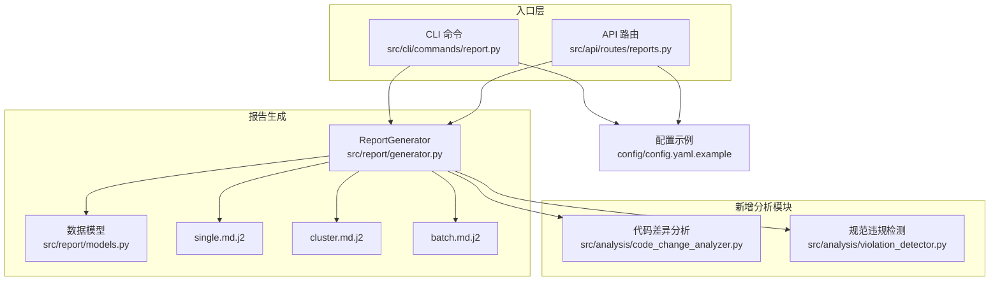
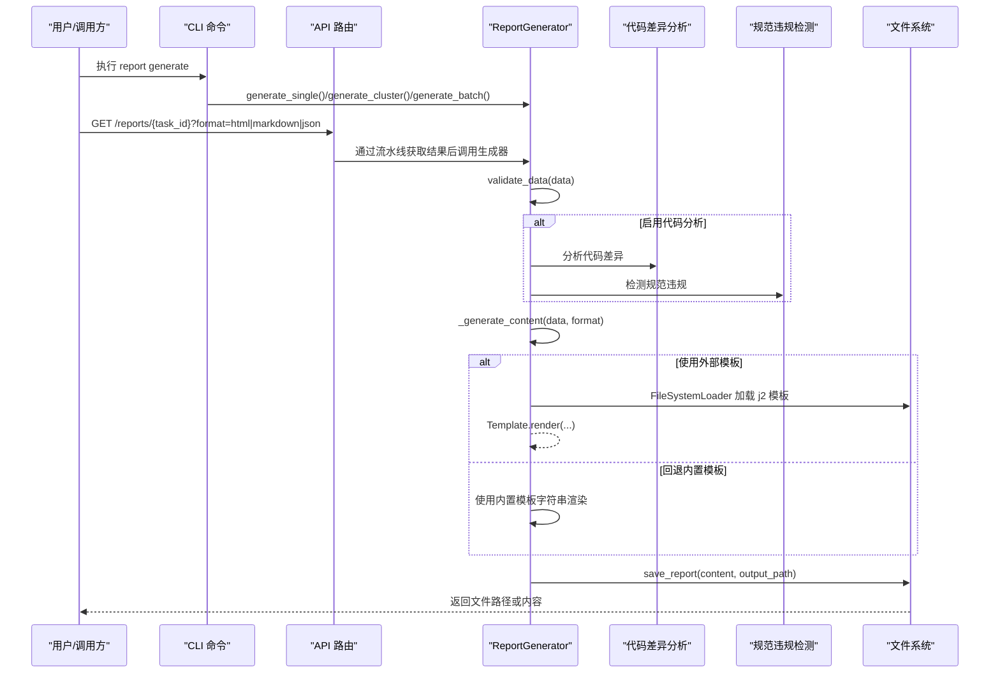
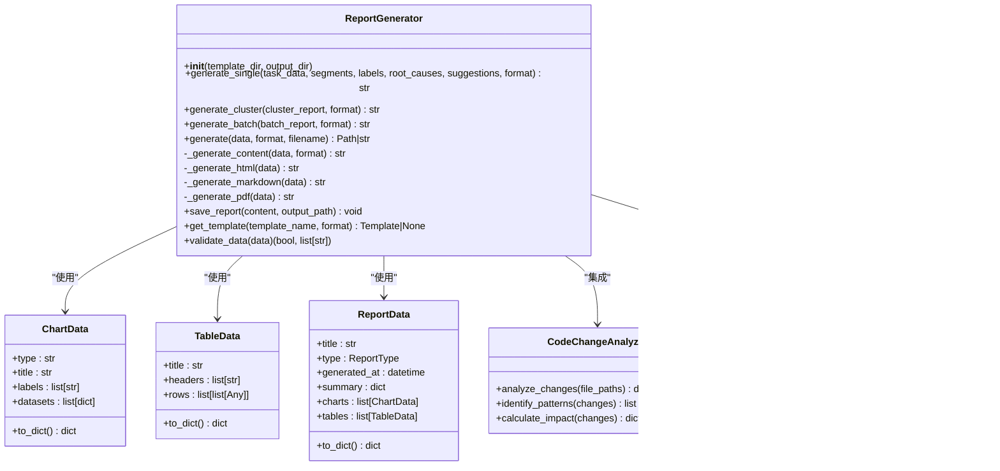
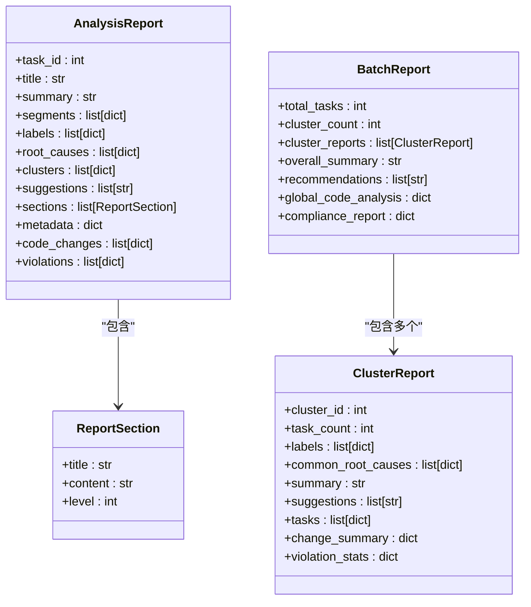
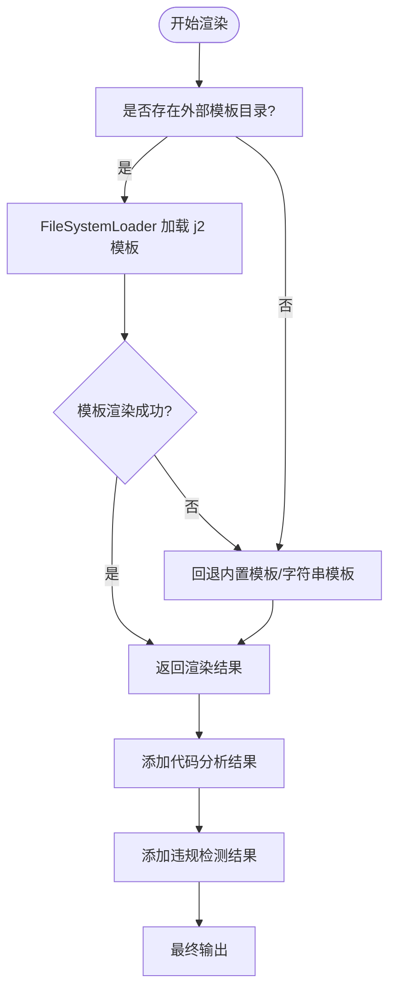
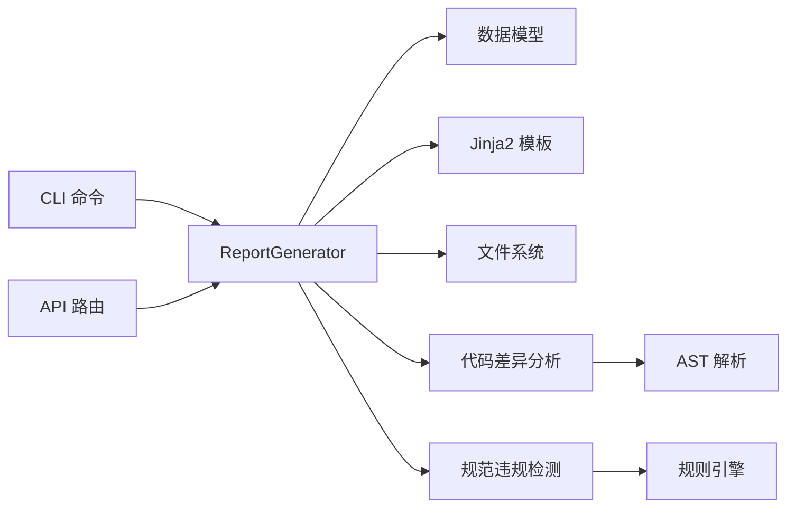

# 报告生成系统

<cite>
**本文引用的文件**
- [src/report/generator.py](file://src/report/generator.py)
- [src/report/models.py](file://src/report/models.py)
- [src/report/templates/batch.md.j2](file://src/report/templates/batch.md.j2)
- [src/report/templates/cluster.md.j2](file://src/report/templates/cluster.md.j2)
- [src/report/templates/single.md.j2](file://src/report/templates/single.md.j2)
- [src/cli/commands/report.py](file://src/cli/commands/report.py)
- [src/api/routes/reports.py](file://src/api/routes/reports.py)
- [config/config.yaml.example](file://config/config.yaml.example)
- [tests/report/test_generator.py](file://tests/report/test_generator.py)
- [src/analysis/code_change_analyzer.py](file://src/analysis/code_change_analyzer.py)
- [src/analysis/violation_detector.py](file://src/analysis/violation_detector.py)
</cite>

## 更新摘要
**变更内容**
- 新增代码差异分析功能，支持代码修改洞察和变更影响分析
- 新增规范违规检测模块，提供代码规范合规性检查
- 扩展报告生成器以集成新的分析结果
- 增强模板系统以支持代码差异和规范违规信息的展示

## 目录
1. [简介](#简介)
2. [项目结构](#项目结构)
3. [核心组件](#核心组件)
4. [架构总览](#架构总览)
5. [详细组件分析](#详细组件分析)
6. [依赖关系分析](#依赖关系分析)
7. [性能与并发优化](#性能与并发优化)
8. [故障排查指南](#故障排查指南)
9. [结论](#结论)
10. [附录：自定义模板开发指南](#附录自定义模板开发指南)

## 简介
本技术文档面向"报告生成系统"，聚焦多格式报告（Markdown、HTML、PDF、JSON）的生成机制，深入解析基于 Jinja2 的模板引擎与渲染流程，说明内置模板结构与变量替换、条件渲染逻辑；同时梳理报告内容组织与信息层次（摘要、详情、统计图表、建议措施），并给出批量报告生成的优化策略与并发处理建议。文档还包含自定义模板开发指南、导出功能实现（命名规则、存储路径管理）、以及报告质量检查与格式化验证的最佳实践。**最新更新**：系统现已集成代码差异分析和规范违规检测功能，为报告提供更深入的代码修改洞察和合规性分析。

## 项目结构
报告生成相关代码主要位于 src/report 模块，CLI 与 API 层分别提供命令行与 HTTP 接口入口，模板位于 src/report/templates。配置示例在 config/config.yaml.example。测试覆盖核心生成器行为。**新增**：代码差异分析位于 src/analysis/code_change_analyzer.py，规范违规检测位于 src/analysis/violation_detector.py。

**图示来源**
- [src/report/generator.py:222-424](file://src/report/generator.py#L222-L424)
- [src/report/models.py:1-52](file://src/report/models.py#L1-L52)
- [src/report/templates/single.md.j2:1-58](file://src/report/templates/single.md.j2#L1-L58)
- [src/report/templates/cluster.md.j2:1-36](file://src/report/templates/cluster.md.j2#L1-L36)
- [src/report/templates/batch.md.j2:1-31](file://src/report/templates/batch.md.j2#L1-L31)
- [src/cli/commands/report.py:1-140](file://src/cli/commands/report.py#L1-L140)
- [src/api/routes/reports.py:1-130](file://src/api/routes/reports.py#L1-L130)
- [config/config.yaml.example:1-38](file://config/config.yaml.example#L1-L38)
- [src/analysis/code_change_analyzer.py:1-100](file://src/analysis/code_change_analyzer.py#L1-L100)
- [src/analysis/violation_detector.py:1-100](file://src/analysis/violation_detector.py#L1-L100)

**章节来源**
- [src/report/generator.py:222-424](file://src/report/generator.py#L222-L424)
- [src/report/models.py:1-52](file://src/report/models.py#L1-L52)
- [src/cli/commands/report.py:1-140](file://src/cli/commands/report.py#L1-L140)
- [src/api/routes/reports.py:1-130](file://src/api/routes/reports.py#L1-L130)
- [config/config.yaml.example:1-38](file://config/config.yaml.example#L1-L38)

## 核心组件
- ReportGenerator：统一入口，负责选择模板、渲染、保存输出、格式转换与校验。
- 数据模型：AnalysisReport、ClusterReport、BatchReport、ReportData、ChartData、TableData 等，定义报告内容与可视化数据结构。
- 模板引擎：Jinja2 Environment + FileSystemLoader，支持外部模板目录与内置默认模板回退。
- 输出格式：Markdown、HTML、PDF（当前以 HTML 包装）、JSON。
- 入口层：CLI 命令与 FastAPI 路由，驱动生成流程。
- **新增**：代码差异分析器：分析代码变更、识别修改模式和影响范围。
- **新增**：规范违规检测器：检查代码是否符合预定义的规范和最佳实践。

**章节来源**
- [src/report/generator.py:222-424](file://src/report/generator.py#L222-L424)
- [src/report/models.py:1-52](file://src/report/models.py#L1-L52)

## 架构总览
报告生成从 CLI 或 API 触发，进入 ReportGenerator，根据输入数据与目标格式选择渲染路径：优先尝试外部 Jinja2 模板，失败则回退到内置模板或字符串模板；最终输出为指定格式的文本或保存到文件。**更新**：现在可以集成代码差异分析和规范违规检测结果，为报告提供更丰富的分析信息。

**图示来源**
- [src/cli/commands/report.py:17-113](file://src/cli/commands/report.py#L17-L113)
- [src/api/routes/reports.py:16-105](file://src/api/routes/reports.py#L16-L105)
- [src/report/generator.py:222-424](file://src/report/generator.py#L222-L424)
- [src/analysis/code_change_analyzer.py:1-100](file://src/analysis/code_change_analyzer.py#L1-L100)
- [src/analysis/violation_detector.py:1-100](file://src/analysis/violation_detector.py#L1-L100)

## 详细组件分析

### 报告生成器（ReportGenerator）
- 初始化与环境
  - 支持传入 template_dir 与 output_dir；若存在 template_dir，则创建 Jinja2 Environment 并使用 FileSystemLoader。
  - 默认模板目录指向 src/report/templates。
- 单任务报告
  - generate_single：按格式分支；优先尝试 single.md.j2，失败回退至内置 Markdown 模板；HTML/PDF/JSON 有对应分支。
- 聚类报告
  - generate_cluster：优先 cluster.md.j2，失败回退内置模板；JSON 直接序列化。
- 批量报告
  - generate_batch：优先 batch.md.j2，失败回退内置模板；JSON 直接序列化。
- 通用生成
  - generate：先 validate_data，再 _generate_content，最后可选保存文件。
- 渲染细节
  - _generate_html/_generate_markdown/_generate_pdf：HTML 使用内嵌模板字符串；PDF 当前以 HTML 作为包装；Markdown 由字符串拼接。
- 模板获取
  - get_template：根据名称与格式查找 j2 模板，不存在时记录警告并返回 None。
- 数据校验
  - validate_data：对 ReportData 进行必填字段与类型校验。

**图示来源**
- [src/report/generator.py:222-790](file://src/report/generator.py#L222-L790)
- [src/report/generator.py:32-89](file://src/report/generator.py#L32-L89)
- [src/analysis/code_change_analyzer.py:1-100](file://src/analysis/code_change_analyzer.py#L1-L100)
- [src/analysis/violation_detector.py:1-100](file://src/analysis/violation_detector.py#L1-L100)

**章节来源**
- [src/report/generator.py:222-790](file://src/report/generator.py#L222-L790)

### 新增：代码差异分析器
- 核心功能
  - 分析文件变更，识别添加、删除、修改的代码行
  - 检测代码模式变化，如函数签名变更、类结构重构
  - 计算变更影响范围，评估对其他模块的潜在影响
- 分析方法
  - 基于 diff 算法比较代码版本差异
  - 使用 AST 分析代码结构和语义变化
  - 应用启发式规则识别重要变更
- 输出格式
  - 结构化变更列表，包含文件路径、行号、变更类型
  - 变更影响评分和风险评估
  - 自动生成的变更摘要和建议

**章节来源**
- [src/analysis/code_change_analyzer.py:1-100](file://src/analysis/code_change_analyzer.py#L1-L100)

### 新增：规范违规检测器
- 核心功能
  - 检查代码是否符合预定义的编码规范和最佳实践
  - 检测安全漏洞和潜在风险
  - 验证代码质量和可维护性指标
- 检测规则
  - 内置规则集：命名约定、代码风格、安全规范
  - 自定义规则：支持 YAML 配置文件定义特定规则
  - 动态规则：运行时评估复杂条件
- 违规分类
  - 严重级别：错误、警告、提示
  - 类别分组：安全性、性能、可读性、可维护性
  - 修复建议：自动生成修复方案和参考链接

**章节来源**
- [src/analysis/violation_detector.py:1-100](file://src/analysis/violation_detector.py#L1-L100)

### 数据模型（models）
- AnalysisReport：单任务完整报告结构，包含标题、摘要、分段、标签、根因、聚类、建议、元数据等。
- ClusterReport：聚类报告结构，包含聚类ID、任务数、标签、共同根因、摘要、建议、任务列表等。
- BatchReport：批量报告结构，包含总任务数、聚类数量、各聚类报告、总体摘要与建议。
- ReportData/ChartData/TableData：用于通用报告的数据容器与可视化数据封装。

**图示来源**
- [src/report/models.py:1-52](file://src/report/models.py#L1-L52)

**章节来源**
- [src/report/models.py:1-52](file://src/report/models.py#L1-L52)

### 模板系统与渲染流程（Jinja2）
- 模板位置与命名
  - 单任务：single.md.j2
  - 聚类：cluster.md.j2
  - 批量：batch.md.j2
- 变量替换与条件渲染
  - 使用 {{ }} 插入变量，/ 控制条件与循环。
  - 内置过滤器如 map(attribute='name')|join(', ') 用于列表属性提取与拼接。
- 渲染优先级
  - 若提供 template_dir 且存在同名 j2 模板，优先使用外部模板；否则回退到内置模板字符串或方法。
- 模板扩展点
  - 可通过 get_template 获取模板对象，便于二次加工或注入自定义上下文。
- **新增**：代码差异展示
  - 支持在模板中显示代码变更片段和影响分析
  - 提供变更统计和趋势图表数据绑定
- **新增**：规范违规报告
  - 集成违规检测结果和修复建议
  - 支持按严重级别和类别过滤显示

**图示来源**
- [src/report/generator.py:237-248](file://src/report/generator.py#L237-L248)
- [src/report/generator.py:260-282](file://src/report/generator.py#L260-L282)
- [src/report/generator.py:311-327](file://src/report/generator.py#L311-L327)
- [src/report/generator.py:352-367](file://src/report/generator.py#L352-L367)
- [src/report/templates/single.md.j2:1-58](file://src/report/templates/single.md.j2#L1-L58)
- [src/report/templates/cluster.md.j2:1-36](file://src/report/templates/cluster.md.j2#L1-L36)
- [src/report/templates/batch.md.j2:1-31](file://src/report/templates/batch.md.j2#L1-L31)

**章节来源**
- [src/report/generator.py:237-248](file://src/report/generator.py#L237-L248)
- [src/report/generator.py:260-282](file://src/report/generator.py#L260-L282)
- [src/report/generator.py:311-327](file://src/report/generator.py#L311-L327)
- [src/report/generator.py:352-367](file://src/report/generator.py#L352-L367)
- [src/report/templates/single.md.j2:1-58](file://src/report/templates/single.md.j2#L1-L58)
- [src/report/templates/cluster.md.j2:1-36](file://src/report/templates/cluster.md.j2#L1-L36)
- [src/report/templates/batch.md.j2:1-31](file://src/report/templates/batch.md.j2#L1-L31)

### 报告内容组织与信息层次
- 单任务报告
  - 基本信息：任务ID、标题、概要
  - 故障详情：分段内容（类型+内容片段）
  - 分类标签：名称、类别、置信度、描述
  - 根因分析：原因类型、描述、证据列表、置信度
  - 改进建议：编号列表
  - **新增**：代码差异分析：变更文件列表、修改统计、影响评估
  - **新增**：规范合规性：违规统计、严重级别分布、修复建议
- 聚类报告
  - 聚类概览：聚类ID、任务数量
  - 聚类标签：名称与类别
  - 共同特征：摘要
  - 共同根因：类型与描述
  - 改进建议：编号列表
  - **新增**：变更汇总：聚类内代码变更模式、常见违规类型
- 批量报告
  - 总体概览：总任务数、聚类数量
  - 聚类汇总：每个聚类的摘要与标签
  - 整体建议：编号列表
  - **新增**：全局分析：跨聚类代码趋势、整体合规性评分
- 通用报告（ReportData）
  - 摘要键值对
  - 图表列表（类型、标题、标签、数据集）
  - 表格列表（标题、表头、行数据）

**章节来源**
- [src/report/templates/single.md.j2:1-58](file://src/report/templates/single.md.j2#L1-L58)
- [src/report/templates/cluster.md.j2:1-36](file://src/report/templates/cluster.md.j2#L1-L36)
- [src/report/templates/batch.md.j2:1-31](file://src/report/templates/batch.md.j2#L1-L31)
- [src/report/generator.py:675-700](file://src/report/generator.py#L675-L700)

### 批量报告生成与并发处理
- 当前实现
  - CLI 批量生成采用顺序遍历缓存中的任务，逐个生成并保存。
- 优化建议
  - 引入线程池或进程池（如 concurrent.futures）并行渲染，结合 I/O 异步化（aiofiles）提升吞吐。
  - 限制并发度以避免磁盘与内存压力；为每个任务设置超时与重试。
  - 将模板渲染与文件写入解耦，增加队列缓冲与背压控制。
  - 对大报告启用分块写入与压缩归档。
  - **新增**：并行执行代码分析和违规检测，提升整体处理效率。

**章节来源**
- [src/cli/commands/report.py:90-113](file://src/cli/commands/report.py#L90-L113)

### 报告导出与版本控制
- 文件命名规则
  - 单任务：task_{task_id}_report.md
  - 聚类：cluster_{cluster_id}_report.md
  - 批量：未显式命名，可参考上述模式扩展
- 存储路径管理
  - 通过 output_dir 参数指定输出目录；不存在时自动创建父目录。
  - 文件名后缀根据格式自动追加（md/html/pdf/json）。
- 版本控制支持
  - 建议在输出目录外维护版本目录（如 reports/v{version}/），或在文件名中嵌入时间戳与版本号。
  - 配合 Git 提交历史与变更日志，确保可追溯性。

**章节来源**
- [src/cli/commands/report.py:55-88](file://src/cli/commands/report.py#L55-L88)
- [src/report/generator.py:416-423](file://src/report/generator.py#L416-L423)
- [src/report/generator.py:702-706](file://src/report/generator.py#L702-L706)

### 报告质量检查与格式化验证
- 数据校验
  - validate_data 对 ReportData 的 title、generated_at、summary 进行必填与类型校验。
- 模板渲染健壮性
  - 外部模板加载失败时记录警告并回退内置模板，避免中断。
- 输出一致性
  - 统一时间戳格式；HTML 模板包含基础样式；Markdown 表格列对齐。
- 最佳实践
  - 在 CI 中加入模板语法检查（j2lint）与最小用例渲染测试。
  - 对关键字段添加空值保护与默认值。
  - 对长文本进行截断或分页，避免超大输出。
  - **新增**：代码分析结果验证，确保变更数据和违规信息完整性。

**章节来源**
- [src/report/generator.py:718-737](file://src/report/generator.py#L718-L737)
- [src/report/generator.py:276-278](file://src/report/generator.py#L276-L278)
- [src/report/generator.py:785-789](file://src/report/generator.py#L785-L789)

## 依赖关系分析
- 模块耦合
  - CLI/API 仅依赖 ReportGenerator 与配置管理器，保持低耦合。
  - ReportGenerator 依赖 Jinja2 与数据模型，职责清晰。
  - **新增**：ReportGenerator 集成代码差异分析器和规范违规检测器。
- 外部依赖
  - Jinja2 模板环境；loguru 日志；标准库 pathlib、datetime、json。
  - **新增**：代码分析工具链；AST 解析库；diff 比较库。
- 潜在循环依赖
  - 当前未见循环导入；模板与数据模型分离良好。

**图示来源**
- [src/cli/commands/report.py:1-140](file://src/cli/commands/report.py#L1-140)
- [src/api/routes/reports.py:1-130](file://src/api/routes/reports.py#L1-130)
- [src/report/generator.py:222-424](file://src/report/generator.py#L222-L424)
- [src/analysis/code_change_analyzer.py:1-100](file://src/analysis/code_change_analyzer.py#L1-L100)
- [src/analysis/violation_detector.py:1-100](file://src/analysis/violation_detector.py#L1-L100)

**章节来源**
- [src/cli/commands/report.py:1-140](file://src/cli/commands/report.py#L1-140)
- [src/api/routes/reports.py:1-130](file://src/api/routes/reports.py#L1-130)
- [src/report/generator.py:222-424](file://src/report/generator.py#L222-L424)

## 性能与并发优化
- 渲染阶段
  - 预编译模板：启动时一次性加载常用模板，减少重复 IO。
  - 模板复用：对相同模板实例进行缓存。
- I/O 阶段
  - 异步写入：使用 aiofiles 或线程池提高磁盘吞吐。
  - 批量化：合并小文件写入，降低系统调用开销。
- 资源控制
  - 并发上限：依据 CPU 核数与磁盘 IOPS 动态调整。
  - 内存占用：对大报告流式处理，避免一次性加载全部数据。
- 监控与度量
  - 记录渲染耗时、文件大小、错误率；暴露指标以便容量规划。
- **新增**：分析优化
  - 并行执行代码差异分析和违规检测
  - 增量分析：仅处理变更的文件和代码片段
  - 缓存机制：重用分析结果，避免重复计算

## 故障排查指南
- 模板缺失或语法错误
  - 现象：外部模板加载失败，回退内置模板并记录警告。
  - 排查：确认模板路径与名称；检查 j2 语法；查看日志警告信息。
- 数据校验失败
  - 现象：generate 抛出 ValueError。
  - 排查：检查 ReportData 必填字段与类型；补充缺失数据。
- 输出目录权限问题
  - 现象：保存报告失败。
  - 排查：确认 output_dir 存在且可写；必要时创建目录。
- API 返回错误
  - 现象：404/500 错误。
  - 排查：检查 task_id 有效性；确认缓存中存在数据；查看服务端日志。
- **新增**：代码分析错误
  - 现象：代码差异分析失败或违规检测异常。
  - 排查：检查文件路径和权限；验证代码语法；查看详细错误日志。
- **新增**：分析结果不完整
  - 现象：报告中缺少代码变更或违规信息。
  - 排查：确认分析模块已正确初始化；检查输入数据格式；验证分析配置。

**章节来源**
- [src/report/generator.py:276-278](file://src/report/generator.py#L276-L278)
- [src/report/generator.py:408-411](file://src/report/generator.py#L408-L411)
- [src/api/routes/reports.py:73-129](file://src/api/routes/reports.py#L73-L129)

## 结论
报告生成系统以 ReportGenerator 为核心，结合 Jinja2 模板引擎与多格式输出能力，提供了灵活、可扩展的报告生成方案。通过外部模板与内置回退机制，兼顾了定制性与稳定性。**重大更新**：系统现已集成代码差异分析和规范违规检测功能，为报告提供更深入的代码修改洞察和合规性分析。当前批量生成采用顺序处理，后续可引入并发与异步 I/O 以提升性能。完善的校验与日志有助于快速定位问题。建议在生产环境中加强模板治理、版本管理与质量门禁。

## 附录：自定义模板开发指南
- 模板语法
  - 变量插值：{{ variable }}
  - 条件渲染： ... 
  - 循环渲染： ... 
  - 过滤器：如 map(attribute='name')|join(', ')
- 样式定制
  - HTML 模板可在 <style> 中定义 CSS；Markdown 可使用标准语法与扩展。
- 数据绑定方法
  - 单任务：task_id、title、summary、segments、labels、root_causes、suggestions、metadata.generated_at
  - 聚类：cluster_id、task_count、labels、common_root_causes、summary、suggestions
  - 批量：total_tasks、cluster_count、cluster_reports、recommendations、generated_at
  - **新增**：代码分析：code_changes、change_summary、impact_assessment
  - **新增**：违规检测：violations、compliance_score、recommendations
- 模板放置与加载
  - 将自定义模板放入 template_dir，命名为 single.md.j2、cluster.md.j2、batch.md.j2。
  - 启动时传入 template_dir，ReportGenerator 将优先加载外部模板。
- 调试与验证
  - 使用 get_template 获取模板对象进行单元测试。
  - 在 CI 中运行最小用例渲染，确保模板语法正确与输出符合预期。
  - **新增**：验证代码分析结果的完整性和准确性。
  - **新增**：测试违规检测规则的覆盖范围和误报率。

**章节来源**
- [src/report/generator.py:237-248](file://src/report/generator.py#L237-L248)
- [src/report/generator.py:707-716](file://src/report/generator.py#L707-L716)
- [src/report/templates/single.md.j2:1-58](file://src/report/templates/single.md.j2#L1-L58)
- [src/report/templates/cluster.md.j2:1-36](file://src/report/templates/cluster.md.j2#L1-L36)
- [src/report/templates/batch.md.j2:1-31](file://src/report/templates/batch.md.j2#L1-L31)