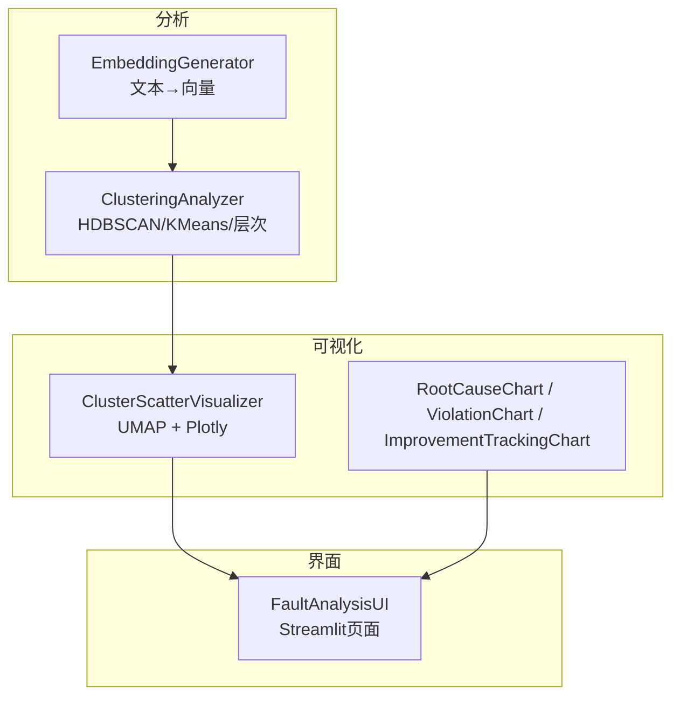
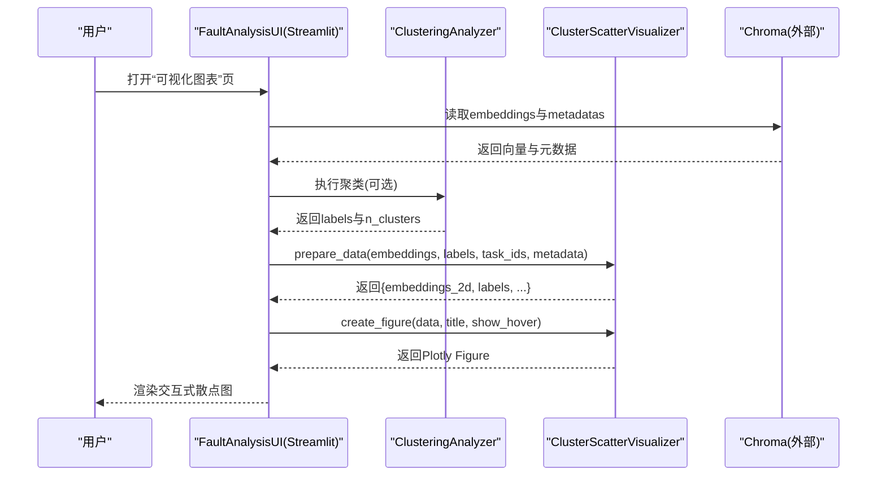
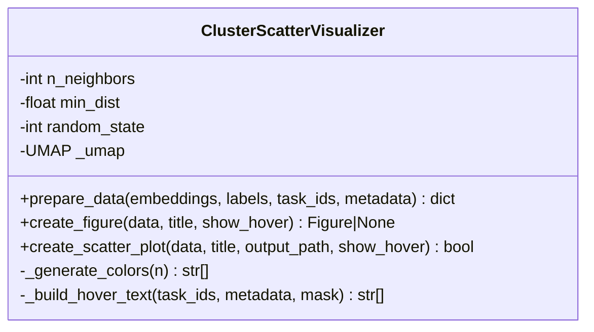
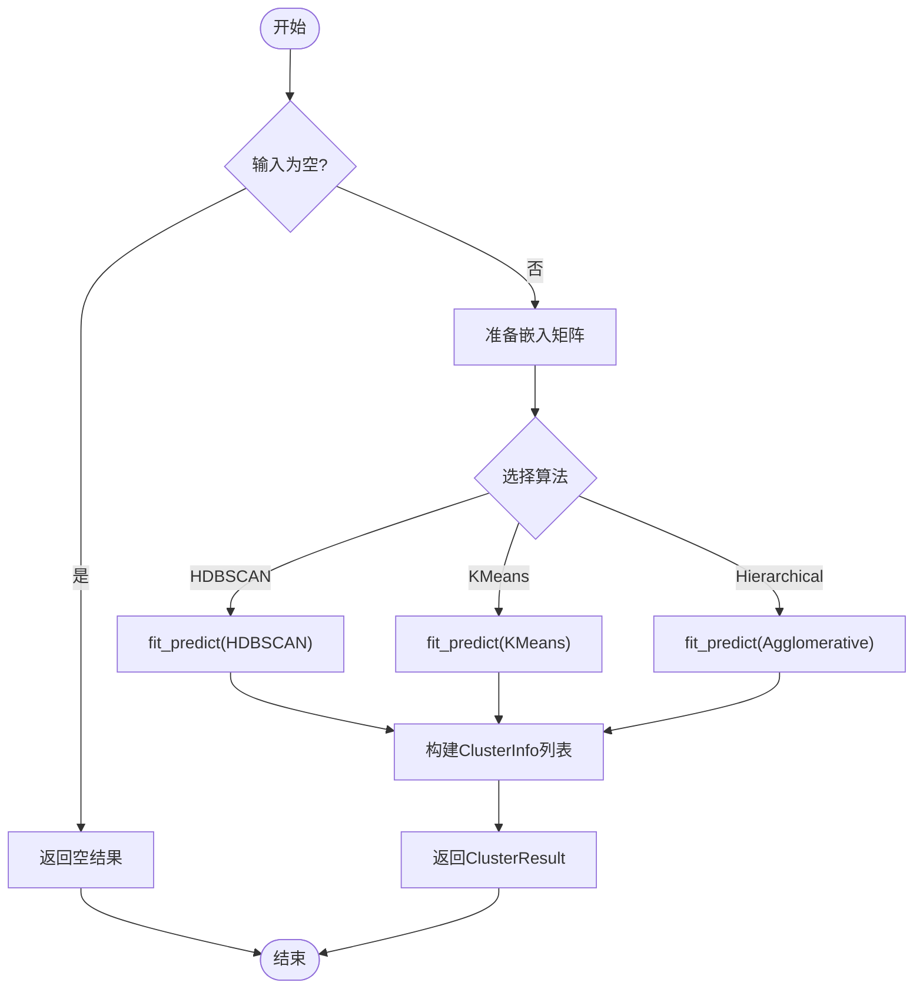
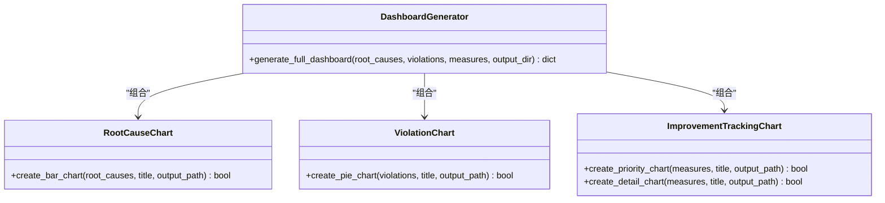
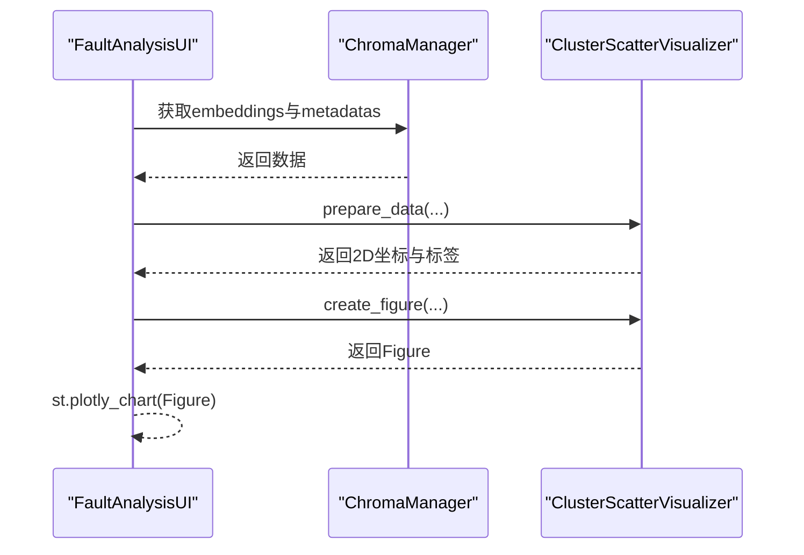
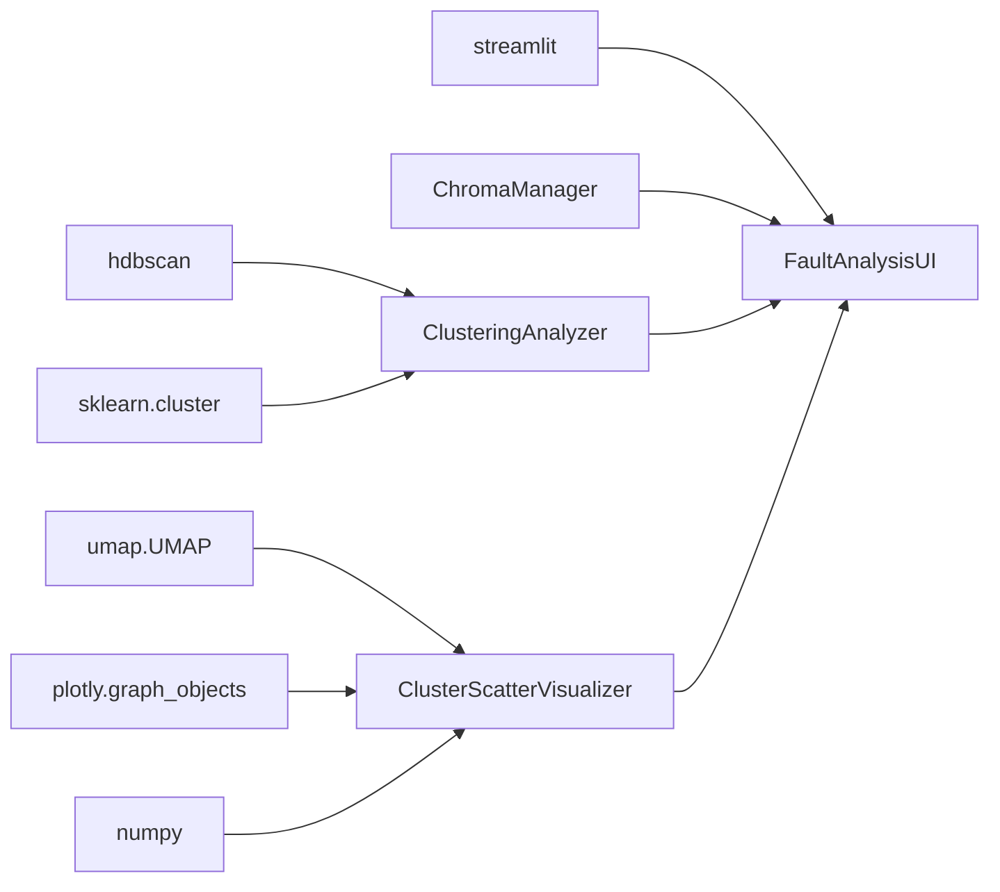

# 聚类可视化

<cite>
**本文引用的文件**   
- [src/visualization/cluster_scatter.py](file://src/visualization/cluster_scatter.py)
- [src/visualization/charts.py](file://src/visualization/charts.py)
- [src/ui/streamlit_app.py](file://src/ui/streamlit_app.py)
- [src/analysis/clustering.py](file://src/analysis/clustering.py)
- [src/embedding/generator.py](file://src/embedding/generator.py)
- [tests/visualization/test_cluster_scatter.py](file://tests/visualization/test_cluster_scatter.py)
- [docs/任务名/TECH_SELECTION_故障聚类分析.md](file://docs/任务名/TECH_SELECTION_故障聚类分析.md)
</cite>

## 目录
1. [简介](#简介)
2. [项目结构](#项目结构)
3. [核心组件](#核心组件)
4. [架构总览](#架构总览)
5. [详细组件分析](#详细组件分析)
6. [依赖关系分析](#依赖关系分析)
7. [性能与内存优化](#性能与内存优化)
8. [用户交互与配置](#用户交互与配置)
9. [使用示例与最佳实践](#使用示例与最佳实践)
10. [故障排查指南](#故障排查指南)
11. [结论](#结论)

## 简介
本技术文档聚焦“聚类可视化模块”，围绕以下目标展开：
- 说明聚类散点图的生成算法，包括UMAP降维、向量嵌入的可视化与聚类结果展示。
- 解释数据预处理流程（异常值处理、维度压缩、坐标映射）。
- 文档化用户交互能力（缩放、平移、悬停提示、点击筛选等）。
- 提供自定义配置选项（颜色方案、标记样式、布局参数）。
- 给出大数据量下的性能优化策略与内存管理技巧。
- 包含实际使用示例与最佳实践建议。

该模块以Plotly为渲染引擎，结合UMAP将高维向量嵌入投影到二维平面，按聚类标签着色并支持交互式探索。

## 项目结构
与聚类可视化直接相关的代码位于可视化层与UI集成层：
- 可视化实现：src/visualization/cluster_scatter.py（UMAP+Plotly散点图）
- 辅助图表：src/visualization/charts.py（根因分布、违规类型、改进措施追踪）
- UI集成：src/ui/streamlit_app.py（Streamlit页面调用可视化器）
- 聚类分析：src/analysis/clustering.py（HDBSCAN/KMeans/层次聚类）
- 嵌入生成：src/embedding/generator.py（文本向量化，供上游使用）
- 测试用例：tests/visualization/test_cluster_scatter.py（覆盖关键路径）
- 技术选型参考：docs/任务名/TECH_SELECTION_故障聚类分析.md（UMAP选择依据与对比）

图示来源
- [src/visualization/cluster_scatter.py:14-31](file://src/visualization/cluster_scatter.py#L14-L31)
- [src/visualization/charts.py:15-85](file://src/visualization/charts.py#L15-L85)
- [src/analysis/clustering.py:22-94](file://src/analysis/clustering.py#L22-L94)
- [src/embedding/generator.py:91-135](file://src/embedding/generator.py#L91-L135)
- [src/ui/streamlit_app.py:352-393](file://src/ui/streamlit_app.py#L352-L393)

章节来源
- [src/visualization/cluster_scatter.py:1-234](file://src/visualization/cluster_scatter.py#L1-L234)
- [src/visualization/charts.py:1-399](file://src/visualization/charts.py#L1-L399)
- [src/ui/streamlit_app.py:1-548](file://src/ui/streamlit_app.py#L1-L548)
- [src/analysis/clustering.py:1-316](file://src/analysis/clustering.py#L1-L316)
- [src/embedding/generator.py:1-427](file://src/embedding/generator.py#L1-L427)
- [tests/visualization/test_cluster_scatter.py:1-143](file://tests/visualization/test_cluster_scatter.py#L1-L143)
- [docs/任务名/TECH_SELECTION_故障聚类分析.md:150-206](file://docs/任务名/TECH_SELECTION_故障聚类分析.md#L150-L206)

## 核心组件
- ClusterScatterVisualizer：负责UMAP降维与Plotly散点图构建，支持悬停信息、颜色方案与HTML导出。
- ClusteringAnalyzer：提供多种聚类算法（HDBSCAN、K-Means、层次聚类），输出标签与簇信息。
- FaultAnalysisUI：在Streamlit中串联数据加载、聚类分析与可视化渲染。
- EmbeddingGenerator：提供文本到向量的批量生成能力（含缓存、限流、熔断），为聚类提供输入。
- Dashboard图表类：根因分布、违规类型、改进措施追踪等统计图表。

章节来源
- [src/visualization/cluster_scatter.py:14-149](file://src/visualization/cluster_scatter.py#L14-L149)
- [src/analysis/clustering.py:22-226](file://src/analysis/clustering.py#L22-L226)
- [src/ui/streamlit_app.py:352-393](file://src/ui/streamlit_app.py#L352-L393)
- [src/embedding/generator.py:91-135](file://src/embedding/generator.py#L91-L135)
- [src/visualization/charts.py:15-332](file://src/visualization/charts.py#L15-L332)

## 架构总览
从数据到可视化的端到端流程如下：
- 数据准备：从Chroma加载嵌入向量与元数据。
- 聚类分析：根据选择的算法计算标签。
- 降维可视化：使用UMAP将高维向量降至2D，按标签绘制散点图。
- 交互展示：通过Streamlit渲染Plotly图表，支持缩放、平移、悬停查看详情。

图示来源
- [src/ui/streamlit_app.py:352-393](file://src/ui/streamlit_app.py#L352-L393)
- [src/analysis/clustering.py:22-94](file://src/analysis/clustering.py#L22-L94)
- [src/visualization/cluster_scatter.py:33-149](file://src/visualization/cluster_scatter.py#L33-L149)

## 详细组件分析

### 组件A：ClusterScatterVisualizer（UMAP+Plotly散点图）
职责
- UMAP降维：将高维向量嵌入转换为2D坐标。
- 数据校验：确保输入长度一致、非空。
- 图形构建：按聚类ID分组着色，支持噪声点(-1)特殊显示。
- 交互增强：悬停文本包含任务单号、根因片段、是否违规等。
- 导出能力：保存为HTML静态页面。

关键方法
- __init__：初始化UMAP实例（n_neighbors、min_dist、random_state）。
- prepare_data：校验输入、执行fit_transform得到embeddings_2d。
- create_figure：组装Plotly Scatter traces，设置布局与模板。
- create_scatter_plot：封装create_figure并支持写入HTML。
- _generate_colors：内置Plotly调色板，超过数量时回退到qualitative.Bold。
- _build_hover_text：拼装悬停文本，截断长文本避免过长。

图示来源
- [src/visualization/cluster_scatter.py:14-149](file://src/visualization/cluster_scatter.py#L14-L149)
- [src/visualization/cluster_scatter.py:185-233](file://src/visualization/cluster_scatter.py#L185-L233)

章节来源
- [src/visualization/cluster_scatter.py:14-233](file://src/visualization/cluster_scatter.py#L14-L233)
- [tests/visualization/test_cluster_scatter.py:17-143](file://tests/visualization/test_cluster_scatter.py#L17-L143)

### 组件B：ClusteringAnalyzer（多算法聚类）
职责
- 支持HDBSCAN、K-Means、层次聚类三种算法。
- 统一输出ClusterResult（labels、n_clusters、n_noise、clusters）。
- 对cosine距离进行归一化处理，使欧氏距离等价于余弦相似度。

关键方法
- cluster_hdbscan：自动发现簇数，识别噪声点(-1)。
- cluster_kmeans：需指定簇数，无噪声点。
- cluster_hierarchical：基于AgglomerativeClustering，支持不同linkage。
- analyze_clusters：统计每个簇的根因分布与代表性根因。

图示来源
- [src/analysis/clustering.py:22-226](file://src/analysis/clustering.py#L22-L226)

章节来源
- [src/analysis/clustering.py:22-226](file://src/analysis/clustering.py#L22-L226)

### 组件C：Dashboard图表（根因/违规/改进措施）
职责
- 根因分布柱状图：按数量排序，显示占比。
- 违规类型饼图：环形图，显示数量与百分比。
- 改进措施追踪：优先级分布与详情横向条形图。

图示来源
- [src/visualization/charts.py:15-332](file://src/visualization/charts.py#L15-L332)
- [src/visualization/charts.py:335-399](file://src/visualization/charts.py#L335-L399)

章节来源
- [src/visualization/charts.py:15-399](file://src/visualization/charts.py#L15-L399)

### 组件D：UI集成（Streamlit）
职责
- 侧边栏导航与系统状态展示。
- 数据概览、相似查询、聚类分析、可视化图表、改进措施页面。
- 在“可视化图表”页面调用ClusterScatterVisualizer生成Plotly图表并渲染。

图示来源
- [src/ui/streamlit_app.py:352-393](file://src/ui/streamlit_app.py#L352-L393)

章节来源
- [src/ui/streamlit_app.py:352-393](file://src/ui/streamlit_app.py#L352-L393)

## 依赖关系分析
- ClusterScatterVisualizer依赖：
  - numpy用于数组操作。
  - plotly.graph_objects用于构建交互式图表。
  - umap.UMAP用于降维。
- ClusteringAnalyzer依赖：
  - hdbscan或sklearn.cluster（KMeans、AgglomerativeClustering）。
  - numpy用于矩阵运算。
- Streamlit UI依赖：
  - streamlit用于Web交互。
  - 调用ChromaManager获取数据。
  - 调用ClusteringAnalyzer与ClusterScatterVisualizer完成分析-可视化链路。

图示来源
- [src/visualization/cluster_scatter.py:8-11](file://src/visualization/cluster_scatter.py#L8-L11)
- [src/analysis/clustering.py:7-12](file://src/analysis/clustering.py#L7-L12)
- [src/ui/streamlit_app.py:11-15](file://src/ui/streamlit_app.py#L11-L15)

章节来源
- [src/visualization/cluster_scatter.py:8-11](file://src/visualization/cluster_scatter.py#L8-L11)
- [src/analysis/clustering.py:7-12](file://src/analysis/clustering.py#L7-L12)
- [src/ui/streamlit_app.py:11-15](file://src/ui/streamlit_app.py#L11-L15)

## 性能与内存优化
针对大数据量场景，建议采取以下策略：
- 降维前采样：当样本量过大时，先对数据进行随机采样再执行UMAP，降低时间与内存开销。
- 控制UMAP参数：适当增大n_neighbors可提升稳定性但增加计算量；减小min_dist可使簇更紧凑但可能重叠。
- 分批与增量：若需要多次更新可视化，复用已训练的UMAP模型对新数据进行transform而非重新fit。
- 内存友好：避免同时持有过多中间对象；及时释放不再使用的numpy数组引用。
- 并发与缓存：嵌入生成阶段使用LRU缓存与自适应速率限制，减少重复计算与API压力。
- 图表渲染优化：关闭不必要的hover或减少trace数量，必要时导出静态HTML离线查看。

章节来源
- [src/embedding/generator.py:13-52](file://src/embedding/generator.py#L13-L52)
- [src/embedding/generator.py:54-89](file://src/embedding/generator.py#L54-L89)
- [src/embedding/generator.py:245-310](file://src/embedding/generator.py#L245-L310)
- [docs/任务名/TECH_SELECTION_故障聚类分析.md:150-206](file://docs/任务名/TECH_SELECTION_故障聚类分析.md#L150-L206)

## 用户交互与配置
- 交互特性（由Plotly提供）：
  - 缩放与平移：鼠标滚轮缩放、拖拽平移。
  - 悬停提示：显示任务单号、根因片段、是否违规及坐标。
  - 点击筛选：点击图例可隐藏/显示对应聚类。
- 自定义配置项：
  - UMAP参数：n_neighbors、min_dist、random_state（影响降维结构与可复现性）。
  - 颜色方案：内部默认Plotly调色板，超过数量时使用qualitative.Bold。
  - 标记样式：marker.size、opacity、line.width/color。
  - 布局参数：title、xaxis_title、yaxis_title、legend位置、template、width/height。
  - 悬停开关：show_hover控制是否启用hover文本与模板。
- 导出与分享：
  - create_scatter_plot支持输出HTML文件，便于离线分享与归档。

章节来源
- [src/visualization/cluster_scatter.py:17-31](file://src/visualization/cluster_scatter.py#L17-L31)
- [src/visualization/cluster_scatter.py:68-149](file://src/visualization/cluster_scatter.py#L68-L149)
- [src/visualization/cluster_scatter.py:185-205](file://src/visualization/cluster_scatter.py#L185-L205)
- [src/visualization/cluster_scatter.py:207-233](file://src/visualization/cluster_scatter.py#L207-L233)

## 使用示例与最佳实践
- 基本流程（Streamlit页面）：
  - 在“可视化图表”页面，系统会从Chroma加载embeddings与metadatas。
  - 调用ClusterScatterVisualizer.prepare_data生成2D坐标。
  - 调用create_figure创建Plotly图表并渲染。
- 独立脚本示例（思路）：
  - 准备embeddings、labels、task_ids与metadata。
  - 实例化ClusterScatterVisualizer并传入UMAP参数。
  - 调用prepare_data与create_scatter_plot输出HTML。
- 最佳实践：
  - 合理设置n_neighbors与min_dist以获得清晰分离的簇。
  - 固定random_state保证结果可复现。
  - 对于大规模数据，先做PCA预降维至中等维度再UMAP，可显著提速。
  - 在UI中按需开启hover，避免大量点导致渲染卡顿。
  - 定期清理临时HTML文件，避免磁盘占用。

章节来源
- [src/ui/streamlit_app.py:352-393](file://src/ui/streamlit_app.py#L352-L393)
- [tests/visualization/test_cluster_scatter.py:54-110](file://tests/visualization/test_cluster_scatter.py#L54-L110)
- [docs/任务名/TECH_SELECTION_故障聚类分析.md:150-206](file://docs/任务名/TECH_SELECTION_故障聚类分析.md#L150-L206)

## 故障排查指南
- 常见错误与定位：
  - 向量数据为空：prepare_data会抛出ValueError，检查上游数据加载逻辑。
  - 长度不一致：embeddings、labels、task_ids长度必须一致，检查对齐逻辑。
  - 聚类结果为空：确认数据量与算法参数（如HDBSCAN的min_cluster_size）。
  - 图表生成失败：捕获异常并记录日志，检查Plotly环境或资源不足。
- 调试建议：
  - 打印各阶段形状与统计信息（样本数、维度、唯一标签数）。
  - 逐步缩小数据规模验证UMAP与Plotly是否正常。
  - 检查浏览器控制台是否有JS错误（HTML导出后本地打开）。

章节来源
- [src/visualization/cluster_scatter.py:51-56](file://src/visualization/cluster_scatter.py#L51-L56)
- [src/visualization/cluster_scatter.py:147-149](file://src/visualization/cluster_scatter.py#L147-L149)
- [tests/visualization/test_cluster_scatter.py:111-127](file://tests/visualization/test_cluster_scatter.py#L111-L127)

## 结论
本模块通过UMAP将高维向量嵌入投影到二维空间，结合Plotly实现交互式聚类散点图，配合Streamlit提供友好的可视化体验。其设计强调模块化与可扩展性，支持多种聚类算法与丰富的交互配置。在生产环境中，建议结合采样、缓存与参数调优策略，平衡性能与效果，确保在大体量数据下仍能提供流畅的探索与分析体验。