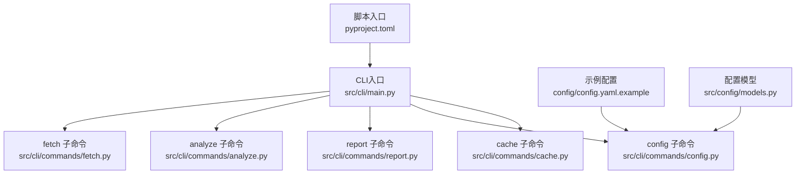
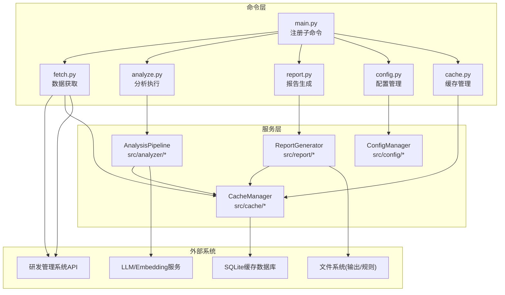
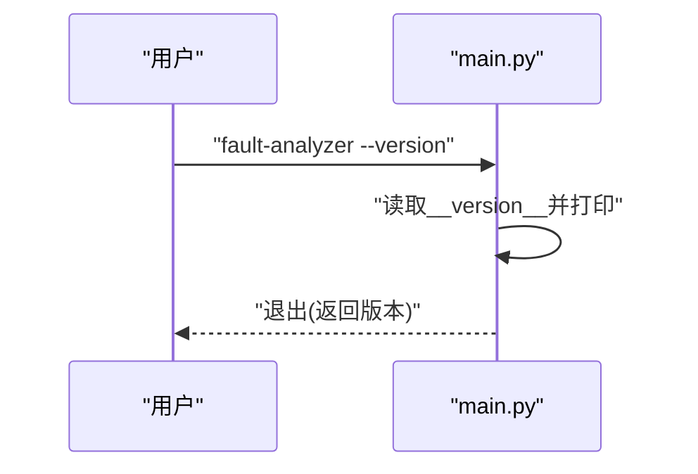
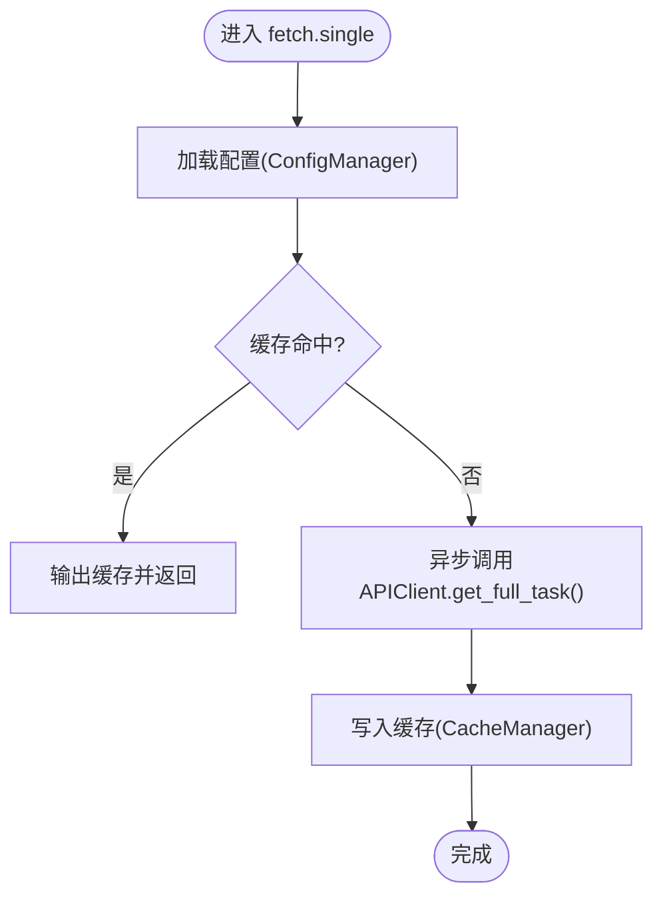
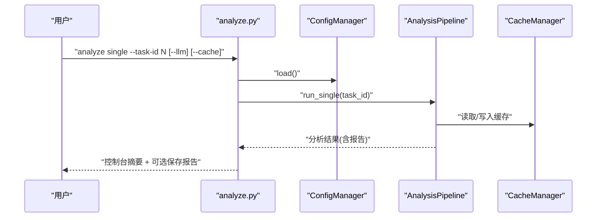
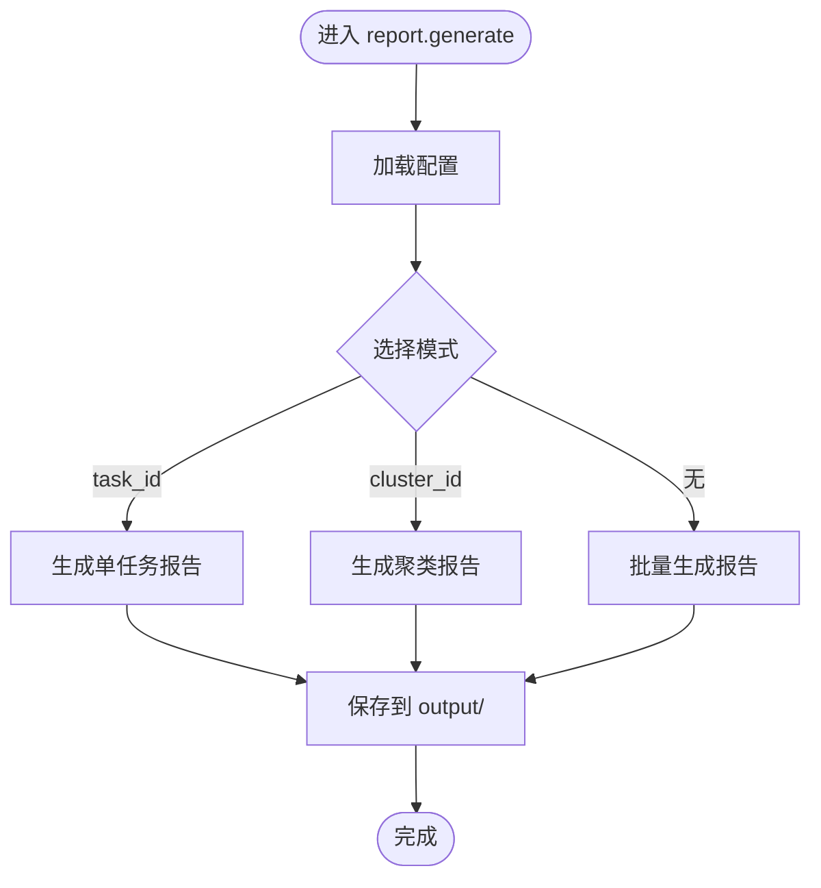
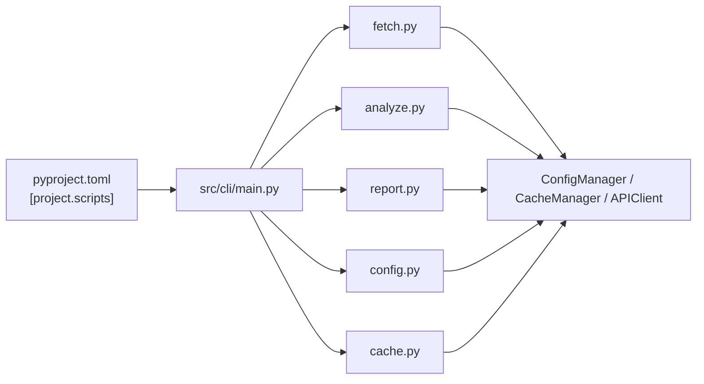

# CLI工具概览

<cite>
**本文引用的文件**   
- [src/cli/main.py](file://src/cli/main.py)
- [src/cli/commands/fetch.py](file://src/cli/commands/fetch.py)
- [src/cli/commands/analyze.py](file://src/cli/commands/analyze.py)
- [src/cli/commands/report.py](file://src/cli/commands/report.py)
- [src/cli/commands/config.py](file://src/cli/commands/config.py)
- [src/cli/commands/cache.py](file://src/cli/commands/cache.py)
- [pyproject.toml](file://pyproject.toml)
- [README.md](file://README.md)
- [config/config.yaml.example](file://config/config.yaml.example)
- [src/config/models.py](file://src/config/models.py)
- [src/utils/logger.py](file://src/utils/logger.py)
- [run_cli.py](file://run_cli.py)
</cite>

## 目录
1. [简介](#简介)
2. [项目结构](#项目结构)
3. [核心组件](#核心组件)
4. [架构总览](#架构总览)
5. [详细组件分析](#详细组件分析)
6. [依赖关系分析](#依赖关系分析)
7. [性能与输出](#性能与输出)
8. [故障排查指南](#故障排查指南)
9. [结论](#结论)
10. [附录：快速开始与最佳实践](#附录快速开始与最佳实践)

## 简介
fault-analyzer 是一款基于 Typer 的命令行工具，围绕“AI驱动的故障复盘分析”理念构建。其工作流涵盖数据获取、智能分析（含聚类与根因推断）、报告生成等阶段，并通过缓存与配置管理提升可重复性与可维护性。CLI 采用模块化命令组织，提供 fetch、analyze、report、config、cache 五大子命令族，支持单任务与批量操作，便于集成到日常研发流程中。

## 项目结构
CLI 入口位于 src/cli/main.py，通过 Typer 注册多个子命令模块；各子命令分别实现数据拉取、分析、报告、配置与缓存管理能力。全局脚本入口在 pyproject.toml 中声明，便于以 fault-analyzer 直接调用。

图表来源
- [src/cli/main.py:1-40](file://src/cli/main.py#L1-L40)
- [src/cli/commands/fetch.py:1-235](file://src/cli/commands/fetch.py#L1-L235)
- [src/cli/commands/analyze.py:1-258](file://src/cli/commands/analyze.py#L1-L258)
- [src/cli/commands/report.py:1-140](file://src/cli/commands/report.py#L1-L140)
- [src/cli/commands/config.py:1-69](file://src/cli/commands/config.py#L1-L69)
- [src/cli/commands/cache.py:1-87](file://src/cli/commands/cache.py#L1-L87)
- [pyproject.toml:66-68](file://pyproject.toml#L66-L68)
- [config/config.yaml.example:1-38](file://config/config.yaml.example#L1-L38)
- [src/config/models.py:1-144](file://src/config/models.py#L1-L144)

章节来源
- [src/cli/main.py:1-40](file://src/cli/main.py#L1-L40)
- [pyproject.toml:66-68](file://pyproject.toml#L66-L68)

## 核心组件
- 全局选项与帮助系统
  - 版本查看：支持 --version/-v 显示版本号并退出。
  - 帮助系统：Typer 自动为每个子命令与参数生成帮助信息，可通过 fault-analyzer --help 与各子命令 --help 查看。
- 模块化命令结构
  - fetch：获取单个或批量任务数据，支持强制刷新与缓存状态查询。
  - analyze：对单个或批量任务进行分析，支持是否使用 LLM、是否启用缓存、是否进行聚类分析等。
  - report：按任务或聚类生成分析报告，支持列出已生成报告。
  - config：查看、设置配置项，显示配置文件路径。
  - cache：列出、清理、统计缓存条目。
- 配置与日志
  - 配置模型集中定义于 src/config/models.py，包含 API、LLM、Embedding、Clustering、Cache、Rules、Output、Logging 等模块。
  - 日志通过 src/utils/logger.py 统一初始化，支持控制台彩色输出、JSON 格式与文件轮转。

章节来源
- [src/cli/main.py:24-36](file://src/cli/main.py#L24-L36)
- [src/cli/commands/fetch.py:19-73](file://src/cli/commands/fetch.py#L19-L73)
- [src/cli/commands/analyze.py:18-88](file://src/cli/commands/analyze.py#L18-L88)
- [src/cli/commands/report.py:17-113](file://src/cli/commands/report.py#L17-L113)
- [src/cli/commands/config.py:15-69](file://src/cli/commands/config.py#L15-L69)
- [src/cli/commands/cache.py:15-87](file://src/cli/commands/cache.py#L15-L87)
- [src/config/models.py:1-144](file://src/config/models.py#L1-L144)
- [src/utils/logger.py:34-104](file://src/utils/logger.py#L34-L104)

## 架构总览
CLI 整体遵循“命令-服务-存储/外部系统”的分层模式：
- 命令层：Typer 子命令负责参数解析、用户交互与结果展示。
- 服务层：分析流水线、报告生成器、缓存管理器、配置管理器。
- 外部系统：研发管理系统 API、LLM/Embedding 服务、本地 SQLite 缓存与文件系统。

图表来源
- [src/cli/main.py:17-21](file://src/cli/main.py#L17-L21)
- [src/cli/commands/fetch.py:11-14](file://src/cli/commands/fetch.py#L11-L14)
- [src/cli/commands/analyze.py:10-13](file://src/cli/commands/analyze.py#L10-L13)
- [src/cli/commands/report.py:9-11](file://src/cli/commands/report.py#L9-L11)
- [src/cli/commands/config.py:9](file://src/cli/commands/config.py#L9)
- [src/cli/commands/cache.py:9](file://src/cli/commands/cache.py#L9)

## 详细组件分析

### 全局入口与版本查看
- 入口点：Typer 应用名为 fault-analyzer，注册了 fetch、analyze、report、config、cache 五个子命令。
- 版本查看：--version/-v 会打印版本并立即退出。
- 帮助系统：Typer 自动生成所有命令与参数的帮助信息。

图表来源
- [src/cli/main.py:9-13](file://src/cli/main.py#L9-L13)
- [src/cli/main.py:24-36](file://src/cli/main.py#L24-L36)
- [src/__init__.py:1-4](file://src/__init__.py#L1-L4)

章节来源
- [src/cli/main.py:1-40](file://src/cli/main.py#L1-L40)

### fetch 子命令（数据获取）
- 功能要点
  - single：获取单个任务，优先从缓存读取，否则调用远程 API 并写入缓存。
  - batch：批量获取，支持 --task-ids 列表与 --query 条件提示，具备跳过缓存与失败计数。
  - status/list：查看缓存状态与列出缓存中的任务。
- 关键参数
  - task_id：任务ID（single）。
  - --force/-f：强制刷新缓存。
  - --task-ids/-t：逗号分隔的任务ID列表（batch）。
  - --query/-q：查询条件（当前仅提示，实际需后端支持）。
  - --limit/-l：批量限制数量。
  - --config/-c：指定配置文件路径。
- 错误处理
  - 配置缺失时给出明确提示并退出。
  - 网络异常与未找到任务时记录失败计数与原因。

图表来源
- [src/cli/commands/fetch.py:19-73](file://src/cli/commands/fetch.py#L19-L73)
- [src/cli/commands/fetch.py:75-165](file://src/cli/commands/fetch.py#L75-L165)
- [src/cli/commands/fetch.py:167-235](file://src/cli/commands/fetch.py#L167-L235)

章节来源
- [src/cli/commands/fetch.py:1-235](file://src/cli/commands/fetch.py#L1-L235)

### analyze 子命令（智能分析）
- 功能要点
  - single：分析单个任务，支持是否使用 LLM、是否使用缓存、可选输出报告路径。
  - batch：批量分析缓存中的任务，可选择是否进行聚类分析（HDBSCAN），并汇总结果。
  - clusters：专门执行聚类分析，输出聚类分布与明细。
- 关键参数
  - task_id：任务ID（single）。
  - --output/-o：输出报告路径（可为文件或目录）。
  - --llm/--no-llm：是否启用 LLM 分析。
  - --cache/--no-cache：是否使用缓存。
  - --from-cache/--no-cache：批量分析数据来源。
  - --cluster/--no-cluster：是否进行聚类分析。
  - --min-size：最小聚类大小。
  - --config/-c：配置文件路径。
- 输出
  - 控制台表格摘要（文本段数、标签、根因数、规范违规等）。
  - 可选将报告写入文件。

图表来源
- [src/cli/commands/analyze.py:18-88](file://src/cli/commands/analyze.py#L18-L88)
- [src/cli/commands/analyze.py:90-164](file://src/cli/commands/analyze.py#L90-L164)
- [src/cli/commands/analyze.py:166-258](file://src/cli/commands/analyze.py#L166-L258)

章节来源
- [src/cli/commands/analyze.py:1-258](file://src/cli/commands/analyze.py#L1-L258)

### report 子命令（报告生成）
- 功能要点
  - generate：按任务ID或聚类ID生成报告，或批量为所有任务生成报告。
  - list：列出 output 目录下已生成的 Markdown 报告。
- 关键参数
  - task_id：任务ID（可选）。
  - --cluster/-c：聚类ID（可选）。
  - --output/-o：输出目录（默认 ./output/）。
  - --format/-f：输出格式（默认 markdown）。
  - --config/-c：配置文件路径。
- 输出
  - 单个任务报告：task_{id}_report.md。
  - 聚类报告：cluster_{id}_report.md。
  - 批量报告：为每个任务生成独立报告。

图表来源
- [src/cli/commands/report.py:17-113](file://src/cli/commands/report.py#L17-L113)
- [src/cli/commands/report.py:116-140](file://src/cli/commands/report.py#L116-L140)

章节来源
- [src/cli/commands/report.py:1-140](file://src/cli/commands/report.py#L1-L140)

### config 子命令（配置管理）
- 功能要点
  - list：列出当前生效的配置项（API、LLM、Embedding、Clustering、Cache、Output 等）。
  - set：设置指定键值对并持久化。
  - path：显示当前使用的配置文件路径。
- 关键参数
  - --config/-c：指定配置文件路径。
  - key/value：配置键与值（set）。

章节来源
- [src/cli/commands/config.py:1-69](file://src/cli/commands/config.py#L1-L69)
- [src/config/models.py:1-144](file://src/config/models.py#L1-L144)
- [config/config.yaml.example:1-38](file://config/config.yaml.example#L1-L38)

### cache 子命令（缓存管理）
- 功能要点
  - list：列出缓存条目（前N条）。
  - clear：清除指定任务或全部缓存（支持强制模式）。
  - stats：显示缓存统计（总数、有效、过期）。
  - cleanup：清理过期缓存。
- 关键参数
  - --limit/-l：显示数量限制。
  - task_id：指定任务ID（clear）。
  - --force/-f：强制清除不询问。

章节来源
- [src/cli/commands/cache.py:1-87](file://src/cli/commands/cache.py#L1-L87)

## 依赖关系分析
- 包入口与脚本
  - pyproject.toml 中声明 fault-analyzer 与 fault-analyzer-api 两个脚本入口，前者指向 src.cli.main:app。
- 模块耦合
  - main.py 聚合各子命令模块，低耦合高内聚。
  - 各子命令通过 ConfigManager、CacheManager、APIClient、AnalysisPipeline、ReportGenerator 等共享服务，避免重复逻辑。
- 外部依赖
  - Typer 用于 CLI 框架。
  - Rich 用于终端美化输出。
  - Pydantic/Pydantic Settings 用于配置校验与加载。
  - Loguru 用于结构化日志。
  - httpx/OpenAI/LangChain 等用于外部服务调用与分析能力。

图表来源
- [pyproject.toml:66-68](file://pyproject.toml#L66-L68)
- [src/cli/main.py:17-21](file://src/cli/main.py#L17-L21)

章节来源
- [pyproject.toml:1-165](file://pyproject.toml#L1-L165)
- [src/cli/main.py:1-40](file://src/cli/main.py#L1-L40)

## 性能与输出
- 性能特性
  - 缓存优先：fetch 与 analyze 均优先使用本地缓存，减少网络与计算开销。
  - 批量处理：analyze batch/clusters 支持批量任务处理，结合进度条提升体验。
  - 异步调用：fetch 内部使用 asyncio.run 包装异步客户端调用，简化并发控制。
- 输出格式
  - 控制台：Rich 表格与进度条，清晰展示分析摘要与统计。
  - 文件：Markdown 报告，支持单任务、聚类与批量输出。
  - 日志：支持控制台彩色与 JSON 格式，可配置级别与文件轮转。
- 日志级别控制
  - 通过 LoggingConfig.level 控制（DEBUG/INFO/WARNING/ERROR/CRITICAL）。
  - 可通过 config set logging.level 或直接修改配置文件。

章节来源
- [src/cli/commands/fetch.py:48-73](file://src/cli/commands/fetch.py#L48-L73)
- [src/cli/commands/analyze.py:45-88](file://src/cli/commands/analyze.py#L45-L88)
- [src/cli/commands/report.py:55-113](file://src/cli/commands/report.py#L55-L113)
- [src/config/models.py:117-133](file://src/config/models.py#L117-L133)
- [src/utils/logger.py:34-104](file://src/utils/logger.py#L34-L104)

## 故障排查指南
- 常见错误与定位
  - 配置错误：当缺少必要配置项时，命令会打印错误并提示设置 .env 或 config/config.yaml。
  - 缓存为空：analyze/report 提示先使用 fetch 获取数据。
  - 任务不存在：fetch 返回失败计数，建议检查任务ID或网络连通性。
- 诊断步骤
  - 使用 config list 确认当前配置是否正确加载。
  - 使用 cache list/stats/cleanup 检查缓存健康度。
  - 调整日志级别至 DEBUG，观察详细过程。
  - 使用 report list 确认报告是否成功生成。
- 日志与追踪
  - 通过 LoggingConfig.file 与 rotation/retention 配置日志文件策略。
  - 使用 get_correlation_id 可在扩展中引入请求级追踪。

章节来源
- [src/cli/commands/fetch.py:26-32](file://src/cli/commands/fetch.py#L26-L32)
- [src/cli/commands/analyze.py:114-117](file://src/cli/commands/analyze.py#L114-L117)
- [src/cli/commands/report.py:95-97](file://src/cli/commands/report.py#L95-L97)
- [src/utils/logger.py:34-104](file://src/utils/logger.py#L34-L104)
- [src/utils/logger.py:119-128](file://src/utils/logger.py#L119-L128)

## 结论
fault-analyzer 以 Typer 为核心，构建了清晰的模块化 CLI 架构，覆盖数据获取、智能分析与报告生成全流程。通过配置模型与缓存机制，提升了工具的稳定性与可复用性。配合日志与输出格式化，既适合个人开发者快速上手，也便于团队集成到自动化流程中。

## 附录：快速开始与最佳实践
- 安装与启动
  - 克隆仓库后创建虚拟环境并安装依赖（参考 README）。
  - 通过 pip 安装后可直接使用 fault-analyzer 命令。
  - 也可通过 run_cli.py 启动，该脚本会在运行前加载 .env 环境变量。
- 基本用法
  - 查看帮助：fault-analyzer --help
  - 查看版本：fault-analyzer --version
  - 获取数据：fault-analyzer fetch --task-id <ID>
  - 分析任务：fault-analyzer analyze --task-id <ID>
  - 生成报告：fault-analyzer report --task-id <ID> --output ./output/
- 常用组合
  - 批量获取与分析：先 fetch batch --task-ids "1,2,3"，再 analyze batch --from-cache --cluster。
  - 仅聚类分析：analyze clusters --output ./output/。
  - 查看配置与设置：config list；config set llm.provider openai。
  - 缓存管理：cache list；cache stats；cache cleanup。
- 输出与日志
  - 报告默认输出到 ./output/，支持 markdown/html/json。
  - 日志级别可通过配置调整，必要时开启 DEBUG 定位问题。
- 与其他工具集成
  - CI/CD：在流水线中执行 fetch/analyze/report 三件套，产出报告作为工件。
  - 脚本封装：结合 run_cli.py 与环境变量注入，实现一键分析。
  - 规则与知识库：通过 rules 与 knowledge 模块扩展自定义规范与知识沉淀。

章节来源
- [README.md:12-45](file://README.md#L12-L45)
- [run_cli.py:1-14](file://run_cli.py#L1-L14)
- [pyproject.toml:66-68](file://pyproject.toml#L66-L68)
- [config/config.yaml.example:1-38](file://config/config.yaml.example#L1-L38)
