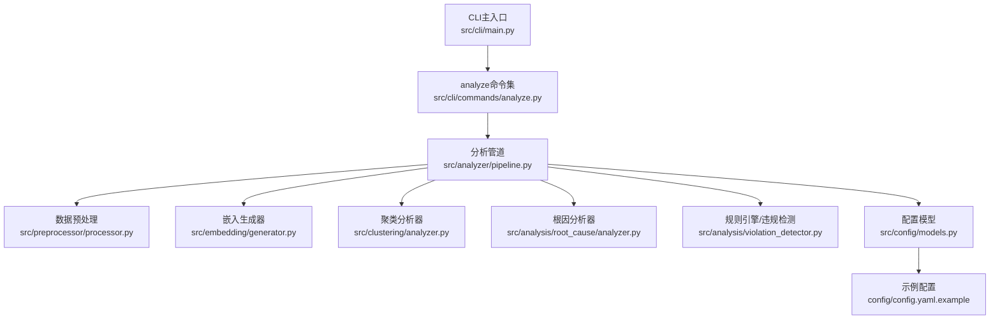
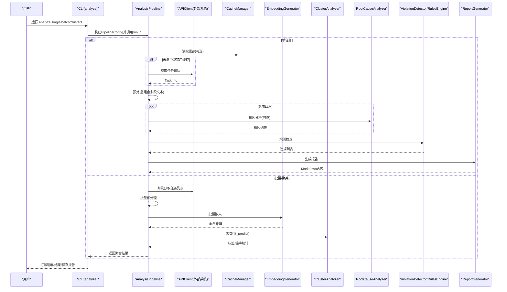
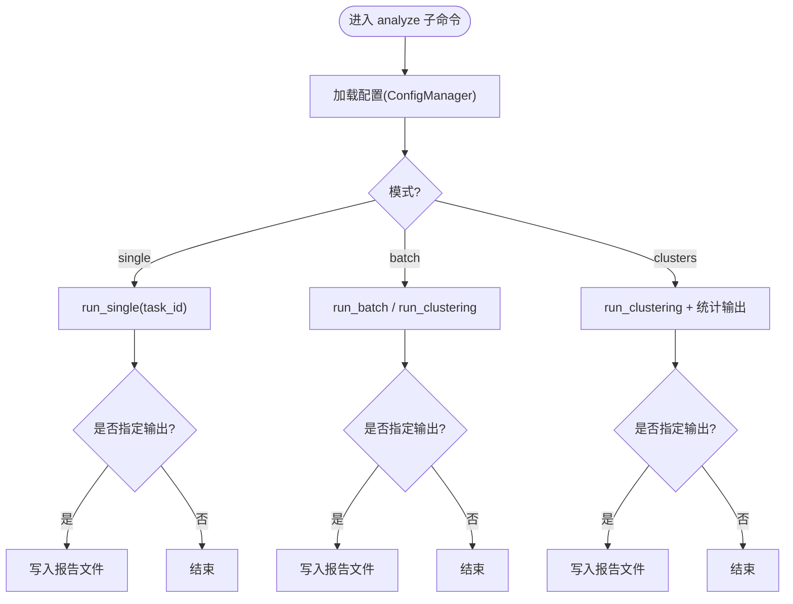
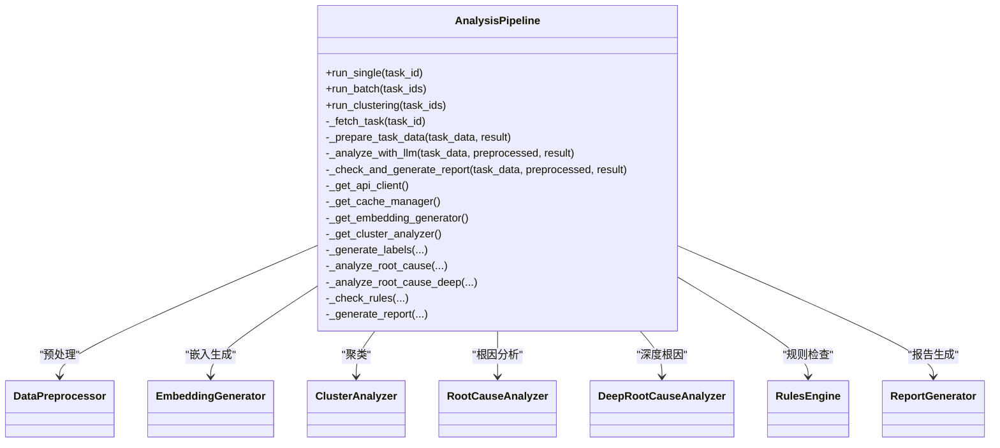
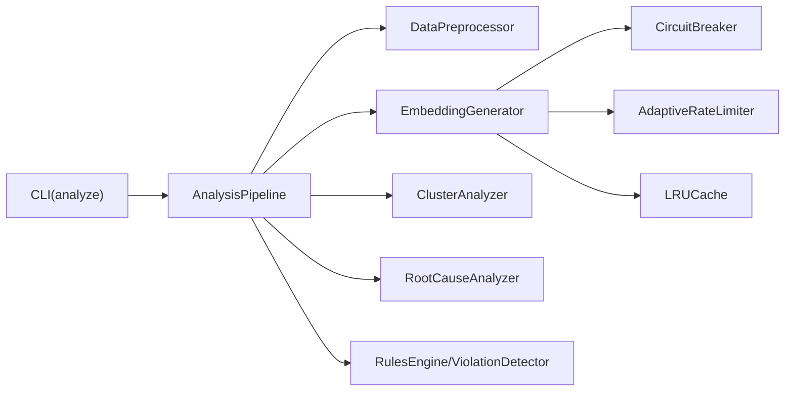

# 分析执行命令

<cite>
**本文引用的文件**   
- [src/cli/main.py](file://src/cli/main.py)
- [src/cli/commands/analyze.py](file://src/cli/commands/analyze.py)
- [src/analyzer/pipeline.py](file://src/analyzer/pipeline.py)
- [src/preprocessor/processor.py](file://src/preprocessor/processor.py)
- [src/embedding/generator.py](file://src/embedding/generator.py)
- [src/clustering/analyzer.py](file://src/clustering/analyzer.py)
- [src/analysis/root_cause/analyzer.py](file://src/analysis/root_cause/analyzer.py)
- [src/analysis/violation_detector.py](file://src/analysis/violation_detector.py)
- [src/config/models.py](file://src/config/models.py)
- [config/config.yaml.example](file://config/config.yaml.example)
- [README.md](file://README.md)
- [tests/e2e/cli/test_analyze.py](file://tests/e2e/cli/test_analyze.py)
</cite>

## 目录
1. [简介](#简介)
2. [项目结构](#项目结构)
3. [核心组件](#核心组件)
4. [架构总览](#架构总览)
5. [详细组件分析](#详细组件分析)
6. [依赖关系分析](#依赖关系分析)
7. [性能与资源管理](#性能与资源管理)
8. [故障排查指南](#故障排查指南)
9. [结论](#结论)
10. [附录：参数与配置速查](#附录参数与配置速查)

## 简介
本指南聚焦于“分析执行命令”（CLI analyze 子命令）的使用与原理，覆盖智能聚类、根因分析、规范检查等AI驱动能力；说明多阶段分析流程（数据预处理、嵌入向量生成、聚类分析、根因挖掘），并提供不同场景的配置示例、LLM提供商与Prompt模板定制方法、结果结构与含义解读、性能调优建议以及异常处理与失败恢复机制。

## 项目结构
- CLI入口注册了 analyze 子命令，提供 single、batch、clusters 三种模式。
- 分析管道由 AnalysisPipeline 编排，串联数据预处理、标签生成、根因分析、规则检查与报告生成。
- 聚类与分析能力分别由 ClusteringAnalyzer 与 RootCauseAnalyzer 实现，EmbeddingGenerator 负责文本到向量的转换。
- 配置通过 ConfigManager 加载，支持 YAML 与环境变量。

图表来源
- [src/cli/main.py:1-40](file://src/cli/main.py#L1-L40)
- [src/cli/commands/analyze.py:1-258](file://src/cli/commands/analyze.py#L1-L258)
- [src/analyzer/pipeline.py:1-468](file://src/analyzer/pipeline.py#L1-L468)
- [src/preprocessor/processor.py:1-200](file://src/preprocessor/processor.py#L1-L200)
- [src/embedding/generator.py:1-427](file://src/embedding/generator.py#L1-L427)
- [src/clustering/analyzer.py:1-316](file://src/clustering/analyzer.py#L1-L316)
- [src/analysis/root_cause/analyzer.py:1-131](file://src/analysis/root_cause/analyzer.py#L1-L131)
- [src/analysis/violation_detector.py:1-219](file://src/analysis/violation_detector.py#L1-L219)
- [src/config/models.py:1-144](file://src/config/models.py#L1-L144)
- [config/config.yaml.example:1-38](file://config/config.yaml.example#L1-L38)

章节来源
- [src/cli/main.py:1-40](file://src/cli/main.py#L1-L40)
- [src/cli/commands/analyze.py:1-258](file://src/cli/commands/analyze.py#L1-L258)
- [README.md:1-101](file://README.md#L1-L101)

## 核心组件
- CLI analyze 子命令
  - single：分析单个任务，可选输出报告路径、是否使用LLM、是否使用缓存。
  - batch：批量分析缓存中的任务，可选择是否进行聚类分析、最小聚类大小、输出路径。
  - clusters：对缓存中任务执行聚类分析并输出分布统计与报告。
- 分析管道 AnalysisPipeline
  - run_single：单任务流水线（获取数据→预处理→LLM分析→规则检查→报告）。
  - run_batch：并发执行多个单任务流水线。
  - run_clustering：批量拉取任务→预处理→批量嵌入→聚类→汇总。
- 数据预处理 DataPreprocessor
  - 从任务对象中提取标题、描述、需求、设计、提交、评审、测试、生产日志等多段文本，合并为统一输入。
- 嵌入生成器 EmbeddingGenerator
  - 支持OpenAI/Zhipu/Volcengine等Provider，具备LRU缓存、自适应限流、熔断器、并发控制与本地哈希向量回退。
- 聚类分析器 ClusteringAnalyzer
  - 支持HDBSCAN、KMeans、层次聚类，返回标签、簇信息与噪声点统计。
- 根因分析器 RootCauseAnalyzer
  - 基于LLM的深层根因分析，结合现有复盘结论，输出问题分类、初始原因、深层根因与可操作改进建议。
- 违规检测 ViolationDetector
  - 基于正则与知识库匹配识别代码/SQL/并发等常见违规模式，并可降级至LLM增强检测。
- 配置模型 ConfigModels
  - 定义API、LLM、Embedding、Clustering、Cache、Rules、Output、Logging等配置项及校验。

章节来源
- [src/cli/commands/analyze.py:1-258](file://src/cli/commands/analyze.py#L1-L258)
- [src/analyzer/pipeline.py:1-468](file://src/analyzer/pipeline.py#L1-L468)
- [src/preprocessor/processor.py:1-200](file://src/preprocessor/processor.py#L1-L200)
- [src/embedding/generator.py:1-427](file://src/embedding/generator.py#L1-L427)
- [src/clustering/analyzer.py:1-316](file://src/clustering/analyzer.py#L1-L316)
- [src/analysis/root_cause/analyzer.py:1-131](file://src/analysis/root_cause/analyzer.py#L1-L131)
- [src/analysis/violation_detector.py:1-219](file://src/analysis/violation_detector.py#L1-L219)
- [src/config/models.py:1-144](file://src/config/models.py#L1-L144)

## 架构总览
下图展示了 analyze 命令在单任务与批量/聚类模式下的调用链路与关键组件交互。

图表来源
- [src/cli/commands/analyze.py:1-258](file://src/cli/commands/analyze.py#L1-L258)
- [src/analyzer/pipeline.py:1-468](file://src/analyzer/pipeline.py#L1-L468)
- [src/preprocessor/processor.py:1-200](file://src/preprocessor/processor.py#L1-L200)
- [src/embedding/generator.py:1-427](file://src/embedding/generator.py#L1-L427)
- [src/clustering/analyzer.py:1-316](file://src/clustering/analyzer.py#L1-L316)
- [src/analysis/root_cause/analyzer.py:1-131](file://src/analysis/root_cause/analyzer.py#L1-L131)
- [src/analysis/violation_detector.py:1-219](file://src/analysis/violation_detector.py#L1-L219)

## 详细组件分析

### CLI analyze 子命令
- 入口与帮助
  - 通过 Typer 注册 analyze 子命令，支持 --help 查看用法。
- 单任务分析 analyze single
  - 参数：task_id（必填）、--output/-o、--config/-c、--llm/--no-llm、--cache/--no-cache。
  - 行为：加载配置→创建Pipeline→异步执行run_single→展示摘要→可选写入报告。
- 批量分析 analyze batch
  - 参数：--from-cache/--no-cache、--cluster/--no-cluster、--min-size、--output/-o、--config/-c。
  - 行为：从缓存读取任务→选择聚类或批量分析→输出统计与报告。
- 聚类分析 analyze clusters
  - 参数：--output/-o、--config/-c。
  - 行为：读取缓存→执行聚类→打印分布表→导出Markdown报告。

图表来源
- [src/cli/commands/analyze.py:1-258](file://src/cli/commands/analyze.py#L1-L258)

章节来源
- [src/cli/commands/analyze.py:1-258](file://src/cli/commands/analyze.py#L1-L258)
- [tests/e2e/cli/test_analyze.py:1-34](file://tests/e2e/cli/test_analyze.py#L1-L34)

### 分析管道 AnalysisPipeline
- 配置项 PipelineConfig
  - use_cache、use_llm、generate_labels、analyze_root_cause、analyze_root_cause_deep、check_rules、generate_report、output_path。
- 单任务流程 run_single
  - 获取任务数据→预处理→LLM分析（标签/根因/深度根因）→规则检查→生成报告。
- 批量与聚类
  - run_batch：并发执行多个 run_single。
  - run_clustering：并发拉取任务→批量预处理→批量嵌入→聚类→汇总统计。
- 组件初始化
  - APIClient、CacheManager、EmbeddingGenerator、ClusterAnalyzer、LabelGenerator、RootCauseAnalyzer、DeepRootCauseAnalyzer、RulesEngine、ReportGenerator按需懒加载。

图表来源
- [src/analyzer/pipeline.py:1-468](file://src/analyzer/pipeline.py#L1-L468)

章节来源
- [src/analyzer/pipeline.py:1-468](file://src/analyzer/pipeline.py#L1-L468)

### 数据预处理 DataPreprocessor
- 提取字段：标题、描述、需求、设计文档、提交信息、代码评审意见、测试用例/缺陷、生产症状/日志/堆栈/解决方案等。
- 合并策略：按类型分段拼接，限制最大长度，保留元数据便于溯源。

章节来源
- [src/preprocessor/processor.py:1-200](file://src/preprocessor/processor.py#L1-L200)

### 嵌入生成器 EmbeddingGenerator
- Provider支持：OpenAI、Zhipu、Volcengine、Local（哈希向量回退）。
- 可靠性：LRU缓存、自适应速率限制、熔断器、信号量并发控制。
- 批量优化：分块并发、缓存优先、空文本填充零向量。

章节来源
- [src/embedding/generator.py:1-427](file://src/embedding/generator.py#L1-L427)

### 聚类分析器 ClusteringAnalyzer
- 算法：HDBSCAN（默认）、KMeans、层次聚类。
- 输出：标签列表、簇数量、噪声点数量、簇中心与成员索引。
- 适用场景：自动发现相似故障模式，无需预设类别数（HDBSCAN）。

章节来源
- [src/clustering/analyzer.py:1-316](file://src/clustering/analyzer.py#L1-L316)

### 根因分析器 RootCauseAnalyzer
- 输入：任务基本信息与现有复盘结论（开发/测试侧）。
- 输出：问题分类、初始原因、深层根因、可操作改进建议、清单建议。
- Prompt模板：通过 ROOT_CAUSE_ANALYSIS_PROMPT 注入上下文。

章节来源
- [src/analysis/root_cause/analyzer.py:1-131](file://src/analysis/root_cause/analyzer.py#L1-L131)

### 违规检测 ViolationDetector
- 规则库：内置正则模式（空捕获、连接泄漏、非线程安全集合、System.out、SQL注入、索引列函数等）。
- LLM增强：当解析失败时回退到正则检测，保证可用性。

章节来源
- [src/analysis/violation_detector.py:1-219](file://src/analysis/violation_detector.py#L1-L219)

### 配置模型与示例
- 配置项涵盖：API、LLM、Embedding、Clustering、Cache、Rules、Output、Logging。
- 示例配置：config/config.yaml.example 提供默认值与常用选项。

章节来源
- [src/config/models.py:1-144](file://src/config/models.py#L1-L144)
- [config/config.yaml.example:1-38](file://config/config.yaml.example#L1-L38)

## 依赖关系分析
- CLI 层依赖分析管道与配置管理器。
- 分析管道依赖各功能组件（预处理、嵌入、聚类、根因、规则、报告）。
- 嵌入生成器依赖外部LLM服务与内部缓存/熔断/限流组件。
- 聚类分析器依赖数值计算库与聚类算法库。

图表来源
- [src/cli/commands/analyze.py:1-258](file://src/cli/commands/analyze.py#L1-L258)
- [src/analyzer/pipeline.py:1-468](file://src/analyzer/pipeline.py#L1-L468)
- [src/embedding/generator.py:1-427](file://src/embedding/generator.py#L1-L427)

## 性能与资源管理
- 并发控制
  - 批量分析使用 asyncio.gather 并发执行单任务流水线。
  - 嵌入生成使用信号量限制并发度，避免压垮外部服务。
- 速率限制与熔断
  - 自适应QPS调整，失败退避、成功恢复。
  - 熔断器在连续失败后快速失败，等待重置时间后再尝试。
- 缓存策略
  - 嵌入结果LRU缓存，TTL过期清理，减少重复计算。
  - 任务数据缓存（SQLite/文件/内存）降低外部API压力。
- 批处理优化
  - 嵌入批量接口优先，分块处理，空文本用零向量占位。
- 资源建议
  - 根据数据规模调整 max_concurrency、batch_size、min_cluster_size、min_samples。
  - 合理设置 timeout、retry、embedding.batch_size 以平衡吞吐与稳定性。

[本节为通用指导，不直接分析具体文件]

## 故障排查指南
- 配置错误
  - 现象：启动即报错提示缺少必要配置项。
  - 处理：检查 .env 或 config/config.yaml 中 API_BASE_URL、LLM_PROVIDER、LLM_API_KEY、EMBEDDING_PROVIDER 等。
- 无缓存任务
  - 现象：批量/聚类提示缓存中没有任务数据。
  - 处理：先使用 fetch 命令获取任务数据，再执行 analyze。
- LLM不可用
  - 现象：根因/标签分析返回空结果。
  - 处理：确认 provider 与 api_key 配置正确；必要时关闭 use_llm 仅做规则检查与聚类。
- 熔断触发
  - 现象：嵌入生成抛出熔断错误。
  - 处理：等待重置时间后重试；降低并发或增大超时；检查网络与鉴权。
- 聚类效果不佳
  - 现象：簇数量过少或噪声过多。
  - 处理：调整 min_cluster_size、min_samples、metric；尝试不同算法（kmeans/hierarchical）。

章节来源
- [src/cli/commands/analyze.py:1-258](file://src/cli/commands/analyze.py#L1-L258)
- [src/embedding/generator.py:1-427](file://src/embedding/generator.py#L1-L427)
- [src/clustering/analyzer.py:1-316](file://src/clustering/analyzer.py#L1-L316)

## 结论
analyze 子命令提供了从单任务到批量/聚类的完整分析链路，结合LLM驱动的标签与根因分析、规则检查与可视化报告，形成闭环的故障复盘工具。通过合理的配置与性能调优，可在大规模数据下稳定高效地运行。

[本节为总结性内容，不直接分析具体文件]

## 附录：参数与配置速查

- CLI 参数
  - analyze single
    - task_id（必填）
    - --output/-o：输出报告路径
    - --config/-c：配置文件路径
    - --llm/--no-llm：是否使用LLM分析
    - --cache/--no-cache：是否使用缓存
  - analyze batch
    - --from-cache/--no-cache：从缓存读取
    - --cluster/--no-cluster：是否进行聚类分析
    - --min-size：最小聚类大小
    - --output/-o：输出报告路径
    - --config/-c：配置文件路径
  - analyze clusters
    - --output/-o：输出报告路径
    - --config/-c：配置文件路径

- 配置项（节选）
  - llm.provider/model/api_key/temperature/max_tokens/base_url
  - embedding.provider/model/api_key/base_url/batch_size
  - clustering.algorithm/min_cluster_size/min_samples/metric
  - cache.enabled/ttl/storage/db_path
  - rules.builtin_enabled/custom_paths
  - output.format/directory
  - logging.level/format/file

- 结果结构（PipelineResult 关键字段）
  - task_id、preprocessed、labels、root_causes、deep_root_causes、violations、cluster_id、report、error

- 典型场景示例
  - 简单分析：单任务+关闭LLM+开启缓存
  - 深度分析：单任务+开启LLM+深度根因+规则检查
  - 批量分析：批量任务+缓存+可选聚类
  - 离线聚类：仅聚类+自定义阈值+本地向量回退

章节来源
- [src/cli/commands/analyze.py:1-258](file://src/cli/commands/analyze.py#L1-L258)
- [src/analyzer/pipeline.py:1-468](file://src/analyzer/pipeline.py#L1-L468)
- [src/config/models.py:1-144](file://src/config/models.py#L1-L144)
- [config/config.yaml.example:1-38](file://config/config.yaml.example#L1-L38)
- [README.md:1-101](file://README.md#L1-L101)
