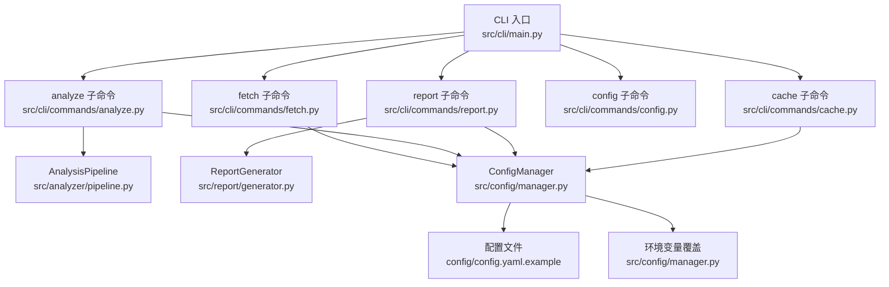
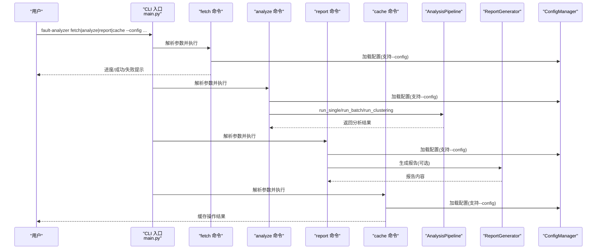
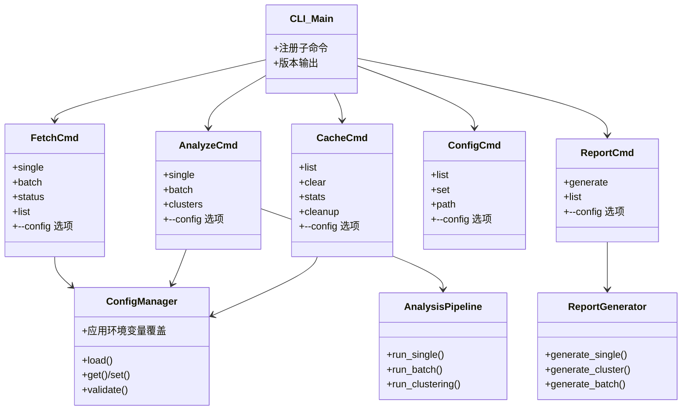

# 命令行工具

<cite>
**本文引用的文件**   
- [src/cli/main.py](file://src/cli/main.py)
- [src/cli/commands/fetch.py](file://src/cli/commands/fetch.py)
- [src/cli/commands/analyze.py](file://src/cli/commands/analyze.py)
- [src/cli/commands/report.py](file://src/cli/commands/report.py)
- [src/cli/commands/config.py](file://src/cli/commands/config.py)
- [src/cli/commands/cache.py](file://src/cli/commands/cache.py)
- [src/analyzer/pipeline.py](file://src/analyzer/pipeline.py)
- [src/report/generator.py](file://src/report/generator.py)
- [src/config/manager.py](file://src/config/manager.py)
- [config/config.yaml.example](file://config/config.yaml.example)
- [pyproject.toml](file://pyproject.toml)
- [run_cli.py](file://run_cli.py)
- [README.md](file://README.md)
- [docs/TROUBLESHOOTING.md](file://docs/TROUBLESHOOTING.md)
- [src/utils/logger.py](file://src/utils/logger.py)
</cite>

## 更新摘要
**所做更改**   
- 更新了缓存管理命令的--config选项支持说明
- 增强了配置灵活性相关的使用示例
- 完善了所有子命令的配置参数一致性说明

## 目录
1. [简介](#简介)
2. [项目结构](#项目结构)
3. [核心组件](#核心组件)
4. [架构总览](#架构总览)
5. [详细命令手册](#详细命令手册)
6. [依赖关系分析](#依赖关系分析)
7. [性能与扩展建议](#性能与扩展建议)
8. [故障排除指南](#故障排除指南)
9. [结论](#结论)
10. [附录](#附录)

## 简介
本手册面向使用"fault-analyzer"命令行工具的用户，覆盖数据获取、分析执行、报告生成、配置管理、缓存管理等全部功能。文档提供从简单任务到复杂批处理的完整工作流示例，说明配置文件与环境变量用法，并给出调试、日志查看、常见问题排查以及与其他工具集成和自动化部署的最佳实践。

**更新** 所有缓存命令现在一致支持--config选项，提升了用户体验和配置灵活性。

## 项目结构
命令行入口通过 Typer 组织子命令，包含 fetch、analyze、report、config、cache 五大模块；分析流程由 AnalysisPipeline 编排，报告由 ReportGenerator 生成，配置由 ConfigManager 加载与校验。

图表来源
- [src/cli/main.py:1-40](file://src/cli/main.py#L1-L40)
- [src/cli/commands/fetch.py:1-235](file://src/cli/commands/fetch.py#L1-L235)
- [src/cli/commands/analyze.py:1-258](file://src/cli/commands/analyze.py#L1-L258)
- [src/cli/commands/report.py:1-140](file://src/cli/commands/report.py#L1-L140)
- [src/cli/commands/config.py:1-69](file://src/cli/commands/config.py#L1-L69)
- [src/cli/commands/cache.py:1-87](file://src/cli/commands/cache.py#L1-L87)
- [src/analyzer/pipeline.py:1-468](file://src/analyzer/pipeline.py#L1-L468)
- [src/report/generator.py:1-790](file://src/report/generator.py#L1-L790)
- [src/config/manager.py:1-268](file://src/config/manager.py#L1-L268)
- [config/config.yaml.example:1-38](file://config/config.yaml.example#L1-L38)

章节来源
- [src/cli/main.py:1-40](file://src/cli/main.py#L1-L40)
- [pyproject.toml:66-68](file://pyproject.toml#L66-L68)
- [README.md:31-45](file://README.md#L31-L45)

## 核心组件
- CLI 主程序：注册子命令并提供版本信息输出。
- fetch：从研发管理系统拉取任务详情，支持单条与批量，带缓存与进度展示。
- analyze：对单个或批量任务进行分析（标签、根因、规范检查），可选聚类，支持报告输出。
- report：基于缓存结果生成单任务、聚类或批量报告，支持多种格式。
- config：查看、设置、显示配置文件路径。
- cache：列出、清理、统计、过期清理等缓存操作，**新增统一的--config选项支持**。
- AnalysisPipeline：编排预处理、LLM 分析、规则检查、报告生成与聚类。
- ReportGenerator：模板渲染与多格式输出（Markdown/HTML/JSON/PDF）。
- ConfigManager：YAML/JSON 配置加载、合并、环境覆盖、类型校验。

**更新** 缓存管理命令现在与其他所有子命令保持一致的--config选项支持，允许用户在任何缓存操作中指定自定义配置文件路径。

章节来源
- [src/cli/main.py:1-40](file://src/cli/main.py#L1-L40)
- [src/cli/commands/fetch.py:1-235](file://src/cli/commands/fetch.py#L1-L235)
- [src/cli/commands/analyze.py:1-258](file://src/cli/commands/analyze.py#L1-L258)
- [src/cli/commands/report.py:1-140](file://src/cli/commands/report.py#L1-L140)
- [src/cli/commands/config.py:1-69](file://src/cli/commands/config.py#L1-L69)
- [src/cli/commands/cache.py:1-87](file://src/cli/commands/cache.py#L1-L87)
- [src/analyzer/pipeline.py:1-468](file://src/analyzer/pipeline.py#L1-L468)
- [src/report/generator.py:1-790](file://src/report/generator.py#L1-L790)
- [src/config/manager.py:1-268](file://src/config/manager.py#L1-L268)

## 架构总览
下图展示了从 CLI 到分析流水线再到报告生成的端到端调用关系。

**更新** 所有子命令现在都支持--config选项，包括之前可能缺失的缓存命令。

图表来源
- [src/cli/main.py:1-40](file://src/cli/main.py#L1-L40)
- [src/cli/commands/fetch.py:1-235](file://src/cli/commands/fetch.py#L1-L235)
- [src/cli/commands/analyze.py:1-258](file://src/cli/commands/analyze.py#L1-L258)
- [src/cli/commands/report.py:1-140](file://src/cli/commands/report.py#L1-L140)
- [src/cli/commands/cache.py:1-87](file://src/cli/commands/cache.py#L1-L87)
- [src/analyzer/pipeline.py:1-468](file://src/analyzer/pipeline.py#L1-L468)
- [src/report/generator.py:1-790](file://src/report/generator.py#L1-L790)
- [src/config/manager.py:1-268](file://src/config/manager.py#L1-L268)

## 详细命令手册

### 全局选项与运行方式
- 安装后通过脚本名 fault-analyzer 调用，或通过 Python 启动器 run_cli.py 自动加载 .env。
- 常用全局开关：--version/-v 显示版本。
- **新增** 所有子命令现在统一支持 --config 选项用于指定配置文件路径。

章节来源
- [pyproject.toml:66-68](file://pyproject.toml#L66-L68)
- [run_cli.py:1-14](file://run_cli.py#L1-L14)
- [src/cli/main.py:24-36](file://src/cli/main.py#L24-L36)

### 配置管理（config）
- 列出当前配置：查看 API、LLM、Embedding、Clustering、Cache、Output 等关键项。
- 设置配置值：通过点号键路径设置，如 llm.provider。
- 显示配置文件路径：默认 ./config/config.yaml，也可通过 --config 指定。

常用示例
- 查看配置：fault-analyzer config list
- 设置 LLM 提供商：fault-analyzer config set llm.provider openai
- 指定配置文件：fault-analyzer config list --config /path/to/config.yaml

章节来源
- [src/cli/commands/config.py:1-69](file://src/cli/commands/config.py#L1-L69)
- [src/config/manager.py:183-268](file://src/config/manager.py#L183-L268)
- [config/config.yaml.example:1-38](file://config/config.yaml.example#L1-L38)

### 数据获取（fetch）
- single：获取单个任务，支持强制刷新缓存。
- batch：批量获取任务，支持逗号分隔的任务 ID 列表；查询条件仅提示，当前以 task_ids 为主。
- status：查看缓存状态（整体统计或指定任务）。
- list：列出缓存中的任务（可限制数量）。

常用示例
- 获取单个任务：fault-analyzer fetch single 12345
- 批量获取：fault-analyzer fetch batch -t 1,2,3 -f
- 查看缓存统计：fault-analyzer fetch status
- 列出缓存任务：fault-analyzer fetch list -n 20
- **新增** 使用自定义配置：fault-analyzer fetch single 12345 --config /custom/path/config.yaml

章节来源
- [src/cli/commands/fetch.py:19-73](file://src/cli/commands/fetch.py#L19-L73)
- [src/cli/commands/fetch.py:75-164](file://src/cli/commands/fetch.py#L75-L164)
- [src/cli/commands/fetch.py:167-235](file://src/cli/commands/fetch.py#L167-L235)

### 分析执行（analyze）
- single：分析单个任务，支持是否使用 LLM、是否使用缓存、输出报告路径。
- batch：批量分析缓存中的任务，可选择是否进行聚类分析，最小聚类大小可调，支持输出汇总报告。
- clusters：对缓存中任务进行聚类分析，输出聚类分布与报告。

常用示例
- 单任务分析：fault-analyzer analyze single 12345 -o ./output/task_12345_report.md
- 批量分析（含聚类）：fault-analyzer analyze batch --cluster --min-size 3 -o ./output/batch_analysis_report.md
- 仅聚类：fault-analyzer analyze clusters -o ./output/cluster_analysis_report.md
- **新增** 使用自定义配置：fault-analyzer analyze batch --cluster --config /dev/config.yaml

章节来源
- [src/cli/commands/analyze.py:18-88](file://src/cli/commands/analyze.py#L18-L88)
- [src/cli/commands/analyze.py:90-164](file://src/cli/commands/analyze.py#L90-L164)
- [src/cli/commands/analyze.py:166-258](file://src/cli/commands/analyze.py#L166-L258)
- [src/analyzer/pipeline.py:105-226](file://src/analyzer/pipeline.py#L105-L226)

### 报告生成（report）
- generate：根据任务ID、聚类ID或全量缓存生成报告，支持输出目录与格式选择。
- list：列出已生成的报告文件及大小。

常用示例
- 生成单任务报告：fault-analyzer report generate 12345 -o ./output
- 生成聚类报告：fault-analyzer report generate --cluster 0 -o ./output
- 批量生成：fault-analyzer report generate -o ./output
- 列出报告：fault-analyzer report list -o ./output
- **新增** 使用自定义配置：fault-analyzer report generate --cluster 0 --config /staging/config.yaml

章节来源
- [src/cli/commands/report.py:17-114](file://src/cli/commands/report.py#L17-L114)
- [src/cli/commands/report.py:116-140](file://src/cli/commands/report.py#L116-L140)
- [src/report/generator.py:250-393](file://src/report/generator.py#L250-393)

### 缓存管理（cache）
- list：列出缓存条目（可限制数量）。
- clear：清除指定任务或全部缓存（支持强制模式）。
- stats：显示缓存统计（总数、有效、过期）。
- cleanup：清理过期缓存。

**更新** 所有缓存命令现在都支持 --config 选项，允许在缓存操作中指定自定义配置文件路径。

常用示例
- 列出缓存：fault-analyzer cache list -l 20
- 清空全部：fault-analyzer cache clear -f
- 查看统计：fault-analyzer cache stats
- 清理过期：fault-analyzer cache cleanup
- **新增** 使用自定义配置：fault-analyzer cache list --config /environmental/config.yaml
- **新增** 使用自定义配置：fault-analyzer cache clear --config /environmental/config.yaml -f
- **新增** 使用自定义配置：fault-analyzer cache stats --config /environmental/config.yaml
- **新增** 使用自定义配置：fault-analyzer cache cleanup --config /environmental/config.yaml

章节来源
- [src/cli/commands/cache.py:15-87](file://src/cli/commands/cache.py#L15-L87)

### 高级用法与工作流
- 脚本集成：在 Python 脚本中通过 run_cli.py 加载 .env 后直接调用 app()。
- 管道操作：将 report list 的输出重定向至外部工具进行二次处理。
- 自动化部署：结合 CI/CD 定时触发 fetch -> analyze -> report 流水线。
- **新增** 多环境配置管理：通过 --config 选项在不同环境中切换配置文件。

常用工作流示例
- 开发环境：fault-analyzer analyze batch --config ./config/dev.yaml
- 测试环境：fault-analyzer analyze batch --config ./config/test.yaml  
- 生产环境：fault-analyzer analyze batch --config ./config/prod.yaml

章节来源
- [run_cli.py:1-14](file://run_cli.py#L1-L14)
- [README.md:31-45](file://README.md#L31-L45)

## 依赖关系分析
- CLI 子命令均依赖 ConfigManager 读取配置；analyze 进一步依赖 AnalysisPipeline；report 依赖 ReportGenerator；fetch 与 cache 依赖缓存管理器。
- 配置优先级：默认配置 < YAML/JSON 文件 < 环境变量覆盖。
- **更新** 所有子命令现在都支持统一的 --config 选项传递机制。

**更新** 所有命令类现在都包含 --config 选项支持。

图表来源
- [src/cli/main.py:1-40](file://src/cli/main.py#L1-L40)
- [src/cli/commands/fetch.py:1-235](file://src/cli/commands/fetch.py#L1-L235)
- [src/cli/commands/analyze.py:1-258](file://src/cli/commands/analyze.py#L1-L258)
- [src/cli/commands/report.py:1-140](file://src/cli/commands/report.py#L1-L140)
- [src/cli/commands/config.py:1-69](file://src/cli/commands/config.py#L1-L69)
- [src/cli/commands/cache.py:1-87](file://src/cli/commands/cache.py#L1-L87)
- [src/config/manager.py:1-268](file://src/config/manager.py#L1-L268)
- [src/analyzer/pipeline.py:1-468](file://src/analyzer/pipeline.py#L1-L468)
- [src/report/generator.py:1-790](file://src/report/generator.py#L1-L790)

## 性能与扩展建议
- 启用缓存：减少重复网络请求与 LLM 调用，提升吞吐。
- 调整嵌入批大小：平衡速度与内存占用。
- 选择合适的聚类参数：最小聚类大小与样本数影响聚类效果与耗时。
- 使用轻量模型：在满足质量前提下降低延迟与成本。
- **新增** 利用多配置文件优化：为不同环境创建专用配置文件，避免运行时参数冲突。

章节来源
- [src/config/manager.py:191-243](file://src/config/manager.py#L191-L243)
- [config/config.yaml.example:12-26](file://config/config.yaml.example#L12-L26)
- [src/analyzer/pipeline.py:184-226](file://src/analyzer/pipeline.py#L184-L226)

## 故障排除指南
- 常见安装与依赖问题：Python 版本、系统依赖缺失、镜像源切换。
- 配置问题：.env 未加载、配置验证失败、必需项缺失、--config 路径错误。
- API 调用问题：认证失败、超时、接口 404。
- LLM 服务问题：认证失败、超时、模型不存在。
- 嵌入与聚类问题：生成失败、速度慢、结果为空、效果不佳。
- 性能与内存问题：分析慢、启动慢、OOM。
- 数据存储问题：ChromaDB/SQLite 错误、权限问题。
- 日志问题：未生成、级别不生效。
- 测试与 API 服务问题：端口占用、500 错误、速率限制。
- Docker/Kubernetes 部署问题：构建失败、容器无法启动、网络与存储绑定。

**更新** 新增了 --config 选项相关的故障排除指导。

章节来源
- [docs/TROUBLESHOOTING.md:1-800](file://docs/TROUBLESHOOTING.md#L1-L800)

## 结论
本命令行工具围绕"获取-分析-报告"的核心链路，提供了完善的 CLI 能力与灵活的配置体系。**最新增强** 所有子命令现在都支持统一的 --config 选项，显著提升了配置管理的灵活性和用户体验。通过合理的缓存策略、参数调优与日志诊断，可在生产环境中稳定高效地支撑大规模故障复盘与聚类分析。

## 附录

### 配置文件与环境变量
- 配置文件位置与示例：./config/config.yaml.example
- 环境变量覆盖映射（部分）：API_BASE_URL、DEVCLOUD_TOKEN、LLM_PROVIDER、LLM_MODEL、LLM_API_KEY、EMBEDDING_PROVIDER、EMBEDDING_MODEL、CACHE_ENABLED、CACHE_TTL、OUTPUT_DIRECTORY、LOG_LEVEL 等。
- **新增** 多环境配置最佳实践：为开发、测试、生产环境分别创建配置文件，通过 --config 选项动态切换。

章节来源
- [config/config.yaml.example:1-38](file://config/config.yaml.example#L1-L38)
- [src/config/manager.py:191-243](file://src/config/manager.py#L191-L243)

### 输出格式与结果文件结构
- 报告格式：Markdown、HTML、JSON、PDF（PDF 以 HTML 包装）。
- 典型输出文件命名：task_{id}_report.md、cluster_{id}_report.md、batch_analysis_report.md。
- 报告内容结构：基本信息、分段详情、分类标签、根因分析、改进建议、时间戳等。

章节来源
- [src/report/generator.py:250-393](file://src/report/generator.py#L250-393)
- [src/report/generator.py:739-790](file://src/report/generator.py#L739-L790)

### 调试模式与日志查看
- 日志级别：通过 LOG_LEVEL 控制（DEBUG/INFO/WARNING/ERROR/CRITICAL）。
- 日志文件：可通过 LOG_FILE 指定路径；支持 JSON 格式输出。
- 结构化日志：提供 StructuredLogger 与 get_logger 便捷接口。

章节来源
- [src/utils/logger.py:34-104](file://src/utils/logger.py#L34-L104)
- [src/utils/logger.py:106-160](file://src/utils/logger.py#L106-L160)
- [src/config/manager.py:218-222](file://src/config/manager.py#L218-L222)

### 与其他工具的集成与最佳实践
- 与 CI/CD 集成：在流水线中依次执行 fetch、analyze、report，并将产物归档。
- 与外部系统对接：通过 API 客户端与研发管理系统交互；通过报告输出供 BI 或知识库消费。
- 安全与合规：避免在日志中泄露敏感信息；使用环境变量注入密钥。
- **新增** 配置管理最佳实践：使用版本控制系统管理配置文件模板，通过环境变量注入敏感信息，使用 --config 选项实现环境隔离。

章节来源
- [README.md:31-45](file://README.md#L31-L45)
- [src/analyzer/pipeline.py:245-256](file://src/analyzer/pipeline.py#L245-L256)
