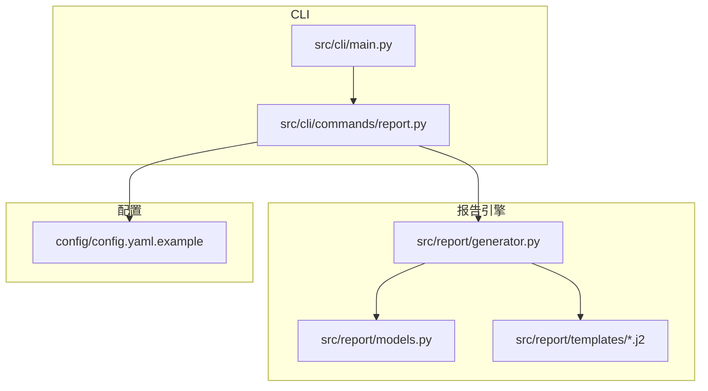
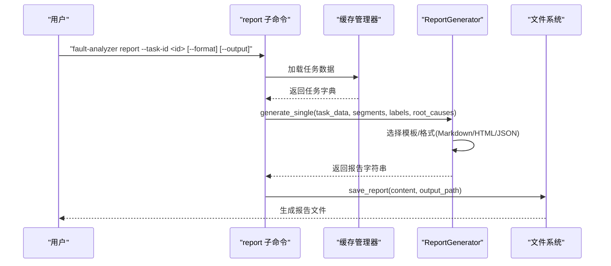
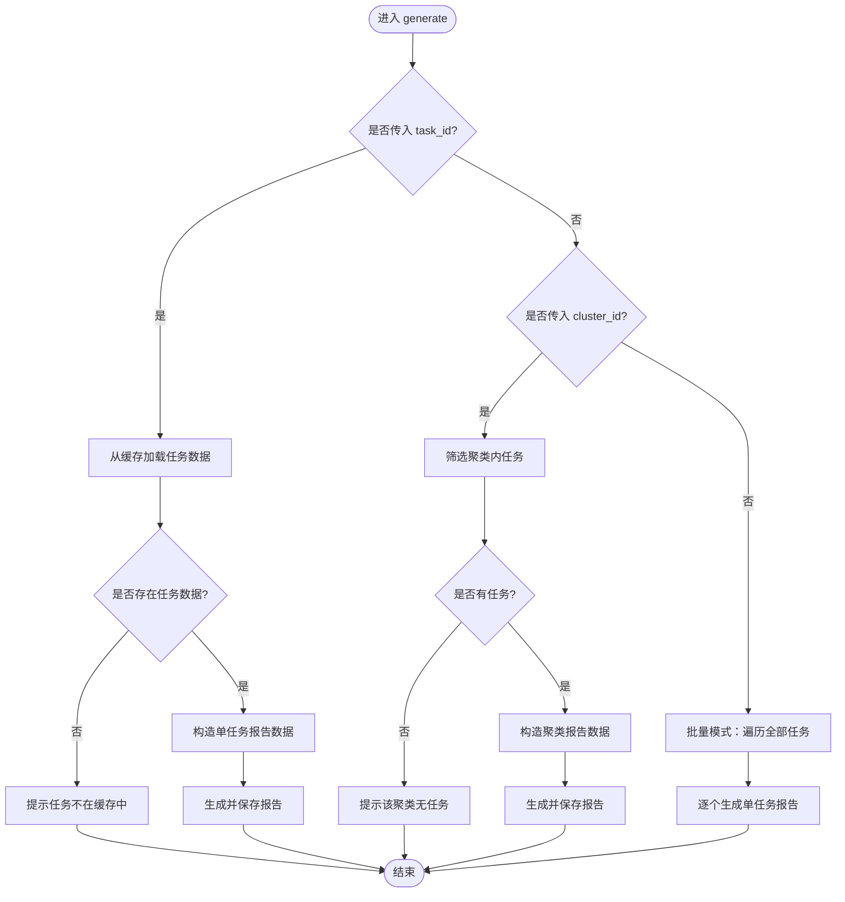
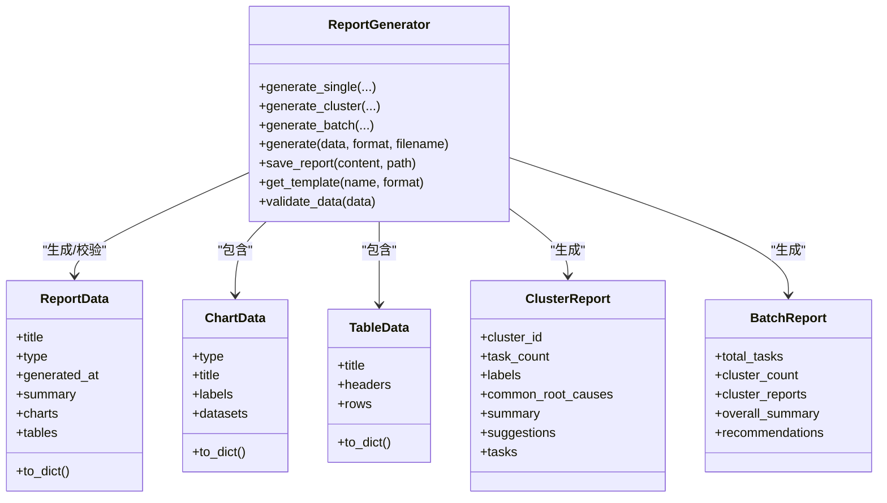
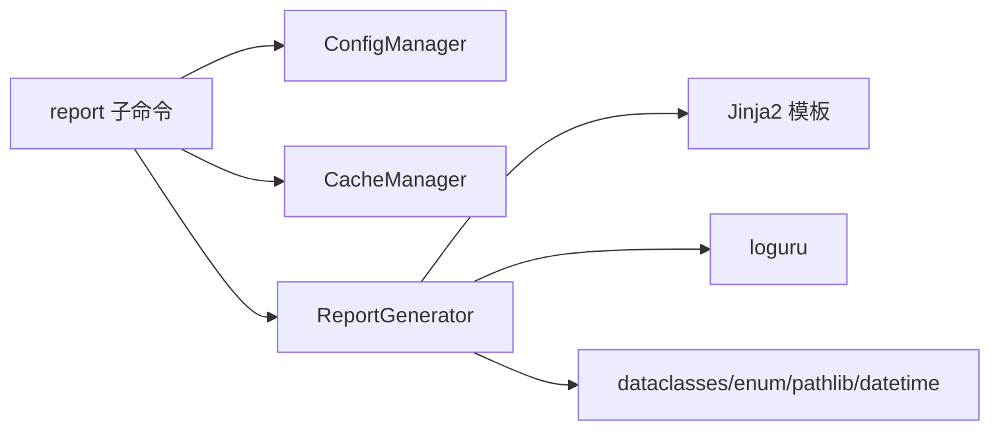

# 报告生成命令

<cite>
**本文引用的文件**
- [src/cli/commands/report.py](file://src/cli/commands/report.py)
- [src/cli/main.py](file://src/cli/main.py)
- [src/report/generator.py](file://src/report/generator.py)
- [src/report/models.py](file://src/report/models.py)
- [src/report/templates/single.md.j2](file://src/report/templates/single.md.j2)
- [src/report/templates/cluster.md.j2](file://src/report/templates/cluster.md.j2)
- [src/report/templates/batch.md.j2](file://src/report/templates/batch.md.j2)
- [config/config.yaml.example](file://config/config.yaml.example)
- [tests/e2e/cli/test_report.py](file://tests/e2e/cli/test_report.py)
- [tests/report/test_generator.py](file://tests/report/test_generator.py)
</cite>

## 目录
1. [简介](#简介)
2. [项目结构](#项目结构)
3. [核心组件](#核心组件)
4. [架构总览](#架构总览)
5. [详细组件分析](#详细组件分析)
6. [依赖关系分析](#依赖关系分析)
7. [性能与扩展性](#性能与扩展性)
8. [故障排查指南](#故障排查指南)
9. [结论](#结论)
10. [附录：使用手册与最佳实践](#附录使用手册与最佳实践)

## 简介
本手册聚焦于“report”子命令的报告生成功能，覆盖以下要点：
- 支持的输出格式：Markdown、HTML、JSON（PDF为占位实现）
- 模板定制与样式配置
- 批量与个性化报告生成
- 报告内容组织（摘要、详情、根因、建议等）
- 不同受众的配置示例（技术团队与管理层）
- 输出路径管理与命名规则
- 版本控制与历史对比思路
- 自动化与CI/CD集成建议

## 项目结构
与报告生成相关的代码主要分布在 CLI 命令层与报告引擎层：
- CLI 命令层：负责参数解析、缓存读取、调用报告生成器并落盘
- 报告引擎层：负责数据组装、模板渲染、多格式输出、保存文件
- 模板目录：提供可替换的Jinja2模板，支持自定义外观与结构
- 配置示例：提供默认输出格式与目录等配置项参考

图表来源
- [src/cli/main.py:1-40](file://src/cli/main.py#L1-L40)
- [src/cli/commands/report.py:1-140](file://src/cli/commands/report.py#L1-L140)
- [src/report/generator.py:1-790](file://src/report/generator.py#L1-L790)
- [src/report/models.py:1-52](file://src/report/models.py#L1-L52)
- [config/config.yaml.example:1-38](file://config/config.yaml.example#L1-L38)

章节来源
- [src/cli/main.py:1-40](file://src/cli/main.py#L1-L40)
- [src/cli/commands/report.py:1-140](file://src/cli/commands/report.py#L1-L140)
- [src/report/generator.py:1-790](file://src/report/generator.py#L1-L790)
- [src/report/models.py:1-52](file://src/report/models.py#L1-L52)
- [config/config.yaml.example:1-38](file://config/config.yaml.example#L1-L38)

## 核心组件
- report 子命令
  - generate：根据任务ID或聚类ID生成报告；未指定时执行批量生成
  - list：列出已生成的报告文件（仅统计 .md）
- ReportGenerator
  - 支持 Markdown、HTML、JSON 三种格式（PDF为占位）
  - 支持单任务、聚类、批量三类报告
  - 支持自定义模板目录与默认模板回退
  - 内置数据结构：ReportData、ChartData、TableData、ClusterReport、BatchReport
- 模板系统
  - single.md.j2：单任务报告模板
  - cluster.md.j2：聚类报告模板
  - batch.md.j2：批量报告模板

章节来源
- [src/cli/commands/report.py:17-140](file://src/cli/commands/report.py#L17-L140)
- [src/report/generator.py:222-790](file://src/report/generator.py#L222-L790)
- [src/report/models.py:1-52](file://src/report/models.py#L1-L52)
- [src/report/templates/single.md.j2:1-58](file://src/report/templates/single.md.j2#L1-L58)
- [src/report/templates/cluster.md.j2:1-36](file://src/report/templates/cluster.md.j2#L1-L36)
- [src/report/templates/batch.md.j2:1-31](file://src/report/templates/batch.md.j2#L1-L31)

## 架构总览
下图展示了从CLI到报告落盘的完整流程。

图表来源
- [src/cli/commands/report.py:17-113](file://src/cli/commands/report.py#L17-L113)
- [src/report/generator.py:250-304](file://src/report/generator.py#L250-L304)
- [src/report/generator.py:702-706](file://src/report/generator.py#L702-L706)

## 详细组件分析

### CLI 命令层：report 子命令
- 功能入口
  - generate：支持按 task_id、cluster_id 或无参批量模式
  - list：列出输出目录下所有 .md 报告及大小
- 关键行为
  - 读取配置与缓存路径，初始化缓存管理器
  - 根据输入参数决定生成策略（单任务/聚类/批量）
  - 自动创建输出目录并按命名规则写入文件
  - 对缺失任务或缺少缓存给出友好提示

图表来源
- [src/cli/commands/report.py:17-113](file://src/cli/commands/report.py#L17-L113)

章节来源
- [src/cli/commands/report.py:17-140](file://src/cli/commands/report.py#L17-L140)

### 报告引擎层：ReportGenerator
- 支持的报告类型与格式
  - 类型：summary、detailed、clustering、root_cause、trend
  - 格式：markdown、html、json（pdf为占位实现）
- 核心方法
  - generate_single：生成单任务报告（优先使用自定义模板，失败回退默认模板）
  - generate_cluster：生成聚类报告
  - generate_batch：生成批量报告
  - generate：统一入口，校验数据后按格式生成并可选保存到文件
  - save_report：将内容写入目标路径
- 模板机制
  - 若提供 template_dir 且存在，则通过 FileSystemLoader 加载对应 j2 模板
  - 未找到自定义模板时，回退至内置模板常量（DEFAULT_TEMPLATE、CLUSTER_TEMPLATE、BATCH_TEMPLATE）
- 数据结构
  - ReportData：通用报告数据容器（标题、类型、时间、摘要、图表、表格）
  - ChartData/TableData：图表与表格数据封装
  - ClusterReport/BatchReport：聚类和批量报告模型

图表来源
- [src/report/generator.py:222-790](file://src/report/generator.py#L222-L790)
- [src/report/models.py:1-52](file://src/report/models.py#L1-L52)

章节来源
- [src/report/generator.py:222-790](file://src/report/generator.py#L222-L790)
- [src/report/models.py:1-52](file://src/report/models.py#L1-L52)

### 模板与样式定制
- 内置模板
  - single.md.j2：单任务报告（基本信息、故障详情、分类标签、根因分析、改进建议、生成时间）
  - cluster.md.j2：聚类报告（概览、标签、共同特征、共同根因、建议）
  - batch.md.j2：批量报告（总体概览、聚类汇总、整体建议）
- 自定义模板
  - 通过 ReportGenerator(template_dir=...) 指定模板目录
  - 模板命名约定：single.md.j2、cluster.md.j2、batch.md.j2
  - 当自定义模板渲染异常时，自动回退到内置模板常量
- HTML 样式
  - 内置 HTML 模板包含基础 CSS（字体、颜色、区块间距、表格样式）
  - 可通过自定义 HTML 模板扩展样式与交互

章节来源
- [src/report/templates/single.md.j2:1-58](file://src/report/templates/single.md.j2#L1-L58)
- [src/report/templates/cluster.md.j2:1-36](file://src/report/templates/cluster.md.j2#L1-L36)
- [src/report/templates/batch.md.j2:1-31](file://src/report/templates/batch.md.j2#L1-L31)
- [src/report/generator.py:225-248](file://src/report/generator.py#L225-L248)
- [src/report/generator.py:250-304](file://src/report/generator.py#L250-L304)
- [src/report/generator.py:589-673](file://src/report/generator.py#L589-L673)

### 输出路径管理与命名规则
- 输出目录
  - CLI 默认 ./output/，可通过 --output/-o 指定
  - 自动生成目录（不存在则创建）
- 文件命名
  - 单任务：task_{task_id}_report.md
  - 聚类：cluster_{cluster_id}_report.md
  - 批量：每个任务独立生成同名文件
- 扩展名映射
  - markdown -> .md
  - html -> .html
  - json -> .json
  - pdf -> .pdf（当前实现为HTML包装）

章节来源
- [src/cli/commands/report.py:55-113](file://src/cli/commands/report.py#L55-L113)
- [src/report/generator.py:567-576](file://src/report/generator.py#L567-L576)
- [src/report/generator.py:416-423](file://src/report/generator.py#L416-L423)

### 报告内容组织结构
- 单任务报告
  - 基本信息：任务ID、标题、概要
  - 故障详情：分段内容（segments）
  - 分类标签：名称、类别、置信度、描述
  - 根因分析：原因类型、描述、证据列表、置信度
  - 改进建议：编号列表
  - 元信息：生成时间
- 聚类报告
  - 概览：聚类ID、任务数量
  - 标签：聚类维度标签
  - 共同特征：总结文本
  - 共同根因：共性原因列表
  - 建议：改进建议
- 批量报告
  - 总体概览：总任务数、聚类数量
  - 聚类汇总：各聚类摘要与标签
  - 整体建议：全局优化建议

章节来源
- [src/report/templates/single.md.j2:1-58](file://src/report/templates/single.md.j2#L1-L58)
- [src/report/templates/cluster.md.j2:1-36](file://src/report/templates/cluster.md.j2#L1-L36)
- [src/report/templates/batch.md.j2:1-31](file://src/report/templates/batch.md.j2#L1-L31)

### 不同受众的配置示例
- 技术团队报告（Markdown/HTML）
  - 侧重：详细分段、根因证据、标签置信度、改进建议
  - 建议：使用 Markdown 便于版本管理；HTML 便于在浏览器查看
- 管理层摘要（Markdown/JSON）
  - 侧重：总体概览、聚类汇总、整体建议
  - 建议：使用 JSON 导出结构化数据供BI工具消费；或使用批量模板生成高层摘要

章节来源
- [src/report/generator.py:305-393](file://src/report/generator.py#L305-L393)
- [src/report/templates/batch.md.j2:1-31](file://src/report/templates/batch.md.j2#L1-L31)

### 版本控制与历史对比
- 基于 Git 的版本化
  - 将输出目录纳入版本控制（注意忽略大文件或敏感数据）
  - 以日期或版本号作为分支/标签，便于回溯
- 历史对比
  - 使用 diff 工具对比同一任务在不同版本的报告差异
  - 对于 JSON 输出，可使用结构化比较工具进行字段级对比

[本节为概念性说明，不直接分析具体文件，故无章节来源]

### 自动化与CI/CD集成建议
- 触发时机
  - 在分析完成后自动执行 report 命令
  - 定时任务定期批量生成最新报告
- 产物归档
  - 将报告作为构建产物上传到制品库或发布到文档站点
- 质量门禁
  - 检查报告生成是否成功
  - 校验必要字段是否存在（如标题、生成时间）

章节来源
- [tests/e2e/cli/test_report.py:1-33](file://tests/e2e/cli/test_report.py#L1-L33)
- [README.md:31-45](file://README.md#L31-L45)

## 依赖关系分析
- CLI 依赖
  - typer：命令行框架
  - rich：终端输出美化
  - ConfigManager/CacheManager：配置与缓存访问
  - ReportGenerator：报告生成核心
- 报告引擎依赖
  - Jinja2：模板渲染
  - loguru：日志记录
  - dataclasses/enum/pathlib/datetime：标准库支撑

图表来源
- [src/cli/commands/report.py:1-16](file://src/cli/commands/report.py#L1-L16)
- [src/report/generator.py:1-11](file://src/report/generator.py#L1-L11)

章节来源
- [src/cli/commands/report.py:1-16](file://src/cli/commands/report.py#L1-L16)
- [src/report/generator.py:1-11](file://src/report/generator.py#L1-L11)

## 性能与扩展性
- 模板渲染性能
  - 自定义模板首次加载会建立环境，后续复用
  - 建议在批量模式下复用 ReportGenerator 实例以减少开销
- I/O 性能
  - 批量生成时顺序写入，避免并发写冲突
  - 输出目录应位于本地磁盘以提升写入速度
- 可扩展点
  - 新增格式：在 ReportFormat 枚举中添加新值，并在生成逻辑中补充对应分支
  - 新增模板：在 templates 目录添加新的 j2 模板，并通过 get_template 获取

[本节为一般性指导，不直接分析具体文件，故无章节来源]

## 故障排查指南
- 常见错误
  - 配置错误：缺少必要配置项导致无法初始化
    - 现象：提示配置错误并要求设置 .env 或 config/config.yaml
    - 处理：检查配置项是否齐全
  - 任务不在缓存中：未先 fetch 或未正确缓存
    - 现象：提示任务不在缓存中，请先使用 fetch 命令
    - 处理：先执行 fetch 再执行 report
  - 聚类无任务：指定的聚类ID下没有任务
    - 现象：提示该聚类中没有任务
    - 处理：确认聚类ID是否正确
  - 输出目录不存在：list 命令找不到报告
    - 现象：提示输出目录不存在或未找到报告文件
    - 处理：确保 --output 指向正确的目录
- 验证与测试
  - 使用单元测试验证生成逻辑与数据校验
  - 使用端到端测试验证 CLI 帮助信息与基本行为

章节来源
- [src/cli/commands/report.py:26-97](file://src/cli/commands/report.py#L26-L97)
- [src/cli/commands/report.py:116-140](file://src/cli/commands/report.py#L116-L140)
- [tests/report/test_generator.py:228-258](file://tests/report/test_generator.py#L228-L258)
- [tests/e2e/cli/test_report.py:13-32](file://tests/e2e/cli/test_report.py#L13-L32)

## 结论
report 子命令提供了灵活、可扩展的报告生成能力，支持多种格式与模板定制，适用于不同受众与场景。结合缓存与配置管理，可实现从数据拉取到报告产出的完整闭环。通过合理的命名规范与版本化管理，能够持续沉淀与分析历史成果。

[本节为总结性内容，不直接分析具体文件，故无章节来源]

## 附录：使用手册与最佳实践

### 命令速查
- 生成单任务报告
  - fault-analyzer report --task-id <ID> [--format markdown|html|json] [--output ./reports/]
- 生成聚类报告
  - fault-analyzer report --cluster <ID> [--output ./reports/]
- 批量生成报告
  - fault-analyzer report [--output ./reports/]
- 列出已生成报告
  - fault-analyzer report list [--output ./reports/]

章节来源
- [src/cli/commands/report.py:17-140](file://src/cli/commands/report.py#L17-L140)

### 输出格式与扩展名
- markdown -> .md
- html -> .html
- json -> .json
- pdf -> .pdf（当前实现为HTML包装）

章节来源
- [src/report/generator.py:567-576](file://src/report/generator.py#L567-L576)

### 模板定制步骤
- 准备自定义模板目录
- 放置 single.md.j2 / cluster.md.j2 / batch.md.j2
- 启动时通过 ReportGenerator(template_dir=...) 指定目录
- 若模板渲染异常，系统将回退到内置模板

章节来源
- [src/report/generator.py:225-248](file://src/report/generator.py#L225-L248)
- [src/report/generator.py:250-304](file://src/report/generator.py#L250-L304)

### 配置文件参考
- 输出格式与目录
  - output.format: "markdown"
  - output.directory: "./output/"
- 其他相关配置（LLM、Embedding、Clustering、Cache、Rules、Logging）

章节来源
- [config/config.yaml.example:32-38](file://config/config.yaml.example#L32-L38)

### 批量与个性化
- 批量生成：不传 task_id 或 cluster_id 时，遍历缓存中的全部任务逐一生成
- 个性化定制：通过自定义模板调整章节结构与展示样式；通过 JSON 输出进行二次加工

章节来源
- [src/cli/commands/report.py:90-113](file://src/cli/commands/report.py#L90-L113)
- [src/report/generator.py:346-393](file://src/report/generator.py#L346-L393)

### CI/CD 集成建议
- 在分析流水线末尾追加 report 命令
- 将报告产物作为构建结果上传
- 增加报告生成成功的断言用例

章节来源
- [tests/e2e/cli/test_report.py:13-32](file://tests/e2e/cli/test_report.py#L13-L32)
- [README.md:31-45](file://README.md#L31-L45)