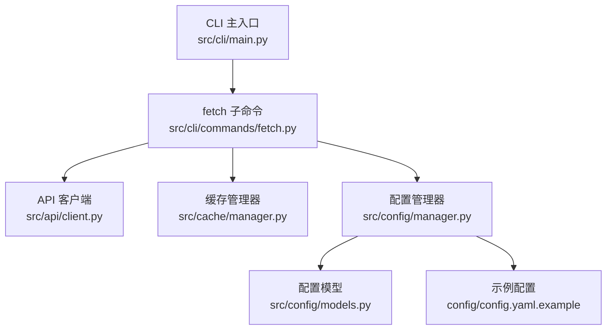
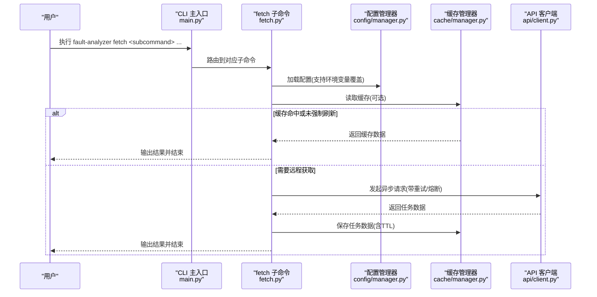
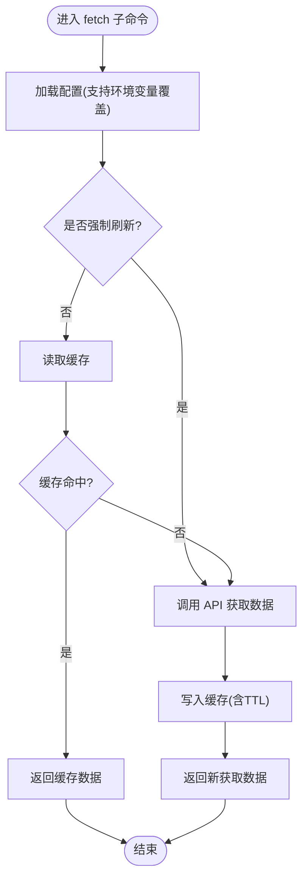
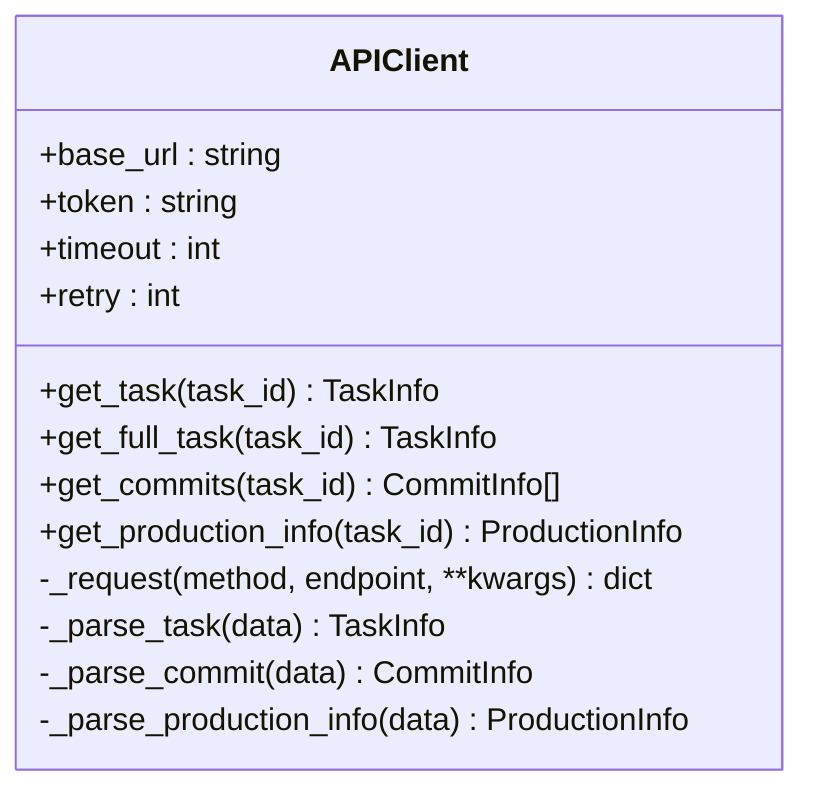
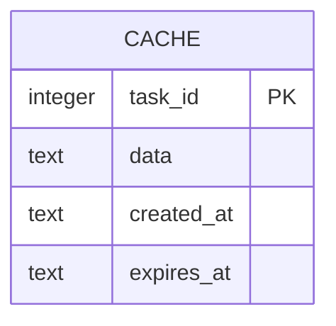
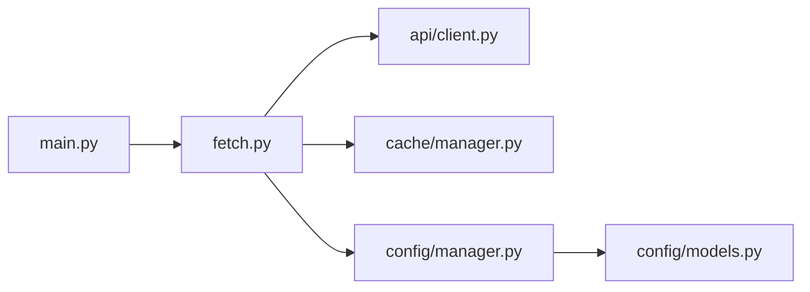

# 数据获取命令

<cite>
**本文引用的文件**
- [src/cli/main.py](file://src/cli/main.py)
- [src/cli/commands/fetch.py](file://src/cli/commands/fetch.py)
- [src/api/client.py](file://src/api/client.py)
- [src/cache/manager.py](file://src/cache/manager.py)
- [src/config/manager.py](file://src/config/manager.py)
- [src/config/models.py](file://src/config/models.py)
- [config/config.yaml.example](file://config/config.yaml.example)
- [tests/e2e/cli/test_fetch.py](file://tests/e2e/cli/test_fetch.py)
- [fetch_batch_live.py](file://fetch_batch_live.py)
</cite>

## 目录
1. [简介](#简介)
2. [项目结构](#项目结构)
3. [核心组件](#核心组件)
4. [架构总览](#架构总览)
5. [详细组件分析](#详细组件分析)
6. [依赖关系分析](#依赖关系分析)
7. [性能与缓存策略](#性能与缓存策略)
8. [错误处理与重试机制](#错误处理与重试机制)
9. [使用示例](#使用示例)
10. [常见问题排查](#常见问题排查)
11. [结论](#结论)

## 简介
本文件面向“数据获取命令”（CLI 子命令 fetch），提供从研发管理系统拉取故障单数据的完整使用说明。内容覆盖：
- 单个任务获取、批量任务处理
- 认证配置与数据源设置
- 缓存策略与增量更新
- 错误处理与重试机制
- 定时任务集成建议
- 常见问题的排查方法

说明：当前实现中，批量获取通过显式指定任务 ID 列表完成；查询条件参数暂仅做提示，未启用后端筛选能力。

## 项目结构
与 fetch 命令直接相关的代码组织如下：
- CLI 入口注册：主程序将 fetch 子命令挂载到顶层应用
- fetch 子命令：提供 single、batch、status、list 四个子命令
- API 客户端：封装对研发管理系统的异步 HTTP 调用、重试与熔断
- 缓存管理器：基于 SQLite 的任务级缓存，支持 TTL 过期与统计
- 配置管理：加载 YAML/JSON 配置与环境变量覆盖，提供类型校验

图表来源
- [src/cli/main.py:1-40](file://src/cli/main.py#L1-L40)
- [src/cli/commands/fetch.py:1-235](file://src/cli/commands/fetch.py#L1-L235)
- [src/api/client.py:1-340](file://src/api/client.py#L1-L340)
- [src/cache/manager.py:1-165](file://src/cache/manager.py#L1-L165)
- [src/config/manager.py:1-268](file://src/config/manager.py#L1-L268)
- [src/config/models.py:1-144](file://src/config/models.py#L1-L144)
- [config/config.yaml.example:1-38](file://config/config.yaml.example#L1-L38)

章节来源
- [src/cli/main.py:1-40](file://src/cli/main.py#L1-L40)
- [src/cli/commands/fetch.py:1-235](file://src/cli/commands/fetch.py#L1-L235)

## 核心组件
- fetch 子命令
  - single：获取单个任务，优先读缓存，必要时刷新并写入缓存
  - batch：按任务 ID 列表批量获取，跳过已缓存项，统计成功/失败/跳过数量
  - status：查看某任务缓存状态或整体缓存统计
  - list：列出缓存中的任务（标题、状态等）
- API 客户端
  - 异步请求、自动重试、指数退避、熔断器保护
  - 统一解析任务详情、提交信息、生产信息
- 缓存管理器
  - SQLite 存储，TTL 控制，过期清理与统计
- 配置管理
  - 支持 YAML/JSON 配置文件与环境变量覆盖
  - 强类型校验，确保必填字段与取值范围

章节来源
- [src/cli/commands/fetch.py:1-235](file://src/cli/commands/fetch.py#L1-L235)
- [src/api/client.py:1-340](file://src/api/client.py#L1-L340)
- [src/cache/manager.py:1-165](file://src/cache/manager.py#L1-L165)
- [src/config/manager.py:1-268](file://src/config/manager.py#L1-L268)
- [src/config/models.py:1-144](file://src/config/models.py#L1-L144)

## 架构总览
下图展示了 fetch 命令的端到端流程：CLI 接收参数，加载配置，选择是否命中缓存，未命中则通过 APIClient 发起异步请求，成功后落盘至缓存，并提供状态与列表查询能力。

图表来源
- [src/cli/main.py:1-40](file://src/cli/main.py#L1-L40)
- [src/cli/commands/fetch.py:1-235](file://src/cli/commands/fetch.py#L1-L235)
- [src/config/manager.py:1-268](file://src/config/manager.py#L1-L268)
- [src/cache/manager.py:1-165](file://src/cache/manager.py#L1-L165)
- [src/api/client.py:1-340](file://src/api/client.py#L1-L340)

## 详细组件分析

### fetch 子命令
- 子命令清单
  - single：获取单个任务
    - 参数：task_id（必选）、--force/-f（强制刷新）、--config/-c（配置文件路径）
    - 行为：若未强制且缓存有效则直接返回；否则调用 API 获取并写入缓存
  - batch：批量获取任务
    - 参数：--task-ids/-t（逗号分隔的任务ID列表）、--query/-q（查询条件，当前仅作提示）、--limit/-l（最大显示数量，用于后续展示）、--force/-f（强制刷新）、--config/-c（配置文件路径）
    - 行为：逐个检查缓存，跳过有效缓存项；对未命中项调用 API 获取并写入缓存；最后输出成功/跳过/失败统计
  - status：查看缓存状态
    - 参数：task_id（可选）、--config/-c（配置文件路径）
    - 行为：若指定 task_id，返回该任务的缓存状态；否则返回缓存统计（总条目、有效条目、过期条目）
  - list：列出缓存中的任务
    - 参数：--limit/-n（显示数量）、--config/-c（配置文件路径）
    - 行为：以表格形式展示任务 ID、标题、状态等信息

图表来源
- [src/cli/commands/fetch.py:1-235](file://src/cli/commands/fetch.py#L1-L235)
- [src/config/manager.py:1-268](file://src/config/manager.py#L1-L268)
- [src/cache/manager.py:1-165](file://src/cache/manager.py#L1-L165)
- [src/api/client.py:1-340](file://src/api/client.py#L1-L340)

章节来源
- [src/cli/commands/fetch.py:1-235](file://src/cli/commands/fetch.py#L1-L235)

### API 客户端
- 功能要点
  - 异步 HTTP 客户端，支持超时与重试
  - 自动重试与指数退避，针对连接错误与超时进行重试
  - 熔断器保护，连续失败达到阈值后快速失败，等待重置时间后再尝试
  - 统一异常分类：认证失败、未找到、限流、服务端错误、连接错误等
  - 数据解析：任务详情、开发提交、生产信息等
- 关键方法
  - get_task：获取单个任务详情
  - get_full_task：聚合任务详情、提交信息与生产信息
  - _request：通用请求封装，包含重试与熔断逻辑

图表来源
- [src/api/client.py:1-340](file://src/api/client.py#L1-L340)

章节来源
- [src/api/client.py:1-340](file://src/api/client.py#L1-L340)

### 缓存管理器
- 功能要点
  - 基于 SQLite 的任务级缓存，表结构包含 task_id、data、created_at、expires_at
  - TTL 控制：写入时计算过期时间，读取时判断是否过期
  - 统计与清理：提供统计接口与过期清理接口
- 关键方法
  - get_task/load_task：读取任务缓存（含过期判断）
  - save_task：写入任务缓存（含过期时间）
  - invalidate/invalidate_all：失效指定或全部缓存
  - get_status/get_stats/get_all_tasks/cleanup_expired：状态与统计

图表来源
- [src/cache/manager.py:1-165](file://src/cache/manager.py#L1-L165)

章节来源
- [src/cache/manager.py:1-165](file://src/cache/manager.py#L1-L165)

### 配置管理
- 功能要点
  - 支持 YAML/JSON 配置文件与环境变量覆盖
  - 强类型校验（Pydantic），确保必填字段与取值范围
  - 环境变量映射：如 API_BASE_URL、DEVCLOUD_TOKEN、CACHE_TTL 等
- 关键模型
  - APIConfig：基础 URL、超时、重试次数、认证 token、API 路径前缀
  - CacheConfig：是否启用、TTL、存储类型、数据库路径
  - 其他模块配置（LLM、Embedding、Clustering、Rules、Output、Logging）

章节来源
- [src/config/manager.py:1-268](file://src/config/manager.py#L1-L268)
- [src/config/models.py:1-144](file://src/config/models.py#L1-L144)
- [config/config.yaml.example:1-38](file://config/config.yaml.example#L1-L38)

## 依赖关系分析
- CLI 层依赖
  - main.py 注册 fetch 子命令
  - fetch.py 依赖 APIClient、CacheManager、ConfigManager
- 运行时依赖
  - httpx 异步 HTTP 客户端
  - sqlite3 本地缓存存储
  - PyYAML 与 Pydantic 配置解析与校验
- 外部系统
  - 研发管理系统 API（通过 base_url 与 api_path_prefix 组合）

图表来源
- [src/cli/main.py:1-40](file://src/cli/main.py#L1-L40)
- [src/cli/commands/fetch.py:1-235](file://src/cli/commands/fetch.py#L1-L235)
- [src/api/client.py:1-340](file://src/api/client.py#L1-L340)
- [src/cache/manager.py:1-165](file://src/cache/manager.py#L1-L165)
- [src/config/manager.py:1-268](file://src/config/manager.py#L1-L268)
- [src/config/models.py:1-144](file://src/config/models.py#L1-L144)

章节来源
- [src/cli/main.py:1-40](file://src/cli/main.py#L1-L40)
- [src/cli/commands/fetch.py:1-235](file://src/cli/commands/fetch.py#L1-L235)

## 性能与缓存策略
- 缓存策略
  - 默认开启，TTL 可配置（秒），SQLite 持久化
  - 批量获取时优先命中缓存，减少网络开销
- 性能优化选项
  - 调整 API 超时与重试次数，平衡稳定性与响应速度
  - 合理设置缓存 TTL，避免频繁刷新
  - 在大批量场景下，结合外部调度工具（如 cron/systemd timer）周期性触发批量获取
- 增量更新机制
  - 当前实现为“按任务 ID 列表”的增量式拉取：只拉取指定的任务，未命中的任务才会访问远端
  - 如需按时间范围或状态过滤，可在上层脚本中先筛选出任务 ID 列表，再传入 --task-ids

章节来源
- [src/cache/manager.py:1-165](file://src/cache/manager.py#L1-L165)
- [src/cli/commands/fetch.py:1-235](file://src/cli/commands/fetch.py#L1-L235)
- [config/config.yaml.example:1-38](file://config/config.yaml.example#L1-L38)

## 错误处理与重试机制
- 重试与退避
  - 连接错误与超时会触发重试，采用指数退避策略
- 熔断器
  - 连续失败达到阈值后快速失败，等待重置时间后再尝试
- 异常分类
  - 认证失败、未找到、限流、服务端错误、连接错误等
- CLI 表现
  - 批量获取时对每个任务单独捕获异常，记录失败原因并继续处理其余任务
  - 配置错误会给出明确提示，要求设置必要的环境变量或配置文件

章节来源
- [src/api/client.py:1-340](file://src/api/client.py#L1-L340)
- [src/cli/commands/fetch.py:1-235](file://src/cli/commands/fetch.py#L1-L235)

## 使用示例
以下示例均基于现有实现，可直接参考命令行用法与脚本模式。

- 单个任务获取
  - 基本用法：fault-analyzer fetch single <任务ID>
  - 强制刷新：fault-analyzer fetch single <任务ID> --force
  - 指定配置文件：fault-analyzer fetch single <任务ID> --config ./config/config.yaml

- 批量任务处理
  - 指定任务 ID 列表：fault-analyzer fetch batch --task-ids 11748712,11745664,11743724
  - 强制刷新所有：fault-analyzer fetch batch --task-ids ... --force
  - 提示：--query 参数在当前版本仅作提示，实际仍需通过 --task-ids 指定

- 查看缓存状态与列表
  - 查看某任务缓存状态：fault-analyzer fetch status <任务ID>
  - 查看缓存统计：fault-analyzer fetch status
  - 列出缓存任务：fault-analyzer fetch list --limit 20

- 定时任务配置（建议）
  - 使用系统调度器（cron/systemd timer）定期执行批量获取
  - 示例思路：每天凌晨执行一次批量获取，指定最近新增的任务 ID 列表

- 脚本化批量获取（Python）
  - 参考脚本：fetch_batch_live.py
  - 该脚本演示了如何加载配置、遍历任务 ID、检查缓存、调用 API 并写入缓存

章节来源
- [src/cli/commands/fetch.py:1-235](file://src/cli/commands/fetch.py#L1-L235)
- [fetch_batch_live.py:1-86](file://fetch_batch_live.py#L1-L86)
- [tests/e2e/cli/test_fetch.py:1-63](file://tests/e2e/cli/test_fetch.py#L1-L63)

## 常见问题排查
- 配置错误
  - 现象：启动时报配置错误，提示缺少必要配置项
  - 排查：确认 .env 文件或 config/config.yaml 中存在 api.base_url、api.api_key、cache.db_path 等必要项
  - 参考：配置模型与示例配置
- 认证失败
  - 现象：返回 401 或认证相关异常
  - 排查：确认 DEVCLOUD_TOKEN 或 api.api_key 是否正确，是否包含 Bearer 前缀（客户端会自动处理）
- 连接错误或超时
  - 现象：连接错误、超时，多次重试后仍失败
  - 排查：检查网络连通性、API 地址与端口、防火墙策略；适当增大 timeout 或降低并发
- 限流
  - 现象：返回 429 限流错误
  - 排查：降低批量获取频率或增加间隔；关注熔断器状态
- 缓存问题
  - 现象：获取不到最新数据
  - 排查：使用 --force 强制刷新；检查 cache.ttl 是否过长；使用 fetch status 查看过期情况
- 批量获取部分失败
  - 现象：部分任务失败，但整体流程继续
  - 排查：查看失败原因（网络、权限、任务不存在等），根据具体错误定位

章节来源
- [src/config/models.py:1-144](file://src/config/models.py#L1-L144)
- [config/config.yaml.example:1-38](file://config/config.yaml.example#L1-L38)
- [src/api/client.py:1-340](file://src/api/client.py#L1-L340)
- [src/cli/commands/fetch.py:1-235](file://src/cli/commands/fetch.py#L1-L235)

## 结论
fetch 子命令提供了稳定、易用的数据获取能力，结合缓存与重试机制，适合在单机或轻量自动化环境中使用。对于大规模数据拉取，建议在上层脚本中先筛选任务 ID 列表，再通过 --task-ids 批量获取，并结合系统调度器实现增量更新。若需更复杂的筛选（时间范围、项目过滤、状态条件），可在上游生成任务 ID 列表后交由 fetch 批量处理。