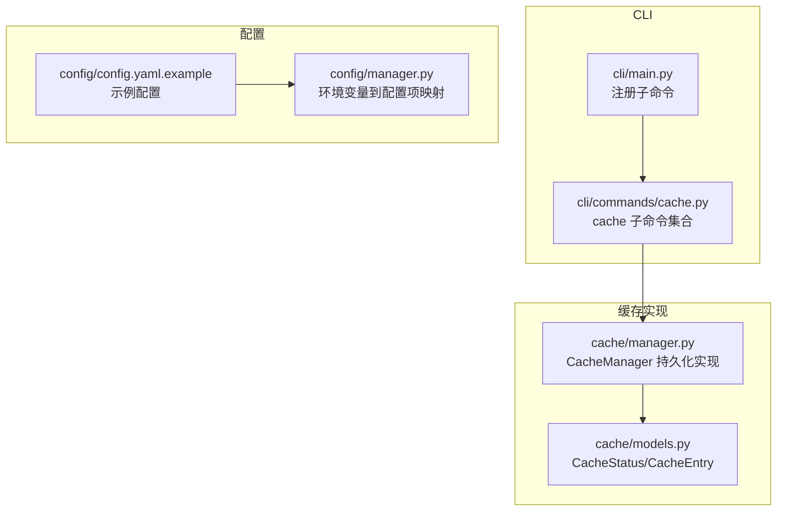
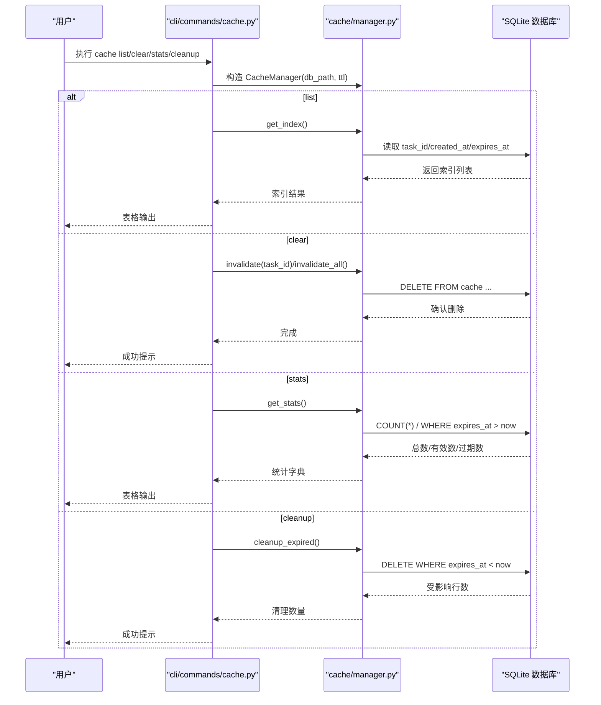
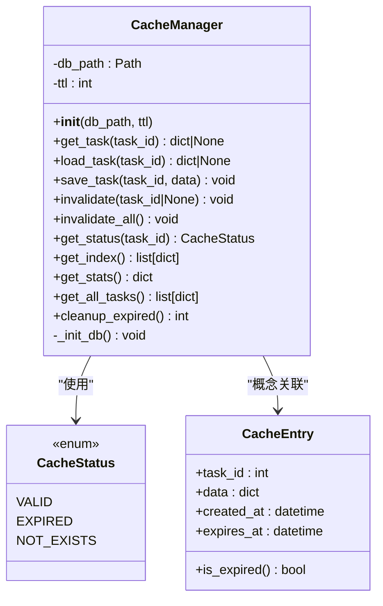
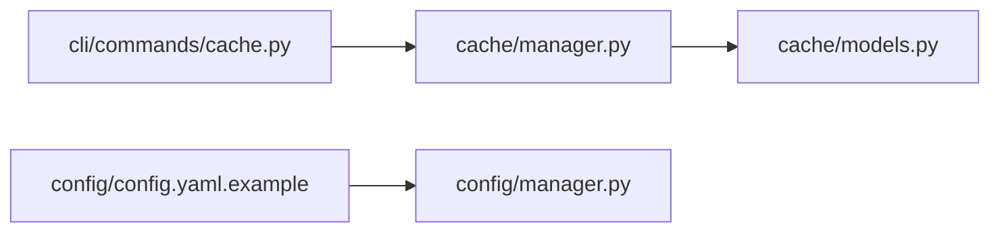

# 缓存管理命令

<cite>
**本文引用的文件**
- [src/cli/commands/cache.py](file://src/cli/commands/cache.py)
- [src/cli/main.py](file://src/cli/main.py)
- [src/cache/manager.py](file://src/cache/manager.py)
- [src/cache/models.py](file://src/cache/models.py)
- [config/config.yaml.example](file://config/config.yaml.example)
- [src/config/manager.py](file://src/config/manager.py)
- [tests/test_cache.py](file://tests/test_cache.py)
- [tests/cache/test_manager_task22.py](file://tests/cache/test_manager_task22.py)
</cite>

## 目录
1. [简介](#简介)
2. [项目结构](#项目结构)
3. [核心组件](#核心组件)
4. [架构总览](#架构总览)
5. [详细组件分析](#详细组件分析)
6. [依赖关系分析](#依赖关系分析)
7. [性能与监控](#性能与监控)
8. [故障诊断与排错](#故障诊断与排错)
9. [结论](#结论)
10. [附录：配置与最佳实践](#附录配置与最佳实践)

## 简介
本手册面向使用 CLI 的运维与研发人员，系统化说明“cache”子命令的缓存管理能力，包括查看、清理、统计等常用操作；同时文档化缓存策略与存储位置（持久化 SQLite）的配置方法，解释缓存键生成规则与过期策略，提供性能监控与统计信息的查看方式，并给出优化建议与故障排查要点。

## 项目结构
与缓存管理相关的代码主要分布在以下模块：
- CLI 层：注册 cache 子命令及其子命令（list/clear/stats/cleanup）
- 缓存实现层：基于 SQLite 的持久化缓存管理器
- 模型层：缓存状态枚举与条目模型
- 配置层：示例配置文件与环境变量映射

图表来源
- [src/cli/main.py:1-40](file://src/cli/main.py#L1-L40)
- [src/cli/commands/cache.py:1-87](file://src/cli/commands/cache.py#L1-L87)
- [src/cache/manager.py:1-165](file://src/cache/manager.py#L1-L165)
- [src/cache/models.py:1-22](file://src/cache/models.py#L1-L22)
- [config/config.yaml.example:1-38](file://config/config.yaml.example#L1-L38)
- [src/config/manager.py:214-222](file://src/config/manager.py#L214-L222)

章节来源
- [src/cli/main.py:1-40](file://src/cli/main.py#L1-L40)
- [src/cli/commands/cache.py:1-87](file://src/cli/commands/cache.py#L1-L87)
- [src/cache/manager.py:1-165](file://src/cache/manager.py#L1-L165)
- [src/cache/models.py:1-22](file://src/cache/models.py#L1-L22)
- [config/config.yaml.example:1-38](file://config/config.yaml.example#L1-L38)
- [src/config/manager.py:214-222](file://src/config/manager.py#L214-L222)

## 核心组件
- CLI 命令入口
  - 主程序在启动时注册 cache 子命令，暴露 list/clear/stats/cleanup 四个子命令。
- 缓存管理器 CacheManager
  - 基于 SQLite 的持久化缓存实现，支持按任务 ID 存取、TTL 过期控制、索引查询、统计信息、批量获取有效数据、过期清理等能力。
- 数据模型
  - 缓存状态枚举：VALID/EXPIRED/NOT_EXISTS
  - 缓存条目模型：包含任务ID、数据、创建时间、过期时间，并提供过期判断方法。

章节来源
- [src/cli/main.py:17-21](file://src/cli/main.py#L17-L21)
- [src/cli/commands/cache.py:15-87](file://src/cli/commands/cache.py#L15-L87)
- [src/cache/manager.py:10-165](file://src/cache/manager.py#L10-L165)
- [src/cache/models.py:8-22](file://src/cache/models.py#L8-L22)

## 架构总览
下图展示了从 CLI 调用到持久化存储的完整流程，以及关键的数据流与控制流。

图表来源
- [src/cli/commands/cache.py:15-87](file://src/cli/commands/cache.py#L15-L87)
- [src/cache/manager.py:37-165](file://src/cache/manager.py#L37-L165)

## 详细组件分析

### CLI 子命令详解
- cache list
  - 功能：列出缓存条目（默认显示前若干条），展示任务ID、创建时间、过期时间。
  - 参数：--limit/-l 控制显示数量。
  - 行为：当无缓存时输出空提示。
- cache clear
  - 功能：清除指定任务或全部缓存。
  - 参数：task_id（可选）、--force/-f（跳过确认）。
  - 行为：未指定 task_id 且未加 --force 时会交互式确认。
- cache stats
  - 功能：显示缓存统计指标（总条目、有效条目、过期条目）。
- cache cleanup
  - 功能：清理过期缓存，返回被清理的数量。

章节来源
- [src/cli/commands/cache.py:15-87](file://src/cli/commands/cache.py#L15-L87)

### 缓存管理器 CacheManager
- 初始化与数据库
  - 自动创建数据库目录与表结构，并在 expires_at 字段上建立索引以加速过期相关查询。
- 读写与过期
  - 写入时记录 created_at 与 expires_at（当前时间 + TTL）。
  - 读取时若已过期则视为不存在。
- 失效与清理
  - 支持按任务ID失效与全量失效。
  - 支持按过期时间批量删除。
- 索引与统计
  - 提供索引查询（仅元信息）与统计计算（总数、有效数、过期数）。
- 批量获取
  - 提供获取所有有效任务的接口（过滤过期项）。

图表来源
- [src/cache/manager.py:10-165](file://src/cache/manager.py#L10-L165)
- [src/cache/models.py:8-22](file://src/cache/models.py#L8-L22)

章节来源
- [src/cache/manager.py:16-36](file://src/cache/manager.py#L16-L36)
- [src/cache/manager.py:37-165](file://src/cache/manager.py#L37-L165)
- [src/cache/models.py:8-22](file://src/cache/models.py#L8-L22)

### 缓存键生成规则与过期策略
- 键生成规则
  - 缓存键为任务ID（整数），作为主键唯一标识一条缓存记录。
- 过期策略
  - 采用固定 TTL 策略：保存时根据当前时间与 TTL 计算 expires_at。
  - 读取时比较当前时间与 expires_at，超过即视为过期。
  - 统计与清理均基于 expires_at 进行判定。

章节来源
- [src/cache/manager.py:59-76](file://src/cache/manager.py#L59-L76)
- [src/cache/manager.py:37-55](file://src/cache/manager.py#L37-L55)
- [src/cache/manager.py:122-138](file://src/cache/manager.py#L122-L138)
- [src/cache/manager.py:156-165](file://src/cache/manager.py#L156-L165)

### 存储位置与持久化
- 默认存储路径
  - CLI 中默认指向 ./data/cache/cache.db。
- 配置项与环境变量
  - 示例配置中包含 cache.enabled、cache.ttl、cache.storage 等字段。
  - 配置管理器将环境变量 CACHE_TTL、CACHE_STORAGE、CACHE_DB_PATH 映射至配置项。
- 注意
  - 当前 CLI 命令硬编码了 db_path，未直接读取配置中的 CACHE_DB_PATH；如需动态路径，应在 CLI 层引入配置解析逻辑。

章节来源
- [src/cli/commands/cache.py:20-21](file://src/cli/commands/cache.py#L20-L21)
- [config/config.yaml.example:22-26](file://config/config.yaml.example#L22-L26)
- [src/config/manager.py:214-216](file://src/config/manager.py#L214-L216)

### 缓存一致性保证与冲突解决
- 幂等写入
  - 写入使用 INSERT OR REPLACE，对同一 task_id 的多次写入会覆盖旧值，确保最终一致。
- 并发安全
  - 通过 sqlite3 连接上下文与事务提交保证单进程内基本原子性；跨进程并发场景下由 SQLite 自身锁机制保障。
- 过期一致性
  - 读取与统计均以 expires_at 为准，避免脏读。

章节来源
- [src/cache/manager.py:63-76](file://src/cache/manager.py#L63-L76)
- [src/cache/manager.py:37-55](file://src/cache/manager.py#L37-L55)
- [src/cache/manager.py:122-138](file://src/cache/manager.py#L122-L138)

### 缓存预热与预加载
- 现状
  - 当前未提供专门的预热/预加载命令或 API。
- 建议方案
  - 可在业务侧遍历待处理任务集，批量调用 save_task 进行预热。
  - 或通过定时任务定期执行 get_all_tasks 校验并补写缺失热点数据。

章节来源
- [src/cache/manager.py:140-154](file://src/cache/manager.py#L140-L154)

## 依赖关系分析
- CLI 依赖缓存管理器
  - cache 子命令通过实例化 CacheManager 完成具体操作。
- 配置与环境变量
  - 配置示例与环境变量映射为后续扩展动态路径与 TTL 提供基础。

图表来源
- [src/cli/commands/cache.py:1-87](file://src/cli/commands/cache.py#L1-L87)
- [src/cache/manager.py:1-165](file://src/cache/manager.py#L1-L165)
- [src/cache/models.py:1-22](file://src/cache/models.py#L1-L22)
- [config/config.yaml.example:1-38](file://config/config.yaml.example#L1-L38)
- [src/config/manager.py:214-222](file://src/config/manager.py#L214-L222)

章节来源
- [src/cli/commands/cache.py:1-87](file://src/cli/commands/cache.py#L1-L87)
- [src/cache/manager.py:1-165](file://src/cache/manager.py#L1-L165)
- [src/cache/models.py:1-22](file://src/cache/models.py#L1-L22)
- [config/config.yaml.example:1-38](file://config/config.yaml.example#L1-L38)
- [src/config/manager.py:214-222](file://src/config/manager.py#L214-L222)

## 性能与监控
- 统计指标
  - 通过 cache stats 可查看总条目、有效条目、过期条目。
- 性能特征
  - 写入与读取均为轻量级 SQL 操作，配合 expires_at 索引可提升过期相关查询效率。
  - 测试用例覆盖了高吞吐写入、混合读写与批量清理的性能断言。
- 监控建议
  - 结合系统日志与外部监控工具采集 cache stats 指标，观察过期比例与清理频率。
  - 关注磁盘 I/O 与 SQLite 文件大小增长趋势，必要时调整 TTL 或定期清理。

章节来源
- [src/cli/commands/cache.py:64-78](file://src/cli/commands/cache.py#L64-L78)
- [src/cache/manager.py:122-138](file://src/cache/manager.py#L122-L138)
- [tests/cache/test_manager_task22.py:125-166](file://tests/cache/test_manager_task22.py#L125-L166)
- [tests/test_cache.py:101-155](file://tests/test_cache.py#L101-L155)

## 故障诊断与排错
- 常见问题
  - 缓存为空：检查是否已写入数据或 TTL 是否过短导致立即过期。
  - 清理无效：确认 expires_at 是否正确设置，以及清理命令是否被执行。
  - 路径错误：CLI 默认路径 ./data/cache/cache.db 需存在并可写。
- 定位步骤
  - 使用 cache list 查看是否存在条目及过期时间。
  - 使用 cache stats 观察过期条目占比。
  - 使用 cache cleanup 清理过期数据后再次验证。
- 参考测试
  - 可通过单元测试复现与验证问题场景（如 TTL 精确过期、状态转换、清理性能等）。

章节来源
- [src/cli/commands/cache.py:15-87](file://src/cli/commands/cache.py#L15-L87)
- [tests/test_cache.py:34-92](file://tests/test_cache.py#L34-L92)
- [tests/cache/test_manager_task22.py:28-64](file://tests/cache/test_manager_task22.py#L28-L64)

## 结论
cache 子命令提供了完整的缓存生命周期管理能力，结合 SQLite 持久化与 TTL 过期策略，满足大多数本地分析与批处理场景的需求。通过合理的 TTL 配置与定期清理，可有效控制存储膨胀并保持响应性能。建议在后续版本中增强配置驱动的路径与 TTL 注入，以便在不同环境灵活部署。

## 附录：配置与最佳实践

### 配置项与环境变量
- 示例配置（YAML）
  - cache.enabled：启用/禁用缓存
  - cache.ttl：缓存有效期（秒）
  - cache.storage：存储类型（当前示例为 sqlite）
- 环境变量映射
  - CACHE_TTL、CACHE_STORAGE、CACHE_DB_PATH 分别映射至对应配置项。

章节来源
- [config/config.yaml.example:22-26](file://config/config.yaml.example#L22-L26)
- [src/config/manager.py:214-216](file://src/config/manager.py#L214-L216)

### 操作命令速查
- 列出缓存条目
  - 命令：cache list [--limit/-l N]
- 清除缓存
  - 命令：cache clear [task_id] [--force/-f]
- 查看统计
  - 命令：cache stats
- 清理过期
  - 命令：cache cleanup

章节来源
- [src/cli/commands/cache.py:15-87](file://src/cli/commands/cache.py#L15-L87)

### 优化建议
- TTL 调优
  - 根据任务处理耗时与访问频率设置合理 TTL，避免频繁重建或过早失效。
- 清理策略
  - 在生产环境中建议周期性执行 cache cleanup，降低过期数据堆积。
- 存储路径
  - 将缓存数据库放置于高性能磁盘，并确保目录权限正确。
- 压缩与大小限制
  - 当前实现未内置压缩与容量上限控制；如需，可在上层封装写入前压缩与写入后轮转策略。
- 内存缓存
  - 当前为纯持久化实现；如需内存缓存，可在应用层增加 LRU 层并与持久化协同。

章节来源
- [src/cache/manager.py:156-165](file://src/cache/manager.py#L156-L165)
- [src/cache/manager.py:122-138](file://src/cache/manager.py#L122-L138)