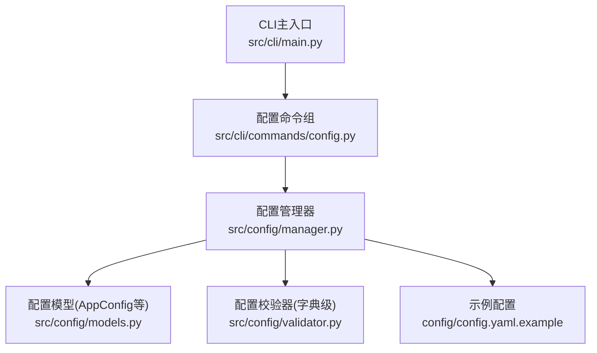
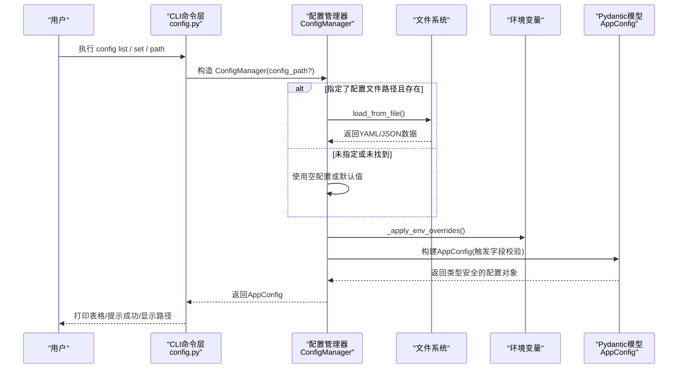
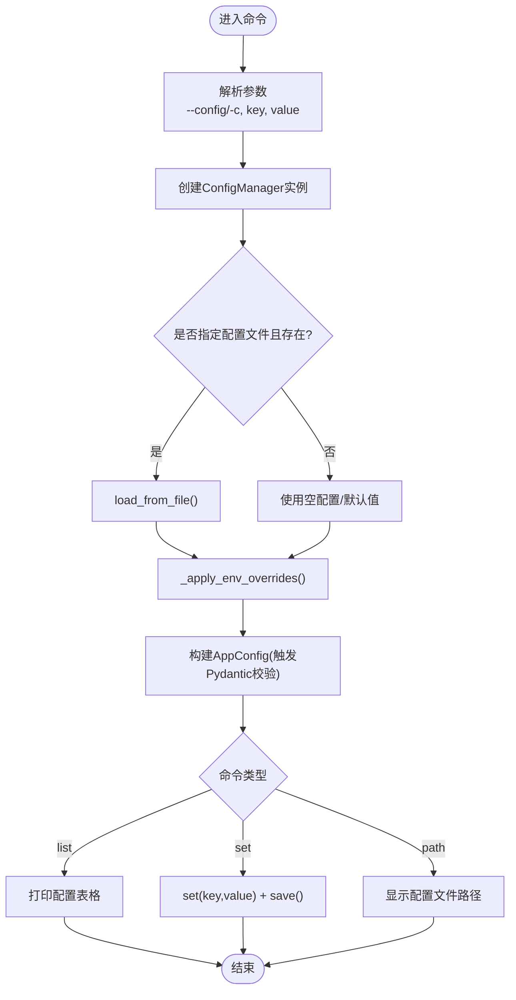
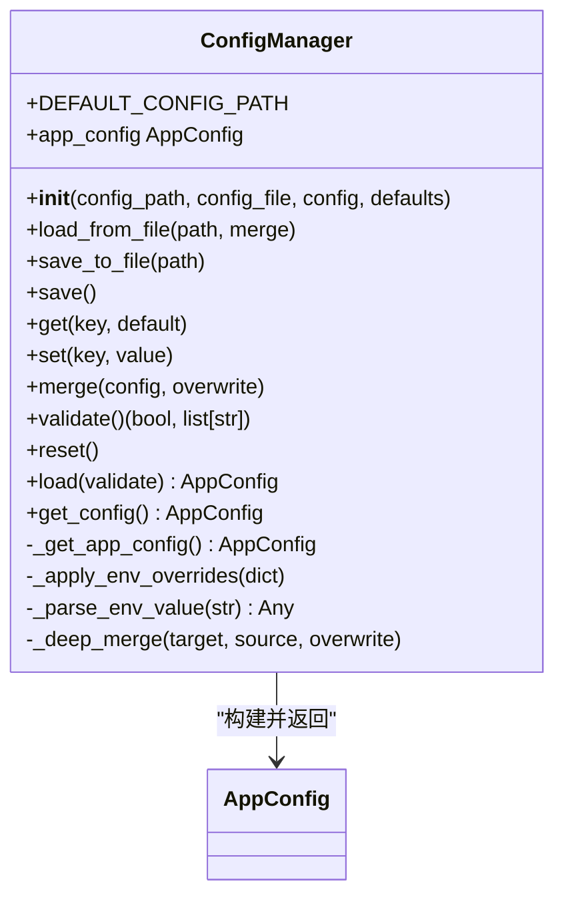
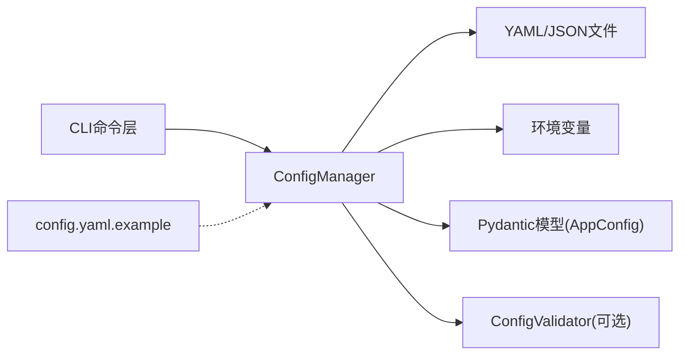

# 配置管理命令

<cite>
**本文引用的文件**   
- [src/cli/commands/config.py](file://src/cli/commands/config.py)
- [src/cli/main.py](file://src/cli/main.py)
- [src/config/manager.py](file://src/config/manager.py)
- [src/config/models.py](file://src/config/models.py)
- [src/config/validator.py](file://src/config/validator.py)
- [config/config.yaml.example](file://config/config.yaml.example)
- [tests/config/test_manager.py](file://tests/config/test_manager.py)
- [tests/config/test_validator.py](file://tests/config/test_validator.py)
</cite>

## 目录
1. [简介](#简介)
2. [项目结构](#项目结构)
3. [核心组件](#核心组件)
4. [架构总览](#架构总览)
5. [详细组件分析](#详细组件分析)
6. [依赖关系分析](#依赖关系分析)
7. [性能与行为特性](#性能与行为特性)
8. [故障排查指南](#故障排查指南)
9. [结论](#结论)
10. [附录：常用配置场景示例](#附录常用配置场景示例)

## 简介
本指南面向使用 CLI 进行配置管理的用户，聚焦于 config 子命令的完整操作说明。内容涵盖：
- 配置文件查看、修改、路径显示等命令用法
- 配置文件的层次结构与默认值来源
- 环境变量与配置项的映射与覆盖机制
- 配置验证规则与错误提示
- 常见配置场景（如 LLM 提供商切换、缓存参数调优等）
- 配置持久化与热重载现状说明
- 备份与迁移建议
- 安全注意事项与最佳实践

## 项目结构
与配置管理相关的代码主要分布在以下位置：
- CLI 入口与命令注册：src/cli/main.py、src/cli/commands/config.py
- 配置加载、合并、保存与环境变量覆盖：src/config/manager.py
- 配置模型与字段校验：src/config/models.py
- 字典级配置校验器：src/config/validator.py
- 示例配置文件：config/config.yaml.example
- 相关测试用例：tests/config/test_manager.py、tests/config/test_validator.py

图表来源
- [src/cli/main.py:1-40](file://src/cli/main.py#L1-L40)
- [src/cli/commands/config.py:1-69](file://src/cli/commands/config.py#L1-L69)
- [src/config/manager.py:1-268](file://src/config/manager.py#L1-L268)
- [src/config/models.py:1-144](file://src/config/models.py#L1-L144)
- [src/config/validator.py:1-196](file://src/config/validator.py#L1-L196)
- [config/config.yaml.example:1-38](file://config/config.yaml.example#L1-L38)

章节来源
- [src/cli/main.py:1-40](file://src/cli/main.py#L1-L40)
- [src/cli/commands/config.py:1-69](file://src/cli/commands/config.py#L1-L69)

## 核心组件
- CLI 命令层
  - list：以表格形式展示当前生效的配置项
  - set：按点号键设置配置项并持久化到文件
  - path：显示当前使用的配置文件路径或默认路径
- 配置管理层
  - 支持 YAML/JSON 读取与写入
  - 支持深度合并与覆盖策略
  - 支持通过环境变量覆盖配置项
  - 提供 AppConfig 类型安全的访问接口
- 配置模型层
  - 基于 Pydantic 的强类型模型与字段校验
  - 包含 API、LLM、Embedding、Clustering、Cache、Rules、Output、Logging 等模块
- 配置校验层
  - 提供字典级校验器，用于更细粒度的业务校验与错误收集

章节来源
- [src/cli/commands/config.py:15-69](file://src/cli/commands/config.py#L15-L69)
- [src/config/manager.py:42-268](file://src/config/manager.py#L42-L268)
- [src/config/models.py:4-144](file://src/config/models.py#L4-L144)
- [src/config/validator.py:16-196](file://src/config/validator.py#L16-L196)

## 架构总览
配置加载与生效流程如下：

图表来源
- [src/cli/commands/config.py:15-69](file://src/cli/commands/config.py#L15-L69)
- [src/config/manager.py:82-117](file://src/config/manager.py#L82-L117)
- [src/config/manager.py:191-243](file://src/config/manager.py#L191-L243)
- [src/config/models.py:135-144](file://src/config/models.py#L135-L144)

## 详细组件分析

### CLI 命令层：config 子命令
- list
  - 功能：列出当前生效的关键配置项（API、LLM、Embedding、Clustering、Cache、Output 等）
  - 输入：可选 --config/-c 指定配置文件路径
  - 输出：彩色表格
- set
  - 功能：设置配置项（支持点号键，如 llm.provider），并保存到当前配置文件
  - 输入：key、value、可选 --config/-c
  - 输出：成功/无效键提示
- path
  - 功能：显示当前使用的配置文件路径；若未指定则显示默认路径

图表来源
- [src/cli/commands/config.py:15-69](file://src/cli/commands/config.py#L15-L69)
- [src/config/manager.py:118-149](file://src/config/manager.py#L118-L149)
- [src/config/manager.py:191-243](file://src/config/manager.py#L191-L243)

章节来源
- [src/cli/commands/config.py:15-69](file://src/cli/commands/config.py#L15-L69)

### 配置管理器：ConfigManager
- 初始化
  - 支持传入 config_path、config_file、初始 config、defaults
  - 若未提供初始配置但存在配置文件，自动从文件加载
- 文件读写
  - load_from_file：支持 YAML/JSON，可选择 merge 模式
  - save_to_file/save：自动创建父目录，按后缀选择 JSON/YAML 格式
- 配置访问
  - get/set：支持点号键的嵌套访问与设置
  - merge：深度合并，支持 overwrite 控制覆盖策略
- 环境覆盖
  - _apply_env_overrides：将环境变量映射到配置项，并在构建 AppConfig 前生效
  - _parse_env_value：自动识别布尔、整数、浮点数与字符串
- 配置加载与校验
  - load：按需从文件加载，构建 AppConfig，可抛出配置验证异常
  - validate：尝试构建 AppConfig 并收集错误信息
- 重置
  - reset：回退到 defaults 或空配置

图表来源
- [src/config/manager.py:42-268](file://src/config/manager.py#L42-L268)
- [src/config/models.py:135-144](file://src/config/models.py#L135-L144)

章节来源
- [src/config/manager.py:42-268](file://src/config/manager.py#L42-L268)

### 配置模型：AppConfig 及其子模型
- 模块划分
  - api：基础URL、超时、重试、认证token、路径前缀
  - llm：提供商、模型、密钥、温度、最大token、可选base_url
  - embedding：提供商、模型、密钥、可选base_url、批量大小
  - clustering：算法、最小聚类大小、最小样本数、距离度量
  - cache：启用开关、TTL、存储类型、数据库路径
  - rules：内置规则开关、自定义规则路径列表
  - output：输出格式、输出目录
  - logging：日志级别、日志格式、日志文件路径
- 字段校验
  - 使用 Pydantic Field 与 field_validator 实现范围、枚举、必填等校验
  - 例如：provider 白名单、timeout 正数、temperature 区间、storage 枚举等

章节来源
- [src/config/models.py:4-144](file://src/config/models.py#L4-L144)

### 配置校验器：ConfigValidator（字典级）
- 作用
  - 对原始字典进行逐项校验，收集错误列表
  - 适用于在构建 AppConfig 之前进行快速检查或补充校验
- 覆盖范围
  - api、llm、embedding、cache 四个模块的字段约束与业务规则
- 返回值
  - (is_valid, errors) 元组，便于上层统一处理

章节来源
- [src/config/validator.py:16-196](file://src/config/validator.py#L16-L196)

## 依赖关系分析
- CLI 命令依赖 ConfigManager
- ConfigManager 依赖：
  - 文件系统（YAML/JSON）
  - 环境变量（os.environ）
  - Pydantic 模型（AppConfig）
  - 可选：字典级校验器（ConfigValidator）
- 示例配置文件作为参考模板

图表来源
- [src/cli/commands/config.py:1-69](file://src/cli/commands/config.py#L1-L69)
- [src/config/manager.py:1-268](file://src/config/manager.py#L1-L268)
- [config/config.yaml.example:1-38](file://config/config.yaml.example#L1-L38)

章节来源
- [src/cli/commands/config.py:1-69](file://src/cli/commands/config.py#L1-L69)
- [src/config/manager.py:1-268](file://src/config/manager.py#L1-L268)

## 性能与行为特性
- 文件 I/O
  - 首次加载时读取一次配置文件；保存时自动创建父目录
- 内存与对象
  - 使用 deepcopy 避免共享引用导致的副作用
  - AppConfig 构建会触发 Pydantic 校验，建议在配置变更后再获取 app_config
- 环境变量解析
  - 自动推断布尔、整型、浮点型，减少手动转换成本
- 合并策略
  - 默认不覆盖已有键；需要覆盖时显式使用 overwrite=True

[本节为通用指导，无需特定文件来源]

## 故障排查指南
- 常见错误类型
  - 配置文件不存在：抛出“配置文件未找到”异常
  - 配置键不存在：抛出“配置键未找到”异常
  - 配置校验失败：抛出“配置验证失败”异常，并附带错误详情
- 定位方法
  - 使用 config list 查看当前生效配置
  - 使用 config path 确认实际加载的配置文件路径
  - 使用 config set 修正具体配置项后再次验证
- 环境变量覆盖问题
  - 若发现配置未按预期生效，检查是否存在同名环境变量覆盖
  - 可通过临时取消对应环境变量复现问题

章节来源
- [src/config/manager.py:12-40](file://src/config/manager.py#L12-L40)
- [src/config/manager.py:161-173](file://src/config/manager.py#L161-L173)
- [tests/config/test_manager.py:351-372](file://tests/config/test_manager.py#L351-L372)

## 结论
- config 子命令提供了简洁直观的配置管理能力，适合日常运维与调试
- 配置项通过 Pydantic 模型严格校验，结合环境变量覆盖机制，兼顾灵活性与安全性
- 当前实现未提供“热重载”能力，需重启进程以应用新配置
- 建议在生产环境中结合环境变量注入敏感信息，并定期备份配置文件

[本节为总结性内容，无需特定文件来源]

## 附录：常用配置场景示例

### 查看与诊断
- 列出当前配置
  - 命令：fault-analyzer config list [--config|-c 路径]
  - 用途：快速核对关键配置项是否生效
- 显示配置文件路径
  - 命令：fault-analyzer config path [--config|-c 路径]
  - 用途：确认实际加载的配置文件位置

章节来源
- [src/cli/commands/config.py:15-39](file://src/cli/commands/config.py#L15-L39)
- [src/cli/commands/config.py:60-69](file://src/cli/commands/config.py#L60-L69)

### 修改配置项
- 设置单个配置项
  - 命令：fault-analyzer config set <键> <值> [--config|-c 路径]
  - 示例键：llm.provider、llm.model、embedding.batch_size、cache.ttl、output.directory
  - 说明：支持点号键，自动创建中间层级；保存至当前配置文件

章节来源
- [src/cli/commands/config.py:42-58](file://src/cli/commands/config.py#L42-L58)
- [src/config/manager.py:133-144](file://src/config/manager.py#L133-L144)

### 环境变量覆盖
- 支持的映射（部分示例）
  - LLM_PROVIDER -> llm.provider
  - LLM_MODEL -> llm.model
  - LLM_API_KEY -> llm.api_key
  - EMBEDDING_BATCH_SIZE -> embedding.batch_size
  - CACHE_ENABLED -> cache.enabled
  - OUTPUT_DIRECTORY -> output.directory
  - LOG_LEVEL -> logging.level
- 覆盖时机
  - 在构建 AppConfig 前应用，优先级高于配置文件中的同名项

章节来源
- [src/config/manager.py:191-243](file://src/config/manager.py#L191-L243)

### 配置文件层次与默认值
- 层次结构
  - 顶层模块：api、llm、embedding、clustering、cache、rules、output、logging
- 默认值来源
  - 由 Pydantic 模型的 Field(default=...) 提供
  - 示例参考：config/config.yaml.example

章节来源
- [src/config/models.py:4-144](file://src/config/models.py#L4-L144)
- [config/config.yaml.example:1-38](file://config/config.yaml.example#L1-L38)

### 配置验证规则与默认值
- 规则要点
  - URL 必须以 http:// 或 https:// 开头（当非空时）
  - 数值范围限制（如 timeout > 0、temperature ∈ [0,1]、max_tokens > 0）
  - 枚举白名单（如 provider、algorithm、metric、storage、format、level）
  - 必填项校验（如 model、api_key 在某些条件下）
- 验证入口
  - 通过 AppConfig 构建触发 Pydantic 校验
  - 也可使用 ConfigValidator.validate_dict 进行字典级预检

章节来源
- [src/config/models.py:13-133](file://src/config/models.py#L13-L133)
- [src/config/validator.py:53-196](file://src/config/validator.py#L53-L196)

### 常用场景示例（命令行）
- 切换 LLM 提供商与模型
  - fault-analyzer config set llm.provider openai
  - fault-analyzer config set llm.model gpt-4
- 调整 Embedding 批大小
  - fault-analyzer config set embedding.batch_size 200
- 关闭缓存或调整 TTL
  - fault-analyzer config set cache.enabled false
  - fault-analyzer config set cache.ttl 3600
- 更改输出目录
  - fault-analyzer config set output.directory ./reports/

章节来源
- [src/cli/commands/config.py:42-58](file://src/cli/commands/config.py#L42-L58)

### 热重载与动态更新
- 现状
  - 当前实现不提供运行时热重载；配置变更后需重启进程以生效
- 建议
  - 在部署脚本中，配置变更后触发服务重启
  - 使用环境变量注入敏感配置，避免频繁修改文件

[本节为通用指导，无需特定文件来源]

### 备份与迁移
- 备份
  - 直接复制当前配置文件（YAML/JSON）到版本库或归档目录
- 迁移
  - 使用 merge 模式加载旧配置到新配置结构中，逐步替换字段
  - 借助 ConfigManager.merge 与 save_to_file 完成增量迁移

章节来源
- [src/config/manager.py:146-160](file://src/config/manager.py#L146-L160)
- [src/config/manager.py:102-117](file://src/config/manager.py#L102-L117)

### 安全与最佳实践
- 敏感信息
  - 优先通过环境变量注入 API Key、Base URL 等敏感项
- 权限控制
  - 限制配置文件与数据目录的读写权限
- 变更审计
  - 将配置文件纳入版本管理，记录变更原因与审批
- 校验先行
  - 在部署前运行配置校验，确保所有必填项与范围合法

[本节为通用指导，无需特定文件来源]
