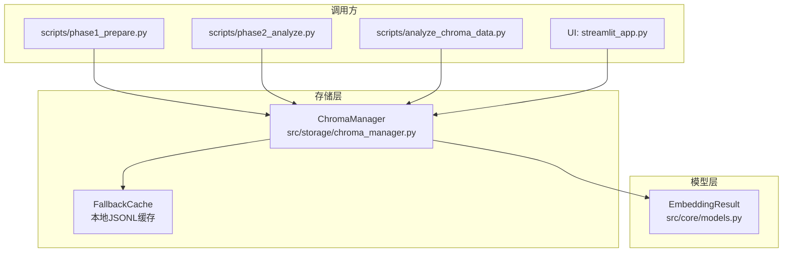
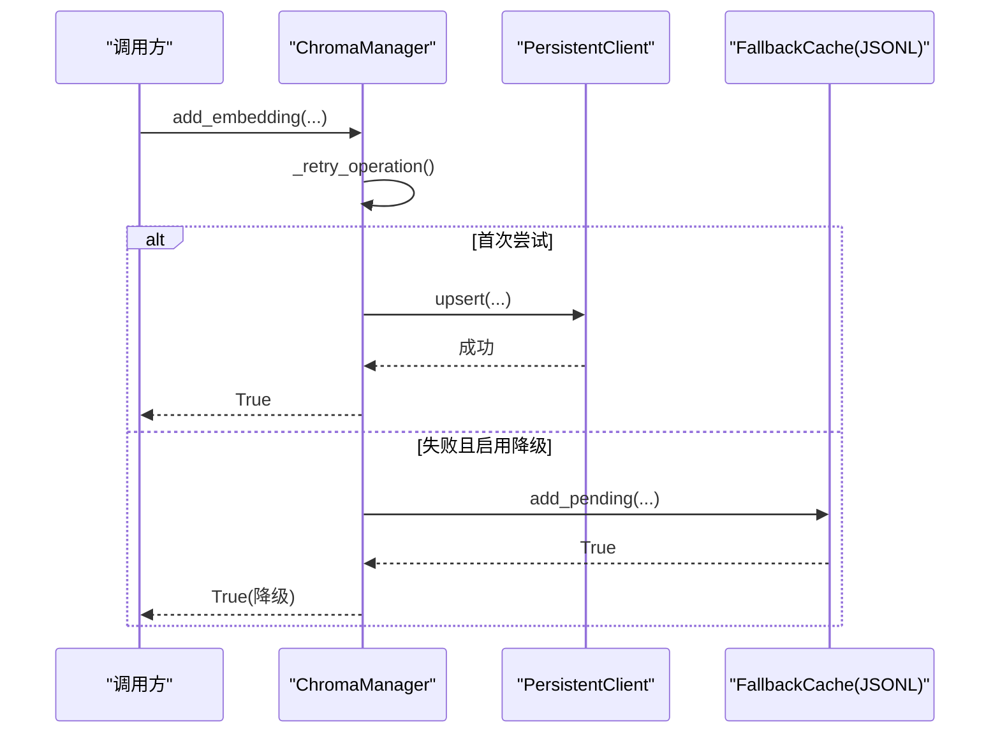
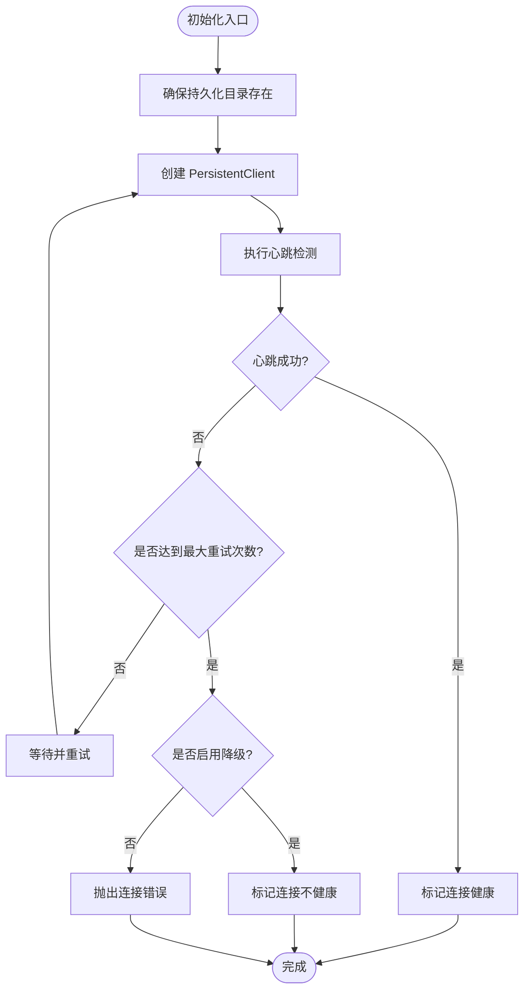
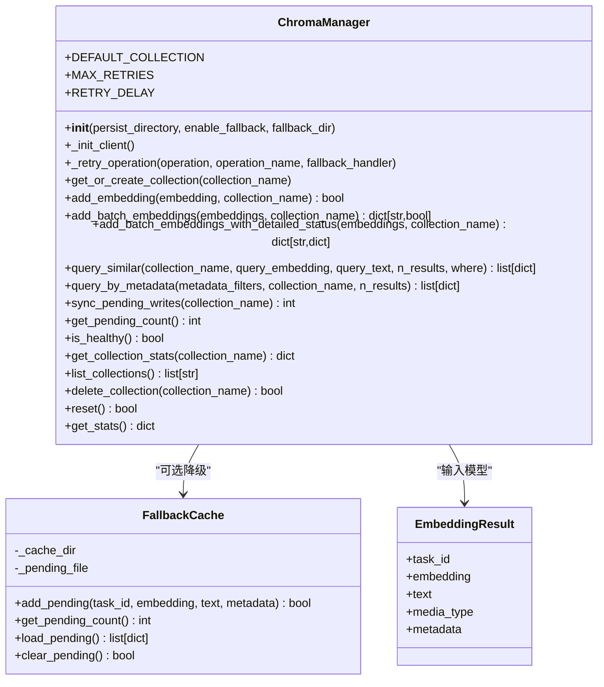
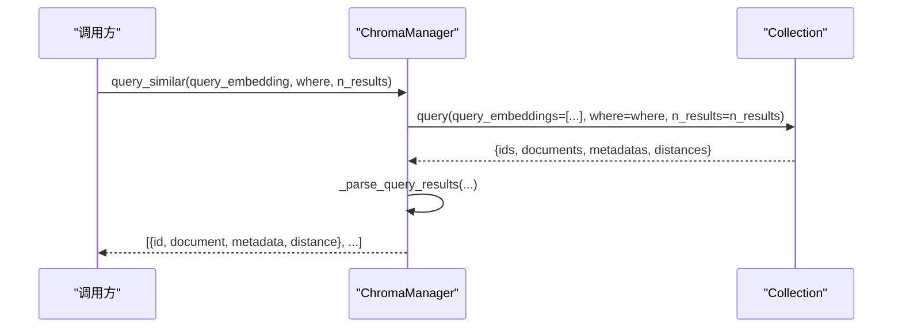
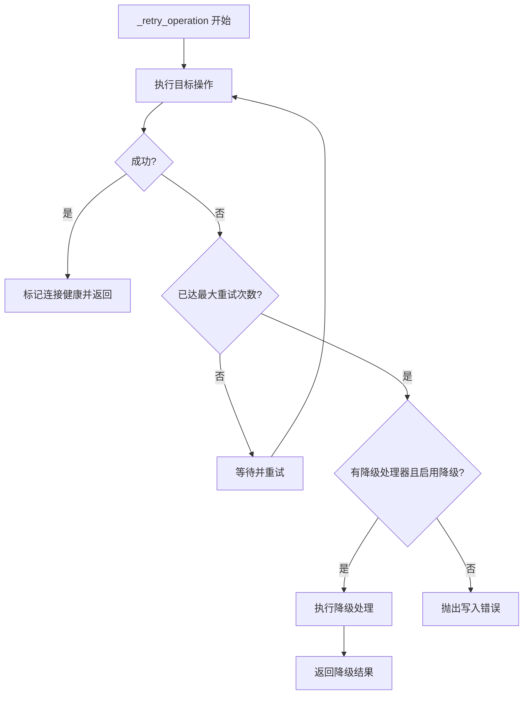
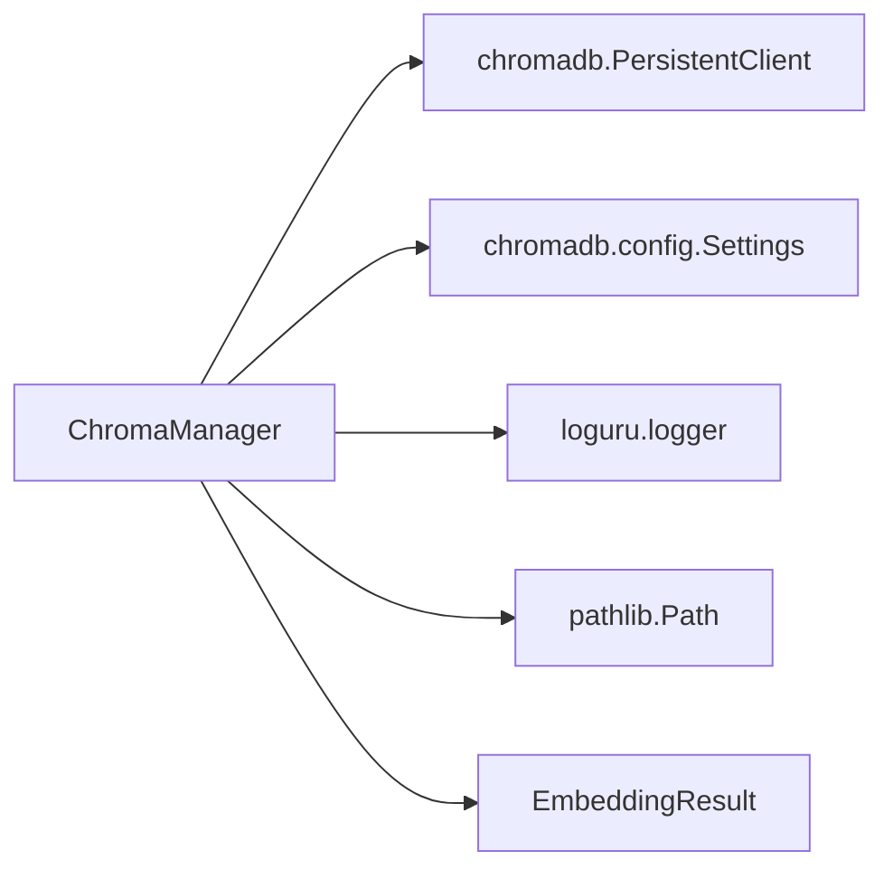

# 向量数据库管理

<cite>
**本文引用的文件**   
- [src/storage/chroma_manager.py](file://src/storage/chroma_manager.py)
- [src/core/models.py](file://src/core/models.py)
- [tests/storage/test_chroma_manager.py](file://tests/storage/test_chroma_manager.py)
- [tests/storage/test_chroma_manager_extended.py](file://tests/storage/test_chroma_manager_extended.py)
- [tests/storage/test_chroma_manager_resilience.py](file://tests/storage/test_chroma_manager_resilience.py)
- [scripts/phase1_prepare.py](file://scripts/phase1_prepare.py)
- [scripts/phase2_analyze.py](file://scripts/phase2_analyze.py)
- [scripts/analyze_chroma_data.py](file://scripts/analyze_chroma_data.py)
</cite>

## 目录
1. [简介](#简介)
2. [项目结构](#项目结构)
3. [核心组件](#核心组件)
4. [架构总览](#架构总览)
5. [详细组件分析](#详细组件分析)
6. [依赖关系分析](#依赖关系分析)
7. [性能考虑](#性能考虑)
8. [故障排查指南](#故障排查指南)
9. [结论](#结论)
10. [附录：API 参考与使用示例](#附录api-参考与使用示例)

## 简介
本技术文档聚焦于“向量数据库管理模块”，围绕 ChromaDB 的集成实现进行系统化说明。内容涵盖客户端初始化、连接健康检查、集合生命周期管理、向量插入（单条/批量/元数据）、相似度搜索（向量/文本/混合模式）、容错机制（重试、降级、恢复）以及性能优化建议，并提供完整的 API 参考与使用示例路径，便于快速上手与排障。

## 项目结构
该模块位于 storage 层，提供统一的向量数据库访问能力，被脚本与 UI 等上层组件复用。核心类为 ChromaManager，封装了 ChromaDB 的持久化客户端操作，并内置重试与本地缓存降级能力。

图表来源
- [src/storage/chroma_manager.py:111-136](file://src/storage/chroma_manager.py#L111-L136)
- [src/core/models.py:387-395](file://src/core/models.py#L387-L395)

章节来源
- [src/storage/chroma_manager.py:111-136](file://src/storage/chroma_manager.py#L111-L136)
- [src/core/models.py:387-395](file://src/core/models.py#L387-L395)

## 核心组件
- ChromaManager：对外暴露集合管理、写入、查询、统计、健康检查等接口；内部维护 PersistentClient 实例、连接健康状态、重试策略与降级缓存。
- FallbackCache：当 ChromaDB 不可用时，将待写入记录落盘到 JSONL 文件，后续可同步回写。
- EmbeddingResult：向量化结果的数据模型，包含任务ID、向量、文本、媒体类型与扩展元数据。

章节来源
- [src/storage/chroma_manager.py:111-136](file://src/storage/chroma_manager.py#L111-L136)
- [src/storage/chroma_manager.py:42-109](file://src/storage/chroma_manager.py#L42-L109)
- [src/core/models.py:387-395](file://src/core/models.py#L387-L395)

## 架构总览
ChromaManager 通过 chromadb.PersistentClient 与本地持久化目录交互，支持心跳检测与自动重连；在写入失败时，可降级到本地 JSONL 缓存，并提供同步工具方法将积压数据回写至 ChromaDB。

图表来源
- [src/storage/chroma_manager.py:236-283](file://src/storage/chroma_manager.py#L236-L283)
- [src/storage/chroma_manager.py:173-222](file://src/storage/chroma_manager.py#L173-L222)
- [src/storage/chroma_manager.py:42-109](file://src/storage/chroma_manager.py#L42-L109)

## 详细组件分析

### 客户端初始化与健康检查
- 初始化流程：创建持久化目录，构造 PersistentClient，设置匿名遥测关闭与允许重置；执行 heartbeat 验证连接；根据是否启用降级决定是否抛出异常。
- 健康检查：is_healthy 基于内存标记与心跳探测返回布尔值；get_stats 聚合连接健康、集合列表、总向量数与待同步数量。

图表来源
- [src/storage/chroma_manager.py:138-171](file://src/storage/chroma_manager.py#L138-L171)
- [src/storage/chroma_manager.py:490-499](file://src/storage/chroma_manager.py#L490-L499)
- [src/storage/chroma_manager.py:658-686](file://src/storage/chroma_manager.py#L658-L686)

章节来源
- [src/storage/chroma_manager.py:138-171](file://src/storage/chroma_manager.py#L138-L171)
- [src/storage/chroma_manager.py:490-499](file://src/storage/chroma_manager.py#L490-L499)
- [src/storage/chroma_manager.py:658-686](file://src/storage/chroma_manager.py#L658-L686)

### 集合操作接口（创建、配置、生命周期）
- 获取或创建集合：get_or_create_collection 支持传入集合名与描述性元数据。
- 列出集合：list_collections 返回所有集合名称。
- 删除集合：delete_collection 按名称删除。
- 集合统计：get_collection_stats 返回集合计数与元信息。
- 重置数据库：reset 清空当前持久化数据（谨慎使用）。

章节来源
- [src/storage/chroma_manager.py:224-234](file://src/storage/chroma_manager.py#L224-L234)
- [src/storage/chroma_manager.py:625-645](file://src/storage/chroma_manager.py#L625-L645)
- [src/storage/chroma_manager.py:612-623](file://src/storage/chroma_manager.py#L612-L623)
- [src/storage/chroma_manager.py:647-656](file://src/storage/chroma_manager.py#L647-L656)

### 向量插入操作（单条、批量、元数据处理）
- 单条插入：add_embedding 将 EmbeddingResult 转换为集合 upsert 参数，自动合并基础元数据与扩展元数据。
- 批量插入：add_batch_embeddings 支持传入 EmbeddingResult 列表或字典列表，统一组装后一次性写入。
- 详细状态批量插入：add_batch_embeddings_with_detailed_status 逐条处理并返回每条任务的详细状态（成功/失败、来源、错误原因）。
- 元数据处理：默认写入 task_id、media_type、text_length，若 embedding.metadata 存在则合并入集合元数据。

图表来源
- [src/storage/chroma_manager.py:111-136](file://src/storage/chroma_manager.py#L111-L136)
- [src/storage/chroma_manager.py:236-283](file://src/storage/chroma_manager.py#L236-L283)
- [src/storage/chroma_manager.py:285-398](file://src/storage/chroma_manager.py#L285-L398)
- [src/storage/chroma_manager.py:42-109](file://src/storage/chroma_manager.py#L42-L109)
- [src/core/models.py:387-395](file://src/core/models.py#L387-L395)

章节来源
- [src/storage/chroma_manager.py:236-283](file://src/storage/chroma_manager.py#L236-L283)
- [src/storage/chroma_manager.py:285-398](file://src/storage/chroma_manager.py#L285-L398)
- [src/core/models.py:387-395](file://src/core/models.py#L387-L395)

### 相似度搜索功能（向量查询、文本查询、混合查询）
- 向量查询：query_similar 接受 query_embedding 与可选 where 过滤条件，返回标准化结果列表（id、document、metadata、distance）。
- 文本查询：query_similar 接受 query_text 与可选 where 过滤条件。
- 元数据过滤：query_by_metadata 支持简单键值与 $in 列表匹配，用于非向量维度的筛选。
- 结果解析：_parse_query_results 统一包装 ChromaDB 返回结构，缺失字段以空值兜底。

图表来源
- [src/storage/chroma_manager.py:501-532](file://src/storage/chroma_manager.py#L501-L532)
- [src/storage/chroma_manager.py:534-550](file://src/storage/chroma_manager.py#L534-L550)
- [src/storage/chroma_manager.py:400-435](file://src/storage/chroma_manager.py#L400-L435)

章节来源
- [src/storage/chroma_manager.py:501-532](file://src/storage/chroma_manager.py#L501-L532)
- [src/storage/chroma_manager.py:534-550](file://src/storage/chroma_manager.py#L534-L550)
- [src/storage/chroma_manager.py:400-435](file://src/storage/chroma_manager.py#L400-L435)

### 容错机制（重试策略、降级处理、故障恢复）
- 重试策略：_retry_operation 对任意操作执行最多 MAX_RETRIES 次重试，指数退避（delay*(attempt+1)），并在首次失败时尝试重新初始化连接。
- 降级处理：当写入失败且启用降级时，调用 fallback_handler 将数据写入本地 JSONL 缓存；后续可通过 sync_pending_writes 批量回写。
- 故障恢复：is_healthy 结合心跳探测判断连接可用性；get_stats 汇总 pending_writes 以便监控积压情况。

图表来源
- [src/storage/chroma_manager.py:173-222](file://src/storage/chroma_manager.py#L173-L222)
- [src/storage/chroma_manager.py:437-482](file://src/storage/chroma_manager.py#L437-L482)
- [src/storage/chroma_manager.py:484-488](file://src/storage/chroma_manager.py#L484-L488)

章节来源
- [src/storage/chroma_manager.py:173-222](file://src/storage/chroma_manager.py#L173-L222)
- [src/storage/chroma_manager.py:437-482](file://src/storage/chroma_manager.py#L437-L482)
- [src/storage/chroma_manager.py:484-488](file://src/storage/chroma_manager.py#L484-L488)

## 依赖关系分析
- 外部依赖：chromadb 与 Settings 配置；loguru 日志；pathlib 路径管理。
- 内部依赖：EmbeddingResult 作为输入模型；测试套件覆盖基本功能、扩展场景与韧性行为。

图表来源
- [src/storage/chroma_manager.py:10-17](file://src/storage/chroma_manager.py#L10-L17)
- [src/core/models.py:387-395](file://src/core/models.py#L387-L395)

章节来源
- [src/storage/chroma_manager.py:10-17](file://src/storage/chroma_manager.py#L10-L17)
- [src/core/models.py:387-395](file://src/core/models.py#L387-L395)

## 性能考虑
- 索引与距离度量：当前未显式配置集合维度与索引策略，依赖 ChromaDB 默认实现。建议在大规模数据场景下评估是否需要自定义集合元数据或升级方案。
- 批量写入：优先使用 add_batch_embeddings 减少网络往返与事务开销；对于高吞吐场景，可分批提交并控制批次大小。
- 查询调优：合理设置 n_results 与 where 过滤，避免全表扫描；对高频过滤字段建立合适的元数据索引（由底层库决定）。
- 连接复用：ChromaManager 内部持有单一 PersistentClient 实例，避免频繁重建连接带来的开销。
- 降级与同步：在高并发写入时，若出现瞬时失败，利用本地缓存保障不丢数据；定期执行 sync_pending_writes 清理积压。

[本节为通用指导，无需特定文件引用]

## 故障排查指南
- 连接失败：检查 is_healthy 返回值与 get_stats 中的 connection_healthy 字段；确认持久化目录权限与磁盘空间。
- 写入失败：查看日志中“添加向量失败”“批量添加向量失败”等提示；若启用降级，检查 pending_writes 数量并通过 sync_pending_writes 恢复。
- 查询无结果：确认 query_embedding 或 query_text 是否正确传入；检查 where 过滤条件是否与元数据一致。
- 集合不存在：使用 list_collections 确认集合是否存在；必要时通过 get_or_create_collection 创建。

章节来源
- [src/storage/chroma_manager.py:490-499](file://src/storage/chroma_manager.py#L490-L499)
- [src/storage/chroma_manager.py:658-686](file://src/storage/chroma_manager.py#L658-L686)
- [src/storage/chroma_manager.py:236-283](file://src/storage/chroma_manager.py#L236-L283)
- [src/storage/chroma_manager.py:285-398](file://src/storage/chroma_manager.py#L285-L398)
- [src/storage/chroma_manager.py:501-532](file://src/storage/chroma_manager.py#L501-L532)
- [src/storage/chroma_manager.py:625-645](file://src/storage/chroma_manager.py#L625-L645)

## 结论
ChromaManager 提供了健壮的 ChromaDB 集成能力，具备完善的重试与降级机制，满足开发与小规模生产环境的稳定性需求。通过批量写入、合理的查询过滤与定期同步，可在保证可用性的同时提升整体性能。

[本节为总结性内容，无需特定文件引用]

## 附录：API 参考与使用示例

### 关键方法与用途
- 初始化与配置
  - __init__(persist_directory, enable_fallback, fallback_dir)
  - _init_client()
- 集合管理
  - get_or_create_collection(collection_name)
  - list_collections()
  - delete_collection(collection_name)
  - get_collection_stats(collection_name)
- 写入
  - add_embedding(embedding, collection_name)
  - add_batch_embeddings(embeddings, collection_name)
  - add_batch_embeddings_with_detailed_status(embeddings, collection_name)
- 查询
  - query_similar(collection_name, query_embedding, query_text, n_results, where)
  - query_by_metadata(metadata_filters, collection_name, n_results)
- 运维与监控
  - is_healthy()
  - get_stats()
  - sync_pending_writes(collection_name)
  - get_pending_count()
  - reset()

章节来源
- [src/storage/chroma_manager.py:118-136](file://src/storage/chroma_manager.py#L118-L136)
- [src/storage/chroma_manager.py:224-234](file://src/storage/chroma_manager.py#L224-L234)
- [src/storage/chroma_manager.py:236-283](file://src/storage/chroma_manager.py#L236-L283)
- [src/storage/chroma_manager.py:285-398](file://src/storage/chroma_manager.py#L285-L398)
- [src/storage/chroma_manager.py:501-532](file://src/storage/chroma_manager.py#L501-L532)
- [src/storage/chroma_manager.py:400-435](file://src/storage/chroma_manager.py#L400-L435)
- [src/storage/chroma_manager.py:490-499](file://src/storage/chroma_manager.py#L490-L499)
- [src/storage/chroma_manager.py:658-686](file://src/storage/chroma_manager.py#L658-L686)
- [src/storage/chroma_manager.py:437-482](file://src/storage/chroma_manager.py#L437-L482)
- [src/storage/chroma_manager.py:625-645](file://src/storage/chroma_manager.py#L625-L645)
- [src/storage/chroma_manager.py:647-656](file://src/storage/chroma_manager.py#L647-L656)

### 使用示例（路径）
- 基础用法与批量写入测试
  - [tests/storage/test_chroma_manager.py](file://tests/storage/test_chroma_manager.py)
- 扩展用例与边界场景
  - [tests/storage/test_chroma_manager_extended.py](file://tests/storage/test_chroma_manager_extended.py)
- 韧性与降级测试
  - [tests/storage/test_chroma_manager_resilience.py](file://tests/storage/test_chroma_manager_resilience.py)
- 实际脚本调用
  - [scripts/phase1_prepare.py](file://scripts/phase1_prepare.py)
  - [scripts/phase2_analyze.py](file://scripts/phase2_analyze.py)
  - [scripts/analyze_chroma_data.py](file://scripts/analyze_chroma_data.py)

章节来源
- [tests/storage/test_chroma_manager.py](file://tests/storage/test_chroma_manager.py)
- [tests/storage/test_chroma_manager_extended.py](file://tests/storage/test_chroma_manager_extended.py)
- [tests/storage/test_chroma_manager_resilience.py](file://tests/storage/test_chroma_manager_resilience.py)
- [scripts/phase1_prepare.py](file://scripts/phase1_prepare.py)
- [scripts/phase2_analyze.py](file://scripts/phase2_analyze.py)
- [scripts/analyze_chroma_data.py](file://scripts/analyze_chroma_data.py)
