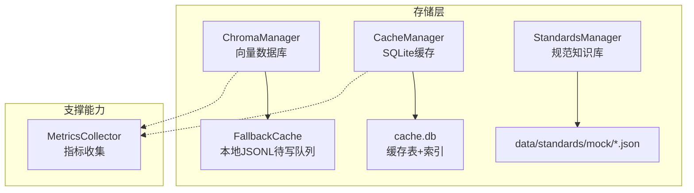
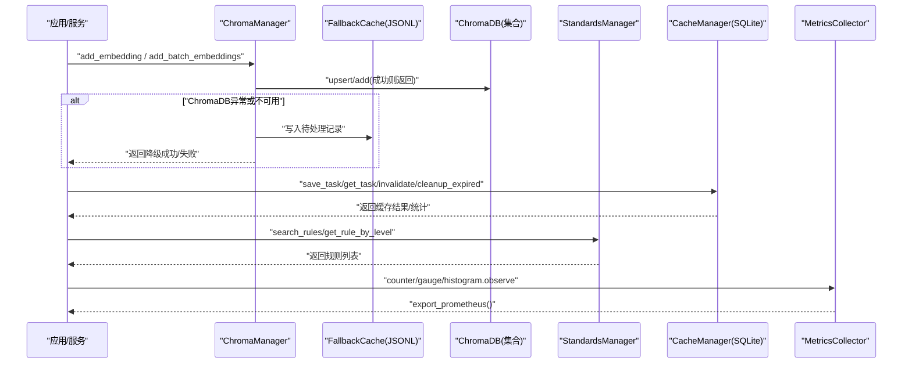
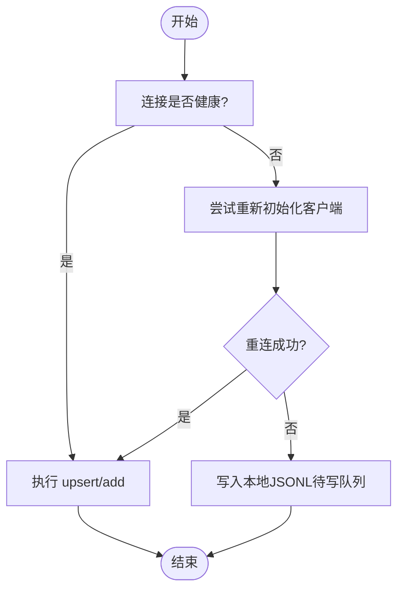
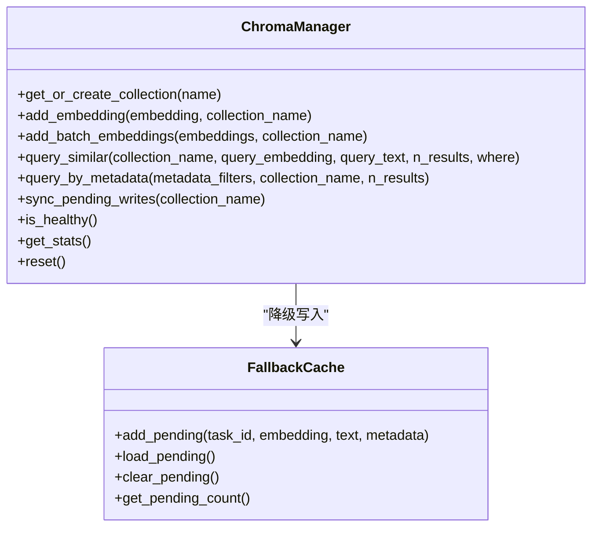
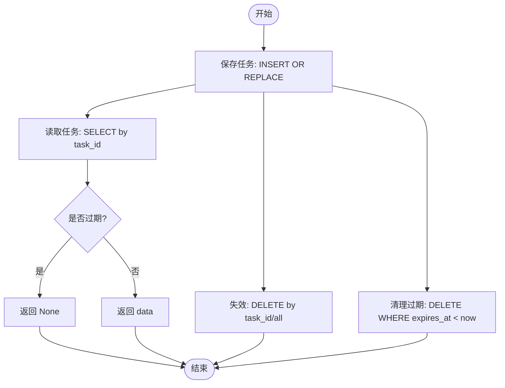
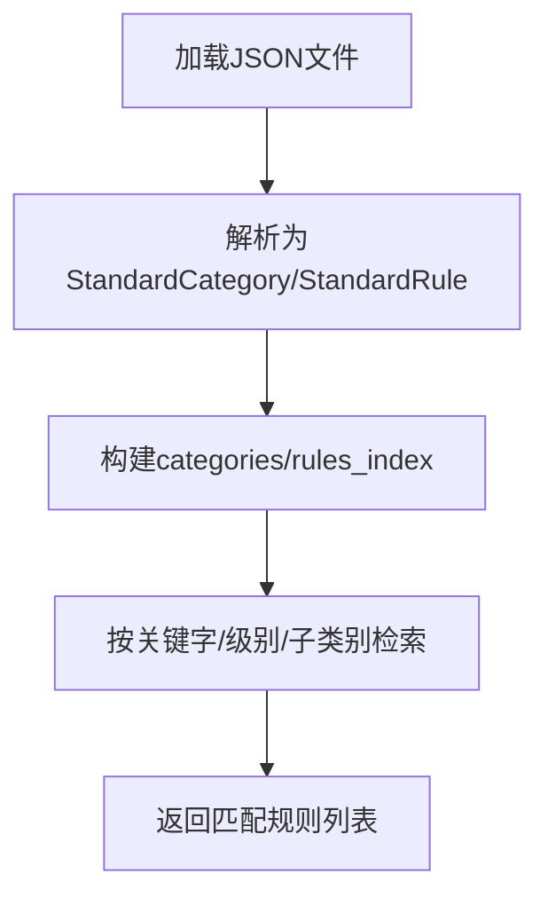
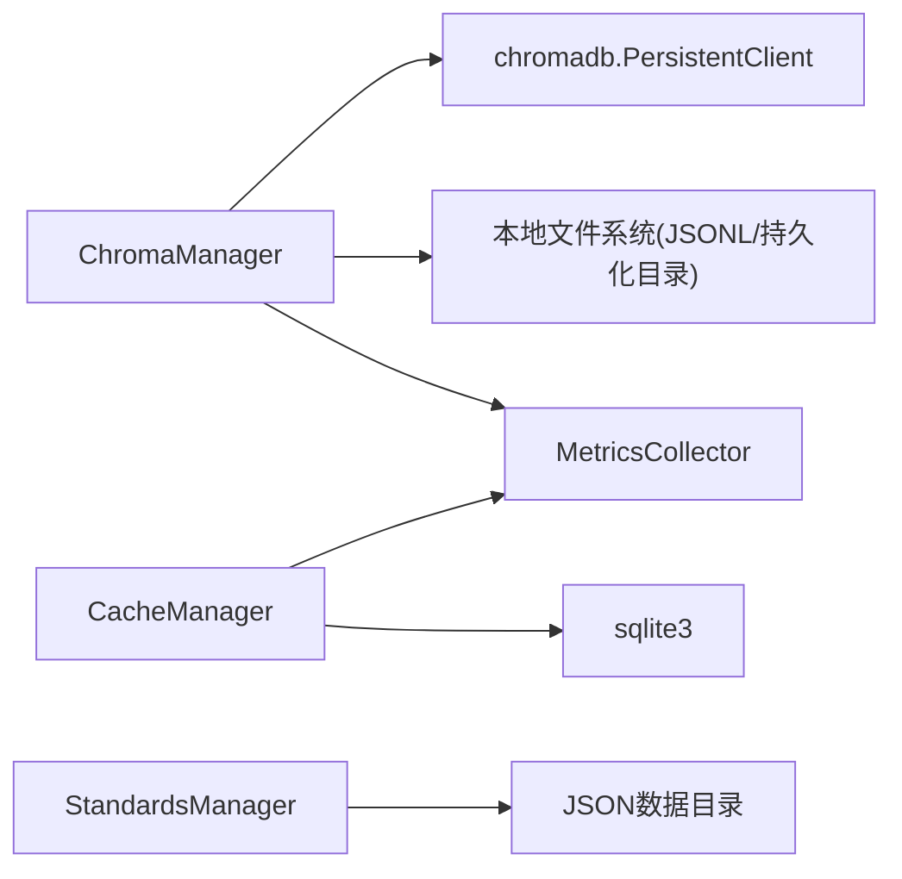
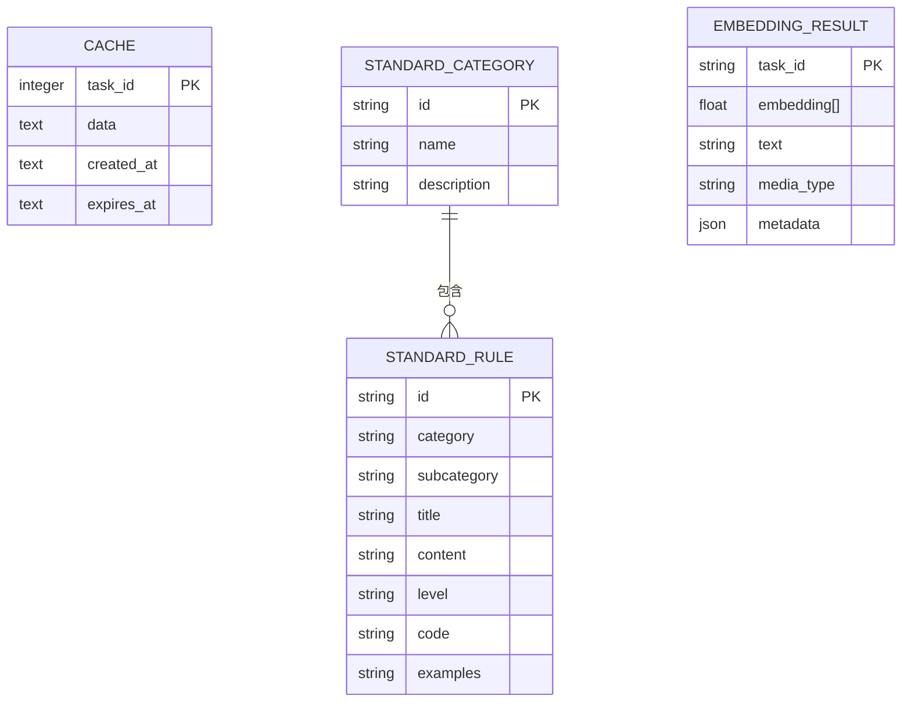

# 存储管理系统

<cite>
**本文引用的文件**   
- [chroma_manager.py](file://src/storage/chroma_manager.py)
- [manager.py](file://src/cache/manager.py)
- [models.py](file://src/cache/models.py)
- [manager.py](file://src/knowledge/manager.py)
- [models.py](file://src/core/models.py)
- [metrics.py](file://src/utils/metrics.py)
- [test_chroma_manager_extended.py](file://tests/storage/test_chroma_manager_extended.py)
- [test_chroma_manager_resilience.py](file://tests/storage/test_chroma_manager_resilience.py)
- [test_cache.py](file://tests/test_cache.py)
- [test_manager_task22.py](file://tests/cache/test_manager_task22.py)
</cite>

## 目录
1. [简介](#简介)
2. [项目结构](#项目结构)
3. [核心组件](#核心组件)
4. [架构总览](#架构总览)
5. [详细组件分析](#详细组件分析)
6. [依赖关系分析](#依赖关系分析)
7. [性能考虑](#性能考虑)
8. [故障排查指南](#故障排查指南)
9. [结论](#结论)
10. [附录](#附录)

## 简介
本技术文档面向“存储管理系统”，围绕以下目标展开：
- 向量数据库 ChromaDB 的操作接口：集合管理、向量索引创建、相似度搜索与批量操作，并说明容错与降级策略。
- 关系型数据库（SQLite）缓存管理：连接使用、TTL 过期、失效策略与查询优化。
- 知识库管理机制：规范规则加载、检索与扩展点。
- 数据持久化方案：本地持久化路径、待写入队列同步、重置与统计。
- 性能监控与调优：指标采集与导出能力。
- 数据模型设计与实体关系图：核心模型与缓存表结构。

## 项目结构
与存储相关的核心模块分布如下：
- src/storage/chroma_manager.py：ChromaDB 管理器，封装集合、增删改查、批量写入、元数据过滤、健康检查、统计信息、本地降级缓存与同步。
- src/cache/manager.py：基于 SQLite 的缓存管理器，提供任务级缓存读写、TTL 控制、失效与清理。
- src/cache/models.py：缓存状态枚举与条目模型。
- src/knowledge/manager.py：规范知识库管理器，从 JSON 文件加载标准规则并提供检索。
- src/core/models.py：系统共享的核心数据模型（含 EmbeddingResult、StandardRule 等）。
- src/utils/metrics.py：通用指标收集器（Counter/Gauge/Histogram），支持 Prometheus 格式导出。
- tests/*：覆盖上述组件的行为与健壮性测试。

图表来源
- [chroma_manager.py:111-136](file://src/storage/chroma_manager.py#L111-L136)
- [manager.py:10-35](file://src/cache/manager.py#L10-L35)
- [manager.py:16-24](file://src/knowledge/manager.py#L16-L24)
- [metrics.py:151-188](file://src/utils/metrics.py#L151-L188)

章节来源
- [chroma_manager.py:111-136](file://src/storage/chroma_manager.py#L111-L136)
- [manager.py:10-35](file://src/cache/manager.py#L10-L35)
- [manager.py:16-24](file://src/knowledge/manager.py#L16-L24)
- [metrics.py:151-188](file://src/utils/metrics.py#L151-L188)

## 核心组件
- ChromaManager：对外暴露集合获取/创建、单条/批量添加、相似性查询、元数据过滤查询、按ID获取、更新/删除元数据、集合统计、列表/删除集合、重置、健康检查、待写同步与统计等能力；内置重试与本地降级缓存。
- CacheManager：以 SQLite 为后端，维护 task_id -> data 的键值缓存，支持 TTL、失效、统计、清理与全量读取。
- StandardsManager：扫描指定目录下的 *_standards.json 文件，构建类别与规则索引，提供按关键字、级别、子类别检索。
- MetricsCollector：提供计数器、仪表盘、直方图三类指标，支持统一命名空间与 Prometheus 导出。

章节来源
- [chroma_manager.py:224-234](file://src/storage/chroma_manager.py#L224-L234)
- [chroma_manager.py:236-284](file://src/storage/chroma_manager.py#L236-L284)
- [chroma_manager.py:285-359](file://src/storage/chroma_manager.py#L285-L359)
- [chroma_manager.py:501-532](file://src/storage/chroma_manager.py#L501-L532)
- [chroma_manager.py:400-435](file://src/storage/chroma_manager.py#L400-L435)
- [chroma_manager.py:437-482](file://src/storage/chroma_manager.py#L437-L482)
- [chroma_manager.py:490-499](file://src/storage/chroma_manager.py#L490-L499)
- [chroma_manager.py:658-686](file://src/storage/chroma_manager.py#L658-L686)
- [manager.py:10-35](file://src/cache/manager.py#L10-L35)
- [manager.py:37-54](file://src/cache/manager.py#L37-L54)
- [manager.py:59-76](file://src/cache/manager.py#L59-L76)
- [manager.py:78-87](file://src/cache/manager.py#L78-L87)
- [manager.py:122-138](file://src/cache/manager.py#L122-L138)
- [manager.py:156-164](file://src/cache/manager.py#L156-L164)
- [manager.py:25-70](file://src/knowledge/manager.py#L25-L70)
- [manager.py:84-95](file://src/knowledge/manager.py#L84-95)
- [metrics.py:151-188](file://src/utils/metrics.py#L151-L188)

## 架构总览
下图展示了存储子系统的关键交互：上层业务通过 ChromaManager 进行向量数据的增删改查与批量写入；当 ChromaDB 不可用时自动降级到本地 JSONL 待写队列，后续可同步回写；同时使用 CacheManager 对任务结果进行短期缓存；StandardsManager 提供规范规则检索；MetricsCollector 贯穿各组件用于观测。

图表来源
- [chroma_manager.py:236-284](file://src/storage/chroma_manager.py#L236-L284)
- [chroma_manager.py:285-359](file://src/storage/chroma_manager.py#L285-L359)
- [chroma_manager.py:437-482](file://src/storage/chroma_manager.py#L437-L482)
- [manager.py:59-76](file://src/cache/manager.py#L59-L76)
- [manager.py:156-164](file://src/cache/manager.py#L156-L164)
- [manager.py:84-95](file://src/knowledge/manager.py#L84-L95)
- [metrics.py:190-226](file://src/utils/metrics.py#L190-L226)

## 详细组件分析

### ChromaDB 管理器（ChromaManager）
- 设计要点
  - 客户端初始化带重试与健康检测，支持持久化目录配置。
  - 所有写操作封装在 _retry_operation 中，失败时尝试重新初始化连接，最终可降级到本地 FallbackCache。
  - 提供单条与批量写入接口，批量接口支持对象或字典输入，内部组装 embeddings/documents/metadatas/ids。
  - 查询支持 query_embedding 或 query_text，以及 where 条件过滤；解析结果为统一结构。
  - 提供元数据过滤查询、按 ID 获取、更新/删除元数据、集合统计、列出/删除集合、重置、健康检查、待写同步与统计。
- 关键流程
  - 写入流程：优先直写 ChromaDB；失败时落盘 JSONL 待写队列；后续可通过 sync_pending_writes 批量回写。
  - 查询流程：根据传入 embedding 或文本执行相似性查询，返回包含 id/document/metadata/distance 的结构化结果。
  - 健康与统计：heartbeat 探测健康；统计聚合各集合 count 与 pending_writes。

图表来源
- [chroma_manager.py:173-222](file://src/storage/chroma_manager.py#L173-L222)
- [chroma_manager.py:236-284](file://src/storage/chroma_manager.py#L236-L284)
- [chroma_manager.py:437-482](file://src/storage/chroma_manager.py#L437-L482)

图表来源
- [chroma_manager.py:111-136](file://src/storage/chroma_manager.py#L111-L136)
- [chroma_manager.py:42-108](file://src/storage/chroma_manager.py#L42-L108)

章节来源
- [chroma_manager.py:111-136](file://src/storage/chroma_manager.py#L111-L136)
- [chroma_manager.py:173-222](file://src/storage/chroma_manager.py#L173-L222)
- [chroma_manager.py:224-234](file://src/storage/chroma_manager.py#L224-L234)
- [chroma_manager.py:236-284](file://src/storage/chroma_manager.py#L236-L284)
- [chroma_manager.py:285-359](file://src/storage/chroma_manager.py#L285-L359)
- [chroma_manager.py:400-435](file://src/storage/chroma_manager.py#L400-L435)
- [chroma_manager.py:437-482](file://src/storage/chroma_manager.py#L437-L482)
- [chroma_manager.py:490-499](file://src/storage/chroma_manager.py#L490-L499)
- [chroma_manager.py:501-532](file://src/storage/chroma_manager.py#L501-L532)
- [chroma_manager.py:534-550](file://src/storage/chroma_manager.py#L534-L550)
- [chroma_manager.py:552-574](file://src/storage/chroma_manager.py#L552-L574)
- [chroma_manager.py:576-594](file://src/storage/chroma_manager.py#L576-L594)
- [chroma_manager.py:596-610](file://src/storage/chroma_manager.py#L596-L610)
- [chroma_manager.py:612-623](file://src/storage/chroma_manager.py#L612-L623)
- [chroma_manager.py:625-633](file://src/storage/chroma_manager.py#L625-L633)
- [chroma_manager.py:635-645](file://src/storage/chroma_manager.py#L635-L645)
- [chroma_manager.py:647-656](file://src/storage/chroma_manager.py#L647-L656)
- [chroma_manager.py:658-686](file://src/storage/chroma_manager.py#L658-L686)

### 缓存管理器（CacheManager）
- 设计要点
  - 使用 SQLite 作为持久化介质，建表 cache(task_id, data, created_at, expires_at)，并对 expires_at 建立索引以加速过期判断与清理。
  - 读路径：按 task_id 查询，若未命中或已过期返回空；否则反序列化 data。
  - 写路径：INSERT OR REPLACE，附带 created_at 与 expires_at（当前时间+TTL）。
  - 失效与清理：支持按 ID 或全部失效；提供 cleanup_expired 删除过期项；get_stats 统计总数、有效数、过期数。
  - 性能验证：测试覆盖 TTL 精确过期、混合读写性能、批量清理性能等。
- 数据流
  - save_task -> 计算 expires_at -> 写入 -> commit
  - get_task -> 读取 -> 校验过期 -> 返回
  - invalidate -> DELETE -> commit
  - cleanup_expired -> DELETE WHERE expires_at < now -> commit

图表来源
- [manager.py:16-35](file://src/cache/manager.py#L16-L35)
- [manager.py:37-54](file://src/cache/manager.py#L37-L54)
- [manager.py:59-76](file://src/cache/manager.py#L59-L76)
- [manager.py:78-87](file://src/cache/manager.py#L78-L87)
- [manager.py:156-164](file://src/cache/manager.py#L156-L164)

章节来源
- [manager.py:10-35](file://src/cache/manager.py#L10-L35)
- [manager.py:37-54](file://src/cache/manager.py#L37-L54)
- [manager.py:59-76](file://src/cache/manager.py#L59-L76)
- [manager.py:78-87](file://src/cache/manager.py#L78-L87)
- [manager.py:122-138](file://src/cache/manager.py#L122-L138)
- [manager.py:156-164](file://src/cache/manager.py#L156-L164)
- [test_cache.py:16-44](file://tests/test_cache.py#L16-L44)
- [test_manager_task22.py:28-46](file://tests/cache/test_manager_task22.py#L28-L46)
- [test_manager_task22.py:128-144](file://tests/cache/test_manager_task22.py#L128-L144)
- [test_manager_task22.py:146-165](file://tests/cache/test_manager_task22.py#L146-L165)

### 知识库管理器（StandardsManager）
- 设计要点
  - 默认数据目录位于 data/standards/mock，扫描 *_standards.json 文件。
  - 将每个 JSON 解析为标准类别 StandardCategory 与规则 StandardRule，构建 categories 与 rules_index 索引。
  - 提供按关键字搜索、按级别/子类别筛选、按 ID 获取、重载等功能。
- 检索流程
  - search_rules：遍历规则索引，匹配标题/内容/子类别中的关键字（大小写不敏感）。

图表来源
- [manager.py:25-70](file://src/knowledge/manager.py#L25-L70)
- [manager.py:84-95](file://src/knowledge/manager.py#L84-L95)

章节来源
- [manager.py:16-24](file://src/knowledge/manager.py#L16-L24)
- [manager.py:25-70](file://src/knowledge/manager.py#L25-L70)
- [manager.py:84-95](file://src/knowledge/manager.py#L84-L95)

### 指标收集器（MetricsCollector）
- 设计要点
  - 提供 Counter/Gauge/Histogram 三类指标，支持标签维度。
  - export_prometheus 输出 Prometheus 兼容格式，便于外部采集。
  - 全局实例 get_metrics_collector 便于跨模块共享。
- 使用建议
  - 在关键路径（如向量写入、查询、缓存读写）埋点观察耗时与错误率。
  - 结合 is_healthy 与 pending_writes 指标评估稳定性与积压情况。

章节来源
- [metrics.py:151-188](file://src/utils/metrics.py#L151-L188)
- [metrics.py:190-226](file://src/utils/metrics.py#L190-L226)
- [metrics.py:246-251](file://src/utils/metrics.py#L246-L251)

## 依赖关系分析
- ChromaManager 依赖 chromadb 客户端与本地文件系统（持久化目录与 fallback JSONL）。
- CacheManager 依赖 sqlite3 与文件系统（db_path）。
- StandardsManager 依赖文件系统（JSON 数据目录）。
- 各组件均可通过 MetricsCollector 上报指标。

图表来源
- [chroma_manager.py:138-164](file://src/storage/chroma_manager.py#L138-L164)
- [manager.py:16-35](file://src/cache/manager.py#L16-L35)
- [manager.py:25-31](file://src/knowledge/manager.py#L25-L31)
- [metrics.py:151-188](file://src/utils/metrics.py#L151-L188)

章节来源
- [chroma_manager.py:138-164](file://src/storage/chroma_manager.py#L138-L164)
- [manager.py:16-35](file://src/cache/manager.py#L16-L35)
- [manager.py:25-31](file://src/knowledge/manager.py#L25-L31)
- [metrics.py:151-188](file://src/utils/metrics.py#L151-L188)

## 性能考虑
- 向量写入
  - 批量写入优于逐条写入，减少网络与磁盘 IO 次数。
  - 启用重试与降级机制，避免瞬时抖动导致数据丢失。
  - 关注 pending_writes 数量，及时触发 sync_pending_writes。
- 缓存读写
  - 利用 expires_at 索引提升过期判断与清理效率。
  - 合理设置 TTL，平衡命中率与内存占用。
  - 定期调用 cleanup_expired 释放空间。
- 指标观测
  - 对关键路径增加 histogram 观察 P95/P99 延迟。
  - 使用 gauge 跟踪活跃请求/连接数，counter 累计错误与重试次数。

[本节为通用指导，无需特定文件引用]

## 故障排查指南
- ChromaDB 连接问题
  - 使用 is_healthy 探测连接；查看 get_stats 中的 connection_healthy 与 pending_writes。
  - 初始化失败会触发重试与降级，确认 fallback_dir 可用且可写。
- 写入失败与降级
  - 检查 FallbackCache 的 pending 文件是否存在与可读；必要时手动清理或触发同步。
  - 参考测试用例验证降级行为与同步逻辑。
- 缓存过期与一致性
  - 确认 TTL 设置与系统时钟一致；使用 get_status 判断条目状态。
  - 清理后再次读取应返回空或最新数据。
- 指标缺失
  - 确认已调用相应 observe/inc/set 方法；导出格式是否正确。

章节来源
- [chroma_manager.py:490-499](file://src/storage/chroma_manager.py#L490-L499)
- [chroma_manager.py:658-686](file://src/storage/chroma_manager.py#L658-L686)
- [test_chroma_manager_resilience.py:151-172](file://tests/storage/test_chroma_manager_resilience.py#L151-L172)
- [test_chroma_manager_extended.py:299-322](file://tests/storage/test_chroma_manager_extended.py#L299-L322)
- [test_cache.py:34-44](file://tests/test_cache.py#L34-L44)
- [test_manager_task22.py:28-46](file://tests/cache/test_manager_task22.py#L28-L46)

## 结论
本存储管理系统通过 ChromaManager 提供健壮的向量数据存储与检索能力，结合本地降级与同步机制保障高可用；CacheManager 以 SQLite 实现轻量高效的短期缓存；StandardsManager 提供规范规则的集中管理与检索；MetricsCollector 为整体可观测性提供基础。建议在上线前完善指标埋点、容量规划与备份恢复策略，并结合测试持续验证性能与稳定性。

[本节为总结，无需特定文件引用]

## 附录

### 数据模型与实体关系
- 核心模型（部分）
  - EmbeddingResult：task_id、embedding、text、media_type、metadata
  - StandardRule / StandardCategory：规范规则与类别
  - TaskData / AnalysisResult / ClusterInfo 等：分析与聚类相关
- 缓存表结构
  - 表名：cache
  - 字段：task_id(PK)、data(TEXT)、created_at(TEXT)、expires_at(TEXT)
  - 索引：idx_expires_at ON cache(expires_at)

图表来源
- [manager.py:16-35](file://src/cache/manager.py#L16-L35)
- [models.py:248-278](file://src/core/models.py#L248-L278)
- [models.py:387-395](file://src/core/models.py#L387-L395)

章节来源
- [manager.py:16-35](file://src/cache/manager.py#L16-L35)
- [models.py:248-278](file://src/core/models.py#L248-L278)
- [models.py:387-395](file://src/core/models.py#L387-L395)
