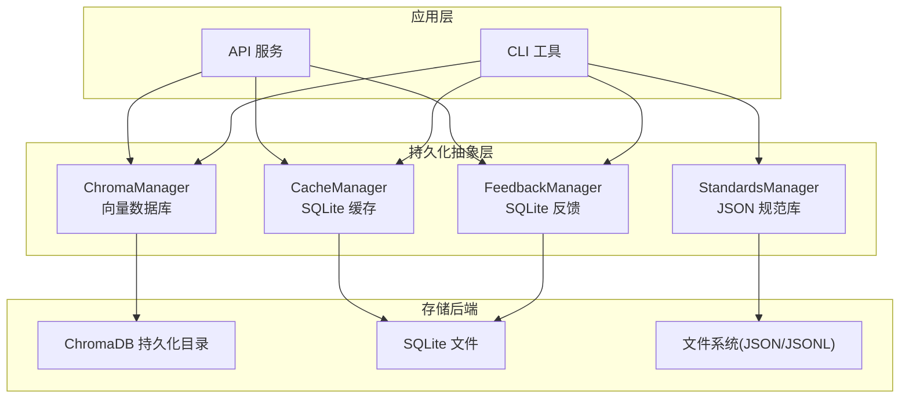
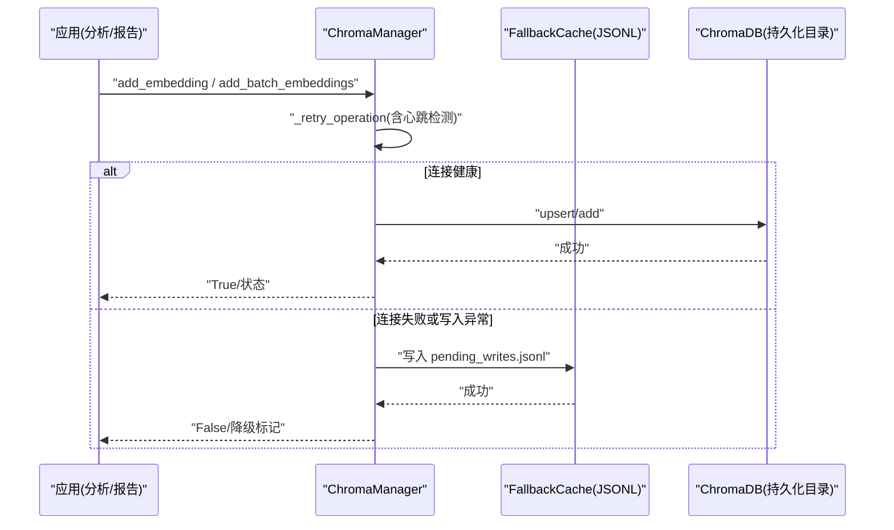
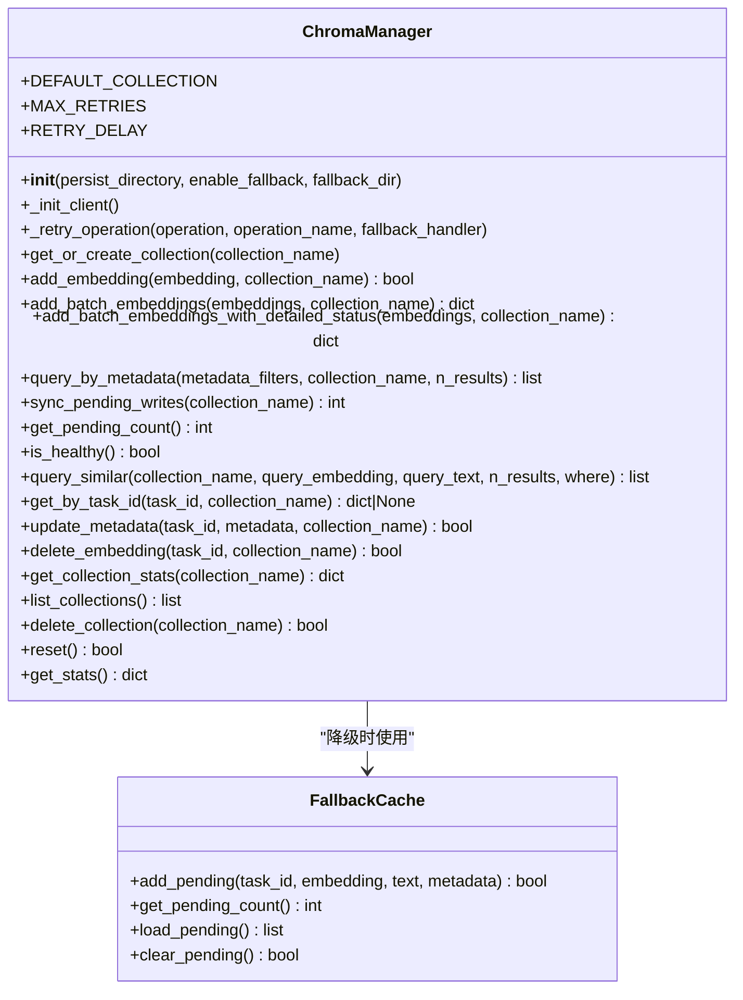
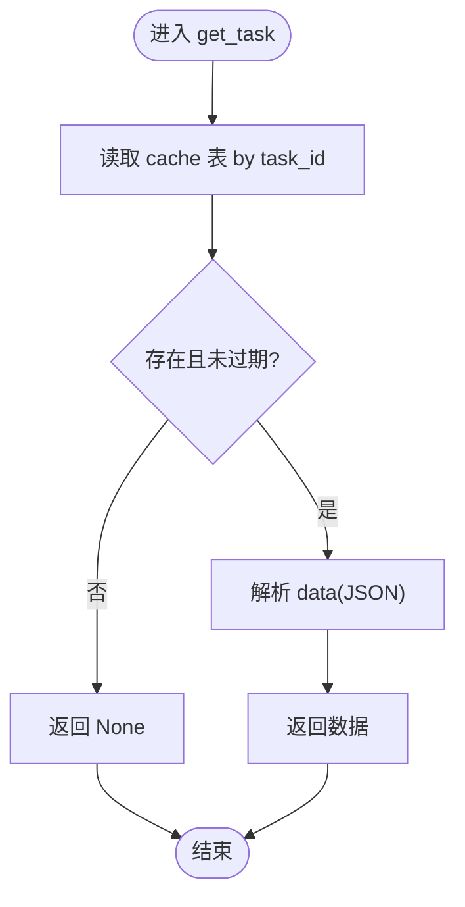
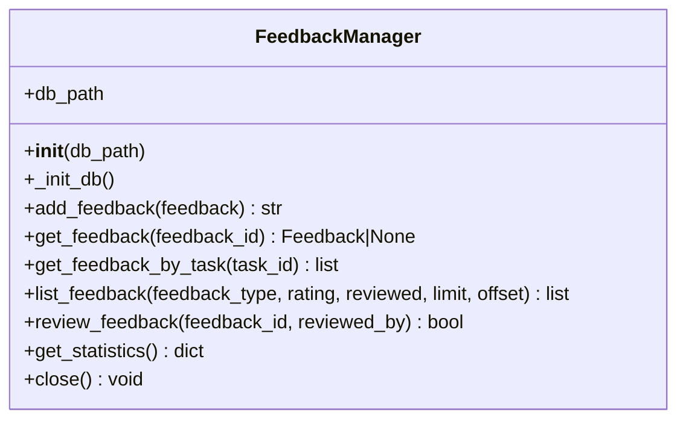
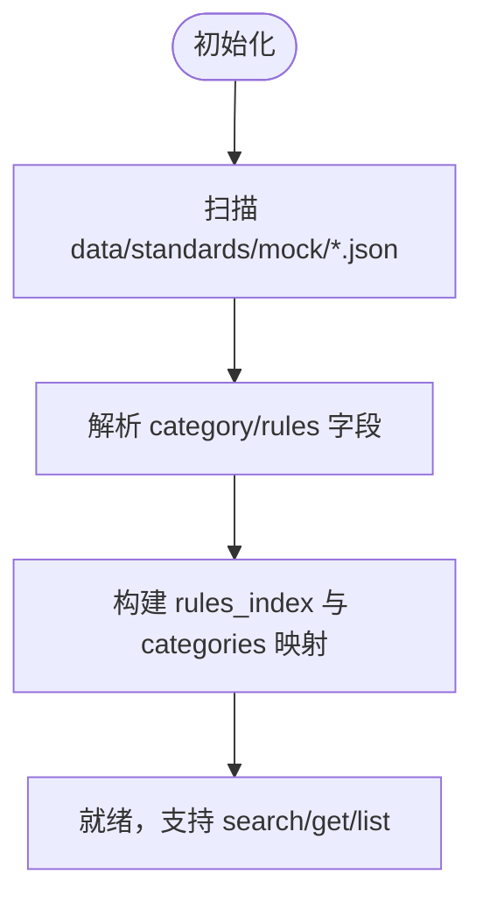
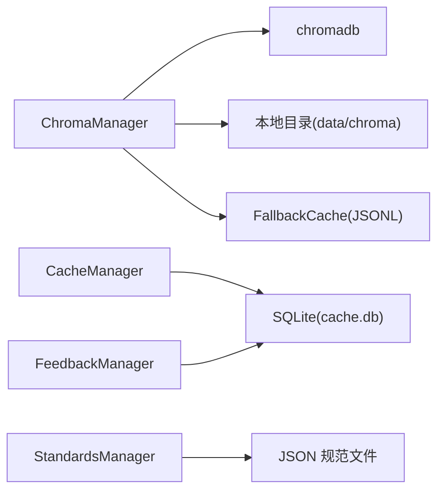

# 数据持久化方案

<cite>
**本文引用的文件**   
- [src/storage/chroma_manager.py](file://src/storage/chroma_manager.py)
- [src/core/models.py](file://src/core/models.py)
- [src/cache/manager.py](file://src/cache/manager.py)
- [src/feedback/manager.py](file://src/feedback/manager.py)
- [src/knowledge/manager.py](file://src/knowledge/manager.py)
- [config/config.yaml.example](file://config/config.yaml.example)
- [docs/DEPLOYMENT.md](file://docs/DEPLOYMENT.md)
</cite>

## 目录
1. [引言](#引言)
2. [项目结构](#项目结构)
3. [核心组件](#核心组件)
4. [架构总览](#架构总览)
5. [详细组件分析](#详细组件分析)
6. [依赖关系分析](#依赖关系分析)
7. [性能考虑](#性能考虑)
8. [故障排查指南](#故障排查指南)
9. [结论](#结论)
10. [附录](#附录)

## 引言
本技术文档围绕“数据持久化方案”展开，聚焦多存储后端（向量数据库、关系型数据库与文件系统）的统一抽象层设计，系统阐述数据模型、迁移机制、备份恢复、一致性保证、性能优化与安全访问控制等关键主题。当前仓库已实现以 ChromaDB 为核心的向量持久化能力，并辅以 SQLite 缓存与反馈存储、JSON 规范知识库以及本地文件系统的降级与归档策略，形成高可用、可扩展的持久化体系。

## 项目结构
与数据持久化直接相关的代码与配置分布如下：
- 向量数据库：ChromaManager 封装 ChromaDB 客户端，提供集合管理、写入、查询、统计与容错降级能力
- 关系型数据库：SQLite 用于缓存与反馈记录，分别由 CacheManager 与 FeedbackManager 管理
- 文件系统：规范知识库通过 JSON 文件加载；ChromaDB 使用本地持久化目录；降级缓存使用 JSONL 文件
- 配置：YAML 示例定义 LLM、Embedding、聚类、缓存、输出、日志等参数

图表来源
- [src/storage/chroma_manager.py:111-234](file://src/storage/chroma_manager.py#L111-L234)
- [src/cache/manager.py:10-36](file://src/cache/manager.py#L10-L36)
- [src/feedback/manager.py:14-51](file://src/feedback/manager.py#L14-L51)
- [src/knowledge/manager.py:13-32](file://src/knowledge/manager.py#L13-L32)
- [docs/DEPLOYMENT.md:741-756](file://docs/DEPLOYMENT.md#L741-L756)

章节来源
- [docs/DEPLOYMENT.md:741-756](file://docs/DEPLOYMENT.md#L741-L756)

## 核心组件
- 向量持久化（ChromaManager）
  - 负责向量集合的创建/获取、单条与批量写入、相似性查询、元数据过滤、统计与重置
  - 内置重试与连接健康检查，失败时自动降级到本地 JSONL 待写队列
- 缓存持久化（CacheManager）
  - 基于 SQLite 的任务级缓存，支持 TTL、过期清理、索引与统计
- 反馈持久化（FeedbackManager）
  - 基于 SQLite 的用户反馈与审核记录，包含多维索引与统计
- 规范知识库（StandardsManager）
  - 从 JSON 文件加载标准类别与规则，提供检索与统计接口
- 配置（Config）
  - YAML 示例覆盖 LLM、Embedding、聚类、缓存、输出、日志等关键参数

章节来源
- [src/storage/chroma_manager.py:111-234](file://src/storage/chroma_manager.py#L111-L234)
- [src/cache/manager.py:10-36](file://src/cache/manager.py#L10-L36)
- [src/feedback/manager.py:14-51](file://src/feedback/manager.py#L14-L51)
- [src/knowledge/manager.py:13-32](file://src/knowledge/manager.py#L13-L32)
- [config/config.yaml.example:1-38](file://config/config.yaml.example#L1-L38)

## 架构总览
下图展示数据在系统中的流转路径与存储落点，包括正常写入与异常降级的分支流程。

图表来源
- [src/storage/chroma_manager.py:173-222](file://src/storage/chroma_manager.py#L173-L222)
- [src/storage/chroma_manager.py:236-284](file://src/storage/chroma_manager.py#L236-L284)
- [src/storage/chroma_manager.py:285-349](file://src/storage/chroma_manager.py#L285-L349)
- [src/storage/chroma_manager.py:437-482](file://src/storage/chroma_manager.py#L437-L482)

## 详细组件分析

### 向量数据库（ChromaManager）
- 职责
  - 初始化与连接健康检查（心跳）
  - 集合管理（获取/创建/删除/列表/统计）
  - 写入（单条 upsert、批量 add、带详细状态的批量写入）
  - 查询（相似性查询、元数据过滤、按 task_id 获取）
  - 元数据更新与删除
  - 降级与同步（本地 JSONL 待写队列与同步）
- 关键特性
  - 重试机制：可配置最大重试次数与退避延迟
  - 降级策略：ChromaDB 不可用时写入本地 pending_writes.jsonl
  - 同步机制：后台任务可调用 sync_pending_writes 将待写数据回灌至 ChromaDB
  - 统计信息：集合数量、总向量数、持久化目录、连接健康度、待写计数

图表来源
- [src/storage/chroma_manager.py:111-234](file://src/storage/chroma_manager.py#L111-L234)
- [src/storage/chroma_manager.py:42-109](file://src/storage/chroma_manager.py#L42-L109)

章节来源
- [src/storage/chroma_manager.py:111-234](file://src/storage/chroma_manager.py#L111-L234)
- [src/storage/chroma_manager.py:236-284](file://src/storage/chroma_manager.py#L236-L284)
- [src/storage/chroma_manager.py:285-349](file://src/storage/chroma_manager.py#L285-L349)
- [src/storage/chroma_manager.py:437-482](file://src/storage/chroma_manager.py#L437-L482)

### 缓存持久化（CacheManager）
- 职责
  - 基于 SQLite 的任务缓存读写、过期判断、清理与统计
  - 为上层模块提供快速命中与减少重复计算的能力
- 关键特性
  - TTL 控制：按秒设置过期时间
  - 索引优化：对 expires_at 建立索引加速过期清理与统计
  - 统计与索引：返回总数、有效条目、过期条目及索引列表

图表来源
- [src/cache/manager.py:37-55](file://src/cache/manager.py#L37-L55)
- [src/cache/manager.py:122-138](file://src/cache/manager.py#L122-L138)

章节来源
- [src/cache/manager.py:10-36](file://src/cache/manager.py#L10-L36)
- [src/cache/manager.py:37-55](file://src/cache/manager.py#L37-L55)
- [src/cache/manager.py:122-138](file://src/cache/manager.py#L122-L138)

### 反馈持久化（FeedbackManager）
- 职责
  - 用户反馈的增删改查、审核与统计分析
  - 为质量评估与模型迭代提供结构化数据支撑
- 关键特性
  - 多维度索引：task_id、feedback_type、rating、reviewed
  - 统计指标：总量、类型分布、评分分布、审核比例、纠错率与好评率

图表来源
- [src/feedback/manager.py:14-51](file://src/feedback/manager.py#L14-L51)
- [src/feedback/manager.py:53-81](file://src/feedback/manager.py#L53-L81)
- [src/feedback/manager.py:213-265](file://src/feedback/manager.py#L213-L265)

章节来源
- [src/feedback/manager.py:14-51](file://src/feedback/manager.py#L14-L51)
- [src/feedback/manager.py:53-81](file://src/feedback/manager.py#L53-L81)
- [src/feedback/manager.py:213-265](file://src/feedback/manager.py#L213-L265)

### 规范知识库（StandardsManager）
- 职责
  - 从 JSON 文件加载标准类别与规则，构建内存索引，提供检索与统计
- 关键特性
  - 动态加载：扫描指定目录下的 *_standards.json 文件
  - 索引与搜索：按 ID、关键字、级别、子类别检索

图表来源
- [src/knowledge/manager.py:16-32](file://src/knowledge/manager.py#L16-L32)
- [src/knowledge/manager.py:33-70](file://src/knowledge/manager.py#L33-L70)

章节来源
- [src/knowledge/manager.py:16-32](file://src/knowledge/manager.py#L16-L32)
- [src/knowledge/manager.py:33-70](file://src/knowledge/manager.py#L33-L70)

### 数据模型（核心实体与约束）
- 任务与结果
  - TaskStatus、TaskPriority、TaskData：任务基础信息与校验（ID 正整数、标题非空、解决时间不早于创建时间）
  - AnalysisResult：分析结果（置信度范围、违规/根因计数非负）
- 聚类与嵌入
  - ClusterInfo、ClusterResult：聚类标识、成员、中心、概率等
  - EmbeddingData、EmbeddingResult：向量化结果（维度、媒体类型、文本内容）
- 规范与变更
  - StandardCategory、StandardRule：规范类别与规则（含示例规范化）
  - CodeChange：提交级变更（diff、文件列表、分支、仓库）
- 其他
  - LabelInfo、RootCauseInfo、ImprovementMeasure、ViolationDetection、RootCauseValidation、LLMAnalysisResult、RootCauseStat、ImprovementRecommendation

章节来源
- [src/core/models.py:16-68](file://src/core/models.py#L16-L68)
- [src/core/models.py:71-117](file://src/core/models.py#L71-L117)
- [src/core/models.py:119-153](file://src/core/models.py#L119-L153)
- [src/core/models.py:155-208](file://src/core/models.py#L155-L208)
- [src/core/models.py:210-241](file://src/core/models.py#L210-L241)
- [src/core/models.py:248-280](file://src/core/models.py#L248-L280)
- [src/core/models.py:302-313](file://src/core/models.py#L302-L313)
- [src/core/models.py:370-395](file://src/core/models.py#L370-L395)

## 依赖关系分析
- 组件耦合
  - ChromaManager 依赖 chromadb 客户端与本地持久化目录；可选依赖 FallbackCache（JSONL）
  - CacheManager 与 FeedbackManager 均依赖 SQLite 文件
  - StandardsManager 依赖文件系统（JSON）
- 外部依赖
  - chromadb、sqlite3、loguru、pydantic
- 潜在风险
  - ChromaDB 连接不稳定时的降级与同步需配合调度任务
  - SQLite 在高并发写入场景下需关注锁竞争与 WAL 模式

图表来源
- [src/storage/chroma_manager.py:138-172](file://src/storage/chroma_manager.py#L138-L172)
- [src/cache/manager.py:16-36](file://src/cache/manager.py#L16-L36)
- [src/feedback/manager.py:18-51](file://src/feedback/manager.py#L18-L51)
- [src/knowledge/manager.py:22-32](file://src/knowledge/manager.py#L22-L32)

章节来源
- [src/storage/chroma_manager.py:138-172](file://src/storage/chroma_manager.py#L138-L172)
- [src/cache/manager.py:16-36](file://src/cache/manager.py#L16-L36)
- [src/feedback/manager.py:18-51](file://src/feedback/manager.py#L18-L51)
- [src/knowledge/manager.py:22-32](file://src/knowledge/manager.py#L22-L32)

## 性能考虑
- 索引策略
  - SQLite：为 expires_at、task_id、feedback_type、rating、reviewed 建立索引，提升查询与清理效率
  - ChromaDB：利用集合元数据过滤与近似最近邻检索，避免全量扫描
- 查询优化
  - 优先使用元数据过滤与精确 ID 查询
  - 批量写入优于逐条写入，降低 I/O 与网络开销
- 存储压缩
  - 大文本与 diff 建议采用外部对象存储或分片存储，仅保留引用与摘要
  - JSONL 待写队列定期合并与压缩，避免单文件过大
- 并发与事务
  - SQLite 默认单写者，可通过 WAL 模式与合理批处理提升吞吐
  - ChromaDB 写入具备重试与幂等（upsert），注意去重键（task_id）

[本节为通用指导，无需特定文件来源]

## 故障排查指南
- 常见问题
  - ChromaDB 初始化失败：检查持久化目录权限与磁盘空间；确认心跳是否可达
  - 写入失败：查看重试次数与退避策略；确认降级队列是否存在待写记录
  - 同步失败：检查集合是否存在、元数据格式是否正确
  - SQLite 锁冲突：检查并发写入频率，必要时调整事务粒度或使用 WAL 模式
- 诊断手段
  - 使用 is_healthy 与 get_stats 监控连接健康与数据规模
  - 使用 get_pending_count 与 load_pending 检查降级队列积压情况
  - 使用 cleanup_expired 与 get_stats 维护缓存健康度

章节来源
- [src/storage/chroma_manager.py:138-172](file://src/storage/chroma_manager.py#L138-L172)
- [src/storage/chroma_manager.py:490-499](file://src/storage/chroma_manager.py#L490-L499)
- [src/storage/chroma_manager.py:658-687](file://src/storage/chroma_manager.py#L658-L687)
- [src/cache/manager.py:156-164](file://src/cache/manager.py#L156-L164)

## 结论
本方案以 ChromaManager 为核心，结合 SQLite 缓存与反馈存储、JSON 规范知识库与本地文件系统，构建了面向高可用的多存储后端持久化体系。通过重试、降级与同步机制，系统在向量数据库不可用时仍能保证数据不丢失；通过索引与批量操作优化，提升了整体吞吐与查询性能。后续可在统一抽象层上扩展更多后端（如关系型数据库、对象存储），并通过版本化迁移脚本保障向后兼容。

[本节为总结性内容，无需特定文件来源]

## 附录

### 数据迁移机制（版本管理与转换策略）
- 现状
  - 当前仓库未提供显式的数据库迁移框架；Schema 变更通常通过 DDL 语句在初始化阶段执行
- 建议实践
  - 引入版本化迁移脚本（例如按版本号命名），在启动时比对并执行增量迁移
  - 对历史数据提供转换脚本，确保新旧字段兼容
  - 对向量集合增加元数据版本字段，便于识别与升级

[本节为概念性说明，无需特定文件来源]

### 备份与恢复流程（全量/增量/灾难恢复）
- 全量备份
  - 复制 data 目录（包含 chroma 持久化目录与 SQLite 文件）、output 与配置文件
- 增量备份
  - 针对 pending_writes.jsonl 与 SQLite 的增量快照（WAL 文件）进行周期性拷贝
- 灾难恢复
  - 停止服务后恢复 data 与 output，再重启服务；若启用降级队列，先执行同步再开放写入

章节来源
- [docs/DEPLOYMENT.md:741-819](file://docs/DEPLOYMENT.md#L741-L819)

### 数据一致性保证（事务、并发与校验）
- 事务处理
  - SQLite 每个连接内的事务由驱动管理；建议在业务层组合多条写入为单一事务
- 并发控制
  - 限制并发写入线程数；对热点任务使用幂等键（task_id）避免重复
- 数据校验
  - 使用 Pydantic 模型进行入参校验（字段类型、范围、非空等）
  - 在写入前对向量维度与文本长度做断言，防止污染索引

章节来源
- [src/core/models.py:16-68](file://src/core/models.py#L16-L68)
- [src/core/models.py:119-153](file://src/core/models.py#L119-L153)

### 数据安全与访问控制
- 传输安全
  - 对外 API 建议使用 HTTPS；认证令牌通过 Authorization 头传递
- 存储安全
  - 敏感配置（API Key、Base URL）应通过环境变量或受控配置文件注入
  - 本地数据目录设置最小权限，避免越权访问
- 输入安全
  - 对所有外部输入进行白名单与长度限制校验，防止注入与溢出

章节来源
- [config/config.yaml.example:1-38](file://config/config.yaml.example#L1-L38)