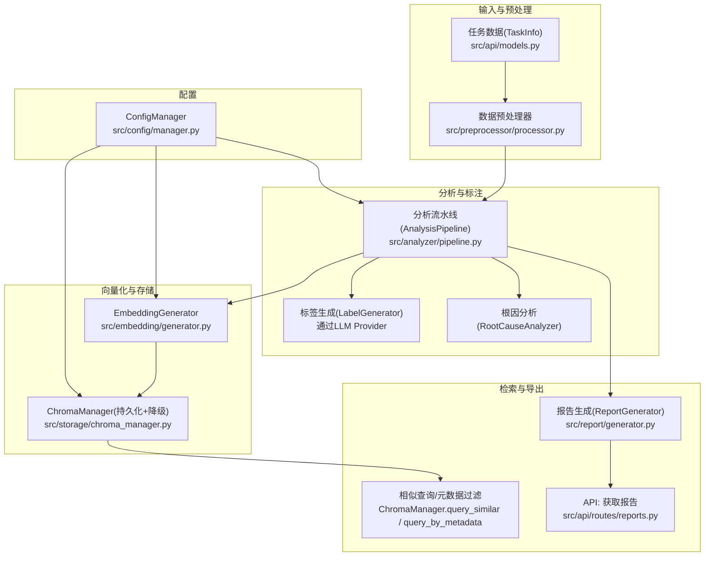
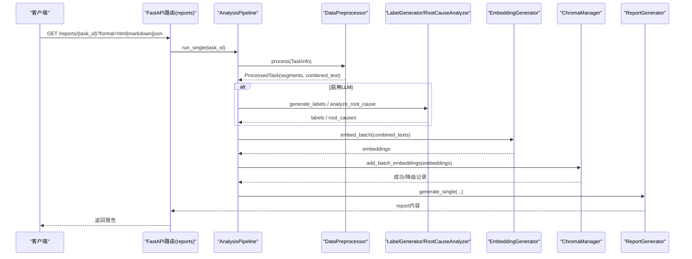
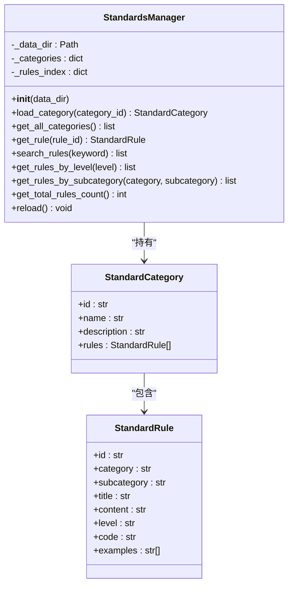
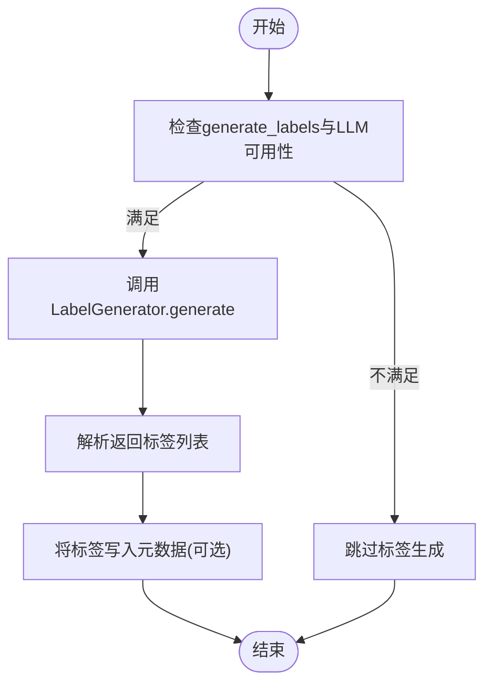
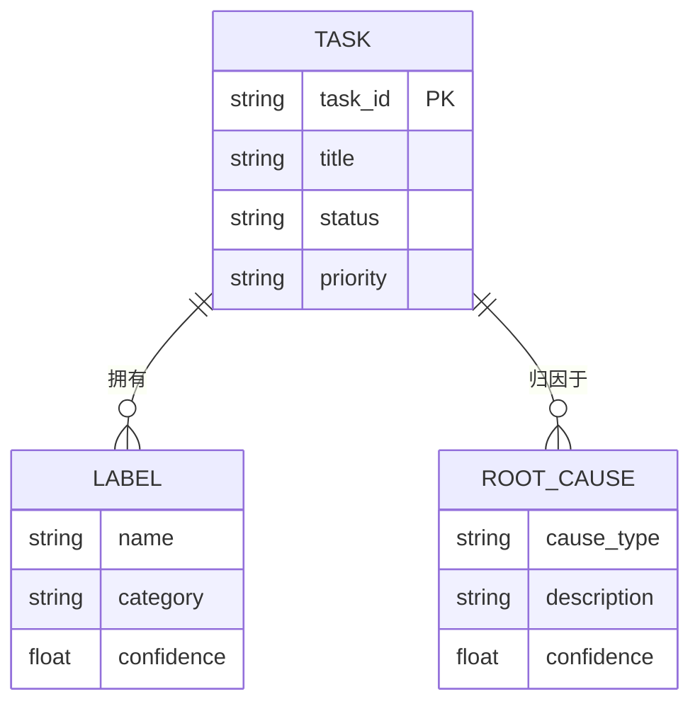
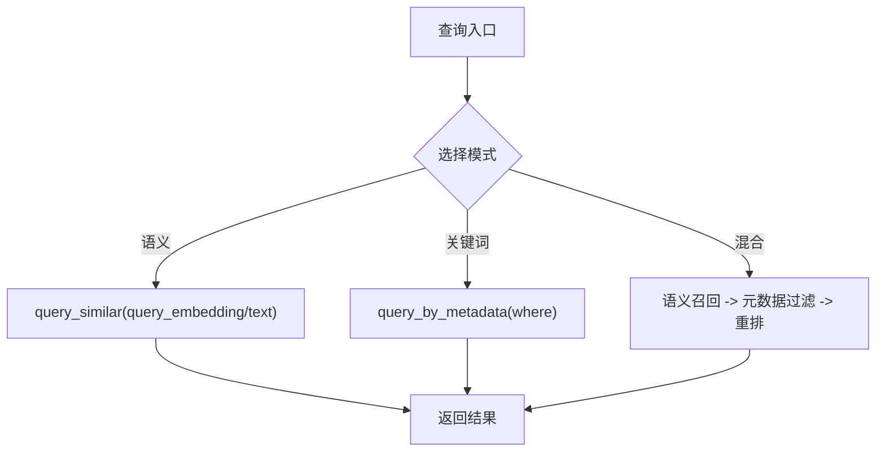
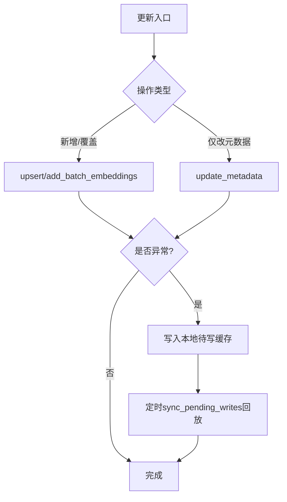
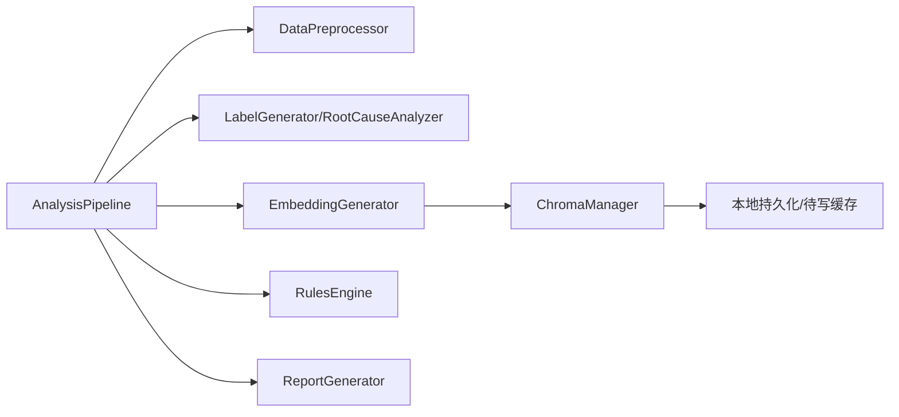
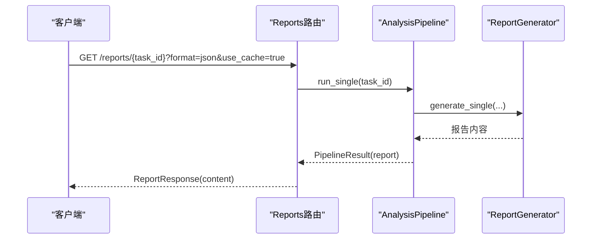

# 知识库管理

<cite>
**本文引用的文件**   
- [src/knowledge/manager.py](file://src/knowledge/manager.py)
- [src/core/models.py](file://src/core/models.py)
- [src/analyzer/pipeline.py](file://src/analyzer/pipeline.py)
- [src/embedding/generator.py](file://src/embedding/generator.py)
- [src/storage/chroma_manager.py](file://src/storage/chroma_manager.py)
- [src/preprocessor/processor.py](file://src/preprocessor/processor.py)
- [src/api/models.py](file://src/api/models.py)
- [src/report/generator.py](file://src/report/generator.py)
- [src/api/routes/reports.py](file://src/api/routes/reports.py)
- [src/config/manager.py](file://src/config/manager.py)
</cite>

## 目录
1. [简介](#简介)
2. [项目结构](#项目结构)
3. [核心组件](#核心组件)
4. [架构总览](#架构总览)
5. [详细组件分析](#详细组件分析)
6. [依赖关系分析](#依赖关系分析)
7. [性能与可扩展性](#性能与可扩展性)
8. [故障排查指南](#故障排查指南)
9. [结论](#结论)
10. [附录：API参考与集成示例](#附录api参考与集成示例)

## 简介
本技术文档聚焦“知识库管理模块”，围绕以下目标展开：
- 技术标签提取机制：LLM驱动的自动标签生成、标签分类与关联规则。
- 知识图谱构建过程：实体识别、关系抽取与图谱存储结构（以向量检索为核心的近似图）。
- 知识检索系统：语义搜索、关键词匹配与混合检索策略。
- 知识更新机制：增量更新、版本管理与冲突处理。
- 知识质量评估：准确性验证、完整性检查与时效性维护。
- 知识导出导入：格式支持与批量操作。
- API参考与集成示例：面向外部系统的调用方式与最佳实践。

## 项目结构
知识库相关能力由多个子模块协作完成，关键路径如下：
- 规范知识库加载与管理：src/knowledge/manager.py + src/core/models.py
- 分析流水线编排：src/analyzer/pipeline.py
- 文本预处理与片段化：src/preprocessor/processor.py
- 向量化与相似度计算：src/embedding/generator.py
- 向量数据库与容错写入：src/storage/chroma_manager.py
- 报告生成与导出：src/report/generator.py
- 配置与环境覆盖：src/config/manager.py
- 对外API入口（报告获取）：src/api/routes/reports.py

图示来源
- [src/analyzer/pipeline.py:66-182](file://src/analyzer/pipeline.py#L66-L182)
- [src/embedding/generator.py:91-135](file://src/embedding/generator.py#L91-L135)
- [src/storage/chroma_manager.py:111-172](file://src/storage/chroma_manager.py#L111-L172)
- [src/preprocessor/processor.py:5-24](file://src/preprocessor/processor.py#L5-L24)
- [src/report/generator.py:222-303](file://src/report/generator.py#L222-L303)
- [src/api/routes/reports.py:16-130](file://src/api/routes/reports.py#L16-L130)
- [src/config/manager.py:42-100](file://src/config/manager.py#L42-L100)

章节来源
- [src/knowledge/manager.py:13-118](file://src/knowledge/manager.py#L13-L118)
- [src/core/models.py:248-279](file://src/core/models.py#L248-L279)
- [src/analyzer/pipeline.py:66-182](file://src/analyzer/pipeline.py#L66-L182)
- [src/embedding/generator.py:91-135](file://src/embedding/generator.py#L91-L135)
- [src/storage/chroma_manager.py:111-172](file://src/storage/chroma_manager.py#L111-L172)
- [src/preprocessor/processor.py:5-24](file://src/preprocessor/processor.py#L5-L24)
- [src/report/generator.py:222-303](file://src/report/generator.py#L222-L303)
- [src/api/routes/reports.py:16-130](file://src/api/routes/reports.py#L16-L130)
- [src/config/manager.py:42-100](file://src/config/manager.py#L42-L100)

## 核心组件
- 规范知识库管理器 StandardsManager
  - 职责：从JSON规范文件加载类别与规则，提供按关键字、级别、子类别的检索能力。
  - 数据结构：StandardCategory、StandardRule（定义见 core/models.py）。
- 分析流水线 AnalysisPipeline
  - 职责：编排数据拉取、预处理、LLM标签生成、根因分析、规则校验、报告生成；支持单条与批量并发执行。
  - 关键输出：labels、root_causes、deep_root_causes、violations、report。
- 文本预处理器 DataPreprocessor
  - 职责：将TaskInfo拆分为多段TextSegment并拼接为combined_text，便于后续嵌入与分析。
- 向量化器 EmbeddingGenerator
  - 职责：对文本进行embedding，支持本地/远程多种Provider、LRU缓存、自适应限流、熔断器、批量并发。
- 向量数据库 ChromaManager
  - 职责：集合CRUD、相似查询、元数据过滤、批量写入、健康检查、失败降级到本地待写缓存。
- 报告生成 ReportGenerator
  - 职责：基于模板生成Markdown/HTML/PDF/JSON报告，支持自定义模板目录。
- 配置管理 ConfigManager
  - 职责：YAML/JSON配置加载、环境变量覆盖、AppConfig实例化与校验。

章节来源
- [src/knowledge/manager.py:13-118](file://src/knowledge/manager.py#L13-L118)
- [src/core/models.py:248-279](file://src/core/models.py#L248-L279)
- [src/analyzer/pipeline.py:66-182](file://src/analyzer/pipeline.py#L66-L182)
- [src/preprocessor/processor.py:5-24](file://src/preprocessor/processor.py#L5-L24)
- [src/embedding/generator.py:91-135](file://src/embedding/generator.py#L91-L135)
- [src/storage/chroma_manager.py:111-172](file://src/storage/chroma_manager.py#L111-L172)
- [src/report/generator.py:222-303](file://src/report/generator.py#L222-L303)
- [src/config/manager.py:42-100](file://src/config/manager.py#L42-L100)

## 架构总览
下图展示从原始任务数据到可检索知识资产的端到端流程，以及对外API的访问路径。

图示来源
- [src/api/routes/reports.py:16-130](file://src/api/routes/reports.py#L16-L130)
- [src/analyzer/pipeline.py:105-170](file://src/analyzer/pipeline.py#L105-L170)
- [src/preprocessor/processor.py:5-24](file://src/preprocessor/processor.py#L5-L24)
- [src/embedding/generator.py:245-310](file://src/embedding/generator.py#L245-L310)
- [src/storage/chroma_manager.py:285-349](file://src/storage/chroma_manager.py#L285-L349)
- [src/report/generator.py:250-303](file://src/report/generator.py#L250-L303)

## 详细组件分析

### 规范知识库（StandardsManager）
- 功能要点
  - 扫描指定目录下 *_standards.json 文件，解析为标准类别与规则对象。
  - 提供按关键字、级别、子类别的检索接口。
  - 支持重载全部规范数据。
- 数据模型
  - StandardCategory：包含id、name、description、rules列表。
  - StandardRule：包含id、category、subcategory、title、content、level、code、examples等字段。
- 复杂度与性能
  - 初始化时全量加载，索引建立O(N)。
  - 关键字搜索线性遍历O(N)，适合中小规模规则集。
- 扩展建议
  - 引入倒排索引或轻量搜索引擎提升检索性能。
  - 增加规则版本与生效时间戳，支持灰度发布。

图示来源
- [src/knowledge/manager.py:13-118](file://src/knowledge/manager.py#L13-L118)
- [src/core/models.py:248-279](file://src/core/models.py#L248-L279)

章节来源
- [src/knowledge/manager.py:13-118](file://src/knowledge/manager.py#L13-L118)
- [src/core/models.py:248-279](file://src/core/models.py#L248-L279)

### 标签提取机制（LLM驱动）
- 触发条件
  - 在AnalysisPipeline中，当generate_labels为True且LLM可用时，调用LabelGenerator.generate。
- 输入与输出
  - 输入：原始任务数据与预处理后的segments。
  - 输出：标签列表（名称、置信度、类别、描述），用于后续入库与检索。
- 分类与关联规则
  - 标签类别来源于LLM生成结果中的category字段；可在上层根据业务规则进行二次归类与合并。
  - 建议在入库时将标签作为元数据附加到向量记录，以便后续过滤与统计。
- 错误与降级
  - 若LLM不可用，返回空标签列表，不影响其他流程。

图示来源
- [src/analyzer/pipeline.py:293-320](file://src/analyzer/pipeline.py#L293-L320)

章节来源
- [src/analyzer/pipeline.py:293-320](file://src/analyzer/pipeline.py#L293-L320)

### 知识图谱构建（实体识别、关系抽取、存储结构）
- 实体识别
  - 当前实现未显式NER管线，但可通过LLM在标签/根因分析阶段产出结构化实体（如问题类型、模块、责任人等），并以元数据形式存储。
- 关系抽取
  - 通过标签与根因的共现关系、聚类结果与任务ID映射，形成“任务-标签-根因”的隐式图结构。
- 图谱存储结构
  - 使用Chroma集合存储向量与文档，元数据中包含task_id、标签、根因等信息，构成近似的知识图谱节点与边。
  - 支持按元数据过滤（where）与相似查询，实现图上的邻接检索。

图示来源
- [src/storage/chroma_manager.py:236-284](file://src/storage/chroma_manager.py#L236-L284)
- [src/analyzer/pipeline.py:322-349](file://src/analyzer/pipeline.py#L322-L349)

章节来源
- [src/storage/chroma_manager.py:236-284](file://src/storage/chroma_manager.py#L236-L284)
- [src/analyzer/pipeline.py:322-349](file://src/analyzer/pipeline.py#L322-L349)

### 知识检索系统（语义搜索、关键词匹配、混合检索）
- 语义搜索
  - 通过ChromaManager.query_similar支持query_embedding或query_text直接检索。
- 关键词匹配
  - 通过ChromaManager.query_by_metadata结合where条件进行精确/范围过滤。
- 混合检索策略
  - 先语义召回Top-K，再按元数据过滤排序；或在应用层融合评分（例如余弦相似度与关键词命中分加权）。
- 相似度度量
  - EmbeddingGenerator提供cosine_similarity与矩阵计算工具，可用于离线评估与阈值调优。

图示来源
- [src/storage/chroma_manager.py:400-435](file://src/storage/chroma_manager.py#L400-L435)
- [src/storage/chroma_manager.py:501-532](file://src/storage/chroma_manager.py#L501-L532)
- [src/embedding/generator.py:410-426](file://src/embedding/generator.py#L410-L426)

章节来源
- [src/storage/chroma_manager.py:400-435](file://src/storage/chroma_manager.py#L400-L435)
- [src/storage/chroma_manager.py:501-532](file://src/storage/chroma_manager.py#L501-L532)
- [src/embedding/generator.py:410-426](file://src/embedding/generator.py#L410-L426)

### 知识更新机制（增量更新、版本管理、冲突处理）
- 增量更新
  - 新增任务：生成embedding后调用add_embedding或add_batch_embeddings写入集合。
  - 元数据更新：update_metadata可按task_id更新标签、根因等元信息。
- 版本管理
  - 建议在元数据中增加version字段与更新时间戳，配合历史快照导出，便于回滚与审计。
- 冲突处理
  - upsert语义保证同task_id的向量与元数据幂等覆盖；如需保留历史，可将旧版本归档至独立集合或外置存储。
- 容错与降级
  - ChromaManager内置重试与本地待写缓存FallbackCache，异常时降级写入pending_writes.jsonl，后续可同步回放。

图示来源
- [src/storage/chroma_manager.py:236-284](file://src/storage/chroma_manager.py#L236-L284)
- [src/storage/chroma_manager.py:285-349](file://src/storage/chroma_manager.py#L285-L349)
- [src/storage/chroma_manager.py:576-594](file://src/storage/chroma_manager.py#L576-L594)
- [src/storage/chroma_manager.py:437-482](file://src/storage/chroma_manager.py#L437-L482)

章节来源
- [src/storage/chroma_manager.py:236-284](file://src/storage/chroma_manager.py#L236-L284)
- [src/storage/chroma_manager.py:285-349](file://src/storage/chroma_manager.py#L285-L349)
- [src/storage/chroma_manager.py:576-594](file://src/storage/chroma_manager.py#L576-L594)
- [src/storage/chroma_manager.py:437-482](file://src/storage/chroma_manager.py#L437-L482)

### 知识质量评估（准确性、完整性、时效性）
- 准确性验证
  - 利用LLM生成的置信度字段与根因可落地性验证结果，结合人工抽检与A/B对比。
- 完整性检查
  - 对每个任务的元数据字段（标签、根因、证据、改进措施）进行非空校验，缺失则标记补全。
- 时效性维护
  - 在元数据中记录更新时间与过期阈值，定期扫描并触发重新分析或提醒。

章节来源
- [src/core/models.py:182-208](file://src/core/models.py#L182-L208)
- [src/analyzer/pipeline.py:322-349](file://src/analyzer/pipeline.py#L322-L349)

### 知识导出导入（格式支持与批量操作）
- 导出
  - 报告生成支持Markdown/HTML/PDF/JSON；批量场景可使用批量报告接口。
  - 向量库导出：通过list_collections与get_stats辅助盘点，结合外部工具导出集合数据。
- 导入
  - 通过add_batch_embeddings批量写入；对于历史数据，建议分批提交并监控成功率。
- 批量操作
  - 使用add_batch_embeddings_with_detailed_status获取每条记录的详细状态，便于重试与补偿。

章节来源
- [src/report/generator.py:250-303](file://src/report/generator.py#L250-L303)
- [src/storage/chroma_manager.py:361-398](file://src/storage/chroma_manager.py#L361-L398)
- [src/storage/chroma_manager.py:612-686](file://src/storage/chroma_manager.py#L612-L686)

## 依赖关系分析
- 组件耦合
  - AnalysisPipeline聚合了预处理、LLM、向量化、规则引擎、报告生成等能力，属于高内聚编排者。
  - EmbeddingGenerator与ChromaManager解耦良好，前者专注向量生产，后者专注持久化与查询。
- 外部依赖
  - OpenAI兼容SDK用于embedding；ChromaDB用于向量存储；Jinja2用于模板渲染。
- 潜在循环依赖
  - 当前未见循环import；各模块通过明确接口交互。

图示来源
- [src/analyzer/pipeline.py:66-182](file://src/analyzer/pipeline.py#L66-L182)
- [src/embedding/generator.py:91-135](file://src/embedding/generator.py#L91-L135)
- [src/storage/chroma_manager.py:111-172](file://src/storage/chroma_manager.py#L111-L172)

章节来源
- [src/analyzer/pipeline.py:66-182](file://src/analyzer/pipeline.py#L66-L182)
- [src/embedding/generator.py:91-135](file://src/embedding/generator.py#L91-L135)
- [src/storage/chroma_manager.py:111-172](file://src/storage/chroma_manager.py#L111-L172)

## 性能与可扩展性
- 并发与批处理
  - EmbeddingGenerator支持batch_size与max_concurrency控制；ChromaManager支持批量写入。
- 缓存与限流
  - LRU缓存减少重复请求；自适应速率限制器动态调整QPS；熔断器保护下游服务。
- 降級与容错
  - ChromaManager在连接异常时降级到本地待写缓存，保障数据不丢失。
- 优化建议
  - 针对高频查询热点，可增加二级缓存（内存）与结果分页。
  - 对大规模数据，考虑将集合按主题拆分，降低单次查询开销。

[本节为通用指导，无需具体文件引用]

## 故障排查指南
- 常见问题
  - LLM不可用：确认API Key与Base URL，检查create_llm_provider返回是否为None。
  - 向量写入失败：查看ChromaManager.is_healthy与get_stats，关注pending_writes数量。
  - 报告生成失败：检查模板目录是否存在与模板语法是否正确。
- 定位手段
  - 日志：loguru在各模块均有详细日志输出。
  - 指标：CircuitBreaker与AdaptiveRateLimiter的状态可作为健康信号。
  - 降级回放：调用sync_pending_writes尝试恢复待写数据。

章节来源
- [src/storage/chroma_manager.py:490-500](file://src/storage/chroma_manager.py#L490-L500)
- [src/storage/chroma_manager.py:437-482](file://src/storage/chroma_manager.py#L437-L482)
- [src/report/generator.py:222-248](file://src/report/generator.py#L222-L248)

## 结论
本知识库管理模块以“分析流水线”为核心，串联预处理、LLM标注、向量化与向量检索，形成从数据到知识的闭环。通过规范的元数据设计与容错机制，实现了高可用的知识沉淀与检索能力。后续可在实体/关系抽取、混合检索融合、版本治理等方面持续增强。

[本节为总结，无需具体文件引用]

## 附录：API参考与集成示例
- 获取分析报告
  - 方法：GET
  - 路径：/reports/{task_id}
  - 参数：
    - format：html/markdown/json（默认html）
    - use_cache：是否使用缓存（默认true）
  - 响应：
    - task_id：字符串
    - report_format：字符串
    - content：报告内容
  - 错误码：
    - 400：无效task_id或format
    - 404：任务不存在
    - 500：内部错误

图示来源
- [src/api/routes/reports.py:16-130](file://src/api/routes/reports.py#L16-L130)
- [src/analyzer/pipeline.py:105-170](file://src/analyzer/pipeline.py#L105-L170)
- [src/report/generator.py:250-303](file://src/report/generator.py#L250-L303)

章节来源
- [src/api/routes/reports.py:16-130](file://src/api/routes/reports.py#L16-L130)
- [src/analyzer/pipeline.py:105-170](file://src/analyzer/pipeline.py#L105-L170)
- [src/report/generator.py:250-303](file://src/report/generator.py#L250-L303)