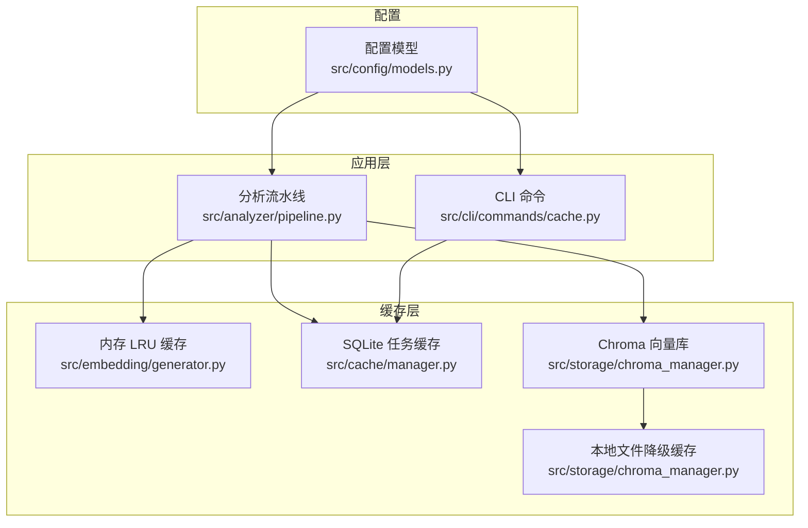
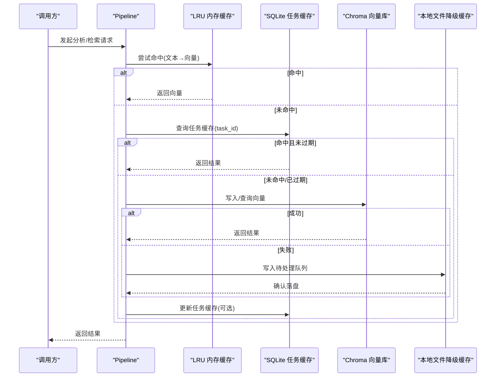
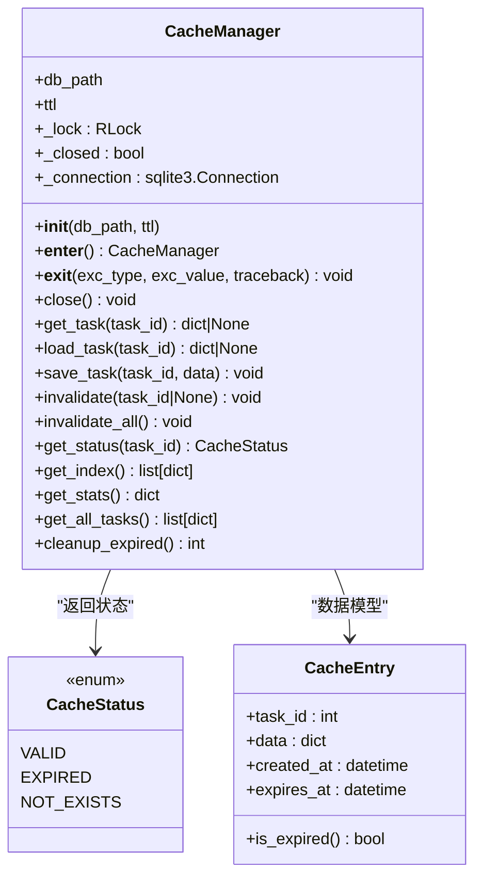
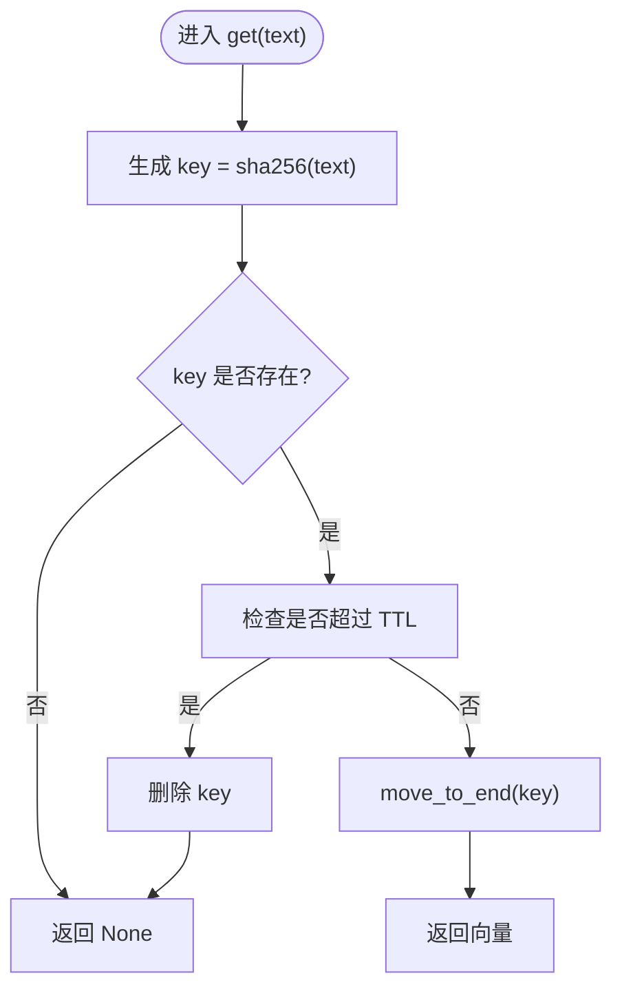
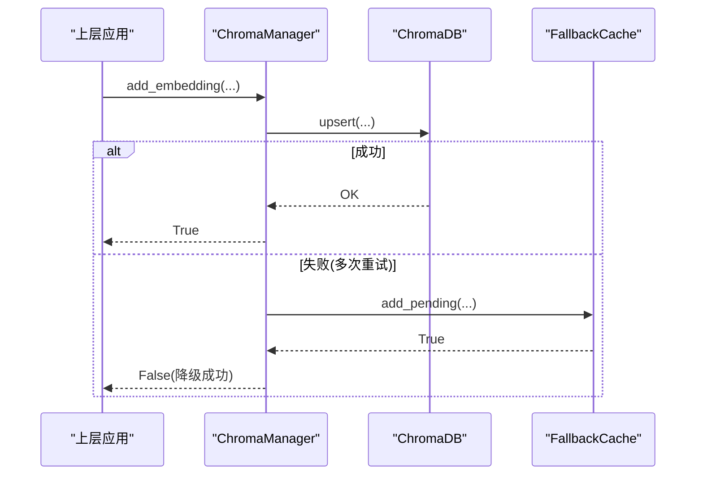
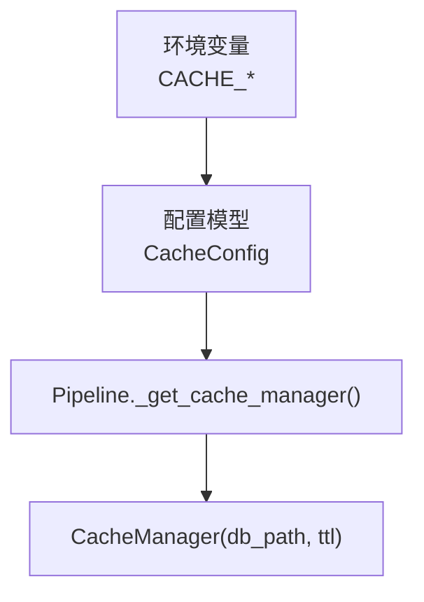
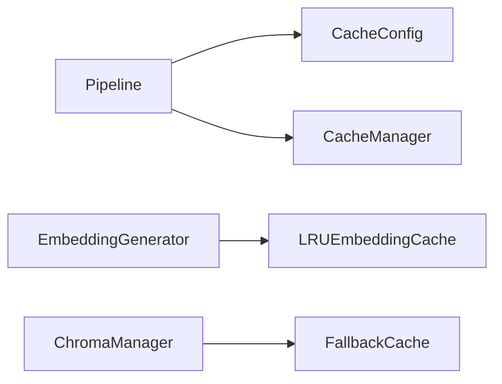
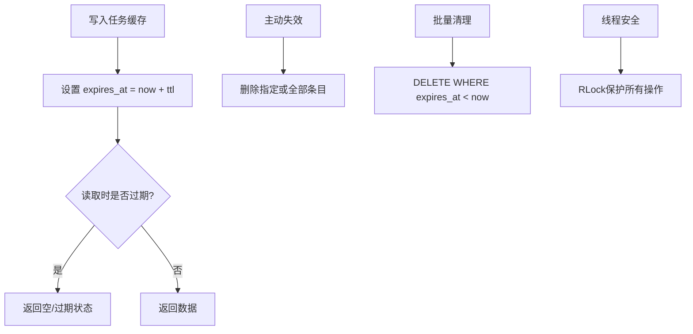

# 缓存管理系统

<cite>
**本文引用的文件**   
- [src/cache/manager.py](file://src/cache/manager.py)
- [src/cache/models.py](file://src/cache/models.py)
- [src/cache/__init__.py](file://src/cache/__init__.py)
- [src/embedding/generator.py](file://src/embedding/generator.py)
- [src/storage/chroma_manager.py](file://src/storage/chroma_manager.py)
- [src/config/models.py](file://src/config/models.py)
- [src/analyzer/pipeline.py](file://src/analyzer/pipeline.py)
- [src/cli/commands/cache.py](file://src/cli/commands/cache.py)
- [tests/test_cache.py](file://tests/test_cache.py)
- [tests/cache/test_manager_task22.py](file://tests/cache/test_manager_task22.py)
</cite>

## 更新摘要
**所做更改**   
- 更新了CacheManager类的线程安全和连接管理功能
- 新增了上下文管理器支持和SQLite性能优化
- 增强了并发安全性和连接复用机制
- 完善了测试用例，包含并发测试和性能验证
- 更新了架构图表以反映新的线程安全特性

## 目录
1. [简介](#简介)
2. [项目结构](#项目结构)
3. [核心组件](#核心组件)
4. [架构总览](#架构总览)
5. [详细组件分析](#详细组件分析)
6. [依赖关系分析](#依赖关系分析)
7. [性能与容量控制](#性能与容量控制)
8. [一致性、失效与清理](#一致性失效与清理)
9. [监控与统计](#监控与统计)
10. [配置与调优指南](#配置与调优指南)
11. [API 接口文档](#api-接口文档)
12. [故障排查](#故障排查)
13. [结论](#结论)

## 简介
本技术文档围绕仓库中的"缓存管理系统"进行系统化说明，覆盖多级缓存架构设计（内存缓存、文件缓存、向量数据库持久化）、缓存策略（LRU、TTL、容量控制）、一致性保证（数据同步、冲突解决、版本控制）、失效机制（主动失效、被动失效、批量清理）、监控与统计（命中率、指标、告警）、配置选项与调优建议，以及完整的 API 接口文档和最佳实践。

**最新更新**：CacheManager类进行了重大重构，增加了线程安全的连接管理、上下文管理器支持、连接复用和SQLite优化。这些改进显著提升了缓存系统的性能和并发安全性。

## 项目结构
缓存相关代码主要分布在以下模块：
- 任务级 SQLite 缓存：src/cache
- 文本到向量的 LRU 内存缓存：src/embedding/generator.py
- 向量数据库持久化与降级缓存：src/storage/chroma_manager.py
- 配置模型与环境变量映射：src/config/models.py
- 流水线集成点：src/analyzer/pipeline.py
- CLI 管理命令：src/cli/commands/cache.py
- 测试用例：tests/test_cache.py, tests/cache/test_manager_task22.py

**图表来源**
- [src/analyzer/pipeline.py:472-480](file://src/analyzer/pipeline.py#L472-L480)
- [src/cli/commands/cache.py:15-87](file://src/cli/commands/cache.py#L15-L87)
- [src/embedding/generator.py:19-58](file://src/embedding/generator.py#L19-L58)
- [src/cache/manager.py:11-184](file://src/cache/manager.py#L11-L184)
- [src/storage/chroma_manager.py:42-109](file://src/storage/chroma_manager.py#L42-L109)
- [src/config/models.py:87-99](file://src/config/models.py#L87-L99)

**章节来源**
- [src/cache/manager.py:11-184](file://src/cache/manager.py#L11-L184)
- [src/embedding/generator.py:19-58](file://src/embedding/generator.py#L19-L58)
- [src/storage/chroma_manager.py:42-109](file://src/storage/chroma_manager.py#L42-L109)
- [src/config/models.py:87-99](file://src/config/models.py#L87-L99)
- [src/analyzer/pipeline.py:472-480](file://src/analyzer/pipeline.py#L472-L480)
- [src/cli/commands/cache.py:15-87](file://src/cli/commands/cache.py#L15-L87)

## 核心组件
- CacheManager（SQLite 任务缓存）
  - 职责：按 task_id 存取结构化结果，支持 TTL 过期、状态查询、索引、统计、批量清理等。
  - 关键能力：插入或替换、读取时 TTL 校验、删除单条/全部、过期清理、统计计数。
  - **新增特性**：线程安全的连接管理、上下文管理器支持、SQLite性能优化（WAL模式）。
- LRUEmbeddingCache（内存 LRU 缓存）
  - 职责：将文本哈希为键，缓存对应向量；支持最大容量与 TTL 双重淘汰。
  - 关键能力：get/set/clear、move_to_end 维护访问顺序、popitem(last=False) 淘汰最久未使用项。
- ChromaManager + FallbackCache（向量库与降级）
  - 职责：持久化向量集合，提供重试与降级写入本地 JSONL 的能力，并支持后续同步。
  - 关键能力：增删改查、批量写入、元数据过滤、健康检查、待写队列同步。
- 配置模型 CacheConfig
  - 职责：集中定义缓存开关、存储类型、TTL、数据库路径等。
- 集成点 Pipeline
  - 职责：从配置中构造 CacheManager，供分析流程复用。
- CLI 命令
  - 职责：提供 list/clear/stats/cleanup 等运维命令。

**章节来源**
- [src/cache/manager.py:11-184](file://src/cache/manager.py#L11-L184)
- [src/embedding/generator.py:19-58](file://src/embedding/generator.py#L19-L58)
- [src/storage/chroma_manager.py:111-136](file://src/storage/chroma_manager.py#L111-L136)
- [src/config/models.py:87-99](file://src/config/models.py#L87-L99)
- [src/analyzer/pipeline.py:472-480](file://src/analyzer/pipeline.py#L472-L480)
- [src/cli/commands/cache.py:15-87](file://src/cli/commands/cache.py#L15-L87)

## 架构总览
系统采用"多级缓存 + 持久化 + 降级"的层次结构：
- 第一级：内存 LRU（文本→向量），用于高频重复文本的快速命中，避免外部调用。
- 第二级：SQLite 任务缓存（task_id → 结构化结果），用于跨请求复用分析结果，带 TTL。
- 第三级：Chroma 向量库（持久化），承载大规模相似检索；不可用时自动降级至本地文件缓存。
- 第四级：本地文件降级缓存（JSONL 待写队列），保障高可用与最终一致性。

**图表来源**
- [src/embedding/generator.py:31-58](file://src/embedding/generator.py#L31-L58)
- [src/cache/manager.py:60-79](file://src/cache/manager.py#L60-L79)
- [src/storage/chroma_manager.py:236-284](file://src/storage/chroma_manager.py#L236-L284)
- [src/storage/chroma_manager.py:437-482](file://src/storage/chroma_manager.py#L437-L482)
- [src/analyzer/pipeline.py:428-446](file://src/analyzer/pipeline.py#L428-L446)

## 详细组件分析

### 组件一：SQLite 任务缓存（CacheManager）
- 数据结构
  - 表 cache：task_id(PK), data(JSON), created_at, expires_at
  - 索引：idx_expires_at(expires_at)
- 关键方法
  - get_task / load_task：按 task_id 读取，若过期则视为不存在
  - save_task：INSERT OR REPLACE，记录创建与过期时间
  - invalidate / invalidate_all：按 ID 或全量删除
  - get_status：返回 NOT_EXISTS / VALID / EXPIRED
  - get_index / get_stats / get_all_tasks：索引、统计、过滤过期后返回
  - cleanup_expired：批量删除过期条目
- 复杂度与特性
  - 读写均为 O(1) 主键访问；过期判断在读取时进行（被动失效）
  - 幂等写入（同 task_id 覆盖）
  - **线程安全**：基于 RLock 锁机制，支持多线程并发访问
  - **上下文管理器**：支持 with 语句自动资源管理
  - **SQLite优化**：启用 WAL 模式和 busy_timeout 提升性能

**更新**：CacheManager现在具备完整的线程安全机制，通过RLock确保多线程环境下的数据一致性。

**图表来源**
- [src/cache/manager.py:11-184](file://src/cache/manager.py#L11-L184)
- [src/cache/models.py:8-22](file://src/cache/models.py#L8-L22)

**章节来源**
- [src/cache/manager.py:11-184](file://src/cache/manager.py#L11-L184)
- [src/cache/models.py:8-22](file://src/cache/models.py#L8-L22)

### 组件二：内存 LRU 缓存（LRUEmbeddingCache）
- 数据结构
  - OrderedDict[str, (vector, timestamp)]
- 关键行为
  - get：存在则 move_to_end，否则返回 None；若 TTL 过期则删除并返回 None
  - set：存在则移动末尾；超过 max_size 则淘汰最旧项；记录当前时间戳
  - clear：清空
- 复杂度
  - 操作均摊 O(1)
- 适用场景
  - 文本→向量的高频重复计算，显著降低外部 API 调用

**图表来源**
- [src/embedding/generator.py:31-41](file://src/embedding/generator.py#L31-L41)
- [src/embedding/generator.py:43-51](file://src/embedding/generator.py#L43-L51)

**章节来源**
- [src/embedding/generator.py:19-58](file://src/embedding/generator.py#L19-L58)

### 组件三：向量库与降级缓存（ChromaManager + FallbackCache）
- 职责
  - 提供向量集合的增删改查、批量写入、元数据过滤、健康检查
  - 当 Chroma 不可用时，将数据写入本地 JSONL 待写队列，后续可同步
- 关键方法
  - add_embedding / add_batch_embeddings / add_batch_embeddings_with_detailed_status
  - query_similar / query_by_metadata / get_by_task_id
  - sync_pending_writes / get_pending_count
  - is_healthy / get_stats
- 降级流程
  - 重试若干次 → 失败则调用 fallback_handler → 写入本地文件 → 返回部分成功/失败状态

**图表来源**
- [src/storage/chroma_manager.py:236-284](file://src/storage/chroma_manager.py#L236-L284)
- [src/storage/chroma_manager.py:437-482](file://src/storage/chroma_manager.py#L437-L482)

**章节来源**
- [src/storage/chroma_manager.py:111-136](file://src/storage/chroma_manager.py#L111-L136)
- [src/storage/chroma_manager.py:236-284](file://src/storage/chroma_manager.py#L236-L284)
- [src/storage/chroma_manager.py:437-482](file://src/storage/chroma_manager.py#L437-L482)

### 组件四：配置与集成
- 配置项
  - enabled、ttl、storage、db_path
- 环境变量映射
  - CACHE_TTL、CACHE_STORAGE、CACHE_DB_PATH
- 集成点
  - Pipeline 通过配置构造 CacheManager

**图表来源**
- [src/config/models.py:87-99](file://src/config/models.py#L87-L99)
- [src/analyzer/pipeline.py:472-480](file://src/analyzer/pipeline.py#L472-L480)

**章节来源**
- [src/config/models.py:87-99](file://src/config/models.py#L87-L99)
- [src/analyzer/pipeline.py:472-480](file://src/analyzer/pipeline.py#L472-L480)

## 依赖关系分析
- 模块耦合
  - Pipeline 依赖配置与 CacheManager
  - EmbeddingGenerator 内部持有 LRUEmbeddingCache
  - ChromaManager 可选依赖 FallbackCache
- 外部依赖
  - sqlite3（任务缓存）
  - chromadb（向量库）
  - openai/httpx（嵌入生成，间接影响缓存命中）

**图表来源**
- [src/analyzer/pipeline.py:472-480](file://src/analyzer/pipeline.py#L472-L480)
- [src/embedding/generator.py:19-58](file://src/embedding/generator.py#L19-L58)
- [src/storage/chroma_manager.py:42-109](file://src/storage/chroma_manager.py#L42-L109)

**章节来源**
- [src/analyzer/pipeline.py:472-480](file://src/analyzer/pipeline.py#L472-L480)
- [src/embedding/generator.py:19-58](file://src/embedding/generator.py#L19-L58)
- [src/storage/chroma_manager.py:42-109](file://src/storage/chroma_manager.py#L42-L109)

## 性能与容量控制
- 内存 LRU
  - 容量上限：max_size（默认 10000）
  - 淘汰策略：最久未使用（OrderedDict.popitem(last=False)）
  - TTL：单位秒，读时检测并删除
- SQLite 任务缓存
  - 写入：INSERT OR REPLACE，O(1)
  - 读取：按主键查找，O(1)，附带 TTL 判断
  - 清理：cleanup_expired 批量删除，利用 expires_at 索引
  - **性能优化**：启用 WAL 模式、设置 busy_timeout=5000ms、check_same_thread=False
- 向量库
  - 批量写入减少网络往返
  - 健康检查与重试提升可用性

**更新**：SQLite缓存现在启用了WAL模式和超时设置，显著提升并发性能和稳定性。

**章节来源**
- [src/embedding/generator.py:22-51](file://src/embedding/generator.py#L22-L51)
- [src/cache/manager.py:27-46](file://src/cache/manager.py#L27-L46)
- [src/cache/manager.py:175-184](file://src/cache/manager.py#L175-L184)
- [src/storage/chroma_manager.py:285-349](file://src/storage/chroma_manager.py#L285-L349)

## 一致性、失效与清理
- 一致性
  - 幂等写入：同一 task_id 的保存会覆盖旧值
  - 降级写入：Chroma 不可用时写入本地 JSONL，后续可同步
  - 同步机制：sync_pending_writes 将待写队列回写到向量库
  - **线程安全**：所有数据库操作都通过RLock保护，确保并发安全
- 失效机制
  - 主动失效：invalidate / invalidate_all / cleanup_expired
  - 被动失效：get_task/get_status 读取时比较 expires_at
  - 批量清理：cleanup_expired 基于 expires_at 索引批量删除
- 版本控制
  - 当前实现以最新写入为准（无显式版本号字段）
  - 建议在业务数据中包含 version 字段，由上层逻辑决定合并策略

**更新**：新增线程安全机制确保在高并发环境下的一致性保证。

**图表来源**
- [src/cache/manager.py:81-98](file://src/cache/manager.py#L81-L98)
- [src/cache/manager.py:100-109](file://src/cache/manager.py#L100-L109)
- [src/cache/manager.py:175-184](file://src/cache/manager.py#L175-L184)
- [src/storage/chroma_manager.py:437-482](file://src/storage/chroma_manager.py#L437-L482)

**章节来源**
- [src/cache/manager.py:100-109](file://src/cache/manager.py#L100-L109)
- [src/cache/manager.py:175-184](file://src/cache/manager.py#L175-L184)
- [src/storage/chroma_manager.py:437-482](file://src/storage/chroma_manager.py#L437-L482)

## 监控与统计
- 任务缓存统计
  - total_entries、valid_entries、expired_entries
- 向量库统计
  - total_embeddings、collections、connection_healthy、pending_writes
- 指标建议
  - 命中率：(内存命中 + 任务命中) / 总请求数
  - 延迟：各层级耗时分布
  - 降级次数：fallback 触发频率
  - 同步成功率：sync_pending_writes 成功/失败比率

**章节来源**
- [src/cache/manager.py:142-158](file://src/cache/manager.py#L142-L158)
- [src/storage/chroma_manager.py:658-687](file://src/storage/chroma_manager.py#L658-L687)

## 配置与调优指南
- 配置项
  - enabled：是否启用缓存
  - ttl：过期时间（秒）
  - storage：存储类型（sqlite/file/memory）
  - db_path：SQLite 数据库路径
- 环境变量
  - CACHE_TTL、CACHE_STORAGE、CACHE_DB_PATH
- 调优建议
  - 合理设置 TTL：热点数据可设较长 TTL，冷数据缩短
  - LRU 容量：根据内存与文本重复度调整 max_size
  - 批量写入：对向量库使用批量接口以降低开销
  - 定期清理：定时执行 cleanup_expired 与 sync_pending_writes
  - **并发优化**：在高并发场景下充分利用线程安全特性

**更新**：建议在高并发环境中充分利用新的线程安全特性以获得更好的性能。

**章节来源**
- [src/config/models.py:87-99](file://src/config/models.py#L87-L99)
- [src/embedding/generator.py:22-24](file://src/embedding/generator.py#L22-L24)
- [src/storage/chroma_manager.py:285-349](file://src/storage/chroma_manager.py#L285-L349)

## API 接口文档
- CLI 命令
  - cache list [-l/--limit]：列出缓存条目（默认前 20 条）
  - cache clear [task_id] [--force/-f]：清除单个或全部缓存
  - cache stats：显示缓存统计
  - cache cleanup：清理过期缓存
- Python API（CacheManager）
  - get_task(task_id) -> dict|None
  - load_task(task_id) -> dict|None
  - save_task(task_id, data) -> None
  - invalidate(task_id|None) -> None
  - invalidate_all() -> None
  - get_status(task_id) -> CacheStatus
  - get_index() -> list[dict]
  - get_stats() -> dict
  - get_all_tasks() -> list[dict]
  - cleanup_expired() -> int
  - **新增**：__enter__/__exit__ 上下文管理器支持
  - **新增**：close() 方法用于显式关闭连接
- Python API（LRUEmbeddingCache）
  - get(text) -> list[float]|None
  - set(text, vector) -> None
  - clear() -> None
  - __len__() -> int
- Python API（ChromaManager）
  - add_embedding(embedding, collection_name) -> bool
  - add_batch_embeddings(embeddings, collection_name) -> dict[str,bool]
  - add_batch_embeddings_with_detailed_status(embeddings, collection_name) -> dict[str,dict]
  - query_similar(collection_name, query_embedding|query_text, n_results, where) -> list[dict]
  - query_by_metadata(metadata_filters, collection_name, n_results) -> list[dict]
  - get_by_task_id(task_id, collection_name) -> dict|None
  - update_metadata(task_id, metadata, collection_name) -> bool
  - delete_embedding(task_id, collection_name) -> bool
  - get_collection_stats(collection_name) -> dict
  - list_collections() -> list[str]
  - delete_collection(collection_name) -> bool
  - reset() -> bool
  - get_stats() -> dict
  - sync_pending_writes(collection_name) -> int
  - get_pending_count() -> int
  - is_healthy() -> bool

**更新**：CacheManager现在支持上下文管理器语法，推荐使用with语句进行资源管理。

**章节来源**
- [src/cli/commands/cache.py:15-87](file://src/cli/commands/cache.py#L15-L87)
- [src/cache/manager.py:60-184](file://src/cache/manager.py#L60-L184)
- [src/embedding/generator.py:31-58](file://src/embedding/generator.py#L31-L58)
- [src/storage/chroma_manager.py:236-687](file://src/storage/chroma_manager.py#L236-L687)

## 故障排查
- 常见问题
  - 缓存未命中：检查 TTL 是否过短、task_id 是否正确
  - 清理不生效：确认 cleanup_expired 是否被调用、expires_at 索引是否存在
  - 向量库不可用：查看 is_healthy 与 pending_writes，必要时手动同步
  - **并发问题**：检查RLock锁的使用情况，确保多线程环境下的正确性
- 定位步骤
  - 使用 cache stats 与 get_stats 观察条目与过期情况
  - 使用 cache list 核对条目时间戳
  - 使用 sync_pending_writes 恢复待写数据
  - **线程调试**：在高并发场景下监控锁竞争情况
- 参考验证
  - 单元测试覆盖了 TTL 精确过期、状态转换、并发幂等、统计计算、清理性能等
  - **新增测试**：包含多线程并发测试和性能基准测试

**更新**：新增针对并发环境的故障排查指导，包括锁竞争和多线程问题的诊断方法。

**章节来源**
- [tests/test_cache.py:39-51](file://tests/test_cache.py#L39-L51)
- [tests/cache/test_manager_task22.py:30-66](file://tests/cache/test_manager_task22.py#L30-L66)
- [tests/cache/test_manager_task22.py:148-168](file://tests/cache/test_manager_task22.py#L148-L168)
- [tests/cache/test_manager_task22.py:188-198](file://tests/cache/test_manager_task22.py#L188-L198)
- [tests/cache/test_manager_task22.py:221-240](file://tests/cache/test_manager_task22.py#L221-L240)

## 结论
本缓存管理系统通过"内存 LRU + SQLite 任务缓存 + 向量库持久化 + 本地降级"的多级架构，在保证高性能的同时兼顾了可用性与最终一致性。配合完善的 TTL、容量控制、失效与清理机制，以及丰富的统计与 CLI 工具，能够满足复杂分析场景下的缓存需求。

**最新更新**：经过重大重构后的CacheManager类现在具备完整的线程安全机制、上下文管理器支持和SQLite性能优化，显著提升了系统的并发安全性和整体性能。建议在生产环境结合业务特征调优 TTL 与容量，并建立定时清理与同步任务，以获得更稳定的运行表现。

**推荐实践**：
- 使用with语句管理CacheManager生命周期
- 在高并发场景中充分利用线程安全特性
- 定期监控缓存统计和性能指标
- 结合业务负载特点调整TTL和容量参数