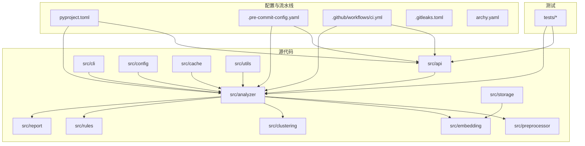
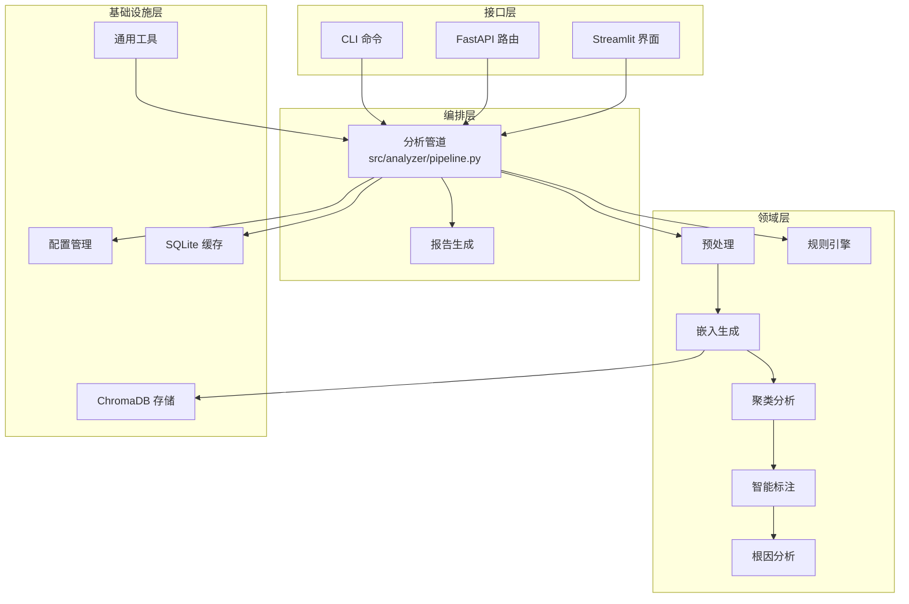
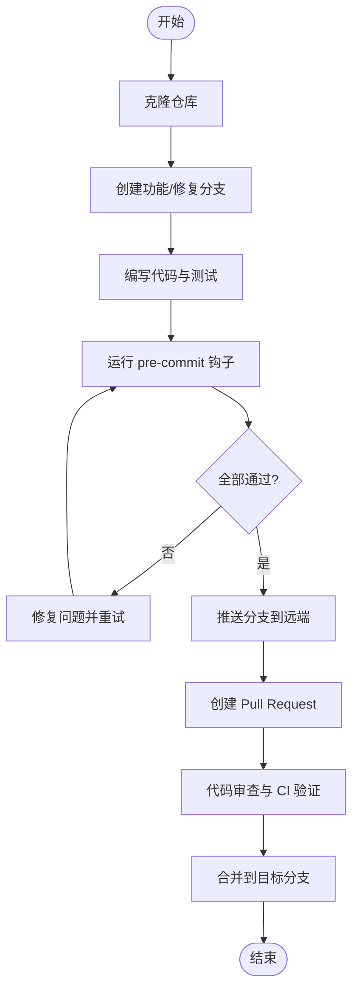
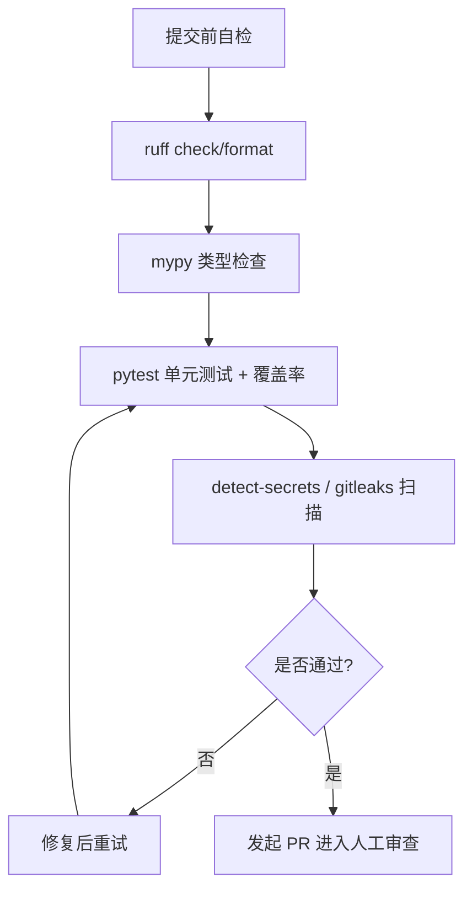
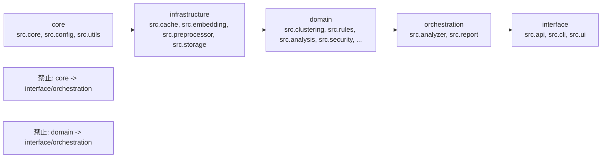

# 开发指南

<cite>
**本文引用的文件**
- [README.md](file://README.md)
- [pyproject.toml](file://pyproject.toml)
- [.pre-commit-config.yaml](file://.pre-commit-config.yaml)
- [.gitleaks.toml](file://.gitleaks.toml)
- [code-review-checklist.md](file://code-review-checklist.md)
- [docs/DEVELOPMENT.md](file://docs/DEVELOPMENT.md)
- [docs/CONTRIBUTING.md](file://docs/CONTRIBUTING.md)
- [CLAUDE.md](file://CLAUDE.md)
- [docs/CI-CD_GUIDE.md](file://docs/CI-CD_GUIDE.md)
- [.github/workflows/ci.yml](file://.github/workflows/ci.yml)
- [archy.yaml](file://archy.yaml)
</cite>

## 目录
1. [简介](#简介)
2. [项目结构](#项目结构)
3. [核心组件](#核心组件)
4. [架构总览](#架构总览)
5. [详细组件分析](#详细组件分析)
6. [依赖与分层约束分析](#依赖与分层约束分析)
7. [性能考量](#性能考量)
8. [故障排除指南](#故障排除指南)
9. [结论](#结论)
10. [附录](#附录)

## 简介
本指南面向贡献者，系统化说明代码规范、Git 工作流、代码审查流程、调试与工具配置、新功能开发最佳实践、文档与版本管理策略，以及常见问题与社区协作方式。目标是帮助开发者快速上手并高质量地参与项目开发。

## 项目结构
仓库采用“功能域 + 层次化”组织：src 下按模块划分（API、CLI、分析引擎、规则引擎、报告、缓存、存储等），tests 镜像 src 结构；脚本与文档位于根目录与 docs 子目录；构建与质量门禁通过 pyproject.toml、pre-commit、GitHub Actions 统一治理。

图表来源
- [pyproject.toml:1-165](file://pyproject.toml#L1-L165)
- [.pre-commit-config.yaml:1-45](file://.pre-commit-config.yaml#L1-L45)
- [.github/workflows/ci.yml:1-78](file://.github/workflows/ci.yml#L1-L78)
- [archy.yaml:1-40](file://archy.yaml#L1-L40)

章节来源
- [README.md:1-101](file://README.md#L1-L101)
- [docs/DEVELOPMENT.md:1-648](file://docs/DEVELOPMENT.md#L1-L648)
- [CLAUDE.md:1-351](file://CLAUDE.md#L1-L351)

## 核心组件
- 命令行接口（CLI）：提供 fetch/analyze/report 等命令入口，便于本地批处理与交互。
- API 服务：FastAPI 应用，暴露健康检查、分析、聚类、报告、反馈等路由。
- 分析管道：编排数据获取、预处理、嵌入生成、聚类、标签与根因分析。
- 规则引擎：内置与自定义规则，支持高级条件与权重评估。
- 报告生成：基于模板的 Markdown/HTML 报告输出。
- 配置与缓存：YAML+环境变量加载，SQLite 缓存与 TTL。
- 向量存储：ChromaDB 用于嵌入与元数据存储。
- 可视化与 UI：图表与 Streamlit 界面。

章节来源
- [CLAUDE.md:55-112](file://CLAUDE.md#L55-L112)
- [docs/DEVELOPMENT.md:35-128](file://docs/DEVELOPMENT.md#L35-L128)

## 架构总览
系统遵循“外层依赖内层”的分层原则，核心领域逻辑不直接依赖框架或外部实现，通过抽象与注入降低耦合。

图表来源
- [CLAUDE.md:55-112](file://CLAUDE.md#L55-L112)
- [docs/DEVELOPMENT.md:35-128](file://docs/DEVELOPMENT.md#L35-L128)

## 详细组件分析

### 代码规范与风格指南
- 语言与版本：Python ≥ 3.10，目标版本 3.10。
- 行长度：最大 100 字符。
- 格式化与检查：Ruff（lint + format），mypy（严格类型检查）。
- 命名约定：变量/函数 snake_case，类 PascalCase，常量 UPPER_SNAKE_CASE，私有成员单下划线前缀。
- 导入顺序：isort 风格，由 Ruff 自动处理。
- 文档字符串：公共函数/类使用 NumPy 风格文档字符串。
- 日志：使用 loguru，避免记录敏感信息。
- 路径：优先 pathlib.Path。
- 提交信息：Conventional Commits。

章节来源
- [pyproject.toml:111-165](file://pyproject.toml#L111-L165)
- [docs/CONTRIBUTING.md:103-162](file://docs/CONTRIBUTING.md#L103-L162)
- [docs/DEVELOPMENT.md:220-272](file://docs/DEVELOPMENT.md#L220-L272)
- [CLAUDE.md:113-118](file://CLAUDE.md#L113-L118)

### Git 工作流程与分支策略
- 分支模型：从 main/master/develop 派生 feature/fix 分支进行开发。
- 提交规范：Conventional Commits（feat/fix/docs/style/refactor/perf/test/chore）。
- Pull Request：清晰标题与描述、关联 Issue、确保检查通过、更新相关文档。
- 预提交钩子：trailing-whitespace、end-of-file-fixer、check-yaml、detect-secrets、ruff、mypy、pytest-check 等。

图表来源
- [docs/CONTRIBUTING.md:17-57](file://docs/CONTRIBUTING.md#L17-L57)
- [.pre-commit-config.yaml:1-45](file://.pre-commit-config.yaml#L1-L45)

章节来源
- [docs/CONTRIBUTING.md:17-57](file://docs/CONTRIBUTING.md#L17-L57)
- [docs/CONTRIBUTING.md:163-209](file://docs/CONTRIBUTING.md#L163-L209)
- [.pre-commit-config.yaml:1-45](file://.pre-commit-config.yaml#L1-L45)

### 代码审查流程与检查清单
- 静态分析：ruff check/format、mypy。
- 安全扫描：pre-commit detect-secrets + .gitleaks.toml 自定义规则。
- 性能检查：覆盖率阈值 ≥ 79.9%，关注批量调用与内存占用。
- 审查要点：Clean Code、SOLID、Clean Architecture、TDD、错误处理、性能、安全、Python 特定规范、Pre-commit 自检。

图表来源
- [code-review-checklist.md:1-223](file://code-review-checklist.md#L1-L223)
- [.pre-commit-config.yaml:1-45](file://.pre-commit-config.yaml#L1-L45)
- [.gitleaks.toml:1-44](file://.gitleaks.toml#L1-L44)
- [pyproject.toml:90-110](file://pyproject.toml#L90-L110)

章节来源
- [code-review-checklist.md:1-223](file://code-review-checklist.md#L1-L223)
- [.gitleaks.toml:1-44](file://.gitleaks.toml#L1-L44)
- [pyproject.toml:90-110](file://pyproject.toml#L90-L110)

### 调试技巧与开发工具配置
- IDE 建议：VS Code 启用 ruff、禁用默认格式化器，保存时执行 source.fixAll。
- 调试器：为 API Server、CLI 命令、单个测试文件配置 launch.json。
- 日志：loguru 调整级别，关键路径添加 DEBUG/INFO/WARNING/ERROR。
- 请求拦截：在测试中 mock httpx.AsyncClient.request 以模拟外部 API。
- 交互式调试：ipdb.set_trace() 定位复杂逻辑。

章节来源
- [docs/DEVELOPMENT.md:393-457](file://docs/DEVELOPMENT.md#L393-L457)
- [docs/DEVELOPMENT.md:539-601](file://docs/DEVELOPMENT.md#L539-L601)

### 新功能开发最佳实践
- 架构设计：遵循 Clean Architecture 分层，业务逻辑不依赖外部框架。
- 模块划分：按职责拆分（如 embedding、clustering、rules、report），保持高内聚低耦合。
- 接口设计：对外暴露稳定 Pydantic 模型，内部实现可替换。
- 数据流：明确输入输出契约，边界处做校验与异常处理。
- 可测试性：为每个新增能力编写单元/集成测试，覆盖正常与异常路径。
- 可观测性：关键步骤记录结构化日志，必要时埋点指标。

章节来源
- [code-review-checklist.md:72-88](file://code-review-checklist.md#L72-L88)
- [CLAUDE.md:55-112](file://CLAUDE.md#L55-L112)

### 文档编写规范与版本管理策略
- 文档类型：API、用户、开发者、架构、贡献指南等，统一使用 Markdown。
- 更新时机：API/架构/功能变更需同步更新对应文档。
- 版本管理：结合 Conventional Commits 与 CHANGELOG（如有），发布产物经 twine check。
- 制品与工件：CI 构建包并上传 artifacts，便于回溯与分发。

章节来源
- [docs/CONTRIBUTING.md:270-295](file://docs/CONTRIBUTING.md#L270-L295)
- [.github/workflows/ci.yml:51-78](file://.github/workflows/ci.yml#L51-L78)

### 常见问题与故障排除
- API 调用失败：检查令牌与网络、确认服务可用、查看日志。
- LLM/Embedding 失败：核对 provider/model/key/base_url，检查网络与服务状态。
- 性能问题：启用缓存、批处理、并行计算，定位瓶颈。
- 内存问题：优化数据处理、流式处理、算法复杂度。
- 预提交失败：查看具体 hook 报错，手动修复后重试。

章节来源
- [docs/DEVELOPMENT.md:602-648](file://docs/DEVELOPMENT.md#L602-L648)
- [docs/CI-CD_GUIDE.md:232-261](file://docs/CI-CD_GUIDE.md#L232-L261)

### 社区贡献准则与沟通渠道
- 行为准则：尊重多元观点、接受建设性批评、维护友好环境。
- 沟通渠道：Issue 提问与建议、PR 评论、联系维护者。
- 贡献流程：Fork → 分支开发 → 测试通过 → PR → 审查合并。

章节来源
- [docs/CONTRIBUTING.md:331-369](file://docs/CONTRIBUTING.md#L331-L369)

## 依赖与分层约束分析
项目通过 archy.yaml 定义分层与禁止依赖关系，确保核心与领域层不被接口层污染。

图表来源
- [archy.yaml:1-40](file://archy.yaml#L1-L40)

章节来源
- [archy.yaml:1-40](file://archy.yaml#L1-L40)

## 性能考量
- 批量调用：对 LLM/Embedding 等外部服务尽量批处理，减少往返开销。
- 缓存策略：合理设置 SQLite 缓存 TTL，避免重复拉取。
- 内存控制：大数据集分批处理，避免全量加载。
- 资源管理：异步客户端与数据库连接使用上下文管理器正确释放。
- 监控与度量：关键路径记录耗时与错误率，辅助定位瓶颈。

[本节为通用指导，无需源码引用]

## 故障排除指南
- 预提交钩子失败：运行 pre-commit run --all-files 定位具体 hook，按提示修复。
- CI 失败但本地通过：检查 Python 版本矩阵差异，本地多版本复测。
- 密钥泄露告警：根据 .gitleaks.toml 允许列表与正则匹配项修正配置。
- 覆盖率未达标：补充缺失用例，注意 exclude 配置范围。

章节来源
- [docs/CI-CD_GUIDE.md:232-261](file://docs/CI-CD_GUIDE.md#L232-L261)
- [.gitleaks.toml:1-44](file://.gitleaks.toml#L1-L44)
- [pyproject.toml:90-110](file://pyproject.toml#L90-L110)

## 结论
通过统一的代码规范、严格的门禁与清晰的架构分层，本项目在保证质量的同时具备良好的可扩展性与可维护性。贡献者应遵循本指南的流程与实践，持续交付高质量代码与文档。

[本节为总结，无需源码引用]

## 附录
- 常用命令速查：安装依赖、运行测试、代码检查、类型检查、构建与制品。
- 环境配置：复制 .env.example 并填写必要密钥。
- 端到端测试：按类别运行 CLI/Pipeline/UI 测试。

章节来源
- [CLAUDE.md:9-53](file://CLAUDE.md#L9-L53)
- [README.md:12-75](file://README.md#L12-L75)
- [docs/CI-CD_GUIDE.md:189-231](file://docs/CI-CD_GUIDE.md#L189-L231)