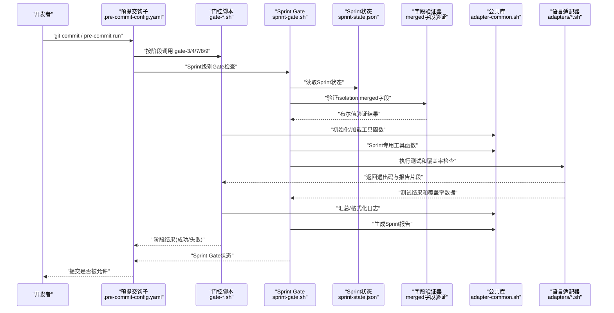
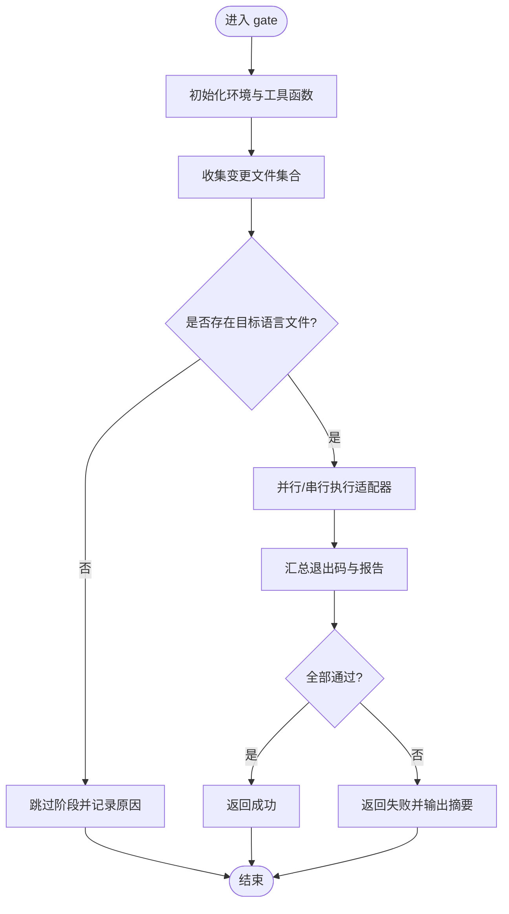
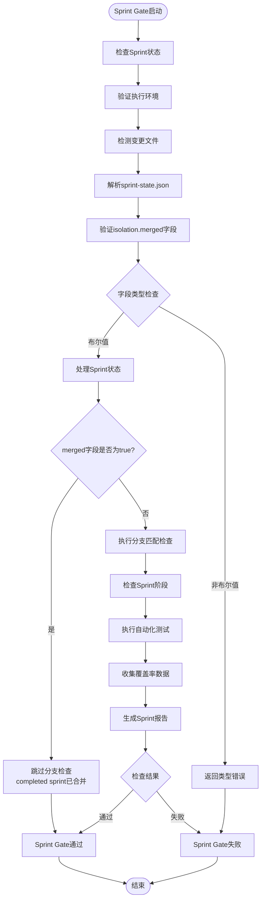
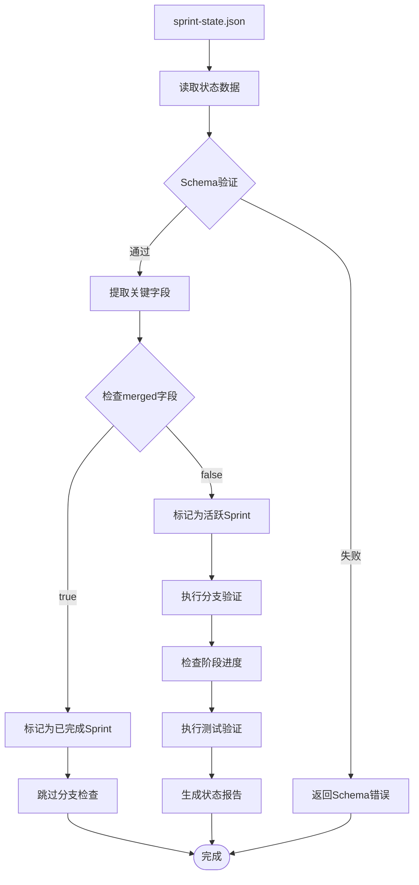
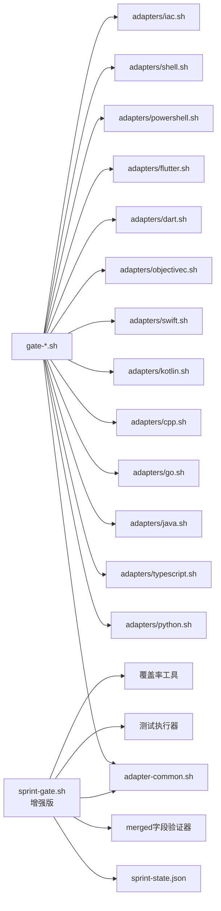

# Git Hooks系统

<cite>
**本文引用的文件**   
- [githooks/adapter-common.sh](file://githooks/adapter-common.sh)
- [githooks/gate-3.sh](file://githooks/gate-3.sh)
- [githooks/gate-4.sh](file://githooks/gate-4.sh)
- [githooks/gate-7.sh](file://githooks/gate-7.sh)
- [githooks/gate-8.sh](file://githooks/gate-8.sh)
- [githooks/gate-9.sh](file://githooks/gate-9.sh)
- [githooks/sprint-gate.sh](file://githooks/sprint-gate.sh)
- [githooks/adapters/python.sh](file://githooks/adapters/python.sh)
- [githooks/adapters/typescript.sh](file://githooks/adapters/typescript.sh)
- [githooks/adapters/java.sh](file://githooks/adapters/java.sh)
- [githooks/adapters/go.sh](file://githooks/adapters/go.sh)
- [githooks/adapters/cpp.sh](file://githooks/adapters/cpp.sh)
- [githooks/adapters/kotlin.sh](file://githooks/adapters/kotlin.sh)
- [githooks/adapters/swift.sh](file://githooks/adapters/swift.sh)
- [githooks/adapters/objectivec.sh](file://githooks/adapters/objectivec.sh)
- [githooks/adapters/dart.sh](file://githooks/adapters/dart.sh)
- [githooks/adapters/flutter.sh](file://githooks/adapters/flutter.sh)
- [githooks/adapters/powershell.sh](file://githooks/adapters/powershell.sh)
- [githooks/adapters/shell.sh](file://githooks/adapters/shell.sh)
- [githooks/adapters/iac.sh](file://githooks/adapters/iac.sh)
- [.pre-commit-config.yaml](file://.pre-commit-config.yaml)
- [tests/test_sprint_gate.py](file://tests/test_sprint_gate.py)
- [.sprint-state/sprint-state.json](file://.sprint-state/sprint-state.json)
</cite>

## 更新摘要
**所做更改**   
- 增强 sprint-gate.sh 门控脚本，新增对 completed sprints 的智能处理机制
- 实现 isolation.merged 字段的严格布尔值验证，防止类型混淆导致的逻辑错误
- 完善 Sprint Gate 的状态检查流程，支持更精细化的质量控制
- 增强跨平台兼容性，改进 Python 环境检测和 Windows 支持
- 集成自动化测试执行和覆盖率收集功能

## 目录
1. [简介](#简介)
2. [项目结构](#项目结构)
3. [核心组件](#核心组件)
4. [架构总览](#架构总览)
5. [详细组件分析](#详细组件分析)
6. [依赖关系分析](#依赖关系分析)
7. [性能与可维护性](#性能与可维护性)
8. [故障排查指南](#故障排查指南)
9. [结论](#结论)
10. [附录](#附录)

## 简介
本仓库包含一套面向多语言、多阶段的Git Hooks系统，通过"门控脚本（gate）+ 适配器（adapters）"的分层设计，将通用流程与各语言生态的特定检查解耦。该体系支持在提交前或合并前执行代码质量、安全扫描、构建验证等任务，并通过统一的适配层屏蔽不同语言的差异，便于团队统一质量门禁。**最新更新**包括增强的sprint-gate.sh脚本，新增了completed sprints智能处理和严格的布尔值验证机制，进一步提升了Sprint级别的质量控制能力。

## 项目结构
- githooks：Hooks主体逻辑
  - gate-*.sh：按阶段编排的门控脚本，负责调用适配器并汇总结果
  - sprint-gate.sh：增强的Sprint Gate管理脚本，支持MS功能集成和智能状态检查
  - adapter-common.sh：公共能力（日志、工具函数、错误码约定等）
  - adapters/*：各语言/技术栈的适配器实现
- .pre-commit-config.yaml：预提交钩子配置入口，用于集成到本地开发工作流
- .sprint-state：Sprint状态存储目录，包含sprint-state.json配置文件
- tests：单元测试和集成测试，包含sprint gate的专门测试用例

```mermaid
graph TB
subgraph "钩子入口"
PC[".pre-commit-config.yaml"]
end
subgraph "门控编排"
G3["gate-3.sh"]
G4["gate-4.sh"]
G7["gate-7.sh"]
G8["gate-8.sh"]
G9["gate-9.sh"]
SG["sprint-gate.sh<br/>增强版"]
AC["adapter-common.sh"]
end
subgraph "Sprint状态管理"
SS[".sprint-state/sprint-state.json"]
SH["sprint状态处理器"]
MV["merged字段验证器"]
end
subgraph "语言适配器"
A_PY["adapters/python.sh"]
A_TS["adapters/typescript.sh"]
A_JAVA["adapters/java.sh"]
A_GO["adapters/go.sh"]
A_CPP["adapters/cpp.sh"]
A_KT["adapters/kotlin.sh"]
A_SWIFT["adapters/swift.sh"]
A_OBJC["adapters/objectivec.sh"]
A_DART["adapters/dart.sh"]
A_FLUTTER["adapters/flutter.sh"]
A_PS["adapters/powershell.sh"]
A_SH["adapters/shell.sh"]
A_IAC["adapters/iac.sh"]
end
PC --> G3
PC --> G4
PC --> G7
PC --> G8
PC --> G9
PC --> SG
G3 --> AC
G4 --> AC
G7 --> AC
G8 --> AC
G9 --> AC
SG --> AC
SG --> SS
SG --> MV
G3 --> A_PY
G3 --> A_TS
G3 --> A_JAVA
G3 --> A_GO
G3 --> A_CPP
G3 --> A_KT
G3 --> A_SWIFT
G3 --> A_OBJC
G3 --> A_DART
G3 --> A_FLUTTER
G3 --> A_PS
G3 --> A_SH
G3 --> A_IAC
G4 --> A_PY
G4 --> A_TS
G4 --> A_JAVA
G4 --> A_GO
G4 --> A_CPP
G4 --> A_KT
G4 --> A_SWIFT
G4 --> A_OBJC
G4 --> A_DART
G4 --> A_FLUTTER
G4 --> A_PS
G4 --> A_SH
G4 --> A_IAC
G7 --> A_PY
G7 --> A_TS
G7 --> A_JAVA
G7 --> A_GO
G7 --> A_CPP
G7 --> A_KT
G7 --> A_SWIFT
G7 --> A_OBJC
G7 --> A_DART
G7 --> A_FLUTTER
G7 --> A_PS
G7 --> A_SH
G7 --> A_IAC
G8 --> A_PY
G8 --> A_TS
G8 --> A_JAVA
G8 --> A_GO
G8 --> A_CPP
G8 --> A_KT
G8 --> A_SWIFT
G8 --> A_OBJC
G8 --> A_DART
G8 --> A_FLUTTER
G8 --> A_PS
G8 --> A_SH
G8 --> A_IAC
G9 --> A_PY
G9 --> A_TS
G9 --> A_JAVA
G9 --> A_GO
G9 --> A_CPP
G9 --> A_KT
G9 --> A_SWIFT
G9 --> A_OBJC
G9 --> A_DART
G9 --> A_FLUTTER
G9 --> A_PS
G9 --> A_SH
G9 --> A_IAC
SG --> A_PY
SG --> A_TS
SG --> A_JAVA
SG --> A_GO
SG --> A_CPP
SG --> A_KT
SG --> A_SWIFT
SG --> A_OBJC
SG --> A_DART
SG --> A_FLUTTER
SG --> A_PS
SG --> A_SH
SG --> A_IAC
```

**图示来源**
- [.pre-commit-config.yaml:1-67](file://.pre-commit-config.yaml#L1-L67)
- [githooks/gate-3.sh:1-200](file://githooks/gate-3.sh#L1-L200)
- [githooks/gate-4.sh:1-200](file://githooks/gate-4.sh#L1-L200)
- [githooks/gate-7.sh:1-200](file://githooks/gate-7.sh#L1-L200)
- [githooks/gate-8.sh:1-200](file://githooks/gate-8.sh#L1-L200)
- [githooks/gate-9.sh:1-200](file://githooks/gate-9.sh#L1-L200)
- [githooks/sprint-gate.sh:1-136](file://githooks/sprint-gate.sh#L1-L136)
- [githooks/adapter-common.sh:1-200](file://githooks/adapter-common.sh#L1-L200)
- [.sprint-state/sprint-state.json:1-58](file://.sprint-state/sprint-state.json#L1-L58)

**章节来源**
- [.pre-commit-config.yaml:1-67](file://.pre-commit-config.yaml#L1-L67)
- [githooks/adapter-common.sh:1-200](file://githooks/adapter-common.sh#L1-L200)
- [githooks/gate-3.sh:1-200](file://githooks/gate-3.sh#L1-L200)
- [githooks/gate-4.sh:1-200](file://githooks/gate-4.sh#L1-L200)
- [githooks/gate-7.sh:1-200](file://githooks/gate-7.sh#L1-L200)
- [githooks/gate-8.sh:1-200](file://githooks/gate-8.sh#L1-L200)
- [githooks/gate-9.sh:1-200](file://githooks/gate-9.sh#L1-L200)
- [githooks/sprint-gate.sh:1-136](file://githooks/sprint-gate.sh#L1-L136)
- [.sprint-state/sprint-state.json:1-58](file://.sprint-state/sprint-state.json#L1-L58)

## 核心组件
- 门控脚本（gate-*.sh）
  - 职责：定义阶段化流水线，按顺序执行多个检查；聚合各适配器返回码，决定整体成功/失败；输出结构化日志以便CI/CD消费。
  - 典型行为：初始化环境、遍历待检文件集、调用对应语言适配器、收集报告、生成摘要、退出码映射。
- **增强版** Sprint Gate脚本（sprint-gate.sh）
  - 职责：专门处理Sprint级别的Gate管理，集成MS（Microsoft）功能支持，提供更精细化的质量控制。
  - **新增特性**：completed sprints智能处理、isolation.merged字段布尔值验证、增强的跨平台兼容性。
  - 核心功能：Sprint状态检查和同步、自动化测试执行、代码覆盖率分析、Windows兼容性处理、增量检查优化。
- 适配器（adapters/*.sh）
  - 职责：封装具体语言/工具的命令与参数，处理路径解析、缓存、增量扫描、产物清理等。
  - 典型行为：检测工具是否可用、选择增量/全量模式、执行命令、解析输出、返回统一退出码。
  - **增强**：改进了Windows兼容性和路径处理能力。
- 公共库（adapter-common.sh）
  - 职责：提供跨适配器复用的能力，如日志格式化、颜色输出、超时控制、错误码常量、路径与文件过滤工具等。
  - **增强**：增加了Windows兼容性支持和跨平台路径处理。
- 预提交配置（.pre-commit-config.yaml）
  - 职责：声明触发时机、参数与环境，将门控脚本注册为预提交钩子，确保开发者本地一致体验。
- **新增** Sprint状态管理
  - 职责：管理Sprint生命周期状态，包含分支信息、阶段进度、完成状态等元数据。
  - 数据结构：JSON格式的状态文件，支持严格的字段验证。

**章节来源**
- [githooks/gate-3.sh:1-200](file://githooks/gate-3.sh#L1-L200)
- [githooks/gate-4.sh:1-200](file://githooks/gate-4.sh#L1-L200)
- [githooks/gate-7.sh:1-200](file://githooks/gate-7.sh#L1-L200)
- [githooks/gate-8.sh:1-200](file://githooks/gate-8.sh#L1-L200)
- [githooks/gate-9.sh:1-200](file://githooks/gate-9.sh#L1-L200)
- [githooks/sprint-gate.sh:1-136](file://githooks/sprint-gate.sh#L1-L136)
- [githooks/adapter-common.sh:1-200](file://githooks/adapter-common.sh#L1-L200)
- [.pre-commit-config.yaml:1-67](file://.pre-commit-config.yaml#L1-L67)
- [.sprint-state/sprint-state.json:1-58](file://.sprint-state/sprint-state.json#L1-L58)

## 架构总览
下图展示了从预提交触发到门控编排再到语言适配器的完整调用链，**增强了Sprint Gate管理流程**，特别关注completed sprints的智能处理。

**图示来源**
- [.pre-commit-config.yaml:1-67](file://.pre-commit-config.yaml#L1-L67)
- [githooks/gate-3.sh:1-200](file://githooks/gate-3.sh#L1-L200)
- [githooks/gate-4.sh:1-200](file://githooks/gate-4.sh#L1-L200)
- [githooks/gate-7.sh:1-200](file://githooks/gate-7.sh#L1-L200)
- [githooks/gate-8.sh:1-200](file://githooks/gate-8.sh#L1-L200)
- [githooks/gate-9.sh:1-200](file://githooks/gate-9.sh#L1-L200)
- [githooks/sprint-gate.sh:1-136](file://githooks/sprint-gate.sh#L1-L136)
- [githooks/adapter-common.sh:1-200](file://githooks/adapter-common.sh#L1-L200)
- [.sprint-state/sprint-state.json:1-58](file://.sprint-state/sprint-state.json#L1-L58)

## 详细组件分析

### 门控脚本（gate-*.sh）
- 设计要点
  - 阶段化：每个gate代表一个独立的质量维度（例如静态检查、测试、构建、安全扫描等），可按需启用/禁用。
  - 幂等与可重试：对网络/外部工具调用增加重试与超时保护，避免偶发失败阻断提交。
  - 可观测性：统一日志格式与结构化输出，便于CI/CD采集与告警。
- 关键流程
  - 解析参数与环境变量
  - 收集变更文件集合
  - 分发到对应适配器
  - 汇总退出码并生成摘要
  - 设置最终退出码

**图示来源**
- [githooks/gate-3.sh:1-200](file://githooks/gate-3.sh#L1-L200)
- [githooks/gate-4.sh:1-200](file://githooks/gate-4.sh#L1-L200)
- [githooks/gate-7.sh:1-200](file://githooks/gate-7.sh#L1-L200)
- [githooks/gate-8.sh:1-200](file://githooks/gate-8.sh#L1-L200)
- [githooks/gate-9.sh:1-200](file://githooks/gate-9.sh#L1-L200)
- [githooks/adapter-common.sh:1-200](file://githooks/adapter-common.sh#L1-L200)

**章节来源**
- [githooks/gate-3.sh:1-200](file://githooks/gate-3.sh#L1-L200)
- [githooks/gate-4.sh:1-200](file://githooks/gate-4.sh#L1-L200)
- [githooks/gate-7.sh:1-200](file://githooks/gate-7.sh#L1-L200)
- [githooks/gate-8.sh:1-200](file://githooks/gate-8.sh#L1-L200)
- [githooks/gate-9.sh:1-200](file://githooks/gate-9.sh#L1-L200)

### **增强版** Sprint Gate脚本（sprint-gate.sh）
- 设计要点
  - Sprint级管理：专注于Sprint周期的Gate管理，提供更细粒度的质量控制。
  - MS功能集成：支持与Microsoft相关工具和平台的集成。
  - 跨平台兼容：全面支持Windows、Linux、macOS环境。
  - 自动化测试：集成测试执行和覆盖率收集功能。
  - **新增**：completed sprints智能处理和严格的布尔值验证。
- **核心新功能**
  - **Completed Sprints智能处理**：当`isolation.merged`字段为`true`时，自动识别已完成合并的Sprint并放行推送操作。
  - **严格的布尔值验证**：确保`isolation.merged`字段必须是JSON布尔值类型，防止字符串或其他类型导致的逻辑错误。
  - **增强的Python环境检测**：改进Windows Store stub的检测和处理，提高跨平台兼容性。
- **工作流程**
  - Sprint状态检查和同步
  - 自动化测试执行和结果收集
  - 代码覆盖率分析和报告生成
  - Windows兼容性处理和路径转换
  - 增量检查优化和缓存机制
  - **新增**：isolation.merged字段验证和completed sprint处理

**图示来源**
- [githooks/sprint-gate.sh:1-136](file://githooks/sprint-gate.sh#L1-L136)

**章节来源**
- [githooks/sprint-gate.sh:1-136](file://githooks/sprint-gate.sh#L1-L136)

### 适配器（adapters/*.sh）
- 设计要点
  - 单一职责：每个适配器专注一种语言/工具链，暴露一致的输入输出契约。
  - 增量优先：优先基于变更范围执行，减少耗时。
  - 容错与降级：工具不可用时给出明确提示与可选降级策略。
- 常见能力
  - 工具可用性检测
  - 环境变量注入（如缓存目录、并发度）
  - 输出解析与标准化
  - 退出码约定（0=成功，非0=失败）
  - **增强**：改进了Windows兼容性和路径处理能力

```mermaid
classDiagram
class Adapter {
+string name
+bool isAvailable()
+int execute(files, options)
+string parseOutput(raw)
+void cleanup()
}
class PythonAdapter {
+execute(files, options) int
}
class TypeScriptAdapter {
+execute(files, options) int
}
class JavaAdapter {
+execute(files, options) int
}
class GoAdapter {
+execute(files, options) int
}
class CppAdapter {
+execute(files, options) int
}
class KotlinAdapter {
+execute(files, options) int
}
class SwiftAdapter {
+execute(files, options) int
}
class ObjectiveCAdapter {
+execute(files, options) int
}
class DartAdapter {
+execute(files, options) int
}
class FlutterAdapter {
+execute(files, options) int
}
class PowerShellAdapter {
+execute(files, options) int
}
class ShellAdapter {
+execute(files, options) int
}
class IaCAdapter {
+execute(files, options) int
}
Adapter <|-- PythonAdapter
Adapter <|-- TypeScriptAdapter
Adapter <|-- JavaAdapter
Adapter <|-- GoAdapter
Adapter <|-- CppAdapter
Adapter <|-- KotlinAdapter
Adapter <|-- SwiftAdapter
Adapter <|-- ObjectiveCAdapter
Adapter <|-- DartAdapter
Adapter <|-- FlutterAdapter
Adapter <|-- PowerShellAdapter
Adapter <|-- ShellAdapter
Adapter <|-- IaCAdapter
```

**图示来源**
- [githooks/adapters/python.sh:1-200](file://githooks/adapters/python.sh#L1-L200)
- [githooks/adapters/typescript.sh:1-200](file://githooks/adapters/typescript.sh#L1-L200)
- [githooks/adapters/java.sh:1-200](file://githooks/adapters/java.sh#L1-L200)
- [githooks/adapters/go.sh:1-200](file://githooks/adapters/go.sh#L1-L200)
- [githooks/adapters/cpp.sh:1-200](file://githooks/adapters/cpp.sh#L1-L200)
- [githooks/adapters/kotlin.sh:1-200](file://githooks/adapters/kotlin.sh#L1-L200)
- [githooks/adapters/swift.sh:1-200](file://githooks/adapters/swift.sh#L1-L200)
- [githooks/adapters/objectivec.sh:1-200](file://githooks/adapters/objectivec.sh#L1-L200)
- [githooks/adapters/dart.sh:1-200](file://githooks/adapters/dart.sh#L1-L200)
- [githooks/adapters/flutter.sh:1-200](file://githooks/adapters/flutter.sh#L1-L200)
- [githooks/adapters/powershell.sh:1-200](file://githooks/adapters/powershell.sh#L1-L200)
- [githooks/adapters/shell.sh:1-200](file://githooks/adapters/shell.sh#L1-L200)
- [githooks/adapters/iac.sh:1-200](file://githooks/adapters/iac.sh#L1-L200)

**章节来源**
- [githooks/adapters/python.sh:1-200](file://githooks/adapters/python.sh#L1-L200)
- [githooks/adapters/typescript.sh:1-200](file://githooks/adapters/typescript.sh#L1-L200)
- [githooks/adapters/java.sh:1-200](file://githooks/adapters/java.sh#L1-L200)
- [githooks/adapters/go.sh:1-200](file://githooks/adapters/go.sh#L1-L200)
- [githooks/adapters/cpp.sh:1-200](file://githooks/adapters/cpp.sh#L1-L200)
- [githooks/adapters/kotlin.sh:1-200](file://githooks/adapters/kotlin.sh#L1-L200)
- [githooks/adapters/swift.sh:1-200](file://githooks/adapters/swift.sh#L1-L200)
- [githooks/adapters/objectivec.sh:1-200](file://githooks/adapters/objectivec.sh#L1-L200)
- [githooks/adapters/dart.sh:1-200](file://githooks/adapters/dart.sh#L1-L200)
- [githooks/adapters/flutter.sh:1-200](file://githooks/adapters/flutter.sh#L1-L200)
- [githooks/adapters/powershell.sh:1-200](file://githooks/adapters/powershell.sh#L1-L200)
- [githooks/adapters/shell.sh:1-200](file://githooks/adapters/shell.sh#L1-L200)
- [githooks/adapters/iac.sh:1-200](file://githooks/adapters/iac.sh#L1-L200)

### 公共库（adapter-common.sh）
- 职责边界
  - 日志与颜色：统一输出格式，区分信息/警告/错误级别
  - 工具函数：路径处理、文件匹配、超时控制、重试机制
  - 错误码：定义全局退出码语义，保证门控与适配器之间的一致性
  - **增强**：改进了Windows兼容性支持和跨平台路径处理
- 使用方式
  - 适配器与门控脚本均source该文件以复用能力
  - 通过环境变量开关调试、日志级别与并行度

**章节来源**
- [githooks/adapter-common.sh:1-200](file://githooks/adapter-common.sh#L1-L200)

### 预提交配置（.pre-commit-config.yaml）
- 作用
  - 将门控脚本注册为预提交钩子，指定触发条件、参数与环境
  - 支持选择性启用/禁用阶段，便于本地快速迭代
  - **增强**：集成了增强的Sprint Gate功能
- 建议
  - 将耗时较长的阶段默认关闭，仅在需要时显式开启
  - 为CI单独配置更严格的阶段组合
  - 配置Sprint级别的Gate检查

**章节来源**
- [.pre-commit-config.yaml:1-67](file://.pre-commit-config.yaml#L1-L67)

### **新增** Sprint状态管理系统
- 设计要点
  - 集中管理Sprint生命周期状态，包含分支信息、阶段进度、完成状态等元数据
  - 提供严格的JSON Schema验证，确保状态数据的完整性和一致性
  - 支持复杂的Sprint状态流转，包括PREP、DESIGN、BUILD、VERIFY、SHIP、CLOSE等阶段
- **核心数据结构**
  - `isolation.branch`：Sprint隔离分支名称
  - `isolation.merged`：布尔值，标识Sprint是否已合并（新增严格验证）
  - `phase`：当前Sprint阶段编号
  - `status`：Sprint当前状态
  - `phase_history`：历史阶段记录数组
- **新增功能**
  - **isolation.merged字段验证**：确保字段类型为布尔值，防止类型混淆
  - **Completed Sprints智能处理**：当merged为true时自动放行推送操作
  - **增强的错误处理**：提供更详细的错误信息和修复建议

**图示来源**
- [.sprint-state/sprint-state.json:1-58](file://.sprint-state/sprint-state.json#L1-L58)
- [githooks/sprint-gate.sh:77-84](file://githooks/sprint-gate.sh#L77-L84)

**章节来源**
- [.sprint-state/sprint-state.json:1-58](file://.sprint-state/sprint-state.json#L1-L58)
- [githooks/sprint-gate.sh:77-84](file://githooks/sprint-gate.sh#L77-L84)

## 依赖关系分析
- 耦合与内聚
  - 门控脚本与适配器松耦合：通过统一退出码与标准输入/输出交互
  - 适配器内部高内聚：每种语言/工具的实现集中在各自文件中
  - **增强**：Sprint Gate与现有门控系统的松耦合集成，新增状态管理模块
- 外部依赖
  - 各语言工具链（如编译器、解释器、静态分析器、测试框架等）
  - 操作系统命令（find、grep、sort、timeout等）
  - **增强**：测试执行器和覆盖率工具，Python环境检测
- **新增风险点**
  - JSON状态文件的Schema验证失败
  - isolation.merged字段类型不匹配导致的逻辑错误
  - Windows与Unix环境的兼容性差异

**图示来源**
- [githooks/gate-3.sh:1-200](file://githooks/gate-3.sh#L1-L200)
- [githooks/gate-4.sh:1-200](file://githooks/gate-4.sh#L1-L200)
- [githooks/gate-7.sh:1-200](file://githooks/gate-7.sh#L1-L200)
- [githooks/gate-8.sh:1-200](file://githooks/gate-8.sh#L1-L200)
- [githooks/gate-9.sh:1-200](file://githooks/gate-9.sh#L1-L200)
- [githooks/sprint-gate.sh:1-136](file://githooks/sprint-gate.sh#L1-L136)
- [githooks/adapter-common.sh:1-200](file://githooks/adapter-common.sh#L1-L200)
- [.sprint-state/sprint-state.json:1-58](file://.sprint-state/sprint-state.json#L1-L58)

## 性能与可维护性
- 性能优化建议
  - 增量扫描：仅对变更文件执行检查，必要时引入缓存
  - 并行执行：对无状态且独立的适配器进行并行化
  - 超时与重试：为外部工具调用设置合理超时与重试次数
  - 资源隔离：限制CPU/内存占用，避免阻塞其他进程
  - **增强**：Sprint Gate的增量检查和缓存机制，优化的状态文件读取
- 可维护性建议
  - 统一错误码与日志格式，便于问题定位
  - 为每个适配器编写最小可运行示例与断言用例
  - 将易变的外部依赖版本锁定在配置文件或锁文件中
  - **增强**：完善的单元测试覆盖，包括sprint gate的边界情况测试
  - **新增**：JSON Schema验证和类型安全检查

## 故障排查指南
- 常见问题
  - 工具未安装或不在PATH：适配器应检测并给出清晰提示
  - 权限不足：确认脚本执行权限与读写目录权限
  - 超时/中断：调整超时参数或拆分阶段
  - 大仓库卡顿：启用增量模式与缓存
  - **新增**：Windows路径分隔符问题和编码问题
  - **新增**：JSON状态文件格式错误或字段类型不匹配
- **新增** Sprint Gate特定问题
  - `isolation.merged`字段类型错误：确保为布尔值而非字符串
  - Completed sprint误判：检查merged字段值和分支状态
  - Python环境检测失败：确认Python正确安装且不在PATH中
- 定位步骤
  - 查看门控脚本输出的阶段摘要与退出码
  - 启用适配器调试日志，定位具体失败命令
  - 在CI中保存完整日志与产物，便于回溯
  - **新增**：检查Sprint状态文件和merged字段验证结果

**章节来源**
- [githooks/adapter-common.sh:1-200](file://githooks/adapter-common.sh#L1-L200)
- [githooks/gate-3.sh:1-200](file://githooks/gate-3.sh#L1-L200)
- [githooks/gate-4.sh:1-200](file://githooks/gate-4.sh#L1-L200)
- [githooks/gate-7.sh:1-200](file://githooks/gate-7.sh#L1-L200)
- [githooks/gate-8.sh:1-200](file://githooks/gate-8.sh#L1-L200)
- [githooks/gate-9.sh:1-200](file://githooks/gate-9.sh#L1-L200)
- [githooks/sprint-gate.sh:1-136](file://githooks/sprint-gate.sh#L1-L136)
- [tests/test_sprint_gate.py:1-85](file://tests/test_sprint_gate.py#L1-L85)

## 结论
该Git Hooks系统通过"门控+适配器"的分层架构，实现了多语言、多阶段的质量门禁。**最新版本的显著改进**包括增强的sprint-gate.sh脚本，新增了completed sprints智能处理和严格的isolation.merged字段布尔值验证机制，进一步提升了Sprint级别的质量控制能力。这些改进有效防止了类型混淆导致的逻辑错误，提高了系统的健壮性和可靠性。其优势在于可扩展性强、关注点分离清晰、易于在本地与CI环境中保持一致体验。建议在团队内推广增量与缓存策略，持续完善适配器覆盖范围，并建立统一的错误码与日志规范以提升可观测性与可维护性。

## 附录
- 术语
  - 门控（Gate）：按阶段组织的一组检查任务
  - 适配器（Adapter）：针对特定语言/工具的封装实现
  - 预提交（Pre-commit）：在提交前自动触发的钩子
  - **增强**：Sprint Gate：Sprint级别的Gate管理，支持MS功能集成和智能状态处理
  - **新增**：Completed Sprint：已合并完成的Sprint，自动放行推送操作
  - **新增**：isolation.merged：布尔值字段，标识Sprint隔离分支是否已合并
- 参考
  - 预提交配置入口：.pre-commit-config.yaml
  - 公共库：githooks/adapter-common.sh
  - 门控脚本：githooks/gate-*.sh
  - **增强**：Sprint Gate脚本：githooks/sprint-gate.sh
  - **新增**：Sprint状态文件：.sprint-state/sprint-state.json
  - **新增**：单元测试：tests/test_sprint_gate.py
  - 适配器：githooks/adapters/*.sh