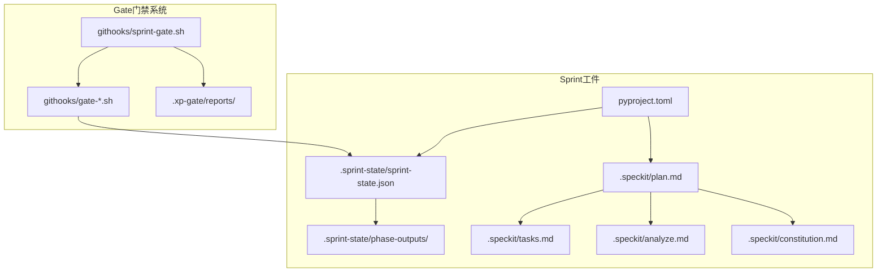
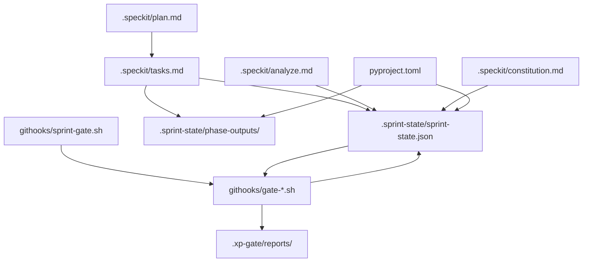
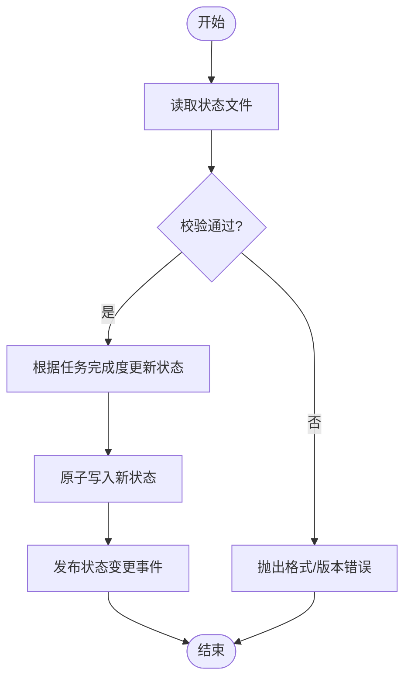
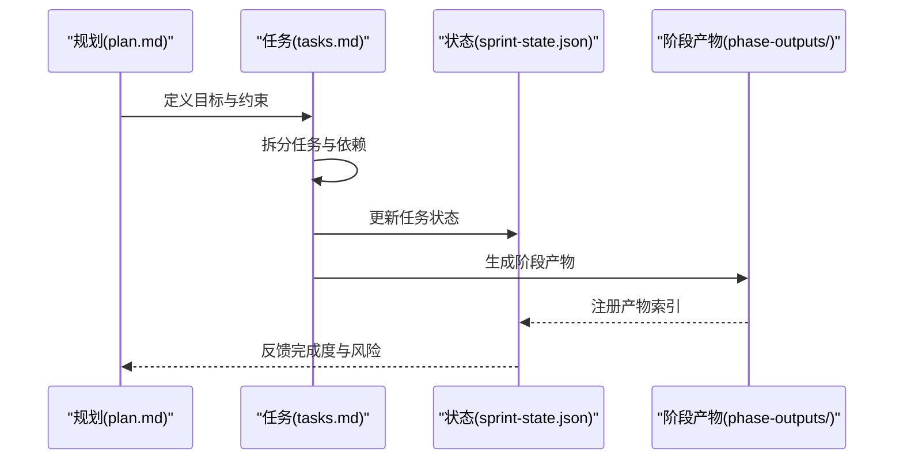
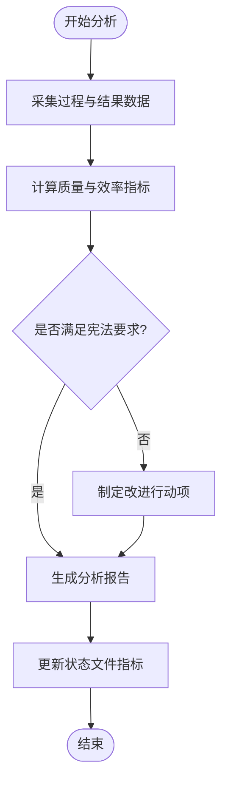
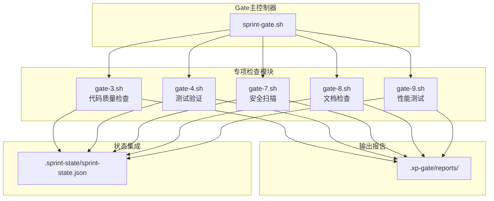
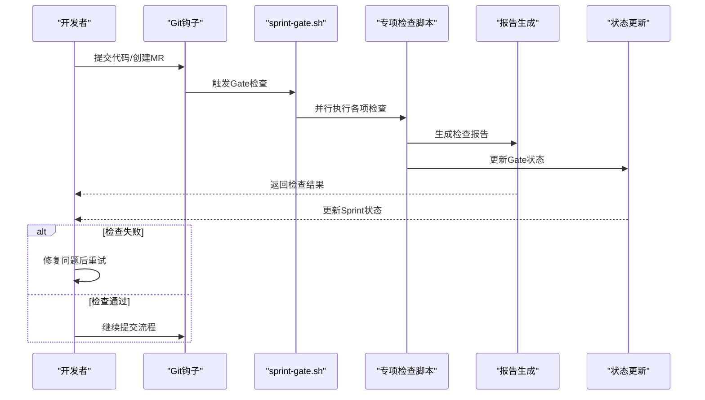
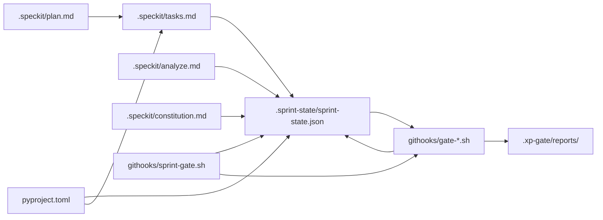

# Sprint状态管理

<cite>
**本文引用的文件**   
- [.sprint-state/sprint-state.json](file://.sprint-state/sprint-state.json)
- [.speckit/plan.md](file://.speckit/plan.md)
- [.speckit/tasks.md](file://.speckit/tasks.md)
- [.speckit/analyze.md](file://.speckit/analyze.md)
- [.speckit/constitution.md](file://.speckit/constitution.md)
- [pyproject.toml](file://pyproject.toml)
- [githooks/sprint-gate.sh](file://githooks/sprint-gate.sh)
- [githooks/gate-3.sh](file://githooks/gate-3.sh)
- [githooks/gate-4.sh](file://githooks/gate-4.sh)
- [githooks/gate-7.sh](file://githooks/gate-7.sh)
- [githooks/gate-8.sh](file://githooks/gate-8.sh)
- [githooks/gate-9.sh](file://githooks/gate-9.sh)
- [.xp-gate/reports/](file://.xp-gate/reports/)
</cite>

## 更新摘要
**变更内容**   
- 新增Sprint Gate门禁功能章节，介绍完整的里程碑检查机制
- 更新核心组件部分，增加Gate MS（冲刺门禁）系统说明
- 扩展架构总览图，展示Gate功能与Sprint状态的集成关系
- 新增Gate功能详细分析章节，包含脚本逻辑和质量检查流程
- 更新依赖关系分析，反映Gate功能对Sprint状态管理的增强

## 目录
1. [简介](#简介)
2. [项目结构](#项目结构)
3. [核心组件](#核心组件)
4. [架构总览](#架构总览)
5. [详细组件分析](#详细组件分析)
6. [Sprint Gate门禁系统](#sprint-gate门禁系统)
7. [依赖关系分析](#依赖关系分析)
8. [性能与可靠性考虑](#性能与可靠性考虑)
9. [故障排查指南](#故障排查指南)
10. [结论](#结论)
11. [附录](#附录)

## 简介
本文件聚焦于"Sprint状态管理"的体系化说明，围绕仓库中用于记录、追踪与协作Sprint进度的关键工件进行梳理。重点包括：
- Sprint状态持久化（JSON）
- 规划与任务拆解（Speckit计划与任务清单）
- 分析与规范（Speckit分析与宪法）
- **新增** Sprint Gate门禁系统（质量检查与里程碑验证）
- 构建与运行配置（pyproject）

目标是帮助读者快速理解Sprint状态在工程中的位置、流转方式以及与其他模块的交互点，特别是新增的Gate门禁功能如何为开发工作流提供额外的质量保障。

## 项目结构
与Sprint状态管理直接相关的顶层目录与文件如下：
- .sprint-state：Sprint状态的持久化存储与阶段产物输出
- .speckit：Sprint规划、任务分解、分析与质量准则
- **新增** githooks：Git钩子脚本，实现Sprint Gate门禁功能
- **.xp-gate**：Gate功能报告输出目录
- pyproject.toml：构建与运行配置，间接影响Sprint内工具链行为

**图表来源**
- [.sprint-state/sprint-state.json](file://.sprint-state/sprint-state.json)
- [.speckit/plan.md](file://.speckit/plan.md)
- [.speckit/tasks.md](file://.speckit/tasks.md)
- [.speckit/analyze.md](file://.speckit/analyze.md)
- [.speckit/constitution.md](file://.speckit/constitution.md)
- [pyproject.toml](file://pyproject.toml)
- [githooks/sprint-gate.sh](file://githooks/sprint-gate.sh)
- [githooks/gate-3.sh](file://githooks/gate-3.sh)
- [githooks/gate-4.sh](file://githooks/gate-4.sh)
- [githooks/gate-7.sh](file://githooks/gate-7.sh)
- [githooks/gate-8.sh](file://githooks/gate-8.sh)
- [githooks/gate-9.sh](file://githooks/gate-9.sh)
- [.xp-gate/reports/](file://.xp-gate/reports/)

**章节来源**
- [.sprint-state/sprint-state.json](file://.sprint-state/sprint-state.json)
- [.speckit/plan.md](file://.speckit/plan.md)
- [.speckit/tasks.md](file://.speckit/tasks.md)
- [.speckit/analyze.md](file://.speckit/analyze.md)
- [.speckit/constitution.md](file://.speckit/constitution.md)
- [pyproject.toml](file://pyproject.toml)
- [githooks/sprint-gate.sh](file://githooks/sprint-gate.sh)

## 核心组件
- Sprint状态文件（sprint-state.json）
  - 作用：集中记录当前Sprint的关键元数据与进度信息，作为跨工具与协作者共享的单一事实源。
  - 典型字段（概念性说明）：Sprint标识、起止时间、目标摘要、里程碑、任务映射、阶段产出索引、状态标记等。
  - 更新时机：任务完成、阶段产物生成、评审通过后。
  - 校验建议：幂等写入、版本兼容、变更审计。

- Speckit规划与任务（plan.md / tasks.md）
  - plan.md：定义Sprint范围、目标、约束与验收标准，指导tasks.md的任务拆分。
  - tasks.md：将目标拆为可执行任务条目，包含优先级、负责人、依赖、状态与备注。
  - 与sprint-state.json的关系：tasks.md驱动状态更新；sprint-state.json汇总任务完成度与阶段产出。

- Speckit分析与宪法（analyze.md / constitution.md）
  - analyze.md：描述分析方法、指标与复盘流程，支撑Sprint质量度量与改进闭环。
  - constitution.md：约定团队在Sprint内的质量与安全基线，作为任务评审与交付门槛。

- **新增** Sprint Gate门禁系统（sprint-gate.sh及gate-*.sh）
  - 作用：在Git钩子中集成质量检查，确保代码提交和合并前满足Sprint质量标准。
  - 核心功能：代码质量检查、测试覆盖率验证、文档完整性检查、安全扫描等。
  - 执行时机：commit、push、merge请求等Git操作触发。
  - 报告输出：生成详细的Gate检查报告到.xp-gate/reports/目录。

- 构建与运行配置（pyproject.toml）
  - 作用：统一依赖、脚本入口与工具链参数，确保Sprint内开发与测试环境一致。
  - 与Sprint状态的关系：通过脚本或命令触发阶段产物生成，进而更新sprint-state.json。

**章节来源**
- [.sprint-state/sprint-state.json](file://.sprint-state/sprint-state.json)
- [.speckit/plan.md](file://.speckit/plan.md)
- [.speckit/tasks.md](file://.speckit/tasks.md)
- [.speckit/analyze.md](file://.speckit/analyze.md)
- [.speckit/constitution.md](file://.speckit/constitution.md)
- [githooks/sprint-gate.sh](file://githooks/sprint-gate.sh)
- [pyproject.toml](file://pyproject.toml)

## 架构总览
下图展示了Sprint状态管理的核心工件与交互关系，包括新增的Gate门禁系统：规划与任务驱动状态更新，Gate功能提供质量保障，阶段产物沉淀到输出目录，构建配置保障一致性。

**图表来源**
- [.speckit/plan.md](file://.speckit/plan.md)
- [.speckit/tasks.md](file://.speckit/tasks.md)
- [.sprint-state/sprint-state.json](file://.sprint-state/sprint-state.json)
- [.speckit/analyze.md](file://.speckit/analyze.md)
- [.speckit/constitution.md](file://.speckit/constitution.md)
- [pyproject.toml](file://pyproject.toml)
- [githooks/sprint-gate.sh](file://githooks/sprint-gate.sh)
- [githooks/gate-3.sh](file://githooks/gate-3.sh)
- [githooks/gate-4.sh](file://githooks/gate-4.sh)
- [githooks/gate-7.sh](file://githooks/gate-7.sh)
- [githooks/gate-8.sh](file://githooks/gate-8.sh)
- [githooks/gate-9.sh](file://githooks/gate-9.sh)
- [.xp-gate/reports/](file://.xp-gate/reports/)

## 详细组件分析

### 组件A：Sprint状态文件（sprint-state.json）
- 职责
  - 作为Sprint的"单一事实源"，聚合任务进度、阶段产物索引与关键指标。
  - 提供稳定的读取接口供其他工具与报告生成使用。
- 数据结构（概念性）
  - sprint_id：唯一标识
  - period：起止时间
  - goals：目标列表
  - milestones：里程碑
  - tasks：任务映射（id->状态/依赖/负责人）
  - phase_outputs：阶段产物路径索引
  - metrics：质量与效率指标
  - version：状态文件版本
- 复杂度与性能
  - 读写均为I/O密集型，建议批量更新与合并策略，避免频繁小写。
  - 大对象时可采用增量更新与快照机制。
- 错误处理
  - 并发写入冲突：采用锁或原子替换。
  - 格式不兼容：引入schema校验与迁移脚本。
- 优化建议
  - 对只读场景使用缓存。
  - 对变更事件发布通知，驱动下游刷新。

**图表来源**
- [.sprint-state/sprint-state.json](file://.sprint-state/sprint-state.json)

**章节来源**
- [.sprint-state/sprint-state.json](file://.sprint-state/sprint-state.json)

### 组件B：Speckit规划与任务（plan.md / tasks.md）
- 职责
  - plan.md定义范围与目标，tasks.md将其拆解为可执行任务。
  - 两者共同驱动sprint-state.json的更新与阶段产物生成。
- 数据流
  - 规划输入 -> 任务拆分 -> 执行与验证 -> 状态更新 -> 产物归档。
- 依赖关系
  - tasks.md依赖plan.md的目标与约束。
  - sprint-state.json依赖tasks.md的状态与产物索引。
- 最佳实践
  - 任务粒度适中，明确验收标准与依赖。
  - 定期同步任务状态，避免状态漂移。

**图表来源**
- [.speckit/plan.md](file://.speckit/plan.md)
- [.speckit/tasks.md](file://.speckit/tasks.md)
- [.sprint-state/sprint-state.json](file://.sprint-state/sprint-state.json)

**章节来源**
- [.speckit/plan.md](file://.speckit/plan.md)
- [.speckit/tasks.md](file://.speckit/tasks.md)

### 组件C：分析与宪法（analyze.md / constitution.md）
- 职责
  - analyze.md定义分析方法与指标，支持Sprint复盘与持续改进。
  - constitution.md设定质量与安全基线，作为任务交付门槛。
- 与状态的关系
  - 分析结果与合规检查会影响状态文件的指标与里程碑达成情况。
- 流程要点
  - 数据采集 -> 指标计算 -> 报告生成 -> 状态更新 -> 复盘行动项。

**图表来源**
- [.speckit/analyze.md](file://.speckit/analyze.md)
- [.speckit/constitution.md](file://.speckit/constitution.md)
- [.sprint-state/sprint-state.json](file://.sprint-state/sprint-state.json)

**章节来源**
- [.speckit/analyze.md](file://.speckit/analyze.md)
- [.speckit/constitution.md](file://.speckit/constitution.md)

### 组件D：构建与运行配置（pyproject.toml）
- 职责
  - 统一依赖、脚本入口与工具链参数，确保Sprint内开发、测试与部署的一致性。
- 与Sprint状态的关系
  - 通过脚本或命令触发阶段产物生成，并更新sprint-state.json。
- 注意事项
  - 锁定依赖版本，避免环境差异导致状态不一致。
  - 提供清晰的CLI入口，便于自动化流水线集成。

**章节来源**
- [pyproject.toml](file://pyproject.toml)

## Sprint Gate门禁系统

### Gate系统概述
Sprint Gate门禁系统是新增的核心功能，通过在Git钩子中集成超过100行shell脚本逻辑，为开发工作流提供全面的质量检查和里程碑验证。该系统确保每次代码提交和合并都符合Sprint质量标准。

### Gate架构设计
Gate系统采用模块化设计，主控制器sprint-gate.sh协调多个专项检查脚本：

**图表来源**
- [githooks/sprint-gate.sh](file://githooks/sprint-gate.sh)
- [githooks/gate-3.sh](file://githooks/gate-3.sh)
- [githooks/gate-4.sh](file://githooks/gate-4.sh)
- [githooks/gate-7.sh](file://githooks/gate-7.sh)
- [githooks/gate-8.sh](file://githooks/gate-8.sh)
- [githooks/gate-9.sh](file://githooks/gate-9.sh)
- [.xp-gate/reports/](file://.xp-gate/reports/)
- [.sprint-state/sprint-state.json](file://.sprint-state/sprint-state.json)

### Gate检查流程
Gate系统的执行流程确保全面的代码质量保障：

**图表来源**
- [githooks/sprint-gate.sh](file://githooks/sprint-gate.sh)
- [.sprint-state/sprint-state.json](file://.sprint-state/sprint-state.json)

### Gate检查类型详解

#### 代码质量检查（gate-3.sh）
- 静态代码分析：语法检查、代码风格验证
- 复杂度分析：圈复杂度、嵌套层级检查
- 重复代码检测：识别代码重复模式
- 依赖分析：检查循环依赖和不必要的依赖

#### 测试验证（gate-4.sh）
- 单元测试执行：运行所有测试用例
- 测试覆盖率统计：确保关键代码有足够覆盖
- 集成测试验证：端到端功能测试
- 性能基准测试：回归性能监控

#### 安全扫描（gate-7.sh）
- 漏洞扫描：检测已知安全漏洞
- 敏感信息检查：防止密钥泄露
- 依赖安全：第三方库安全审计
- 权限检查：文件访问权限验证

#### 文档检查（gate-8.sh）
- API文档完整性：接口文档与代码同步
- 注释质量检查：关键函数必须有注释
- README更新：重要变更需更新文档
- 示例代码验证：示例代码可正常运行

#### 性能测试（gate-9.sh）
- 响应时间测试：API性能基准
- 内存使用检查：内存泄漏检测
- 并发性能测试：高负载场景验证
- 资源使用监控：CPU和内存使用率

### Gate系统集成
Gate系统与Sprint状态管理的深度集成体现在：

- **状态同步**：Gate检查结果实时更新到sprint-state.json
- **里程碑控制**：Gate通过情况影响Sprint里程碑达成状态
- **质量指标**：Gate检查数据纳入Sprint质量度量体系
- **报告关联**：Gate报告与Sprint阶段产物建立关联

**章节来源**
- [githooks/sprint-gate.sh](file://githooks/sprint-gate.sh)
- [githooks/gate-3.sh](file://githooks/gate-3.sh)
- [githooks/gate-4.sh](file://githooks/gate-4.sh)
- [githooks/gate-7.sh](file://githooks/gate-7.sh)
- [githooks/gate-8.sh](file://githooks/gate-8.sh)
- [githooks/gate-9.sh](file://githooks/gate-9.sh)
- [.xp-gate/reports/](file://.xp-gate/reports/)
- [.sprint-state/sprint-state.json](file://.sprint-state/sprint-state.json)

## 依赖关系分析
- 内部依赖
  - tasks.md 依赖 plan.md 的目标与约束。
  - sprint-state.json 依赖 tasks.md 的状态与产物索引。
  - analyze.md 与 constitution.md 影响 sprint-state.json 的指标与里程碑。
  - pyproject.toml 驱动脚本与工具链，间接影响状态与产物。
  - **新增** Gate系统依赖sprint-state.json获取Sprint上下文信息。
  - **新增** Gate检查脚本相互独立但由主控制器协调执行。
  - **新增** Gate报告与Sprint阶段产物建立关联关系。
- 外部依赖
  - 文件系统读写（JSON与Markdown）。
  - 可能的CI/CD集成（通过脚本与配置文件）。
  - **新增** Git钩子系统（触发Gate检查）。
  - **新增** 代码质量工具链（静态分析、测试框架等）。

**图表来源**
- [.speckit/plan.md](file://.speckit/plan.md)
- [.speckit/tasks.md](file://.speckit/tasks.md)
- [.sprint-state/sprint-state.json](file://.sprint-state/sprint-state.json)
- [.speckit/analyze.md](file://.speckit/analyze.md)
- [.speckit/constitution.md](file://.speckit/constitution.md)
- [pyproject.toml](file://pyproject.toml)
- [githooks/sprint-gate.sh](file://githooks/sprint-gate.sh)
- [githooks/gate-3.sh](file://githooks/gate-3.sh)
- [githooks/gate-4.sh](file://githooks/gate-4.sh)
- [githooks/gate-7.sh](file://githooks/gate-7.sh)
- [githooks/gate-8.sh](file://githooks/gate-8.sh)
- [githooks/gate-9.sh](file://githooks/gate-9.sh)
- [.xp-gate/reports/](file://.xp-gate/reports/)

**章节来源**
- [.speckit/plan.md](file://.speckit/plan.md)
- [.speckit/tasks.md](file://.speckit/tasks.md)
- [.sprint-state/sprint-state.json](file://.sprint-state/sprint-state.json)
- [.speckit/analyze.md](file://.speckit/analyze.md)
- [.speckit/constitution.md](file://.speckit/constitution.md)
- [pyproject.toml](file://pyproject.toml)
- [githooks/sprint-gate.sh](file://githooks/sprint-gate.sh)

## 性能与可靠性考虑
- 性能
  - 状态文件读写应批量合并，减少I/O次数。
  - 对只读场景引入内存缓存，降低重复解析开销。
  - **新增** Gate检查采用并行执行策略，提升整体检查效率。
  - **新增** Gate报告生成采用异步处理，避免阻塞主流程。
- 可靠性
  - 原子写入与版本控制，防止部分写入导致状态损坏。
  - 变更审计与回滚策略，确保可追溯。
  - **新增** Gate检查具备容错机制，单个检查失败不影响其他检查执行。
  - **新增** Gate报告持久化存储，支持历史追溯和问题复现。
- 可扩展性
  - 通过schema演进与迁移脚本，保持向后兼容。
  - 事件驱动更新，解耦状态生产者与消费者。
  - **新增** Gate检查模块采用插件架构，支持自定义检查规则。
  - **新增** Gate配置支持动态调整，无需重启服务即可生效。

## 故障排查指南
- 常见问题
  - 状态文件损坏：检查最近一次写入是否原子完成，必要时从备份恢复。
  - 任务状态不同步：核对tasks.md与sprint-state.json的差异，重新计算完成度。
  - 产物缺失：确认阶段产物生成脚本是否成功执行，并更新索引。
  - **新增** Gate检查失败：查看.xp-gate/reports/目录下的详细错误日志。
  - **新增** Gate检查超时：检查系统资源使用情况，适当调整超时配置。
  - **新增** Gate报告不完整：确认相关检查脚本是否正常执行，检查依赖工具是否安装。
- 定位步骤
  - 查看变更记录与日志，定位异常时间点。
  - 校验文件格式与版本，必要时执行迁移。
  - 复现问题并验证修复方案。
  - **新增** 检查Gate执行日志，定位具体失败的检查模块。
  - **新增** 验证Git钩子是否正确安装和配置。
  - **新增** 检查Gate依赖的工具链版本兼容性。

## 结论
Sprint状态管理以sprint-state.json为核心，结合Speckit规划与任务、分析与宪法，形成从目标到产物的完整闭环。**新增的Gate门禁系统**为这一闭环提供了强有力的质量保障，通过超过100行shell脚本逻辑实现了全面的代码质量检查和里程碑验证。Gate系统不仅提升了代码质量，还通过与Sprint状态管理的深度集成，形成了从开发到交付的全流程质量控制体系。通过合理的依赖管理与性能优化，可显著提升团队协作效率与交付质量。

## 附录
- 术语
  - Sprint：固定周期的迭代，包含目标、任务与交付物。
  - 阶段产物：每个阶段产生的文档、代码或数据资产。
  - 单一事实源：唯一可信的数据来源，避免多源不一致。
  - **新增** Gate门禁：在开发流程中设置的质量检查点，确保代码符合质量标准。
  - **新增** Gate报告：Gate检查的详细结果和日志输出。
  - **新增** 里程碑验证：基于Gate检查结果对Sprint里程碑达成情况的自动评估。