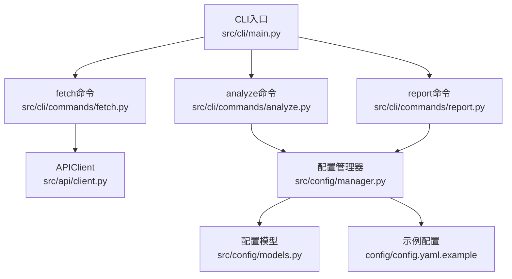
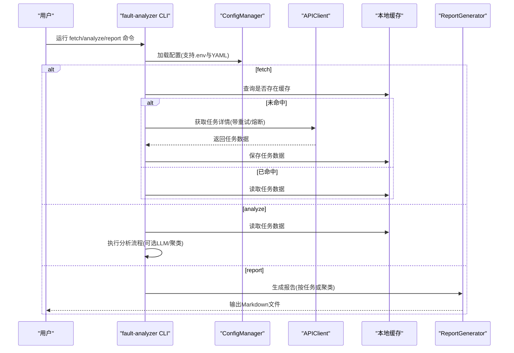
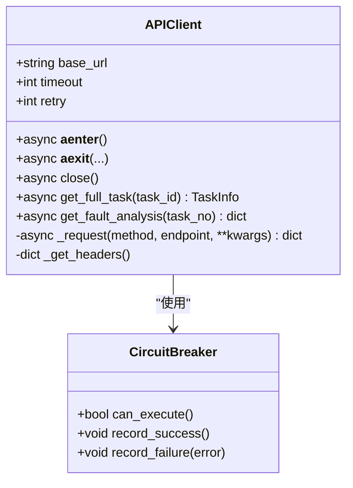
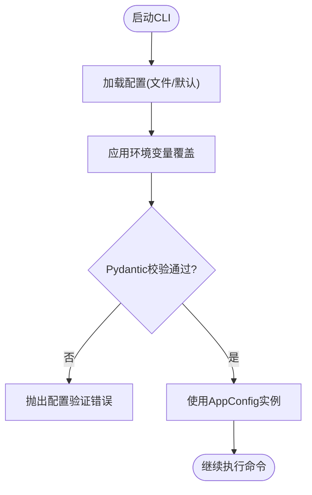
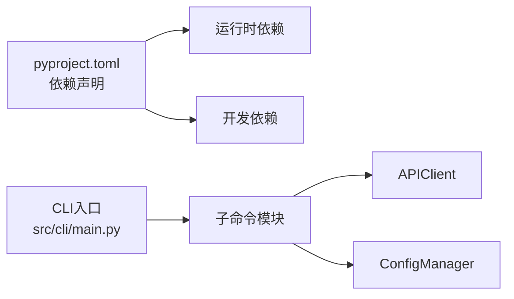

# 快速开始

<cite>
**本文引用的文件**   
- [README.md](file://README.md)
- [pyproject.toml](file://pyproject.toml)
- [config/config.yaml.example](file://config/config.yaml.example)
- [src/cli/main.py](file://src/cli/main.py)
- [src/cli/commands/fetch.py](file://src/cli/commands/fetch.py)
- [src/cli/commands/analyze.py](file://src/cli/commands/analyze.py)
- [src/cli/commands/report.py](file://src/cli/commands/report.py)
- [src/api/client.py](file://src/api/client.py)
- [src/config/manager.py](file://src/config/manager.py)
- [src/config/models.py](file://src/config/models.py)
- [scripts/setup_dev.sh](file://scripts/setup_dev.sh)
- [tests/conftest.py](file://tests/conftest.py)
- [docs/TROUBLESHOOTING.md](file://docs/TROUBLESHOOTING.md)
</cite>

## 目录
1. [简介](#简介)
2. [项目结构](#项目结构)
3. [核心组件](#核心组件)
4. [架构总览](#架构总览)
5. [详细组件分析](#详细组件分析)
6. [依赖关系分析](#依赖关系分析)
7. [性能与资源建议](#性能与资源建议)
8. [故障排除指南](#故障排除指南)
9. [结论](#结论)
10. [附录：30分钟上手清单](#附录30分钟上手清单)

## 简介
本指南面向首次接触“Bug聚类分析”项目的用户，目标是在30分钟内完成环境准备、配置设置、数据获取、分析与报告生成全流程。项目提供命令行工具 fault-analyzer，支持从研发管理系统拉取任务详情，进行文本预处理、LLM辅助分析、嵌入与聚类，最终输出结构化分析报告。

## 项目结构
- CLI入口与命令模块位于 src/cli，包含 fetch、analyze、report、config、cache 等子命令。
- API客户端封装了对外部研发管理系统的异步请求、重试与熔断逻辑。
- 配置系统支持 YAML 配置文件与环境变量覆盖，并提供 Pydantic 模型校验。
- 脚本 scripts/setup_dev.sh 用于一键初始化开发环境（Python版本检查、虚拟环境、依赖安装、pre-commit钩子、必要目录创建）。

图示来源
- [src/cli/main.py:1-40](file://src/cli/main.py#L1-L40)
- [src/cli/commands/fetch.py:1-235](file://src/cli/commands/fetch.py#L1-L235)
- [src/cli/commands/analyze.py:1-258](file://src/cli/commands/analyze.py#L1-L258)
- [src/cli/commands/report.py:1-140](file://src/cli/commands/report.py#L1-L140)
- [src/api/client.py:1-340](file://src/api/client.py#L1-L340)
- [src/config/manager.py:1-268](file://src/config/manager.py#L1-L268)
- [src/config/models.py:1-144](file://src/config/models.py#L1-L144)
- [config/config.yaml.example:1-38](file://config/config.yaml.example#L1-L38)

章节来源
- [README.md:1-101](file://README.md#L1-L101)
- [pyproject.toml:1-165](file://pyproject.toml#L1-L165)
- [scripts/setup_dev.sh:1-79](file://scripts/setup_dev.sh#L1-L79)

## 核心组件
- CLI主程序：注册子命令并统一入口，支持 --version 显示版本信息。
- fetch命令：支持单条或批量获取任务数据，内置缓存机制避免重复请求。
- analyze命令：对单个或批量任务执行分析流程，可选择是否使用LLM与缓存，支持聚类分析。
- report命令：基于缓存中的任务与分析结果生成Markdown报告，支持按任务或聚类维度输出。
- APIClient：封装对外部API的异步调用、认证头、超时与重试、熔断器保护。
- ConfigManager：加载YAML/JSON配置，应用环境变量覆盖，Pydantic模型校验，提供便捷get/set/merge方法。
- 配置模型：定义API、LLM、Embedding、Clustering、Cache、Rules、Output、Logging等配置项及校验规则。

章节来源
- [src/cli/main.py:1-40](file://src/cli/main.py#L1-L40)
- [src/cli/commands/fetch.py:1-235](file://src/cli/commands/fetch.py#L1-L235)
- [src/cli/commands/analyze.py:1-258](file://src/cli/commands/analyze.py#L1-L258)
- [src/cli/commands/report.py:1-140](file://src/cli/commands/report.py#L1-L140)
- [src/api/client.py:1-340](file://src/api/client.py#L1-L340)
- [src/config/manager.py:1-268](file://src/config/manager.py#L1-L268)
- [src/config/models.py:1-144](file://src/config/models.py#L1-L144)

## 架构总览
下图展示了从CLI到外部API与本地配置的交互路径，以及缓存与报告生成的关键节点。

图示来源
- [src/cli/main.py:1-40](file://src/cli/main.py#L1-L40)
- [src/cli/commands/fetch.py:1-235](file://src/cli/commands/fetch.py#L1-L235)
- [src/cli/commands/analyze.py:1-258](file://src/cli/commands/analyze.py#L1-L258)
- [src/cli/commands/report.py:1-140](file://src/cli/commands/report.py#L1-L140)
- [src/api/client.py:1-340](file://src/api/client.py#L1-L340)
- [src/config/manager.py:1-268](file://src/config/manager.py#L1-L268)

## 详细组件分析

### 环境准备与依赖安装
- Python版本要求：>=3.10（由项目元数据声明）。
- 推荐方式：使用脚本 scripts/setup_dev.sh 自动完成Python版本检查、虚拟环境创建、依赖安装、pre-commit钩子安装、必要目录创建与 .env 复制。
- 手动方式：
  - 创建虚拟环境并激活。
  - 安装开发依赖：pip install -e ".[dev]"。
  - 安装 pre-commit 钩子：pre-commit install。
  - 复制示例配置：cp config/config.yaml.example config/config.yaml（或在根目录创建 .env 文件）。

章节来源
- [pyproject.toml:1-20](file://pyproject.toml#L1-L20)
- [scripts/setup_dev.sh:1-79](file://scripts/setup_dev.sh#L1-L79)
- [README.md:12-29](file://README.md#L12-L29)

### 配置文件设置
- 配置文件位置与格式：
  - YAML配置文件：config/config.yaml（由ConfigManager默认路径指向）。
  - 示例模板：config/config.yaml.example。
- 环境变量覆盖：
  - 通过 ConfigManager._apply_env_overrides 将环境变量映射到配置项，例如：
    - API_BASE_URL -> api.base_url
    - DEVCLOUD_TOKEN -> api.api_key
    - LLM_PROVIDER -> llm.provider
    - LLM_API_KEY -> llm.api_key
    - EMBEDDING_PROVIDER -> embedding.provider
    - CLUSTERING_MIN_CLUSTER_SIZE -> clustering.min_cluster_size
    - 其他如 API_TIMEOUT、API_RETRY、LLM_MODEL、LLM_TEMPERATURE、LLM_MAX_TOKENS、EMBEDDING_MODEL、EMBEDDING_BATCH_SIZE、CACHE_ENABLED、CACHE_TTL、CACHE_STORAGE、CACHE_DB_PATH、OUTPUT_FORMAT、OUTPUT_DIRECTORY、LOG_LEVEL、LOG_FILE 等。
- 配置校验：
  - 使用 AppConfig 及其子模型进行字段校验（如base_url必须以http(s)开头、timeout>0、provider取值范围等）。

章节来源
- [src/config/manager.py:191-243](file://src/config/manager.py#L191-L243)
- [src/config/models.py:1-144](file://src/config/models.py#L1-L144)
- [config/config.yaml.example:1-38](file://config/config.yaml.example#L1-L38)

### 命令行工具使用示例（完整工作流）
- 查看帮助与版本：
  - fault-analyzer --help
  - fault-analyzer --version
- 获取数据：
  - 单条：fault-analyzer fetch single <task_id>
  - 批量：fault-analyzer fetch batch --task-ids "1,2,3" [--limit] [--force]
  - 查看缓存状态与列表：fault-analyzer fetch status / list
- 分析任务：
  - 单条：fault-analyzer analyze single <task_id> [--output ./reports/] [--llm/--no-llm] [--cache/--no-cache]
  - 批量：fault-analyzer analyze batch [--from-cache/--no-cache] [--cluster/--no-cluster] [--min-size N] [--output ./reports/]
  - 仅聚类：fault-analyzer analyze clusters [--output ./reports/]
- 生成报告：
  - 按任务：fault-analyzer report generate <task_id> --output ./output/
  - 按聚类：fault-analyzer report generate --cluster <cluster_id> --output ./output/
  - 批量：fault-analyzer report generate --output ./output/
  - 列出报告：fault-analyzer report list --output ./output/

说明：
- fetch命令在获取成功后会将任务数据写入本地缓存；analyze命令优先从缓存读取；report命令基于缓存中的数据生成Markdown报告。

章节来源
- [src/cli/commands/fetch.py:1-235](file://src/cli/commands/fetch.py#L1-L235)
- [src/cli/commands/analyze.py:1-258](file://src/cli/commands/analyze.py#L1-L258)
- [src/cli/commands/report.py:1-140](file://src/cli/commands/report.py#L1-L140)
- [src/cli/main.py:1-40](file://src/cli/main.py#L1-L40)

### API客户端与外部系统集成
- 功能要点：
  - 异步HTTP客户端，支持超时与指数退避重试。
  - 认证头自动注入（Bearer Token）。
  - 错误分类：认证失败、未找到、限流、服务器错误、连接异常。
  - 熔断器保护：连续失败达到阈值后短路，等待重置时间后再尝试。
- 常用接口：
  - get_full_task(task_id)：合并任务详情、提交信息与生产信息。
  - get_fault_analysis(task_no)：获取复盘结论（若后端支持）。

图示来源
- [src/api/client.py:1-340](file://src/api/client.py#L1-L340)

章节来源
- [src/api/client.py:1-340](file://src/api/client.py#L1-L340)

### 配置管理与环境变量覆盖
- 加载顺序：
  - 构造时可选传入配置字典或默认值。
  - 若存在配置文件路径且无初始配置，则从文件加载。
  - load() 时应用环境变量覆盖，并通过Pydantic模型校验。
- 环境变量映射：
  - 通过 _apply_env_overrides 将环境变量转换为配置项，支持布尔、整数、浮点与字符串类型解析。
- 验证与错误：
  - 配置缺失或格式错误会抛出 ConfigValidationError/ConfigNotFoundError/ConfigKeyError。

图示来源
- [src/config/manager.py:191-243](file://src/config/manager.py#L191-L243)
- [src/config/manager.py:245-268](file://src/config/manager.py#L245-L268)
- [src/config/models.py:1-144](file://src/config/models.py#L1-L144)

章节来源
- [src/config/manager.py:1-268](file://src/config/manager.py#L1-L268)
- [src/config/models.py:1-144](file://src/config/models.py#L1-L144)

## 依赖关系分析
- 运行时依赖包括Typer、Pydantic、PyYAML、httpx、OpenAI SDK、LangChain、SentenceTransformers、HDBSCAN、UMAP、Pandas、NumPy、Jinja2、Loguru、Rich、python-dotenv、aiosqlite、FastAPI、Uvicorn等。
- 开发依赖包括pytest、ruff、mypy、pre-commit等。
- CLI入口通过 pyproject.scripts 暴露 fault-analyzer 与 fault-analyzer-api。

图示来源
- [pyproject.toml:22-69](file://pyproject.toml#L22-L69)
- [src/cli/main.py:1-40](file://src/cli/main.py#L1-L40)

章节来源
- [pyproject.toml:1-165](file://pyproject.toml#L1-L165)

## 性能与资源建议
- 嵌入与聚类：
  - 调整 EMBEDDING_BATCH_SIZE 控制批处理大小，平衡吞吐与内存占用。
  - 根据数据规模调整 CLUSTERING_MIN_CLUSTER_SIZE 与 CLUSTERING_MIN_SAMPLES。
- 缓存策略：
  - 启用缓存并设置合理 TTL，减少重复网络请求。
- 日志级别：
  - 调试阶段使用 DEBUG，生产环境使用 INFO/WARNING。
- 模型选择：
  - 轻量级模型可提升速度，但可能影响分析质量；需权衡。

[本节为通用指导，不直接分析具体文件]

## 故障排除指南
- 常见问题定位：
  - 环境变量未加载或格式错误：检查 .env 文件内容与加载顺序。
  - API认证失败：确认 DEVCLOUD_TOKEN 有效且未过期。
  - API连接超时：增加 API_TIMEOUT 与 API_RETRY，检查网络连通性。
  - LLM服务问题：核对 LLM_PROVIDER、LLM_API_KEY、LLM_MODEL 与 LLM_BASE_URL。
  - 嵌入生成慢：降低 EMBEDDING_BATCH_SIZE 或使用本地模型。
  - 聚类结果为空：调小最小聚类大小与样本数，确保足够数据量。
  - SQLite数据库损坏：备份并修复或重建数据库文件。
  - 权限问题：确保 output、logs、data 目录存在且有读写权限。
- 测试与验证：
  - 使用 pytest 运行单元测试，必要时指定特定文件或用例。
  - 参考 tests/conftest.py 提供的样例数据与夹具进行复现。

章节来源
- [docs/TROUBLESHOOTING.md:1-800](file://docs/TROUBLESHOOTING.md#L1-L800)
- [tests/conftest.py:1-80](file://tests/conftest.py#L1-L80)

## 结论
通过本指南，您可以在30分钟内完成环境搭建、配置设置、数据获取、分析与报告生成。项目提供了完善的CLI工具链、灵活的配置系统与健壮的API客户端，适合快速落地与扩展。

## 附录：30分钟上手清单
- 第1-5分钟：克隆仓库，运行 scripts/setup_dev.sh，激活虚拟环境。
- 第6-10分钟：编辑 config/config.yaml 或 .env，填写 API_BASE_URL、DEVCLOUD_TOKEN、LLM_PROVIDER、LLM_API_KEY、EMBEDDING_PROVIDER 等关键项。
- 第11-15分钟：执行 fault-analyzer fetch single <task_id>，确认缓存成功。
- 第16-20分钟：执行 fault-analyzer analyze single <task_id>，观察分析结果。
- 第21-25分钟：执行 fault-analyzer report generate <task_id> --output ./output/，查看报告。
- 第26-30分钟：如需批量，使用 fetch batch 与 analyze batch/analyze clusters，并根据需要调整配置参数。

章节来源
- [scripts/setup_dev.sh:1-79](file://scripts/setup_dev.sh#L1-L79)
- [src/cli/commands/fetch.py:1-235](file://src/cli/commands/fetch.py#L1-L235)
- [src/cli/commands/analyze.py:1-258](file://src/cli/commands/analyze.py#L1-L258)
- [src/cli/commands/report.py:1-140](file://src/cli/commands/report.py#L1-L140)
- [src/config/manager.py:191-243](file://src/config/manager.py#L191-L243)
