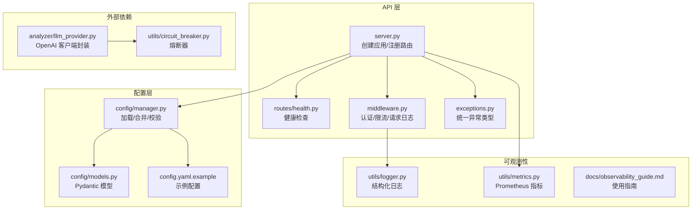
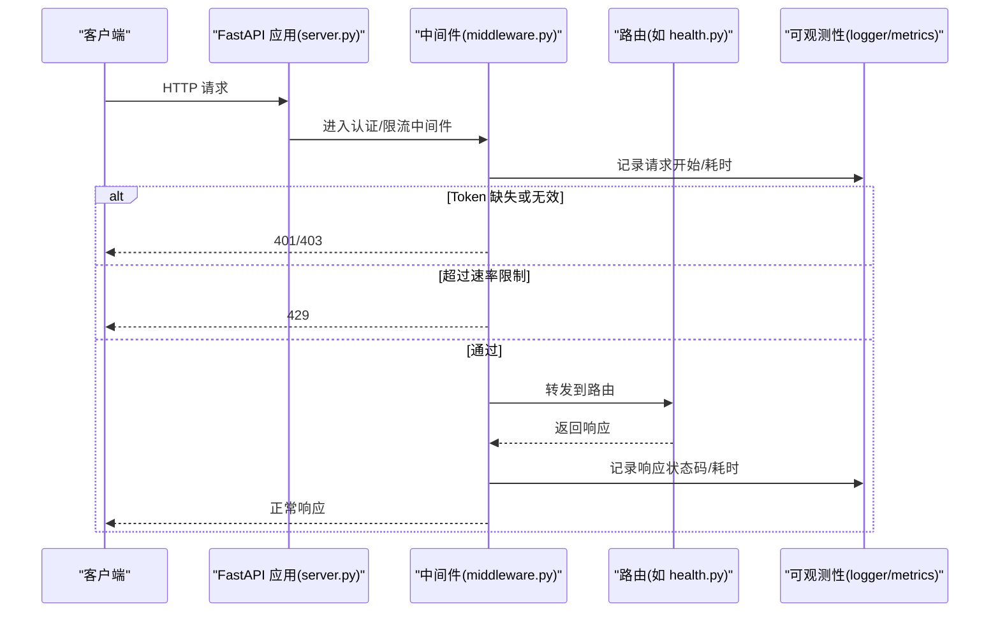
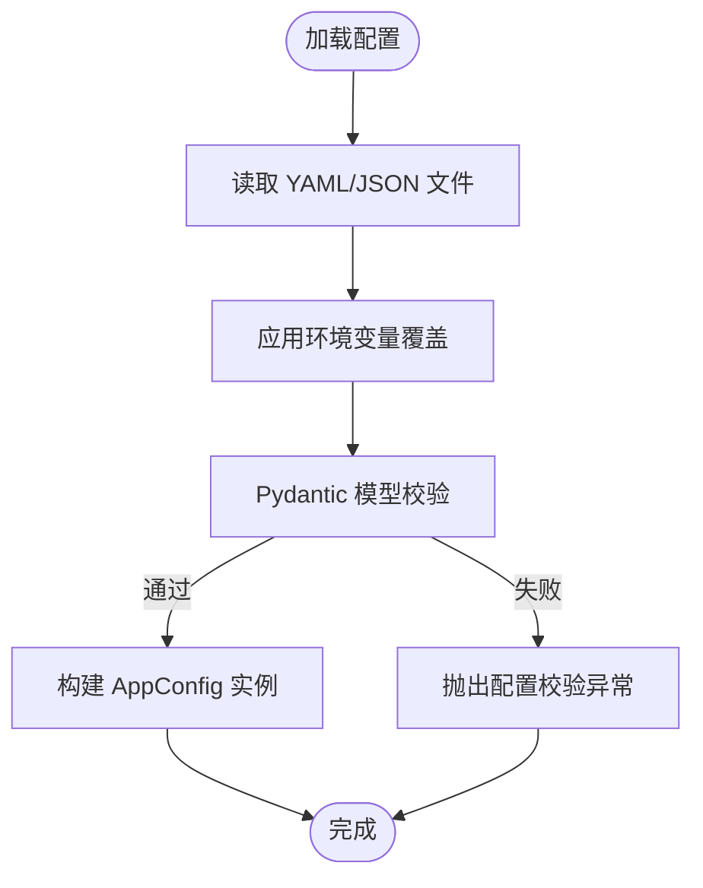
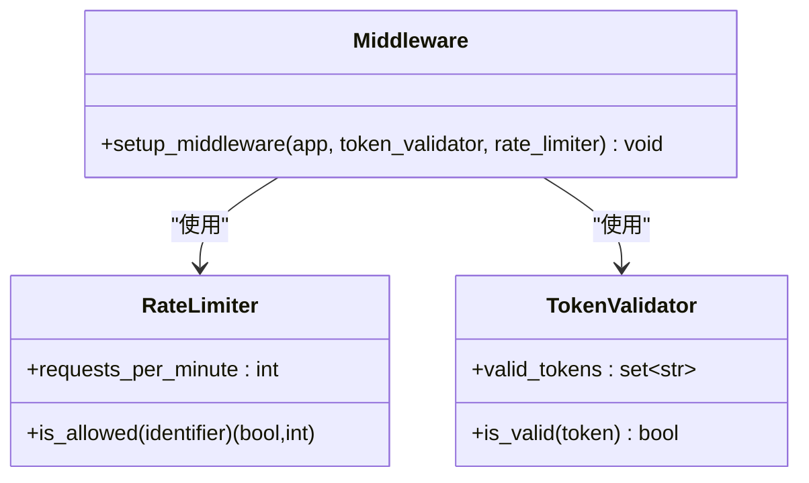
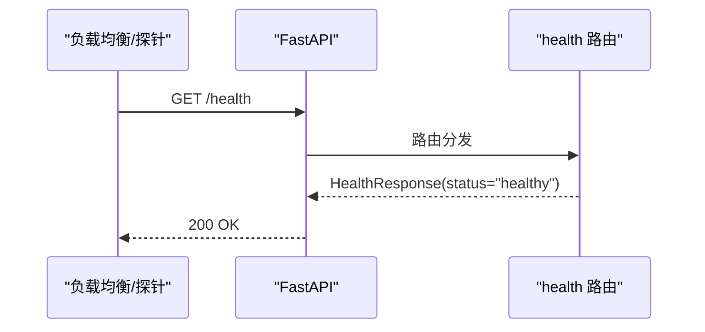
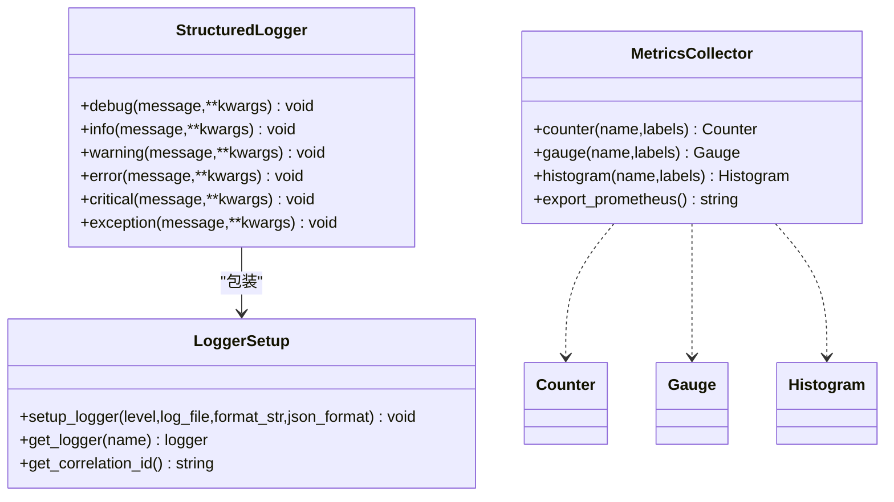
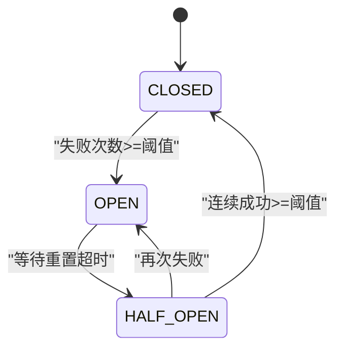
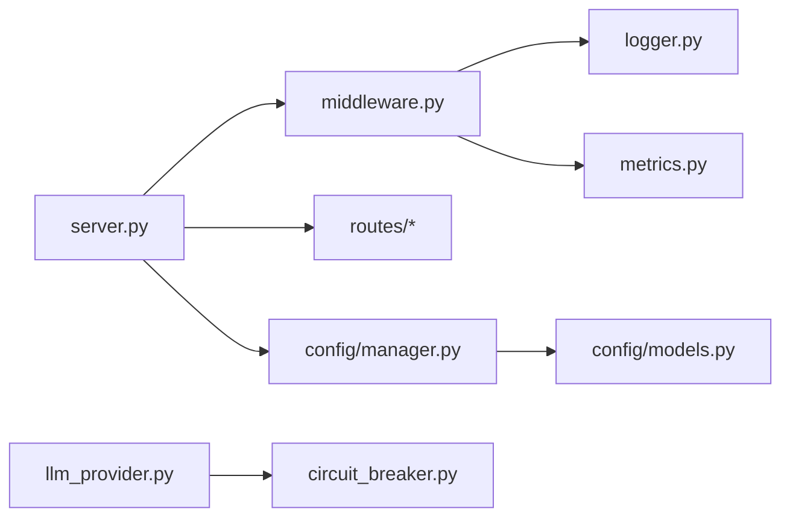
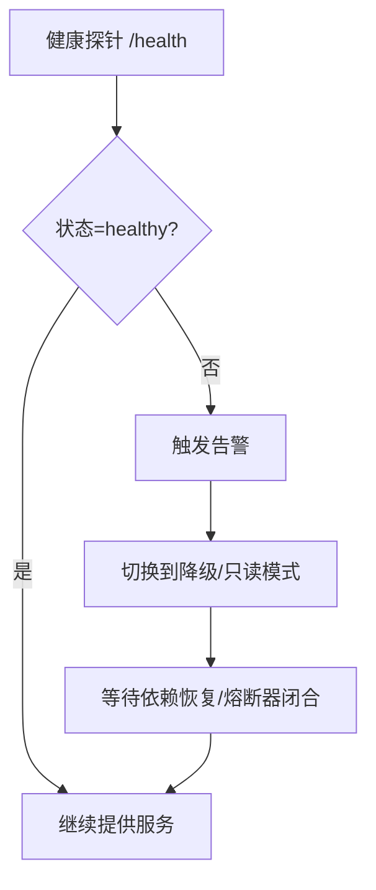

# 故障排除

<cite>
**本文引用的文件**   
- [src/api/server.py](file://src/api/server.py)
- [src/api/middleware.py](file://src/api/middleware.py)
- [src/api/routes/health.py](file://src/api/routes/health.py)
- [src/api/exceptions.py](file://src/api/exceptions.py)
- [src/config/manager.py](file://src/config/manager.py)
- [src/config/models.py](file://src/config/models.py)
- [config/config.yaml.example](file://config/config.yaml.example)
- [src/utils/logger.py](file://src/utils/logger.py)
- [src/utils/metrics.py](file://src/utils/metrics.py)
- [src/analyzer/llm_provider.py](file://src/analyzer/llm_provider.py)
- [src/utils/circuit_breaker.py](file://src/utils/circuit_breaker.py)
- [docs/observability_guide.md](file://docs/observability_guide.md)
- [docs/TROUBLESHOOTING.md](file://docs/TROUBLESHOOTING.md)
</cite>

## 目录
1. [简介](#简介)
2. [项目结构](#项目结构)
3. [核心组件](#核心组件)
4. [架构总览](#架构总览)
5. [详细组件分析](#详细组件分析)
6. [依赖关系分析](#依赖关系分析)
7. [性能与容量调优](#性能与容量调优)
8. [监控与告警配置](#监控与告警配置)
9. [健康检查与自愈机制](#健康检查与自愈机制)
10. [常见问题诊断手册](#常见问题诊断手册)
11. [紧急故障处理与回滚](#紧急故障处理与回滚)
12. [第三方服务依赖与降级策略](#第三方服务依赖与降级策略)
13. [结论](#结论)

## 简介
本手册面向系统运维与故障排查，聚焦于配置错误、网络连接、LLM 服务异常等典型问题的定位与修复；提供日志级别设置、关键信息提取与问题定位方法；给出内存/CPU/数据库查询优化建议；说明监控指标采集、告警阈值设定；阐述健康检查与自愈机制实现；覆盖容量规划与扩容策略；并包含紧急故障处理流程、回滚方案以及第三方依赖管理与降级策略。

## 项目结构
本项目采用分层模块化组织：API 层（FastAPI）、中间件（认证与限流）、配置管理（YAML + 环境变量覆盖）、可观测性（结构化日志与 Prometheus 指标）、外部依赖封装（LLM Provider、熔断器）等。

**图表来源** 
- [src/api/server.py:38-111](file://src/api/server.py#L38-L111)
- [src/api/middleware.py:62-141](file://src/api/middleware.py#L62-L141)
- [src/api/routes/health.py:10-22](file://src/api/routes/health.py#L10-L22)
- [src/config/manager.py:42-100](file://src/config/manager.py#L42-L100)
- [src/config/models.py:135-144](file://src/config/models.py#L135-L144)
- [config/config.yaml.example:1-38](file://config/config.yaml.example#L1-L38)
- [src/utils/logger.py:34-103](file://src/utils/logger.py#L34-L103)
- [src/utils/metrics.py:151-226](file://src/utils/metrics.py#L151-L226)
- [src/analyzer/llm_provider.py:1-67](file://src/analyzer/llm_provider.py#L1-L67)
- [src/utils/circuit_breaker.py:36-186](file://src/utils/circuit_breaker.py#L36-L186)

**章节来源**
- [src/api/server.py:38-111](file://src/api/server.py#L38-L111)
- [src/api/middleware.py:62-141](file://src/api/middleware.py#L62-L141)
- [src/api/routes/health.py:10-22](file://src/api/routes/health.py#L10-L22)
- [src/config/manager.py:42-100](file://src/config/manager.py#L42-L100)
- [src/config/models.py:135-144](file://src/config/models.py#L135-L144)
- [config/config.yaml.example:1-38](file://config/config.yaml.example#L1-L38)
- [src/utils/logger.py:34-103](file://src/utils/logger.py#L34-L103)
- [src/utils/metrics.py:151-226](file://src/utils/metrics.py#L151-L226)
- [src/analyzer/llm_provider.py:1-67](file://src/analyzer/llm_provider.py#L1-L67)
- [src/utils/circuit_breaker.py:36-186](file://src/utils/circuit_breaker.py#L36-L186)

## 核心组件
- API 服务器与生命周期：负责创建 FastAPI 应用、注册路由、挂载中间件、启动 Uvicorn。
- 中间件：Token 认证、速率限制、请求/响应日志记录。
- 配置管理：从 YAML/JSON 与环境变量加载、合并、校验，生成强类型 AppConfig。
- 可观测性：结构化日志（支持 JSON 输出与文件轮转）、Prometheus 指标导出。
- 外部依赖封装：LLM Provider 初始化与调用；熔断器保护外部调用。

**章节来源**
- [src/api/server.py:38-111](file://src/api/server.py#L38-L111)
- [src/api/middleware.py:62-141](file://src/api/middleware.py#L62-L141)
- [src/config/manager.py:183-258](file://src/config/manager.py#L183-L258)
- [src/utils/logger.py:34-103](file://src/utils/logger.py#L34-L103)
- [src/utils/metrics.py:151-226](file://src/utils/metrics.py#L151-L226)
- [src/analyzer/llm_provider.py:1-67](file://src/analyzer/llm_provider.py#L1-L67)
- [src/utils/circuit_breaker.py:36-186](file://src/utils/circuit_breaker.py#L36-L186)

## 架构总览
下图展示一次 API 请求的完整链路：客户端进入后经过认证与限流中间件，再到达具体路由；同时通过日志与指标进行可观测性采集。

**图表来源** 
- [src/api/server.py:38-111](file://src/api/server.py#L38-L111)
- [src/api/middleware.py:81-141](file://src/api/middleware.py#L81-L141)
- [src/api/routes/health.py:10-22](file://src/api/routes/health.py#L10-L22)
- [src/utils/logger.py:34-103](file://src/utils/logger.py#L34-L103)
- [src/utils/metrics.py:151-226](file://src/utils/metrics.py#L151-L226)

## 详细组件分析

### 配置管理与验证
- 配置来源优先级：默认值 → 配置文件 → 环境变量覆盖。
- 环境变量映射：将常见键映射到配置树（如 api.base_url、llm.provider 等）。
- 校验：基于 Pydantic 模型对必填字段、取值范围、枚举值进行约束。

**图表来源** 
- [src/config/manager.py:82-100](file://src/config/manager.py#L82-L100)
- [src/config/manager.py:191-243](file://src/config/manager.py#L191-L243)
- [src/config/models.py:135-144](file://src/config/models.py#L135-L144)

**章节来源**
- [src/config/manager.py:82-100](file://src/config/manager.py#L82-L100)
- [src/config/manager.py:191-243](file://src/config/manager.py#L191-L243)
- [src/config/models.py:135-144](file://src/config/models.py#L135-L144)
- [config/config.yaml.example:1-38](file://config/config.yaml.example#L1-L38)

### 认证与速率限制中间件
- Token 校验：支持 Header 与 Query 参数两种方式；未配置有效 Token 时允许所有请求（开发模式）。
- 速率限制：按分钟窗口统计，超限返回 429，并在响应头中携带限制信息。
- 日志记录：记录请求方法与路径、来源 IP、响应状态码与耗时。

**图表来源** 
- [src/api/middleware.py:13-46](file://src/api/middleware.py#L13-46)
- [src/api/middleware.py:48-60](file://src/api/middleware.py#L48-60)
- [src/api/middleware.py:62-141](file://src/api/middleware.py#L62-L141)

**章节来源**
- [src/api/middleware.py:13-46](file://src/api/middleware.py#L13-46)
- [src/api/middleware.py:48-60](file://src/api/middleware.py#L48-60)
- [src/api/middleware.py:62-141](file://src/api/middleware.py#L62-L141)

### 健康检查接口
- 提供 /health 端点，用于负载均衡与健康探针。
- 当前返回固定健康状态，可扩展为多依赖健康检查聚合。

**图表来源** 
- [src/api/routes/health.py:10-22](file://src/api/routes/health.py#L10-L22)
- [src/api/server.py:96-100](file://src/api/server.py#L96-L100)

**章节来源**
- [src/api/routes/health.py:10-22](file://src/api/routes/health.py#L10-L22)
- [src/api/server.py:96-100](file://src/api/server.py#L96-L100)

### 结构化日志与指标
- 日志：支持控制台与 JSON 格式，支持文件输出与轮转；提供关联 ID 便于追踪。
- 指标：Counter/Gauge/Histogram 三类指标，支持 Prometheus 文本格式导出。

**图表来源** 
- [src/utils/logger.py:131-160](file://src/utils/logger.py#L131-L160)
- [src/utils/logger.py:34-103](file://src/utils/logger.py#L34-L103)
- [src/utils/metrics.py:151-226](file://src/utils/metrics.py#L151-L226)

**章节来源**
- [src/utils/logger.py:34-103](file://src/utils/logger.py#L34-L103)
- [src/utils/logger.py:131-160](file://src/utils/logger.py#L131-L160)
- [src/utils/metrics.py:151-226](file://src/utils/metrics.py#L151-L226)
- [docs/observability_guide.md:1-229](file://docs/observability_guide.md#L1-L229)

### LLM 服务与熔断器
- LLM Provider：根据配置创建 OpenAI 异步客户端，发起聊天补全请求。
- 熔断器：在 CLOSED/OPEN/HALF_OPEN 三态间切换，失败阈值触发打开，成功阈值恢复关闭；提供装饰器与上下文管理器两种用法。

**图表来源** 
- [src/analyzer/llm_provider.py:1-67](file://src/analyzer/llm_provider.py#L1-L67)
- [src/utils/circuit_breaker.py:19-186](file://src/utils/circuit_breaker.py#L19-L186)

**章节来源**
- [src/analyzer/llm_provider.py:1-67](file://src/analyzer/llm_provider.py#L1-L67)
- [src/utils/circuit_breaker.py:19-186](file://src/utils/circuit_breaker.py#L19-L186)

## 依赖关系分析
- 模块耦合：API 层依赖中间件与路由；中间件依赖日志与指标；配置层被多处消费；外部依赖通过 Provider 与熔断器解耦。
- 潜在风险：若 LLM 服务不可用且熔断器长时间处于 OPEN，需人工干预或自动恢复策略；指标与日志写入磁盘可能成为 I/O 瓶颈。

**图表来源** 
- [src/api/server.py:38-111](file://src/api/server.py#L38-L111)
- [src/api/middleware.py:62-141](file://src/api/middleware.py#L62-L141)
- [src/config/manager.py:42-100](file://src/config/manager.py#L42-L100)
- [src/config/models.py:135-144](file://src/config/models.py#L135-L144)
- [src/analyzer/llm_provider.py:1-67](file://src/analyzer/llm_provider.py#L1-L67)
- [src/utils/circuit_breaker.py:36-186](file://src/utils/circuit_breaker.py#L36-L186)

**章节来源**
- [src/api/server.py:38-111](file://src/api/server.py#L38-L111)
- [src/api/middleware.py:62-141](file://src/api/middleware.py#L62-L141)
- [src/config/manager.py:42-100](file://src/config/manager.py#L42-L100)
- [src/config/models.py:135-144](file://src/config/models.py#L135-L144)
- [src/analyzer/llm_provider.py:1-67](file://src/analyzer/llm_provider.py#L1-L67)
- [src/utils/circuit_breaker.py:36-186](file://src/utils/circuit_breaker.py#L36-L186)

## 性能与容量调优
- 内存优化
  - 降低批处理大小（如嵌入批量），避免一次性加载大量数据。
  - 使用流式/生成器处理大对象，及时释放不再使用的引用。
  - 调整容器/进程内存上限，防止 OOM。
- CPU 使用率调优
  - 合理设置并发与线程池；减少不必要的同步阻塞操作。
  - 选择轻量级模型或本地缓存模型以减少冷启动开销。
- 数据库查询优化
  - 控制缓存 TTL 与存储类型（sqlite/file/memory），避免频繁 IO。
  - 对热点数据进行索引与分页，减少单次查询负载。
- 网络与外部服务
  - 调整超时与重试次数，结合熔断器避免雪崩。
  - 启用连接复用与合理的 Keep-Alive。

[本节为通用指导，不直接分析具体文件]

## 监控与告警配置
- 指标采集
  - 使用 MetricsCollector 暴露 Prometheus 格式指标，包括计数器、仪表盘、直方图。
  - 建议在 API 入口与关键业务路径埋点，记录请求总量、错误数、延迟分布与活跃请求数。
- 日志采集
  - 生产环境推荐 JSON 格式，便于集中收集与检索；开启文件轮转与保留策略。
  - 使用关联 ID 贯穿请求链路，便于跨服务追踪。
- 告警阈值建议
  - 错误率：5xx 比例超过阈值（如 1%）持续 N 分钟。
  - 延迟：P95/P99 超过 SLA（如 > 2s）持续 N 分钟。
  - 资源：CPU/内存使用率超过阈值（如 80%/90%）持续 N 分钟。
  - 外部依赖：熔断器 OPEN 时间过长或失败率突增。

**章节来源**
- [src/utils/metrics.py:151-226](file://src/utils/metrics.py#L151-L226)
- [src/utils/logger.py:34-103](file://src/utils/logger.py#L34-L103)
- [docs/observability_guide.md:1-229](file://docs/observability_guide.md#L1-L229)

## 健康检查与自愈机制
- 健康检查
  - 提供 /health 端点，供负载均衡与编排平台探测。
  - 可扩展为多依赖健康检查（数据库、向量库、LLM 连通性）。
- 自愈机制
  - 熔断器自动阻断失败的外部调用，并在半开状态下试探恢复。
  - 配合重试与退避策略，提升瞬时故障下的可用性。
  - 定时任务或外部编排器检测熔断器状态并触发告警与人工介入。

**图表来源** 
- [src/api/routes/health.py:10-22](file://src/api/routes/health.py#L10-L22)
- [src/utils/circuit_breaker.py:36-186](file://src/utils/circuit_breaker.py#L36-L186)

**章节来源**
- [src/api/routes/health.py:10-22](file://src/api/routes/health.py#L10-L22)
- [src/utils/circuit_breaker.py:36-186](file://src/utils/circuit_breaker.py#L36-L186)

## 常见问题诊断手册

### 配置错误
- 症状：启动时报配置校验失败或运行时缺少必要字段。
- 定位：
  - 检查配置文件是否存在与可读；确认环境变量是否生效。
  - 查看配置校验错误详情，核对必填项与取值范围。
- 解决：
  - 参考示例配置补齐必填项；修正环境变量命名与类型。
  - 使用配置管理器提供的 get/set/merge 能力动态调试。

**章节来源**
- [src/config/manager.py:82-100](file://src/config/manager.py#L82-L100)
- [src/config/manager.py:191-243](file://src/config/manager.py#L191-L243)
- [src/config/models.py:135-144](file://src/config/models.py#L135-L144)
- [config/config.yaml.example:1-38](file://config/config.yaml.example#L1-L38)

### 网络连接问题
- 症状：API 调用超时、连接失败或 404。
- 定位：
  - 检查基础 URL、端口与防火墙策略；验证域名解析。
  - 查看中间件日志中的请求与响应耗时。
- 解决：
  - 调整超时与重试参数；必要时增加代理或白名单。
  - 确认接口路径前缀与版本匹配。

**章节来源**
- [src/api/middleware.py:143-172](file://src/api/middleware.py#L143-L172)
- [docs/TROUBLESHOOTING.md:177-231](file://docs/TROUBLESHOOTING.md#L177-L231)

### LLM 服务异常
- 症状：401 认证失败、模型不存在、超时或结果异常。
- 定位：
  - 校验 provider、model、api_key、base_url 等配置。
  - 直接访问提供商 models 列表验证连通性与权限。
- 解决：
  - 更新密钥或模型名称；调整 temperature/max_tokens。
  - 结合熔断器与重试，避免雪崩。

**章节来源**
- [src/analyzer/llm_provider.py:1-67](file://src/analyzer/llm_provider.py#L1-L67)
- [docs/TROUBLESHOOTING.md:233-309](file://docs/TROUBLESHOOTING.md#L233-L309)

### 嵌入生成问题
- 症状：嵌入生成失败或速度慢。
- 定位：
  - 检查 embedding provider/model/key/base_url/batch_size。
  - 观察指标中的延迟分布与错误计数。
- 解决：
  - 调整批大小或使用更轻量的本地模型；启用缓存。

**章节来源**
- [src/config/models.py:45-58](file://src/config/models.py#L45-L58)
- [docs/TROUBLESHOOTING.md:311-364](file://docs/TROUBLESHOOTING.md#L311-L364)

### 聚类分析问题
- 症状：结果为空或效果不佳。
- 定位：
  - 检查最小聚类大小与样本数；评估嵌入质量。
- 解决：
  - 调整算法与距离度量；增大样本量或更换嵌入模型。

**章节来源**
- [src/config/models.py:61-81](file://src/config/models.py#L61-L81)
- [docs/TROUBLESHOOTING.md:366-407](file://docs/TROUBLESHOOTING.md#L366-L407)

### 性能与内存问题
- 症状：分析慢、启动慢、内存不足。
- 定位：
  - 查看指标中的延迟与内存占用；检查批大小与并发。
- 解决：
  - 启用缓存、减小批大小、使用轻量模型；调整容器资源限制。

**章节来源**
- [docs/TROUBLESHOOTING.md:409-488](file://docs/TROUBLESHOOTING.md#L409-L488)

### 数据存储问题
- 症状：ChromaDB/SQLite 无法启动或权限错误。
- 定位：
  - 检查数据目录存在与读写权限；尝试修复或删除损坏数据库。
- 解决：
  - 重建数据目录与数据库；确保运行用户具备足够权限。

**章节来源**
- [docs/TROUBLESHOOTING.md:490-553](file://docs/TROUBLESHOOTING.md#L490-L553)

### 日志问题
- 症状：日志未生成或级别不生效。
- 定位：
  - 检查 LOG_LEVEL/LOG_FILE 与日志目录权限；手动设置日志级别。
- 解决：
  - 创建日志目录并赋予写权限；在生产使用 JSON 格式。

**章节来源**
- [src/utils/logger.py:34-103](file://src/utils/logger.py#L34-L103)
- [docs/TROUBLESHOOTING.md:555-591](file://docs/TROUBLESHOOTING.md#L555-L591)

### API 服务问题
- 症状：服务无法启动、500 错误、429 限流。
- 定位：
  - 检查端口占用、配置与日志；查看中间件限流头与剩余配额。
- 解决：
  - 更换端口、调整限流阈值、启用调试日志定位根因。

**章节来源**
- [src/api/server.py:114-151](file://src/api/server.py#L114-L151)
- [src/api/middleware.py:118-141](file://src/api/middleware.py#L118-L141)
- [docs/TROUBLESHOOTING.md:632-685](file://docs/TROUBLESHOOTING.md#L632-L685)

### Docker/Kubernetes 部署问题
- 症状：镜像构建失败、容器启动退出、Pod 无法启动或服务不可访问。
- 定位：
  - 查看构建与运行日志；检查环境变量、网络策略与持久卷绑定。
- 解决：
  - 修正 Dockerfile 与 K8s 资源清单；确认 StorageClass 与网络策略。

**章节来源**
- [docs/TROUBLESHOOTING.md:687-798](file://docs/TROUBLESHOOTING.md#L687-L798)

## 紧急故障处理与回滚
- 快速止血
  - 启用熔断器保护外部依赖；临时降级非核心功能。
  - 扩大限流阈值或暂时关闭认证（仅限应急场景）。
- 定位与恢复
  - 拉取最近日志与指标，关注错误率与延迟尖峰。
  - 回滚至上一稳定版本；清理异常缓存与临时数据。
- 复盘与加固
  - 完善告警阈值与演练预案；补充健康检查与自愈逻辑。

[本节为通用流程，不直接分析具体文件]

## 第三方服务依赖与降级策略
- 依赖管理
  - 通过 Provider 抽象外部服务；配置化开关与超时。
  - 使用熔断器隔离故障域，避免级联失败。
- 降级策略
  - 当外部服务不可用时，返回缓存结果或默认答案。
  - 限制并发与批大小，降低下游压力。
- 监控与告警
  - 针对外部依赖的错误率、延迟与熔断状态建立告警。
  - 定期演练降级与恢复流程。

**章节来源**
- [src/analyzer/llm_provider.py:1-67](file://src/analyzer/llm_provider.py#L1-L67)
- [src/utils/circuit_breaker.py:36-186](file://src/utils/circuit_breaker.py#L36-L186)

## 结论
通过统一的配置管理、严格的中间件治理、完善的可观测性与熔断保护，系统能够在复杂外部依赖环境下保持稳定与可维护。结合监控告警、健康检查与自愈机制，运维团队可以快速定位与恢复问题，保障服务质量与用户体验。
