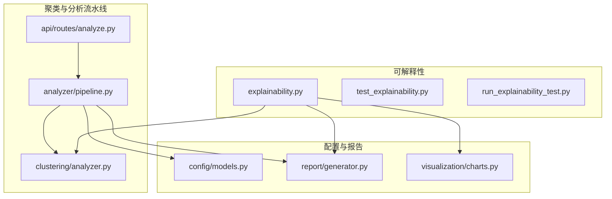
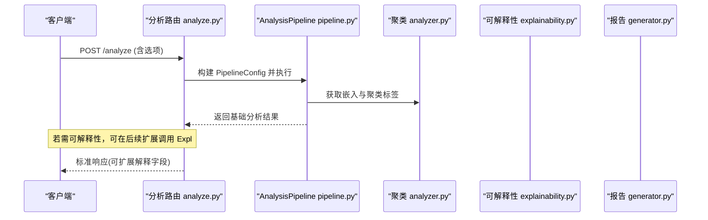
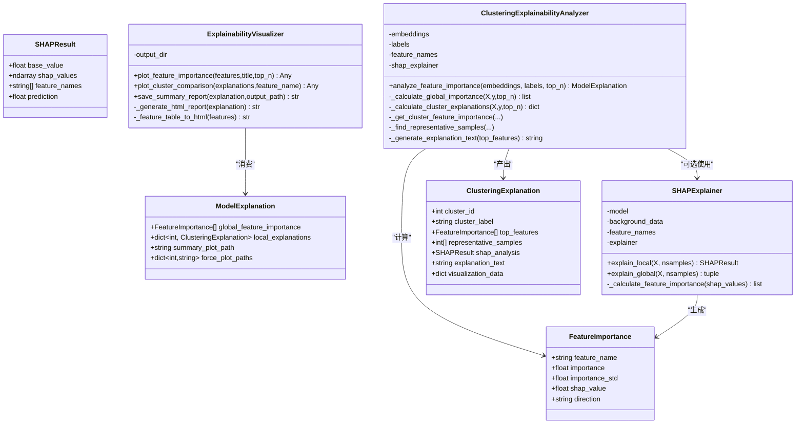
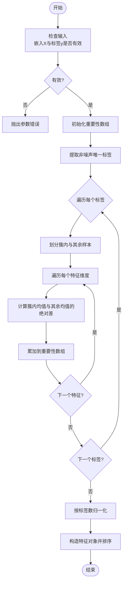
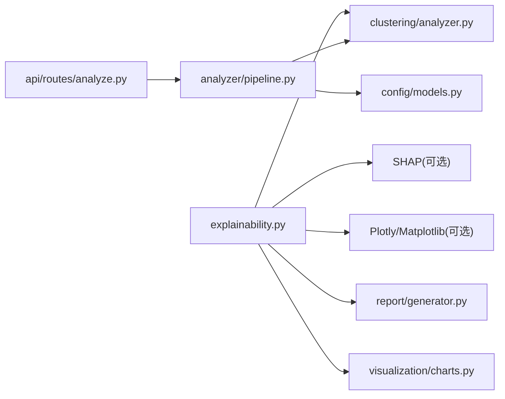

# 可解释性分析

<cite>
**本文引用的文件**
- [src/analysis/explainability.py](file://src/analysis/explainability.py)
- [tests/analysis/test_explainability.py](file://tests/analysis/test_explainability.py)
- [run_explainability_test.py](file://run_explainability_test.py)
- [src/clustering/analyzer.py](file://src/clustering/analyzer.py)
- [src/clustering/models.py](file://src/clustering/models.py)
- [src/config/models.py](file://src/config/models.py)
- [src/api/routes/analyze.py](file://src/api/routes/analyze.py)
- [src/analyzer/pipeline.py](file://src/analyzer/pipeline.py)
- [src/report/generator.py](file://src/report/generator.py)
- [src/visualization/charts.py](file://src/visualization/charts.py)
</cite>

## 目录
1. [简介](#简介)
2. [项目结构](#项目结构)
3. [核心组件](#核心组件)
4. [架构总览](#架构总览)
5. [详细组件分析](#详细组件分析)
6. [依赖关系分析](#依赖关系分析)
7. [性能与复杂度](#性能与复杂度)
8. [故障排查指南](#故障排查指南)
9. [结论](#结论)
10. [附录：使用示例与集成方式](#附录使用示例与集成方式)

## 简介
本技术文档聚焦“可解释性分析模块”，围绕以下目标展开：
- 透明度机制：决策依据追溯、置信度评估、推理路径可视化
- 人类可读解释：关键因素识别、影响权重计算、自然语言摘要
- 指标定义与计算：全局/局部重要性、方向性、代表性样本
- 启用与配置：如何开启可解释性功能、自定义解释规则、设置透明度级别
- 集成与输出：与主分析流程的对接方式、结果呈现格式（HTML/图表）
- 调试与可视化：测试脚本、可视化工具与报告生成

## 项目结构
可解释性相关代码主要位于 src/analysis/explainability.py，配套测试在 tests/analysis/test_explainability.py，并提供独立运行入口 run_explainability_test.py。与聚类、配置、API、报告与可视化等子系统存在协作关系。

图示来源
- [src/analysis/explainability.py:1-563](file://src/analysis/explainability.py#L1-L563)
- [tests/analysis/test_explainability.py:1-401](file://tests/analysis/test_explainability.py#L1-L401)
- [run_explainability_test.py:1-9](file://run_explainability_test.py#L1-L9)
- [src/clustering/analyzer.py:1-316](file://src/clustering/analyzer.py#L1-L316)
- [src/analyzer/pipeline.py:1-468](file://src/analyzer/pipeline.py#L1-L468)
- [src/api/routes/analyze.py:1-202](file://src/api/routes/analyze.py#L1-L202)
- [src/config/models.py:1-144](file://src/config/models.py#L1-L144)
- [src/report/generator.py:1-790](file://src/report/generator.py#L1-L790)
- [src/visualization/charts.py:1-399](file://src/visualization/charts.py#L1-L399)

章节来源
- [src/analysis/explainability.py:1-563](file://src/analysis/explainability.py#L1-L563)
- [tests/analysis/test_explainability.py:1-401](file://tests/analysis/test_explainability.py#L1-L401)
- [run_explainability_test.py:1-9](file://run_explainability_test.py#L1-L9)

## 核心组件
- SHAPExplainer：封装SHAP解释器，支持本地与全局解释；当未安装SHAP时提供降级策略并记录警告。
- ClusteringExplainabilityAnalyzer：基于嵌入向量与聚类标签进行特征重要性分析与聚类级解释，包含代表性样本选择与自然语言解释文本生成。
- ExplainabilityVisualizer：生成特征重要性图、跨聚类比较图，并导出HTML摘要报告。
- 数据模型：FeatureImportance、SHAPResult、ClusteringExplanation、ModelExplanation 用于结构化承载解释结果。

章节来源
- [src/analysis/explainability.py:27-70](file://src/analysis/explainability.py#L27-L70)
- [src/analysis/explainability.py:71-206](file://src/analysis/explainability.py#L71-L206)
- [src/analysis/explainability.py:208-378](file://src/analysis/explainability.py#L208-L378)
- [src/analysis/explainability.py:380-563](file://src/analysis/explainability.py#L380-L563)

## 架构总览
可解释性模块通过两类路径融入系统：
- 离线/批处理：对已生成的嵌入向量与聚类标签执行解释分析，输出HTML报告与图表。
- 在线/流水线：在分析流水线中扩展可解释性步骤（当前未默认启用），由API路由触发后返回解释结果。

图示来源
- [src/api/routes/analyze.py:58-119](file://src/api/routes/analyze.py#L58-L119)
- [src/analyzer/pipeline.py:184-227](file://src/analyzer/pipeline.py#L184-L227)
- [src/clustering/analyzer.py:1-316](file://src/clustering/analyzer.py#L1-L316)
- [src/analysis/explainability.py:208-378](file://src/analysis/explainability.py#L208-L378)
- [src/report/generator.py:250-303](file://src/report/generator.py#L250-L303)

## 详细组件分析

### 类与数据结构

图示来源
- [src/analysis/explainability.py:27-70](file://src/analysis/explainability.py#L27-L70)
- [src/analysis/explainability.py:71-206](file://src/analysis/explainability.py#L71-L206)
- [src/analysis/explainability.py:208-378](file://src/analysis/explainability.py#L208-L378)
- [src/analysis/explainability.py:380-563](file://src/analysis/explainability.py#L380-L563)

#### SHAPExplainer 详解
- 初始化：根据模型能力自动选择 predict/proba 或黑盒模式；缺失SHAP库时抛出明确错误提示。
- 本地解释：对单样本计算SHAP值，返回基线值、特征贡献矩阵与特征名。
- 全局解释：聚合SHAP值得到特征重要性排序，附带均值、方差与方向性。
- 健壮性：异常捕获与日志记录，避免中断上层流程。

章节来源
- [src/analysis/explainability.py:71-206](file://src/analysis/explainability.py#L71-L206)

#### ClusteringExplainabilityAnalyzer 详解
- 全局重要性：按每个非噪声簇与其余样本的均值差累加，归一化后排序得到Top-N特征。
- 局部解释：为每个簇计算Top特征、选取靠近中心的代表性样本、生成中文解释文本。
- 噪声点处理：忽略标签为-1的噪声样本，保证解释质量。

章节来源
- [src/analysis/explainability.py:208-378](file://src/analysis/explainability.py#L208-L378)

#### ExplainabilityVisualizer 详解
- 图表：水平条形图展示Top特征重要性，颜色区分正负方向；跨聚类比较图对比指定特征在各簇的重要性。
- 报告：将全局与局部解释汇总为HTML表格与说明，便于非技术人员阅读。

章节来源
- [src/analysis/explainability.py:380-563](file://src/analysis/explainability.py#L380-L563)

### 算法流程图（全局重要性计算）

图示来源
- [src/analysis/explainability.py:252-288](file://src/analysis/explainability.py#L252-L288)

### 与主分析流程的集成
- 流水线层：AnalysisPipeline 负责编排预处理、嵌入、聚类、根因分析、规则检查与报告生成。可解释性可作为可选步骤接入。
- API层：/analyze 与 /analyze/batch 接收请求并返回标准化响应。当前响应不包含可解释性字段，但可通过扩展 PipelineResult 与 SingleAnalyzeResponse/BatchAnalyzeResponse 来承载。
- 报告层：ReportGenerator 支持Markdown/HTML/JSON等多种格式，可与可解释性输出的HTML报告结合。

章节来源
- [src/analyzer/pipeline.py:66-183](file://src/analyzer/pipeline.py#L66-L183)
- [src/analyzer/pipeline.py:184-227](file://src/analyzer/pipeline.py#L184-L227)
- [src/api/routes/analyze.py:58-119](file://src/api/routes/analyze.py#L58-L119)
- [src/report/generator.py:250-303](file://src/report/generator.py#L250-L303)

## 依赖关系分析
- 外部依赖：
  - SHAP：可选，未安装时将禁用SHAP相关功能并记录警告。
  - Plotly/Matplotlib：可选，未安装时将禁用可视化功能并记录警告。
- 内部依赖：
  - 聚类模块：提供嵌入与标签作为解释输入。
  - 配置模块：提供聚类、嵌入、LLM等配置项（可解释性可复用embedding与clustering配置）。
  - 报告与可视化：输出HTML报告与交互式图表。

图示来源
- [src/analysis/explainability.py:10-24](file://src/analysis/explainability.py#L10-L24)
- [src/clustering/analyzer.py:1-316](file://src/clustering/analyzer.py#L1-L316)
- [src/config/models.py:61-81](file://src/config/models.py#L61-L81)
- [src/report/generator.py:1-790](file://src/report/generator.py#L1-L790)
- [src/visualization/charts.py:1-399](file://src/visualization/charts.py#L1-L399)
- [src/analyzer/pipeline.py:184-227](file://src/analyzer/pipeline.py#L184-L227)
- [src/api/routes/analyze.py:58-119](file://src/api/routes/analyze.py#L58-L119)

章节来源
- [src/analysis/explainability.py:10-24](file://src/analysis/explainability.py#L10-L24)
- [src/config/models.py:61-81](file://src/config/models.py#L61-L81)

## 性能与复杂度
- 全局重要性：时间复杂度 O(K·D)，K为簇数量，D为特征维度；空间复杂度 O(D)。
- 局部解释：每簇计算Top特征 O(Nc·D)，Nc为簇大小；代表性样本选择 O(Nc log Nc)。
- SHAP解释：取决于底层实现与采样数nsamples，通常较高开销，建议仅在必要场景启用。
- 可视化：Plotly渲染成本与特征数量线性相关，建议限制top_n以控制输出规模。

[本节为通用性能讨论，不直接分析具体文件]

## 故障排查指南
- 缺少SHAP库：会记录警告并禁用SHAP功能。请安装依赖后重试。
- 缺少可视化库：会记录警告并跳过图表生成。请安装Plotly/Matplotlib。
- 参数错误：当未提供嵌入或标签时，分析器会抛出参数错误。
- 噪声点过多：若全部为噪声点，将不会生成任何聚类解释。
- 报告保存失败：检查输出目录权限与路径有效性。

章节来源
- [src/analysis/explainability.py:10-24](file://src/analysis/explainability.py#L10-L24)
- [src/analysis/explainability.py:239-244](file://src/analysis/explainability.py#L239-L244)
- [src/analysis/explainability.py:299-301](file://src/analysis/explainability.py#L299-L301)

## 结论
可解释性分析模块提供了从全局到局部的完整解释能力，涵盖特征重要性、方向性、代表性样本与人类可读文本。其设计具备良好的容错性与可扩展性，能够与现有聚类与分析流水线无缝衔接，并通过HTML报告与交互式图表提升透明度与可理解性。

[本节为总结性内容，不直接分析具体文件]

## 附录：使用示例与集成方式

### 启用可解释性功能
- 离线用法：准备嵌入向量与聚类标签，调用 ClusteringExplainabilityAnalyzer.analyze_feature_importance 获取 ModelExplanation，再使用 ExplainabilityVisualizer.save_summary_report 导出HTML报告。
- 在线用法：在 AnalysisPipeline 中新增可解释性步骤，读取聚类结果并调用解释器，将结果写入 PipelineResult 并在API响应中返回。

章节来源
- [src/analysis/explainability.py:222-251](file://src/analysis/explainability.py#L222-L251)
- [src/analysis/explainability.py:480-503](file://src/analysis/explainability.py#L480-L503)
- [src/analyzer/pipeline.py:184-227](file://src/analyzer/pipeline.py#L184-L227)

### 自定义解释规则与透明度级别
- 规则定制：通过调整 _calculate_global_importance 与 _get_cluster_feature_importance 中的统计方法与阈值，可自定义重要性度量与筛选策略。
- 透明度级别：通过 top_n 控制输出特征数量；通过可视化 top_n 控制图表密度；通过是否启用SHAP控制解释深度。

章节来源
- [src/analysis/explainability.py:252-288](file://src/analysis/explainability.py#L252-L288)
- [src/analysis/explainability.py:324-352](file://src/analysis/explainability.py#L324-L352)
- [src/analysis/explainability.py:387-432](file://src/analysis/explainability.py#L387-L432)

### 与主分析流程的集成与结果呈现
- 集成点：在聚类完成后，传入 embeddings 与 labels 至解释器，生成 ModelExplanation。
- 结果格式：HTML摘要报告（含全局与局部解释）、Plotly图表对象（可进一步保存为HTML）。
- 报告模板：ReportGenerator 支持多种格式，可与解释结果组合输出。

章节来源
- [src/analysis/explainability.py:480-503](file://src/analysis/explainability.py#L480-L503)
- [src/report/generator.py:250-303](file://src/report/generator.py#L250-L303)

### 调试工具与可视化组件
- 单元测试：tests/analysis/test_explainability.py 覆盖初始化、重要性排序、聚类解释、代表性样本、噪声点处理与报告保存等场景。
- 快速运行：run_explainability_test.py 可直接执行测试用例，便于验证环境依赖与基本功能。
- 可视化：ExplainabilityVisualizer 提供特征重要性图与跨聚类比较图，并可保存HTML报告。

章节来源
- [tests/analysis/test_explainability.py:136-254](file://tests/analysis/test_explainability.py#L136-L254)
- [tests/analysis/test_explainability.py:256-337](file://tests/analysis/test_explainability.py#L256-L337)
- [run_explainability_test.py:1-9](file://run_explainability_test.py#L1-L9)
- [src/analysis/explainability.py:380-563](file://src/analysis/explainability.py#L380-L563)