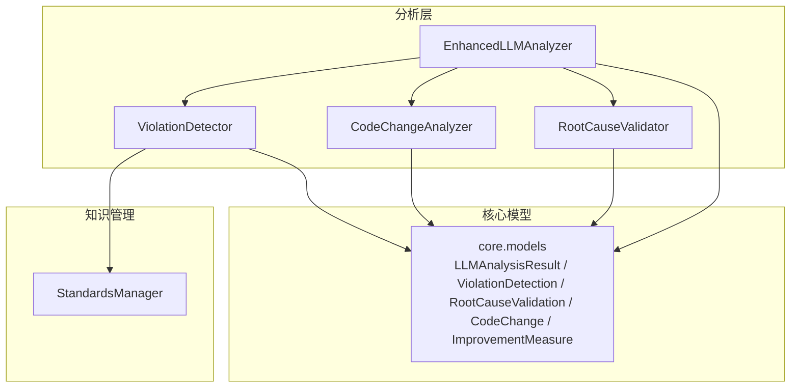
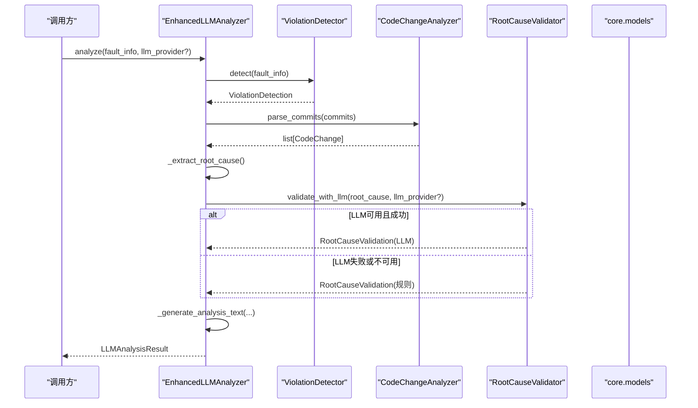
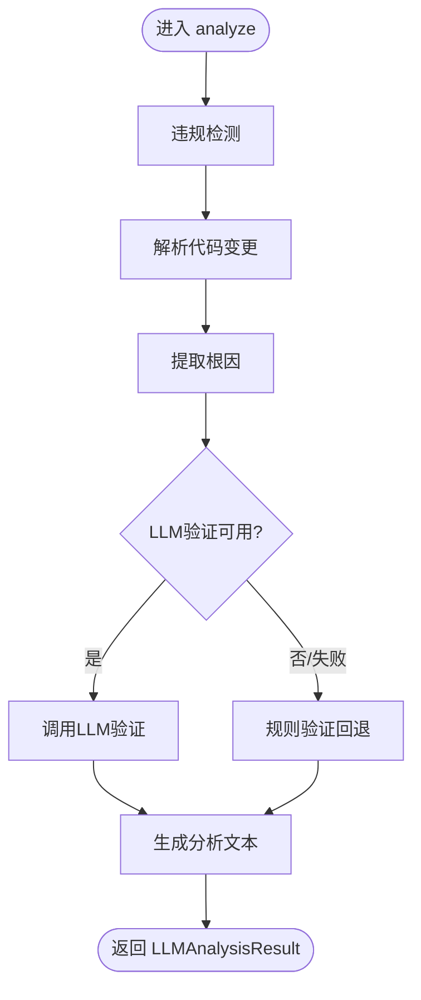
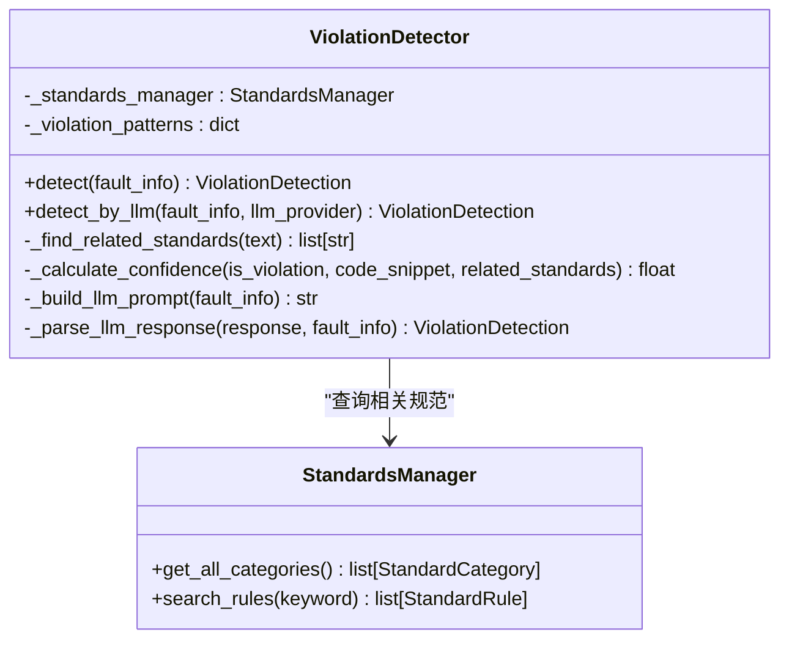
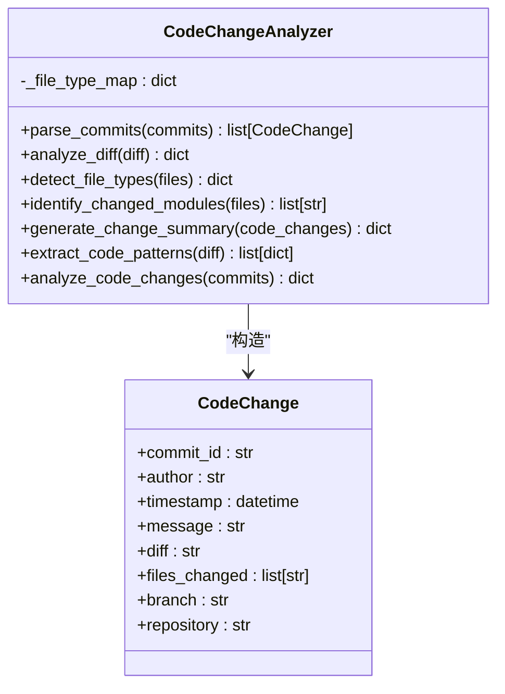
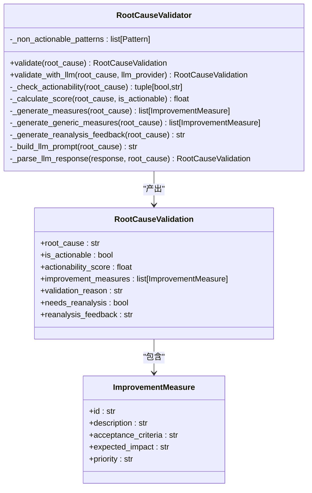
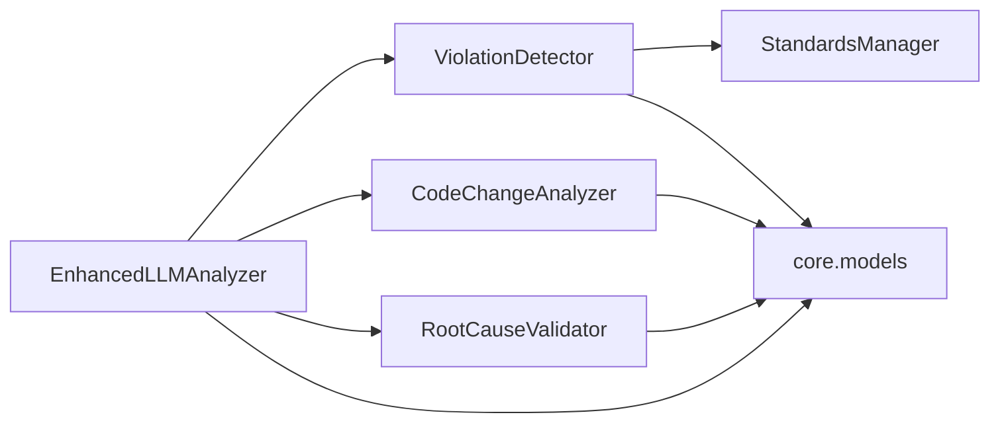

# 增强LLM分析器

<cite>
**本文引用的文件列表**
- [enhanced_llm_analyzer.py](file://src/analysis/enhanced_llm_analyzer.py)
- [violation_detector.py](file://src/analysis/violation_detector.py)
- [code_change_analyzer.py](file://src/analysis/code_change_analyzer.py)
- [root_cause_validator.py](file://src/analysis/root_cause_validator.py)
- [models.py](file://src/core/models.py)
- [manager.py](file://src/knowledge/manager.py)
- [test_enhanced_llm_analyzer.py](file://tests/analysis/test_enhanced_llm_analyzer.py)
- [config.yaml.example](file://config/config.yaml.example)
</cite>

## 目录
1. [简介](#简介)
2. [项目结构](#项目结构)
3. [核心组件](#核心组件)
4. [架构总览](#架构总览)
5. [详细组件分析](#详细组件分析)
6. [依赖关系分析](#依赖关系分析)
7. [性能考虑](#性能考虑)
8. [故障排查指南](#故障排查指南)
9. [结论](#结论)
10. [附录：使用示例与最佳实践](#附录使用示例与最佳实践)

## 简介
本技术文档聚焦于增强LLM分析器的设计与实现，围绕 EnhancedLLMAnalyzer 类展开，系统阐述其违规检测、代码变更分析、根因验证与改进措施生成的完整流程。文档同时覆盖 analyze 方法的执行步骤、错误处理机制、与子模块（ViolationDetector、CodeChangeAnalyzer、RootCauseValidator）的集成方式，并提供批量分析的实现说明、异常恢复策略与降级机制、性能优化建议与最佳实践。

## 项目结构
增强LLM分析器位于 src/analysis 目录下，核心由以下文件组成：
- enhanced_llm_analyzer.py：编排整体分析流程，协调各子模块
- violation_detector.py：基于规则与可选LLM的违规检测
- code_change_analyzer.py：解析commit/diff并提取关键信息
- root_cause_validator.py：根因可落地性验证与改进措施生成
- core/models.py：共享数据模型（如 LLMAnalysisResult、ViolationDetection、RootCauseValidation、CodeChange、ImprovementMeasure 等）
- knowledge/manager.py：规范知识库管理，支撑违规检测的相关规范匹配

图表来源
- [enhanced_llm_analyzer.py:1-206](file://src/analysis/enhanced_llm_analyzer.py#L1-L206)
- [violation_detector.py:1-219](file://src/analysis/violation_detector.py#L1-L219)
- [code_change_analyzer.py:1-286](file://src/analysis/code_change_analyzer.py#L1-L286)
- [root_cause_validator.py:1-368](file://src/analysis/root_cause_validator.py#L1-L368)
- [models.py:302-379](file://src/core/models.py#L302-L379)
- [manager.py:1-118](file://src/knowledge/manager.py#L1-L118)

章节来源
- [enhanced_llm_analyzer.py:1-206](file://src/analysis/enhanced_llm_analyzer.py#L1-L206)
- [models.py:302-379](file://src/core/models.py#L302-L379)
- [manager.py:1-118](file://src/knowledge/manager.py#L1-L118)

## 核心组件
- EnhancedLLMAnalyzer：统一入口，负责串联违规检测、代码变更分析、根因提取、根因验证与文本汇总输出；提供单条与批量分析方法。
- ViolationDetector：基于正则模式库与可选LLM进行违规检测，结合规范知识库计算置信度与相关规范引用。
- CodeChangeAnalyzer：解析commits与diff，统计变更规模、识别文件类型与模块、提取代码模式。
- RootCauseValidator：判定根因是否“可落地”，生成评分、改进措施与重新分析反馈；支持LLM深度验证与回退。
- StandardsManager：加载与管理研发规范，为违规检测提供上下文与相关规范匹配。
- 核心模型：定义分析结果、违规检测、根因验证、代码变更、改进措施等数据结构。

章节来源
- [enhanced_llm_analyzer.py:23-74](file://src/analysis/enhanced_llm_analyzer.py#L23-L74)
- [violation_detector.py:55-104](file://src/analysis/violation_detector.py#L55-L104)
- [code_change_analyzer.py:68-112](file://src/analysis/code_change_analyzer.py#L68-L112)
- [root_cause_validator.py:139-187](file://src/analysis/root_cause_validator.py#L139-L187)
- [manager.py:13-78](file://src/knowledge/manager.py#L13-L78)
- [models.py:329-379](file://src/core/models.py#L329-L379)

## 架构总览
增强LLM分析器采用“编排器+专业子模块”的分层设计。EnhancedLLMAnalyzer作为编排器，按顺序调用违规检测、代码变更分析、根因提取、根因验证与文本生成，最终组装成统一的 LLMAnalysisResult。

图表来源
- [enhanced_llm_analyzer.py:32-74](file://src/analysis/enhanced_llm_analyzer.py#L32-L74)
- [enhanced_llm_analyzer.py:108-120](file://src/analysis/enhanced_llm_analyzer.py#L108-L120)
- [root_cause_validator.py:289-306](file://src/analysis/root_cause_validator.py#L289-L306)
- [models.py:370-379](file://src/core/models.py#L370-L379)

## 详细组件分析

### EnhancedLLMAnalyzer 类
职责与流程
- 初始化时注入 StandardsManager，并创建三个子模块实例：ViolationDetector、RootCauseValidator、CodeChangeAnalyzer。
- analyze 方法执行五步流程：
  1) 违规检测：调用 ViolationDetector.detect
  2) 获取代码变更：从 fault_info.development.commits 解析为 CodeChange 列表
  3) 根因提取：优先取 root_cause，否则回退到 description/title
  4) 根因验证：优先尝试 LLM 验证，失败则回退到规则验证
  5) 生成分析文本：汇总违规、根因、验证结果与改进措施
- analyze_batch 对多个故障逐一分析，捕获异常并返回包含错误信息的占位结果，确保批处理稳定性。

错误处理与降级
- 根因验证阶段若 LLM 调用失败，记录警告日志并回退到规则验证，保证可用性。
- 批量分析中每个任务独立 try-except，单个失败不影响其他任务，返回带错误信息的 LLMAnalysisResult。

图表来源
- [enhanced_llm_analyzer.py:32-74](file://src/analysis/enhanced_llm_analyzer.py#L32-L74)
- [enhanced_llm_analyzer.py:108-120](file://src/analysis/enhanced_llm_analyzer.py#L108-L120)
- [enhanced_llm_analyzer.py:172-205](file://src/analysis/enhanced_llm_analyzer.py#L172-L205)

章节来源
- [enhanced_llm_analyzer.py:23-74](file://src/analysis/enhanced_llm_analyzer.py#L23-L74)
- [enhanced_llm_analyzer.py:76-170](file://src/analysis/enhanced_llm_analyzer.py#L76-L170)
- [enhanced_llm_analyzer.py:172-205](file://src/analysis/enhanced_llm_analyzer.py#L172-L205)

### ViolationDetector 类
功能要点
- 内置多种违规模式（空catch、数据库连接泄漏、非线程安全集合、System.out、SQL注入、索引列函数等），通过正则匹配代码片段。
- 结合 StandardsManager 查找相关规范，计算置信度（考虑是否有违规、代码长度、相关规范数量）。
- 支持 LLM 深度检测：构建提示词，解析JSON响应；失败时回退到规则检测。

复杂度与性能
- 主要开销在正则匹配与规范检索，时间复杂度近似 O(P*C + S*R)，其中 P 为模式数，C 为代码片段长度，S 为标准类别数，R 为每类规则数。
- 可通过限制匹配的类别与规则数量、缓存相关标准来优化。

图表来源
- [violation_detector.py:55-104](file://src/analysis/violation_detector.py#L55-L104)
- [violation_detector.py:144-218](file://src/analysis/violation_detector.py#L144-L218)
- [manager.py:76-95](file://src/knowledge/manager.py#L76-L95)

章节来源
- [violation_detector.py:15-52](file://src/analysis/violation_detector.py#L15-L52)
- [violation_detector.py:55-104](file://src/analysis/violation_detector.py#L55-L104)
- [violation_detector.py:144-218](file://src/analysis/violation_detector.py#L144-L218)

### CodeChangeAnalyzer 类
功能要点
- parse_commits：将 commits 列表转换为 CodeChange 对象，兼容不同时间戳格式，异常时跳过并记录警告。
- analyze_diff：统计新增/删除行数、新增/修改文件数。
- identify_changed_modules：根据路径推断模块名（如 src/xxx）。
- generate_change_summary：汇总提交总数、变更文件数、作者、模块、文件类型分布。
- extract_code_patterns：在 diff 中匹配常见代码模式（数据库连接、异常处理、空值检查、并发、SQL注入等）。
- analyze_code_changes：综合上述能力，输出变更详情、摘要、diff统计与检测到的模式。

图表来源
- [code_change_analyzer.py:68-112](file://src/analysis/code_change_analyzer.py#L68-L112)
- [code_change_analyzer.py:114-148](file://src/analysis/code_change_analyzer.py#L114-L148)
- [code_change_analyzer.py:167-184](file://src/analysis/code_change_analyzer.py#L167-L184)
- [code_change_analyzer.py:186-224](file://src/analysis/code_change_analyzer.py#L186-L224)
- [code_change_analyzer.py:226-249](file://src/analysis/code_change_analyzer.py#L226-L249)
- [code_change_analyzer.py:251-286](file://src/analysis/code_change_analyzer.py#L251-L286)
- [models.py:302-313](file://src/core/models.py#L302-L313)

章节来源
- [code_change_analyzer.py:68-112](file://src/analysis/code_change_analyzer.py#L68-L112)
- [code_change_analyzer.py:114-148](file://src/analysis/code_change_analyzer.py#L114-L148)
- [code_change_analyzer.py:186-224](file://src/analysis/code_change_analyzer.py#L186-L224)
- [code_change_analyzer.py:251-286](file://src/analysis/code_change_analyzer.py#L251-L286)

### RootCauseValidator 类
功能要点
- validate：判断根因是否可落地，计算 actionability_score，生成改进措施与重新分析反馈。
- 不可落地模式：过于笼统、经验不足、未找到根本原因等；可落地关键词分为高/中/低优先级。
- 模板化改进措施：针对数据库连接、空指针、SQL注入、并发、资源泄漏等场景提供具体改进项。
- validate_with_llm：使用LLM进行深度验证，失败回退到规则验证。

图表来源
- [root_cause_validator.py:139-187](file://src/analysis/root_cause_validator.py#L139-L187)
- [root_cause_validator.py:235-277](file://src/analysis/root_cause_validator.py#L235-L277)
- [root_cause_validator.py:289-306](file://src/analysis/root_cause_validator.py#L289-L306)
- [models.py:329-363](file://src/core/models.py#L329-L363)

章节来源
- [root_cause_validator.py:15-53](file://src/analysis/root_cause_validator.py#L15-L53)
- [root_cause_validator.py:139-187](file://src/analysis/root_cause_validator.py#L139-L187)
- [root_cause_validator.py:235-277](file://src/analysis/root_cause_validator.py#L235-L277)
- [root_cause_validator.py:289-306](file://src/analysis/root_cause_validator.py#L289-L306)

### 核心数据模型（core.models）
- LLMAnalysisResult：聚合 task_id、违规检测结果、根因、根因验证、代码变更与分析文本。
- ViolationDetection：是否违规、违规类型/类别、违反规则、证据、置信度、相关规范。
- RootCauseValidation：根因描述、是否可落地、评分、改进措施、验证理由、是否需要重新分析与反馈。
- CodeChange：commit级别变更（含diff）、作者、时间、分支、仓库等。
- ImprovementMeasure：改进措施ID、描述、验收标准、预期影响、优先级。

章节来源
- [models.py:302-379](file://src/core/models.py#L302-L379)

## 依赖关系分析
- EnhancedLLMAnalyzer 依赖：
  - ViolationDetector：用于违规检测
  - CodeChangeAnalyzer：用于解析代码变更
  - RootCauseValidator：用于根因验证与改进措施生成
  - StandardsManager：被 ViolationDetector 使用以匹配相关规范
  - core.models：所有结构化结果的载体

图表来源
- [enhanced_llm_analyzer.py:23-31](file://src/analysis/enhanced_llm_analyzer.py#L23-L31)
- [violation_detector.py:55-60](file://src/analysis/violation_detector.py#L55-L60)
- [manager.py:13-20](file://src/knowledge/manager.py#L13-L20)
- [models.py:302-379](file://src/core/models.py#L302-L379)

章节来源
- [enhanced_llm_analyzer.py:23-31](file://src/analysis/enhanced_llm_analyzer.py#L23-L31)
- [violation_detector.py:55-60](file://src/analysis/violation_detector.py#L55-L60)
- [manager.py:13-20](file://src/knowledge/manager.py#L13-L20)
- [models.py:302-379](file://src/core/models.py#L302-L379)

## 性能考虑
- 正则匹配优化：
  - 预编译正则表达式（ViolationDetector 与 RootCauseValidator 内部已部分使用 compiled patterns），减少重复编译开销。
  - 控制匹配范围，仅对必要字段（如 code_snippet、diff）进行匹配。
- 规范检索优化：
  - 使用 StandardsManager 的规则索引快速定位相关规则，避免全量扫描。
  - 限制返回的相关规范数量（例如前5条），降低后续处理成本。
- 代码变更分析：
  - 仅在存在 commits 时执行解析，避免无意义计算。
  - 对大段 diff 进行增量统计，避免多次遍历。
- LLM调用：
  - 设置合理的超时与重试策略（参考配置示例），并在失败时回退到规则验证，保障稳定性。
  - 批量分析时可采用并发策略（上层流水线已支持异步批量），但需控制并发度以避免外部服务限流。

[本节为通用性能指导，不直接分析具体文件]

## 故障排查指南
- LLM验证失败：
  - 现象：根因验证阶段抛出异常或返回错误。
  - 处理：系统记录警告日志并回退到规则验证，确保流程继续。
  - 建议：检查LLM提供商配置（API Key、Base URL、模型参数），确认网络连通性与配额。
- 违规检测误报/漏报：
  - 现象：某些代码未被检测到或正常代码被标记为违规。
  - 处理：调整 VIOLATION_PATTERNS 中的正则表达式，增加边界条件；必要时启用 LLM 深度检测。
- 代码变更解析失败：
  - 现象：parse_commits 抛出异常或时间戳解析失败。
  - 处理：系统记录警告并跳过该 commit；检查输入数据格式是否符合预期。
- 根因不可落地：
  - 现象：needs_reanalysis=True，actionability_score较低。
  - 处理：根据 reanalysis_feedback 补充更具体的技术问题、代码位置与规范条款。

章节来源
- [enhanced_llm_analyzer.py:108-120](file://src/analysis/enhanced_llm_analyzer.py#L108-L120)
- [root_cause_validator.py:279-287](file://src/analysis/root_cause_validator.py#L279-L287)
- [code_change_analyzer.py:108-112](file://src/analysis/code_change_analyzer.py#L108-L112)

## 结论
增强LLM分析器通过清晰的编排与模块化设计，实现了从违规检测、代码变更分析到根因验证与改进措施生成的端到端流程。系统在LLM不可用时具备稳健的降级机制，在批量分析中具备异常隔离能力，适合在生产环境中稳定运行。配合规范知识库与规则引擎，可在保证准确性的同时提升效率。

[本节为总结性内容，不直接分析具体文件]

## 附录：使用示例与最佳实践

### 基本用法（单条分析）
- 初始化增强分析器：传入 StandardsManager 实例。
- 准备 fault_info 字典，包含 task_id、title、description、code_snippet、development.commits 等字段。
- 调用 analyze(fault_info, llm_provider=None|Provider) 获取 LLMAnalysisResult。
- 如需启用LLM深度验证，传入 llm_provider 实例。

章节来源
- [enhanced_llm_analyzer.py:23-74](file://src/analysis/enhanced_llm_analyzer.py#L23-L74)
- [test_enhanced_llm_analyzer.py:12-34](file://tests/analysis/test_enhanced_llm_analyzer.py#L12-L34)

### 批量分析
- 准备 fault_infos 列表，每项为一个 fault_info 字典。
- 调用 analyze_batch(fault_infos, llm_provider=None|Provider)。
- 单个任务失败不会影响其他任务，返回的结果中包含错误信息以便后续处理。

章节来源
- [enhanced_llm_analyzer.py:172-205](file://src/analysis/enhanced_llm_analyzer.py#L172-L205)

### 配置与LLM提供商
- 配置文件示例包含 llm、embedding、clustering、cache、rules、output、logging 等选项。
- 可根据需要设置 provider、model、temperature、max_tokens 等参数。
- 建议在测试环境先关闭LLM或使用mock，逐步切换到真实LLM。

章节来源
- [config.yaml.example:1-38](file://config/config.yaml.example#L1-L38)

### 最佳实践
- 数据质量：确保 fault_info 字段完整，尤其是 development.commits 与 code_snippet。
- 规则维护：定期更新 VIOLATION_PATTERNS 与 MEASURE_TEMPLATES，贴合业务实际。
- 性能调优：限制相关规范数量、控制并发度、缓存常用结果。
- 监控与日志：记录关键步骤与异常，便于问题定位与持续改进。

[本节为通用实践指导，不直接分析具体文件]
