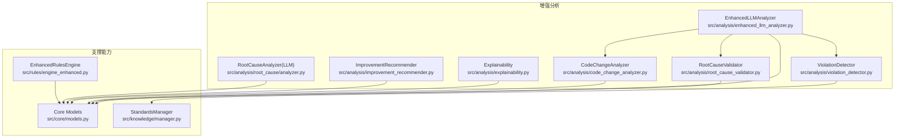
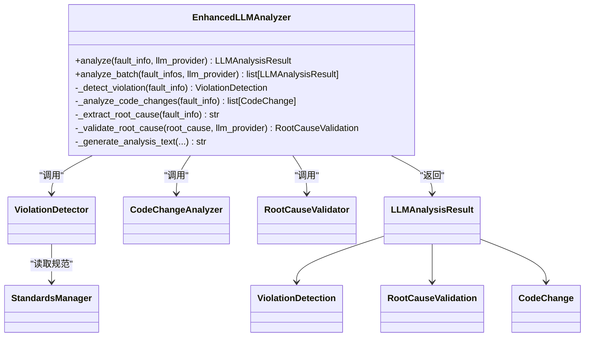
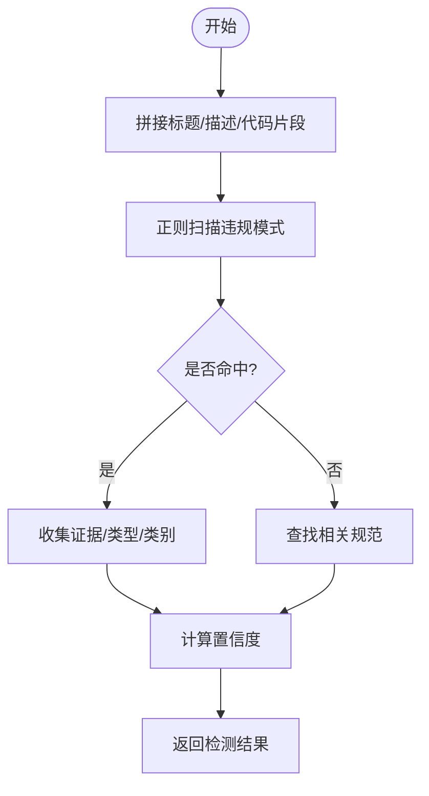
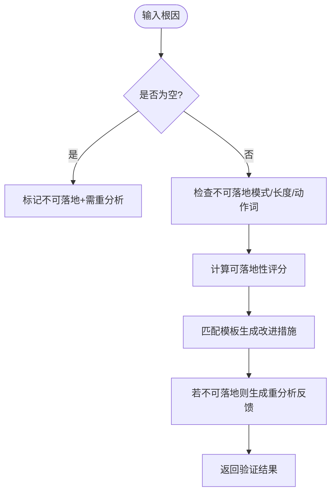
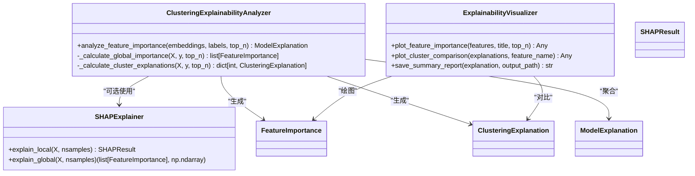
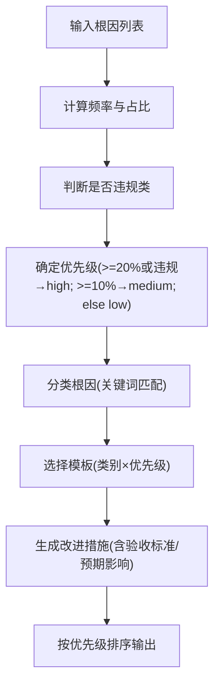

# 增强分析功能

<cite>
**本文引用的文件**   
- [enhanced_llm_analyzer.py](file://src/analysis/enhanced_llm_analyzer.py)
- [explainability.py](file://src/analysis/explainability.py)
- [improvement_recommender.py](file://src/analysis/improvement_recommender.py)
- [root_cause_validator.py](file://src/analysis/root_cause_validator.py)
- [violation_detector.py](file://src/analysis/violation_detector.py)
- [code_change_analyzer.py](file://src/analysis/code_change_analyzer.py)
- [analyzer.py](file://src/analysis/root_cause/analyzer.py)
- [manager.py](file://src/knowledge/manager.py)
- [engine_enhanced.py](file://src/rules/engine_enhanced.py)
- [models.py](file://src/core/models.py)
- [test_enhanced_llm_analyzer.py](file://tests/analysis/test_enhanced_llm_analyzer.py)
- [test_explainability.py](file://tests/analysis/test_explainability.py)
- [test_improvement_recommender.py](file://tests/analysis/test_improvement_recommender.py)
</cite>

## 目录
1. [引言](#引言)
2. [项目结构](#项目结构)
3. [核心组件](#核心组件)
4. [架构总览](#架构总览)
5. [详细组件分析](#详细组件分析)
6. [依赖关系分析](#依赖关系分析)
7. [性能与优化](#性能与优化)
8. [故障恢复与降级策略](#故障恢复与降级策略)
9. [使用示例与集成方式](#使用示例与集成方式)
10. [结论](#结论)

## 引言
本技术文档聚焦“增强分析功能模块”，围绕以下目标展开：
- 深入解释增强LLM分析器的实现原理，包括上下文管理、多轮对话与历史记录维护（在现有代码中的体现与扩展建议）。
- 详细说明可解释性分析模块，涵盖分析过程透明度、置信度评估与决策依据追溯。
- 文档化改进建议推荐系统的算法实现，包括相似案例匹配思路、最佳实践库与个性化推荐策略。
- 提供具体代码示例路径，展示如何启用增强功能、自定义分析规则与配置推荐策略。
- 解释与主分析流程的集成方式与性能优化技巧。
- 包含错误恢复机制与降级策略。

## 项目结构
增强分析相关代码主要位于 src/analysis 下，并与 core 模型、knowledge 规范知识库、rules 规则引擎等模块协作。测试用例位于 tests/analysis 下，覆盖关键行为验证。



图表来源
- [enhanced_llm_analyzer.py:1-206](file://src/analysis/enhanced_llm_analyzer.py#L1-L206)
- [violation_detector.py:1-219](file://src/analysis/violation_detector.py#L1-L219)
- [root_cause_validator.py:1-368](file://src/analysis/root_cause_validator.py#L1-L368)
- [code_change_analyzer.py:1-286](file://src/analysis/code_change_analyzer.py#L1-L286)
- [explainability.py:1-563](file://src/analysis/explainability.py#L1-L563)
- [improvement_recommender.py:1-300](file://src/analysis/improvement_recommender.py#L1-L300)
- [analyzer.py:1-131](file://src/analysis/root_cause/analyzer.py#L1-L131)
- [manager.py:1-118](file://src/knowledge/manager.py#L1-L118)
- [engine_enhanced.py:1-388](file://src/rules/engine_enhanced.py#L1-L388)
- [models.py:1-426](file://src/core/models.py#L1-L426)

章节来源
- [enhanced_llm_analyzer.py:1-206](file://src/analysis/enhanced_llm_analyzer.py#L1-L206)
- [models.py:1-426](file://src/core/models.py#L1-L426)

## 核心组件
- 增强LLM分析器：编排违规检测、代码变更解析、根因提取与落地性验证，输出统一分析结果。
- 违规检测器：基于正则模式与规范知识库进行违规识别与置信度计算。
- 根因验证器：判定根因是否可落地，生成改进措施并给出重新分析反馈。
- 代码变更分析器：解析提交记录与diff，统计变更规模、文件类型与模块范围。
- 可解释性分析器：提供全局与局部特征重要性、SHAP分析与可视化报告。
- 改进措施推荐器：按根因频率与类别模板生成优先级排序的改进建议。
- 根因分析服务（LLM）：构建提示词调用LLM，返回结构化根因与改进项。
- 规范知识库管理器：加载标准规则，支持检索与分类查询。
- 增强规则引擎：内置与自定义规则热重载、条件评估与评分体系。

章节来源
- [enhanced_llm_analyzer.py:23-74](file://src/analysis/enhanced_llm_analyzer.py#L23-L74)
- [violation_detector.py:55-104](file://src/analysis/violation_detector.py#L55-L104)
- [root_cause_validator.py:139-187](file://src/analysis/root_cause_validator.py#L139-L187)
- [code_change_analyzer.py:68-112](file://src/analysis/code_change_analyzer.py#L68-L112)
- [explainability.py:208-250](file://src/analysis/explainability.py#L208-L250)
- [improvement_recommender.py:37-118](file://src/analysis/improvement_recommender.py#L37-L118)
- [analyzer.py:44-116](file://src/analysis/root_cause/analyzer.py#L44-L116)
- [manager.py:13-70](file://src/knowledge/manager.py#L13-L70)
- [engine_enhanced.py:22-118](file://src/rules/engine_enhanced.py#L22-L118)

## 架构总览
增强分析以“编排器”为中心，串联多个专用分析器，结合规范知识库与规则引擎，最终产出可执行、可解释、可落地的分析报告。

```mermaid
sequenceDiagram
participant Caller as "调用方"
participant E as "EnhancedLLMAnalyzer"
participant V as "ViolationDetector"
participant K as "StandardsManager"
participant C as "CodeChangeAnalyzer"
participant R as "RootCauseValidator"
participant L as "LLM Provider(可选)"
participant M as "Core Models"
Caller->>E : analyze(fault_info, llm_provider?)
E->>V : detect(fault_info)
V->>K : get_all_categories()
K-->>V : categories
V-->>E : ViolationDetection
E->>C : parse_commits(commits)
C-->>E : list[CodeChange]
E->>E : _extract_root_cause()
alt 提供LLM
E->>R : validate_with_llm(root_cause, llm_provider)
R->>L : generate(prompt)
L-->>R : JSON响应
R-->>E : RootCauseValidation
else 无LLM
E->>R : validate(root_cause)
R-->>E : RootCauseValidation
end
E->>E : _generate_analysis_text(...)
E-->>Caller : LLMAnalysisResult
```



图表来源
- [enhanced_llm_analyzer.py:32-74](file://src/analysis/enhanced_llm_analyzer.py#L32-L74)
- [violation_detector.py:62-104](file://src/analysis/violation_detector.py#L62-L104)
- [manager.py:76-95](file://src/knowledge/manager.py#L76-L95)
- [code_change_analyzer.py:74-112](file://src/analysis/code_change_analyzer.py#L74-L112)
- [root_cause_validator.py:147-187](file://src/analysis/root_cause_validator.py#L147-L187)
- [models.py:370-379](file://src/core/models.py#L370-L379)

## 详细组件分析

### 增强LLM分析器（EnhancedLLMAnalyzer）
职责与流程
- 编排步骤：违规检测 → 代码变更解析 → 根因提取 → 根因落地性验证 → 生成完整分析文本。
- 批量分析：对列表逐项处理，异常时回退为最小可用结果，保证整体稳定性。
- 上下文管理：当前实现以单任务字典 fault_info 作为上下文；如需多轮对话与历史维护，可在外层封装会话状态机，将历史摘要与最新输入组合后传入各子分析器。

关键方法
- analyze：主入口，协调各子模块并组装结果。
- analyze_batch：批量处理，异常隔离。
- _detect_violation / _analyze_code_changes / _extract_root_cause / _validate_root_cause / _generate_analysis_text：分步逻辑。

数据流与模型
- 输入：fault_info（含 task_id/title/description/code_snippet/development.commits 等）
- 输出：LLMAnalysisResult（含 violation_detection、root_cause、root_cause_validation、code_changes、analysis_text）



图表来源
- [enhanced_llm_analyzer.py:23-74](file://src/analysis/enhanced_llm_analyzer.py#L23-L74)
- [models.py:370-379](file://src/core/models.py#L370-L379)

章节来源
- [enhanced_llm_analyzer.py:32-74](file://src/analysis/enhanced_llm_analyzer.py#L32-L74)
- [enhanced_llm_analyzer.py:172-206](file://src/analysis/enhanced_llm_analyzer.py#L172-L206)
- [models.py:370-379](file://src/core/models.py#L370-L379)

### 违规检测器（ViolationDetector）
- 基于预定义正则模式扫描 code_snippet，并结合规范知识库匹配相关规则ID。
- 置信度计算考虑代码片段长度、相关规范数量等信号。
- 支持LLM深度检测：失败时回退到规则检测。



图表来源
- [violation_detector.py:62-104](file://src/analysis/violation_detector.py#L62-L104)
- [violation_detector.py:122-142](file://src/analysis/violation_detector.py#L122-L142)

章节来源
- [violation_detector.py:55-104](file://src/analysis/violation_detector.py#L55-L104)
- [violation_detector.py:122-142](file://src/analysis/violation_detector.py#L122-L142)

### 根因验证器（RootCauseValidator）
- 不可落地模式识别：过滤过于笼统或抽象的描述。
- 可落地关键词打分：高/中/低动作词加权，结合长度与领域术语加分。
- 改进措施模板：针对数据库连接、空指针、SQL注入、并发、资源泄漏等场景生成具体措施。
- LLM增强验证：失败自动回退到规则验证。



图表来源
- [root_cause_validator.py:147-187](file://src/analysis/root_cause_validator.py#L147-L187)
- [root_cause_validator.py:235-263](file://src/analysis/root_cause_validator.py#L235-L263)

章节来源
- [root_cause_validator.py:139-187](file://src/analysis/root_cause_validator.py#L139-L187)
- [root_cause_validator.py:289-367](file://src/analysis/root_cause_validator.py#L289-L367)

### 代码变更分析器（CodeChangeAnalyzer）
- 解析 commits：时间戳规范化、字段映射、异常容错。
- Diff 统计：增删行数、新增/修改文件数。
- 文件类型识别与模块定位：根据路径推断语言与模块。
- 变更摘要：作者、模块、文件类型分布、总体统计。

章节来源
- [code_change_analyzer.py:74-112](file://src/analysis/code_change_analyzer.py#L74-L112)
- [code_change_analyzer.py:114-148](file://src/analysis/code_change_analyzer.py#L114-L148)
- [code_change_analyzer.py:186-224](file://src/analysis/code_change_analyzer.py#L186-L224)

### 可解释性分析模块（Explainability）
- SHAPExplainer：封装 KernelExplainer，支持本地与全局解释，计算特征重要性均值与方差。
- ClusteringExplainabilityAnalyzer：基于嵌入向量与标签计算全局与聚类级特征重要性，选择代表性样本，生成自然语言解释。
- ExplainabilityVisualizer：绘制特征重要性图、跨聚类比较图，导出HTML摘要报告。



图表来源
- [explainability.py:71-172](file://src/analysis/explainability.py#L71-L172)
- [explainability.py:208-250](file://src/analysis/explainability.py#L208-L250)
- [explainability.py:380-503](file://src/analysis/explainability.py#L380-L503)

章节来源
- [explainability.py:208-250](file://src/analysis/explainability.py#L208-L250)
- [explainability.py:380-503](file://src/analysis/explainability.py#L380-L503)

### 改进措施推荐器（ImprovementRecommender）
- 频率统计：按根因出现次数与占比排序。
- 分类与模板：按关键词归类（违规/需求/设计/代码/测试/运维），匹配高/中/低优先级模板。
- 输出：按优先级排序的改进措施列表，支持筛选与报告生成。



图表来源
- [improvement_recommender.py:119-155](file://src/analysis/improvement_recommender.py#L119-L155)
- [improvement_recommender.py:187-217](file://src/analysis/improvement_recommender.py#L187-L217)
- [improvement_recommender.py:219-243](file://src/analysis/improvement_recommender.py#L219-L243)

章节来源
- [improvement_recommender.py:37-118](file://src/analysis/improvement_recommender.py#L37-L118)
- [improvement_recommender.py:157-186](file://src/analysis/improvement_recommender.py#L157-L186)

### 根因分析服务（RootCauseAnalyzer，LLM）
- 构建提示词：整合任务信息与已有复盘结论。
- 异步调用LLM，解析JSON响应，转换为结构化对象。
- 同步包装：通过 asyncio.run 暴露同步接口。

章节来源
- [analyzer.py:44-116](file://src/analysis/root_cause/analyzer.py#L44-L116)

### 规范知识库管理器（StandardsManager）
- 从 data/standards/mock/*.json 加载规范类别与规则。
- 提供按类别、级别、子类别检索与关键字搜索。

章节来源
- [manager.py:13-70](file://src/knowledge/manager.py#L13-L70)
- [manager.py:76-118](file://src/knowledge/manager.py#L76-L118)

### 增强规则引擎（EnhancedRulesEngine）
- 内置规则加载与自定义规则热重载（watchdog）。
- 高级模式条件评估（AND/OR）、权重与严重级别综合评分。
- 兼容旧接口 check()，返回 RuleViolation 列表。

章节来源
- [engine_enhanced.py:22-118](file://src/rules/engine_enhanced.py#L22-L118)
- [engine_enhanced.py:131-173](file://src/rules/engine_enhanced.py#L131-L173)
- [engine_enhanced.py:335-373](file://src/rules/engine_enhanced.py#L335-L373)

## 依赖关系分析
- 内聚与耦合
  - EnhancedLLMAnalyzer 高度内聚于分析编排，依赖三个独立分析器，耦合清晰。
  - ViolationDetector 依赖 StandardsManager，解耦良好。
  - RootCauseValidator 与 ImprovementRecommender 均依赖 Core Models，便于统一序列化与校验。
- 外部依赖
  - SHAP/Plotly 为可选依赖，未安装时优雅降级。
  - watchdog 用于规则热重载，非必需。
- 循环依赖
  - 未发现直接循环导入；类型检查中使用 TYPE_CHECKING 避免运行时依赖。

```mermaid
graph LR
E["EnhancedLLMAnalyzer"] --> V["ViolationDetector"]
E --> R["RootCauseValidator"]
E --> C["CodeChangeAnalyzer"]
V --> K["StandardsManager"]
R --> M["Core Models"]
C --> M
E --> M
I["ImprovementRecommender"] --> M
X["Explainability"] --> M
A["RootCauseAnalyzer(LLM)] --> M
```

图表来源
- [enhanced_llm_analyzer.py:1-206](file://src/analysis/enhanced_llm_analyzer.py#L1-L206)
- [models.py:1-426](file://src/core/models.py#L1-L426)

章节来源
- [enhanced_llm_analyzer.py:1-206](file://src/analysis/enhanced_llm_analyzer.py#L1-L206)
- [models.py:1-426](file://src/core/models.py#L1-L426)

## 性能与优化
- 批处理与异常隔离：analyze_batch 捕获单个任务异常，不影响整体进度。
- 可选重型依赖：SHAP/Plotly 按需引入，缺失时跳过可视化与SHAP计算。
- 规则热重载：EnhancedRulesEngine 使用线程锁保护重载，避免竞态。
- 正则与字符串操作：ViolationDetector 与 CodeChangeAnalyzer 使用高效正则与集合去重，减少重复计算。
- 建议
  - 对大规模 commit diff 分析可引入增量解析与缓存。
  - 对 SHAP 全局解释可按批次采样控制开销。
  - 对 LLM 调用增加超时与重试退避策略。

[本节为通用指导，不直接分析具体文件]

## 故障恢复与降级策略
- LLM 调用失败
  - RootCauseValidator.validate_with_llm 捕获异常后回退到规则验证。
  - ViolationDetector.detect_by_llm 捕获异常后回退到规则检测。
- 数据不完整
  - CodeChangeAnalyzer.parse_commits 对时间戳与字段异常做容错，继续处理其余条目。
  - EnhancedLLMAnalyzer.analyze_batch 对单个任务异常构造最小可用结果。
- 可视化缺失
  - ExplainabilityVisualizer 在 Plotly 未安装时返回 None 并记录警告。

章节来源
- [root_cause_validator.py:289-367](file://src/analysis/root_cause_validator.py#L289-L367)
- [violation_detector.py:144-161](file://src/analysis/violation_detector.py#L144-L161)
- [code_change_analyzer.py:84-112](file://src/analysis/code_change_analyzer.py#L84-L112)
- [enhanced_llm_analyzer.py:172-206](file://src/analysis/enhanced_llm_analyzer.py#L172-L206)
- [explainability.py:380-406](file://src/analysis/explainability.py#L380-L406)

## 使用示例与集成方式
以下为可直接运行的测试用例路径，展示如何启用增强功能、自定义规则与配置推荐策略：

- 启用增强分析（含LLM与非LLM两种模式）
  - [tests/analysis/test_enhanced_llm_analyzer.py:12-34](file://tests/analysis/test_enhanced_llm_analyzer.py#L12-L34)
  - [tests/analysis/test_enhanced_llm_analyzer.py:35-70](file://tests/analysis/test_enhanced_llm_analyzer.py#L35-L70)
  - [tests/analysis/test_enhanced_llm_analyzer.py:72-101](file://tests/analysis/test_enhanced_llm_analyzer.py#L72-L101)

- 可解释性分析（特征重要性、可视化、报告导出）
  - [tests/analysis/test_explainability.py:144-183](file://tests/analysis/test_explainability.py#L144-L183)
  - [tests/analysis/test_explainability.py:256-336](file://tests/analysis/test_explainability.py#L256-L336)

- 改进措施推荐（频率统计、模板匹配、报告生成）
  - [tests/analysis/test_improvement_recommender.py:36-108](file://tests/analysis/test_improvement_recommender.py#L36-L108)
  - [tests/analysis/test_improvement_recommender.py:151-176](file://tests/analysis/test_improvement_recommender.py#L151-L176)

- 自定义分析规则（增强规则引擎）
  - 加载内置与自定义规则、热重载与评估：
    - [engine_enhanced.py:52-118](file://src/rules/engine_enhanced.py#L52-L118)
    - [engine_enhanced.py:131-173](file://src/rules/engine_enhanced.py#L131-L173)

- 与主分析流程集成
  - 通过 EnhancedLLMAnalyzer.analyze 统一入口，内部依次调用违规检测、代码变更分析、根因验证与文本生成。
  - 参考：
    - [enhanced_llm_analyzer.py:32-74](file://src/analysis/enhanced_llm_analyzer.py#L32-L74)
    - [enhanced_llm_analyzer.py:122-170](file://src/analysis/enhanced_llm_analyzer.py#L122-L170)

章节来源
- [test_enhanced_llm_analyzer.py:12-101](file://tests/analysis/test_enhanced_llm_analyzer.py#L12-L101)
- [test_explainability.py:144-336](file://tests/analysis/test_explainability.py#L144-L336)
- [test_improvement_recommender.py:36-176](file://tests/analysis/test_improvement_recommender.py#L36-L176)
- [engine_enhanced.py:52-173](file://src/rules/engine_enhanced.py#L52-L173)
- [enhanced_llm_analyzer.py:32-170](file://src/analysis/enhanced_llm_analyzer.py#L32-L170)

## 结论
增强分析模块以清晰的编排式架构整合了违规检测、代码变更分析、根因验证与可解释性分析，并通过改进措施推荐器形成闭环。其优势在于：
- 模块化与可扩展：各分析器职责单一，易于替换与扩展。
- 鲁棒性与可观测性：多处异常回退与日志记录，保障系统稳定。
- 可解释与可落地：通过特征重要性与改进模板提升透明度与可操作性。
建议在后续迭代中补充：
- 会话级上下文管理与多轮对话历史维护（在编排层封装）。
- 相似案例匹配与个性化推荐策略（基于嵌入相似度与用户画像）。
- 更完善的性能监控与指标采集（如LLM耗时、规则命中率、SHAP计算时长）。
