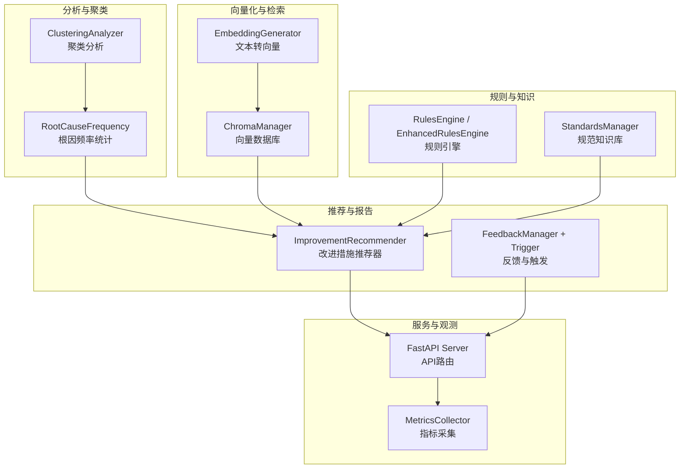
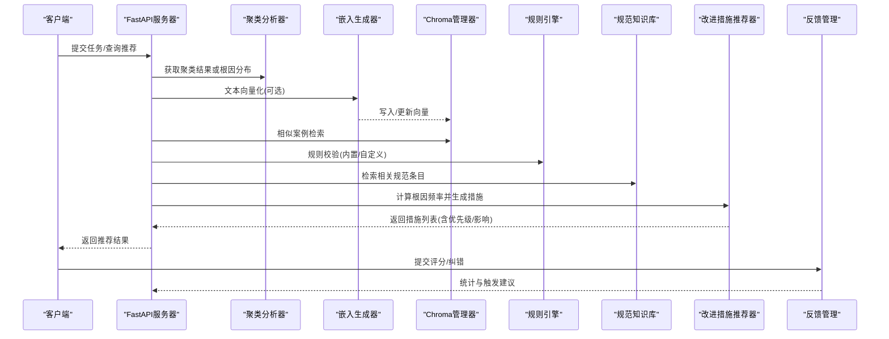
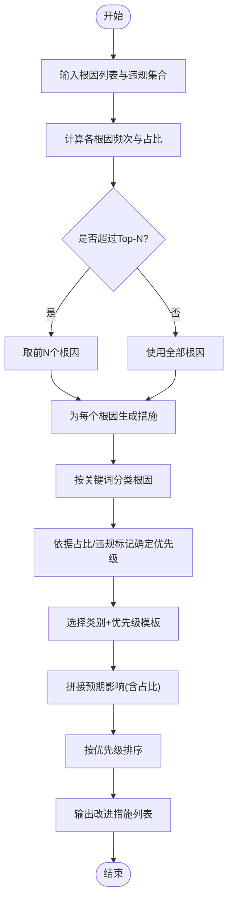
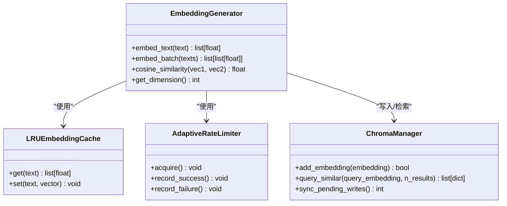
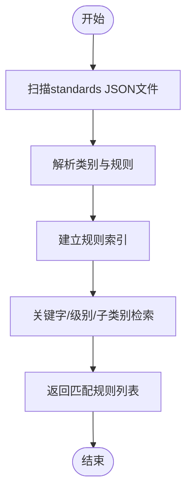
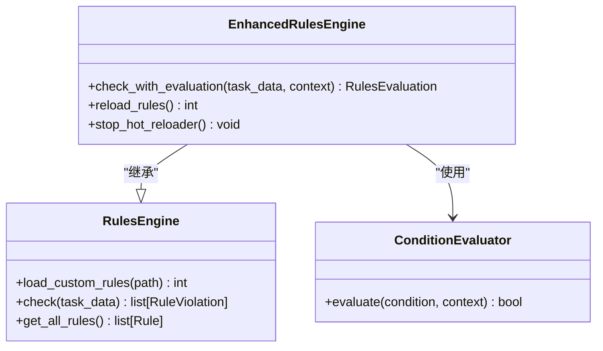
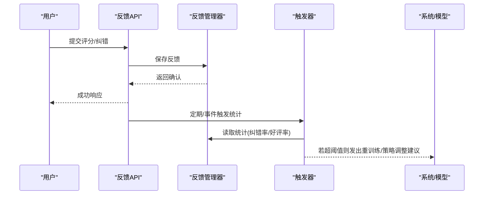
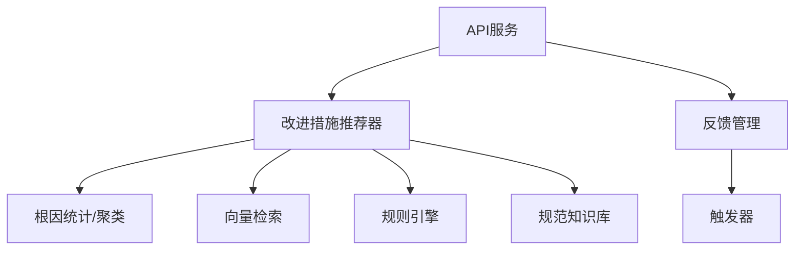

# 改进建议推荐系统

<cite>
**本文引用的文件**   
- [improvement_recommender.py](file://src/analysis/improvement_recommender.py)
- [clustering.py](file://src/analysis/clustering.py)
- [generator.py](file://src/embedding/generator.py)
- [chroma_manager.py](file://src/storage/chroma_manager.py)
- [manager.py](file://src/knowledge/manager.py)
- [engine.py](file://src/rules/engine.py)
- [engine_enhanced.py](file://src/rules/engine_enhanced.py)
- [models.py](file://src/core/models.py)
- [server.py](file://src/api/server.py)
- [feedback.py](file://src/api/routes/feedback.py)
- [manager.py](file://src/feedback/manager.py)
- [trigger.py](file://src/feedback/trigger.py)
- [metrics.py](file://src/utils/metrics.py)
- [config.yaml.example](file://config/config.yaml.example)
</cite>

## 目录
1. [引言](#引言)
2. [项目结构](#项目结构)
3. [核心组件](#核心组件)
4. [架构总览](#架构总览)
5. [详细组件分析](#详细组件分析)
6. [依赖关系分析](#依赖关系分析)
7. [性能与可扩展性](#性能与可扩展性)
8. [故障排查指南](#故障排查指南)
9. [结论](#结论)
10. [附录：配置与示例路径](#附录配置与示例路径)

## 引言
本技术文档面向“改进建议推荐系统”，聚焦以下目标：
- 解释相似案例匹配、最佳实践库检索与个性化推荐策略的实现原理
- 说明改进措施的生成逻辑，包括优先级排序、影响评估与可行性分析
- 文档化推荐质量评估机制与用户反馈学习闭环
- 提供可操作的配置与阈值调优指引（以代码片段路径替代具体代码）
- 阐述与知识库系统的集成方式与数据同步机制
- 给出推荐效果监控与优化调优指南

## 项目结构
推荐系统由多个模块协同工作：
- 根因统计与聚类：从任务或聚类结果中抽取高频根因
- 向量嵌入与相似度检索：将文本转为向量，进行相似案例匹配
- 规则引擎与规范知识库：结合规则与规范进行合规性与可行性判断
- 改进措施推荐器：基于根因频率与类别模板生成改进措施
- 反馈管理与触发器：收集用户反馈，驱动模型与策略迭代
- API与服务：对外暴露接口，支撑前端与外部系统集成
- 指标采集：为监控与调优提供基础数据

图表来源
- [clustering.py:22-94](file://src/analysis/clustering.py#L22-L94)
- [improvement_recommender.py:37-185](file://src/analysis/improvement_recommender.py#L37-L185)
- [generator.py:91-216](file://src/embedding/generator.py#L91-L216)
- [chroma_manager.py:111-234](file://src/storage/chroma_manager.py#L111-L234)
- [engine.py:217-352](file://src/rules/engine.py#L217-L352)
- [engine_enhanced.py:22-118](file://src/rules/engine_enhanced.py#L22-L118)
- [manager.py:13-118](file://src/knowledge/manager.py#L13-L118)
- [server.py:38-111](file://src/api/server.py#L38-L111)
- [metrics.py:151-226](file://src/utils/metrics.py#L151-L226)

章节来源
- [clustering.py:22-94](file://src/analysis/clustering.py#L22-L94)
- [improvement_recommender.py:37-185](file://src/analysis/improvement_recommender.py#L37-L185)
- [generator.py:91-216](file://src/embedding/generator.py#L91-L216)
- [chroma_manager.py:111-234](file://src/storage/chroma_manager.py#L111-L234)
- [engine.py:217-352](file://src/rules/engine.py#L217-L352)
- [engine_enhanced.py:22-118](file://src/rules/engine_enhanced.py#L22-L118)
- [manager.py:13-118](file://src/knowledge/manager.py#L13-L118)
- [server.py:38-111](file://src/api/server.py#L38-L111)
- [metrics.py:151-226](file://src/utils/metrics.py#L151-L226)

## 核心组件
- 改进措施推荐器：基于根因频率与分类模板生成改进措施，支持按优先级筛选与报告生成
- 聚类分析器：对嵌入向量执行HDBSCAN/K-Means/层次聚类，输出簇信息与常见根因
- 嵌入生成器：多提供商的异步文本向量化，含缓存、熔断与自适应限流
- 向量数据库：Chroma持久化存储，具备重试与本地降级写入能力
- 规则引擎：内置与自定义规则加载、条件评估与违规评分
- 规范知识库：加载标准类别与规则，支持关键字搜索与级别过滤
- 反馈管理：记录用户反馈、审核与统计；触发器根据指标决定是否需要重训练
- API服务：统一入口，注册健康检查、分析、聚类、报告与反馈等路由
- 指标采集：计数器、仪表盘、直方图与Prometheus导出

章节来源
- [improvement_recommender.py:37-185](file://src/analysis/improvement_recommender.py#L37-L185)
- [clustering.py:22-94](file://src/analysis/clustering.py#L22-L94)
- [generator.py:91-216](file://src/embedding/generator.py#L91-L216)
- [chroma_manager.py:111-234](file://src/storage/chroma_manager.py#L111-L234)
- [engine.py:217-352](file://src/rules/engine.py#L217-L352)
- [engine_enhanced.py:22-118](file://src/rules/engine_enhanced.py#L22-L118)
- [manager.py:13-118](file://src/knowledge/manager.py#L13-L118)
- [server.py:38-111](file://src/api/server.py#L38-L111)
- [metrics.py:151-226](file://src/utils/metrics.py#L151-L226)

## 架构总览
推荐系统的数据流与控制流如下：
- 输入：任务描述、变更日志、历史根因、规则与规范
- 处理：向量化 → 相似检索 → 规则校验 → 根因统计 → 推荐生成
- 输出：改进措施列表、验收标准、预期影响、优先级
- 反馈：用户评分与纠错 → 统计与触发 → 策略/模型迭代

图表来源
- [server.py:38-111](file://src/api/server.py#L38-L111)
- [clustering.py:22-94](file://src/analysis/clustering.py#L22-L94)
- [generator.py:91-216](file://src/embedding/generator.py#L91-L216)
- [chroma_manager.py:111-234](file://src/storage/chroma_manager.py#L111-L234)
- [engine.py:217-352](file://src/rules/engine.py#L217-L352)
- [manager.py:13-118](file://src/knowledge/manager.py#L13-L118)
- [improvement_recommender.py:37-185](file://src/analysis/improvement_recommender.py#L37-L185)
- [feedback.py:26-157](file://src/api/routes/feedback.py#L26-L157)

## 详细组件分析

### 改进措施推荐器
- 功能要点
  - 根因频率统计：统计根因出现次数与占比，支持标记违规类根因
  - 分类与模板匹配：按关键词将根因归类到“违规/需求/设计/代码/测试/运维”等类别，选择对应优先级模板
  - 优先级判定：违规或高占比优先提升优先级；低占比降为低优先级
  - 影响评估：在模板基础上附加当前占比信息，形成预期影响
  - 排序与筛选：按优先级排序，支持按优先级过滤
  - 报告生成：按优先级分组输出结构化报告
- 关键流程（算法流程图）

图表来源
- [improvement_recommender.py:119-185](file://src/analysis/improvement_recommender.py#L119-L185)
- [improvement_recommender.py:187-255](file://src/analysis/improvement_recommender.py#L187-L255)

章节来源
- [improvement_recommender.py:37-185](file://src/analysis/improvement_recommender.py#L37-L185)
- [improvement_recommender.py:187-255](file://src/analysis/improvement_recommender.py#L187-L255)

### 相似案例匹配（向量化与检索）
- 向量化
  - 支持多提供商（OpenAI、智谱、火山等），异步并发与批量处理
  - LRU缓存减少重复调用；自适应速率限制与熔断保护后端
  - 本地模式用于离线/无网络场景
- 检索
  - Chroma持久化存储，支持元数据过滤与相似查询
  - 失败重试与本地降级写入，保障可用性
- 相似度
  - 余弦相似度为主，归一化处理避免长度偏差

图表来源
- [generator.py:91-216](file://src/embedding/generator.py#L91-L216)
- [generator.py:13-52](file://src/embedding/generator.py#L13-L52)
- [generator.py:54-89](file://src/embedding/generator.py#L54-L89)
- [chroma_manager.py:111-234](file://src/storage/chroma_manager.py#L111-L234)

章节来源
- [generator.py:91-216](file://src/embedding/generator.py#L91-L216)
- [chroma_manager.py:111-234](file://src/storage/chroma_manager.py#L111-L234)

### 最佳实践库检索（规范知识库）
- 加载与管理
  - 从JSON文件加载标准类别与规则，构建索引
  - 支持按关键字搜索、按级别与子类别过滤
- 与推荐联动
  - 在生成改进措施时，可引用相关规范条目作为验收标准或参考依据

图表来源
- [manager.py:13-118](file://src/knowledge/manager.py#L13-L118)

章节来源
- [manager.py:13-118](file://src/knowledge/manager.py#L13-L118)

### 规则引擎与可行性分析
- 规则加载
  - 内置规则与自定义YAML/JSON规则
  - 增强版支持高级条件表达式、权重与优先级
- 评估与评分
  - 基于严重级别、优先级与权重计算违规分数
  - 生成整体评估报告（严重级别分布、类别得分）
- 可行性辅助
  - 通过规则命中情况与评分，辅助判断改进措施的落地难度与风险

图表来源
- [engine.py:217-352](file://src/rules/engine.py#L217-L352)
- [engine_enhanced.py:22-118](file://src/rules/engine_enhanced.py#L22-L118)
- [engine_enhanced.py:131-173](file://src/rules/engine_enhanced.py#L131-L173)

章节来源
- [engine.py:217-352](file://src/rules/engine.py#L217-L352)
- [engine_enhanced.py:22-118](file://src/rules/engine_enhanced.py#L22-L118)
- [engine_enhanced.py:131-173](file://src/rules/engine_enhanced.py#L131-L173)

### 个性化推荐策略
- 策略维度
  - 根因频率：高频根因优先获得高优先级措施
  - 违规标记：违规类根因自动提升优先级
  - 类别模板：不同类别采用差异化措施与验收标准
  - 上下文融合：结合规则评估与规范条目，调整预期影响与可行性
- 输出结构
  - 措施描述、验收标准、预期影响、优先级、类别

章节来源
- [improvement_recommender.py:119-185](file://src/analysis/improvement_recommender.py#L119-L185)
- [improvement_recommender.py:187-255](file://src/analysis/improvement_recommender.py#L187-L255)

### 推荐质量评估与用户反馈学习闭环
- 反馈采集
  - 记录原始结果、纠正结果、评分与评论
  - 支持按任务ID、类型、评分、审核状态查询
- 统计与触发
  - 统计纠错率与好评率，设定阈值触发重训练或策略调整
  - 生成改进建议（如标签生成、根因分析需优化）
- 闭环流程

图表来源
- [feedback.py:26-157](file://src/api/routes/feedback.py#L26-L157)
- [manager.py:11-279](file://src/feedback/manager.py#L11-L279)
- [trigger.py:41-78](file://src/feedback/trigger.py#L41-L78)

章节来源
- [feedback.py:26-157](file://src/api/routes/feedback.py#L26-L157)
- [manager.py:11-279](file://src/feedback/manager.py#L11-L279)
- [trigger.py:41-78](file://src/feedback/trigger.py#L41-L78)

## 依赖关系分析
- 组件耦合
  - 推荐器依赖根因统计、规则评估与规范检索
  - 向量化与检索为推荐提供相似案例证据
  - 反馈管理独立于推荐，但通过统计影响策略迭代
- 外部依赖
  - OpenAI/智谱/火山等嵌入服务
  - Chroma向量数据库
  - FastAPI与Uvicorn
- 潜在循环依赖
  - 当前实现未见明显循环依赖；推荐器不直接依赖API层

图表来源
- [improvement_recommender.py:37-185](file://src/analysis/improvement_recommender.py#L37-L185)
- [clustering.py:22-94](file://src/analysis/clustering.py#L22-L94)
- [generator.py:91-216](file://src/embedding/generator.py#L91-L216)
- [chroma_manager.py:111-234](file://src/storage/chroma_manager.py#L111-L234)
- [engine.py:217-352](file://src/rules/engine.py#L217-L352)
- [manager.py:13-118](file://src/knowledge/manager.py#L13-L118)
- [server.py:38-111](file://src/api/server.py#L38-L111)
- [feedback.py:26-157](file://src/api/routes/feedback.py#L26-L157)
- [manager.py:11-279](file://src/feedback/manager.py#L11-L279)
- [trigger.py:41-78](file://src/feedback/trigger.py#L41-L78)

章节来源
- [improvement_recommender.py:37-185](file://src/analysis/improvement_recommender.py#L37-L185)
- [clustering.py:22-94](file://src/analysis/clustering.py#L22-L94)
- [generator.py:91-216](file://src/embedding/generator.py#L91-L216)
- [chroma_manager.py:111-234](file://src/storage/chroma_manager.py#L111-L234)
- [engine.py:217-352](file://src/rules/engine.py#L217-L352)
- [manager.py:13-118](file://src/knowledge/manager.py#L13-L118)
- [server.py:38-111](file://src/api/server.py#L38-L111)
- [feedback.py:26-157](file://src/api/routes/feedback.py#L26-L157)
- [manager.py:11-279](file://src/feedback/manager.py#L11-L279)
- [trigger.py:41-78](file://src/feedback/trigger.py#L41-L78)

## 性能与可扩展性
- 向量化性能
  - 批量并发与LRU缓存降低延迟与成本
  - 自适应限流与熔断提高稳定性
- 向量数据库
  - 重试与降级写入保证高可用
  - 元数据过滤提升检索效率
- 规则评估
  - 热重载与线程锁保障动态更新与并发安全
- 指标与监控
  - Prometheus格式导出便于接入监控系统

章节来源
- [generator.py:91-216](file://src/embedding/generator.py#L91-L216)
- [chroma_manager.py:111-234](file://src/storage/chroma_manager.py#L111-L234)
- [engine_enhanced.py:22-118](file://src/rules/engine_enhanced.py#L22-L118)
- [metrics.py:151-226](file://src/utils/metrics.py#L151-L226)

## 故障排查指南
- 常见问题
  - 向量化失败：检查API密钥、base_url与熔断状态
  - 向量写入失败：查看Chroma连接健康度与待同步记录数
  - 规则加载失败：确认自定义规则路径与文件格式
  - 反馈统计异常：核对SQLite数据库路径与权限
- 定位方法
  - 查看日志中的错误与警告信息
  - 使用健康检查与统计接口获取系统状态
  - 通过指标导出观察延迟与错误率

章节来源
- [generator.py:91-216](file://src/embedding/generator.py#L91-L216)
- [chroma_manager.py:111-234](file://src/storage/chroma_manager.py#L111-L234)
- [engine.py:217-352](file://src/rules/engine.py#L217-L352)
- [manager.py:13-118](file://src/knowledge/manager.py#L13-L118)
- [manager.py:11-279](file://src/feedback/manager.py#L11-L279)
- [server.py:38-111](file://src/api/server.py#L38-L111)

## 结论
本推荐系统以根因频率为核心，结合相似案例检索、规则校验与规范知识库，生成可执行的改进措施。通过反馈闭环与指标监控，持续优化策略与模型，确保推荐质量与落地可行性。

## 附录：配置与示例路径
- 配置项参考
  - API超时与重试、LLM与Embedding模型、聚类参数、缓存、规则路径、输出格式与日志级别
  - 参考路径：[config.yaml.example:1-38](file://config/config.yaml.example#L1-L38)
- 推荐策略配置
  - 根因频率阈值与Top-N数量：参考推荐器方法签名与参数
    - 路径：[calculate_frequencies:119-155](file://src/analysis/improvement_recommender.py#L119-L155)
    - 路径：[recommend_measures:157-185](file://src/analysis/improvement_recommender.py#L157-L185)
  - 优先级判定与分类关键词：参考内部方法
    - 路径：[优先级判定:187-217](file://src/analysis/improvement_recommender.py#L187-L217)
    - 路径：[分类关键词:219-243](file://src/analysis/improvement_recommender.py#L219-L243)
- 规则与知识库
  - 内置规则与自定义规则加载：参考规则引擎
    - 路径：[load_custom_rules:239-250](file://src/rules/engine.py#L239-L250)
    - 路径：[check:324-352](file://src/rules/engine.py#L324-L352)
  - 规范知识库检索：参考管理器
    - 路径：[search_rules:84-95](file://src/knowledge/manager.py#L84-L95)
    - 路径：[get_rules_by_level:97-99](file://src/knowledge/manager.py#L97-L99)
- 向量化与检索
  - 嵌入生成与缓存：参考生成器
    - 路径：[embed_text:162-216](file://src/embedding/generator.py#L162-L216)
    - 路径：[LRU缓存:13-52](file://src/embedding/generator.py#L13-L52)
  - 向量数据库操作：参考管理器
    - 路径：[add_embedding:236-283](file://src/storage/chroma_manager.py#L236-L283)
    - 路径：[query_similar:501-532](file://src/storage/chroma_manager.py#L501-L532)
- 反馈与触发
  - 反馈API与统计：参考路由与管理器
    - 路径：[create_feedback:38-65](file://src/api/routes/feedback.py#L38-L65)
    - 路径：[get_statistics:213-265](file://src/feedback/manager.py#L213-L265)
  - 触发器阈值与建议：参考触发器
    - 路径：[阈值检查:41-78](file://src/feedback/trigger.py#L41-L78)
- 指标与监控
  - 指标导出：参考指标收集器
    - 路径：[export_prometheus:190-226](file://src/utils/metrics.py#L190-L226)

章节来源
- [config.yaml.example:1-38](file://config/config.yaml.example#L1-L38)
- [improvement_recommender.py:119-243](file://src/analysis/improvement_recommender.py#L119-L243)
- [engine.py:239-352](file://src/rules/engine.py#L239-L352)
- [manager.py:84-99](file://src/knowledge/manager.py#L84-L99)
- [generator.py:162-216](file://src/embedding/generator.py#L162-L216)
- [chroma_manager.py:236-532](file://src/storage/chroma_manager.py#L236-L532)
- [feedback.py:38-65](file://src/api/routes/feedback.py#L38-L65)
- [manager.py:213-265](file://src/feedback/manager.py#L213-L265)
- [trigger.py:41-78](file://src/feedback/trigger.py#L41-L78)
- [metrics.py:190-226](file://src/utils/metrics.py#L190-L226)
