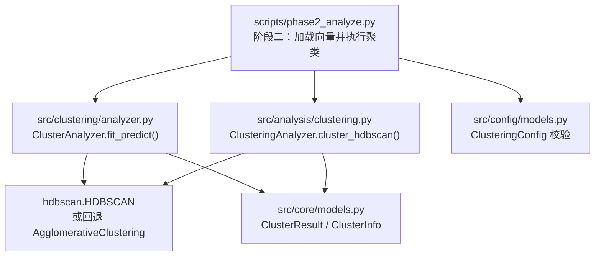
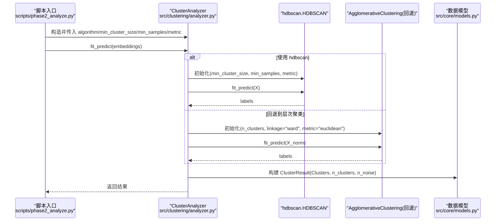
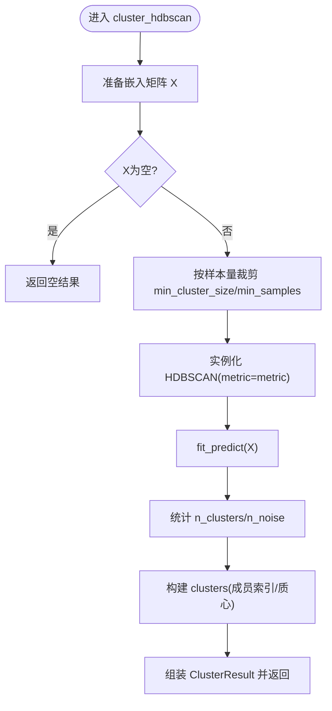
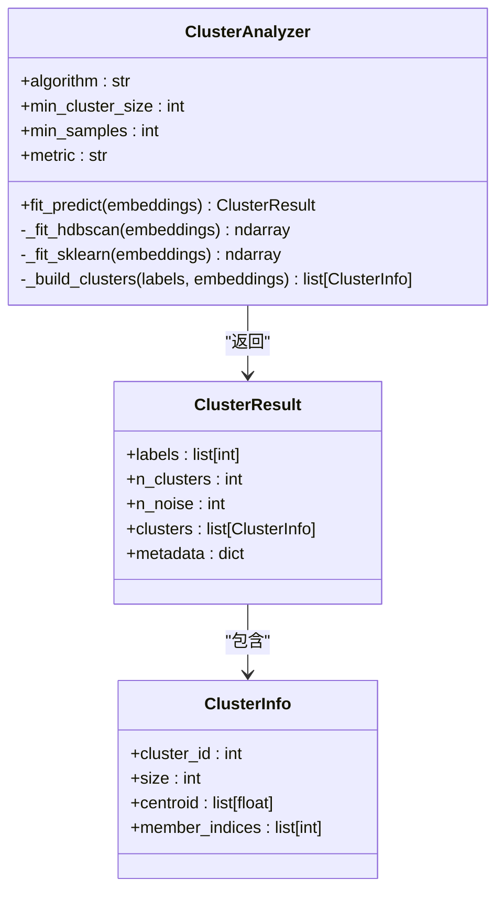
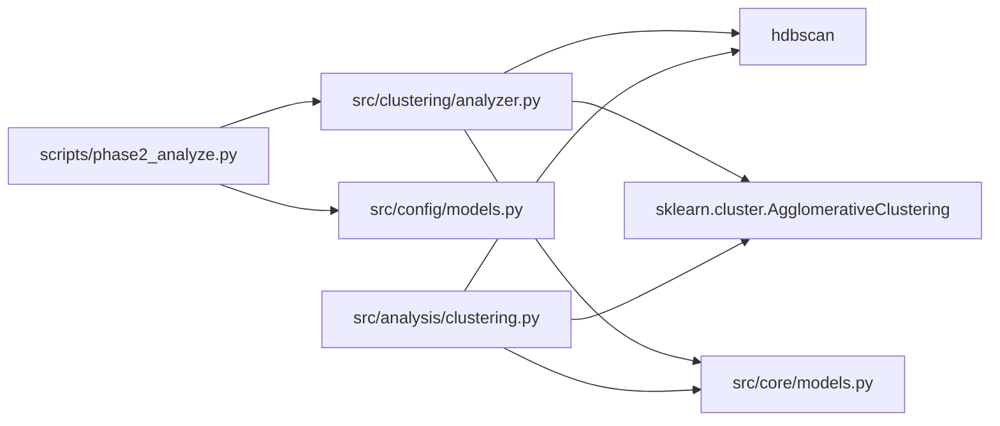

# HDBSCAN聚类算法

<cite>
**本文引用的文件**   
- [src/analysis/clustering.py](file://src/analysis/clustering.py)
- [src/clustering/analyzer.py](file://src/clustering/analyzer.py)
- [src/core/models.py](file://src/core/models.py)
- [src/config/models.py](file://src/config/models.py)
- [scripts/phase2_analyze.py](file://scripts/phase2_analyze.py)
- [tests/test_clustering.py](file://tests/test_clustering.py)
</cite>

## 目录
1. [简介](#简介)
2. [项目结构](#项目结构)
3. [核心组件](#核心组件)
4. [架构总览](#架构总览)
5. [详细组件分析](#详细组件分析)
6. [依赖关系分析](#依赖关系分析)
7. [性能与大规模数据处理](#性能与大规模数据处理)
8. [故障排查指南](#故障排查指南)
9. [结论](#结论)
10. [附录：参数与度量速查](#附录参数与度量速查)

## 简介
本技术文档围绕HDBSCAN（层次密度空间聚类）在本项目中的实现与应用，系统阐述其核心原理、关键参数机制、距离度量的适用场景，以及与K-Means等传统方法的对比优势。文档同时提供可落地的配置示例路径、噪声点处理策略、以及面向大规模数据的优化建议，帮助读者在工程实践中高效使用HDBSCAN进行任意形状簇的识别与异常检测。

## 项目结构
本项目将聚类能力抽象为统一的接口，并在多个入口复用。与HDBSCAN直接相关的代码主要分布在以下位置：
- 高层封装与分析器：src/analysis/clustering.py
- 轻量级分析器（支持回退到层次聚类）：src/clustering/analyzer.py
- 统一数据模型：src/core/models.py
- 配置校验与默认值：src/config/models.py
- 脚本化调用流程：scripts/phase2_analyze.py
- 单元测试覆盖：tests/test_clustering.py

图表来源
- [scripts/phase2_analyze.py:20-78](file://scripts/phase2_analyze.py#L20-L78)
- [src/clustering/analyzer.py:22-71](file://src/clustering/analyzer.py#L22-L71)
- [src/analysis/clustering.py:25-93](file://src/analysis/clustering.py#L25-L93)
- [src/core/models.py:210-230](file://src/core/models.py#L210-L230)
- [src/config/models.py:61-81](file://src/config/models.py#L61-L81)

章节来源
- [scripts/phase2_analyze.py:20-78](file://scripts/phase2_analyze.py#L20-L78)
- [src/clustering/analyzer.py:22-71](file://src/clustering/analyzer.py#L22-L71)
- [src/analysis/clustering.py:25-93](file://src/analysis/clustering.py#L25-L93)
- [src/core/models.py:210-230](file://src/core/models.py#L210-L230)
- [src/config/models.py:61-81](file://src/config/models.py#L61-L81)

## 核心组件
- ClusteringAnalyzer（src/analysis/clustering.py）
  - 提供 cluster_hdbscan 方法，直接调用 hdbscan.HDBSCAN，自动根据样本量对 min_cluster_size 和 min_samples 做安全裁剪，返回包含标签、噪声数量、聚类信息等的 ClusterResult。
- ClusterAnalyzer（src/clustering/analyzer.py）
  - 提供 fit_predict 统一入口；当选择 hdbscan 时优先使用 hdbscan.HDBSCAN，若导入失败则回退到 sklearn 的 AgglomerativeClustering（ward连接），并对余弦距离通过归一化+欧氏等价处理。
- 数据模型（src/core/models.py）
  - ClusterResult 与 ClusterInfo 承载聚类结果、噪声统计、成员索引、质心等结构化信息。
- 配置校验（src/config/models.py）
  - ClusteringConfig 限定算法与度量集合，并提供默认值（如默认算法 hdbscan、度量 cosine）。

章节来源
- [src/analysis/clustering.py:25-93](file://src/analysis/clustering.py#L25-L93)
- [src/clustering/analyzer.py:22-71](file://src/clustering/analyzer.py#L22-L71)
- [src/core/models.py:210-230](file://src/core/models.py#L210-L230)
- [src/config/models.py:61-81](file://src/config/models.py#L61-L81)

## 架构总览
下图展示了从脚本入口到具体聚类实现的调用链路与数据结构流转。

图表来源
- [scripts/phase2_analyze.py:20-78](file://scripts/phase2_analyze.py#L20-L78)
- [src/clustering/analyzer.py:22-71](file://src/clustering/analyzer.py#L22-L71)
- [src/core/models.py:210-230](file://src/core/models.py#L210-L230)

## 详细组件分析

### 组件A：HDBSCAN 封装与参数裁剪
- 功能要点
  - 输入嵌入矩阵后，先按样本规模对 min_cluster_size 与 min_samples 做上限裁剪，避免非法参数导致异常。
  - 调用 hdbscan.HDBSCAN 完成拟合与预测，统计簇数与噪声点数，并构建每个聚类的成员索引与质心。
  - 返回的 ClusterResult 中包含 labels、n_clusters、n_noise、clusters 及 metadata（记录实际使用的参数）。
- 关键流程
  - 参数裁剪 → 实例化 HDBSCAN → 拟合预测 → 统计与构建聚类信息 → 返回结果。

图表来源
- [src/analysis/clustering.py:25-93](file://src/analysis/clustering.py#L25-L93)

章节来源
- [src/analysis/clustering.py:25-93](file://src/analysis/clustering.py#L25-L93)

### 组件B：统一分析器与回退策略
- 功能要点
  - fit_predict 统一入口，内部根据算法名分支。
  - 当 metric 为 cosine 时，先对向量进行 L2 归一化，再使用 euclidean 计算，以等价于余弦距离且提升效率。
  - 若 hdbscan 不可用，回退到 AgglomerativeClustering（ward连接，仅支持欧氏距离），并通过归一化近似余弦语义。
- 关键流程
  - 输入校验 → 维度检查 → 算法分支 → 距离预处理（必要时归一化）→ 模型拟合 → 构建聚类信息 → 返回结果。

图表来源
- [src/clustering/analyzer.py:8-121](file://src/clustering/analyzer.py#L8-L121)
- [src/core/models.py:210-230](file://src/core/models.py#L210-L230)
- [src/core/models.py:91-117](file://src/core/models.py#L91-L117)

章节来源
- [src/clustering/analyzer.py:22-71](file://src/clustering/analyzer.py#L22-L71)
- [src/clustering/analyzer.py:73-95](file://src/clustering/analyzer.py#L73-L95)
- [src/clustering/analyzer.py:97-121](file://src/clustering/analyzer.py#L97-L121)
- [src/core/models.py:210-230](file://src/core/models.py#L210-L230)
- [src/core/models.py:91-117](file://src/core/models.py#L91-L117)

### 组件C：配置与校验
- 功能要点
  - 限制支持的算法集合与度量集合，并提供默认值。
  - 默认算法为 hdbscan，默认度量 cosine，最小簇大小与最小样本数均有合理下限约束。
- 影响范围
  - 上层脚本与UI均基于该配置创建 ClusterAnalyzer 或 ClusteringAnalyzer，从而决定最终使用的算法与距离度量。

章节来源
- [src/config/models.py:61-81](file://src/config/models.py#L61-L81)

### 组件D：端到端调用示例（脚本）
- 功能要点
  - 从向量库加载嵌入与元数据，构造 ClusterAnalyzer，运行聚类，生成分析报告。
  - 支持命令行覆盖算法与参数（如 min_cluster_size、min_samples、metric）。
- 典型用法
  - 通过命令行参数指定算法与参数，或直接读取配置文件中的 clustering.* 字段。

章节来源
- [scripts/phase2_analyze.py:20-78](file://scripts/phase2_analyze.py#L20-L78)
- [scripts/phase2_analyze.py:194-242](file://scripts/phase2_analyze.py#L194-L242)

## 依赖关系分析
- 模块耦合
  - scripts/phase2_analyze.py 依赖 src/clustering/analyzer.py 与 src/config/models.py。
  - src/clustering/analyzer.py 依赖 hdbscan 或 sklearn（回退），并产出 src/core/models.py 定义的数据结构。
  - src/analysis/clustering.py 直接依赖 hdbscan 与 sklearn，并同样产出 src/core/models.py 的结构。
- 外部依赖
  - hdbscan：核心算法实现。
  - sklearn：回退方案（层次聚类）与 KMeans（在分析器中另有实现）。
- 潜在循环
  - 当前未见循环依赖；各模块职责清晰，数据模型集中管理。

图表来源
- [scripts/phase2_analyze.py:20-78](file://scripts/phase2_analyze.py#L20-L78)
- [src/clustering/analyzer.py:22-95](file://src/clustering/analyzer.py#L22-L95)
- [src/analysis/clustering.py:25-93](file://src/analysis/clustering.py#L25-L93)
- [src/core/models.py:210-230](file://src/core/models.py#L210-L230)

章节来源
- [scripts/phase2_analyze.py:20-78](file://scripts/phase2_analyze.py#L20-L78)
- [src/clustering/analyzer.py:22-95](file://src/clustering/analyzer.py#L22-L95)
- [src/analysis/clustering.py:25-93](file://src/analysis/clustering.py#L25-L93)
- [src/core/models.py:210-230](file://src/core/models.py#L210-L230)

## 性能与大规模数据处理
- 参数裁剪与鲁棒性
  - 在高层封装中对 min_cluster_size 与 min_samples 进行上限裁剪，避免小数据集上的非法参数问题，减少异常与无效计算。
- 距离度量优化
  - 当 metric 为 cosine 时，先对向量进行 L2 归一化，再用欧氏距离计算，既保持语义等价又利用更高效的欧氏实现。
- 回退策略
  - 当 hdbscan 缺失时，自动回退到 AgglomerativeClustering（ward连接），保证可用性。
- 内存与时间复杂度
  - HDBSCAN 的时间复杂度通常高于 K-Means，尤其在大数据集上；建议在超大规模数据上考虑降维、采样或分块策略。
- 工程实践建议
  - 预归一化：在高维稀疏文本嵌入场景，优先使用 cosine 并配合归一化。
  - 参数扫描：结合业务分布对 min_cluster_size 与 min_samples 进行网格搜索或启发式调参。
  - 可视化辅助：借助 2D/3D 降维结果观察簇结构与噪声分布，辅助参数调整。

章节来源
- [src/analysis/clustering.py:55-63](file://src/analysis/clustering.py#L55-L63)
- [src/clustering/analyzer.py:54-71](file://src/clustering/analyzer.py#L54-L71)
- [src/clustering/analyzer.py:73-95](file://src/clustering/analyzer.py#L73-L95)

## 故障排查指南
- 常见问题
  - 未安装 hdbscan：将自动回退到层次聚类，但无法获得 HDBSCAN 的密度特性。
  - 参数过大：min_cluster_size 超过样本量会导致所有点被标记为噪声；封装层已做裁剪，但仍需关注业务含义。
  - 余弦距离误用：未归一化直接使用某些度量可能导致语义偏差；封装层已对 cosine 做归一化处理。
- 定位步骤
  - 查看日志输出中的“聚类完成”信息与参数元数据，确认实际使用的算法与参数。
  - 检查返回的 n_noise 与 clusters 列表，评估噪声比例是否异常。
  - 对于回退路径，确认 AgglomerativeClustering 的参数与结果是否符合预期。

章节来源
- [src/analysis/clustering.py:71-93](file://src/analysis/clustering.py#L71-L93)
- [src/clustering/analyzer.py:29-35](file://src/clustering/analyzer.py#L29-L35)
- [src/clustering/analyzer.py:54-71](file://src/clustering/analyzer.py#L54-L71)

## 结论
本项目对 HDBSCAN 进行了稳健的工程封装，提供了参数裁剪、距离度量优化与回退策略，确保在不同环境与数据规模下均可稳定运行。结合配置校验与测试覆盖，用户可在不同场景灵活选择算法与度量，并获得一致的 ClusterResult 输出。对于大规模数据与复杂分布，建议结合降维、采样与参数扫描以获得更好的聚类效果与性能平衡。

## 附录：参数与度量速查
- 关键参数
  - min_cluster_size：控制形成簇的最小样本规模，越大越保守，噪声越多；过小易过拟合。
  - min_samples：控制局部密度估计的邻域规模，影响对密度变化的敏感度。
  - metric：支持 cosine、euclidean、manhattan；cosine 适合高维文本嵌入，euclidean 适合几何距离，manhattan 对稀疏特征更稳健。
- 配置位置
  - 默认值与校验：src/config/models.py 的 ClusteringConfig。
  - 脚本覆盖：scripts/phase2_analyze.py 支持命令行参数覆盖。
- 参考用例
  - 单元测试中对 cosine 与小数据集的处理进行了验证，可作为参数选择的参考。

章节来源
- [src/config/models.py:61-81](file://src/config/models.py#L61-L81)
- [scripts/phase2_analyze.py:194-242](file://scripts/phase2_analyze.py#L194-L242)
- [tests/test_clustering.py:82-110](file://tests/test_clustering.py#L82-L110)