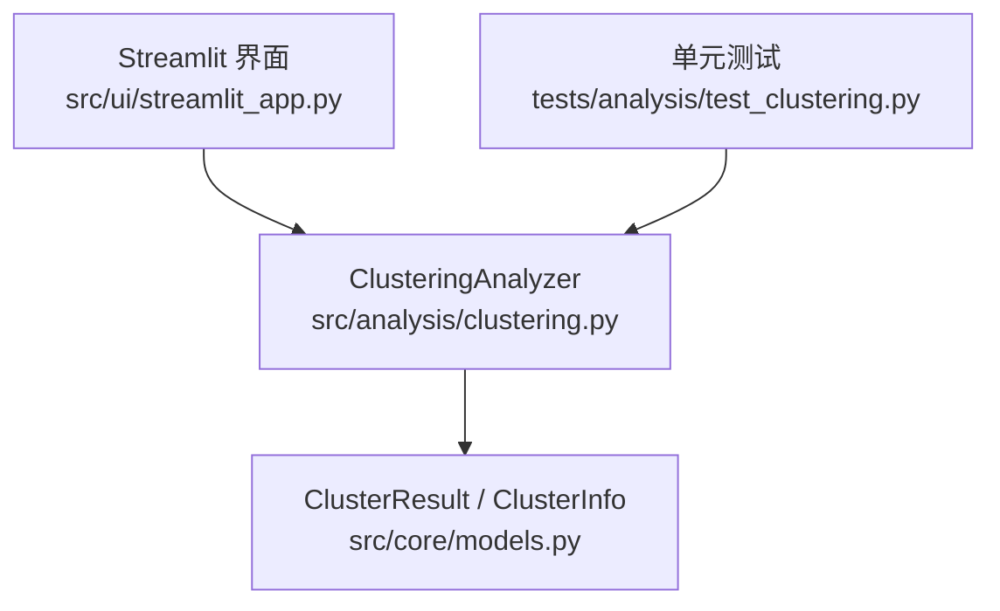
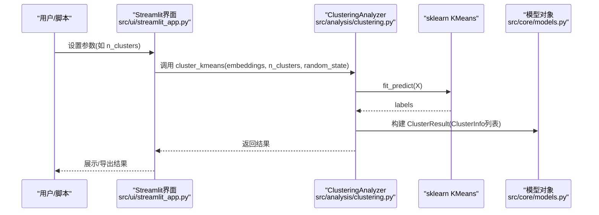
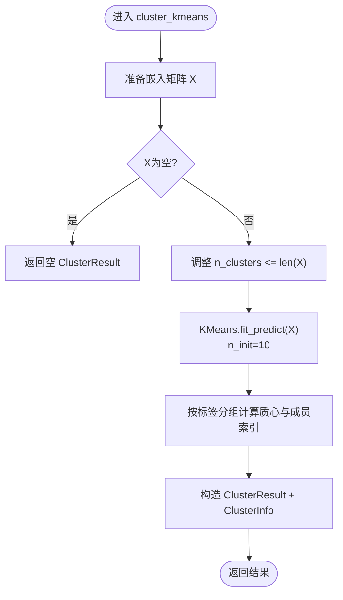
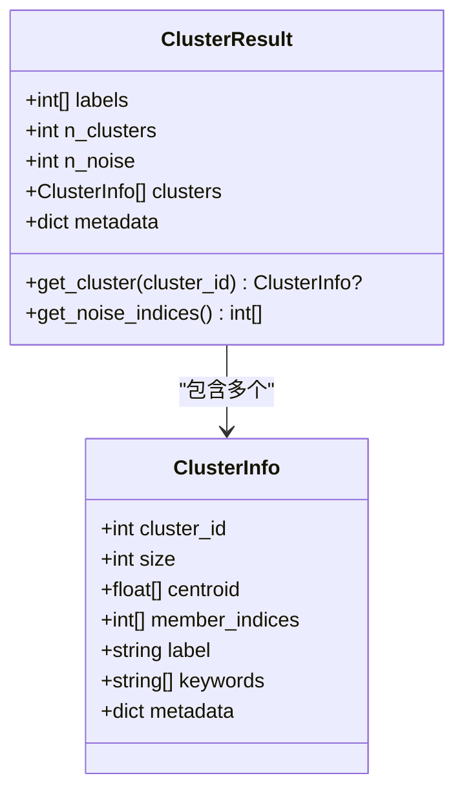
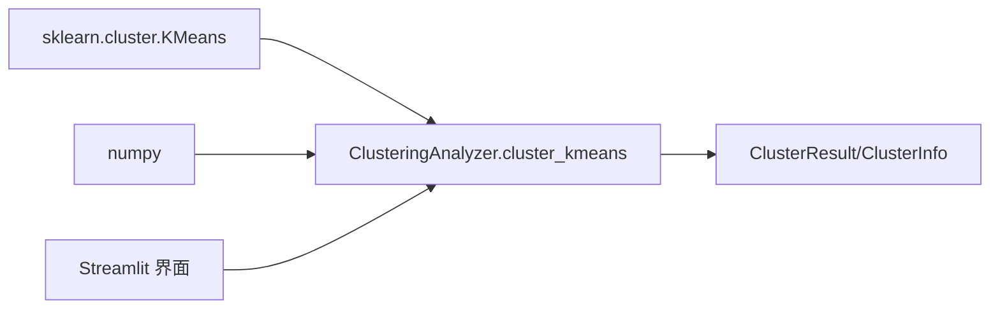

# K-Means聚类算法

<cite>
**本文引用的文件**   
- [src/analysis/clustering.py](file://src/analysis/clustering.py)
- [src/core/models.py](file://src/core/models.py)
- [tests/analysis/test_clustering.py](file://tests/analysis/test_clustering.py)
- [src/ui/streamlit_app.py](file://src/ui/streamlit_app.py)
</cite>

## 目录
1. [简介](#简介)
2. [项目结构](#项目结构)
3. [核心组件](#核心组件)
4. [架构总览](#架构总览)
5. [详细组件分析](#详细组件分析)
6. [依赖关系分析](#依赖关系分析)
7. [性能与复杂度](#性能与复杂度)
8. [参数选择策略与实践](#参数选择策略与实践)
9. [可重复性与初始化](#可重复性与初始化)
10. [优缺点与适用性](#优缺点与适用性)
11. [大数据集处理技巧](#大数据集处理技巧)
12. [故障排查指南](#故障排查指南)
13. [结论](#结论)
14. [附录：代码片段路径](#附录代码片段路径)

## 简介
本技术文档围绕K-Means聚类算法，结合仓库中的实现与使用方式，系统阐述其基本原理、迭代优化过程、质心更新机制与收敛条件；深入讨论n_clusters参数的选择策略（肘部法则与轮廓系数）；解释random_state对结果可重复性的影响以及n_init在多次初始化中的作用。同时提供实践建议、复杂度分析与内存优化思路，帮助读者在实际工程中高效、稳健地使用K-Means。

## 项目结构
本项目将聚类能力封装在分析模块中，并通过统一的模型对象对外输出结果。与K-Means直接相关的核心位置如下：
- 聚类分析器：src/analysis/clustering.py
- 统一数据模型：src/core/models.py
- 测试用例：tests/analysis/test_clustering.py
- UI交互入口（含K-Means参数输入）：src/ui/streamlit_app.py

图表来源
- [src/analysis/clustering.py:95-156](file://src/analysis/clustering.py#L95-L156)
- [src/core/models.py:210-230](file://src/core/models.py#L210-L230)
- [src/ui/streamlit_app.py:226-285](file://src/ui/streamlit_app.py#L226-L285)
- [tests/analysis/test_clustering.py:73-98](file://tests/analysis/test_clustering.py#L73-L98)

章节来源
- [src/analysis/clustering.py:1-316](file://src/analysis/clustering.py#L1-L316)
- [src/core/models.py:210-230](file://src/core/models.py#L210-L230)
- [src/ui/streamlit_app.py:226-285](file://src/ui/streamlit_app.py#L226-L285)
- [tests/analysis/test_clustering.py:1-169](file://tests/analysis/test_clustering.py#L1-L169)

## 核心组件
- ClusteringAnalyzer.cluster_kmeans：基于sklearn.cluster.KMeans的K-Means封装，负责数据准备、参数校验、训练与结果组装。
- ClusterResult / ClusterInfo：标准化输出结构，包含标签、簇数量、噪声点数量、每个簇的成员索引与质心等元信息。
- Streamlit界面：提供K-Means的参数输入（如簇数量），便于交互式调参与可视化。

章节来源
- [src/analysis/clustering.py:95-156](file://src/analysis/clustering.py#L95-L156)
- [src/core/models.py:210-230](file://src/core/models.py#L210-L230)
- [src/ui/streamlit_app.py:226-285](file://src/ui/streamlit_app.py#L226-L285)

## 架构总览
K-Means在系统中的调用流程如下：用户通过UI或脚本传入嵌入向量与参数，分析器执行K-Means并返回结构化结果。

图表来源
- [src/ui/streamlit_app.py:226-285](file://src/ui/streamlit_app.py#L226-L285)
- [src/analysis/clustering.py:95-156](file://src/analysis/clustering.py#L95-L156)
- [src/core/models.py:210-230](file://src/core/models.py#L210-L230)

## 详细组件分析

### K-Means 实现与流程
- 数据准备：将list[list[float]]转为numpy数组，空数据直接返回空结果。
- 参数调整：当n_clusters大于样本数时自动下调至样本数，避免异常。
- 模型训练：使用sklearn.cluster.KMeans，固定n_init=10以提升稳定性。
- 结果构建：计算各簇成员索引与质心，填充ClusterResult与ClusterInfo。

图表来源
- [src/analysis/clustering.py:95-156](file://src/analysis/clustering.py#L95-L156)
- [src/core/models.py:210-230](file://src/core/models.py#L210-L230)

章节来源
- [src/analysis/clustering.py:95-156](file://src/analysis/clustering.py#L95-L156)
- [src/core/models.py:210-230](file://src/core/models.py#L210-L230)

### 数据结构与关系
- ClusterResult：保存labels、n_clusters、n_noise、clusters、metadata等。
- ClusterInfo：保存cluster_id、size、centroid、member_indices、label、keywords、metadata等。

图表来源
- [src/core/models.py:210-230](file://src/core/models.py#L210-230)

章节来源
- [src/core/models.py:210-230](file://src/core/models.py#L210-L230)

## 依赖关系分析
- 外部库：sklearn.cluster.KMeans用于核心算法；numpy用于数值计算。
- 内部依赖：ClusteringAnalyzer依赖ClusterResult/ClusterInfo进行结果封装。
- UI层：Streamlit仅作为参数输入与结果展示的入口，不改变算法逻辑。

图表来源
- [src/analysis/clustering.py:95-156](file://src/analysis/clustering.py#L95-L156)
- [src/core/models.py:210-230](file://src/core/models.py#L210-L230)
- [src/ui/streamlit_app.py:226-285](file://src/ui/streamlit_app.py#L226-L285)

章节来源
- [src/analysis/clustering.py:95-156](file://src/analysis/clustering.py#L95-L156)
- [src/core/models.py:210-230](file://src/core/models.py#L210-L230)
- [src/ui/streamlit_app.py:226-285](file://src/ui/streamlit_app.py#L226-L285)

## 性能与复杂度
- 时间复杂度：单次K-Means迭代为O(n·k·d)，其中n为样本数，k为簇数，d为维度；总复杂度取决于迭代次数与n_init。
- 空间复杂度：主要为数据矩阵X与中间距离矩阵，约为O(n·d)。
- 当前实现：n_init=10，意味着会运行10次不同初始化的K-Means并选择最优解，提升稳定性但增加计算开销。

[本节为通用性能讨论，不直接分析具体文件]

## 参数选择策略与实践

### n_clusters的选择策略
- 肘部法则（Elbow Method）：遍历候选k值，绘制SSE（簇内平方和）曲线，寻找“拐点”对应的k。
- 轮廓系数（Silhouette Score）：评估簇内紧密度与簇间分离度，取最高分对应的k。
- 业务先验：结合领域知识设定合理范围，再辅以上述指标筛选。

注意：当前仓库未内置自动选择k的函数，建议在调用前自行实现网格搜索与指标评估，然后传入cluster_kmeans。

章节来源
- [src/analysis/clustering.py:95-156](file://src/analysis/clustering.py#L95-L156)
- [tests/analysis/test_clustering.py:73-98](file://tests/analysis/test_clustering.py#L73-L98)

### random_state的影响
- 作用：控制K-Means初始质心的随机性，固定random_state可获得可重复的结果。
- 现状：接口支持传入random_state，并在结果metadata中记录该参数，便于复现实验。

章节来源
- [src/analysis/clustering.py:95-156](file://src/analysis/clustering.py#L95-L156)

### n_init的作用
- 含义：多次随机初始化后选择最佳结果，默认n_init=10，有助于避免局部最优。
- 权衡：增大n_init提高稳定性与质量，但显著增加耗时；可根据数据规模与时间预算调整。

章节来源
- [src/analysis/clustering.py:95-156](file://src/analysis/clustering.py#L95-L156)

### 代码示例路径（不含具体代码内容）
- 基本用法与断言：tests/analysis/test_clustering.py:73-98
- 空数据处理与边界情况：tests/analysis/test_clustering.py:92-98
- 自动调整n_clusters上限：tests/analysis/test_clustering.py:158-169
- UI参数输入（n_clusters）：src/ui/streamlit_app.py:254-260

章节来源
- [tests/analysis/test_clustering.py:73-98](file://tests/analysis/test_clustering.py#L73-L98)
- [tests/analysis/test_clustering.py:92-98](file://tests/analysis/test_clustering.py#L92-L98)
- [tests/analysis/test_clustering.py:158-169](file://tests/analysis/test_clustering.py#L158-L169)
- [src/ui/streamlit_app.py:254-260](file://src/ui/streamlit_app.py#L254-L260)

## 可重复性与初始化
- 可重复性：固定random_state确保每次运行得到相同初始质心与最终划分。
- 多次初始化：n_init=10会在不同初始质心下运行K-Means，选择目标函数最小的结果，降低陷入局部最优的概率。
- 建议：在实验对比与报告生成场景务必固定random_state；在生产环境可适度增大n_init以换取更稳定的聚类质量。

章节来源
- [src/analysis/clustering.py:95-156](file://src/analysis/clustering.py#L95-L156)

## 优缺点与适用性
- 优点
  - 简单高效，适合大规模数据的快速聚类。
  - 对球形、密度相近的簇效果良好。
- 缺点
  - 需预先指定k，且对初始质心敏感，可能陷入局部最优。
  - 对异常值敏感，易被拉偏质心。
  - 假设簇为凸形且方差近似相等，对非球形或密度差异大的簇效果有限。
- 适用场景
  - 高维嵌入向量经归一化后，簇大致呈球形分布的数据。
  - 需要稳定、可复现实验结果的场景。

[本节为通用算法特性讨论，不直接分析具体文件]

## 大数据集处理技巧
- 降维预处理：在高维嵌入上使用PCA/UMAP等方法降维，减少计算量与噪声。
- 采样与分批：对超大数据集采用随机采样或MiniBatch思想（可在上层实现批处理）。
- 特征缩放：对数值型特征做标准化/归一化，提升K-Means稳定性。
- 并行与缓存：利用多核并行计算距离矩阵，或对中间结果进行缓存。
- 内存优化：尽量使用连续内存的numpy数组，避免频繁创建临时对象。

[本节为通用工程实践建议，不直接分析具体文件]

## 故障排查指南
- 空数据：当embeddings为空时，返回空ClusterResult，不会触发异常。
- 簇数量越界：若n_clusters大于样本数，会自动调整为样本数，避免报错。
- 日志与错误：聚类失败时会记录错误日志并抛出异常，便于定位问题。
- 结果验证：可通过ClusterResult.get_cluster获取指定簇信息，检查成员与质心是否合理。

章节来源
- [src/analysis/clustering.py:95-156](file://src/analysis/clustering.py#L95-L156)
- [src/core/models.py:210-230](file://src/core/models.py#L210-L230)

## 结论
本项目对K-Means进行了简洁而实用的封装，提供了必要的参数控制（n_clusters、random_state）与稳定的默认初始化（n_init=10）。结合肘部法则与轮廓系数，可以在实践中选择合适的k；通过固定random_state与合理的n_init，可有效提升结果的可重复性与鲁棒性。对于大规模数据，建议配合降维、缩放与批处理策略，以获得更好的性能与质量。

[本节为总结性内容，不直接分析具体文件]

## 附录：代码片段路径
- K-Means主流程与参数：src/analysis/clustering.py:95-156
- 结果模型定义：src/core/models.py:210-230
- 单元测试（基本用法与边界）：tests/analysis/test_clustering.py:73-98
- UI参数输入（n_clusters）：src/ui/streamlit_app.py:254-260