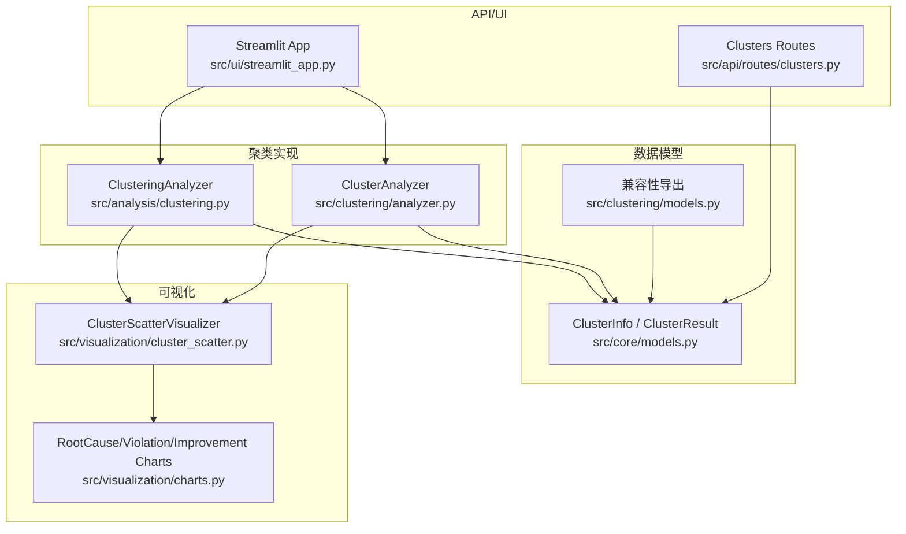
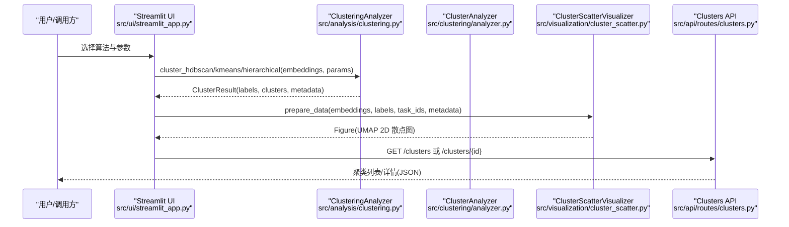
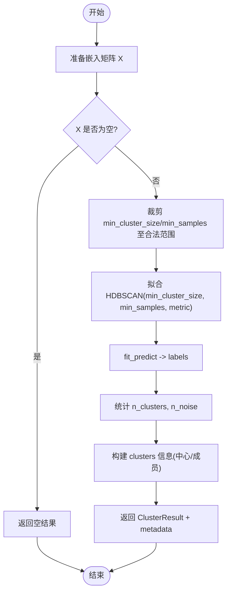
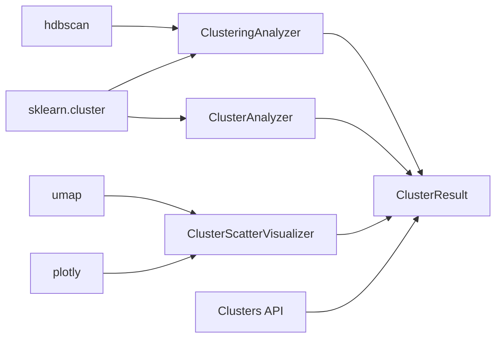

# 多算法聚类分析

<cite>
**本文引用的文件**   
- [src/analysis/clustering.py](file://src/analysis/clustering.py)
- [src/clustering/analyzer.py](file://src/clustering/analyzer.py)
- [src/clustering/models.py](file://src/clustering/models.py)
- [src/core/models.py](file://src/core/models.py)
- [src/visualization/cluster_scatter.py](file://src/visualization/cluster_scatter.py)
- [src/visualization/charts.py](file://src/visualization/charts.py)
- [src/api/routes/clusters.py](file://src/api/routes/clusters.py)
- [src/ui/streamlit_app.py](file://src/ui/streamlit_app.py)
- [tests/analysis/test_clustering.py](file://tests/analysis/test_clustering.py)
- [tests/test_clustering.py](file://tests/test_clustering.py)
- [docs/任务名/DESIGN_故障聚类分析_v2.md](file://docs/任务名/DESIGN_故障聚类分析_v2.md)
- [docs/任务名/TECH_SELECTION_故障聚类分析.md](file://docs/任务名/TECH_SELECTION_故障聚类分析.md)
</cite>

## 目录
1. [简介](#简介)
2. [项目结构](#项目结构)
3. [核心组件](#核心组件)
4. [架构总览](#架构总览)
5. [详细组件分析](#详细组件分析)
6. [依赖关系分析](#依赖关系分析)
7. [性能与可扩展性](#性能与可扩展性)
8. [质量评估指标](#质量评估指标)
9. [异常值检测与处理](#异常值检测与处理)
10. [可视化与分析方法](#可视化与分析方法)
11. [算法选择决策树与最佳实践](#算法选择决策树与最佳实践)
12. [故障排查指南](#故障排查指南)
13. [结论](#结论)
14. [附录：配置与示例路径](#附录配置与示例路径)

## 简介
本技术文档面向“多算法聚类分析系统”，聚焦于 HDBSCAN、K-Means 与层次聚类的实现原理、参数调优策略、结果评估与可视化。文档结合仓库中的实际代码，给出可操作的参数建议、大规模数据处理与性能优化要点，并提供异常值识别与可视化的具体路径。

## 项目结构
围绕聚类相关的关键模块分布如下：
- 聚类算法实现与封装：src/analysis/clustering.py、src/clustering/analyzer.py
- 数据模型：src/core/models.py（ClusterInfo、ClusterResult）、src/clustering/models.py（向后兼容）
- 可视化：src/visualization/cluster_scatter.py（UMAP+Plotly散点图）、src/visualization/charts.py（根因/违规/改进措施图表）
- API 暴露：src/api/routes/clusters.py（聚类列表与详情接口）
- 交互界面：src/ui/streamlit_app.py（交互式参数调整与运行）
- 测试用例：tests/analysis/test_clustering.py、tests/test_clustering.py
- 设计/选型文档：docs/任务名/DESIGN_故障聚类分析_v2.md、docs/任务名/TECH_SELECTION_故障聚类分析.md

**图示来源**
- [src/analysis/clustering.py:1-316](file://src/analysis/clustering.py#L1-L316)
- [src/clustering/analyzer.py:1-121](file://src/clustering/analyzer.py#L1-L121)
- [src/core/models.py:91-231](file://src/core/models.py#L91-L231)
- [src/clustering/models.py:1-25](file://src/clustering/models.py#L1-L25)
- [src/visualization/cluster_scatter.py:1-234](file://src/visualization/cluster_scatter.py#L1-L234)
- [src/visualization/charts.py:1-399](file://src/visualization/charts.py#L1-L399)
- [src/api/routes/clusters.py:1-195](file://src/api/routes/clusters.py#L1-L195)
- [src/ui/streamlit_app.py:226-320](file://src/ui/streamlit_app.py#L226-L320)

**章节来源**
- [src/analysis/clustering.py:1-316](file://src/analysis/clustering.py#L1-L316)
- [src/clustering/analyzer.py:1-121](file://src/clustering/analyzer.py#L1-L121)
- [src/core/models.py:91-231](file://src/core/models.py#L91-L231)
- [src/clustering/models.py:1-25](file://src/clustering/models.py#L1-L25)
- [src/visualization/cluster_scatter.py:1-234](file://src/visualization/cluster_scatter.py#L1-L234)
- [src/visualization/charts.py:1-399](file://src/visualization/charts.py#L1-L399)
- [src/api/routes/clusters.py:1-195](file://src/api/routes/clusters.py#L1-L195)
- [src/ui/streamlit_app.py:226-320](file://src/ui/streamlit_app.py#L226-L320)

## 核心组件
- ClusteringAnalyzer（src/analysis/clustering.py）
  - 提供 HDBSCAN、K-Means、层次聚类的统一入口；内部构建 ClusterResult 并记录元数据（算法、参数）。
  - 支持空输入快速返回；对参数进行安全裁剪（如 n_clusters/min_cluster_size 不超过样本数）。
- ClusterAnalyzer（src/clustering/analyzer.py）
  - 面向 numpy 数组的 fit_predict 风格接口；当 metric=cosine 时自动 L2 归一化以等价余弦距离；HDBSCAN 缺失时回退到 AgglomerativeClustering。
- 数据模型（src/core/models.py）
  - ClusterInfo：簇 ID、大小、中心、成员索引等。
  - ClusterResult：标签、噪声数量、簇信息、概率与元数据。
- 可视化（src/visualization/cluster_scatter.py, charts.py）
  - UMAP 降维 + Plotly 散点图；根因/违规/改进措施的分布图表。
- API 与 UI（src/api/routes/clusters.py, src/ui/streamlit_app.py）
  - 提供聚类列表/详情查询；UI 支持在线参数调节与一键运行。

**章节来源**
- [src/analysis/clustering.py:22-226](file://src/analysis/clustering.py#L22-L226)
- [src/clustering/analyzer.py:8-121](file://src/clustering/analyzer.py#L8-L121)
- [src/core/models.py:91-231](file://src/core/models.py#L91-L231)
- [src/visualization/cluster_scatter.py:14-184](file://src/visualization/cluster_scatter.py#L14-L184)
- [src/visualization/charts.py:15-399](file://src/visualization/charts.py#L15-L399)
- [src/api/routes/clusters.py:24-166](file://src/api/routes/clusters.py#L24-L166)
- [src/ui/streamlit_app.py:226-320](file://src/ui/streamlit_app.py#L226-L320)

## 架构总览
下图展示从向量数据到聚类结果、再到可视化与 API 的整体流程。

**图示来源**
- [src/ui/streamlit_app.py:287-320](file://src/ui/streamlit_app.py#L287-L320)
- [src/analysis/clustering.py:25-226](file://src/analysis/clustering.py#L25-L226)
- [src/clustering/analyzer.py:22-95](file://src/clustering/analyzer.py#L22-L95)
- [src/visualization/cluster_scatter.py:33-184](file://src/visualization/cluster_scatter.py#L33-L184)
- [src/api/routes/clusters.py:24-166](file://src/api/routes/clusters.py#L24-L166)

## 详细组件分析

### HDBSCAN 组件与参数影响
- 关键实现
  - 参数裁剪：min_cluster_size 与 min_samples 会按样本量上限裁剪，避免越界。
  - 距离度量：默认使用传入 metric；在另一实现中，cosine 会通过 L2 归一化转欧氏以提升效率。
  - 输出：labels、n_clusters、n_noise、clusters、metadata（含算法与参数）。
- 参数调优建议
  - min_cluster_size：控制“最小簇”规模。过小导致碎片化，过大合并不同模式。建议从 3~5 起步，随数据规模线性增长。
  - min_samples：控制密度阈值。通常取 2~5；与 min_cluster_size 联动，增大两者可减少噪声但可能丢失小簇。
  - metric：文本语义向量常用 cosine；若走归一化+欧氏路径，需确保向量已归一化。
- 典型问题
  - 全部为噪声：检查 min_cluster_size 是否大于样本数；降低参数或增加数据。
  - 仅一个簇：提高 min_cluster_size 或 min_samples，或更换 metric。

**图示来源**
- [src/analysis/clustering.py:43-89](file://src/analysis/clustering.py#L43-L89)
- [src/clustering/analyzer.py:48-71](file://src/clustering/analyzer.py#L48-L71)

**章节来源**
- [src/analysis/clustering.py:25-93](file://src/analysis/clustering.py#L25-L93)
- [src/clustering/analyzer.py:48-71](file://src/clustering/analyzer.py#L48-L71)
- [docs/任务名/TECH_SELECTION_故障聚类分析.md:37-48](file://docs/任务名/TECH_SELECTION_故障聚类分析.md#L37-L48)

### K-Means 组件
- 关键实现
  - 自动将 n_clusters 裁剪至不超过样本数；无噪声点概念。
  - 适合球形簇且已知期望簇数的场景。
- 适用性与调参
  - 先通过肘部法/轮廓系数探索合适的 K；对初始中心敏感，可多次随机种子对比。
  - 高维稀疏向量建议先降维或归一化。

**章节来源**
- [src/analysis/clustering.py:95-156](file://src/analysis/clustering.py#L95-L156)
- [tests/analysis/test_clustering.py:73-98](file://tests/analysis/test_clustering.py#L73-L98)

### 层次聚类组件
- 关键实现
  - 当 linkage=ward 时强制 metric=euclidean；否则按传入 metric。
  - 适合需要层次结构的解释性分析。
- 适用性与调参
  - 根据业务需求选择 linkage（ward/complete/average/single），并结合 metric 与 n_clusters。

**章节来源**
- [src/analysis/clustering.py:158-226](file://src/analysis/clustering.py#L158-L226)

### 数据模型与兼容性
- ClusterInfo/ClusterResult 定义于 src/core/models.py，src/clustering/models.py 做向后兼容重导出。
- ClusterResult 包含 labels、n_clusters、n_noise、clusters、metadata，便于后续分析与可视化。

**章节来源**
- [src/core/models.py:91-231](file://src/core/models.py#L91-L231)
- [src/clustering/models.py:1-25](file://src/clustering/models.py#L1-L25)

### 可视化组件
- UMAP 降维 + Plotly 散点图：支持悬停显示任务单 ID、根因、是否违规等元信息。
- 根因/违规/改进措施图表：柱状图、饼图、优先级分布等，便于报告生成。

**章节来源**
- [src/visualization/cluster_scatter.py:14-184](file://src/visualization/cluster_scatter.py#L14-L184)
- [src/visualization/charts.py:15-399](file://src/visualization/charts.py#L15-L399)

### API 与 UI
- API：提供聚类列表与详情查询，基于内存缓存（生产应替换为持久存储）。
- UI：支持在线选择算法与参数，实时运行并展示覆盖率、噪声点等指标。

**章节来源**
- [src/api/routes/clusters.py:24-166](file://src/api/routes/clusters.py#L24-L166)
- [src/ui/streamlit_app.py:226-320](file://src/ui/streamlit_app.py#L226-L320)

## 依赖关系分析
- 外部库
  - hdbscan：HDBSCAN 算法实现。
  - sklearn.cluster：AgglomerativeClustering、KMeans。
  - umap：UMAP 降维。
  - plotly：可视化。
- 内部耦合
  - analysis.clustering 与 clustering.analyzer 均产出 ClusterResult，供可视化与 API 消费。
  - visualization 依赖聚类结果与元数据进行降维与绘图。
  - api.routes 读取缓存并以 JSON 形式对外暴露。

**图示来源**
- [src/analysis/clustering.py:7-11](file://src/analysis/clustering.py#L7-L11)
- [src/clustering/analyzer.py:3-5](file://src/clustering/analyzer.py#L3-L5)
- [src/visualization/cluster_scatter.py:8-11](file://src/visualization/cluster_scatter.py#L8-L11)
- [src/core/models.py:91-231](file://src/core/models.py#L91-L231)
- [src/api/routes/clusters.py:1-195](file://src/api/routes/clusters.py#L1-L195)

**章节来源**
- [src/analysis/clustering.py:7-11](file://src/analysis/clustering.py#L7-L11)
- [src/clustering/analyzer.py:3-5](file://src/clustering/analyzer.py#L3-L5)
- [src/visualization/cluster_scatter.py:8-11](file://src/visualization/cluster_scatter.py#L8-L11)
- [src/core/models.py:91-231](file://src/core/models.py#L91-L231)
- [src/api/routes/clusters.py:1-195](file://src/api/routes/clusters.py#L1-L195)

## 性能与可扩展性
- 计算复杂度
  - HDBSCAN：近似 O(n log n) ~ O(n^2)，受维度与数据分布影响较大。
  - K-Means：O(n·k·d·i)，适合大规模数据，但需指定 k。
  - 层次聚类：O(n^3) 或 O(n^2 log n)，不适合超大数据集。
- 优化建议
  - 预处理：L2 归一化（尤其 cosine 场景）；必要时降维（PCA/UMAP）再聚类。
  - 参数裁剪：避免 min_cluster_size > n 或 n_clusters > n。
  - 并行与批处理：对大规模数据分块处理，聚合结果后再二次聚类。
  - 可视化：UMAP 的 n_neighbors/min_dist 影响速度与稳定性，适当调低可加速。

[本节为通用指导，不直接分析具体文件]

## 质量评估指标
- 轮廓系数（Silhouette Score）
  - 衡量样本与其所属簇的紧密程度及与其他簇的分离度，取值 [-1,1]，越高越好。
  - 参考设计与测试中对 silhouette_score 的使用与元数据记录。
- Calinski-Harabasz 指数（CH 指数）
  - 簇内离散度与簇间离散度的比值，越大表示聚类效果越好。
  - 可在现有 ClusterResult.metadata 中扩展记录该指标。
- 其他可选指标
  - Davies-Bouldin Index（越小越好）
  - 噪声占比（HDBSCAN 特有）
  - 覆盖率 = (n - n_noise)/n

**章节来源**
- [docs/任务名/DESIGN_故障聚类分析_v2.md:281-285](file://docs/任务名/DESIGN_故障聚类分析_v2.md#L281-L285)
- [tests/test_clustering.py:168-180](file://tests/test_clustering.py#L168-L180)

## 异常值检测与处理
- HDBSCAN 原生支持噪声点（label=-1），可直接统计 n_noise 并单独分析。
- 处理策略
  - 隔离噪声：将噪声点放入独立视图，辅助人工复核。
  - 二次聚类：对非噪声子集再次聚类，提升细粒度发现能力。
  - 参数敏感性：逐步增大 min_cluster_size/min_samples 观察噪声比例变化。
- 可视化
  - 散点图中噪声点以灰色显示，便于直观识别。

**章节来源**
- [src/analysis/clustering.py:68-71](file://src/analysis/clustering.py#L68-L71)
- [src/visualization/cluster_scatter.py:101-103](file://src/visualization/cluster_scatter.py#L101-L103)

## 可视化与分析方法
- UMAP 降维 + Plotly 散点图
  - 支持悬停查看任务单 ID、根因、是否违规等元信息。
  - 可按聚类 ID 着色，噪声点特殊标记。
- 根因/违规/改进措施图表
  - 根因分布柱状图、违规类型饼图、改进措施优先级分布与详情横条图。
- 交互式探索
  - Streamlit 面板支持在线调整算法与参数，即时反馈覆盖率和噪声点。

**章节来源**
- [src/visualization/cluster_scatter.py:68-184](file://src/visualization/cluster_scatter.py#L68-L184)
- [src/visualization/charts.py:15-399](file://src/visualization/charts.py#L15-L399)
- [src/ui/streamlit_app.py:226-320](file://src/ui/streamlit_app.py#L226-L320)

## 算法选择决策树与最佳实践
- 决策树（简化版）
  - 是否需要自动发现簇数？
    - 是 → 优先 HDBSCAN；若数据量极小或 HDBSCAN 失败 → 层次聚类
    - 否 → 已知 K → K-Means
  - 数据形状是否不规则/存在噪声？
    - 是 → HDBSCAN
    - 否 → K-Means 或层次聚类
  - 是否需要层次结构解释？
    - 是 → 层次聚类
- 最佳实践
  - 先用 HDBSCAN 探索，再用 K-Means 在稳定簇结构上做批量处理。
  - 对 cosine 向量采用 L2 归一化后使用欧氏距离，兼顾精度与效率。
  - 结合轮廓系数与 CH 指数进行参数扫描与对比。

**章节来源**
- [docs/任务名/TECH_SELECTION_故障聚类分析.md:17-36](file://docs/任务名/TECH_SELECTION_故障聚类分析.md#L17-L36)
- [docs/任务名/DESIGN_故障聚类分析_v2.md:228-285](file://docs/任务名/DESIGN_故障聚类分析_v2.md#L228-L285)

## 故障排查指南
- 常见问题
  - 全部为噪声：检查 min_cluster_size/min_samples 是否过大；确认数据量与维度。
  - 仅一个簇：尝试增大 min_cluster_size/min_samples 或切换 metric。
  - 运行缓慢：减少 n_neighbors/min_dist（UMAP），或先降维再聚类。
- 日志与定位
  - 聚类过程有日志输出（成功/失败），结合 ClusterResult.metadata 回溯参数。
  - API 层对异常进行统一错误码与消息返回，便于前端提示。

**章节来源**
- [src/analysis/clustering.py:71-93](file://src/analysis/clustering.py#L71-L93)
- [src/api/routes/clusters.py:82-91](file://src/api/routes/clusters.py#L82-L91)

## 结论
本系统以 HDBSCAN 为主、K-Means 与层次聚类为辅的多算法聚类方案，配合 UMAP 降维与丰富的可视化能力，形成从数据到洞察的闭环。通过合理的参数调优与质量评估指标，可在复杂故障数据上稳定发现潜在模式，并为后续根因分析与改进措施提供支撑。

[本节为总结性内容，不直接分析具体文件]

## 附录：配置与示例路径
- 交互式参数调整与运行
  - [src/ui/streamlit_app.py:226-320](file://src/ui/streamlit_app.py#L226-L320)
- HDBSCAN/K-Means/层次聚类实现
  - [src/analysis/clustering.py:25-226](file://src/analysis/clustering.py#L25-L226)
- 面向 numpy 的 fit_predict 接口与余弦归一化
  - [src/clustering/analyzer.py:22-95](file://src/clustering/analyzer.py#L22-L95)
- 聚类结果模型
  - [src/core/models.py:91-231](file://src/core/models.py#L91-L231)
- UMAP 散点图可视化
  - [src/visualization/cluster_scatter.py:33-184](file://src/visualization/cluster_scatter.py#L33-L184)
- 根因/违规/改进措施图表
  - [src/visualization/charts.py:15-399](file://src/visualization/charts.py#L15-L399)
- 聚类 API 接口
  - [src/api/routes/clusters.py:24-166](file://src/api/routes/clusters.py#L24-L166)
- 测试用例（验证行为与边界）
  - [tests/analysis/test_clustering.py:39-169](file://tests/analysis/test_clustering.py#L39-L169)
  - [tests/test_clustering.py:1-120](file://tests/test_clustering.py#L1-L120)
- 设计/选型文档（算法对比与推荐）
  - [docs/任务名/DESIGN_故障聚类分析_v2.md:228-285](file://docs/任务名/DESIGN_故障聚类分析_v2.md#L228-L285)
  - [docs/任务名/TECH_SELECTION_故障聚类分析.md:1-50](file://docs/任务名/TECH_SELECTION_故障聚类分析.md#L1-L50)