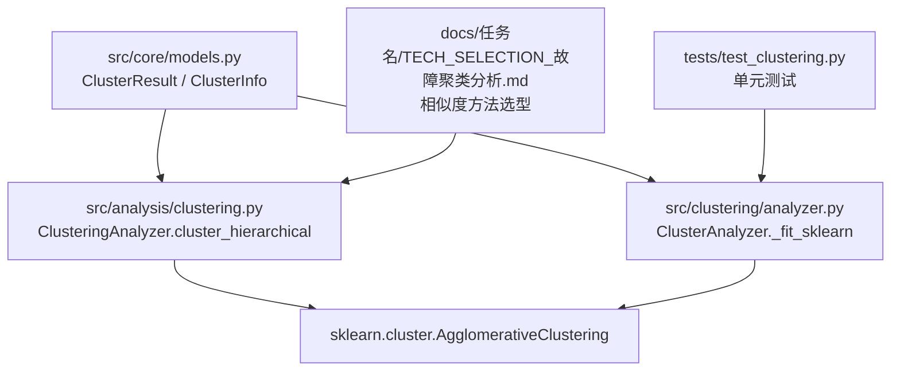
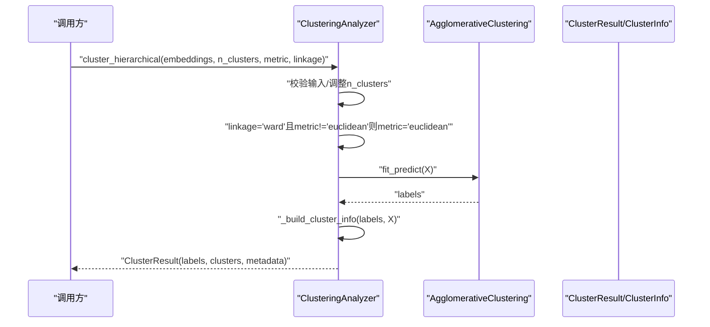
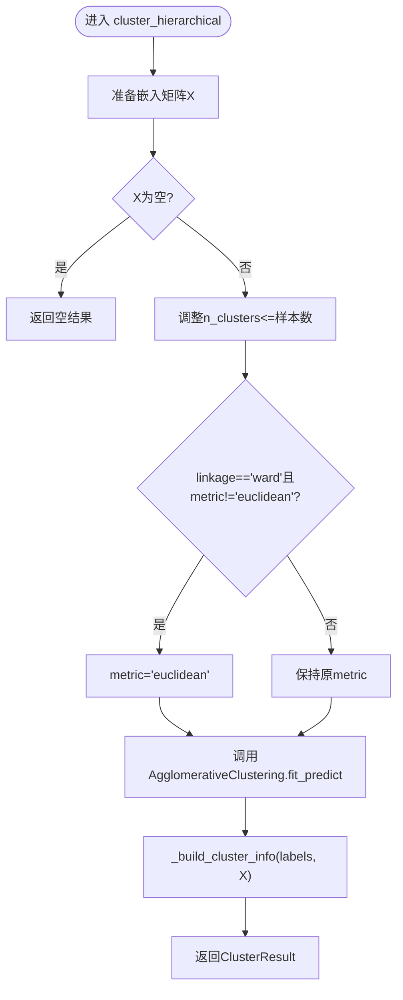
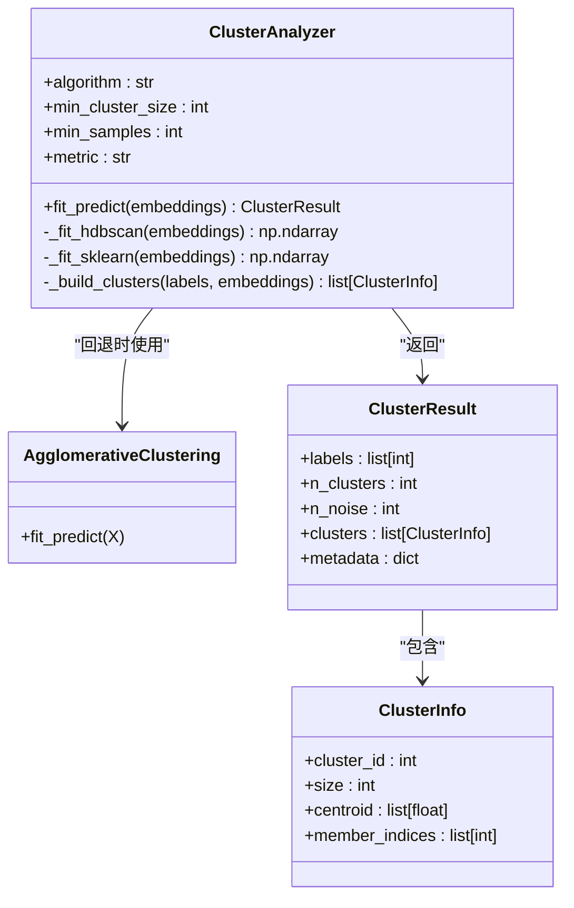
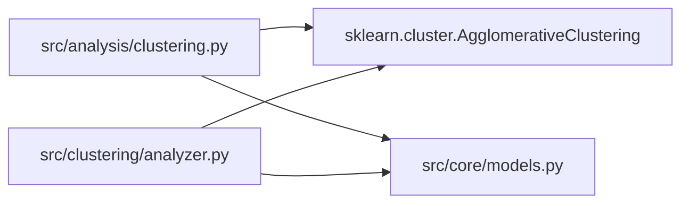

# 层次聚类算法

<cite>
**本文引用的文件**   
- [src/analysis/clustering.py](file://src/analysis/clustering.py)
- [src/clustering/analyzer.py](file://src/clustering/analyzer.py)
- [src/core/models.py](file://src/core/models.py)
- [tests/test_clustering.py](file://tests/test_clustering.py)
- [docs/任务名/TECH_SELECTION_故障聚类分析.md](file://docs/任务名/TECH_SELECTION_故障聚类分析.md)
</cite>

## 目录
1. [简介](#简介)
2. [项目结构](#项目结构)
3. [核心组件](#核心组件)
4. [架构总览](#架构总览)
5. [详细组件分析](#详细组件分析)
6. [依赖关系分析](#依赖关系分析)
7. [性能与复杂度](#性能与复杂度)
8. [使用指南与示例](#使用指南与示例)
9. [与其他聚类算法对比](#与其他聚类算法对比)
10. [故障排查](#故障排查)
11. [结论](#结论)

## 简介
本技术文档聚焦于层次聚类（Agglomerative Clustering）在本仓库中的实现与应用，围绕自底向上的聚合过程、连接方式（ward、complete、average、single）、距离度量（metric）尤其是 ward 对欧氏距离的要求、树状图构建与切割策略、参数选择与业务适配、计算复杂度与内存消耗、以及与其他聚类算法的对比展开。文档同时结合代码路径与测试用例，帮助读者快速理解并正确使用该能力。

## 项目结构
与层次聚类相关的核心代码位于以下位置：
- 高层聚类分析器：src/analysis/clustering.py
- 兼容型聚类分析器（含 sklearn 回退）：src/clustering/analyzer.py
- 统一数据模型：src/core/models.py
- 相关测试：tests/test_clustering.py
- 相似度方法选型参考：docs/任务名/TECH_SELECTION_故障聚类分析.md

图表来源
- [src/analysis/clustering.py:158-226](file://src/analysis/clustering.py#L158-L226)
- [src/clustering/analyzer.py:73-95](file://src/clustering/analyzer.py#L73-L95)
- [src/core/models.py:210-231](file://src/core/models.py#L210-L231)
- [tests/test_clustering.py:1-120](file://tests/test_clustering.py#L1-L120)
- [docs/任务名/TECH_SELECTION_故障聚类分析.md:51-76](file://docs/任务名/TECH_SELECTION_故障聚类分析.md#L51-L76)

章节来源
- [src/analysis/clustering.py:158-226](file://src/analysis/clustering.py#L158-L226)
- [src/clustering/analyzer.py:73-95](file://src/clustering/analyzer.py#L73-L95)
- [src/core/models.py:210-231](file://src/core/models.py#L210-L231)
- [tests/test_clustering.py:1-120](file://tests/test_clustering.py#L1-L120)
- [docs/任务名/TECH_SELECTION_故障聚类分析.md:51-76](file://docs/任务名/TECH_SELECTION_故障聚类分析.md#L51-L76)

## 核心组件
- 高层聚类分析器 ClusteringAnalyzer
  - 提供 cluster_hierarchical(embeddings, n_clusters, metric, linkage) 接口，内部调用 sklearn 的 AgglomerativeClustering。
  - 当 linkage="ward" 且 metric 非 "euclidean" 时，自动将 metric 强制为 "euclidean"，以满足 ward 连接的数学约束。
- 兼容型聚类分析器 ClusterAnalyzer
  - 在 HDBSCAN 不可用时，回退到 sklearn 的 AgglomerativeClustering，默认使用 linkage="ward" 和 metric="euclidean"；若 metric="cosine"，会先对向量进行 L2 归一化，再用欧氏距离近似余弦相似度。
- 数据模型
  - ClusterResult：包含 labels、n_clusters、n_noise、clusters、metadata 等字段。
  - ClusterInfo：包含 cluster_id、size、centroid、member_indices 等字段。

章节来源
- [src/analysis/clustering.py:158-226](file://src/analysis/clustering.py#L158-L226)
- [src/clustering/analyzer.py:73-95](file://src/clustering/analyzer.py#L73-L95)
- [src/core/models.py:210-231](file://src/core/models.py#L210-L231)

## 架构总览
层次聚类的调用流程如下：

图表来源
- [src/analysis/clustering.py:158-226](file://src/analysis/clustering.py#L158-L226)
- [src/core/models.py:210-231](file://src/core/models.py#L210-L231)

## 详细组件分析

### 组件A：ClusteringAnalyzer.cluster_hierarchical
- 功能要点
  - 接收嵌入矩阵 embeddings，支持指定 n_clusters、metric、linkage。
  - 当 linkage="ward" 且 metric 不为 "euclidean" 时，自动修正 metric 为 "euclidean"。
  - 调用 sklearn 的 AgglomerativeClustering 完成训练与预测，返回标签与簇信息。
- 关键行为
  - 自动裁剪 n_clusters 不超过样本数。
  - 记录日志与元数据（algorithm、params）。
- 适用场景
  - 中小规模数据，需要可解释的层次结构与树状图。
  - 希望使用 ward 连接以获得方差最小化的合并准则。

图表来源
- [src/analysis/clustering.py:158-226](file://src/analysis/clustering.py#L158-L226)

章节来源
- [src/analysis/clustering.py:158-226](file://src/analysis/clustering.py#L158-L226)

### 组件B：ClusterAnalyzer._fit_sklearn（兼容回退）
- 功能要点
  - 当 HDBSCAN 不可用或显式选择 sklearn 回退时，使用 AgglomerativeClustering。
  - 默认 linkage="ward"，metric="euclidean"。
  - 若 metric="cosine"，先对向量做 L2 归一化，再使用欧氏距离近似余弦相似度。
- 关键行为
  - 根据 min_cluster_size 估算 n_clusters。
  - 构造 ClusterResult 并返回。

图表来源
- [src/clustering/analyzer.py:73-95](file://src/clustering/analyzer.py#L73-L95)
- [src/core/models.py:210-231](file://src/core/models.py#L210-L231)

章节来源
- [src/clustering/analyzer.py:73-95](file://src/clustering/analyzer.py#L73-L95)
- [src/core/models.py:210-231](file://src/core/models.py#L210-L231)

### 连接方式（linkage）与距离度量（metric）
- 支持的连接方式
  - ward：基于方差增量最小化原则，要求使用欧氏距离。
  - complete：最大距离（最远点距离）。
  - average：平均距离。
  - single：最小距离（最近点距离）。
- 距离度量
  - euclidean：欧氏距离，ward 连接必须使用。
  - cosine：余弦相似度对应的距离；在 sklearn 中需配合适当的预处理（如归一化）以等价于方向相似性。
- 仓库中的处理
  - 当 linkage="ward" 且 metric 非 "euclidean" 时，自动将 metric 设为 "euclidean"。
  - 在兼容回退路径中，若 metric="cosine"，先对向量进行 L2 归一化，再用欧氏距离近似余弦相似度。

章节来源
- [src/analysis/clustering.py:191-194](file://src/analysis/clustering.py#L191-L194)
- [src/clustering/analyzer.py:80-92](file://src/clustering/analyzer.py#L80-L92)
- [docs/任务名/TECH_SELECTION_故障聚类分析.md:51-76](file://docs/任务名/TECH_SELECTION_故障聚类分析.md#L51-L76)

### 树状图（dendrogram）构建与切割策略
- 树状图构建
  - 层次聚类通过自底向上逐步合并最近的两个簇，形成一棵二叉树（树状图），每个节点代表一次合并及其距离。
- 切割策略
  - 固定簇数量：在树状图上按目标 n_clusters 水平切割，得到最终簇划分。
  - 阈值切割：设定距离阈值，高于该阈值的合并将被截断，从而确定簇的数量。
- 可视化建议
  - 可使用 scipy 的 dendrogram 绘制树状图，并结合肘部法则或业务先验选择切割点。
  - 对于大规模数据，可在降维后展示二维投影辅助观察，但注意投影可能引入失真。

说明：本节为概念性内容，不直接对应具体源码文件，故不附“章节来源”。

## 依赖关系分析
- 模块耦合
  - src/analysis/clustering.py 依赖 sklearn.cluster.AgglomerativeClustering 与 src/core/models.py 的数据模型。
  - src/clustering/analyzer.py 在回退路径中使用相同的 sklearn 实现，并通过相同的数据模型输出。
- 外部依赖
  - sklearn.cluster.AgglomerativeClustering：核心层次聚类实现。
  - numpy：数值计算基础。
  - pydantic：数据模型校验与序列化。

图表来源
- [src/analysis/clustering.py:158-226](file://src/analysis/clustering.py#L158-L226)
- [src/clustering/analyzer.py:73-95](file://src/clustering/analyzer.py#L73-L95)
- [src/core/models.py:210-231](file://src/core/models.py#L210-L231)

章节来源
- [src/analysis/clustering.py:158-226](file://src/analysis/clustering.py#L158-L226)
- [src/clustering/analyzer.py:73-95](file://src/clustering/analyzer.py#L73-L95)
- [src/core/models.py:210-231](file://src/core/models.py#L210-L231)

## 性能与复杂度
- 时间复杂度
  - 朴素实现 O(n^3)，常用优化实现 O(n^2 log n)。
- 空间复杂度
  - 通常需要 O(n^2) 存储距离矩阵或更新表。
- 大数据集考量
  - 当 n 较大时，层次聚类的内存与时间开销显著上升，建议：
    - 先降维（如 PCA/UMAP）再聚类。
    - 采用采样或分块策略。
    - 优先选择 K-Means/HDBSCAN 等更高效的算法。
- 仓库中的实践
  - 在兼容回退路径中，若 metric="cosine"，先对向量进行 L2 归一化，再用欧氏距离近似余弦相似度，有助于提升计算效率与稳定性。

章节来源
- [src/clustering/analyzer.py:80-92](file://src/clustering/analyzer.py#L80-L92)

## 使用指南与示例
- 如何选择连接方式与距离度量
  - 若关注簇内方差最小化且数据适合欧氏距离，优先选择 linkage="ward"，metric="euclidean"。
  - 若强调语义方向相似性，可选择 metric="cosine"，并在必要时对向量进行归一化；注意 ward 连接不支持非欧氏距离，此时应改用 other linkage（如 complete/average/single）。
- 如何确定合适的簇数量
  - 业务先验：根据领域知识预估类别数。
  - 树状图切割：观察合并距离的跳跃点，选择合适阈值。
  - 指标评估：轮廓系数、Calinski-Harabasz 指数等（可在外部工具中计算）。
- 代码示例路径（不直接粘贴代码）
  - 使用高层接口进行层次聚类：参见 [src/analysis/clustering.py:158-226](file://src/analysis/clustering.py#L158-L226)
  - 兼容回退路径与余弦近似：参见 [src/clustering/analyzer.py:73-95](file://src/clustering/analyzer.py#L73-L95)
  - 单元测试覆盖基本行为：参见 [tests/test_clustering.py:1-120](file://tests/test_clustering.py#L1-L120)
  - 相似度方法选型参考：参见 [docs/任务名/TECH_SELECTION_故障聚类分析.md:51-76](file://docs/任务名/TECH_SELECTION_故障聚类分析.md#L51-L76)

章节来源
- [src/analysis/clustering.py:158-226](file://src/analysis/clustering.py#L158-L226)
- [src/clustering/analyzer.py:73-95](file://src/clustering/analyzer.py#L73-L95)
- [tests/test_clustering.py:1-120](file://tests/test_clustering.py#L1-L120)
- [docs/任务名/TECH_SELECTION_故障聚类分析.md:51-76](file://docs/任务名/TECH_SELECTION_故障聚类分析.md#L51-L76)

## 与其他聚类算法对比
- K-Means
  - 优点：速度快、可扩展性好，适合球形簇。
  - 缺点：需预先指定 k，对异常值敏感，难以发现任意形状簇。
- HDBSCAN
  - 优点：无需预设簇数，能识别噪声点，适应任意形状簇。
  - 缺点：参数调优复杂，高维稀疏数据需谨慎。
- 层次聚类
  - 优点：可解释性强，支持树状图与多粒度切割，适合中小规模数据。
  - 缺点：时间与空间开销大，不适合超大规模数据。

章节来源
- [docs/任务名/TECH_SELECTION_故障聚类分析.md:51-76](file://docs/任务名/TECH_SELECTION_故障聚类分析.md#L51-L76)

## 故障排查
- 常见错误与定位
  - 传入空嵌入矩阵：在兼容回退路径中会抛出异常，检查输入是否为空。
  - 维度不一致：确保 embeddings 的形状一致，避免长度不匹配。
  - 单一样本：某些算法无法有效聚类，需增加样本或调整参数。
- 调试建议
  - 打印中间结果（labels、n_clusters、n_noise）。
  - 检查 metric 与 linkage 的组合是否合法（ward 仅支持欧氏距离）。
  - 对高维数据进行降维后再聚类，便于可视化与诊断。

章节来源
- [src/clustering/analyzer.py:22-35](file://src/clustering/analyzer.py#L22-L35)
- [tests/test_clustering.py:57-70](file://tests/test_clustering.py#L57-L70)

## 结论
- 层次聚类在本仓库中通过 sklearn 的 AgglomerativeClustering 实现，提供了清晰的 API 与健壮的错误处理。
- 对于 ward 连接，务必使用欧氏距离；若需余弦相似度，请先对向量进行归一化并使用其他连接方式。
- 树状图为层次聚类的核心可视化工具，结合业务需求与指标评估选择合适的切割策略。
- 在大数据集上，优先考虑 K-Means 或 HDBSCAN；若必须使用层次聚类，请结合降维与采样策略控制资源消耗。