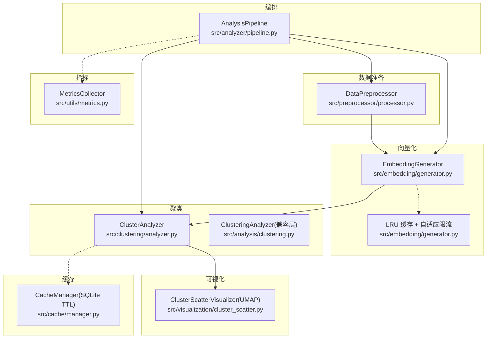
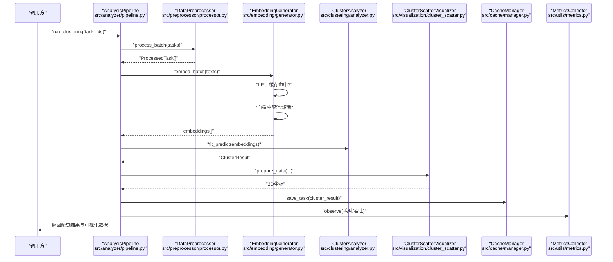
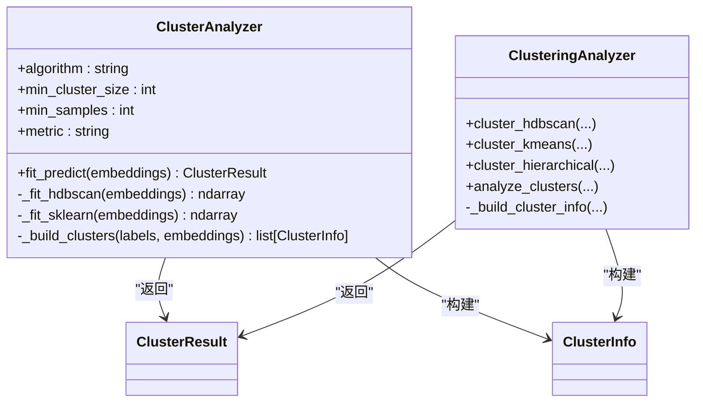
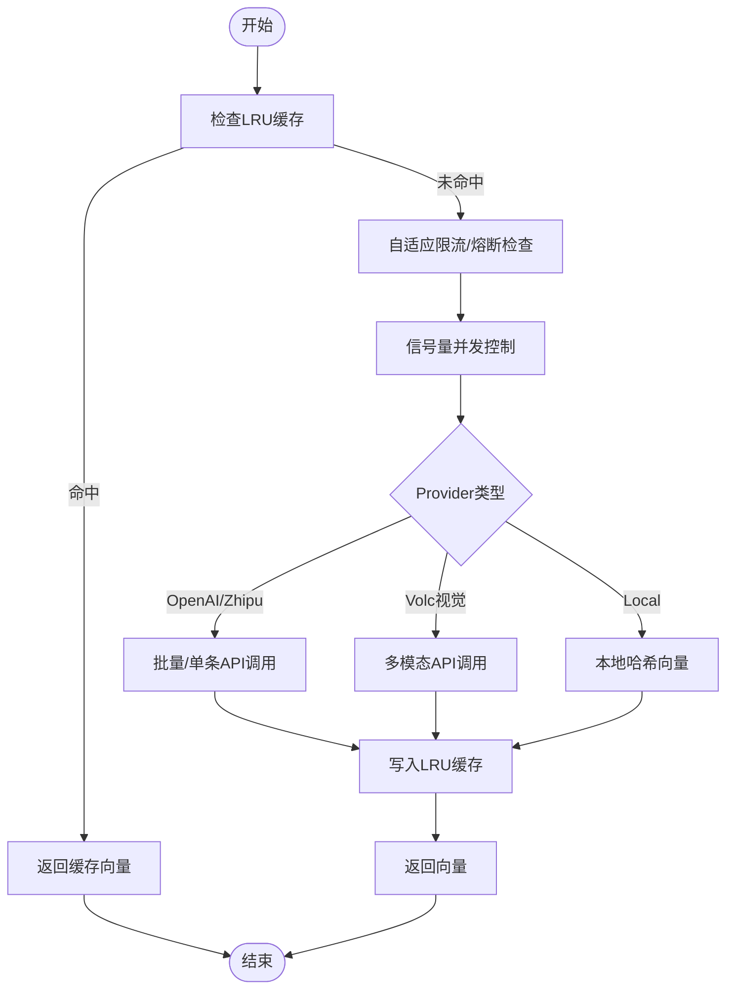
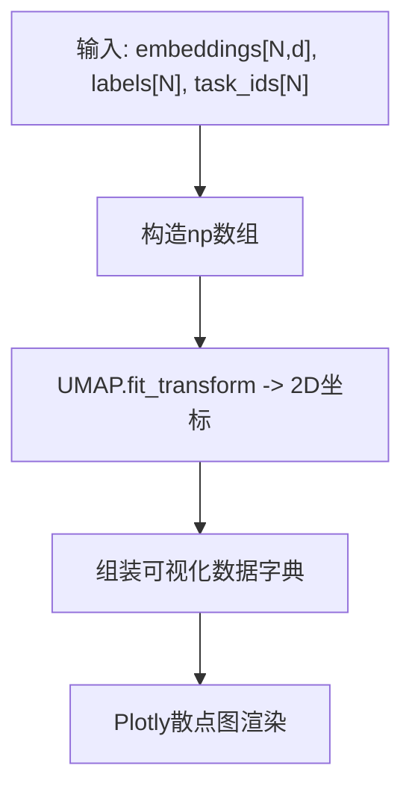
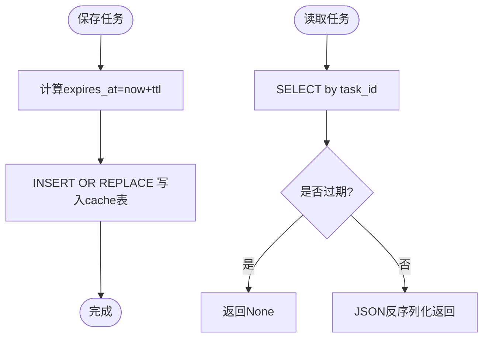
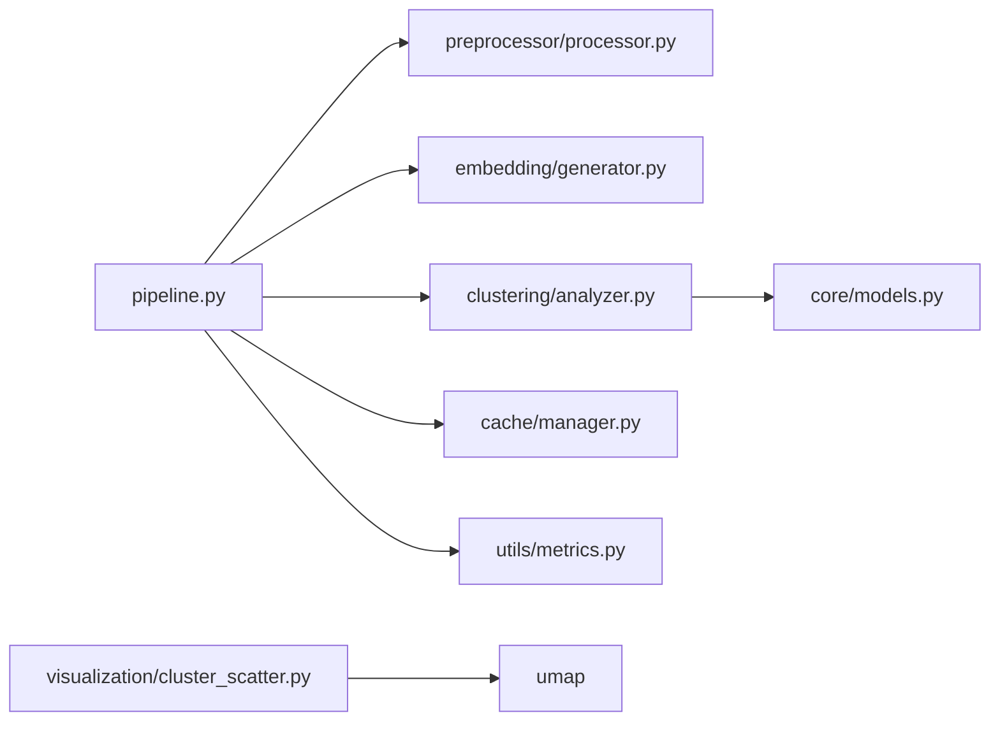

# 聚类性能优化

<cite>
**本文引用的文件**   
- [src/analysis/clustering.py](file://src/analysis/clustering.py)
- [src/clustering/analyzer.py](file://src/clustering/analyzer.py)
- [src/embedding/generator.py](file://src/embedding/generator.py)
- [src/preprocessor/processor.py](file://src/preprocessor/processor.py)
- [src/cache/manager.py](file://src/cache/manager.py)
- [src/utils/metrics.py](file://src/utils/metrics.py)
- [src/core/models.py](file://src/core/models.py)
- [src/clustering/models.py](file://src/clustering/models.py)
- [src/embedding/models.py](file://src/embedding/models.py)
- [src/analyzer/pipeline.py](file://src/analyzer/pipeline.py)
- [src/visualization/cluster_scatter.py](file://src/visualization/cluster_scatter.py)
- [tests/analysis/test_clustering.py](file://tests/analysis/test_clustering.py)
</cite>

## 目录
1. [引言](#引言)
2. [项目结构](#项目结构)
3. [核心组件](#核心组件)
4. [架构总览](#架构总览)
5. [详细组件分析](#详细组件分析)
6. [依赖关系分析](#依赖关系分析)
7. [性能考量与复杂度分析](#性能考量与复杂度分析)
8. [故障排查指南](#故障排查指南)
9. [结论](#结论)
10. [附录：示例与最佳实践](#附录示例与最佳实践)

## 引言
本技术文档面向大规模数据聚类场景，聚焦于在现有代码库基础上实现高性能、可扩展的聚类方案。内容涵盖数据降维（PCA、UMAP）、批量处理与并发、内存管理（稀疏矩阵、增量学习、流式处理）、计算复杂度权衡、参数自动调优与结果缓存机制、分布式与云部署策略、性能监控指标定义与采集方法、瓶颈识别与调优技巧，以及针对“Bug聚类”的特殊优化建议（文本嵌入压缩与相似度加速）。

## 项目结构
围绕聚类性能优化的关键模块分布如下：
- 预处理与文本组装：src/preprocessor/processor.py
- 向量化与批处理：src/embedding/generator.py
- 聚类算法封装：src/clustering/analyzer.py、src/analysis/clustering.py
- 可视化与降维展示：src/visualization/cluster_scatter.py
- 持久化缓存：src/cache/manager.py
- 指标收集：src/utils/metrics.py
- 模型与数据结构：src/core/models.py、src/clustering/models.py、src/embedding/models.py
- 流水线编排：src/analyzer/pipeline.py

图表来源
- [src/preprocessor/processor.py:1-200](file://src/preprocessor/processor.py#L1-L200)
- [src/embedding/generator.py:1-427](file://src/embedding/generator.py#L1-L427)
- [src/clustering/analyzer.py:1-121](file://src/clustering/analyzer.py#L1-L121)
- [src/analysis/clustering.py:1-316](file://src/analysis/clustering.py#L1-L316)
- [src/visualization/cluster_scatter.py:1-93](file://src/visualization/cluster_scatter.py#L1-L93)
- [src/cache/manager.py:1-165](file://src/cache/manager.py#L1-L165)
- [src/utils/metrics.py:1-252](file://src/utils/metrics.py#L1-L252)
- [src/analyzer/pipeline.py:1-200](file://src/analyzer/pipeline.py#L1-L200)

章节来源
- [src/preprocessor/processor.py:1-200](file://src/preprocessor/processor.py#L1-L200)
- [src/embedding/generator.py:1-427](file://src/embedding/generator.py#L1-L427)
- [src/clustering/analyzer.py:1-121](file://src/clustering/analyzer.py#L1-L121)
- [src/analysis/clustering.py:1-316](file://src/analysis/clustering.py#L1-L316)
- [src/visualization/cluster_scatter.py:1-93](file://src/visualization/cluster_scatter.py#L1-L93)
- [src/cache/manager.py:1-165](file://src/cache/manager.py#L1-L165)
- [src/utils/metrics.py:1-252](file://src/utils/metrics.py#L1-L252)
- [src/analyzer/pipeline.py:1-200](file://src/analyzer/pipeline.py#L1-L200)

## 核心组件
- 数据预处理：将多源字段组合为统一文本片段，控制长度，便于后续嵌入与聚类。
- 向量化生成：支持多提供商、批量并发、LRU 缓存、自适应速率限制与熔断器，降低外部服务压力并提升吞吐。
- 聚类分析：提供 HDBSCAN、K-Means、层次聚类等算法封装；对余弦距离进行归一化等价转换以提升效率。
- 可视化与降维：使用 UMAP 将高维向量降至 2D 用于散点图展示。
- 缓存管理：基于 SQLite 的 TTL 缓存，支持任务级读写、过期清理与统计。
- 指标收集：提供计数器、仪表盘、直方图及 Prometheus 导出能力，支撑性能观测。
- 流水线编排：串联抓取、预处理、嵌入、聚类、报告等步骤，支持并发执行。

章节来源
- [src/preprocessor/processor.py:1-200](file://src/preprocessor/processor.py#L1-L200)
- [src/embedding/generator.py:1-427](file://src/embedding/generator.py#L1-L427)
- [src/clustering/analyzer.py:1-121](file://src/clustering/analyzer.py#L1-L121)
- [src/analysis/clustering.py:1-316](file://src/analysis/clustering.py#L1-L316)
- [src/visualization/cluster_scatter.py:1-93](file://src/visualization/cluster_scatter.py#L1-L93)
- [src/cache/manager.py:1-165](file://src/cache/manager.py#L1-L165)
- [src/utils/metrics.py:1-252](file://src/utils/metrics.py#L1-L252)
- [src/analyzer/pipeline.py:1-200](file://src/analyzer/pipeline.py#L1-L200)

## 架构总览
下图展示了从原始任务到聚类结果的端到端流程，包括预处理、嵌入、聚类、可视化和缓存/指标集成。

图表来源
- [src/analyzer/pipeline.py:184-208](file://src/analyzer/pipeline.py#L184-L208)
- [src/preprocessor/processor.py:193-200](file://src/preprocessor/processor.py#L193-L200)
- [src/embedding/generator.py:245-321](file://src/embedding/generator.py#L245-L321)
- [src/clustering/analyzer.py:22-46](file://src/clustering/analyzer.py#L22-L46)
- [src/visualization/cluster_scatter.py:33-66](file://src/visualization/cluster_scatter.py#L33-L66)
- [src/cache/manager.py:59-76](file://src/cache/manager.py#L59-L76)
- [src/utils/metrics.py:151-226](file://src/utils/metrics.py#L151-L226)

## 详细组件分析

### 组件A：聚类分析器（HDBSCAN/K-Means/层次）
- 设计要点
  - 统一接口 fit_predict，内部根据算法选择分支。
  - 对余弦距离采用 L2 归一化后以欧氏距离近似，减少距离计算开销。
  - 构建 ClusterInfo 列表，包含簇中心、成员索引等元信息。
- 复杂度
  - HDBSCAN：时间 O(N log N)~O(N^2) 取决于实现与数据分布；空间 O(N·d)。
  - K-Means：时间 O(I·N·k·d)，I 迭代次数，k 簇数，d 维度；空间 O((N+k)·d)。
  - 层次聚类：时间 O(N^3) 或 O(N^2 log N)；空间 O(N^2)。
- 优化建议
  - 大数据量优先 HDBSCAN，配合 min_cluster_size/min_samples 调整。
  - 小样本或需要稳定簇数时选 K-Means，结合肘部法/轮廓系数自动调参。
  - 层次聚类仅用于小规模数据或树状图展示。

图表来源
- [src/clustering/analyzer.py:8-121](file://src/clustering/analyzer.py#L8-L121)
- [src/analysis/clustering.py:22-316](file://src/analysis/clustering.py#L22-L316)
- [src/core/models.py:210-230](file://src/core/models.py#L210-L230)

章节来源
- [src/clustering/analyzer.py:1-121](file://src/clustering/analyzer.py#L1-L121)
- [src/analysis/clustering.py:1-316](file://src/analysis/clustering.py#L1-L316)
- [src/core/models.py:210-230](file://src/core/models.py#L210-L230)

### 组件B：嵌入生成器（批处理、并发、缓存、限流）
- 设计要点
  - 支持多提供商（OpenAI/Zhipu/Volcengine/Local），统一异步接口。
  - 内置 LRU 缓存（按文本哈希键+TTL），显著降低重复请求。
  - 自适应速率限制器与信号量并发控制，避免超限与资源争用。
  - 熔断器保护下游服务，失败退避与恢复。
- 复杂度
  - 单次嵌入：O(d) 向量生成；批量：O(B·d) 其中 B 为批次大小。
  - 缓存命中：O(1) 平均；未命中：网络 I/O 主导。
- 优化建议
  - 增大 batch_size 与 max_concurrency 需结合服务端 QPS 限制。
  - 长文本分块后再嵌入，避免超长输入导致失败或精度下降。
  - 本地模式可用于离线测试与快速验证。

图表来源
- [src/embedding/generator.py:13-52](file://src/embedding/generator.py#L13-L52)
- [src/embedding/generator.py:54-89](file://src/embedding/generator.py#L54-L89)
- [src/embedding/generator.py:162-216](file://src/embedding/generator.py#L162-L216)
- [src/embedding/generator.py:245-321](file://src/embedding/generator.py#L245-L321)
- [src/embedding/generator.py:359-378](file://src/embedding/generator.py#L359-L378)

章节来源
- [src/embedding/generator.py:1-427](file://src/embedding/generator.py#L1-L427)

### 组件C：可视化与降维（UMAP）
- 设计要点
  - 使用 UMAP 将高维嵌入降至 2D，便于散点图展示与交互。
  - 支持自定义 n_neighbors、min_dist 等超参，平衡局部/全局结构保留。
- 复杂度
  - UMAP 训练：近似 O(N·log N)~O(N^2) 取决于实现与邻域搜索策略。
  - 变换：O(N·d')，d' 为目标维度（通常为2）。
- 优化建议
  - 大数据集先采样子集拟合 UMAP，再 transform 全量数据。
  - 若仅需展示，可考虑 PCA 作为快速替代（线性、更快）。

图表来源
- [src/visualization/cluster_scatter.py:14-66](file://src/visualization/cluster_scatter.py#L14-L66)

章节来源
- [src/visualization/cluster_scatter.py:1-93](file://src/visualization/cluster_scatter.py#L1-L93)

### 组件D：缓存管理器（SQLite TTL）
- 设计要点
  - 表结构含 task_id、data、created_at、expires_at，带 expires_at 索引。
  - 提供 get/save/invalidate/cleanup 等方法，支持统计与全量导出。
- 复杂度
  - 读写：O(log N) 索引查找；清理：按过期条件删除。
- 优化建议
  - 定期清理过期条目，避免表膨胀。
  - 大对象序列化注意 JSON 体积，必要时压缩或分片存储。

图表来源
- [src/cache/manager.py:16-35](file://src/cache/manager.py#L16-L35)
- [src/cache/manager.py:59-76](file://src/cache/manager.py#L59-L76)
- [src/cache/manager.py:37-54](file://src/cache/manager.py#L37-L54)
- [src/cache/manager.py:156-165](file://src/cache/manager.py#L156-L165)

章节来源
- [src/cache/manager.py:1-165](file://src/cache/manager.py#L1-L165)

### 组件E：指标收集（Prometheus 格式）
- 设计要点
  - Counter/Gauge/Histogram 三类指标，支持标签聚合与导出。
  - export_prometheus 输出标准格式，便于接入监控系统。
- 复杂度
  - 观察/更新：O(1)；导出：O(K) 其中 K 为指标数量。
- 优化建议
  - 合理设置直方图桶范围，覆盖典型延迟区间。
  - 为不同阶段埋点（预处理、嵌入、聚类、IO），定位瓶颈。

章节来源
- [src/utils/metrics.py:1-252](file://src/utils/metrics.py#L1-L252)

### 组件F：流水线编排（并发与缓存集成）
- 设计要点
  - run_clustering 并行抓取任务，批量预处理与嵌入，调用聚类器，产出结果。
  - 可与缓存与指标系统联动，形成闭环。
- 复杂度
  - 并发抓取与嵌入：受限于网络与CPU；整体吞吐由最慢环节决定。
- 优化建议
  - 对缺失任务做容错与重试。
  - 对大批次嵌入进行分批与背压控制。

章节来源
- [src/analyzer/pipeline.py:184-208](file://src/analyzer/pipeline.py#L184-L208)

## 依赖关系分析
- 模块耦合
  - pipeline 依赖 preprocessor、embedding、clustering、cache、metrics。
  - clustering.analyzer 依赖 core.models 中的 ClusterResult/ClusterInfo。
  - visualization 依赖 umap 与 plotly。
- 外部依赖
  - hdbscan、sklearn.cluster、umap、plotly、httpx、openai SDK。
- 潜在循环
  - 当前未见直接循环导入；保持分层清晰。

图表来源
- [src/analyzer/pipeline.py:1-200](file://src/analyzer/pipeline.py#L1-L200)
- [src/clustering/analyzer.py:1-121](file://src/clustering/analyzer.py#L1-L121)
- [src/core/models.py:210-230](file://src/core/models.py#L210-L230)
- [src/visualization/cluster_scatter.py:1-93](file://src/visualization/cluster_scatter.py#L1-L93)

章节来源
- [src/analyzer/pipeline.py:1-200](file://src/analyzer/pipeline.py#L1-L200)
- [src/clustering/analyzer.py:1-121](file://src/clustering/analyzer.py#L1-L121)
- [src/core/models.py:210-230](file://src/core/models.py#L210-L230)
- [src/visualization/cluster_scatter.py:1-93](file://src/visualization/cluster_scatter.py#L1-L93)

## 性能考量与复杂度分析
- 时间复杂度权衡
  - 预处理：线性 O(N·L)，L 为平均文本长度。
  - 嵌入：批量 O(B·d)，B 为批次大小，d 为向量维度。
  - 聚类：HDBSCAN 近似 O(N log N)~O(N^2)；K-Means O(I·N·k·d)；层次 O(N^3)。
  - 降维：UMAP 近似 O(N log N)~O(N^2)；PCA O(N·d^2)。
- 空间复杂度
  - 嵌入矩阵 O(N·d)；相似度矩阵 O(N^2)（仅在需要时计算）。
  - 缓存与数据库：随条目增长线性增加。
- 内存优化
  - 使用 np.float32 存储嵌入以降低内存占用。
  - 对超大 N 采用分块处理与增量学习（如 MiniBatchKMeans）。
  - 稀疏表示适用于词袋/TF-IDF 特征，但语义嵌入多为稠密向量。
- 并发与批处理
  - 通过 asyncio.Semaphore 控制并发度；batch_size 与 max_concurrency 需联合调优。
  - 自适应限流与熔断器保障稳定性。
- 降维策略
  - 大数据集先用 PCA 快速降维至中等维度，再用 UMAP 精细降维。
  - 仅展示时可跳过 UMAP，直接使用 PCA 2D。
- 相似度加速
  - 余弦相似度等价于归一化后的欧氏距离，可在聚类前一次性归一化。
  - 批量矩阵乘法计算相似度矩阵，利用 BLAS 加速。

章节来源
- [src/clustering/analyzer.py:48-95](file://src/clustering/analyzer.py#L48-L95)
- [src/embedding/generator.py:410-426](file://src/embedding/generator.py#L410-L426)
- [src/visualization/cluster_scatter.py:14-31](file://src/visualization/cluster_scatter.py#L14-L31)

## 故障排查指南
- 常见问题
  - 空嵌入或空数据：确保预处理过滤空文本，聚类器对空输入有安全返回。
  - 外部 API 限流/熔断：检查自适应限流与熔断器状态，适当降低并发或增大 TTL。
  - 缓存失效：确认 TTL 配置与过期清理任务是否运行。
  - 可视化失败：检查 UMAP 输入维度与数据一致性。
- 定位手段
  - 使用 MetricsCollector 记录各阶段耗时与计数，导出 Prometheus 格式进行监控。
  - 查看日志与异常堆栈，关注断言与错误提示。
- 修复建议
  - 调整 batch_size/max_concurrency 与 min_cluster_size/min_samples。
  - 对长文本进行分块与截断，避免超出模型上下文窗口。
  - 定期清理 SQLite 缓存，避免磁盘与查询性能退化。

章节来源
- [src/utils/metrics.py:151-226](file://src/utils/metrics.py#L151-L226)
- [src/cache/manager.py:156-165](file://src/cache/manager.py#L156-L165)
- [src/embedding/generator.py:178-216](file://src/embedding/generator.py#L178-L216)
- [tests/analysis/test_clustering.py:39-71](file://tests/analysis/test_clustering.py#L39-L71)

## 结论
通过在预处理、嵌入、聚类、可视化与缓存/指标各环节的系统性优化，本项目能够在大规模 Bug 数据上实现高效、稳定的聚类与分析。推荐在生产环境采用 HDBSCAN 为主、K-Means 为辅的策略，结合 UMAP/PCA 降维与并发批处理，辅以 LRU 缓存与 SQLite TTL 持久化，并通过指标体系持续监控与调优。

## 附录：示例与最佳实践
- 数据预处理优化
  - 路径参考：[src/preprocessor/processor.py:1-200](file://src/preprocessor/processor.py#L1-L200)
  - 建议：按字段分段、合并、截断，保证嵌入质量与长度可控。
- 算法参数自动调优
  - 路径参考：[src/clustering/analyzer.py:48-95](file://src/clustering/analyzer.py#L48-L95)、[src/analysis/clustering.py:25-93](file://src/analysis/clustering.py#L25-L93)
  - 建议：网格搜索/贝叶斯优化 min_cluster_size/min_samples/n_clusters，结合轮廓系数/CH 指数评估。
- 结果缓存机制
  - 路径参考：[src/cache/manager.py:59-76](file://src/cache/manager.py#L59-L76)、[src/embedding/generator.py:13-52](file://src/embedding/generator.py#L13-L52)
  - 建议：任务级与嵌入级双缓存，TTL 与清理策略协同。
- 分布式与云平台部署
  - 方向：将 EmbeddingGenerator 与 ClusterAnalyzer 拆分为微服务，使用消息队列与容器编排；向量检索可选 Milvus/Qdrant/Pinecone。
  - 参考选型文档：[docs/任务名/TECH_SELECTION_故障聚类分析.md:51-106](file://docs/任务名/TECH_SELECTION_故障聚类分析.md#L51-L106)
- 性能监控指标
  - 路径参考：[src/utils/metrics.py:151-226](file://src/utils/metrics.py#L151-L226)
  - 建议：埋点预处理时长、嵌入耗时、聚类耗时、缓存命中率、QPS、错误率。
- Bug聚类特殊优化
  - 文本嵌入压缩：对高维向量进行 PCA 降维或量化（INT8/FP16）以减少内存与传输成本。
  - 相似度加速：批量矩阵乘法计算余弦相似度，或使用 FAISS 进行近似最近邻检索。
  - 流式处理：对海量任务采用分片与增量聚类（MiniBatchKMeans/Streaming HDBSCAN 变体）。

章节来源
- [src/preprocessor/processor.py:1-200](file://src/preprocessor/processor.py#L1-L200)
- [src/clustering/analyzer.py:48-95](file://src/clustering/analyzer.py#L48-L95)
- [src/analysis/clustering.py:25-93](file://src/analysis/clustering.py#L25-L93)
- [src/cache/manager.py:59-76](file://src/cache/manager.py#L59-L76)
- [src/embedding/generator.py:13-52](file://src/embedding/generator.py#L13-L52)
- [docs/任务名/TECH_SELECTION_故障聚类分析.md:51-106](file://docs/任务名/TECH_SELECTION_故障聚类分析.md#L51-L106)
- [src/utils/metrics.py:151-226](file://src/utils/metrics.py#L151-L226)