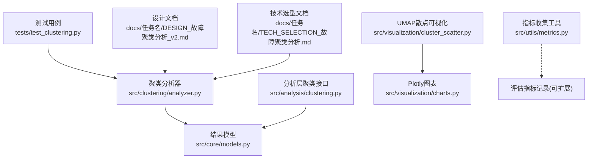
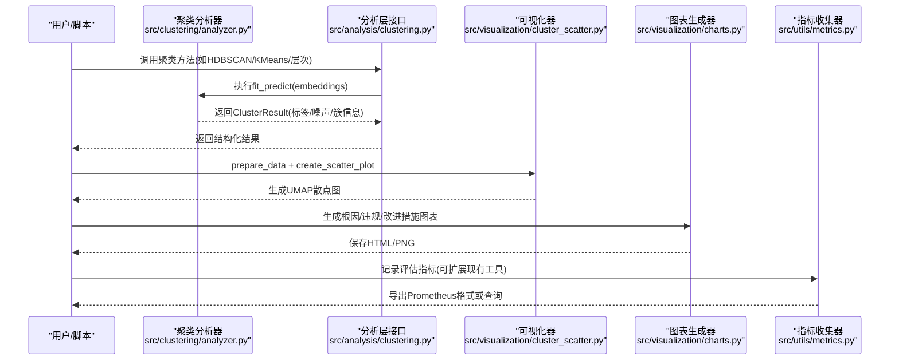
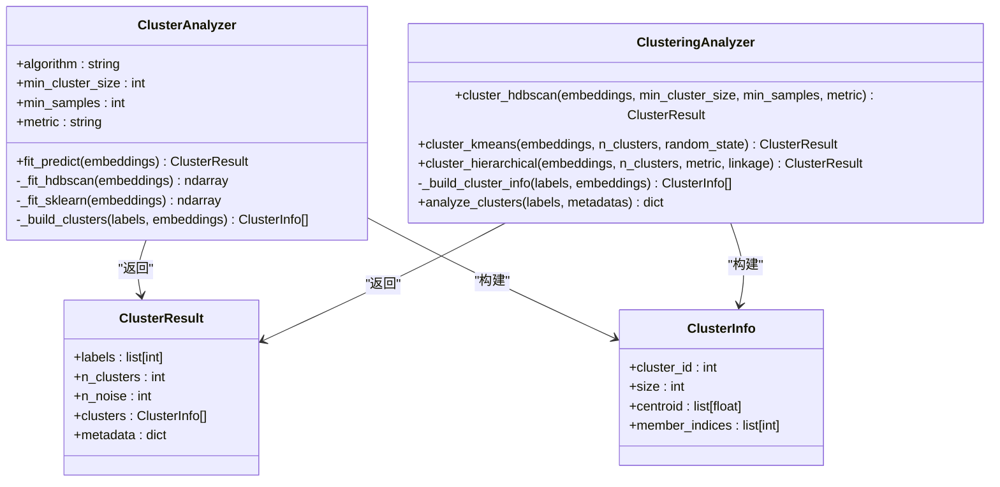

# 聚类质量评估

<cite>
**本文引用的文件**   
- [src/analysis/clustering.py](file://src/analysis/clustering.py)
- [src/clustering/analyzer.py](file://src/clustering/analyzer.py)
- [src/clustering/models.py](file://src/clustering/models.py)
- [src/core/models.py](file://src/core/models.py)
- [src/visualization/cluster_scatter.py](file://src/visualization/cluster_scatter.py)
- [src/visualization/charts.py](file://src/visualization/charts.py)
- [src/utils/metrics.py](file://src/utils/metrics.py)
- [tests/test_clustering.py](file://tests/test_clustering.py)
- [docs/任务名/DESIGN_故障聚类分析_v2.md](file://docs/任务名/DESIGN_故障聚类分析_v2.md)
- [docs/任务名/TECH_SELECTION_故障聚类分析.md](file://docs/任务名/TECH_SELECTION_故障聚类分析.md)
- [docs/任务名/ACCEPTANCE_故障聚类分析_v4.md](file://docs/任务名/ACCEPTANCE_故障聚类分析_v4.md)
</cite>

## 目录
1. [引言](#引言)
2. [项目结构](#项目结构)
3. [核心组件](#核心组件)
4. [架构总览](#架构总览)
5. [详细组件分析](#详细组件分析)
6. [依赖关系分析](#依赖关系分析)
7. [性能考量](#性能考量)
8. [故障排查指南](#故障排查指南)
9. [结论](#结论)
10. [附录](#附录)

## 引言
本技术文档面向“Bug聚类分析”系统中的聚类质量评估能力，系统性地梳理内部与外部评估指标、算法选择与参数调优策略、可视化解读方法，并结合仓库中现有实现给出落地建议。重点覆盖：
- 内部指标：轮廓系数（Silhouette Coefficient）、Calinski-Harabasz指数、Davies-Bouldin指数
- 外部指标：调整兰德指数（ARI）、归一化互信息（NMI）在有标签数据中的应用
- 指标计算流程、取值范围与最佳值含义
- 基于网格搜索与贝叶斯优化的参数调优工作流
- 可视化方法与结果解读
- 针对Bug聚类场景的特定评估策略

## 项目结构
围绕聚类与评估相关代码，主要涉及以下模块：
- 聚类分析器：提供HDBSCAN、K-Means、层次聚类等实现与结果封装
- 可视化：UMAP降维散点图、根因分布图等
- 指标收集：通用计数器/仪表盘/直方图工具，便于扩展记录评估指标
- 测试用例：对聚类结果结构与元数据（含轮廓系数占位）进行验证
- 设计文档：相似度度量选型、算法推荐与验收标准

图示来源
- [src/clustering/analyzer.py:1-121](file://src/clustering/analyzer.py#L1-L121)
- [src/analysis/clustering.py:1-316](file://src/analysis/clustering.py#L1-L316)
- [src/core/models.py](file://src/core/models.py)
- [src/visualization/cluster_scatter.py:1-234](file://src/visualization/cluster_scatter.py#L1-L234)
- [src/visualization/charts.py:1-399](file://src/visualization/charts.py#L1-L399)
- [src/utils/metrics.py:1-252](file://src/utils/metrics.py#L1-L252)
- [tests/test_clustering.py:1-205](file://tests/test_clustering.py#L1-L205)
- [docs/任务名/DESIGN_故障聚类分析_v2.md:228-285](file://docs/任务名/DESIGN_故障聚类分析_v2.md#L228-L285)
- [docs/任务名/TECH_SELECTION_故障聚类分析.md:51-76](file://docs/任务名/TECH_SELECTION_故障聚类分析.md#L51-L76)

章节来源
- [src/clustering/analyzer.py:1-121](file://src/clustering/analyzer.py#L1-L121)
- [src/analysis/clustering.py:1-316](file://src/analysis/clustering.py#L1-L316)
- [src/visualization/cluster_scatter.py:1-234](file://src/visualization/cluster_scatter.py#L1-L234)
- [src/visualization/charts.py:1-399](file://src/visualization/charts.py#L1-L399)
- [src/utils/metrics.py:1-252](file://src/utils/metrics.py#L1-L252)
- [tests/test_clustering.py:1-205](file://tests/test_clustering.py#L1-L205)
- [docs/任务名/DESIGN_故障聚类分析_v2.md:228-285](file://docs/任务名/DESIGN_故障聚类分析_v2.md#L228-L285)
- [docs/任务名/TECH_SELECTION_故障聚类分析.md:51-76](file://docs/任务名/TECH_SELECTION_故障聚类分析.md#L51-L76)

## 核心组件
- 聚类分析器（ClusterAnalyzer）
  - 支持HDBSCAN与sklearn层次聚类回退；在余弦距离下通过L2归一化+欧氏距离等价实现
  - 输出包含标签、噪声计数、簇信息与中心点等
- 分析层聚类接口（ClusteringAnalyzer）
  - 提供HDBSCAN、K-Means、层次聚类的统一入口，返回结构化结果与元数据
- 可视化组件
  - UMAP散点图用于高维向量降维展示聚类分布
  - 根因分布、违规类型、改进措施追踪等图表辅助业务解读
- 指标收集工具
  - 提供Counter/Gauge/Histogram等基础设施，可用于记录评估指标随时间或参数的变化

章节来源
- [src/clustering/analyzer.py:1-121](file://src/clustering/analyzer.py#L1-L121)
- [src/analysis/clustering.py:1-316](file://src/analysis/clustering.py#L1-L316)
- [src/visualization/cluster_scatter.py:1-234](file://src/visualization/cluster_scatter.py#L1-L234)
- [src/visualization/charts.py:1-399](file://src/visualization/charts.py#L1-L399)
- [src/utils/metrics.py:1-252](file://src/utils/metrics.py#L1-L252)

## 架构总览
下图展示了从输入嵌入到聚类结果、再到可视化与指标记录的端到端流程。

图示来源
- [src/clustering/analyzer.py:1-121](file://src/clustering/analyzer.py#L1-L121)
- [src/analysis/clustering.py:1-316](file://src/analysis/clustering.py#L1-L316)
- [src/visualization/cluster_scatter.py:1-234](file://src/visualization/cluster_scatter.py#L1-L234)
- [src/visualization/charts.py:1-399](file://src/visualization/charts.py#L1-L399)
- [src/utils/metrics.py:1-252](file://src/utils/metrics.py#L1-L252)

## 详细组件分析

### 内部评估指标：计算方法、取值范围与最佳值
- 轮廓系数（Silhouette Coefficient）
  - 定义要点：衡量样本与其所属簇内紧密度及与其他簇分离度的综合指标
  - 取值范围：[-1, 1]；越接近1表示聚类越好，接近0表示重叠严重，负值表示可能分错簇
  - 适用性：对凸形簇效果较好；对任意形状簇需结合其他指标
  - 工程现状：设计文档中包含轮廓系数计算示例路径；测试用例中对metadata中的silhouette_score字段进行了断言
- Calinski-Harabasz指数（CH指数）
  - 定义要点：簇间离散度与簇内离散度之比，比值越大越好
  - 取值范围：[0, +∞)；越大表示簇分离度越高、簇内紧凑度越好
  - 适用性：适合球形簇；对维度敏感
- Davies-Bouldin指数（DB指数）
  - 定义要点：每个簇与其最相似簇的平均相似度比值的平均，越小越好
  - 取值范围：[0, +∞)；越小表示簇间分离度越高、簇内紧凑度越好
  - 适用性：对任意形状簇有一定鲁棒性

说明：上述指标的计算可通过scikit-learn对应函数完成。当前仓库在设计文档中给出了轮廓系数的参考实现位置，建议在聚类结果产出后统一接入这些指标计算并写入ClusterResult.metadata，以便后续比较与可视化。

章节来源
- [docs/任务名/DESIGN_故障聚类分析_v2.md:228-285](file://docs/任务名/DESIGN_故障聚类分析_v2.md#L228-L285)
- [tests/test_clustering.py:121-181](file://tests/test_clustering.py#L121-L181)

### 外部评估指标：ARI与NMI在有标签数据中的应用
- 调整兰德指数（Adjusted Rand Index, ARI）
  - 定义要点：基于配对一致性修正的兰德指数，考虑随机期望，取值更稳定
  - 取值范围：[-1, 1]；1表示完全一致，0表示随机划分，负值表示比随机还差
  - 适用性：需要真实标签；对类别不平衡相对稳健
- 归一化互信息（Normalized Mutual Information, NMI）
  - 定义要点：基于信息论的互信息归一化版本，衡量聚类与真实标签的共享信息量
  - 取值范围：[0, 1]；1表示完全一致，0表示相互独立
  - 适用性：需要真实标签；对类别数量差异较不敏感

使用建议：
- 当具备人工标注或历史根因分类作为“真值”时，优先用ARI/NMI评估聚类与真实语义的一致性
- 无标签场景以内部指标为主，辅以可视化和业务抽样检查

章节来源
- [docs/任务名/ACCEPTANCE_故障聚类分析_v4.md:256-305](file://docs/任务名/ACCEPTANCE_故障聚类分析_v4.md#L256-L305)

### 算法选择与参数调优工作流
- 算法选择
  - HDBSCAN：适合不规则形状簇、自动发现簇数、识别噪声点
  - K-Means：适合已知簇数且近似球形的簇
  - 层次聚类：可生成树状图，便于理解层次结构
- 参数调优
  - 网格搜索：遍历关键参数组合（如HDBSCAN的min_cluster_size、min_samples；K-Means的n_clusters），以内部指标（轮廓系数、CH、DB）为主要目标
  - 贝叶斯优化：在高维参数空间或昂贵评估场景下更高效地探索最优参数
- 指标驱动的选择策略
  - 多指标联合：轮廓系数侧重分离度，CH侧重紧凑与分离平衡，DB侧重分离与紧凑的反向度量
  - 稳定性检验：多次随机种子下的指标均值与方差，避免过拟合某次随机初始化

章节来源
- [docs/任务名/TECH_SELECTION_故障聚类分析.md:17-50](file://docs/任务名/TECH_SELECTION_故障聚类分析.md#L17-L50)
- [docs/任务名/TECH_SELECTION_故障聚类分析.md:51-76](file://docs/任务名/TECH_SELECTION_故障聚类分析.md#L51-L76)
- [docs/任务名/ACCEPTANCE_故障聚类分析_v4.md:267-285](file://docs/任务名/ACCEPTANCE_故障聚类分析_v4.md#L267-L285)

### 可视化方法与结果解读
- UMAP散点图
  - 将高维嵌入降至2D，按聚类着色，支持悬停查看任务ID与元数据
  - 解读要点：观察簇的分离度、噪声点比例、异常点位置
- 根因分布/违规类型/改进措施追踪图
  - 柱状图、饼图、横向条形图等，帮助快速把握业务分布与优先级
- 热力图与树状图（需求层面）
  - 相似度热力图与层次聚类树状图有助于理解样本间相似性与层次结构

章节来源
- [src/visualization/cluster_scatter.py:1-234](file://src/visualization/cluster_scatter.py#L1-L234)
- [src/visualization/charts.py:1-399](file://src/visualization/charts.py#L1-L399)
- [docs/任务名/ACCEPTANCE_故障聚类分析_v4.md:194-255](file://docs/任务名/ACCEPTANCE_故障聚类分析_v4.md#L194-L255)

### Bug聚类场景的特定评估策略
- 噪声点占比控制：噪声点过多可能意味着嵌入区分度不足或参数过于保守
- 簇内一致性：同一簇内的故障应具有一致的根因或问题模式
- 簇间差异性：不同簇之间应有明显不同的根因或问题域
- 代表性样本：选取靠近簇中心的样本进行人工复核，确保解释合理
- 指标与业务结合：内部指标仅作为参考，最终决策需结合业务抽样与专家判断

章节来源
- [docs/故障复盘分析系统/MANUAL_VERIFICATION_CHECKLIST.md:279-329](file://docs/故障复盘分析系统/MANUAL_VERIFICATION_CHECKLIST.md#L279-L329)

## 依赖关系分析
- 聚类分析器与结果模型
  - ClusterAnalyzer依赖核心模型ClusterInfo/ClusterResult进行结果封装
- 分析层接口与可视化
  - 分析层接口负责算法调度与结果构建；可视化器消费标签与嵌入数据进行降维与绘图
- 指标收集工具
  - 提供通用基础设施，可被评估模块复用，记录指标时序与分布

图示来源
- [src/clustering/analyzer.py:1-121](file://src/clustering/analyzer.py#L1-L121)
- [src/analysis/clustering.py:1-316](file://src/analysis/clustering.py#L1-L316)
- [src/core/models.py](file://src/core/models.py)

章节来源
- [src/clustering/analyzer.py:1-121](file://src/clustering/analyzer.py#L1-L121)
- [src/analysis/clustering.py:1-316](file://src/analysis/clustering.py#L1-L316)
- [src/core/models.py](file://src/core/models.py)

## 性能考量
- 嵌入预处理
  - 余弦距离通过L2归一化+欧氏距离等价实现，可减少额外距离计算开销
- 算法复杂度
  - HDBSCAN：近似O(n log n)，适合大规模数据
  - K-Means：O(n·k·d·i)，受样本数、簇数、维度与迭代次数影响
  - 层次聚类：O(n^3)或O(n^2 log n)，适合中小规模数据
- 可视化成本
  - UMAP降维与Plotly渲染在大样本下耗时较高，建议采样或分页展示
- 指标记录
  - 使用轻量级指标收集器记录评估指标，避免阻塞主流程

章节来源
- [src/clustering/analyzer.py:54-71](file://src/clustering/analyzer.py#L54-L71)
- [src/visualization/cluster_scatter.py:33-66](file://src/visualization/cluster_scatter.py#L33-L66)
- [src/utils/metrics.py:151-252](file://src/utils/metrics.py#L151-L252)

## 故障排查指南
- 常见问题
  - 空输入：聚类分析器对空嵌入抛出异常，需在调用前校验
  - 单样本：HDBSCAN无法形成有效簇，通常返回全噪声标签
  - 余弦距离：确保先做L2归一化，否则等价性不成立
  - 轮廓系数：至少需要两个非噪声簇才能计算
- 定位步骤
  - 检查输入维度与长度一致性
  - 打印聚类结果中的n_clusters与n_noise，确认是否出现全噪声或单例
  - 若轮廓系数为NaN或报错，检查是否存在足够数量的有效簇
  - 可视化检查：通过UMAP散点图观察簇分布与噪声点比例

章节来源
- [src/clustering/analyzer.py:22-35](file://src/clustering/analyzer.py#L22-L35)
- [tests/test_clustering.py:57-70](file://tests/test_clustering.py#L57-L70)
- [tests/test_clustering.py:121-132](file://tests/test_clustering.py#L121-L132)

## 结论
- 内部指标（轮廓系数、CH、DB）与外部指标（ARI、NMI）互补，共同支撑聚类质量评估
- 算法选择应以数据特性与业务目标为导向：HDBSCAN适合复杂分布，K-Means适合已知簇数，层次聚类适合层次洞察
- 参数调优建议采用网格搜索与贝叶斯优化相结合的策略，并以多指标联合与稳定性检验为依据
- 可视化是结果解读的关键环节，UMAP散点图与业务图表协同提升可解释性
- 在Bug聚类场景中，需结合噪声点比例、簇内一致性与簇间差异性进行综合判断，并通过人工抽样验证

## 附录
- 代码片段路径（不含具体代码内容）
  - 轮廓系数计算参考：[docs/任务名/DESIGN_故障聚类分析_v2.md:228-285](file://docs/任务名/DESIGN_故障聚类分析_v2.md#L228-L285)
  - 聚类结果与元数据（含silhouette_score占位）：[tests/test_clustering.py:121-181](file://tests/test_clustering.py#L121-L181)
  - 余弦距离等价实现（L2归一化+欧氏）：[src/clustering/analyzer.py:54-71](file://src/clustering/analyzer.py#L54-L71)
  - UMAP散点图准备与绘制：[src/visualization/cluster_scatter.py:33-149](file://src/visualization/cluster_scatter.py#L33-L149)
  - 根因/违规/改进措施图表生成：[src/visualization/charts.py:15-332](file://src/visualization/charts.py#L15-L332)
  - 指标收集器（Counter/Gauge/Histogram）：[src/utils/metrics.py:54-252](file://src/utils/metrics.py#L54-L252)
- 算法与相似度选型参考
  - 算法推荐与关键参数说明：[docs/任务名/TECH_SELECTION_故障聚类分析.md:17-50](file://docs/任务名/TECH_SELECTION_故障聚类分析.md#L17-L50)
  - 相似度计算方法对比与推荐：[docs/任务名/TECH_SELECTION_故障聚类分析.md:51-76](file://docs/任务名/TECH_SELECTION_故障聚类分析.md#L51-L76)
- 验收与人工核查清单
  - 聚类合理性判断与人工抽样检查：[docs/故障复盘分析系统/MANUAL_VERIFICATION_CHECKLIST.md:279-329](file://docs/故障复盘分析系统/MANUAL_VERIFICATION_CHECKLIST.md#L279-L329)
  - K-Means支持与肘部法则图需求：[docs/任务名/ACCEPTANCE_故障聚类分析_v4.md:267-285](file://docs/任务名/ACCEPTANCE_故障聚类分析_v4.md#L267-L285)