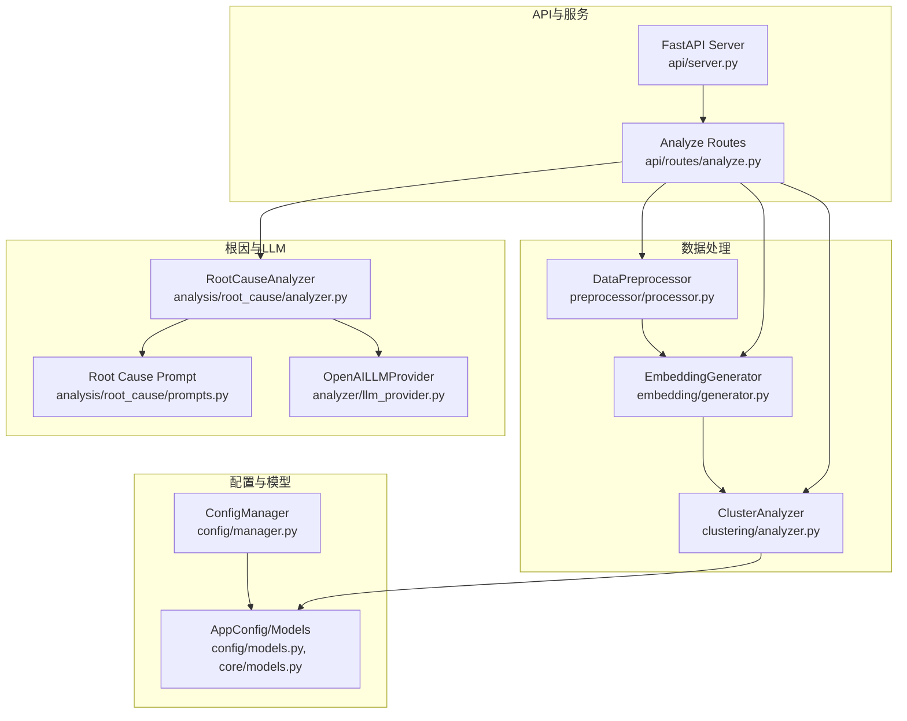
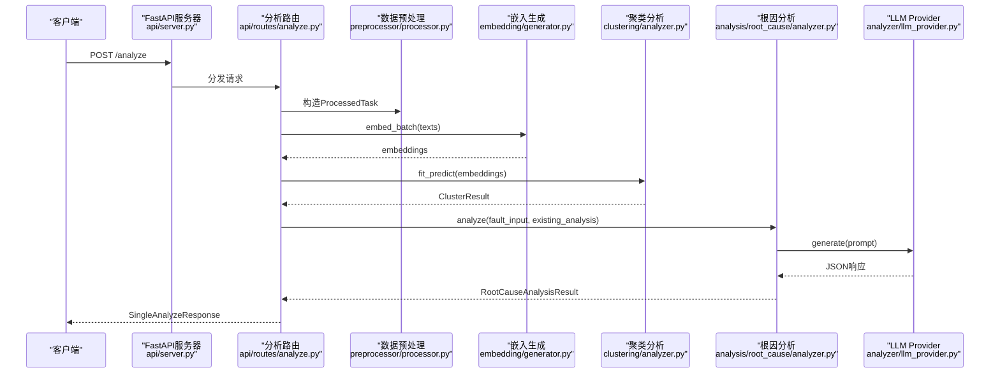
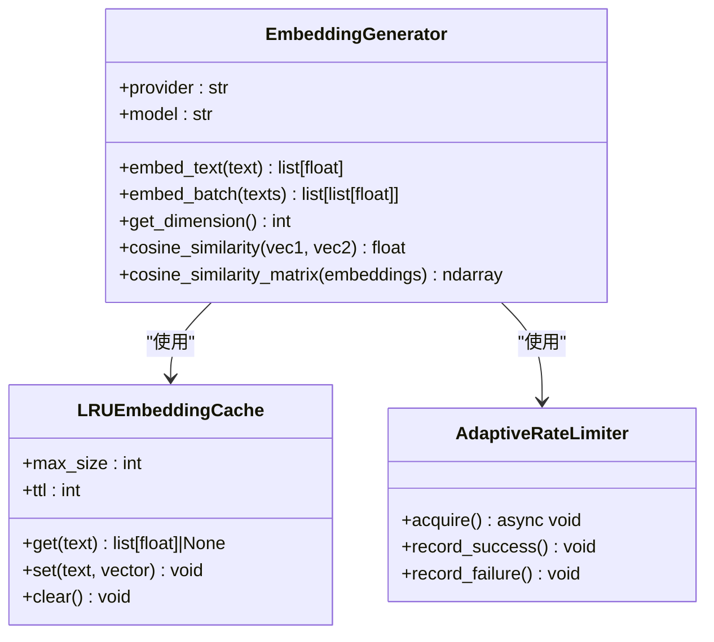
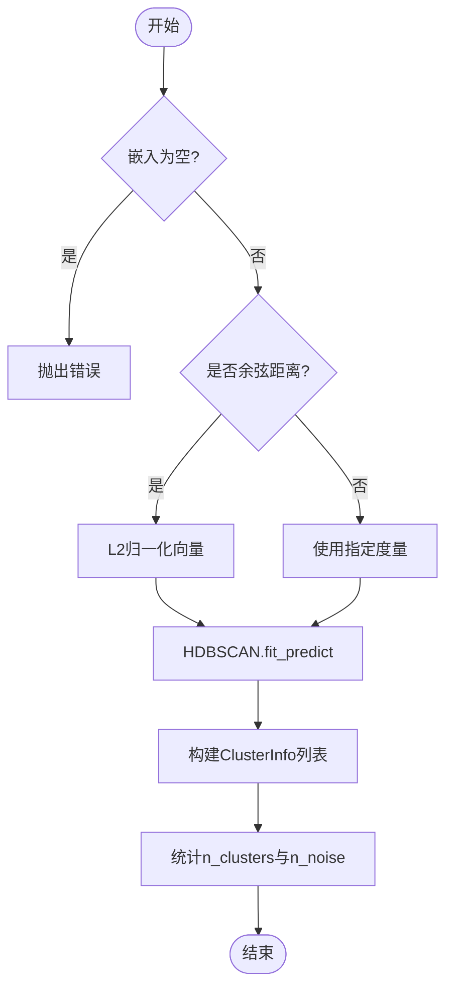
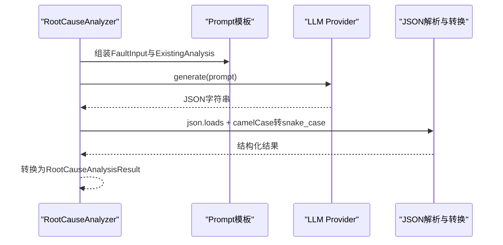
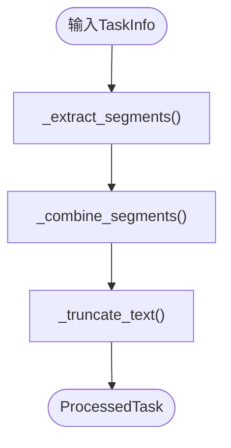
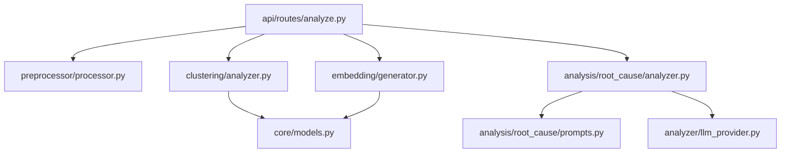

# 数据分析引擎

<cite>
**本文引用的文件**   
- [README.md](file://README.md)
- [src/embedding/generator.py](file://src/embedding/generator.py)
- [src/clustering/analyzer.py](file://src/clustering/analyzer.py)
- [src/analysis/root_cause/analyzer.py](file://src/analysis/root_cause/analyzer.py)
- [src/analysis/root_cause/prompts.py](file://src/analysis/root_cause/prompts.py)
- [src/preprocessor/processor.py](file://src/preprocessor/processor.py)
- [src/analyzer/llm_provider.py](file://src/analyzer/llm_provider.py)
- [src/config/manager.py](file://src/config/manager.py)
- [src/config/models.py](file://src/config/models.py)
- [src/api/server.py](file://src/api/server.py)
- [src/api/routes/analyze.py](file://src/api/routes/analyze.py)
- [src/core/models.py](file://src/core/models.py)
- [src/clustering/models.py](file://src/clustering/models.py)
- [tests/test_clustering.py](file://tests/test_clustering.py)
- [tests/analysis/test_clustering.py](file://tests/analysis/test_clustering.py)
</cite>

## 目录
1. [简介](#简介)
2. [项目结构](#项目结构)
3. [核心组件](#核心组件)
4. [架构总览](#架构总览)
5. [详细组件分析](#详细组件分析)
6. [依赖关系分析](#依赖关系分析)
7. [性能考虑](#性能考虑)
8. [故障排查指南](#故障排查指南)
9. [结论](#结论)
10. [附录：配置与调用示例](#附录配置与调用示例)

## 简介
本技术文档面向“AI驱动的故障复盘分析”系统的数据分析引擎，覆盖文本嵌入生成、向量表示学习与维度降维、多算法聚类（重点HDBSCAN）、根因深度分析的5层追问机制与LLM集成策略、数据预处理流程、算法选择指南与性能优化建议，并提供API集成模式与错误处理策略。文档以代码级事实为依据，辅以可视化图示，帮助读者快速理解并正确使用各分析组件。

## 项目结构
系统采用模块化分层组织：
- 配置与模型：集中管理配置加载、校验与统一数据模型
- 预处理：从任务对象中抽取多源文本片段并组合为可嵌入的输入
- 嵌入生成：支持多种Provider的异步批量向量化，内置LRU缓存、自适应限流与熔断
- 聚类分析：基于HDBSCAN为主的多算法聚类，支持余弦距离等价变换与噪声点识别
- 根因分析：通过Prompt模板驱动LLM进行深层追问与结构化输出
- API服务：FastAPI提供单条/批量分析接口，封装中间件与路由

图表来源
- [src/config/manager.py:1-268](file://src/config/manager.py#L1-L268)
- [src/config/models.py:1-144](file://src/config/models.py#L1-L144)
- [src/preprocessor/processor.py:1-200](file://src/preprocessor/processor.py#L1-L200)
- [src/embedding/generator.py:1-427](file://src/embedding/generator.py#L1-L427)
- [src/clustering/analyzer.py:1-121](file://src/clustering/analyzer.py#L1-L121)
- [src/analysis/root_cause/analyzer.py:1-131](file://src/analysis/root_cause/analyzer.py#L1-L131)
- [src/analysis/root_cause/prompts.py:1-85](file://src/analysis/root_cause/prompts.py#L1-L85)
- [src/analyzer/llm_provider.py:1-67](file://src/analyzer/llm_provider.py#L1-L67)
- [src/api/server.py:1-152](file://src/api/server.py#L1-L152)
- [src/api/routes/analyze.py:1-202](file://src/api/routes/analyze.py#L1-L202)

章节来源
- [README.md:1-101](file://README.md#L1-L101)

## 核心组件
- 配置管理：支持YAML/JSON加载、环境变量覆盖、类型校验与持久化
- 数据预处理：按任务生命周期分段提取（标题、描述、需求、设计、提交、评审、测试、生产日志等），合并并截断
- 嵌入生成：异步并发、批量处理、LRU缓存、自适应QPS限流、熔断器保护；支持多Provider与本地哈希向量
- 聚类分析：HDBSCAN优先，cosine距离通过归一化+欧氏等价实现；自动统计簇数与噪声点数量
- 根因分析：基于结构化Prompt驱动LLM，输出问题分类、初始原因、深层根因、改进措施与检查清单建议
- API服务：提供健康检查、分析、聚类、报告、反馈等路由，含认证与速率限制中间件

章节来源
- [src/config/manager.py:1-268](file://src/config/manager.py#L1-L268)
- [src/config/models.py:1-144](file://src/config/models.py#L1-L144)
- [src/preprocessor/processor.py:1-200](file://src/preprocessor/processor.py#L1-L200)
- [src/embedding/generator.py:1-427](file://src/embedding/generator.py#L1-L427)
- [src/clustering/analyzer.py:1-121](file://src/clustering/analyzer.py#L1-L121)
- [src/analysis/root_cause/analyzer.py:1-131](file://src/analysis/root_cause/analyzer.py#L1-L131)
- [src/analysis/root_cause/prompts.py:1-85](file://src/analysis/root_cause/prompts.py#L1-L85)
- [src/analyzer/llm_provider.py:1-67](file://src/analyzer/llm_provider.py#L1-L67)
- [src/api/server.py:1-152](file://src/api/server.py#L1-L152)
- [src/api/routes/analyze.py:1-202](file://src/api/routes/analyze.py#L1-L202)

## 架构总览
下图展示从API请求到分析结果返回的关键路径，包括预处理、嵌入、聚类与根因分析。

图表来源
- [src/api/server.py:1-152](file://src/api/server.py#L1-L152)
- [src/api/routes/analyze.py:1-202](file://src/api/routes/analyze.py#L1-L202)
- [src/preprocessor/processor.py:1-200](file://src/preprocessor/processor.py#L1-L200)
- [src/embedding/generator.py:1-427](file://src/embedding/generator.py#L1-L427)
- [src/clustering/analyzer.py:1-121](file://src/clustering/analyzer.py#L1-L121)
- [src/analysis/root_cause/analyzer.py:1-131](file://src/analysis/root_cause/analyzer.py#L1-L131)
- [src/analyzer/llm_provider.py:1-67](file://src/analyzer/llm_provider.py#L1-L67)

## 详细组件分析

### 文本嵌入生成模块
- 工作原理
  - 支持多Provider（OpenAI、智谱、火山等）与本地哈希向量；异步并发控制与批量处理
  - 内置LRU缓存（键为文本SHA256），TTL过期清理；自适应QPS限流（成功加速、失败退避）
  - 熔断器保护外部API调用，失败计数达到阈值后拒绝执行并在超时后恢复
  - 余弦相似度计算工具方法用于后续质量评估或近似检索
- 关键数据结构与复杂度
  - LRUCache：O(1) get/set（OrderedDict），空间O(N)
  - 批量嵌入：分批次并发，时间复杂度取决于Provider吞吐与并发度
- 异常值与容错
  - 空文本直接抛错；Provider不可用时触发熔断；网络异常记录失败并回退QPS
- 优化建议
  - 合理设置batch_size与max_concurrency；开启缓存命中热点文本；对高频模型使用专用base_url

图表来源
- [src/embedding/generator.py:1-427](file://src/embedding/generator.py#L1-L427)

章节来源
- [src/embedding/generator.py:1-427](file://src/embedding/generator.py#L1-L427)

### 多算法聚类分析与HDBSCAN调优
- 算法选择与实现
  - HDBSCAN为主：自动发现任意形状簇，无需预设K值，能识别噪声点（label=-1）
  - 余弦距离优化：对向量做L2归一化后用欧氏距离等价计算，提升效率
  - 备选方案：Agglomerative（ward连接，仅欧氏）作为fallback
- 参数调优指南
  - min_cluster_size：过小导致碎片化，过大导致欠拟合；建议从数据规模与领域先验出发
  - min_samples：影响密度阈值，通常小于min_cluster_size；结合噪声比例调整
  - metric：默认cosine，高维稀疏文本常用；若用Euclidean需确保向量已归一化
- 异常值处理
  - 噪声点标记为-1，不参与簇中心计算；可在下游单独分析或过滤
- 复杂度与性能
  - HDBSCAN时间复杂度随样本量与维度增长较快；建议降维或采样后再聚

图表来源
- [src/clustering/analyzer.py:1-121](file://src/clustering/analyzer.py#L1-L121)

章节来源
- [src/clustering/analyzer.py:1-121](file://src/clustering/analyzer.py#L1-L121)
- [tests/test_clustering.py:1-80](file://tests/test_clustering.py#L1-L80)
- [tests/analysis/test_clustering.py:1-169](file://tests/analysis/test_clustering.py#L1-L169)

### 根因深度分析的5层追问机制与LLM集成
- 5层追问机制（概念性说明）
  - 第1层：问题分类（开发引入/测试泄露/需求问题/外部依赖）
  - 第2层：初始原因定位（现有复盘结论为基础）
  - 第3层：场景考虑不全时的“为什么没考虑到？”（设计/编码/测试环节）
  - 第4层：哪个环节的checklist或流程可发现该问题？
  - 第5层：如果是开发引入，具体缺陷成因是什么？（防御性编程、边界条件、异常处理、走查缺失等）
- LLM集成策略
  - 通过结构化Prompt模板引导LLM输出JSON，包含问题分类、初始原因、深层根因、改进措施与检查清单建议
  - 解析响应并进行camelCase到snake_case转换，映射至Pydantic模型
- 错误处理与回退
  - 当LLM不可用时，上层增强分析器会回退到规则验证，保证可用性

图表来源
- [src/analysis/root_cause/analyzer.py:1-131](file://src/analysis/root_cause/analyzer.py#L1-L131)
- [src/analysis/root_cause/prompts.py:1-85](file://src/analysis/root_cause/prompts.py#L1-L85)
- [src/analyzer/llm_provider.py:1-67](file://src/analyzer/llm_provider.py#L1-L67)

章节来源
- [src/analysis/root_cause/analyzer.py:1-131](file://src/analysis/root_cause/analyzer.py#L1-L131)
- [src/analysis/root_cause/prompts.py:1-85](file://src/analysis/root_cause/prompts.py#L1-L85)
- [src/analyzer/llm_provider.py:1-67](file://src/analyzer/llm_provider.py#L1-L67)

### 数据预处理流程（清洗、特征提取、质量评估）
- 文本清洗与分段
  - 从任务对象中提取多源片段：标题、描述、需求、设计、提交信息、评审意见、测试用例/缺陷、生产症状/日志/堆栈/解决方案
  - 将片段拼接为带类型标签的组合文本，便于嵌入与后续解释
- 质量控制
  - 最大长度截断，避免超出模型上下文窗口
  - 过滤空片段，确保至少包含生产相关片段（若无则插入占位）
- 质量评估建议
  - 统计各类型片段数量与长度分布
  - 对过短或缺失关键字段的样本进行告警或人工复核

图表来源
- [src/preprocessor/processor.py:1-200](file://src/preprocessor/processor.py#L1-L200)

章节来源
- [src/preprocessor/processor.py:1-200](file://src/preprocessor/processor.py#L1-L200)

### 配置管理与环境覆盖
- 配置加载与校验
  - 支持YAML/JSON，支持深合并与保存；环境变量覆盖（前缀映射）
  - Pydantic模型校验（如LLM provider枚举、embedding batch_size范围等）
- 关键配置项
  - embedding.provider/model/batch_size、clustering.algorithm/min_cluster_size/min_samples/metric、cache.enabled/ttl/storage/db_path、output.format/directory、logging.level/file

章节来源
- [src/config/manager.py:1-268](file://src/config/manager.py#L1-L268)
- [src/config/models.py:1-144](file://src/config/models.py#L1-L144)

### API集成模式与错误处理
- 路由与中间件
  - FastAPI应用创建、CORS、Token校验、速率限制中间件注册
  - 分析路由支持单条与批量分析，返回统一响应格式
- 错误处理
  - 捕获异常并返回HTTP 500，附带错误码与消息；内部记录详细日志
- 健康检查
  - 提供健康端点用于服务存活探测

章节来源
- [src/api/server.py:1-152](file://src/api/server.py#L1-L152)
- [src/api/routes/analyze.py:1-202](file://src/api/routes/analyze.py#L1-L202)

## 依赖关系分析
- 模块耦合
  - API路由依赖配置管理器与分析流水线；流水线串联预处理、嵌入、聚类与根因分析
  - 根因分析依赖LLM Provider与Prompt模板；聚类分析依赖核心数据模型
- 外部依赖
  - OpenAI SDK（嵌入与聊天）、hdbscan（聚类）、httpx（特定Provider直连）、pydantic（模型校验）

图表来源
- [src/api/routes/analyze.py:1-202](file://src/api/routes/analyze.py#L1-L202)
- [src/preprocessor/processor.py:1-200](file://src/preprocessor/processor.py#L1-L200)
- [src/embedding/generator.py:1-427](file://src/embedding/generator.py#L1-L427)
- [src/clustering/analyzer.py:1-121](file://src/clustering/analyzer.py#L1-L121)
- [src/analysis/root_cause/analyzer.py:1-131](file://src/analysis/root_cause/analyzer.py#L1-L131)
- [src/analysis/root_cause/prompts.py:1-85](file://src/analysis/root_cause/prompts.py#L1-L85)
- [src/analyzer/llm_provider.py:1-67](file://src/analyzer/llm_provider.py#L1-L67)
- [src/core/models.py:1-426](file://src/core/models.py#L1-L426)

## 性能考虑
- 嵌入阶段
  - 启用LRU缓存减少重复调用；根据Provider配额调整batch_size与并发度
  - 对高频文本预热缓存；使用就近数据中心或专线降低延迟
- 聚类阶段
  - 在高维情况下先做降维（如PCA/UMAP）再聚类，显著降低时间与内存开销
  - 对大规模数据分批聚类或采样后再全量微调
- LLM阶段
  - 控制temperature与max_tokens平衡质量与成本；失败重试与熔断保护
- 存储与IO
  - 缓存持久化（SQLite/文件）避免重启丢失；定期清理过期条目

[本节为通用指导，不直接分析具体文件]

## 故障排查指南
- 常见错误与定位
  - 配置校验失败：检查环境变量覆盖与字段范围（如timeout、batch_size、algorithm、metric）
  - 嵌入失败：确认Provider密钥与base_url；查看熔断器状态与QPS回退情况
  - 聚类结果为空或噪声过多：调整min_cluster_size与min_samples；检查向量归一化与距离度量
  - LLM返回非JSON：检查Prompt模板与模型能力；在增强分析器中观察回退逻辑
- 日志与监控
  - 使用loguru记录关键步骤耗时与异常；暴露健康端点与指标收集

章节来源
- [src/config/manager.py:1-268](file://src/config/manager.py#L1-L268)
- [src/embedding/generator.py:1-427](file://src/embedding/generator.py#L1-L427)
- [src/clustering/analyzer.py:1-121](file://src/clustering/analyzer.py#L1-L121)
- [src/analysis/root_cause/analyzer.py:1-131](file://src/analysis/root_cause/analyzer.py#L1-L131)
- [src/api/server.py:1-152](file://src/api/server.py#L1-L152)

## 结论
本引擎以“预处理→嵌入→聚类→根因分析”为主线，结合灵活的配置管理与稳健的错误处理，形成端到端的故障复盘分析能力。HDBSCAN在复杂分布下的鲁棒性与LLM的结构化追问共同提升了根因挖掘的深度与可操作性。通过缓存、限流、熔断与批处理等手段，系统在可扩展性与稳定性方面具备良好基础。

[本节为总结性内容，不直接分析具体文件]

## 附录：配置与调用示例
以下为典型使用流程的代码片段路径指引（不包含具体代码内容）：
- 初始化配置管理器并加载配置
  - [src/config/manager.py:1-268](file://src/config/manager.py#L1-L268)
  - [src/config/models.py:1-144](file://src/config/models.py#L1-L144)
- 预处理任务数据
  - [src/preprocessor/processor.py:1-200](file://src/preprocessor/processor.py#L1-L200)
- 生成文本嵌入（批量）
  - [src/embedding/generator.py:1-427](file://src/embedding/generator.py#L1-L427)
- 执行聚类分析（HDBSCAN）
  - [src/clustering/analyzer.py:1-121](file://src/clustering/analyzer.py#L1-L121)
- 根因分析（LLM驱动）
  - [src/analysis/root_cause/analyzer.py:1-131](file://src/analysis/root_cause/analyzer.py#L1-L131)
  - [src/analysis/root_cause/prompts.py:1-85](file://src/analysis/root_cause/prompts.py#L1-L85)
  - [src/analyzer/llm_provider.py:1-67](file://src/analyzer/llm_provider.py#L1-L67)
- 通过API发起分析请求
  - [src/api/server.py:1-152](file://src/api/server.py#L1-L152)
  - [src/api/routes/analyze.py:1-202](file://src/api/routes/analyze.py#L1-L202)
