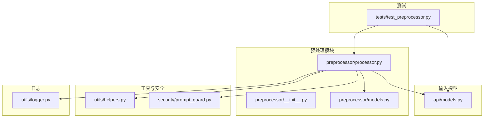
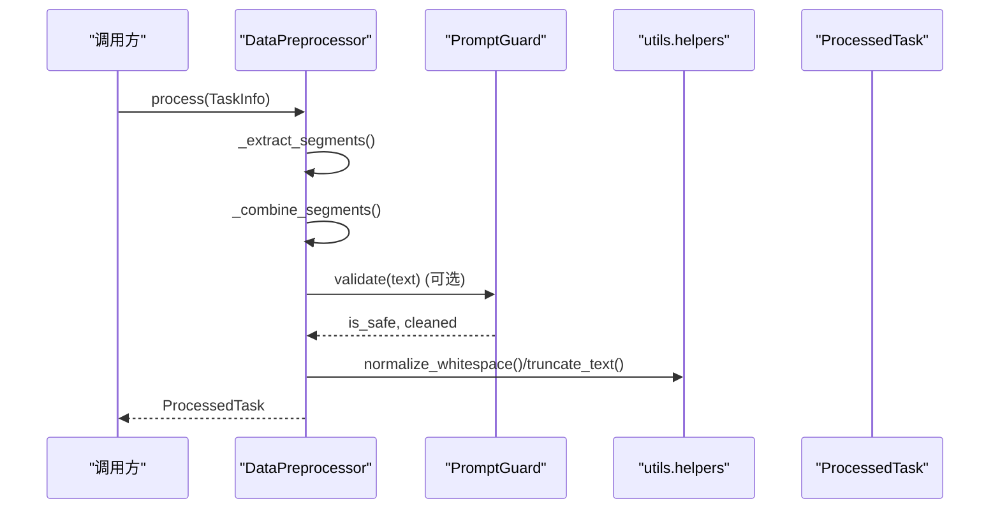
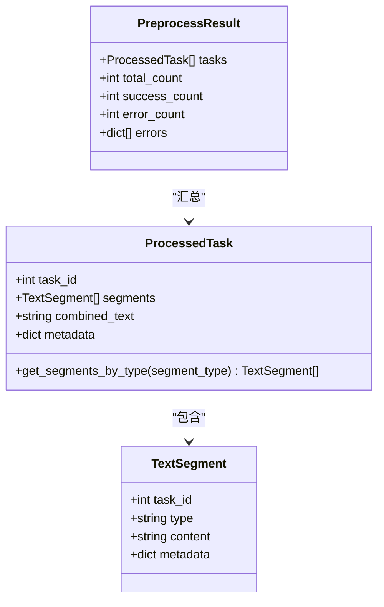
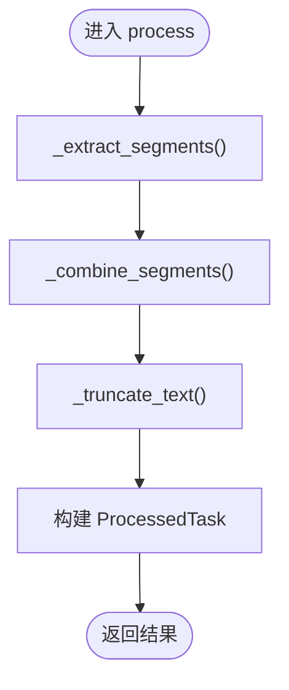
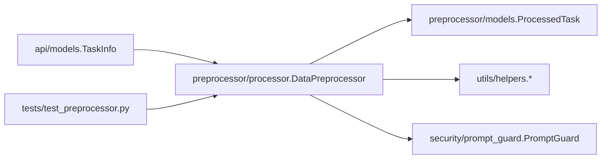

# 数据预处理

<cite>
**本文引用的文件**
- [src/preprocessor/__init__.py](file://src/preprocessor/__init__.py)
- [src/preprocessor/models.py](file://src/preprocessor/models.py)
- [src/preprocessor/processor.py](file://src/preprocessor/processor.py)
- [src/api/models.py](file://src/api/models.py)
- [tests/test_preprocessor.py](file://tests/test_preprocessor.py)
- [src/utils/helpers.py](file://src/utils/helpers.py)
- [src/security/prompt_guard.py](file://src/security/prompt_guard.py)
- [src/utils/logger.py](file://src/utils/logger.py)
</cite>

## 目录
1. [简介](#简介)
2. [项目结构](#项目结构)
3. [核心组件](#核心组件)
4. [架构总览](#架构总览)
5. [详细组件分析](#详细组件分析)
6. [依赖关系分析](#依赖关系分析)
7. [性能与批处理策略](#性能与批处理策略)
8. [数据质量评估与完整性检查](#数据质量评估与完整性检查)
9. [故障单清洗流程与规则](#故障单清洗流程与规则)
10. [特征提取方法](#特征提取方法)
11. [异常处理与日志记录](#异常处理与日志记录)
12. [与其他模块的数据接口与格式规范](#与其他模块的数据接口与格式规范)
13. [常见问题排查](#常见问题排查)
14. [结论](#结论)

## 简介
本技术文档聚焦于“数据预处理”模块，围绕故障单数据的清洗、标准化、噪声过滤、结构化信息抽取、特征提取、数据质量评估与完整性检查、以及批处理管道设计展开。文档同时提供代码级图示与引用路径，帮助读者快速定位实现细节并扩展自定义清洗规则与优化策略。

## 项目结构
预处理模块位于 src/preprocessor，包含模型定义与处理器实现；输入数据模型来自 src/api/models；文本工具与安全校验分别位于 src/utils/helpers.py 与 src/security/prompt_guard.py；日志系统位于 src/utils/logger.py。测试用例集中在 tests/test_preprocessor.py。

图表来源
- [src/preprocessor/processor.py:1-200](file://src/preprocessor/processor.py#L1-L200)
- [src/preprocessor/models.py:1-29](file://src/preprocessor/models.py#L1-L29)
- [src/api/models.py:1-91](file://src/api/models.py#L1-L91)
- [src/utils/helpers.py:1-86](file://src/utils/helpers.py#L1-L86)
- [src/security/prompt_guard.py:1-198](file://src/security/prompt_guard.py#L1-L198)
- [src/utils/logger.py:1-160](file://src/utils/logger.py#L1-L160)
- [tests/test_preprocessor.py:1-244](file://tests/test_preprocessor.py#L1-L244)

章节来源
- [src/preprocessor/__init__.py:1-12](file://src/preprocessor/__init__.py#L1-L12)
- [src/preprocessor/models.py:1-29](file://src/preprocessor/models.py#L1-L29)
- [src/preprocessor/processor.py:1-200](file://src/preprocessor/processor.py#L1-L200)
- [src/api/models.py:1-91](file://src/api/models.py#L1-L91)
- [src/utils/helpers.py:1-86](file://src/utils/helpers.py#L1-L86)
- [src/security/prompt_guard.py:1-198](file://src/security/prompt_guard.py#L1-L198)
- [src/utils/logger.py:1-160](file://src/utils/logger.py#L1-L160)
- [tests/test_preprocessor.py:1-244](file://tests/test_preprocessor.py#L1-L244)

## 核心组件
- DataPreprocessor：负责将 TaskInfo 转换为 ProcessedTask，执行片段抽取、合并与截断。
- TextSegment / ProcessedTask / PreprocessResult：描述片段、任务结果与批量结果的结构。
- 辅助工具：sanitize_text、normalize_whitespace、chunk_text、truncate_text 等用于文本清洗与分块。
- PromptGuard：注入模式检测与基础文本清洗（转义XML标签），保障下游安全。
- 日志：StructuredLogger 与 setup_logger 提供结构化输出与文件轮转。

章节来源
- [src/preprocessor/processor.py:5-24](file://src/preprocessor/processor.py#L5-L24)
- [src/preprocessor/models.py:6-29](file://src/preprocessor/models.py#L6-L29)
- [src/utils/helpers.py:5-86](file://src/utils/helpers.py#L5-L86)
- [src/security/prompt_guard.py:12-141](file://src/security/prompt_guard.py#L12-L141)
- [src/utils/logger.py:34-160](file://src/utils/logger.py#L34-L160)

## 架构总览
预处理模块以 DataPreprocessor 为核心，读取 TaskInfo，按字段类型抽取为 TextSegment，再合并为 combined_text，并进行长度截断。可选地接入 PromptGuard 进行安全校验，使用 utils.helpers 进行文本规范化与分块，最终产出 ProcessedTask 供后续分析模块消费。

图表来源
- [src/preprocessor/processor.py:9-24](file://src/preprocessor/processor.py#L9-L24)
- [src/security/prompt_guard.py:100-141](file://src/security/prompt_guard.py#L100-L141)
- [src/utils/helpers.py:57-86](file://src/utils/helpers.py#L57-L86)

## 详细组件分析

### 数据模型
- TextSegment：表示一个文本片段，包含 task_id、type、content、metadata。
- ProcessedTask：聚合多个 TextSegment，并提供 get_segments_by_type 查询。
- PreprocessResult：汇总批量处理结果，含成功/失败计数与错误列表。

图表来源
- [src/preprocessor/models.py:6-29](file://src/preprocessor/models.py#L6-L29)

章节来源
- [src/preprocessor/models.py:6-29](file://src/preprocessor/models.py#L6-L29)

### 数据处理主类 DataPreprocessor
- 初始化参数 max_text_length 控制 combined_text 的最大长度。
- process(task) 完成片段抽取、合并与截断，并填充元数据。
- _extract_segments(task) 从 TaskInfo 的多源字段（标题、描述、需求、设计、开发提交与评审、测试用例与缺陷、生产症状/日志/堆栈/解决方案）抽取为 TextSegment。
- _combine_segments(segments) 将片段拼接为统一文本，便于后续分析。
- _truncate_text(text) 对超长文本进行截断。
- process_batch(tasks) 批量处理并过滤空内容。

图表来源
- [src/preprocessor/processor.py:9-24](file://src/preprocessor/processor.py#L9-L24)
- [src/preprocessor/processor.py:26-178](file://src/preprocessor/processor.py#L26-L178)
- [src/preprocessor/processor.py:180-191](file://src/preprocessor/processor.py#L180-L191)
- [src/preprocessor/processor.py:193-200](file://src/preprocessor/processor.py#L193-L200)

章节来源
- [src/preprocessor/processor.py:5-200](file://src/preprocessor/processor.py#L5-L200)

### 输入模型 TaskInfo 及子模型
- TaskInfo：任务基本信息（ID、标题、描述、状态、优先级、时间戳）以及关联的需求、设计、开发、测试、生产信息。
- DevelopmentInfo：包含 commits、code_changes、code_reviews。
- ProductionInfo：包含 incident_time、symptoms、logs、stack_traces、resolution、timeline。
- TestingInfo：包含 test_cases、test_results、defects。
- RequirementInfo / DesignInfo：需求与设计文档相关字段。

章节来源
- [src/api/models.py:6-91](file://src/api/models.py#L6-L91)

### 文本工具与安全校验
- sanitize_text：移除不可见控制字符（保留换行/回车/制表）。
- normalize_whitespace：压缩空白符并去首尾空格。
- chunk_text：按固定大小与重叠切分长文本，避免超出上下文限制。
- truncate_text：通用截断工具。
- extract_code_blocks / extract_stack_traces / extract_sql_queries：基于正则的特定信息抽取。
- PromptGuard：检测注入模式、转义XML标签、长度限制与验证。

章节来源
- [src/utils/helpers.py:5-86](file://src/utils/helpers.py#L5-L86)
- [src/security/prompt_guard.py:12-141](file://src/security/prompt_guard.py#L12-L141)

## 依赖关系分析
- DataPreprocessor 依赖 api.models.TaskInfo 作为输入，产出 preprocessor.models.ProcessedTask。
- 可复用 utils.helpers 的文本处理函数，并可集成 security.prompt_guard 做安全校验。
- 测试覆盖主要流程与边界条件，确保片段抽取、合并、截断与批处理行为正确。

图表来源
- [src/preprocessor/processor.py:1-200](file://src/preprocessor/processor.py#L1-L200)
- [src/api/models.py:1-91](file://src/api/models.py#L1-L91)
- [src/utils/helpers.py:1-86](file://src/utils/helpers.py#L1-L86)
- [src/security/prompt_guard.py:1-198](file://src/security/prompt_guard.py#L1-L198)
- [tests/test_preprocessor.py:1-244](file://tests/test_preprocessor.py#L1-L244)

章节来源
- [src/preprocessor/processor.py:1-200](file://src/preprocessor/processor.py#L1-L200)
- [src/api/models.py:1-91](file://src/api/models.py#L1-L91)
- [src/utils/helpers.py:1-86](file://src/utils/helpers.py#L1-L86)
- [src/security/prompt_guard.py:1-198](file://src/security/prompt_guard.py#L1-L198)
- [tests/test_preprocessor.py:1-244](file://tests/test_preprocessor.py#L1-L244)

## 性能与批处理策略
- 单次处理：process(task) 线性遍历 TaskInfo 各字段，复杂度 O(N)，N 为片段数量。
- 批处理：process_batch(tasks) 顺序迭代，过滤空内容，适合中等规模数据。
- 文本截断：_truncate_text 在合并后进行，避免过长输入影响下游模型。
- 可扩展方向：
  - 并行化：对 process_batch 引入线程或进程池，结合 I/O 密集型场景提升吞吐。
  - 流式处理：对超大文本采用 chunk_text 分块后逐步处理。
  - 缓存：对重复任务或相似片段进行哈希缓存，减少重复计算。

章节来源
- [src/preprocessor/processor.py:193-200](file://src/preprocessor/processor.py#L193-L200)
- [src/utils/helpers.py:65-86](file://src/utils/helpers.py#L65-L86)

## 数据质量评估与完整性检查
- 完整性检查点：
  - 至少存在一个有效片段（combined_text 非空且去除空白后非空）。
  - 生产环境信息兜底：若未抽取到 symptom/log/stack_trace/resolution，则插入占位片段以保证下游可用性。
- 质量指标建议（可在上层统计）：
  - 片段覆盖率：各类型片段占比。
  - 文本长度分布：截断比例与平均长度。
  - 安全通过率：经 PromptGuard 验证通过的比率。
  - 空任务率：被过滤的空任务比例。
- 验证方式：
  - 单元测试覆盖空任务、多片段组合、截断边界、生产兜底逻辑等。

章节来源
- [src/preprocessor/processor.py:167-178](file://src/preprocessor/processor.py#L167-L178)
- [src/preprocessor/processor.py:193-200](file://src/preprocessor/processor.py#L193-L200)
- [tests/test_preprocessor.py:62-75](file://tests/test_preprocessor.py#L62-L75)
- [tests/test_preprocessor.py:136-156](file://tests/test_preprocessor.py#L136-L156)
- [tests/test_preprocessor.py:226-244](file://tests/test_preprocessor.py#L226-L244)

## 故障单清洗流程与规则
当前预处理阶段以“结构化抽取+合并+截断”为主，尚未内置复杂的文本标准化与噪声过滤。推荐在现有基础上扩展如下能力：
- 文本标准化：
  - 全角转半角、繁简转换（可按需启用）。
  - 统一日期/时间格式、数字单位归一化。
  - 使用 normalize_whitespace 压缩多余空白。
- 特殊字符处理：
  - 使用 sanitize_text 清理控制字符。
  - 使用 PromptGuard.clean_text 转义 XML 标签，防止注入。
- 噪声过滤：
  - 过滤无意义占位符、广告链接、HTML 标签（可基于正则或 HTML 解析器）。
  - 过滤重复段落与冗余标点。
- 自定义清洗规则：
  - 通过配置驱动的规则引擎（如 YAML）加载清洗步骤，支持按字段类型应用不同规则。
  - 在 _extract_segments 前后插入清洗钩子，保证抽取前/后的文本一致性。

章节来源
- [src/utils/helpers.py:11-19](file://src/utils/helpers.py#L11-L19)
- [src/utils/helpers.py:57-58](file://src/utils/helpers.py#L57-L58)
- [src/security/prompt_guard.py:82-98](file://src/security/prompt_guard.py#L82-L98)

## 特征提取方法
- 关键词提取：
  - 基于领域词典与正则匹配（如 SQL 关键字、异常关键字）进行初步分类与标注。
  - 可结合 TF-IDF 或词频统计生成轻量关键词向量。
- 语义分析：
  - 使用嵌入模型生成文本向量，用于聚类与相似度计算。
  - 结合 LLM 进行根因分析与解释性输出（由上层分析模块负责）。
- 结构化信息抽取：
  - 使用 extract_stack_traces、extract_sql_queries、extract_code_blocks 从自由文本中抽取关键片段。
  - 将抽取结果写入 TextSegment.metadata，便于下游溯源与可视化。

章节来源
- [src/utils/helpers.py:28-55](file://src/utils/helpers.py#L28-L55)
- [src/preprocessor/processor.py:26-178](file://src/preprocessor/processor.py#L26-L178)

## 异常处理与日志记录
- 异常处理：
  - 批处理过程中对单个任务失败进行容错，继续处理其余任务。
  - 对空任务进行过滤，避免无效数据进入下游。
- 日志记录：
  - 使用 StructuredLogger 或 setup_logger 输出结构化日志，支持 JSON 格式与文件轮转。
  - 在安全校验与文本截断处记录警告信息，便于问题追踪。

章节来源
- [src/preprocessor/processor.py:193-200](file://src/preprocessor/processor.py#L193-L200)
- [src/utils/logger.py:34-104](file://src/utils/logger.py#L34-L104)
- [src/security/prompt_guard.py:110-122](file://src/security/prompt_guard.py#L110-L122)

## 与其他模块的数据接口与格式规范
- 输入接口：
  - TaskInfo：包含任务基本字段与多阶段信息（需求、设计、开发、测试、生产）。
- 输出接口：
  - ProcessedTask：包含 segments 与 combined_text，供分析、聚类、报告生成等模块消费。
- 格式规范：
  - segments.type 枚举值包括 title、description、requirement、design、commit、code_review、test_case、defect、symptom、log、stack_trace、resolution、production。
  - combined_text 为统一格式的纯文本，便于嵌入与检索。
  - metadata 携带来源与索引信息，便于回溯与审计。

章节来源
- [src/api/models.py:69-83](file://src/api/models.py#L69-L83)
- [src/preprocessor/models.py:13-21](file://src/preprocessor/models.py#L13-L21)
- [src/preprocessor/processor.py:26-178](file://src/preprocessor/processor.py#L26-L178)

## 常见问题排查
- 现象：combined_text 为空或被过滤
  - 原因：任务所有字段为空或仅含空白。
  - 处理：确认 TaskInfo 字段是否填充；检查 process_batch 的过滤逻辑。
- 现象：生产信息缺失导致下游无法识别
  - 原因：未抽取到 symptom/log/stack_trace/resolution。
  - 处理：确认兜底逻辑已插入 production 占位片段。
- 现象：文本过长导致下游报错
  - 原因：超过 max_text_length。
  - 处理：调整 max_text_length 或使用 chunk_text 分块处理。
- 现象：注入模式被拦截
  - 原因：触发 PromptGuard 的安全规则。
  - 处理：审查输入文本，必要时使用 clean_text 进行转义。

章节来源
- [src/preprocessor/processor.py:167-178](file://src/preprocessor/processor.py#L167-L178)
- [src/preprocessor/processor.py:193-200](file://src/preprocessor/processor.py#L193-L200)
- [src/security/prompt_guard.py:100-141](file://src/security/prompt_guard.py#L100-L141)

## 结论
当前预处理模块实现了从多源故障单数据到结构化片段的抽取与合并，具备基础的文本截断与批处理能力，并通过工具库与安全组件提供清洗与防护能力。建议在后续迭代中增强文本标准化、噪声过滤与规则化清洗能力，完善数据质量评估指标与监控，以提升整体数据可用性与下游分析效果。