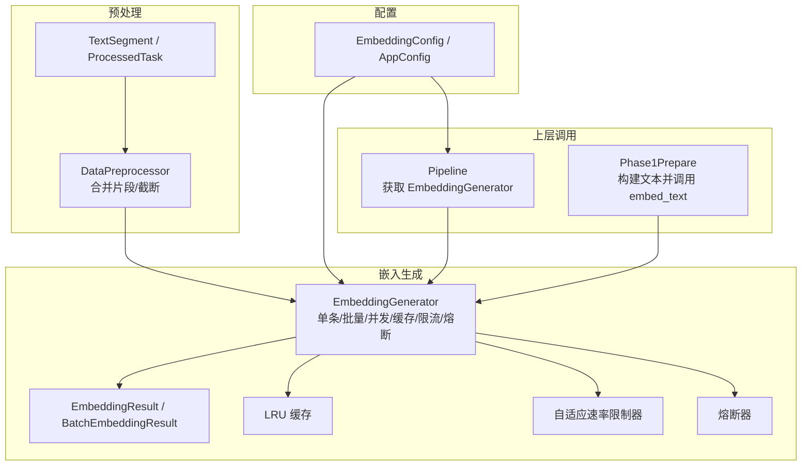
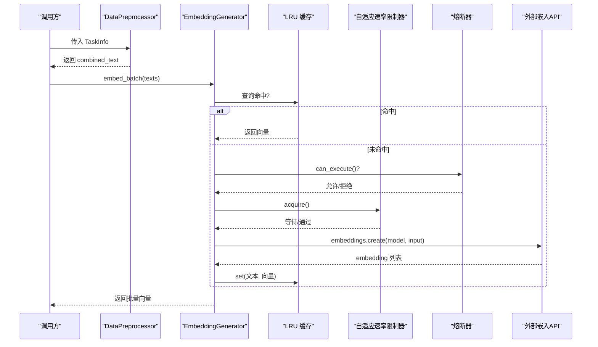
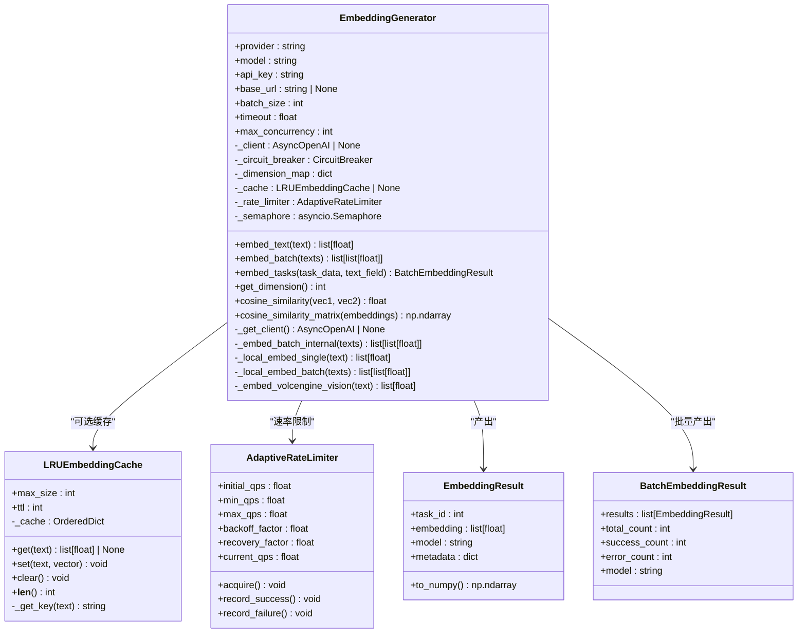
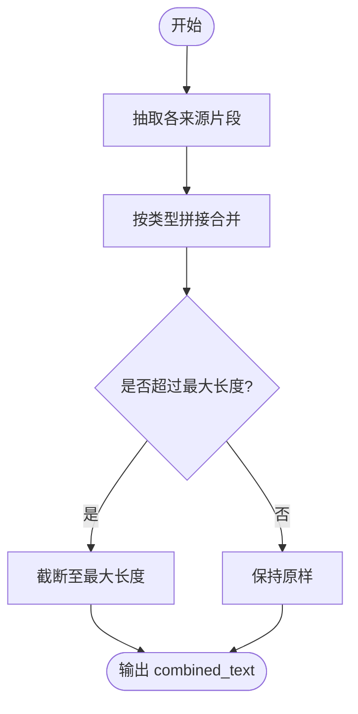
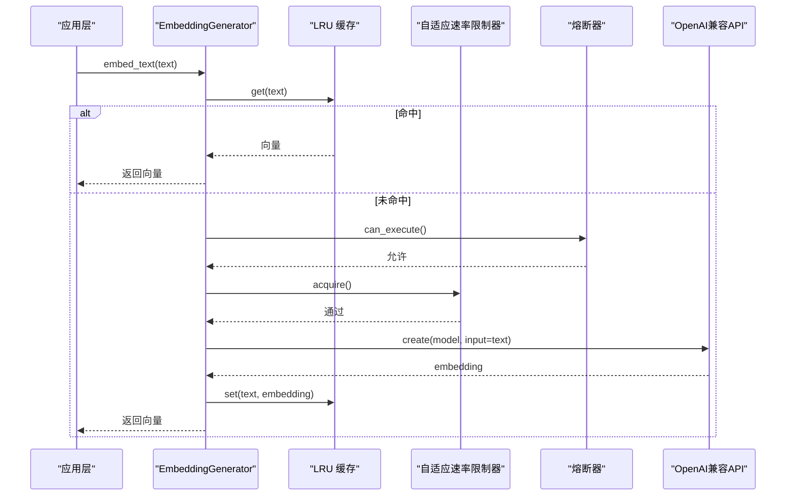
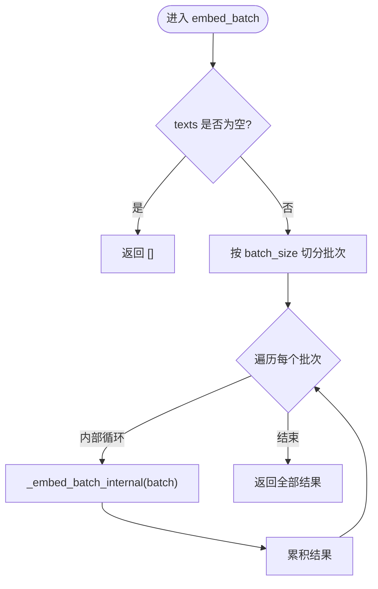
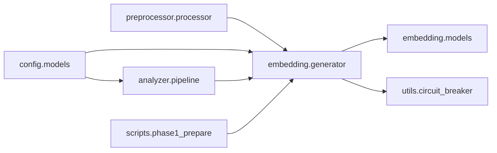

# 文本嵌入生成

<cite>
**本文引用的文件**   
- [src/embedding/generator.py](file://src/embedding/generator.py)
- [src/embedding/models.py](file://src/embedding/models.py)
- [src/embedding/__init__.py](file://src/embedding/__init__.py)
- [src/preprocessor/processor.py](file://src/preprocessor/processor.py)
- [src/preprocessor/models.py](file://src/preprocessor/models.py)
- [src/config/models.py](file://src/config/models.py)
- [src/analyzer/pipeline.py](file://src/analyzer/pipeline.py)
- [scripts/phase1_prepare.py](file://scripts/phase1_prepare.py)
- [tests/test_embedding.py](file://tests/test_embedding.py)
- [tests/embedding/test_generator_task24.py](file://tests/embedding/test_generator_task24.py)
</cite>

## 目录
1. [简介](#简介)
2. [项目结构](#项目结构)
3. [核心组件](#核心组件)
4. [架构总览](#架构总览)
5. [详细组件分析](#详细组件分析)
6. [依赖关系分析](#依赖关系分析)
7. [性能与内存优化](#性能与内存优化)
8. [质量评估与降维](#质量评估与降维)
9. [错误处理与异常值处理](#错误处理与异常值处理)
10. [结论](#结论)
11. [附录：配置与使用示例路径](#附录配置与使用示例路径)

## 简介
本技术文档聚焦“文本嵌入生成模块”，系统性阐述向量表示学习的实现原理与工程实践，包括：
- 文本预处理与特征提取流程
- 多提供商嵌入模型接入与维度选择策略
- 批量并发、缓存与速率限制机制
- 存储格式、缓存策略与性能调优
- 质量评估方法与降维技术（如 UMAP）
- 错误处理与异常值处理策略

该模块在系统中承担将任务单、日志、代码变更等异构文本统一为高质量向量表示的职责，为后续聚类、检索与分析提供基础。

## 项目结构
嵌入相关代码主要位于 src/embedding 目录，配合预处理模块 src/preprocessor 与配置模块 src/config 共同完成端到端的向量化流水线。测试覆盖于 tests/embedding 与 tests/test_embedding.py。

图表来源
- [src/embedding/generator.py:90-135](file://src/embedding/generator.py#L90-L135)
- [src/embedding/models.py:7-23](file://src/embedding/models.py#L7-L23)
- [src/preprocessor/processor.py:5-24](file://src/preprocessor/processor.py#L5-L24)
- [src/preprocessor/models.py:6-18](file://src/preprocessor/models.py#L6-L18)
- [src/config/models.py:45-58](file://src/config/models.py#L45-L58)
- [src/analyzer/pipeline.py:268-279](file://src/analyzer/pipeline.py#L268-L279)
- [scripts/phase1_prepare.py:34-39](file://scripts/phase1_prepare.py#L34-L39)

章节来源
- [src/embedding/generator.py:90-135](file://src/embedding/generator.py#L90-L135)
- [src/embedding/models.py:7-23](file://src/embedding/models.py#L7-L23)
- [src/preprocessor/processor.py:5-24](file://src/preprocessor/processor.py#L5-L24)
- [src/preprocessor/models.py:6-18](file://src/preprocessor/models.py#L6-L18)
- [src/config/models.py:45-58](file://src/config/models.py#L45-L58)
- [src/analyzer/pipeline.py:268-279](file://src/analyzer/pipeline.py#L268-L279)
- [scripts/phase1_prepare.py:34-39](file://scripts/phase1_prepare.py#L34-L39)

## 核心组件
- EmbeddingGenerator：统一的嵌入生成入口，支持多提供商、批量并发、LRU 缓存、自适应速率限制与熔断保护。
- LRUEmbeddingCache：基于有序字典的 LRU 缓存，支持 TTL 过期控制。
- AdaptiveRateLimiter：根据成功/失败动态调整 QPS 的异步速率限制器。
- EmbeddingResult/BatchEmbeddingResult：Pydantic 数据模型，承载结果与元数据。
- DataPreprocessor：从结构化任务信息中提取并合并文本片段，输出适合嵌入的长文本。

章节来源
- [src/embedding/generator.py:90-135](file://src/embedding/generator.py#L90-L135)
- [src/embedding/generator.py:13-52](file://src/embedding/generator.py#L13-L52)
- [src/embedding/generator.py:54-89](file://src/embedding/generator.py#L54-L89)
- [src/embedding/models.py:7-23](file://src/embedding/models.py#L7-L23)
- [src/preprocessor/processor.py:5-24](file://src/preprocessor/processor.py#L5-L24)

## 架构总览
下图展示从原始任务到最终嵌入结果的端到端流程，涵盖预处理、嵌入生成、缓存与并发控制。

图表来源
- [src/preprocessor/processor.py:9-24](file://src/preprocessor/processor.py#L9-L24)
- [src/embedding/generator.py:245-310](file://src/embedding/generator.py#L245-L310)
- [src/embedding/generator.py:162-216](file://src/embedding/generator.py#L162-L216)
- [src/embedding/generator.py:54-89](file://src/embedding/generator.py#L54-L89)
- [src/embedding/generator.py:114-118](file://src/embedding/generator.py#L114-L118)

## 详细组件分析

### 组件一：EmbeddingGenerator（类图）

图表来源
- [src/embedding/generator.py:90-135](file://src/embedding/generator.py#L90-L135)
- [src/embedding/generator.py:13-52](file://src/embedding/generator.py#L13-L52)
- [src/embedding/generator.py:54-89](file://src/embedding/generator.py#L54-L89)
- [src/embedding/models.py:7-23](file://src/embedding/models.py#L7-L23)

章节来源
- [src/embedding/generator.py:90-135](file://src/embedding/generator.py#L90-L135)
- [src/embedding/generator.py:13-52](file://src/embedding/generator.py#L13-L52)
- [src/embedding/generator.py:54-89](file://src/embedding/generator.py#L54-L89)
- [src/embedding/models.py:7-23](file://src/embedding/models.py#L7-L23)

### 组件二：文本预处理与特征提取
- 片段抽取：从标题、描述、需求、设计、提交记录、评审意见、测试用例、缺陷、生产症状、日志、堆栈、解决方案等多源字段提取结构化片段。
- 片段合并：按类型拼接为统一文本，便于下游嵌入模型理解上下文。
- 长度控制：对合并后的文本进行最大长度截断，避免超出模型输入限制。

图表来源
- [src/preprocessor/processor.py:26-178](file://src/preprocessor/processor.py#L26-L178)
- [src/preprocessor/processor.py:180-191](file://src/preprocessor/processor.py#L180-L191)

章节来源
- [src/preprocessor/processor.py:26-178](file://src/preprocessor/processor.py#L26-L178)
- [src/preprocessor/processor.py:180-191](file://src/preprocessor/processor.py#L180-L191)

### 组件三：嵌入生成流程（序列图）

图表来源
- [src/embedding/generator.py:162-216](file://src/embedding/generator.py#L162-L216)
- [src/embedding/generator.py:13-52](file://src/embedding/generator.py#L13-L52)
- [src/embedding/generator.py:54-89](file://src/embedding/generator.py#L54-L89)
- [src/embedding/generator.py:114-118](file://src/embedding/generator.py#L114-L118)

章节来源
- [src/embedding/generator.py:162-216](file://src/embedding/generator.py#L162-L216)

### 组件四：批量并发与分片（流程图）

图表来源
- [src/embedding/generator.py:245-321](file://src/embedding/generator.py#L245-L321)

章节来源
- [src/embedding/generator.py:245-321](file://src/embedding/generator.py#L245-L321)

### 组件五：提供商适配与维度映射
- 支持的 provider：openai、zhipu、volcengine、local 等；通过 _get_client 初始化不同客户端或走本地哈希向量。
- 维度映射：内置常见模型的默认维度，未知模型回退到默认维度。
- 特殊分支：火山引擎视觉模型走独立 HTTP 请求路径。

章节来源
- [src/embedding/generator.py:141-160](file://src/embedding/generator.py#L141-L160)
- [src/embedding/generator.py:119-128](file://src/embedding/generator.py#L119-L128)
- [src/embedding/generator.py:218-243](file://src/embedding/generator.py#L218-L243)
- [src/embedding/generator.py:323-357](file://src/embedding/generator.py#L323-L357)
- [src/embedding/generator.py:407-408](file://src/embedding/generator.py#L407-L408)

## 依赖关系分析
- 模块内耦合：EmbeddingGenerator 强依赖 LRUEmbeddingCache、AdaptiveRateLimiter、CircuitBreaker；对外暴露简洁 API。
- 跨模块依赖：
  - 上层 Pipeline 通过配置创建 EmbeddingGenerator。
  - Phase1Prepare 脚本直接构造并使用 EmbeddingGenerator。
  - 预处理模块为嵌入提供标准化输入。
- 外部依赖：OpenAI 兼容 SDK（AsyncOpenAI）、httpx（用于特定提供商）。

图表来源
- [src/analyzer/pipeline.py:268-279](file://src/analyzer/pipeline.py#L268-L279)
- [scripts/phase1_prepare.py:34-39](file://scripts/phase1_prepare.py#L34-L39)
- [src/embedding/generator.py:114-118](file://src/embedding/generator.py#L114-L118)
- [src/embedding/models.py:7-23](file://src/embedding/models.py#L7-L23)

章节来源
- [src/analyzer/pipeline.py:268-279](file://src/analyzer/pipeline.py#L268-L279)
- [scripts/phase1_prepare.py:34-39](file://scripts/phase1_prepare.py#L34-L39)
- [src/embedding/generator.py:114-118](file://src/embedding/generator.py#L114-L118)
- [src/embedding/models.py:7-23](file://src/embedding/models.py#L7-L23)

## 性能与内存优化
- 批量并发与分片：按 batch_size 分批调用，结合信号量控制并发度，降低瞬时压力。
- LRU 缓存：以文本哈希为键，避免重复计算；支持 TTL 过期，平衡命中率与内存占用。
- 自适应速率限制：根据成功/失败动态调整 QPS，避免触发服务端限流。
- 熔断保护：快速失败与恢复，防止雪崩。
- 内存建议：
  - 合理设置 cache_max_size 与 ttl，避免常驻内存过大。
  - 大文本先做截断与清洗，减少网络传输与模型推理开销。
  - 使用 numpy 数组进行相似度计算，避免 Python 列表循环。

章节来源
- [src/embedding/generator.py:245-321](file://src/embedding/generator.py#L245-L321)
- [src/embedding/generator.py:13-52](file://src/embedding/generator.py#L13-L52)
- [src/embedding/generator.py:54-89](file://src/embedding/generator.py#L54-L89)
- [src/embedding/generator.py:114-118](file://src/embedding/generator.py#L114-L118)

## 质量评估与降维
- 相似度度量：
  - 余弦相似度：内置静态方法，适用于归一化向量比较。
  - 相似度矩阵：批量计算，便于近邻检索与可视化。
- 质量评估建议：
  - 领域内聚性：同一类别样本的平均相似度应高于跨类别。
  - 稳定性：多次运行或不同批次的相似度分布应稳定。
  - 可解释性：结合标签/根因分类，观察高相似样本是否具备语义一致性。
- 降维技术（UMAP）：
  - 目的：将高维向量降至 2D/3D 以便可视化与初步诊断。
  - 步骤：归一化向量 → UMAP 降维 → 可视化（散点/热力图）。
  - 注意：UMAP 不改变上游相似度计算，仅用于展示；需关注超参数（n_neighbors、min_dist）对局部/全局结构的权衡。

章节来源
- [src/embedding/generator.py:410-426](file://src/embedding/generator.py#L410-L426)

## 错误处理与异常值处理
- 空文本校验：单条文本为空或空白时抛出异常，避免无效请求。
- 客户端初始化错误：区分“客户端初始化错误”与“网络/服务错误”，前者不计入熔断失败计数。
- 熔断器：失败次数达到阈值后快速失败，并在超时后尝试恢复。
- 速率限制：失败时降低 QPS，成功时逐步恢复，平滑流量。
- 异常值处理：
  - 零向量：相似度函数对零向量安全返回 0.0。
  - 批量空项：批量接口对空字符串填充零向量占位，保证对齐。
  - 特殊提供商：火山视觉模型单独处理，避免通用路径误判。

章节来源
- [src/embedding/generator.py:162-216](file://src/embedding/generator.py#L162-L216)
- [src/embedding/generator.py:245-310](file://src/embedding/generator.py#L245-L310)
- [src/embedding/generator.py:410-419](file://src/embedding/generator.py#L410-L419)
- [src/embedding/generator.py:218-243](file://src/embedding/generator.py#L218-L243)

## 结论
本模块以“统一接口 + 多提供商适配 + 高性能并发 + 稳健容错”为核心目标，构建了可扩展、可观测、易维护的文本嵌入生成能力。通过预处理标准化输入、LRU 缓存与自适应限流提升吞吐与稳定性，并通过内置相似度工具与降维方案支撑质量评估与可视化。建议在工程中结合业务场景选择合适的模型与维度，并持续监控命中率、延迟与错误率以迭代优化。

## 附录：配置与使用示例路径
- 配置项定义（EmbeddingConfig）
  - [src/config/models.py:45-58](file://src/config/models.py#L45-L58)
- 通过 Pipeline 获取 EmbeddingGenerator
  - [src/analyzer/pipeline.py:268-279](file://src/analyzer/pipeline.py#L268-L279)
- 阶段一脚本中构造与使用
  - [scripts/phase1_prepare.py:34-39](file://scripts/phase1_prepare.py#L34-L39)
  - [scripts/phase1_prepare.py:108-112](file://scripts/phase1_prepare.py#L108-L112)
- 单元测试参考（单条/批量/缓存/维度/相似度）
  - [tests/test_embedding.py:19-64](file://tests/test_embedding.py#L19-L64)
  - [tests/test_embedding.py:95-120](file://tests/test_embedding.py#L95-L120)
  - [tests/embedding/test_generator_task24.py:154-206](file://tests/embedding/test_generator_task24.py#L154-L206)
  - [tests/embedding/test_generator_task24.py:207-222](file://tests/embedding/test_generator_task24.py#L207-L222)
  - [tests/embedding/test_generator_task24.py:246-267](file://tests/embedding/test_generator_task24.py#L246-L267)