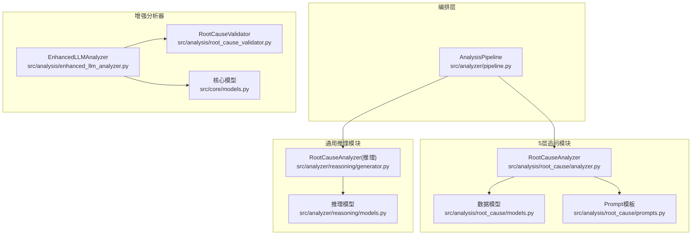
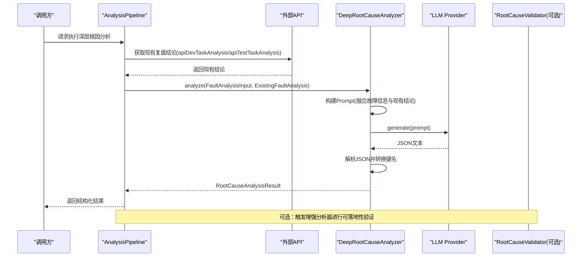
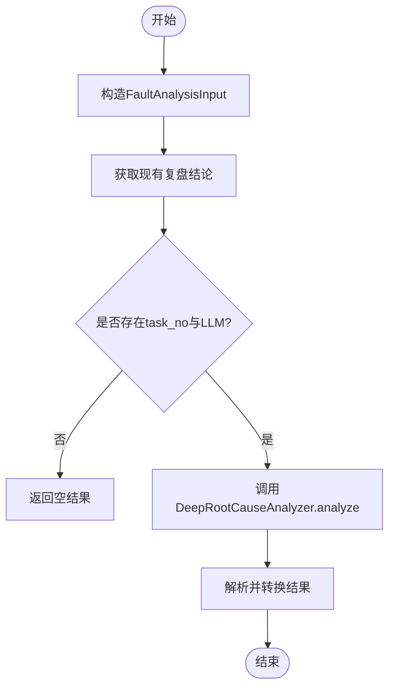
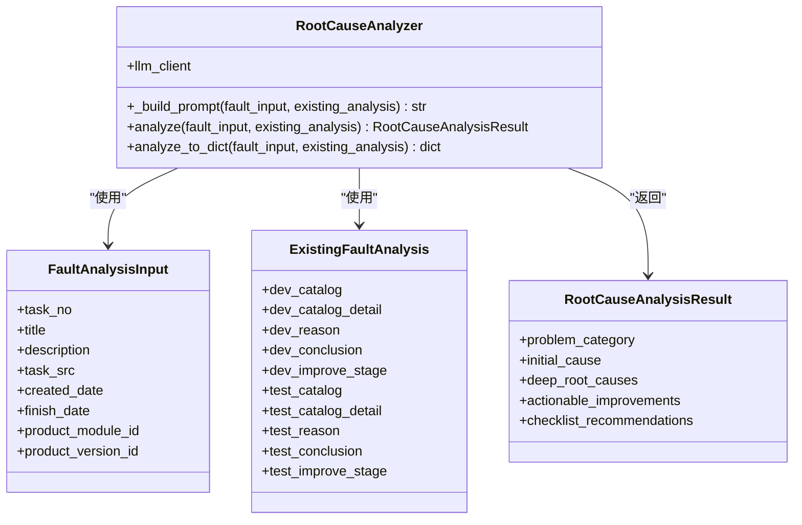
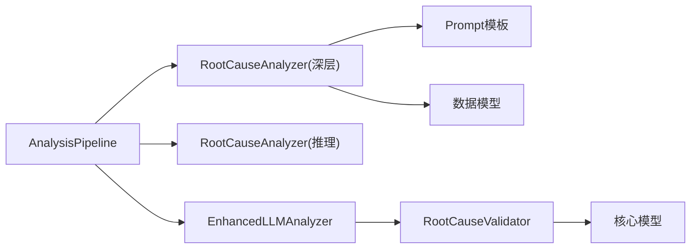

# 5层追问机制

<cite>
**本文引用的文件**   
- [src/analysis/root_cause/analyzer.py](file://src/analysis/root_cause/analyzer.py)
- [src/analysis/root_cause/models.py](file://src/analysis/root_cause/models.py)
- [src/analysis/root_cause/prompts.py](file://src/analysis/root_cause/prompts.py)
- [src/analyzer/reasoning/generator.py](file://src/analyzer/reasoning/generator.py)
- [src/analyzer/reasoning/models.py](file://src/analyzer/reasoning/models.py)
- [src/analyzer/pipeline.py](file://src/analyzer/pipeline.py)
- [src/analysis/enhanced_llm_analyzer.py](file://src/analysis/enhanced_llm_analyzer.py)
- [src/analysis/root_cause_validator.py](file://src/analysis/root_cause_validator.py)
- [src/core/models.py](file://src/core/models.py)
- [docs/根因分析方案设计.md](file://docs/根因分析方案设计.md)
</cite>

## 目录
1. [引言](#引言)
2. [项目结构](#项目结构)
3. [核心组件](#核心组件)
4. [架构总览](#架构总览)
5. [详细组件分析](#详细组件分析)
6. [依赖关系分析](#依赖关系分析)
7. [性能与可扩展性](#性能与可扩展性)
8. [故障排查指南](#故障排查指南)
9. [结论](#结论)
10. [附录：配置与扩展示例](#附录配置与扩展示例)

## 引言
本技术文档围绕“5层追问机制”展开，聚焦于多层问题分解策略的设计原理、每层追问的具体逻辑与终止条件、层次结构（表面现象→直接原因→根本原因→系统性问题→预防措施）的实现方式、追问链构建算法、上下文传递机制、结果聚合策略，以及与LLM交互模式、错误处理与性能优化。同时提供质量评估方法与结果验证流程，并给出配置深度、自定义规则与扩展新维度的实践指引。

## 项目结构
本项目在“根因分析”方向上提供了两套实现路径：
- 增强型5层追问机制：通过 Pipeline 编排，调用 src/analysis/root_cause 模块完成基于现有复盘结论的深度追问，输出结构化结果。
- 通用根因推理：通过 src/analyzer/reasoning 模块进行多维度（技术/过程/管理）的根因分析，作为补充能力。

图表来源
- [src/analyzer/pipeline.py:369-426](file://src/analyzer/pipeline.py#L369-L426)
- [src/analysis/root_cause/analyzer.py:44-131](file://src/analysis/root_cause/analyzer.py#L44-L131)
- [src/analysis/root_cause/models.py:1-67](file://src/analysis/root_cause/models.py#L1-L67)
- [src/analysis/root_cause/prompts.py:1-85](file://src/analysis/root_cause/prompts.py#L1-L85)
- [src/analyzer/reasoning/generator.py:67-176](file://src/analyzer/reasoning/generator.py#L67-L176)
- [src/analyzer/reasoning/models.py:1-24](file://src/analyzer/reasoning/models.py#L1-L24)
- [src/analysis/enhanced_llm_analyzer.py:23-206](file://src/analysis/enhanced_llm_analyzer.py#L23-L206)
- [src/analysis/root_cause_validator.py:139-368](file://src/analysis/root_cause_validator.py#L139-L368)
- [src/core/models.py:329-379](file://src/core/models.py#L329-L379)

章节来源
- [src/analyzer/pipeline.py:369-426](file://src/analyzer/pipeline.py#L369-L426)
- [docs/根因分析方案设计.md:91-142](file://docs/根因分析方案设计.md#L91-L142)

## 核心组件
- 5层追问入口：AnalysisPipeline._analyze_root_cause_deep 负责组装输入、获取现有复盘结论、调用深层根因分析器并返回结构化结果。
- 深层根因分析器：RootCauseAnalyzer（src/analysis/root_cause）负责构建Prompt、调用LLM、解析响应并转换为强类型结果。
- Prompt模板：集中定义“5层追问”的结构化要求与输出格式约束。
- 增强分析器：EnhancedLLMAnalyzer 整合违规检测、代码变更分析与根因可落地性验证，形成闭环。
- 根因验证器：RootCauseValidator 对根因的可落地性进行评分与建议措施生成，支持规则与LLM双通道。

章节来源
- [src/analyzer/pipeline.py:369-426](file://src/analyzer/pipeline.py#L369-L426)
- [src/analysis/root_cause/analyzer.py:44-131](file://src/analysis/root_cause/analyzer.py#L44-L131)
- [src/analysis/root_cause/prompts.py:1-85](file://src/analysis/root_cause/prompts.py#L1-L85)
- [src/analysis/enhanced_llm_analyzer.py:23-206](file://src/analysis/enhanced_llm_analyzer.py#L23-L206)
- [src/analysis/root_cause_validator.py:139-368](file://src/analysis/root_cause_validator.py#L139-L368)

## 架构总览
5层追问机制的整体流程如下：
- 输入准备：从任务数据构造 FaultAnalysisInput，并从API拉取现有复盘结论 ExistingFaultAnalysis。
- 追问构建：将两层信息注入 Prompt 模板，引导LLM按“现象→分类→初步归因→深层根因→改进措施”的顺序输出。
- 结果解析：将LLM返回的JSON转换为强类型对象，统一键名风格，便于下游使用。
- 可选增强：通过 EnhancedLLMAnalyzer 进行根因可落地性验证与改进措施建议。

图表来源
- [src/analyzer/pipeline.py:369-426](file://src/analyzer/pipeline.py#L369-L426)
- [src/analysis/root_cause/analyzer.py:79-116](file://src/analysis/root_cause/analyzer.py#L79-L116)
- [src/analysis/root_cause/prompts.py:1-85](file://src/analysis/root_cause/prompts.py#L1-L85)
- [src/analysis/enhanced_llm_analyzer.py:32-74](file://src/analysis/enhanced_llm_analyzer.py#L32-L74)

## 详细组件分析

### 组件A：5层追问入口（AnalysisPipeline）
- 职责：编排数据准备、现有结论获取、深层分析调用与结果聚合。
- 关键流程：
  - 构造 FaultAnalysisInput（任务号、标题、描述、来源、时间等）。
  - 调用API获取 apiDevTaskAnalysis 与 apiTestTaskAnalysis，映射为 ExistingFaultAnalysis。
  - 调用 DeepRootCauseAnalyzer.analyze 执行追问。
  - 将结果序列化为字典供报告或展示使用。
- 终止条件：当缺少task_no或LLM不可用时，直接返回空结果；异常时记录错误并继续。

图表来源
- [src/analyzer/pipeline.py:369-426](file://src/analyzer/pipeline.py#L369-L426)

章节来源
- [src/analyzer/pipeline.py:369-426](file://src/analyzer/pipeline.py#L369-L426)

### 组件B：深层根因分析器（RootCauseAnalyzer）
- 职责：构建Prompt、调用LLM、解析JSON、转换为强类型结果。
- 关键方法：
  - _build_prompt：将故障信息与现有结论注入模板。
  - analyze：异步调用LLM，解析响应，统一键名为snake_case，填充数据结构。
  - analyze_to_dict：同步包装，便于非异步环境使用。
- 错误处理：JSON解析失败会抛出异常；键名转换递归处理嵌套结构与列表。

图表来源
- [src/analysis/root_cause/analyzer.py:44-131](file://src/analysis/root_cause/analyzer.py#L44-L131)
- [src/analysis/root_cause/models.py:1-67](file://src/analysis/root_cause/models.py#L1-L67)

章节来源
- [src/analysis/root_cause/analyzer.py:44-131](file://src/analysis/root_cause/analyzer.py#L44-L131)
- [src/analysis/root_cause/models.py:1-67](file://src/analysis/root_cause/models.py#L1-L67)

### 组件C：Prompt模板（5层追问规范）
- 设计要点：
  - 明确问题分类（开发引入/测试泄露/需求问题/外部依赖）。
  - 针对“场景考虑不全”的泛化归因，强制追问“为什么没考虑到”“哪个环节能发现”“开发引入导致缺陷的原因”。
  - 输出JSON结构包含：问题类别、初始归因、深层根因列表、可落地改进措施、Checklist建议。
- 终止条件：由LLM根据提示词约束输出固定字段，避免发散。

章节来源
- [src/analysis/root_cause/prompts.py:1-85](file://src/analysis/root_cause/prompts.py#L1-L85)
- [docs/根因分析方案设计.md:353-399](file://docs/根因分析方案设计.md#L353-L399)

### 组件D：通用根因推理（Reasoning Generator）
- 职责：面向多阶段（需求/设计/开发/测试/生产）的根因分析，输出技术/过程/管理三维度因素。
- 特点：
  - 支持分段详情拼接，控制单段长度。
  - 支持标签上下文注入，辅助LLM理解已有标注。
  - 解析JSON到 RootCauseAnalysisResult，具备容错处理。

章节来源
- [src/analyzer/reasoning/generator.py:67-176](file://src/analyzer/reasoning/generator.py#L67-L176)
- [src/analyzer/reasoning/models.py:1-24](file://src/analyzer/reasoning/models.py#L1-L24)

### 组件E：增强分析器与根因验证（EnhancedLLMAnalyzer & RootCauseValidator）
- 增强分析器：
  - 步骤：违规检测 → 代码变更分析 → 根因提取 → 根因可落地性验证 → 生成完整分析文本。
  - 支持批量分析，异常捕获并回退到默认结果。
- 根因验证器：
  - 规则引擎：不可落地关键词匹配、动作关键词打分、具体术语加分。
  - LLM验证：可选LLM二次校验，失败回退到规则验证。
  - 输出：是否可落地、评分、改进措施、重新分析反馈。

章节来源
- [src/analysis/enhanced_llm_analyzer.py:23-206](file://src/analysis/enhanced_llm_analyzer.py#L23-L206)
- [src/analysis/root_cause_validator.py:139-368](file://src/analysis/root_cause_validator.py#L139-L368)
- [src/core/models.py:329-379](file://src/core/models.py#L329-L379)

## 依赖关系分析
- 模块耦合：
  - AnalysisPipeline 依赖 RootCauseAnalyzer（深层）、RootCauseAnalyzer（推理）、EnhancedLLMAnalyzer、RulesEngine、ReportGenerator。
  - RootCauseAnalyzer（深层）依赖 Prompt 模板与数据模型。
  - EnhancedLLMAnalyzer 依赖 RootCauseValidator 与核心模型。
- 外部依赖：
  - LLM Provider 抽象接口（create_llm_provider），适配不同后端。
  - API Client 用于获取现有复盘结论。

图表来源
- [src/analyzer/pipeline.py:369-426](file://src/analyzer/pipeline.py#L369-L426)
- [src/analysis/root_cause/analyzer.py:44-131](file://src/analysis/root_cause/analyzer.py#L44-L131)
- [src/analysis/root_cause/prompts.py:1-85](file://src/analysis/root_cause/prompts.py#L1-L85)
- [src/analysis/root_cause_validator.py:139-368](file://src/analysis/root_cause_validator.py#L139-L368)
- [src/core/models.py:329-379](file://src/core/models.py#L329-L379)

章节来源
- [src/analyzer/pipeline.py:369-426](file://src/analyzer/pipeline.py#L369-L426)
- [src/analysis/root_cause/analyzer.py:44-131](file://src/analysis/root_cause/analyzer.py#L44-L131)
- [src/analysis/root_cause_validator.py:139-368](file://src/analysis/root_cause_validator.py#L139-L368)

## 性能与可扩展性
- 并发与批处理：
  - Pipeline.run_batch 使用 asyncio.gather 并行执行多个任务的单例分析。
  - EnhancedLLMAnalyzer.analyze_batch 对批量任务逐一分析，异常隔离。
- 缓存与降级：
  - Pipeline 支持缓存加载任务数据，减少重复网络请求。
  - 根因验证器支持LLM失败回退到规则引擎，保证可用性。
- 可扩展点：
  - 新增追问维度：扩展 Prompt 模板与数据模型字段。
  - 替换LLM Provider：通过 create_llm_provider 切换后端。
  - 自定义规则：在 RootCauseValidator 中增加关键词与模板。

[本节为通用指导，不直接分析具体文件]

## 故障排查指南
- LLM调用失败：
  - 检查Provider配置与网络连通性。
  - 查看日志中的错误信息，确认重试与回退策略是否生效。
- JSON解析异常：
  - 确认LLM输出符合Prompt约定的JSON结构。
  - 检查键名大小写与嵌套层级，确保转换器正确工作。
- 根因不可落地：
  - 使用 RootCauseValidator 的重新分析反馈，定位需要更具体的根因描述。
  - 结合增强分析器的改进措施建议，完善落地方案。

章节来源
- [src/analysis/root_cause_validator.py:279-368](file://src/analysis/root_cause_validator.py#L279-L368)
- [src/analysis/enhanced_llm_analyzer.py:108-170](file://src/analysis/enhanced_llm_analyzer.py#L108-L170)

## 结论
5层追问机制通过“现有复盘结论+结构化Prompt+强类型结果”的组合，实现了从表面现象到系统性问题再到预防措施的层层深入。配合增强分析器与根因验证器，系统不仅产出高质量根因，还能给出可落地的改进建议。整体架构具备良好的可扩展性与鲁棒性，适合在生产环境中持续演进。

[本节为总结，不直接分析具体文件]

## 附录：配置与扩展示例
- 启用5层追问：
  - 在 PipelineConfig 中设置 analyze_root_cause_deep=True。
  - 确保 LLM Provider 已配置且可用。
- 自定义追问规则：
  - 修改 Prompt 模板，增加新的追问分支与输出字段。
  - 在数据模型中新增字段，并在解析逻辑中映射。
- 扩展新分析维度：
  - 在 RootCauseValidator 中添加新的关键词与模板。
  - 在 EnhancedLLMAnalyzer 中集成新的检测与分析步骤。

章节来源
- [src/analyzer/pipeline.py:36-46](file://src/analyzer/pipeline.py#L36-L46)
- [src/analysis/root_cause/prompts.py:1-85](file://src/analysis/root_cause/prompts.py#L1-L85)
- [src/analysis/root_cause_validator.py:139-368](file://src/analysis/root_cause_validator.py#L139-L368)
