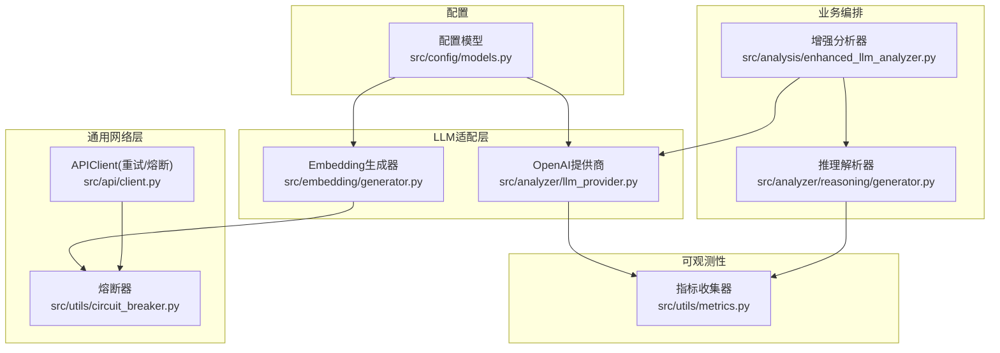
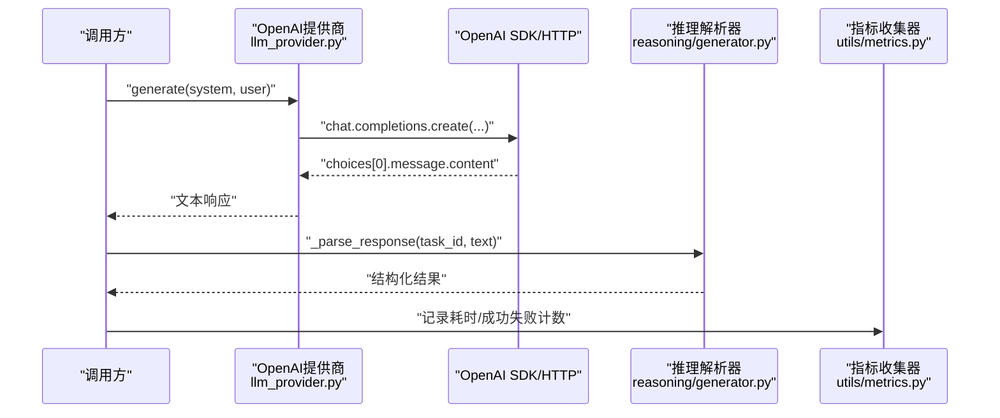
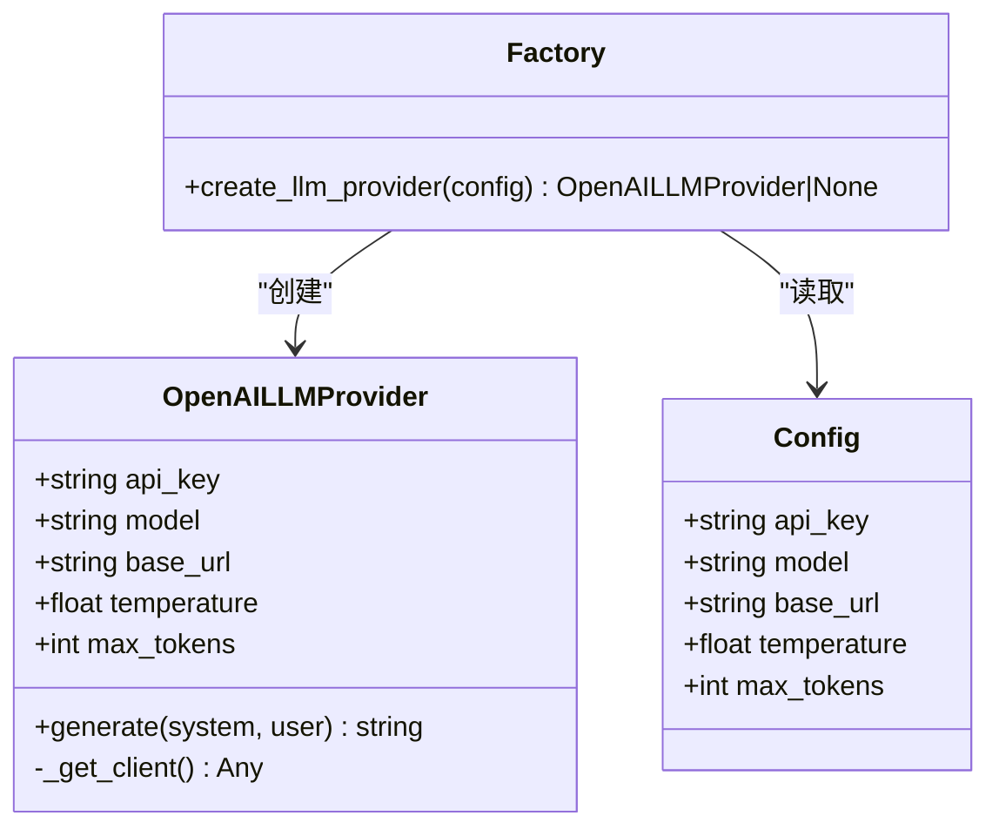
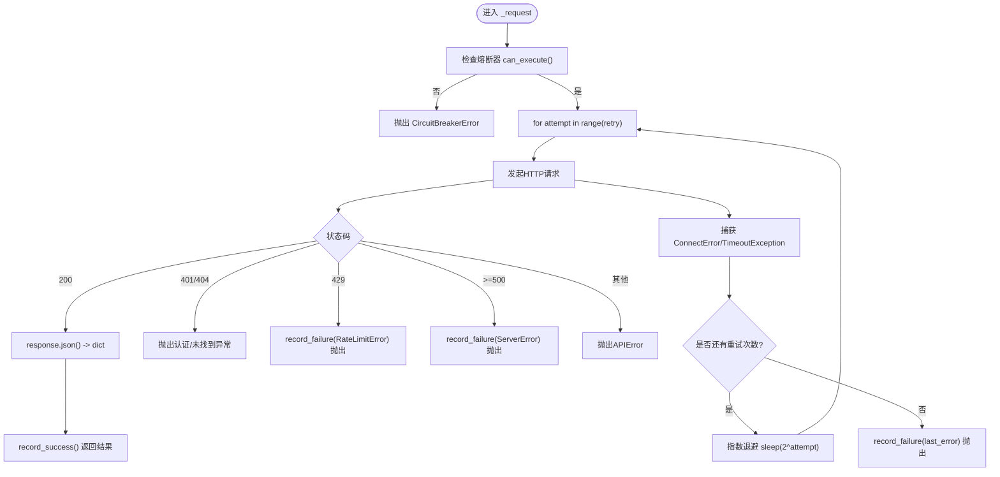
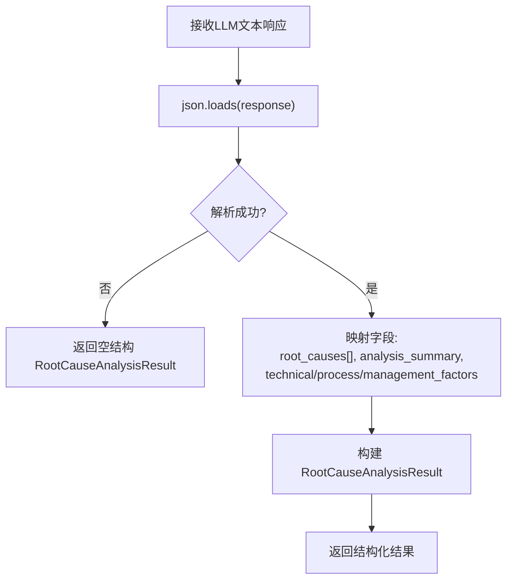
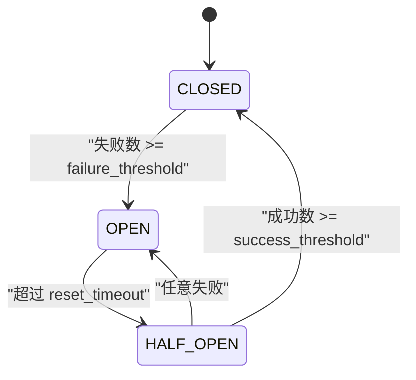
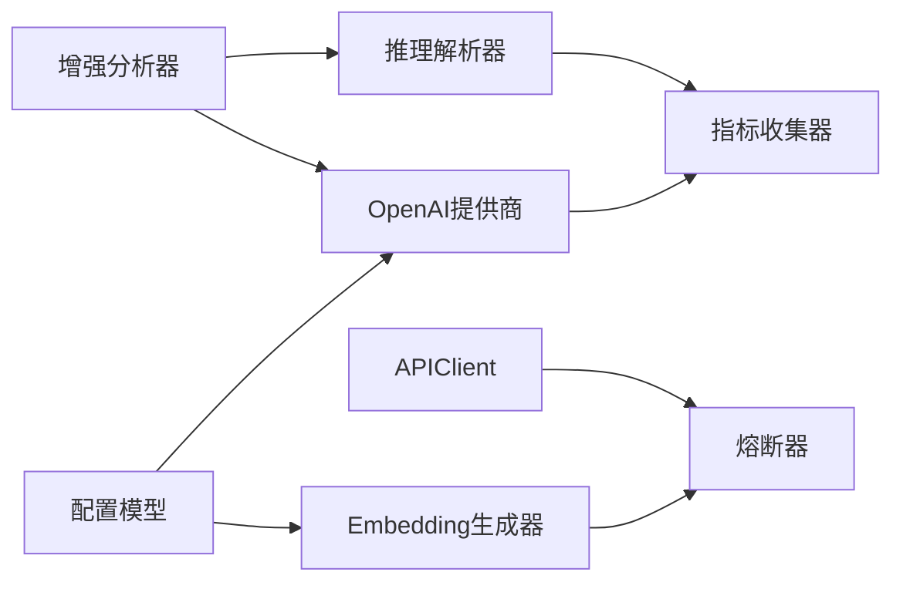

# LLM集成与响应解析

<cite>
**本文引用的文件**   
- [src/analyzer/llm_provider.py](file://src/analyzer/llm_provider.py)
- [src/config/models.py](file://src/config/models.py)
- [src/core/models.py](file://src/core/models.py)
- [src/api/client.py](file://src/api/client.py)
- [src/utils/circuit_breaker.py](file://src/utils/circuit_breaker.py)
- [src/utils/metrics.py](file://src/utils/metrics.py)
- [src/embedding/generator.py](file://src/embedding/generator.py)
- [src/analysis/enhanced_llm_analyzer.py](file://src/analysis/enhanced_llm_analyzer.py)
- [src/analyzer/reasoning/generator.py](file://src/analyzer/reasoning/generator.py)
- [tests/test_llm_provider.py](file://tests/test_llm_provider.py)
- [tests/utils/test_circuit_breaker.py](file://tests/utils/test_circuit_breaker.py)
- [docs/observability_guide.md](file://docs/observability_guide.md)
</cite>

## 目录
1. [简介](#简介)
2. [项目结构](#项目结构)
3. [核心组件](#核心组件)
4. [架构总览](#架构总览)
5. [详细组件分析](#详细组件分析)
6. [依赖关系分析](#依赖关系分析)
7. [性能与成本优化](#性能与成本优化)
8. [故障排查指南](#故障排查指南)
9. [结论](#结论)
10. [附录：配置与示例路径](#附录配置与示例路径)

## 简介
本技术文档聚焦于LLM集成模块，围绕以下目标展开：
- 适配层设计与统一接口抽象：如何以最小改动接入不同LLM提供商。
- 连接池与并发控制：HTTP客户端复用、并发限制与速率自适应。
- 响应JSON解析流程、字段映射转换与异常处理：从原始文本到结构化结果。
- 重试策略、超时控制与熔断降级：保障外部服务不稳定时的系统韧性。
- 流式响应与内存优化：面向大文本与批处理的内存友好方案。
- 监控指标、性能分析与成本优化建议：可观测性与成本控制。

## 项目结构
与LLM集成相关的核心代码分布在如下位置：
- 适配层与工厂：OpenAI提供商实现与创建器
- 配置模型：LLM/Embedding/API等配置校验
- 通用API客户端：重试、熔断、错误分类
- 熔断器：状态机与装饰器
- 指标收集：计数器、仪表盘、直方图与Prometheus导出
- Embedding生成器：缓存、自适应限流、并发控制
- 增强分析器：编排违规检测、根因验证与改进措施
- 推理解析器：将LLM返回的JSON文本解析为结构化对象

图表来源
- [src/config/models.py:28-42](file://src/config/models.py#L28-L42)
- [src/analyzer/llm_provider.py:1-67](file://src/analyzer/llm_provider.py#L1-L67)
- [src/embedding/generator.py:91-134](file://src/embedding/generator.py#L91-L134)
- [src/api/client.py:25-47](file://src/api/client.py#L25-L47)
- [src/utils/circuit_breaker.py:36-116](file://src/utils/circuit_breaker.py#L36-L116)
- [src/analysis/enhanced_llm_analyzer.py:23-74](file://src/analysis/enhanced_llm_analyzer.py#L23-L74)
- [src/analyzer/reasoning/generator.py:142-175](file://src/analyzer/reasoning/generator.py#L142-L175)
- [src/utils/metrics.py:151-226](file://src/utils/metrics.py#L151-L226)

章节来源
- [src/config/models.py:28-42](file://src/config/models.py#L28-L42)
- [src/analyzer/llm_provider.py:1-67](file://src/analyzer/llm_provider.py#L1-L67)
- [src/embedding/generator.py:91-134](file://src/embedding/generator.py#L91-L134)
- [src/api/client.py:25-47](file://src/api/client.py#L25-L47)
- [src/utils/circuit_breaker.py:36-116](file://src/utils/circuit_breaker.py#L36-L116)
- [src/analysis/enhanced_llm_analyzer.py:23-74](file://src/analysis/enhanced_llm_analyzer.py#L23-L74)
- [src/analyzer/reasoning/generator.py:142-175](file://src/analyzer/reasoning/generator.py#L142-L175)
- [src/utils/metrics.py:151-226](file://src/utils/metrics.py#L151-L226)

## 核心组件
- OpenAI LLM提供商：封装异步调用、默认base_url、参数透传（temperature、max_tokens），并返回纯文本内容。
- LLM配置模型：支持provider枚举校验、温度与token上限约束、可选base_url。
- APIClient：统一的HTTP请求封装，内置指数退避重试、状态码分类、熔断器集成。
- 熔断器：CLOSED/OPEN/HALF_OPEN三态机，支持上下文管理器与装饰器，提供统计信息。
- Embedding生成器：LRU缓存、自适应QPS限流、信号量并发控制、多提供商适配（含火山视觉）。
- 增强分析器：串联违规检测、代码变更分析、根因验证与改进措施生成。
- 推理解析器：将LLM返回的JSON字符串解析为结构化结果，包含容错回退。
- 指标收集器：Counter/Gauge/Histogram三类指标，支持Prometheus格式导出。

章节来源
- [src/analyzer/llm_provider.py:1-67](file://src/analyzer/llm_provider.py#L1-L67)
- [src/config/models.py:28-42](file://src/config/models.py#L28-L42)
- [src/api/client.py:25-161](file://src/api/client.py#L25-L161)
- [src/utils/circuit_breaker.py:36-198](file://src/utils/circuit_breaker.py#L36-L198)
- [src/embedding/generator.py:91-216](file://src/embedding/generator.py#L91-L216)
- [src/analysis/enhanced_llm_analyzer.py:23-74](file://src/analysis/enhanced_llm_analyzer.py#L23-L74)
- [src/analyzer/reasoning/generator.py:142-175](file://src/analyzer/reasoning/generator.py#L142-L175)
- [src/utils/metrics.py:151-226](file://src/utils/metrics.py#L151-L226)

## 架构总览
下图展示了从配置到LLM调用、再到结果解析与指标采集的整体链路。

图表来源
- [src/analyzer/llm_provider.py:38-52](file://src/analyzer/llm_provider.py#L38-L52)
- [src/analyzer/reasoning/generator.py:142-175](file://src/analyzer/reasoning/generator.py#L142-L175)
- [src/utils/metrics.py:151-226](file://src/utils/metrics.py#L151-L226)

## 详细组件分析

### 适配层与统一接口抽象
- OpenAILLMProvider
  - 职责：封装OpenAI异步客户端，暴露统一的generate方法；支持自定义base_url；对空响应做安全回退。
  - 关键点：懒初始化客户端、ImportError提示安装依赖、temperature/max_tokens透传。
- create_llm_provider
  - 职责：根据配置构造提供商实例；当缺少api_key时返回None，便于上层优雅降级。

图表来源
- [src/analyzer/llm_provider.py:4-52](file://src/analyzer/llm_provider.py#L4-L52)
- [src/config/models.py:28-42](file://src/config/models.py#L28-L42)

章节来源
- [src/analyzer/llm_provider.py:1-67](file://src/analyzer/llm_provider.py#L1-L67)
- [tests/test_llm_provider.py:8-88](file://tests/test_llm_provider.py#L8-L88)

### 连接池管理与并发控制
- APIClient
  - 连接池：基于httpx.AsyncClient，支持上下文管理器自动关闭；ensure_client用于非上下文场景。
  - 重试：指数退避（2^attempt秒）；针对ConnectError/TimeoutException进行重试；429不重试直接抛错。
  - 熔断：在发起请求前检查can_execute；成功/失败分别record_success/record_failure。
  - 错误分类：AuthenticationError/NotFoundError/RateLimitError/ServerError/APIError。
- EmbeddingGenerator
  - 并发：使用asyncio.Semaphore(max_concurrency)限制并发度。
  - 限速：AdaptiveRateLimiter根据成功/失败动态调整QPS，避免触发上游限流。
  - 缓存：LRUEmbeddingCache按文本哈希键存储向量，TTL过期清理。
  - 多提供商：openai/zhipu/volcengine/local，其中volcengine支持多模态端点拼接。

图表来源
- [src/api/client.py:99-161](file://src/api/client.py#L99-L161)
- [src/utils/circuit_breaker.py:146-186](file://src/utils/circuit_breaker.py#L146-L186)

章节来源
- [src/api/client.py:25-161](file://src/api/client.py#L25-L161)
- [src/embedding/generator.py:91-216](file://src/embedding/generator.py#L91-L216)
- [src/utils/circuit_breaker.py:36-198](file://src/utils/circuit_breaker.py#L36-L198)

### JSON解析流程、字段映射与异常处理
- 推理解析器_parse_response
  - 输入：task_id与LLM返回的JSON字符串。
  - 输出：RootCauseAnalysisResult（包含root_causes列表、summary、各类因素列表）。
  - 容错：JSONDecodeError/KeyError/ValueError均回退为空结构，保证下游稳定。
- 增强分析器
  - 编排：违规检测→代码变更→根因提取→根因验证（优先LLM，失败回退规则）→生成分析文本。
  - 批量：analyze_batch对每个任务独立try/except，失败项填充兜底结果并继续。

图表来源
- [src/analyzer/reasoning/generator.py:142-175](file://src/analyzer/reasoning/generator.py#L142-L175)
- [src/core/models.py:370-379](file://src/core/models.py#L370-L379)

章节来源
- [src/analyzer/reasoning/generator.py:142-175](file://src/analyzer/reasoning/generator.py#L142-L175)
- [src/analysis/enhanced_llm_analyzer.py:32-74](file://src/analysis/enhanced_llm_analyzer.py#L32-L74)
- [src/core/models.py:370-379](file://src/core/models.py#L370-L379)

### 重试策略、超时控制与熔断降级
- 重试策略
  - APIClient._request：指数退避，仅对连接/超时类错误重试；429不重试；服务端错误记录失败后抛出。
- 超时控制
  - APIClient：httpx.AsyncClient设置timeout；EmbeddingGenerator传入timeout给SDK。
- 熔断降级
  - CircuitBreaker：失败阈值达到即OPEN阻断请求；reset_timeout后进入HALF_OPEN探测；连续成功达到success_threshold则CLOSED恢复。
  - 装饰器with_circuit_breaker：对同步/异步函数统一包装，自动记录成功/失败。

图表来源
- [src/utils/circuit_breaker.py:36-116](file://src/utils/circuit_breaker.py#L36-L116)
- [src/api/client.py:117-161](file://src/api/client.py#L117-L161)

章节来源
- [src/api/client.py:99-161](file://src/api/client.py#L99-L161)
- [src/utils/circuit_breaker.py:36-198](file://src/utils/circuit_breaker.py#L36-L198)

### 流式响应与内存优化
- 当前实现
  - OpenAI提供商与推理解析器采用“一次性返回完整文本”的模式，适合中小规模响应。
  - EmbeddingGenerator通过LRU缓存与分批处理降低重复计算与内存峰值。
- 可扩展方向
  - 在提供商层引入流式接口（如stream=True），逐块累积content，减少单次内存占用。
  - 解析器支持增量解析或分片合并，结合背压控制，避免大响应阻塞事件循环。
  - 对长文本预处理阶段已具备截断逻辑（见预处理器），可在LLM侧配合max_tokens控制。

章节来源
- [src/analyzer/llm_provider.py:38-52](file://src/analyzer/llm_provider.py#L38-L52)
- [src/embedding/generator.py:13-52](file://src/embedding/generator.py#L13-L52)
- [src/preprocessor/processor.py:188-199](file://src/preprocessor/processor.py#L188-L199)

### 并发调用模式
- 信号量并发：EmbeddingGenerator使用Semaphore限制最大并发，避免资源争用。
- 批量处理：按batch_size切分批次，顺序提交批次，内部再并行调用（由SDK/网络栈调度）。
- 自适应限流：根据成功/失败动态调整QPS，降低429概率，提升整体吞吐稳定性。

章节来源
- [src/embedding/generator.py:132-134](file://src/embedding/generator.py#L132-L134)
- [src/embedding/generator.py:312-321](file://src/embedding/generator.py#L312-L321)
- [src/embedding/generator.py:54-89](file://src/embedding/generator.py#L54-L89)

## 依赖关系分析
- 组件耦合
  - OpenAILLMProvider依赖OpenAI SDK；create_llm_provider依赖配置模型。
  - APIClient依赖CircuitBreaker；EmbeddingGenerator同时依赖CircuitBreaker与AdaptiveRateLimiter。
  - EnhancedLLMAnalyzer组合多个子模块，形成编排层。
- 外部依赖
  - httpx、openai、numpy等第三方库。
- 潜在环依赖
  - 当前未见循环导入；各模块职责清晰，依赖方向自顶向下。

图表来源
- [src/config/models.py:28-42](file://src/config/models.py#L28-L42)
- [src/analyzer/llm_provider.py:1-67](file://src/analyzer/llm_provider.py#L1-L67)
- [src/embedding/generator.py:91-134](file://src/embedding/generator.py#L91-L134)
- [src/api/client.py:25-47](file://src/api/client.py#L25-L47)
- [src/utils/circuit_breaker.py:36-116](file://src/utils/circuit_breaker.py#L36-L116)
- [src/analysis/enhanced_llm_analyzer.py:23-74](file://src/analysis/enhanced_llm_analyzer.py#L23-L74)
- [src/analyzer/reasoning/generator.py:142-175](file://src/analyzer/reasoning/generator.py#L142-L175)
- [src/utils/metrics.py:151-226](file://src/utils/metrics.py#L151-L226)

章节来源
- [src/config/models.py:28-42](file://src/config/models.py#L28-L42)
- [src/analyzer/llm_provider.py:1-67](file://src/analyzer/llm_provider.py#L1-L67)
- [src/embedding/generator.py:91-134](file://src/embedding/generator.py#L91-L134)
- [src/api/client.py:25-47](file://src/api/client.py#L25-L47)
- [src/utils/circuit_breaker.py:36-116](file://src/utils/circuit_breaker.py#L36-L116)
- [src/analysis/enhanced_llm_analyzer.py:23-74](file://src/analysis/enhanced_llm_analyzer.py#L23-L74)
- [src/analyzer/reasoning/generator.py:142-175](file://src/analyzer/reasoning/generator.py#L142-L175)
- [src/utils/metrics.py:151-226](file://src/utils/metrics.py#L151-L226)

## 性能与成本优化
- 连接复用与超时
  - 复用httpx.AsyncClient连接池，合理设置timeout，避免长尾请求拖垮系统。
- 重试与退避
  - 指数退避降低瞬时拥塞；区分可重试与不可重试错误（如429）。
- 熔断与限流
  - 熔断保护下游雪崩；自适应限流平滑QPS，减少限流惩罚。
- 缓存与去重
  - Embedding LRU缓存命中可显著降低成本与延迟；对相同文本避免重复调用。
- 并发与批处理
  - 控制并发度，避免过度竞争；批量嵌入减少握手开销。
- 指标与观测
  - 使用Counter/Gauge/Histogram记录关键指标，导出Prometheus格式以便告警与容量规划。

章节来源
- [src/api/client.py:99-161](file://src/api/client.py#L99-L161)
- [src/embedding/generator.py:54-89](file://src/embedding/generator.py#L54-L89)
- [src/embedding/generator.py:13-52](file://src/embedding/generator.py#L13-L52)
- [src/utils/metrics.py:151-226](file://src/utils/metrics.py#L151-L226)
- [docs/observability_guide.md:116-168](file://docs/observability_guide.md#L116-L168)

## 故障排查指南
- 常见问题定位
  - 未安装openai包：OpenAILLMProvider会抛出ImportError，需安装依赖。
  - 认证失败：APIClient将抛出AuthenticationError，检查token/base_url。
  - 限流：429触发RateLimitError且不计入服务失败，但会记录熔断失败；适当降低QPS或等待冷却。
  - 熔断打开：CircuitBreakerError表明服务不稳定，等待reset_timeout后自动探测恢复。
- 调试建议
  - 开启日志与指标导出，关注熔断状态、成功率、P95/P99延迟。
  - 对解析失败场景，确认LLM输出是否为合法JSON，必要时增加提示词约束。
  - 使用测试用例快速复现：参考提供商与熔断相关测试。

章节来源
- [src/analyzer/llm_provider.py:22-36](file://src/analyzer/llm_provider.py#L22-L36)
- [src/api/client.py:122-161](file://src/api/client.py#L122-L161)
- [src/utils/circuit_breaker.py:27-34](file://src/utils/circuit_breaker.py#L27-L34)
- [tests/test_llm_provider.py:8-88](file://tests/test_llm_provider.py#L8-L88)
- [tests/utils/test_circuit_breaker.py:290-333](file://tests/utils/test_circuit_breaker.py#L290-L333)

## 结论
本模块通过清晰的适配层、统一的接口抽象、完善的重试/熔断/限流机制以及可观测性支撑，实现了在多LLM提供商下的稳定集成。后续可在流式响应、增量解析与更细粒度的成本计量方面持续演进，进一步提升吞吐与经济性。

## 附录：配置与示例路径
- 配置模型定义
  - LLMConfig：provider/model/api_key/temperature/max_tokens/base_url
  - EmbeddingConfig：provider/model/api_key/base_url/batch_size
- 提供商创建与单元测试
  - create_llm_provider与OpenAILLMProvider行为验证
- 熔断器用法与集成
  - 上下文管理器与装饰器用法，与APIClient/EmbeddingGenerator集成
- 指标导出
  - Prometheus格式导出与全局收集器使用

章节来源
- [src/config/models.py:28-58](file://src/config/models.py#L28-L58)
- [src/analyzer/llm_provider.py:55-67](file://src/analyzer/llm_provider.py#L55-L67)
- [tests/test_llm_provider.py:64-88](file://tests/test_llm_provider.py#L64-L88)
- [src/utils/circuit_breaker.py:264-306](file://src/utils/circuit_breaker.py#L264-L306)
- [src/utils/metrics.py:246-252](file://src/utils/metrics.py#L246-L252)
- [docs/observability_guide.md:116-168](file://docs/observability_guide.md#L116-L168)