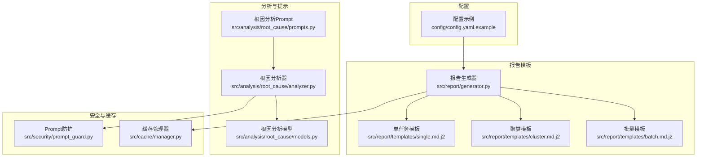
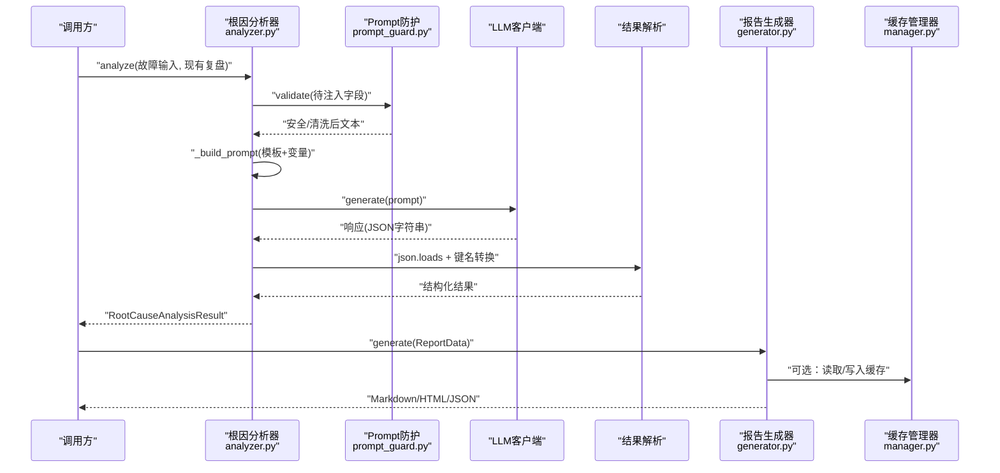
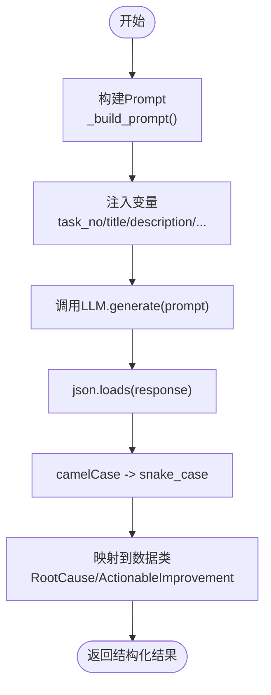
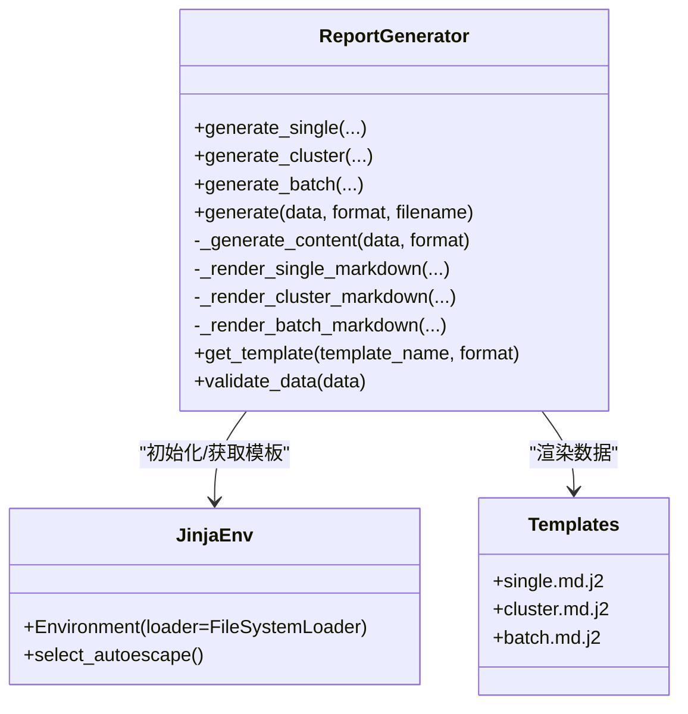
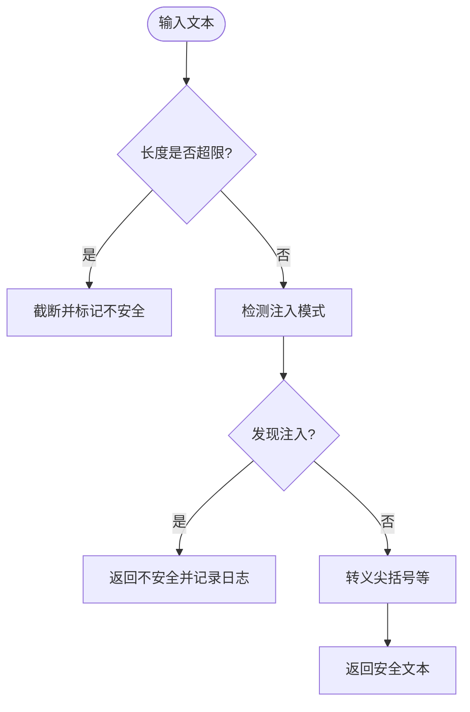
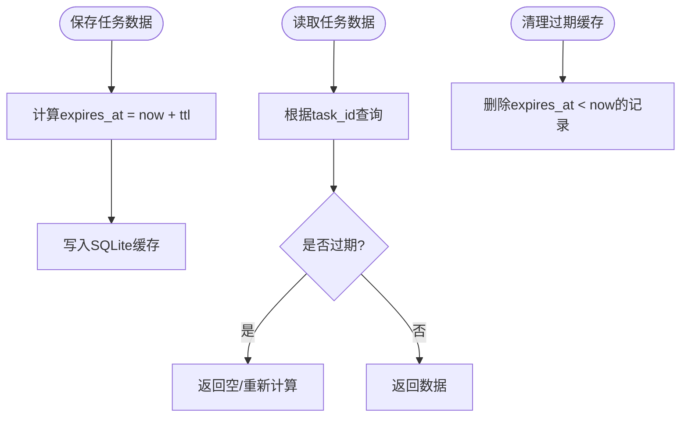
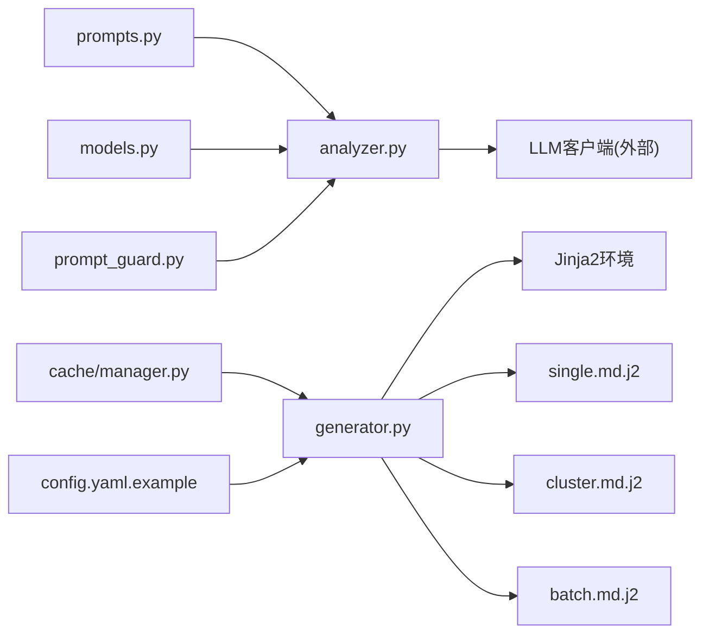

# Prompt模板管理

<cite>
**本文引用的文件**
- [src/analysis/root_cause/prompts.py](file://src/analysis/root_cause/prompts.py)
- [src/analysis/root_cause/analyzer.py](file://src/analysis/root_cause/analyzer.py)
- [src/analysis/root_cause/models.py](file://src/analysis/root_cause/models.py)
- [src/report/generator.py](file://src/report/generator.py)
- [src/report/templates/single.md.j2](file://src/report/templates/single.md.j2)
- [src/report/templates/cluster.md.j2](file://src/report/templates/cluster.md.j2)
- [src/report/templates/batch.md.j2](file://src/report/templates/batch.md.j2)
- [src/security/prompt_guard.py](file://src/security/prompt_guard.py)
- [src/cache/manager.py](file://src/cache/manager.py)
- [config/config.yaml.example](file://config/config.yaml.example)
</cite>

## 目录
1. [简介](#简介)
2. [项目结构](#项目结构)
3. [核心组件](#核心组件)
4. [架构总览](#架构总览)
5. [详细组件分析](#详细组件分析)
6. [依赖关系分析](#依赖关系分析)
7. [性能与缓存](#性能与缓存)
8. [安全与校验](#安全与校验)
9. [故障排查指南](#故障排查指南)
10. [结论](#结论)
11. [附录：最佳实践与示例路径](#附录最佳实践与示例路径)

## 简介
本技术文档围绕“Prompt模板管理系统”展开，聚焦以下目标：
- 版本控制策略：如何组织、演进和回滚Prompt模板。
- 动态参数替换机制：如何在运行时将业务数据注入到模板中。
- 模板继承关系：如何通过组合与复用实现模板的层次化扩展。
- 根因分析专用Prompt的结构设计、变量注入方式与格式约束。
- 模板加载流程、缓存策略与热更新机制。
- 创建新模板、定义占位符与管理版本的实操指引（以代码片段路径替代具体代码）。
- Prompt优化最佳实践、A/B测试框架与效果评估指标。
- 模板安全校验、输入验证与防注入攻击措施。

## 项目结构
本项目在多个模块中涉及模板与提示词的管理与渲染：
- 根因分析Prompt模板位于分析模块，采用字符串常量+格式化注入的方式。
- 报告模板位于报告模块，使用Jinja2模板引擎进行渲染，支持自定义模板目录与默认模板回退。
- 安全模块提供Prompt注入检测与清洗能力。
- 缓存模块提供基于SQLite的键值缓存，可用于存储中间结果或已解析模板内容。
- 配置模块提供YAML/JSON配置与环境变量覆盖，便于切换模型、输出格式等。

图表来源
- [src/analysis/root_cause/prompts.py:1-85](file://src/analysis/root_cause/prompts.py#L1-L85)
- [src/analysis/root_cause/analyzer.py:1-131](file://src/analysis/root_cause/analyzer.py#L1-L131)
- [src/analysis/root_cause/models.py:1-67](file://src/analysis/root_cause/models.py#L1-L67)
- [src/report/generator.py:1-790](file://src/report/generator.py#L1-L790)
- [src/report/templates/single.md.j2:1-58](file://src/report/templates/single.md.j2#L1-L58)
- [src/report/templates/cluster.md.j2:1-36](file://src/report/templates/cluster.md.j2#L1-L36)
- [src/report/templates/batch.md.j2:1-31](file://src/report/templates/batch.md.j2#L1-L31)
- [src/security/prompt_guard.py:1-198](file://src/security/prompt_guard.py#L1-L198)
- [src/cache/manager.py:1-165](file://src/cache/manager.py#L1-L165)
- [config/config.yaml.example:1-38](file://config/config.yaml.example#L1-L38)

章节来源
- [src/analysis/root_cause/prompts.py:1-85](file://src/analysis/root_cause/prompts.py#L1-L85)
- [src/analysis/root_cause/analyzer.py:1-131](file://src/analysis/root_cause/analyzer.py#L1-L131)
- [src/analysis/root_cause/models.py:1-67](file://src/analysis/root_cause/models.py#L1-L67)
- [src/report/generator.py:1-790](file://src/report/generator.py#L1-L790)
- [src/report/templates/single.md.j2:1-58](file://src/report/templates/single.md.j2#L1-L58)
- [src/report/templates/cluster.md.j2:1-36](file://src/report/templates/cluster.md.j2#L1-L36)
- [src/report/templates/batch.md.j2:1-31](file://src/report/templates/batch.md.j2#L1-L31)
- [src/security/prompt_guard.py:1-198](file://src/security/prompt_guard.py#L1-L198)
- [src/cache/manager.py:1-165](file://src/cache/manager.py#L1-L165)
- [config/config.yaml.example:1-38](file://config/config.yaml.example#L1-L38)

## 核心组件
- 根因分析Prompt模板：集中定义用于LLM分析的指令与输出格式约束，通过Python字符串格式化注入变量。
- 根因分析器：负责组装输入、构建Prompt、调用LLM并解析返回为结构化结果。
- 报告模板系统：基于Jinja2的模板渲染，支持内置模板与自定义模板目录，具备自动转义与回退机制。
- Prompt安全防护：提供注入模式检测、文本清洗与验证接口。
- 缓存管理：基于SQLite的TTL缓存，可存储任务级中间结果或模板渲染产物。
- 配置管理：YAML/JSON配置与环境变量覆盖，驱动行为开关与参数。

章节来源
- [src/analysis/root_cause/prompts.py:1-85](file://src/analysis/root_cause/prompts.py#L1-L85)
- [src/analysis/root_cause/analyzer.py:1-131](file://src/analysis/root_cause/analyzer.py#L1-L131)
- [src/report/generator.py:1-790](file://src/report/generator.py#L1-L790)
- [src/security/prompt_guard.py:1-198](file://src/security/prompt_guard.py#L1-L198)
- [src/cache/manager.py:1-165](file://src/cache/manager.py#L1-L165)
- [config/config.yaml.example:1-38](file://config/config.yaml.example#L1-L38)

## 架构总览
下图展示从输入到输出的端到端流程，包括Prompt构建、安全校验、LLM调用、结果解析与报告渲染。

图表来源
- [src/analysis/root_cause/analyzer.py:56-116](file://src/analysis/root_cause/analyzer.py#L56-L116)
- [src/security/prompt_guard.py:100-141](file://src/security/prompt_guard.py#L100-L141)
- [src/report/generator.py:250-393](file://src/report/generator.py#L250-L393)
- [src/cache/manager.py:37-88](file://src/cache/manager.py#L37-L88)

## 详细组件分析

### 根因分析Prompt模板与注入机制
- 模板位置与职责：根因分析Prompt定义了角色设定、输入信息块、分析要求与JSON输出格式约束。
- 变量注入方式：通过Python字符串format方法将故障信息与现有复盘结论注入到模板占位符中。
- 输出格式约束：强制LLM返回JSON，包含问题分类、初始原因、深层根因、改进建议与清单推荐等字段。
- 键名兼容处理：解析后将camelCase键转换为snake_case，适配内部数据类。

图表来源
- [src/analysis/root_cause/analyzer.py:56-116](file://src/analysis/root_cause/analyzer.py#L56-L116)
- [src/analysis/root_cause/models.py:8-67](file://src/analysis/root_cause/models.py#L8-L67)
- [src/analysis/root_cause/prompts.py:1-85](file://src/analysis/root_cause/prompts.py#L1-L85)

章节来源
- [src/analysis/root_cause/prompts.py:1-85](file://src/analysis/root_cause/prompts.py#L1-L85)
- [src/analysis/root_cause/analyzer.py:1-131](file://src/analysis/root_cause/analyzer.py#L1-L131)
- [src/analysis/root_cause/models.py:1-67](file://src/analysis/root_cause/models.py#L1-L67)

### 报告模板系统与Jinja2渲染
- 模板类型：单任务、聚类、批量三类报告模板，分别对应不同场景的数据结构与展示需求。
- 渲染流程：优先尝试从自定义模板目录加载Jinja2模板；若失败则回退至内置模板或默认渲染逻辑。
- 自动转义：启用autoescape，避免XSS风险。
- 输出格式：支持Markdown、HTML、PDF（HTML包装）、JSON等多种格式。

图表来源
- [src/report/generator.py:222-393](file://src/report/generator.py#L222-L393)
- [src/report/templates/single.md.j2:1-58](file://src/report/templates/single.md.j2#L1-L58)
- [src/report/templates/cluster.md.j2:1-36](file://src/report/templates/cluster.md.j2#L1-L36)
- [src/report/templates/batch.md.j2:1-31](file://src/report/templates/batch.md.j2#L1-L31)

章节来源
- [src/report/generator.py:1-790](file://src/report/generator.py#L1-L790)
- [src/report/templates/single.md.j2:1-58](file://src/report/templates/single.md.j2#L1-L58)
- [src/report/templates/cluster.md.j2:1-36](file://src/report/templates/cluster.md.j2#L1-L36)
- [src/report/templates/batch.md.j2:1-31](file://src/report/templates/batch.md.j2#L1-L31)

### Prompt安全防护与输入校验
- 注入模式检测：内置正则集合匹配常见忽略指令、系统提示覆盖、角色扮演、特殊模式与XML标签注入。
- 文本清洗：对尖括号进行转义，降低注入风险。
- 验证与防护：提供validate与guard函数，长度限制、注入检测与安全返回。

图表来源
- [src/security/prompt_guard.py:53-141](file://src/security/prompt_guard.py#L53-L141)

章节来源
- [src/security/prompt_guard.py:1-198](file://src/security/prompt_guard.py#L1-L198)

### 缓存策略与热更新
- 缓存存储：SQLite数据库，表结构包含任务ID、数据、创建时间与过期时间。
- TTL机制：按秒设置过期时间，查询时判断是否过期。
- 清理与统计：支持过期清理、索引查看、状态查询与统计。
- 热更新：可通过CLI命令或API触发缓存失效与清理，结合配置项调整TTL与存储路径。

图表来源
- [src/cache/manager.py:10-88](file://src/cache/manager.py#L10-L88)
- [src/cache/manager.py:156-165](file://src/cache/manager.py#L156-L165)

章节来源
- [src/cache/manager.py:1-165](file://src/cache/manager.py#L1-L165)

## 依赖关系分析
- 根因分析器依赖：
  - 模板常量：ROOT_CAUSE_ANALYSIS_PROMPT
  - 数据模型：FaultAnalysisInput、ExistingFaultAnalysis、RootCauseAnalysisResult
  - LLM客户端：外部注入，需提供generate(prompt)接口
- 报告生成器依赖：
  - Jinja2环境：FileSystemLoader与autoescape
  - 模板文件：single.md.j2、cluster.md.j2、batch.md.j2
  - 可选缓存：读写中间结果或渲染产物
- 安全模块独立：提供通用防护能力，被分析器与报告生成器按需调用。
- 配置驱动：YAML/JSON与环境变量覆盖影响LLM、缓存、输出格式等行为。

图表来源
- [src/analysis/root_cause/prompts.py:1-85](file://src/analysis/root_cause/prompts.py#L1-L85)
- [src/analysis/root_cause/analyzer.py:1-131](file://src/analysis/root_cause/analyzer.py#L1-L131)
- [src/analysis/root_cause/models.py:1-67](file://src/analysis/root_cause/models.py#L1-L67)
- [src/report/generator.py:1-790](file://src/report/generator.py#L1-L790)
- [src/report/templates/single.md.j2:1-58](file://src/report/templates/single.md.j2#L1-L58)
- [src/report/templates/cluster.md.j2:1-36](file://src/report/templates/cluster.md.j2#L1-L36)
- [src/report/templates/batch.md.j2:1-31](file://src/report/templates/batch.md.j2#L1-L31)
- [src/security/prompt_guard.py:1-198](file://src/security/prompt_guard.py#L1-L198)
- [src/cache/manager.py:1-165](file://src/cache/manager.py#L1-L165)
- [config/config.yaml.example:1-38](file://config/config.yaml.example#L1-L38)

章节来源
- [src/analysis/root_cause/analyzer.py:1-131](file://src/analysis/root_cause/analyzer.py#L1-L131)
- [src/report/generator.py:1-790](file://src/report/generator.py#L1-L790)
- [src/security/prompt_guard.py:1-198](file://src/security/prompt_guard.py#L1-L198)
- [src/cache/manager.py:1-165](file://src/cache/manager.py#L1-L165)
- [config/config.yaml.example:1-38](file://config/config.yaml.example#L1-L38)

## 性能与缓存
- 模板渲染性能：Jinja2模板编译一次后可重复使用；自定义模板目录需确保文件系统I/O稳定。
- LLM调用开销：Prompt构建与JSON解析成本较低，主要瓶颈在LLM网络与推理时间。
- 缓存收益：对相同任务ID的中间结果或报告内容进行缓存，可减少重复计算与网络请求。
- TTL调优：根据业务SLA与数据新鲜度要求调整缓存TTL；长尾热点数据可延长TTL。
- 清理策略：定期执行过期清理，避免数据库膨胀。

[本节为通用指导，不直接分析具体文件]

## 安全与校验
- Prompt注入防护：在构建Prompt前对注入字段进行安全校验与清洗，阻断恶意模式。
- 模板渲染安全：启用autoescape，防止用户输入在HTML/Markdown中引发安全问题。
- 输入长度限制：统一限制最大长度，避免超长输入导致资源耗尽。
- 白名单与黑名单：结合规则与正则，对敏感指令与标签进行拦截。
- 审计与日志：记录注入检测与拒绝事件，便于追踪与回溯。

章节来源
- [src/security/prompt_guard.py:1-198](file://src/security/prompt_guard.py#L1-L198)
- [src/report/generator.py:236-242](file://src/report/generator.py#L236-L242)

## 故障排查指南
- 模板未找到：检查自定义模板目录是否存在且命名正确；确认get_template调用后缀与扩展名一致。
- JSON解析失败：核对LLM返回是否符合约定格式；必要时增加容错与重试逻辑。
- 缓存命中异常：确认TTL设置与系统时间一致性；检查SQLite权限与路径。
- 注入误报/漏报：调整INJECTION_PATTERNS正则集合，结合业务场景补充模式。
- 渲染错误：检查模板变量是否齐全；利用validate_data提前校验数据结构。

章节来源
- [src/report/generator.py:707-716](file://src/report/generator.py#L707-L716)
- [src/report/generator.py:718-737](file://src/report/generator.py#L718-L737)
- [src/cache/manager.py:37-88](file://src/cache/manager.py#L37-L88)
- [src/security/prompt_guard.py:63-122](file://src/security/prompt_guard.py#L63-L122)

## 结论
本系统通过“Prompt模板+Jinja2报告模板+安全防护+缓存”的组合，实现了灵活、可扩展且安全的模板管理与渲染能力。根因分析Prompt采用强约束的JSON输出，配合键名转换与数据类映射，提升了结果的可解析性与稳定性。报告模板系统支持多格式输出与自定义模板目录，具备良好的热更新与回退能力。安全防护层有效降低了注入风险，缓存层提升了整体性能与可用性。

[本节为总结性内容，不直接分析具体文件]

## 附录：最佳实践与示例路径
- 创建新模板
  - 根因分析Prompt：参考路径[src/analysis/root_cause/prompts.py:1-85](file://src/analysis/root_cause/prompts.py#L1-L85)，新增常量并在分析器中引用。
  - 报告模板：在[src/report/templates:1-58](file://src/report/templates/single.md.j2#L1-L58)下新增j2文件，并在生成器中注册渲染逻辑。
- 定义参数占位符
  - Python字符串模板：使用{var}占位符，在_build_prompt中传入对应字段。
  - Jinja2模板：使用{{ var }}与/控制流，参见模板文件。
- 管理模板版本
  - 文件名加版本号（如single_v2.md.j2），在生成器中通过配置选择版本。
  - 使用配置项（如output.format、template.version）驱动版本切换。
- Prompt优化最佳实践
  - 明确输出格式与字段约束，减少自由文本比例。
  - 分阶段提示：先分类再深挖，提升可控性。
  - 证据驱动：要求每个结论附带证据，增强可解释性。
- A/B测试框架
  - 在分析器中引入模板版本参数，随机选择不同Prompt变体。
  - 记录每次调用的模板版本、输入摘要与结果质量评分。
- 效果评估指标
  - 准确性：人工抽检与自动化规则交叉验证。
  - 稳定性：多次运行方差与失败率。
  - 效率：平均耗时与缓存命中率。
  - 安全性：注入拦截率与误报率。
- 安全校验与防注入
  - 在注入前调用PromptGuard.validate/guard。
  - 对HTML输出启用autoescape，避免XSS。
  - 限制输入长度与字符集，过滤危险符号。

章节来源
- [src/analysis/root_cause/prompts.py:1-85](file://src/analysis/root_cause/prompts.py#L1-L85)
- [src/analysis/root_cause/analyzer.py:56-116](file://src/analysis/root_cause/analyzer.py#L56-L116)
- [src/report/generator.py:222-393](file://src/report/generator.py#L222-L393)
- [src/report/templates/single.md.j2:1-58](file://src/report/templates/single.md.j2#L1-L58)
- [src/report/templates/cluster.md.j2:1-36](file://src/report/templates/cluster.md.j2#L1-L36)
- [src/report/templates/batch.md.j2:1-31](file://src/report/templates/batch.md.j2#L1-L31)
- [src/security/prompt_guard.py:100-141](file://src/security/prompt_guard.py#L100-L141)
- [config/config.yaml.example:1-38](file://config/config.yaml.example#L1-L38)