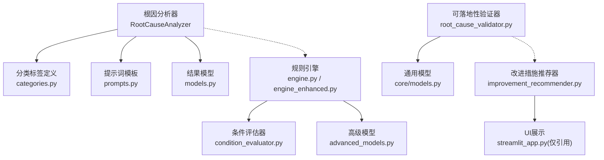
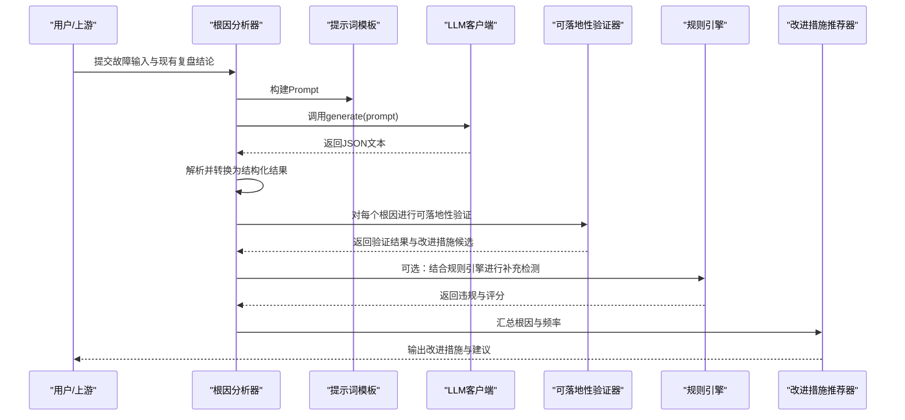
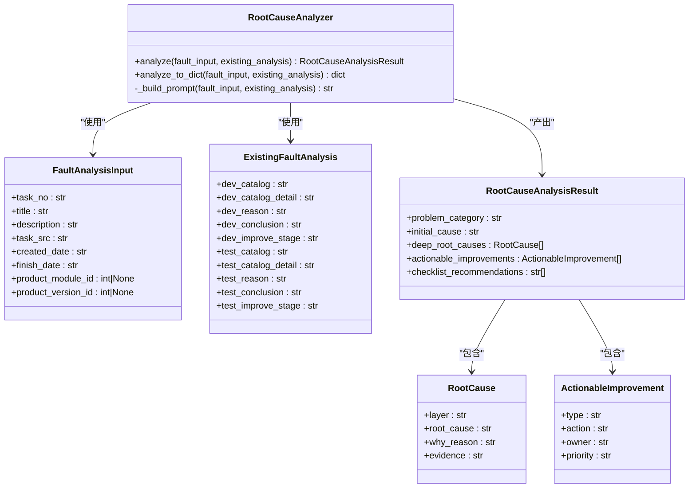
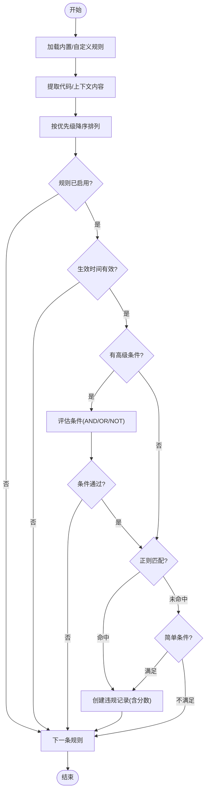
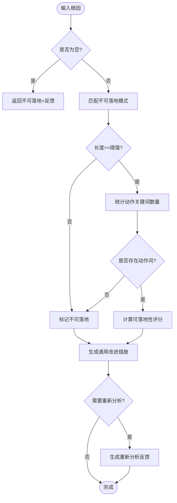
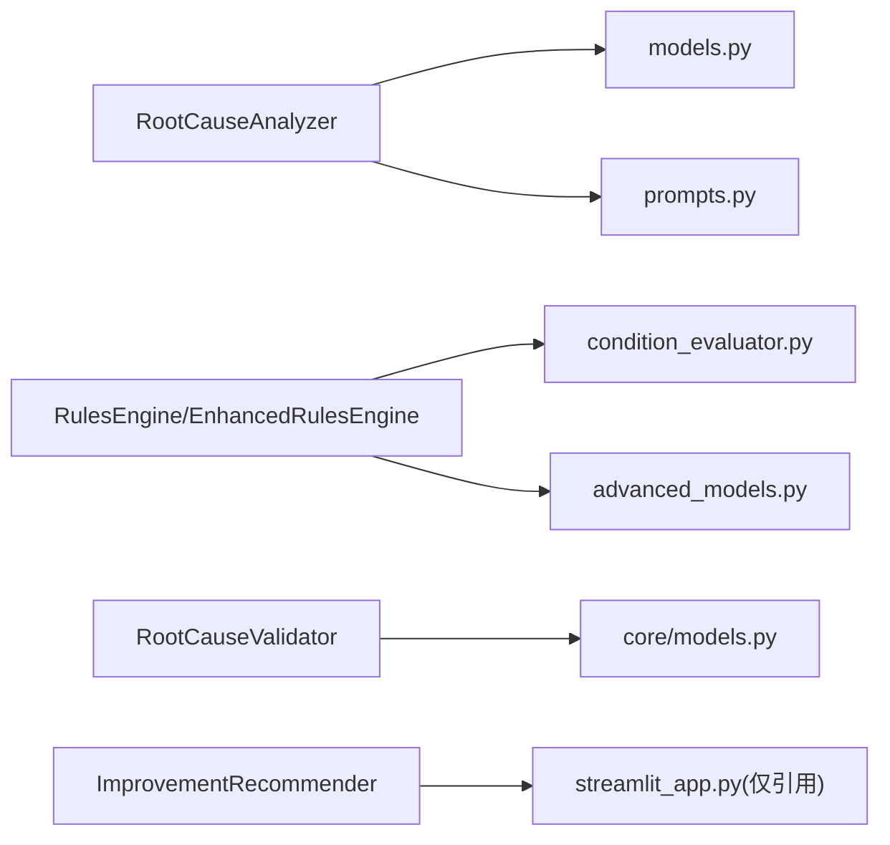

# 根因分类体系

<cite>
**本文引用的文件**   
- [src/analysis/root_cause/analyzer.py](file://src/analysis/root_cause/analyzer.py)
- [src/analysis/root_cause/models.py](file://src/analysis/root_cause/models.py)
- [src/analysis/root_cause/prompts.py](file://src/analysis/root_cause/prompts.py)
- [src/analysis/root_cause_validator.py](file://src/analysis/root_cause_validator.py)
- [src/rules/categories.py](file://src/rules/categories.py)
- [src/rules/engine.py](file://src/rules/engine.py)
- [src/rules/engine_enhanced.py](file://src/rules/engine_enhanced.py)
- [src/rules/condition_evaluator.py](file://src/rules/condition_evaluator.py)
- [src/rules/advanced_models.py](file://src/rules/advanced_models.py)
- [src/rules/models.py](file://src/rules/models.py)
- [src/rules/builtin/database_rules.yaml](file://src/rules/builtin/database_rules.yaml)
- [src/rules/custom/example_custom_rules.yaml](file://src/rules/custom/example_custom_rules.yaml)
- [src/core/models.py](file://src/core/models.py)
- [src/analysis/improvement_recommender.py](file://src/analysis/improvement_recommender.py)
- [tests/analysis/test_root_cause_validator.py](file://tests/analysis/test_root_cause_validator.py)
</cite>

## 目录
1. [引言](#引言)
2. [项目结构](#项目结构)
3. [核心组件](#核心组件)
4. [架构总览](#架构总览)
5. [详细组件分析](#详细组件分析)
6. [依赖关系分析](#依赖关系分析)
7. [性能与可扩展性](#性能与可扩展性)
8. [训练数据与特征工程](#训练数据与特征工程)
9. [分类规则、优先级与冲突解决](#分类规则优先级与冲突解决)
10. [置信度计算与模糊匹配](#置信度计算与模糊匹配)
11. [人工审核流程](#人工审核流程)
12. [准确率评估与持续改进](#准确率评估与持续改进)
13. [故障排查指南](#故障排查指南)
14. [结论](#结论)

## 引言
本技术文档围绕“根因分类体系”的设计与实现，系统阐述以下方面：
- 根因分类标签体系（代码缺陷、配置错误、依赖问题、测试不足等）的定义与判断标准
- 分类模型的训练数据准备、特征工程方法与分类算法选择
- 分类规则的优先级机制、冲突解决策略与可扩展性设计
- 如何添加新类别、自定义规则与调整权重
- 置信度计算、模糊匹配处理与人工审核流程
- 分类准确率评估方法与持续改进机制

## 项目结构
根因分类体系涉及“LLM驱动的深度根因分析 + 规则引擎驱动的违规检测 + 可落地性验证 + 改进措施推荐”的闭环。关键模块分布如下：
- 根因分析器：基于提示词模板与LLM进行深层根因挖掘与结构化输出
- 分类标签定义：统一的分类枚举与术语表
- 规则引擎：内置与自定义规则加载、条件评估、评分与评估报告
- 可落地性验证：对根因的可执行性与改进措施生成进行校验
- 改进措施推荐：按根因类型与频率生成建议并排序

图表来源
- [src/analysis/root_cause/analyzer.py:44-131](file://src/analysis/root_cause/analyzer.py#L44-L131)
- [src/analysis/root_cause/models.py:8-67](file://src/analysis/root_cause/models.py#L8-L67)
- [src/analysis/root_cause/prompts.py:1-85](file://src/analysis/root_cause/prompts.py#L1-L85)
- [src/rules/engine.py:217-352](file://src/rules/engine.py#L217-L352)
- [src/rules/engine_enhanced.py:22-388](file://src/rules/engine_enhanced.py#L22-L388)
- [src/rules/condition_evaluator.py:12-189](file://src/rules/condition_evaluator.py#L12-L189)
- [src/rules/advanced_models.py:50-102](file://src/rules/advanced_models.py#L50-L102)
- [src/analysis/root_cause_validator.py:139-368](file://src/analysis/root_cause_validator.py#L139-L368)
- [src/core/models.py:182-211](file://src/core/models.py#L182-L211)
- [src/analysis/improvement_recommender.py:40-228](file://src/analysis/improvement_recommender.py#L40-L228)

章节来源
- [src/analysis/root_cause/analyzer.py:44-131](file://src/analysis/root_cause/analyzer.py#L44-L131)
- [src/analysis/root_cause/models.py:8-67](file://src/analysis/root_cause/models.py#L8-L67)
- [src/analysis/root_cause/prompts.py:1-85](file://src/analysis/root_cause/prompts.py#L1-L85)
- [src/rules/engine.py:217-352](file://src/rules/engine.py#L217-L352)
- [src/rules/engine_enhanced.py:22-388](file://src/rules/engine_enhanced.py#L22-L388)
- [src/rules/condition_evaluator.py:12-189](file://src/rules/condition_evaluator.py#L12-L189)
- [src/rules/advanced_models.py:50-102](file://src/rules/advanced_models.py#L50-L102)
- [src/analysis/root_cause_validator.py:139-368](file://src/analysis/root_cause_validator.py#L139-L368)
- [src/core/models.py:182-211](file://src/core/models.py#L182-L211)
- [src/analysis/improvement_recommender.py:40-228](file://src/analysis/improvement_recommender.py#L40-L228)

## 核心组件
- 根因分析器：负责组装输入、调用LLM、解析JSON响应并转换为结构化结果
- 分类标签体系：提供环节、原因类型、问题类型等统一词汇表
- 规则引擎：支持正则匹配与条件表达式，具备优先级、权重与评分能力
- 可落地性验证器：判定根因是否可落地，生成改进措施与反馈
- 改进措施推荐器：根据根因类型与频率生成建议并按优先级排序

章节来源
- [src/analysis/root_cause/analyzer.py:44-131](file://src/analysis/root_cause/analyzer.py#L44-L131)
- [src/rules/categories.py:8-91](file://src/rules/categories.py#L8-L91)
- [src/rules/engine.py:217-352](file://src/rules/engine.py#L217-L352)
- [src/rules/engine_enhanced.py:22-388](file://src/rules/engine_enhanced.py#L22-L388)
- [src/analysis/root_cause_validator.py:139-368](file://src/analysis/root_cause_validator.py#L139-L368)
- [src/analysis/improvement_recommender.py:40-228](file://src/analysis/improvement_recommender.py#L40-L228)

## 架构总览
根因分类体系采用“LLM深度分析 + 规则引擎约束 + 可落地性验证 + 改进措施推荐”的分层架构。LLM负责从现有复盘结论出发进行深层追问；规则引擎用于将规范与经验固化为可执行的检查项；验证器确保根因可落地；推荐器给出优先级明确的改进建议。

图表来源
- [src/analysis/root_cause/analyzer.py:79-131](file://src/analysis/root_cause/analyzer.py#L79-L131)
- [src/analysis/root_cause/prompts.py:1-85](file://src/analysis/root_cause/prompts.py#L1-L85)
- [src/analysis/root_cause_validator.py:139-368](file://src/analysis/root_cause_validator.py#L139-L368)
- [src/rules/engine.py:217-352](file://src/rules/engine.py#L217-L352)
- [src/analysis/improvement_recommender.py:40-228](file://src/analysis/improvement_recommender.py#L40-L228)

## 详细组件分析

### 根因分析器与数据模型
- 职责：组装Prompt、调用LLM、解析JSON、转换键名、构造结果对象
- 输入：任务信息、现有研发/测试复盘结论
- 输出：问题分类、初始原因、深层根因列表、可落地改进措施、清单建议

图表来源
- [src/analysis/root_cause/analyzer.py:44-131](file://src/analysis/root_cause/analyzer.py#L44-L131)
- [src/analysis/root_cause/models.py:8-67](file://src/analysis/root_cause/models.py#L8-L67)

章节来源
- [src/analysis/root_cause/analyzer.py:44-131](file://src/analysis/root_cause/analyzer.py#L44-L131)
- [src/analysis/root_cause/models.py:8-67](file://src/analysis/root_cause/models.py#L8-L67)
- [src/analysis/root_cause/prompts.py:1-85](file://src/analysis/root_cause/prompts.py#L1-L85)

### 分类标签体系与扩展点
- 环节分类：需求、设计、编码、测试、发布、运维
- 原因类型：覆盖需求理解偏差、设计缺陷、编码错误、并发/性能/安全、第三方依赖、配置错误、环境差异、测试不足等
- 问题类型：需求描述不清、边界遗漏、空值处理、异常处理、接口问题、配置与环境问题等
- 扩展方式：在统一列表中新增条目，并在提示词或规则中映射到具体场景

章节来源
- [src/rules/categories.py:8-91](file://src/rules/categories.py#L8-L91)

### 规则引擎与条件评估
- 基础规则引擎：加载内置与自定义规则，支持正则匹配与简单条件
- 增强规则引擎：引入优先级、权重、评分、热重载、条件组合（AND/OR/NOT）、评估报告
- 条件评估器：支持比较、包含、匹配、存在性、空值等原子操作，以及复合条件树

图表来源
- [src/rules/engine_enhanced.py:170-333](file://src/rules/engine_enhanced.py#L170-L333)
- [src/rules/condition_evaluator.py:12-189](file://src/rules/condition_evaluator.py#L12-L189)
- [src/rules/engine.py:217-352](file://src/rules/engine.py#L217-L352)

章节来源
- [src/rules/engine.py:217-352](file://src/rules/engine.py#L217-L352)
- [src/rules/engine_enhanced.py:22-388](file://src/rules/engine_enhanced.py#L22-L388)
- [src/rules/condition_evaluator.py:12-189](file://src/rules/condition_evaluator.py#L12-L189)
- [src/rules/advanced_models.py:50-102](file://src/rules/advanced_models.py#L50-L102)

### 可落地性验证器
- 目标：识别不可落地的笼统根因，生成改进措施与重新分析反馈
- 方法：关键词与模式匹配、长度阈值、动作词统计、领域术语加权
- 输出：是否可落地、可落地性评分、改进措施列表、是否需要重新分析及反馈

图表来源
- [src/analysis/root_cause_validator.py:139-368](file://src/analysis/root_cause_validator.py#L139-L368)

章节来源
- [src/analysis/root_cause_validator.py:139-368](file://src/analysis/root_cause_validator.py#L139-L368)
- [tests/analysis/test_root_cause_validator.py:32-65](file://tests/analysis/test_root_cause_validator.py#L32-L65)

### 改进措施推荐器
- 功能：按根因类型与频率生成改进措施，按优先级排序，输出报告
- 分类依据：关键词匹配（如“需求/设计/代码/测试/运维”等）
- 输出：每条措施的验收标准与预期影响，便于跟踪闭环

章节来源
- [src/analysis/improvement_recommender.py:40-228](file://src/analysis/improvement_recommender.py#L40-L228)

## 依赖关系分析
- 根因分析器依赖提示词模板与数据模型
- 规则引擎依赖条件评估器与高级模型
- 可落地性验证器依赖通用模型
- 改进措施推荐器与UI展示解耦，仅作为后端逻辑

图表来源
- [src/analysis/root_cause/analyzer.py:44-131](file://src/analysis/root_cause/analyzer.py#L44-L131)
- [src/analysis/root_cause/models.py:8-67](file://src/analysis/root_cause/models.py#L8-L67)
- [src/analysis/root_cause/prompts.py:1-85](file://src/analysis/root_cause/prompts.py#L1-L85)
- [src/rules/engine.py:217-352](file://src/rules/engine.py#L217-L352)
- [src/rules/engine_enhanced.py:22-388](file://src/rules/engine_enhanced.py#L22-L388)
- [src/rules/condition_evaluator.py:12-189](file://src/rules/condition_evaluator.py#L12-L189)
- [src/rules/advanced_models.py:50-102](file://src/rules/advanced_models.py#L50-L102)
- [src/analysis/root_cause_validator.py:139-368](file://src/analysis/root_cause_validator.py#L139-L368)
- [src/core/models.py:182-211](file://src/core/models.py#L182-L211)
- [src/analysis/improvement_recommender.py:40-228](file://src/analysis/improvement_recommender.py#L40-L228)

## 性能与可扩展性
- 规则引擎按优先级排序执行，避免低优先级规则干扰高优先级决策
- 热重载支持在线更新规则，无需重启服务
- 条件评估器支持复杂条件组合，减少硬编码分支
- 可扩展点：新增分类、规则、权重与评分策略均通过配置或轻量代码变更实现

[本节为通用指导，不涉及具体文件分析]

## 训练数据与特征工程
- 训练数据来源：历史故障单、复盘结论、代码变更消息、规则匹配证据
- 特征工程方向：
  - 文本特征：标题、描述、复盘结论的关键字与短语
  - 规则特征：命中规则ID、严重级别、类别得分
  - 过程特征：开发/测试环节指标、改进措施优先级
- 分类算法选择：
  - 零样本/少样本：基于提示词模板的LLM分类
  - 监督学习：若积累标注数据，可采用多标签分类模型（当前仓库未提供具体实现）
  - 无监督聚类：用于发现潜在根因簇（与本分类体系互补）

[本节为通用指导，不涉及具体文件分析]

## 分类规则、优先级与冲突解决
- 优先级机制：规则按priority降序执行，先高后低，避免低优先级误判覆盖高优先级
- 冲突解决策略：
  - 同一事件命中多条规则时，以最高score的规则为主，其余作为辅助证据
  - 条件组合（AND/OR/NOT）用于限定触发范围，降低误报
- 可扩展性设计：
  - 新增分类：在categories.py中扩展术语表，并在提示词与规则中映射
  - 自定义规则：在custom目录下新增YAML，支持pattern或condition
  - 权重调整：在AdvancedRule中设置weight与priority，影响最终评分

章节来源
- [src/rules/engine_enhanced.py:170-333](file://src/rules/engine_enhanced.py#L170-L333)
- [src/rules/condition_evaluator.py:12-189](file://src/rules/condition_evaluator.py#L12-L189)
- [src/rules/advanced_models.py:50-102](file://src/rules/advanced_models.py#L50-L102)
- [src/rules/custom/example_custom_rules.yaml:1-41](file://src/rules/custom/example_custom_rules.yaml#L1-L41)
- [src/rules/builtin/database_rules.yaml:1-39](file://src/rules/builtin/database_rules.yaml#L1-L39)
- [src/rules/categories.py:8-91](file://src/rules/categories.py#L8-L91)

## 置信度计算与模糊匹配
- 置信度来源：
  - 规则评分：severity、priority、weight共同决定单条规则score
  - 综合评分：整体分数=100减去所有违规score之和，下限为0
- 模糊匹配：
  - 条件评估器支持contains/matches/in/not_in等语义操作
  - 正则匹配用于代码片段扫描，提升召回率
- 人工复核：
  - 当置信度低于阈值或存在冲突时，进入人工审核流程

章节来源
- [src/rules/engine_enhanced.py:319-373](file://src/rules/engine_enhanced.py#L319-L373)
- [src/rules/condition_evaluator.py:12-189](file://src/rules/condition_evaluator.py#L12-L189)

## 人工审核流程
- 触发条件：置信度低、规则冲突、根因不可落地
- 流程步骤：
  1) 系统自动标注待审核项与理由
  2) 人工确认/修正分类与根因
  3) 反馈至系统，用于后续规则优化与提示词调优
  4) 更新改进措施优先级与验收标准

[本节为通用指导，不涉及具体文件分析]

## 准确率评估与持续改进
- 评估方法：
  - 精确率/召回率/F1：基于人工标注集对比系统输出
  - 一致性检验：多人标注间Kappa系数
  - 趋势监控：随版本迭代观察准确率变化
- 持续改进：
  - 规则库演进：定期评审与合并冗余规则
  - 提示词调优：基于失败案例优化Prompt结构与示例
  - 特征扩充：引入更多上下文与过程指标

[本节为通用指导，不涉及具体文件分析]

## 故障排查指南
- 常见问题：
  - 规则未生效：检查enabled字段与生效时间窗口
  - 条件评估失败：核对表达式语法与上下文键路径
  - JSON解析异常：确认LLM输出符合模板结构
- 定位手段：
  - 查看日志中的规则加载与评估信息
  - 打印违规明细与匹配证据
  - 使用最小化用例复现

章节来源
- [src/rules/engine_enhanced.py:105-130](file://src/rules/engine_enhanced.py#L105-L130)
- [src/rules/engine.py:252-310](file://src/rules/engine.py#L252-L310)
- [src/analysis/root_cause/analyzer.py:95-116](file://src/analysis/root_cause/analyzer.py#L95-L116)

## 结论
本根因分类体系以“LLM深度分析 + 规则引擎约束 + 可落地性验证 + 改进措施推荐”为核心，形成从发现问题到闭环改进的完整链路。通过清晰的分类标签、灵活的规则配置与科学的评分机制，既保证了分类的一致性与可解释性，又具备良好的可扩展性与持续改进能力。
