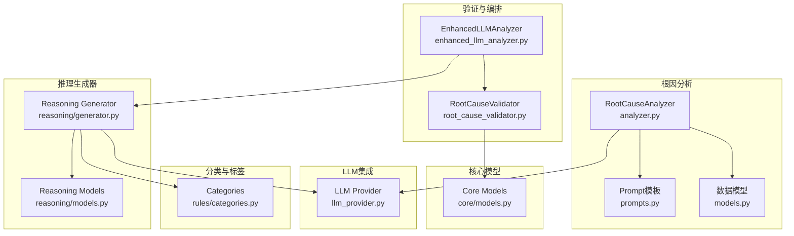
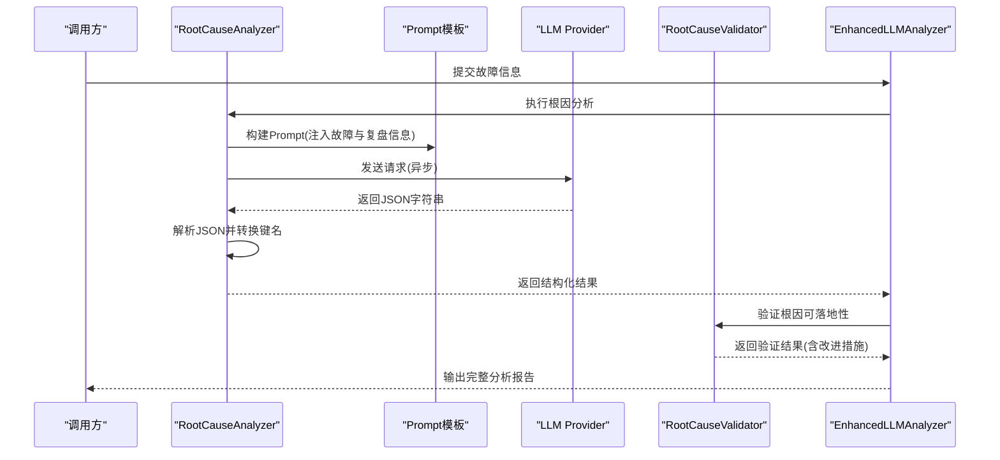
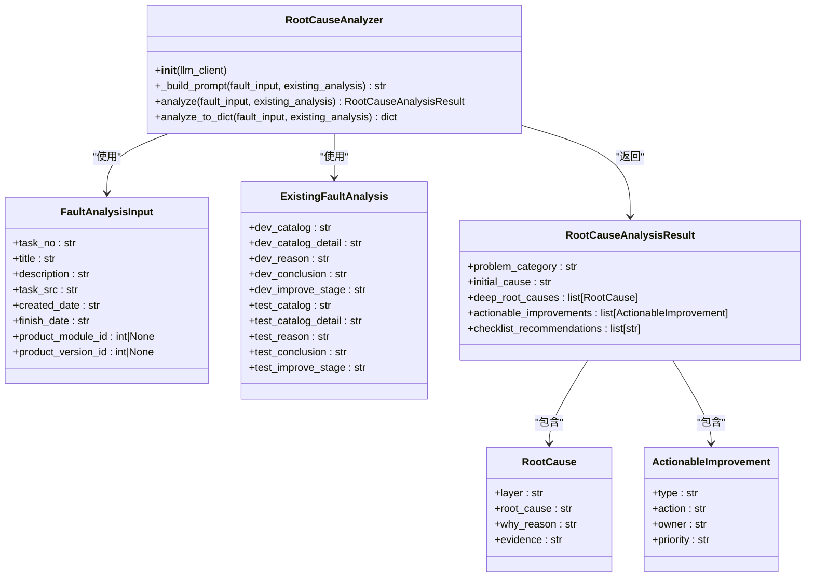
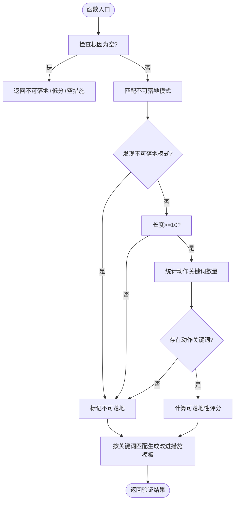
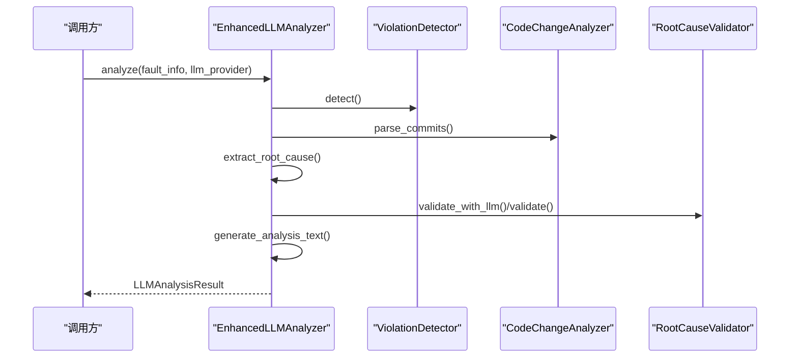
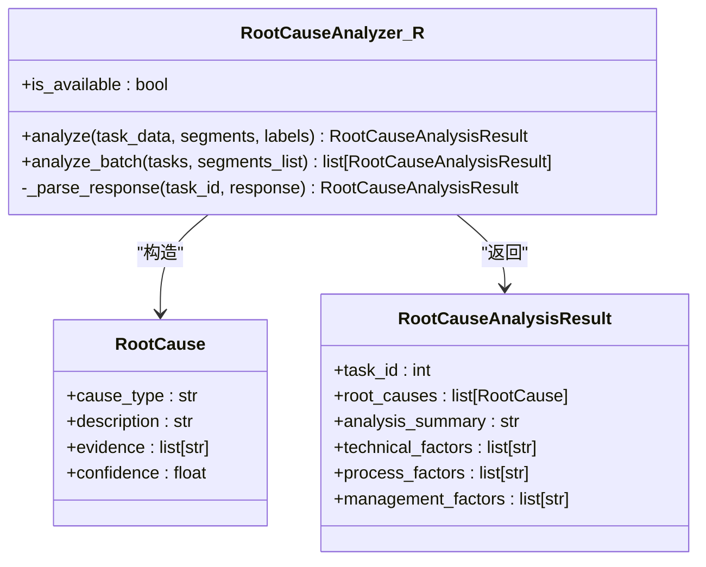
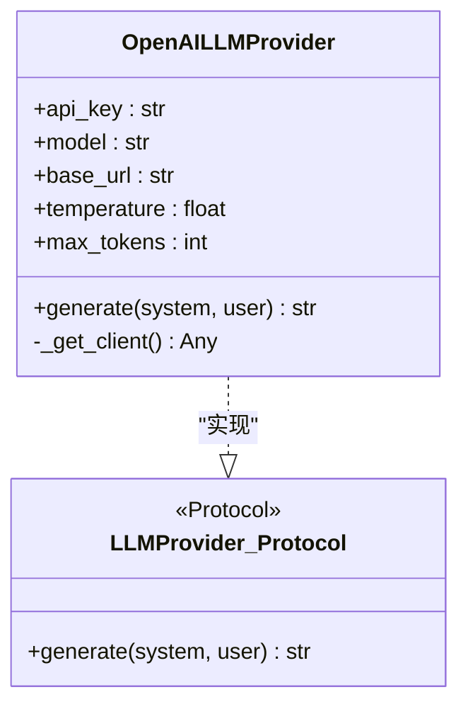
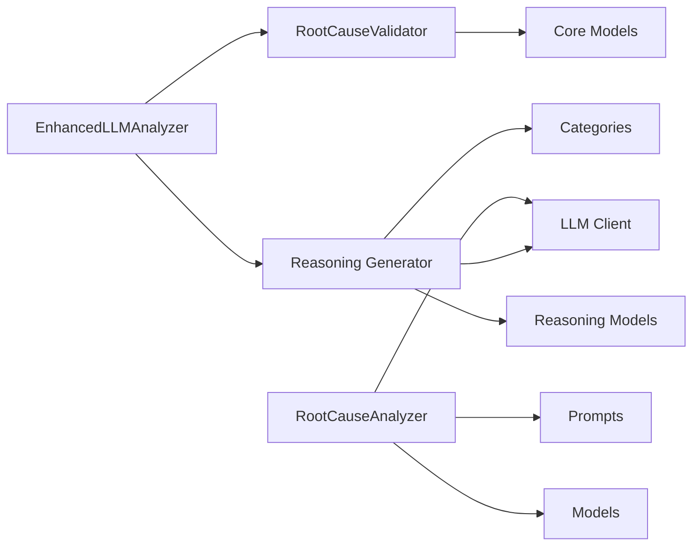
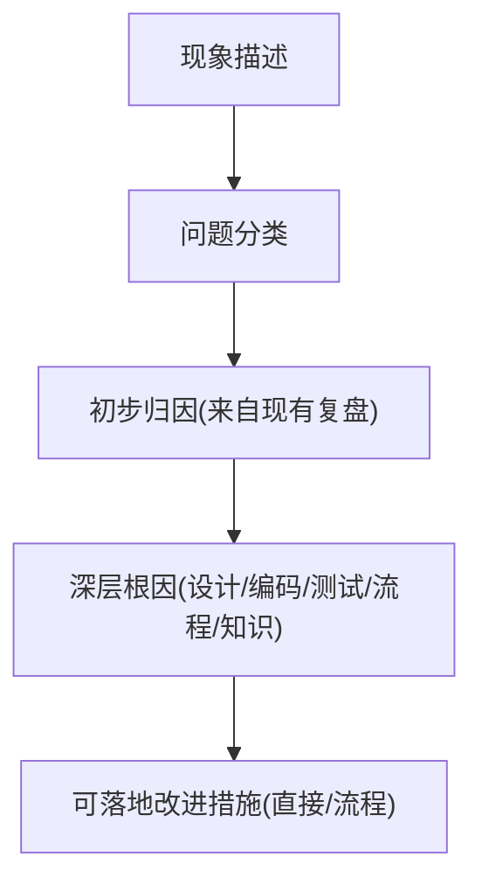

# 根因深度分析

<cite>
**本文引用的文件列表**
- [src/analysis/root_cause/analyzer.py](file://src/analysis/root_cause/analyzer.py)
- [src/analysis/root_cause/models.py](file://src/analysis/root_cause/models.py)
- [src/analysis/root_cause/prompts.py](file://src/analysis/root_cause/prompts.py)
- [src/analysis/root_cause_validator.py](file://src/analysis/root_cause_validator.py)
- [src/core/models.py](file://src/core/models.py)
- [src/analysis/enhanced_llm_analyzer.py](file://src/analysis/enhanced_llm_analyzer.py)
- [src/analyzer/reasoning/generator.py](file://src/analyzer/reasoning/generator.py)
- [src/analyzer/reasoning/models.py](file://src/analyzer/reasoning/models.py)
- [src/analyzer/llm_provider.py](file://src/analyzer/llm_provider.py)
- [src/rules/categories.py](file://src/rules/categories.py)
- [tests/analysis/root_cause/test_analyzer.py](file://tests/analysis/root_cause/test_analyzer.py)
- [docs/根因分析方案设计.md](file://docs/根因分析方案设计.md)
</cite>

## 目录
1. [引言](#引言)
2. [项目结构](#项目结构)
3. [核心组件](#核心组件)
4. [架构总览](#架构总览)
5. [详细组件分析](#详细组件分析)
6. [依赖关系分析](#依赖关系分析)
7. [性能与可靠性](#性能与可靠性)
8. [故障排查指南](#故障排查指南)
9. [结论](#结论)
10. [附录：配置与扩展示例](#附录配置与扩展示例)

## 引言
本技术文档聚焦“根因深度分析”模块，系统性阐述其设计原理、实现逻辑与使用方式。重点覆盖以下方面：
- 5层追问机制的设计与落地（问题分解策略与LLM调用模式）
- 根因分类体系与标签体系
- Prompt模板管理与动态参数替换
- LLM提供商集成、错误重试与响应解析策略
- 根因分析结果验证方法与质量保证措施
- 如何配置分析流程、自定义根因分类规则与扩展新维度

## 项目结构
根因深度分析相关代码主要分布在如下位置：
- 根因分析与模型定义：src/analysis/root_cause
- 根因可落地性验证：src/analysis/root_cause_validator.py
- 增强型分析编排器：src/analysis/enhanced_llm_analyzer.py
- 推理生成器（另一套根因分析路径）：src/analyzer/reasoning
- LLM提供者抽象与OpenAI实现：src/analyzer/llm_provider.py
- 根因分类与标签定义：src/rules/categories.py
- 核心数据模型（含改进措施、验证结果等）：src/core/models.py
- 测试用例：tests/analysis/root_cause/test_analyzer.py
- 方案设计与示例：docs/根因分析方案设计.md

图表来源
- [src/analysis/root_cause/analyzer.py:1-131](file://src/analysis/root_cause/analyzer.py#L1-L131)
- [src/analysis/root_cause/prompts.py:1-85](file://src/analysis/root_cause/prompts.py#L1-L85)
- [src/analysis/root_cause/models.py:1-67](file://src/analysis/root_cause/models.py#L1-L67)
- [src/analysis/root_cause_validator.py:1-368](file://src/analysis/root_cause_validator.py#L1-L368)
- [src/analysis/enhanced_llm_analyzer.py:1-206](file://src/analysis/enhanced_llm_analyzer.py#L1-L206)
- [src/analyzer/reasoning/generator.py:1-176](file://src/analyzer/reasoning/generator.py#L1-L176)
- [src/analyzer/reasoning/models.py:1-24](file://src/analyzer/reasoning/models.py#L1-L24)
- [src/analyzer/llm_provider.py:1-67](file://src/analyzer/llm_provider.py#L1-L67)
- [src/rules/categories.py:1-91](file://src/rules/categories.py#L1-L91)
- [src/core/models.py:1-426](file://src/core/models.py#L1-L426)

章节来源
- [src/analysis/root_cause/analyzer.py:1-131](file://src/analysis/root_cause/analyzer.py#L1-L131)
- [src/analysis/root_cause/prompts.py:1-85](file://src/analysis/root_cause/prompts.py#L1-L85)
- [src/analysis/root_cause/models.py:1-67](file://src/analysis/root_cause/models.py#L1-L67)
- [src/analysis/root_cause_validator.py:1-368](file://src/analysis/root_cause_validator.py#L1-L368)
- [src/analysis/enhanced_llm_analyzer.py:1-206](file://src/analysis/enhanced_llm_analyzer.py#L1-L206)
- [src/analyzer/reasoning/generator.py:1-176](file://src/analyzer/reasoning/generator.py#L1-L176)
- [src/analyzer/reasoning/models.py:1-24](file://src/analyzer/reasoning/models.py#L1-L24)
- [src/analyzer/llm_provider.py:1-67](file://src/analyzer/llm_provider.py#L1-L67)
- [src/rules/categories.py:1-91](file://src/rules/categories.py#L1-L91)
- [src/core/models.py:1-426](file://src/core/models.py#L1-L426)

## 核心组件
- RootCauseAnalyzer：负责构建Prompt、调用LLM、解析JSON并转换为结构化结果。
- RootCauseValidator：对根因进行“可落地性”校验，评分并生成改进措施；支持回退到规则引擎或LLM二次验证。
- EnhancedLLMAnalyzer：编排完整分析流程（违规检测、代码变更分析、根因提取、根因验证、文本汇总）。
- Reasoning Generator：基于系统提示与用户提示的另一种根因分析路径，输出结构化根因与多维因素。
- LLM Provider：提供统一的异步文本生成接口，当前包含OpenAI实现。
- Categories：集中维护根因分类、问题类型、违规类型等枚举集合。
- Core Models：跨模块共享的数据模型，包括改进措施、根因验证结果、LLM分析结果等。

章节来源
- [src/analysis/root_cause/analyzer.py:1-131](file://src/analysis/root_cause/analyzer.py#L1-L131)
- [src/analysis/root_cause_validator.py:1-368](file://src/analysis/root_cause_validator.py#L1-L368)
- [src/analysis/enhanced_llm_analyzer.py:1-206](file://src/analysis/enhanced_llm_analyzer.py#L1-L206)
- [src/analyzer/reasoning/generator.py:1-176](file://src/analyzer/reasoning/generator.py#L1-L176)
- [src/analyzer/llm_provider.py:1-67](file://src/analyzer/llm_provider.py#L1-L67)
- [src/rules/categories.py:1-91](file://src/rules/categories.py#L1-L91)
- [src/core/models.py:1-426](file://src/core/models.py#L1-L426)

## 架构总览
根因深度分析采用“分层追问 + 多阶段验证”的架构：
- 输入：故障单基本信息 + 现有复盘结论（作为参考起点）
- 处理：
  - 通过Prompt模板注入上下文，驱动LLM进行5层追问式分析
  - 将LLM返回的JSON转换为结构化对象
  - 对根因进行可落地性验证，必要时触发LLM二次验证
  - 编排器整合违规检测、代码变更分析、根因提取与验证
- 输出：问题分类、初始归因、深层根因、可落地改进措施、Checklist建议

图表来源
- [src/analysis/root_cause/analyzer.py:56-116](file://src/analysis/root_cause/analyzer.py#L56-L116)
- [src/analysis/root_cause/prompts.py:1-85](file://src/analysis/root_cause/prompts.py#L1-L85)
- [src/analysis/root_cause_validator.py:147-187](file://src/analysis/root_cause_validator.py#L147-L187)
- [src/analysis/enhanced_llm_analyzer.py:32-74](file://src/analysis/enhanced_llm_analyzer.py#L32-L74)
- [src/analyzer/llm_provider.py:38-52](file://src/analyzer/llm_provider.py#L38-L52)

## 详细组件分析

### 组件A：RootCauseAnalyzer（根因分析器）
职责：
- 组装Prompt，注入故障信息与现有复盘结论
- 调用LLM进行异步文本生成
- 解析JSON响应，统一键名为snake_case
- 构造结构化结果对象

关键实现要点：
- Prompt模板集中管理，便于版本控制与动态参数替换
- JSON键名自动转换，兼容不同LLM输出风格
- 支持同步包装方法，方便非异步环境调用

图表来源
- [src/analysis/root_cause/analyzer.py:44-131](file://src/analysis/root_cause/analyzer.py#L44-L131)
- [src/analysis/root_cause/models.py:8-67](file://src/analysis/root_cause/models.py#L8-L67)

章节来源
- [src/analysis/root_cause/analyzer.py:1-131](file://src/analysis/root_cause/analyzer.py#L1-L131)
- [src/analysis/root_cause/models.py:1-67](file://src/analysis/root_cause/models.py#L1-L67)

### 组件B：RootCauseValidator（根因可落地性验证器）
职责：
- 基于规则判断根因是否可落地（关键词匹配、长度阈值、不可落地模式识别）
- 计算可落地性评分
- 根据根因关键词匹配生成改进措施模板
- 可选：使用LLM进行更深入的验证与反馈

图表来源
- [src/analysis/root_cause_validator.py:147-210](file://src/analysis/root_cause_validator.py#L147-L210)
- [src/analysis/root_cause_validator.py:235-277](file://src/analysis/root_cause_validator.py#L235-L277)

章节来源
- [src/analysis/root_cause_validator.py:1-368](file://src/analysis/root_cause_validator.py#L1-L368)

### 组件C：EnhancedLLMAnalyzer（增强分析编排器）
职责：
- 串联违规检测、代码变更分析、根因提取、根因验证、文本汇总
- 在LLM验证失败时回退到规则验证
- 批量分析多个故障，异常隔离与日志记录

图表来源
- [src/analysis/enhanced_llm_analyzer.py:32-74](file://src/analysis/enhanced_llm_analyzer.py#L32-L74)
- [src/analysis/enhanced_llm_analyzer.py:108-121](file://src/analysis/enhanced_llm_analyzer.py#L108-L121)

章节来源
- [src/analysis/enhanced_llm_analyzer.py:1-206](file://src/analysis/enhanced_llm_analyzer.py#L1-L206)

### 组件D：Reasoning Generator（推理生成器）
职责：
- 基于系统提示与用户提示，组织分段详情与标签上下文
- 调用LLM进行根因分析，解析为结构化结果
- 支持批量分析任务

图表来源
- [src/analyzer/reasoning/generator.py:67-176](file://src/analyzer/reasoning/generator.py#L67-L176)
- [src/analyzer/reasoning/models.py:1-24](file://src/analyzer/reasoning/models.py#L1-L24)

章节来源
- [src/analyzer/reasoning/generator.py:1-176](file://src/analyzer/reasoning/generator.py#L1-L176)
- [src/analyzer/reasoning/models.py:1-24](file://src/analyzer/reasoning/models.py#L1-L24)

### 组件E：LLM Provider（OpenAI实现）
职责：
- 封装异步HTTP客户端，调用OpenAI Chat Completions API
- 支持base_url、temperature、max_tokens等参数
- 提供工厂方法创建Provider实例

图表来源
- [src/analyzer/llm_provider.py:4-52](file://src/analyzer/llm_provider.py#L4-L52)
- [src/analyzer/labeling/models.py:5-10](file://src/analyzer/labeling/models.py#L5-L10)

章节来源
- [src/analyzer/llm_provider.py:1-67](file://src/analyzer/llm_provider.py#L1-L67)
- [src/analyzer/labeling/models.py:1-31](file://src/analyzer/labeling/models.py#L1-L31)

## 依赖关系分析
- RootCauseAnalyzer依赖：
  - Prompt模板（prompts.py）
  - 数据模型（models.py）
  - LLM客户端（由调用方注入，需实现generate(prompt)->str）
- RootCauseValidator依赖：
  - 核心模型（core/models.py）中的改进措施与验证结果
- EnhancedLLMAnalyzer依赖：
  - ViolationDetector、CodeChangeAnalyzer、RootCauseValidator
  - 用于生成最终报告文本
- Reasoning Generator依赖：
  - 分类定义（rules/categories.py）
  - LLM Provider（遵循LLMProvider协议）
  - 自身数据模型（reasoning/models.py）

图表来源
- [src/analysis/root_cause/analyzer.py:1-131](file://src/analysis/root_cause/analyzer.py#L1-L131)
- [src/analysis/root_cause_validator.py:1-368](file://src/analysis/root_cause_validator.py#L1-L368)
- [src/analysis/enhanced_llm_analyzer.py:1-206](file://src/analysis/enhanced_llm_analyzer.py#L1-L206)
- [src/analyzer/reasoning/generator.py:1-176](file://src/analyzer/reasoning/generator.py#L1-L176)
- [src/rules/categories.py:1-91](file://src/rules/categories.py#L1-L91)
- [src/core/models.py:1-426](file://src/core/models.py#L1-L426)

章节来源
- [src/analysis/root_cause/analyzer.py:1-131](file://src/analysis/root_cause/analyzer.py#L1-L131)
- [src/analysis/root_cause_validator.py:1-368](file://src/analysis/root_cause_validator.py#L1-L368)
- [src/analysis/enhanced_llm_analyzer.py:1-206](file://src/analysis/enhanced_llm_analyzer.py#L1-L206)
- [src/analyzer/reasoning/generator.py:1-176](file://src/analyzer/reasoning/generator.py#L1-L176)
- [src/rules/categories.py:1-91](file://src/rules/categories.py#L1-L91)
- [src/core/models.py:1-426](file://src/core/models.py#L1-L426)

## 性能与可靠性
- 异步调用：RootCauseAnalyzer与Reasoning Generator均使用异步LLM调用，提升吞吐能力。
- 回退机制：RootCauseValidator在LLM验证失败时回退到规则验证，保证可用性。
- 批量处理：EnhancedLLMAnalyzer支持批量分析，单个失败不影响整体流程。
- 键名转换：自动将camelCase转为snake_case，降低解析失败风险。
- 可扩展性：LLM Provider通过协议抽象，便于接入其他提供商或本地模型。

[本节为通用指导，不直接分析具体文件]

## 故障排查指南
- LLM调用失败：
  - 检查API Key、base_url、网络连通性与限流情况
  - 查看日志中错误信息，确认是否抛出ImportError或网络异常
- JSON解析失败：
  - 确认LLM返回格式是否符合Prompt要求的JSON结构
  - 检查键名大小写与字段完整性
- 根因不可落地：
  - 查看RootCauseValidator的不可落地模式匹配与评分逻辑
  - 根据reanalysis_feedback调整根因描述，使其更具可操作性
- 批量分析异常：
  - 关注EnhancedLLMAnalyzer的异常捕获与日志输出
  - 定位具体失败的fault_id，单独复现与调试

章节来源
- [src/analysis/root_cause_validator.py:289-368](file://src/analysis/root_cause_validator.py#L289-L368)
- [src/analysis/enhanced_llm_analyzer.py:172-206](file://src/analysis/enhanced_llm_analyzer.py#L172-L206)
- [src/analyzer/llm_provider.py:22-52](file://src/analyzer/llm_provider.py#L22-L52)

## 结论
根因深度分析模块通过“分层追问 + 多阶段验证”的架构，实现了从泛化归因到深层根因的系统化挖掘。结合Prompt模板管理、结构化数据模型、可落地性验证与编排器，形成了高可用、可扩展的分析流水线。未来可在知识库积累、根因聚类与自动化Checklist生成等方面持续优化。

[本节为总结性内容，不直接分析具体文件]

## 附录：配置与扩展示例

### 配置分析流程（示例路径）
- 初始化LLM Provider（OpenAI）
- 准备FaultAnalysisInput与ExistingFaultAnalysis
- 调用RootCauseAnalyzer.analyze获取结构化结果
- 使用EnhancedLLMAnalyzer进行端到端编排

章节来源
- [src/analyzer/llm_provider.py:55-67](file://src/analyzer/llm_provider.py#L55-L67)
- [src/analysis/root_cause/models.py:8-36](file://src/analysis/root_cause/models.py#L8-L36)
- [src/analysis/root_cause/analyzer.py:79-116](file://src/analysis/root_cause/analyzer.py#L79-L116)
- [src/analysis/enhanced_llm_analyzer.py:32-74](file://src/analysis/enhanced_llm_analyzer.py#L32-L74)

### 自定义根因分类规则（示例路径）
- 在categories.py中扩充CAUSE_TYPES、FAULT_CATEGORIES、PROBLEM_TYPES
- 在Reasoning Generator的SYSTEM_PROMPT中使用这些分类
- 在RootCauseValidator中扩展ACTIONABLE_KEYWORDS与非落地模式

章节来源
- [src/rules/categories.py:17-91](file://src/rules/categories.py#L17-L91)
- [src/analyzer/reasoning/generator.py:15-33](file://src/analyzer/reasoning/generator.py#L15-33)
- [src/analysis/root_cause_validator.py:15-53](file://src/analysis/root_cause_validator.py#L15-L53)

### 扩展新的分析维度（示例路径）
- 在RootCauseAnalysisResult中添加新字段（如“业务影响评估”）
- 在Prompt模板中增加对应分析要求
- 在EnhancedLLMAnalyzer中整合新维度的数据来源与展示

章节来源
- [src/analysis/root_cause/models.py:58-67](file://src/analysis/root_cause/models.py#L58-L67)
- [src/analysis/root_cause/prompts.py:31-84](file://src/analysis/root_cause/prompts.py#L31-L84)
- [src/analysis/enhanced_llm_analyzer.py:122-170](file://src/analysis/enhanced_llm_analyzer.py#L122-L170)

### 5层追问机制说明（概念性图示）

[此图为概念性流程图，无需图表来源]

### 测试结果与断言（示例路径）
- 验证问题分类、初始归因、深层根因、改进措施、Checklist建议
- 支持空复盘结论场景与多根因场景

章节来源
- [tests/analysis/root_cause/test_analyzer.py:87-141](file://tests/analysis/root_cause/test_analyzer.py#L87-L141)
- [tests/analysis/root_cause/test_analyzer.py:152-175](file://tests/analysis/root_cause/test_analyzer.py#L152-L175)

### 方案设计与示例（示例路径）
- 5层深度根因挖掘的目标与前置条件
- 根因分类体系与细分类示例
- 根因-改进措施映射库思路
- 示例故障单11745664的AI深层根因分析输出

章节来源
- [docs/根因分析方案设计.md:33-46](file://docs/根因分析方案设计.md#L33-L46)
- [docs/根因分析方案设计.md:440-478](file://docs/根因分析方案设计.md#L440-L478)
- [docs/根因分析方案设计.md:501-568](file://docs/根因分析方案设计.md#L501-L568)