# 数据流设计

<cite>
**本文引用的文件**   
- [src/core/models.py](file://src/core/models.py)
- [src/preprocessor/processor.py](file://src/preprocessor/processor.py)
- [src/preprocessor/models.py](file://src/preprocessor/models.py)
- [src/embedding/generator.py](file://src/embedding/generator.py)
- [src/embedding/models.py](file://src/embedding/models.py)
- [src/clustering/analyzer.py](file://src/clustering/analyzer.py)
- [src/clustering/models.py](file://src/clustering/models.py)
- [src/storage/chroma_manager.py](file://src/storage/chroma_manager.py)
- [src/cache/manager.py](file://src/cache/manager.py)
- [src/report/generator.py](file://src/report/generator.py)
- [src/api/server.py](file://src/api/server.py)
- [src/analyzer/pipeline.py](file://src/analyzer/pipeline.py)
- [src/config/manager.py](file://src/config/manager.py)
- [config/config.yaml.example](file://config/config.yaml.example)
</cite>

## 目录
1. [引言](#引言)
2. [项目结构](#项目结构)
3. [核心组件](#核心组件)
4. [架构总览](#架构总览)
5. [详细组件分析](#详细组件分析)
6. [依赖关系分析](#依赖关系分析)
7. [性能考虑](#性能考虑)
8. [故障排查指南](#故障排查指南)
9. [结论](#结论)
10. [附录](#附录)

## 引言
本文件面向Bug聚类分析系统的数据流设计，覆盖从原始故障单数据到最终分析报告的完整处理链路：数据采集、预处理、嵌入生成、向量存储、聚类分析、根因分析、报告生成。文档明确各阶段输入输出格式、数据验证规则与错误处理策略，解释异步数据处理模型与并发控制机制，并提供数据流图与状态转换图，说明缓存策略与持久化方案（SQLite缓存与ChromaDB向量存储），最后给出性能优化建议与监控指标。

## 项目结构
系统采用分层与模块化组织方式：
- 配置层：集中管理API、LLM、Embedding、聚类、缓存等参数
- 采集与预处理：从API获取任务并拆分为结构化片段，合并为统一文本
- 向量化：调用外部Embedding服务或本地哈希向量，支持LRU缓存与自适应限流
- 向量存储：ChromaDB持久化，带重试与本地降级缓存
- 聚类分析：HDBSCAN或AgglomerativeClustering，输出聚类标签与成员
- 根因分析：基于LLM的深度根因分析与改进措施
- 报告生成：Markdown/HTML/JSON多格式报告
- API服务：FastAPI提供健康检查、分析、聚类、报告、反馈接口

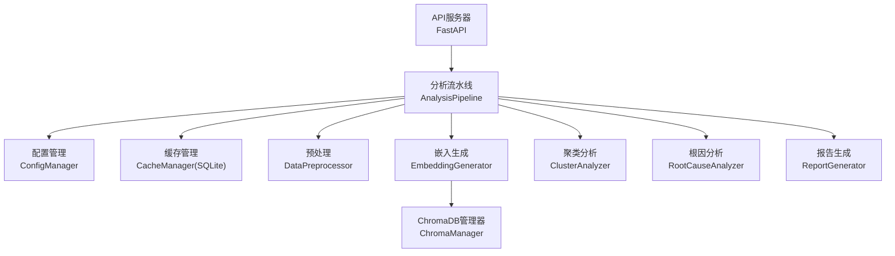

图表来源
- [src/api/server.py:1-152](file://src/api/server.py#L1-L152)
- [src/analyzer/pipeline.py:1-468](file://src/analyzer/pipeline.py#L1-L468)
- [src/config/manager.py:1-268](file://src/config/manager.py#L1-L268)
- [src/cache/manager.py:1-165](file://src/cache/manager.py#L1-L165)
- [src/preprocessor/processor.py:1-200](file://src/preprocessor/processor.py#L1-L200)
- [src/embedding/generator.py:1-427](file://src/embedding/generator.py#L1-L427)
- [src/storage/chroma_manager.py:1-687](file://src/storage/chroma_manager.py#L1-L687)
- [src/clustering/analyzer.py:1-121](file://src/clustering/analyzer.py#L1-L121)
- [src/report/generator.py:1-790](file://src/report/generator.py#L1-L790)

章节来源
- [src/api/server.py:1-152](file://src/api/server.py#L1-L152)
- [src/analyzer/pipeline.py:1-468](file://src/analyzer/pipeline.py#L1-L468)
- [src/config/manager.py:1-268](file://src/config/manager.py#L1-L268)
- [config/config.yaml.example:1-38](file://config/config.yaml.example#L1-L38)

## 核心组件
- 配置管理：加载YAML/JSON配置，支持环境变量覆盖与类型校验
- 缓存管理：SQLite持久化缓存，TTL过期清理与索引查询
- 预处理：将TaskInfo拆解为TextSegment，合并为combined_text并截断
- 嵌入生成：支持OpenAI/Zhipu/Volcengine/Local多种Provider，LRU缓存+自适应限流+熔断器
- 向量存储：ChromaDB集合操作，批量写入、元数据过滤、相似查询、失败降级至本地JSONL
- 聚类分析：HDBSCAN优先，回退Agglomerative；余弦距离通过归一化欧氏近似
- 根因分析：构造Prompt，解析LLM返回JSON，转换为结构化结果
- 报告生成：Jinja2模板渲染，支持Markdown/HTML/JSON，内置默认模板

章节来源
- [src/config/manager.py:1-268](file://src/config/manager.py#L1-L268)
- [src/cache/manager.py:1-165](file://src/cache/manager.py#L1-L165)
- [src/preprocessor/processor.py:1-200](file://src/preprocessor/processor.py#L1-L200)
- [src/preprocessor/models.py:1-29](file://src/preprocessor/models.py#L1-L29)
- [src/embedding/generator.py:1-427](file://src/embedding/generator.py#L1-L427)
- [src/embedding/models.py:1-23](file://src/embedding/models.py#L1-L23)
- [src/storage/chroma_manager.py:1-687](file://src/storage/chroma_manager.py#L1-L687)
- [src/clustering/analyzer.py:1-121](file://src/clustering/analyzer.py#L1-L121)
- [src/clustering/models.py:1-25](file://src/clustering/models.py#L1-L25)
- [src/report/generator.py:1-790](file://src/report/generator.py#L1-L790)

## 架构总览
端到端数据流如下：
- 采集：API拉取TaskInfo，按配置决定是否使用SQLite缓存
- 预处理：拆分标题、描述、需求、设计、提交、评审、测试、缺陷、生产日志/堆栈/解决方案等片段
- 嵌入：对combined_text生成向量，命中LRU则直接返回，否则调用Provider并缓存
- 存储：将向量与元数据写入ChromaDB集合，失败时降级到本地pending_writes.jsonl
- 聚类：对向量矩阵执行fit_predict，得到labels与clusters
- 根因：根据任务上下文构建Prompt，调用LLM进行深度根因分析
- 报告：组装摘要、标签、根因与建议，渲染为Markdown/HTML/JSON

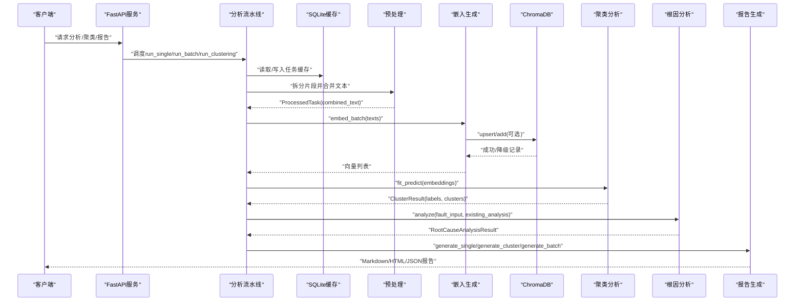

图表来源
- [src/api/server.py:1-152](file://src/api/server.py#L1-L152)
- [src/analyzer/pipeline.py:1-468](file://src/analyzer/pipeline.py#L1-L468)
- [src/cache/manager.py:1-165](file://src/cache/manager.py#L1-L165)
- [src/preprocessor/processor.py:1-200](file://src/preprocessor/processor.py#L1-L200)
- [src/embedding/generator.py:1-427](file://src/embedding/generator.py#L1-L427)
- [src/storage/chroma_manager.py:1-687](file://src/storage/chroma_manager.py#L1-L687)
- [src/clustering/analyzer.py:1-121](file://src/clustering/analyzer.py#L1-L121)
- [src/report/generator.py:1-790](file://src/report/generator.py#L1-L790)

## 详细组件分析

### 数据模型与验证
- 核心模型定义任务、分析结果、聚类信息、嵌入数据、标签、根因、代码变更、违规检测、LLM分析结果等，包含字段级验证规则（如正整数ID、非空文本、时间先后约束、置信度范围等）
- 预处理模型定义片段与处理结果，支持按类型筛选片段
- 嵌入模型定义单条与批量结果，提供numpy转换方法
- 聚类模型向后兼容导出核心模型，并定义降维结果

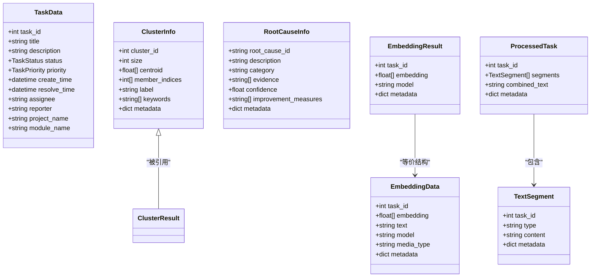

图表来源
- [src/core/models.py:1-426](file://src/core/models.py#L1-L426)
- [src/preprocessor/models.py:1-29](file://src/preprocessor/models.py#L1-L29)
- [src/embedding/models.py:1-23](file://src/embedding/models.py#L1-L23)
- [src/clustering/models.py:1-25](file://src/clustering/models.py#L1-L25)

章节来源
- [src/core/models.py:1-426](file://src/core/models.py#L1-L426)
- [src/preprocessor/models.py:1-29](file://src/preprocessor/models.py#L1-L29)
- [src/embedding/models.py:1-23](file://src/embedding/models.py#L1-L23)
- [src/clustering/models.py:1-25](file://src/clustering/models.py#L1-L25)

### 预处理阶段
- 输入：TaskInfo对象
- 输出：ProcessedTask（segments列表、combined_text、metadata）
- 处理逻辑：
  - 提取标题、描述、需求、设计、提交、评审、测试用例、缺陷、生产症状、日志、堆栈、解决方案等片段
  - 组合为统一文本并按最大长度截断
  - 批处理过滤空文本
- 验证规则：确保至少一个生产相关片段占位；combined_text非空才纳入批处理结果

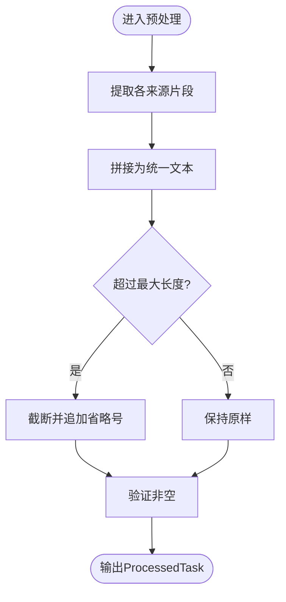

图表来源
- [src/preprocessor/processor.py:1-200](file://src/preprocessor/processor.py#L1-L200)
- [src/preprocessor/models.py:1-29](file://src/preprocessor/models.py#L1-L29)

章节来源
- [src/preprocessor/processor.py:1-200](file://src/preprocessor/processor.py#L1-L200)
- [src/preprocessor/models.py:1-29](file://src/preprocessor/models.py#L1-L29)

### 嵌入生成与并发控制
- 输入：字符串列表（combined_text）
- 输出：向量列表（list[list[float]]）
- 关键特性：
  - LRU缓存：基于SHA256键，TTL过期自动淘汰
  - 自适应速率限制：根据成功/失败动态调整QPS
  - 熔断器：连续失败触发保护，避免雪崩
  - 并发控制：信号量限制并发数，分批处理
  - Provider适配：OpenAI/Zhipu/Volcengine/Local，视觉模型特殊路径
- 错误处理：初始化异常不记入熔断失败；网络异常记录失败并退避

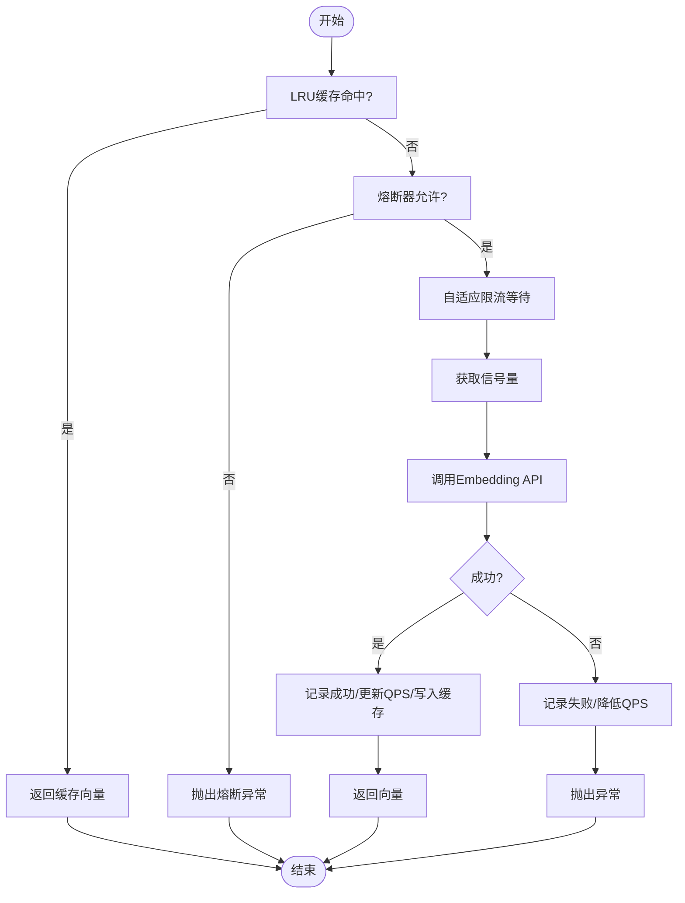

图表来源
- [src/embedding/generator.py:1-427](file://src/embedding/generator.py#L1-L427)
- [src/embedding/models.py:1-23](file://src/embedding/models.py#L1-L23)

章节来源
- [src/embedding/generator.py:1-427](file://src/embedding/generator.py#L1-L427)
- [src/embedding/models.py:1-23](file://src/embedding/models.py#L1-L23)

### 向量存储（ChromaDB）
- 功能：集合创建/获取、单条与批量插入、元数据查询、相似检索、统计、重置、删除
- 容错：连接重试、操作重试、降级到本地JSONL待写队列
- 同步：提供sync_pending_writes将待写记录批量上载
- 健康检查：heartbeat探测连接状态

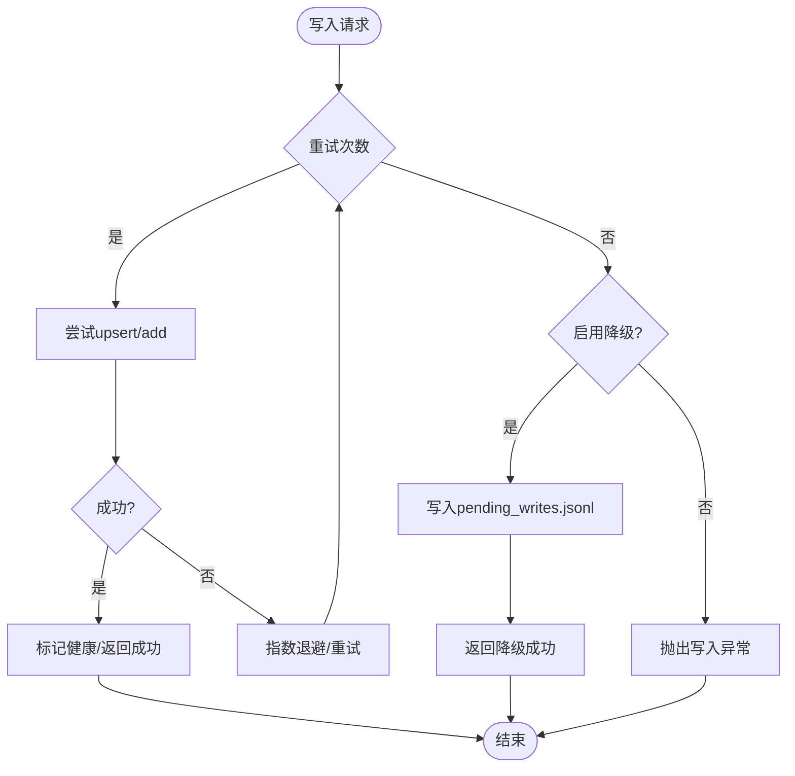

图表来源
- [src/storage/chroma_manager.py:1-687](file://src/storage/chroma_manager.py#L1-L687)

章节来源
- [src/storage/chroma_manager.py:1-687](file://src/storage/chroma_manager.py#L1-L687)

### 聚类分析
- 算法选择：HDBSCAN优先，缺失时回退AgglomerativeClustering
- 距离度量：cosine通过L2归一化后使用euclidean近似
- 输入：numpy数组形式的嵌入矩阵
- 输出：ClusterResult（labels、n_clusters、n_noise、clusters）
- 边界处理：样本不足时全部标记为噪声点

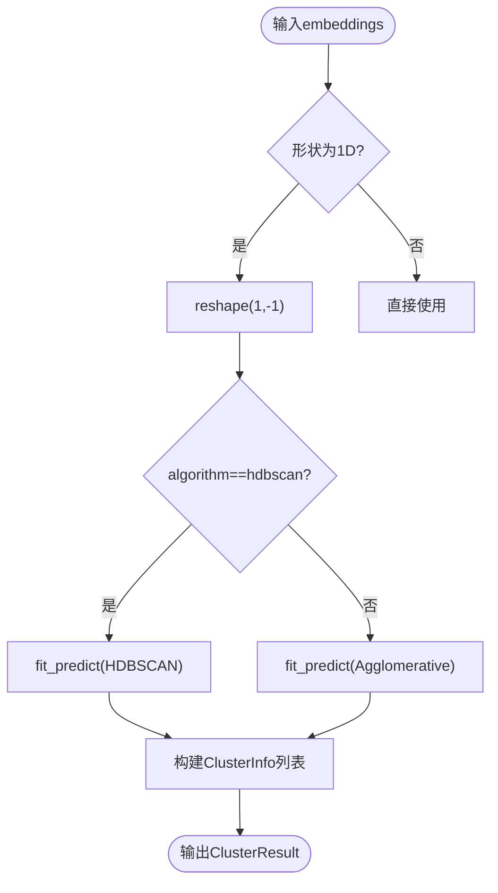

图表来源
- [src/clustering/analyzer.py:1-121](file://src/clustering/analyzer.py#L1-L121)
- [src/clustering/models.py:1-25](file://src/clustering/models.py#L1-L25)

章节来源
- [src/clustering/analyzer.py:1-121](file://src/clustering/analyzer.py#L1-L121)
- [src/clustering/models.py:1-25](file://src/clustering/models.py#L1-L25)

### 根因分析
- 输入：FaultAnalysisInput与ExistingFaultAnalysis
- 处理：构造Prompt，调用LLM生成JSON响应，键名驼峰转蛇形，映射为数据类
- 输出：RootCauseAnalysisResult（问题分类、初始原因、深层根因、可落地改进措施、清单建议）

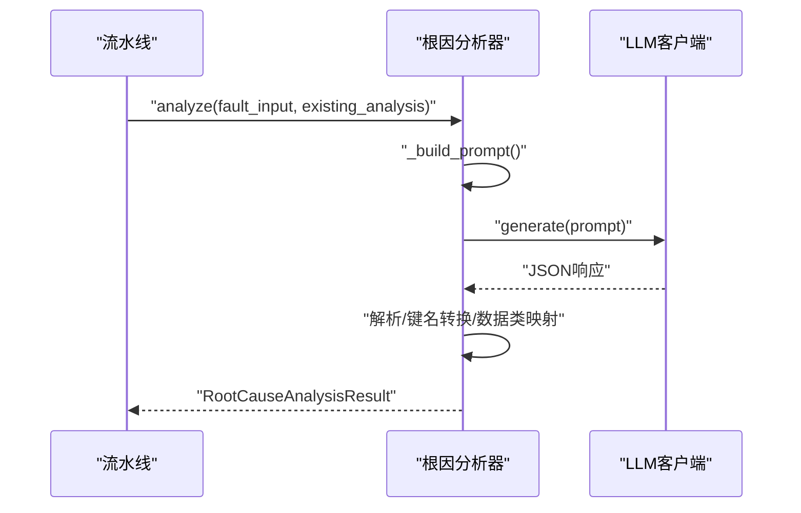

图表来源
- [src/analyzer/pipeline.py:1-468](file://src/analyzer/pipeline.py#L1-L468)
- [src/analysis/root_cause/analyzer.py:1-131](file://src/analysis/root_cause/analyzer.py#L1-L131)

章节来源
- [src/analyzer/pipeline.py:1-468](file://src/analyzer/pipeline.py#L1-L468)
- [src/analysis/root_cause/analyzer.py:1-131](file://src/analysis/root_cause/analyzer.py#L1-L131)

### 报告生成
- 输入：任务数据、分段、标签、根因、建议等
- 输出：Markdown/HTML/JSON内容或文件路径
- 模板：支持自定义Jinja2模板，回退内置默认模板
- 流程：数据校验→内容生成→保存文件（可选）

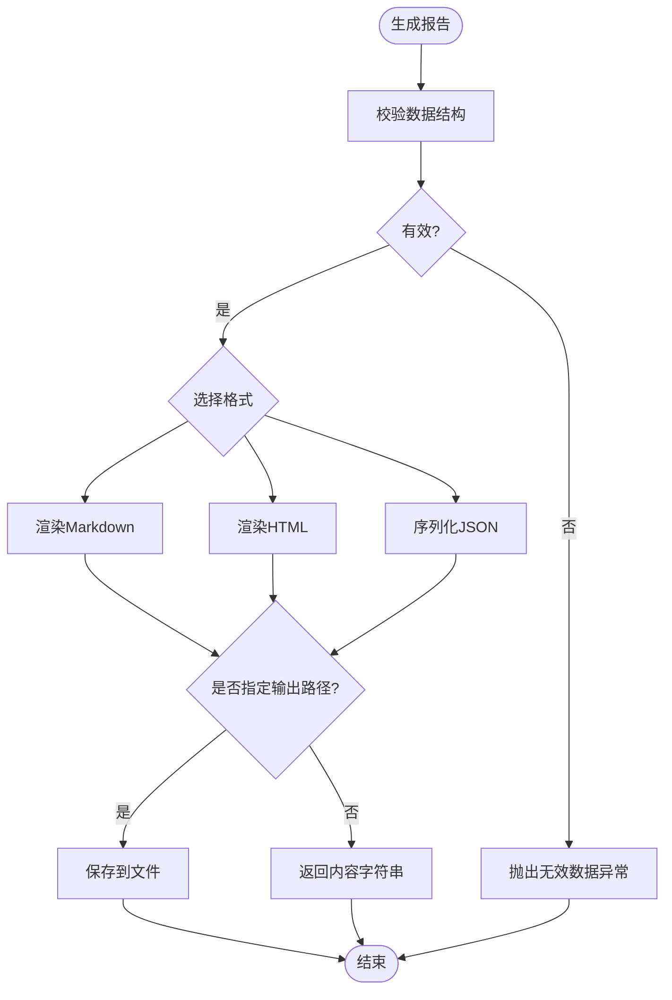

图表来源
- [src/report/generator.py:1-790](file://src/report/generator.py#L1-L790)

章节来源
- [src/report/generator.py:1-790](file://src/report/generator.py#L1-L790)

### 异步数据处理与并发控制
- 流水线并发：run_batch使用asyncio.gather并行处理多个任务
- 嵌入并发：_embed_batch_concurrent分批次并发，内部使用信号量限制并发度
- 资源生命周期：__aenter__/__aexit__保证异步资源关闭
- 中间件：认证Token校验与速率限制

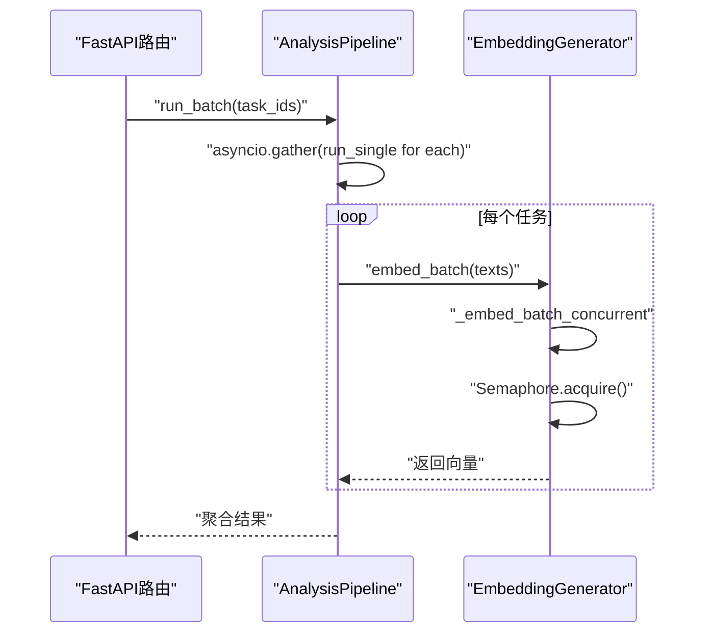

图表来源
- [src/analyzer/pipeline.py:1-468](file://src/analyzer/pipeline.py#L1-L468)
- [src/embedding/generator.py:1-427](file://src/embedding/generator.py#L1-L427)
- [src/api/server.py:1-152](file://src/api/server.py#L1-L152)

章节来源
- [src/analyzer/pipeline.py:1-468](file://src/analyzer/pipeline.py#L1-L468)
- [src/embedding/generator.py:1-427](file://src/embedding/generator.py#L1-L427)
- [src/api/server.py:1-152](file://src/api/server.py#L1-L152)

### 缓存策略与数据持久化
- SQLite缓存：按task_id存储JSON数据，TTL过期判定，支持索引查询与统计
- ChromaDB持久化：集合持久化到磁盘，支持心跳健康检查与重置
- 降级策略：Chroma不可用时写入pending_writes.jsonl，后续可同步恢复

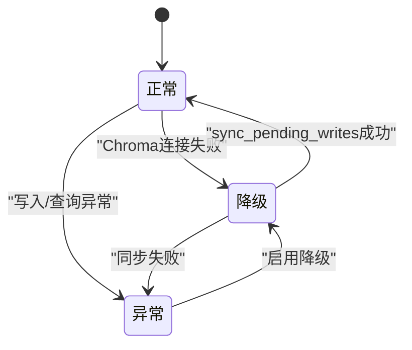

图表来源
- [src/cache/manager.py:1-165](file://src/cache/manager.py#L1-L165)
- [src/storage/chroma_manager.py:1-687](file://src/storage/chroma_manager.py#L1-L687)

章节来源
- [src/cache/manager.py:1-165](file://src/cache/manager.py#L1-L165)
- [src/storage/chroma_manager.py:1-687](file://src/storage/chroma_manager.py#L1-L687)

## 依赖关系分析
- 组件耦合：
  - AnalysisPipeline协调各子模块，低内聚高内聚设计
  - EmbeddingGenerator依赖CircuitBreaker与AdaptiveRateLimiter
  - ChromaManager封装ChromaDB客户端与降级缓存
- 外部依赖：
  - OpenAI SDK（AsyncOpenAI）、ChromaDB、HDBSCAN/sklearn、Jinja2、Pydantic、FastAPI、uvicorn
- 潜在循环依赖：无显式循环导入，模块间通过函数/类实例传递

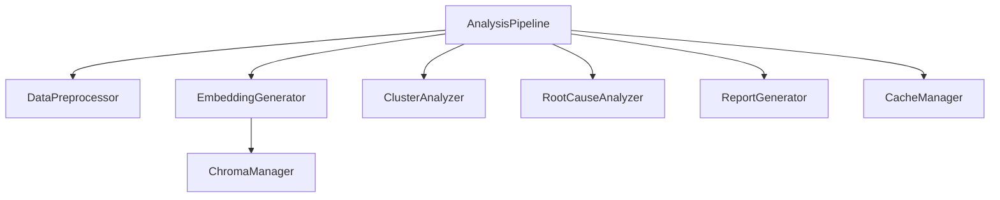

图表来源
- [src/analyzer/pipeline.py:1-468](file://src/analyzer/pipeline.py#L1-L468)
- [src/embedding/generator.py:1-427](file://src/embedding/generator.py#L1-L427)
- [src/storage/chroma_manager.py:1-687](file://src/storage/chroma_manager.py#L1-L687)

章节来源
- [src/analyzer/pipeline.py:1-468](file://src/analyzer/pipeline.py#L1-L468)
- [src/embedding/generator.py:1-427](file://src/embedding/generator.py#L1-L427)
- [src/storage/chroma_manager.py:1-687](file://src/storage/chroma_manager.py#L1-L687)

## 性能考虑
- 嵌入生成
  - 增大batch_size提升吞吐，但需平衡内存与超时
  - 合理设置max_concurrency与QPS上限，避免超限导致限流/熔断
  - 开启LRU缓存减少重复计算
- 向量存储
  - 批量写入优于逐条写入，减少网络往返
  - 定期sync_pending_writes，避免待写队列膨胀
- 聚类分析
  - 对大规模向量先做降维再聚类可提升效率
  - 使用归一化欧氏近似余弦距离，提高HDBSCAN性能
- 报告生成
  - 模板渲染开销较小，注意大文本截断与只渲染必要字段
- 监控指标建议
  - 嵌入成功率、平均耗时、QPS、熔断触发次数
  - Chroma写入成功率、待写记录数、连接健康状态
  - 聚类数量、噪声比例、平均簇大小
  - 报告生成耗时与输出体积

[本节为通用指导，无需特定文件来源]

## 故障排查指南
- 嵌入失败
  - 检查熔断器状态与QPS调整，确认Provider可用性与网络连通
  - 查看LRU缓存命中率与TTL设置
- Chroma异常
  - 检查心跳与健康状态，确认持久化目录权限
  - 查看pending_writes.jsonl是否存在未同步记录
- 聚类结果为全噪声
  - 检查min_cluster_size与min_samples参数，评估样本规模
  - 确认向量维度与归一化是否正确
- 报告为空或格式错误
  - 校验输入数据结构，确认模板存在且渲染无误

章节来源
- [src/embedding/generator.py:1-427](file://src/embedding/generator.py#L1-L427)
- [src/storage/chroma_manager.py:1-687](file://src/storage/chroma_manager.py#L1-L687)
- [src/clustering/analyzer.py:1-121](file://src/clustering/analyzer.py#L1-L121)
- [src/report/generator.py:1-790](file://src/report/generator.py#L1-L790)

## 结论
本数据流设计以AnalysisPipeline为核心编排器，串联预处理、嵌入、存储、聚类、根因与报告生成等模块，结合SQLite与ChromaDB实现多级缓存与持久化，并通过LRU、自适应限流、熔断与重试保障稳定性与可扩展性。建议在部署中完善监控与告警，持续优化批处理与并发参数，以获得更佳的吞吐与质量。

[本节为总结，无需特定文件来源]

## 附录
- 配置示例：参考config.yaml.example中的API、LLM、Embedding、聚类、缓存、规则、输出与日志配置项
- 环境变量覆盖：ConfigManager支持通过环境变量覆盖关键配置项，便于不同环境快速切换

章节来源
- [config/config.yaml.example:1-38](file://config/config.yaml.example#L1-L38)
- [src/config/manager.py:1-268](file://src/config/manager.py#L1-L268)