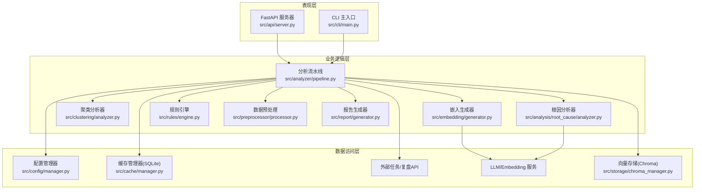
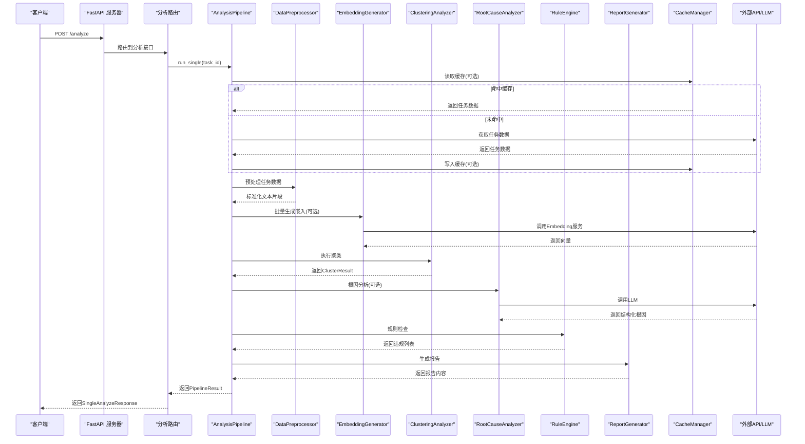
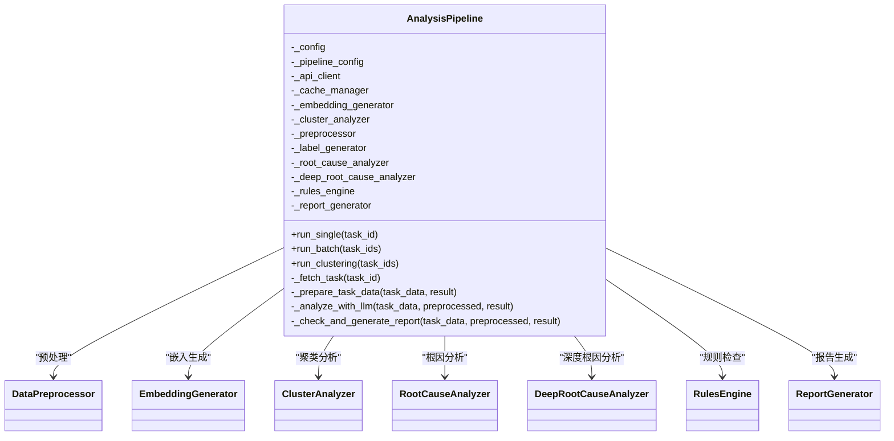
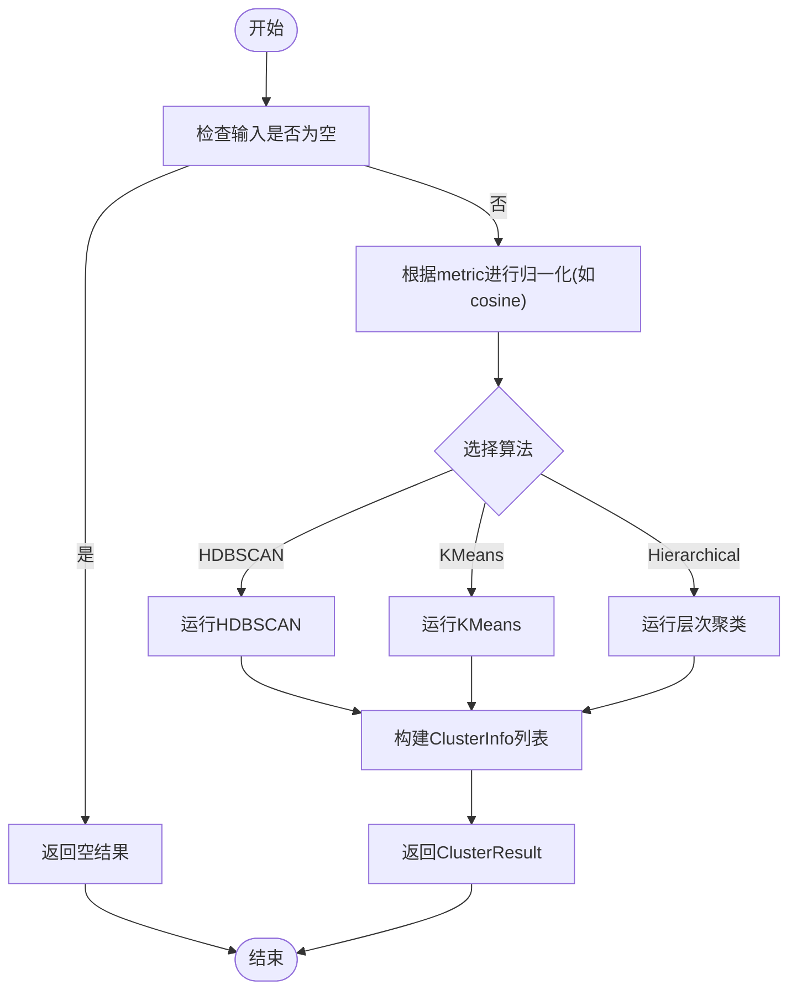
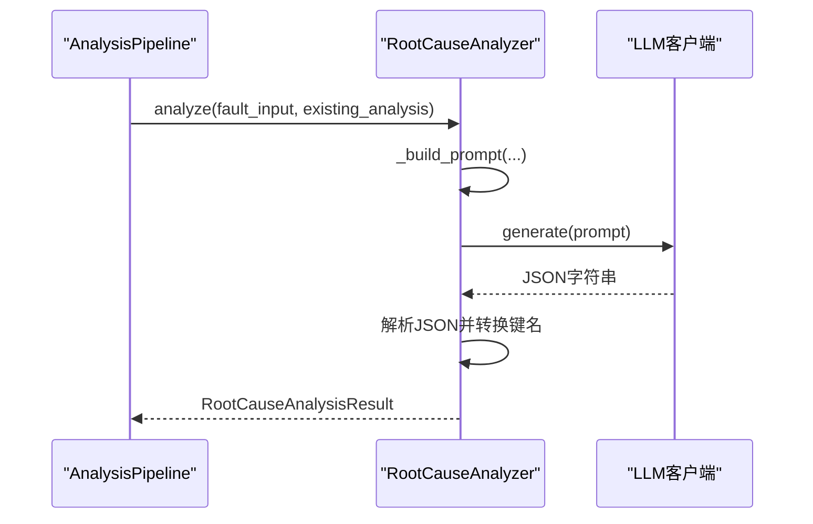
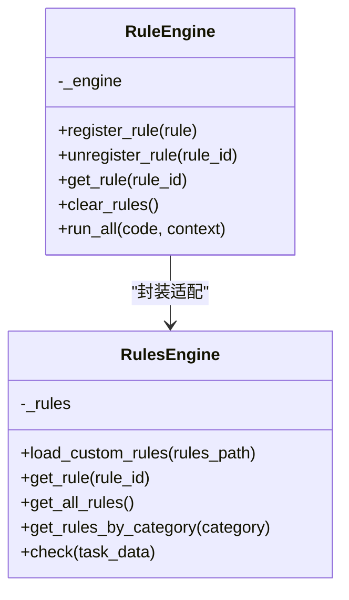
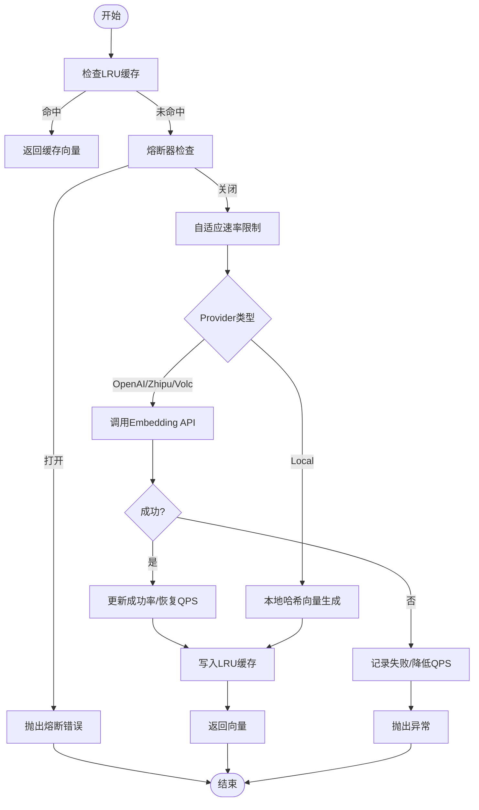
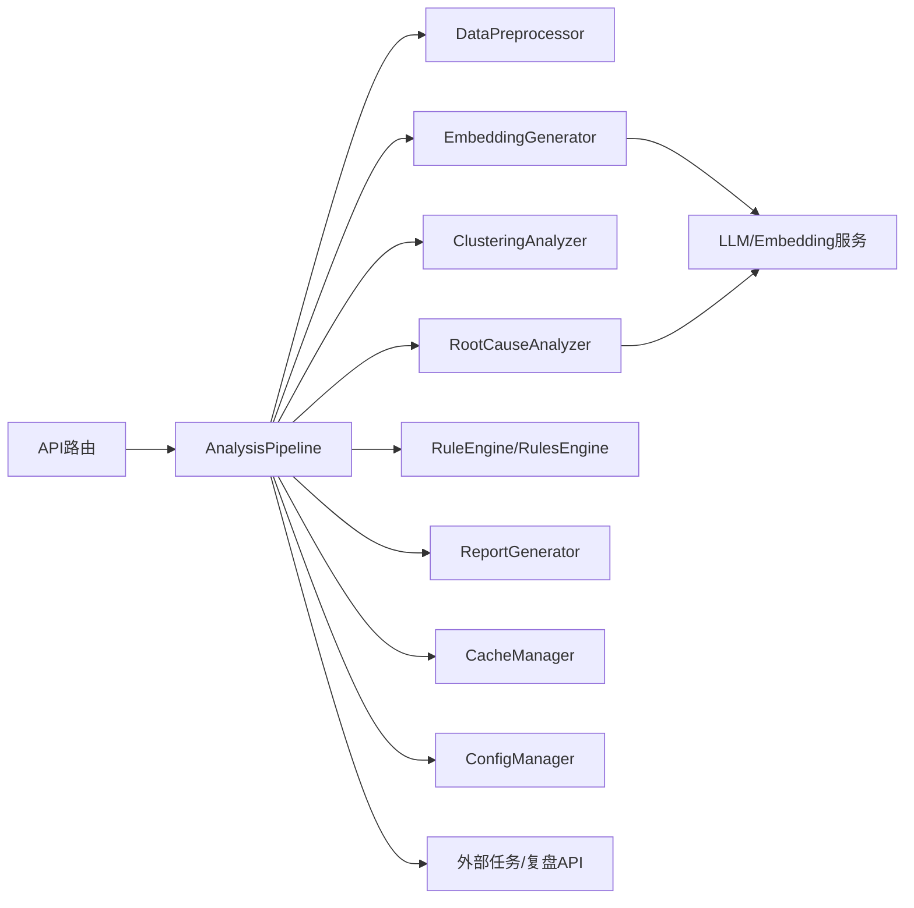

# 核心架构

<cite>
**本文引用的文件**   
- [src/api/server.py](file://src/api/server.py)
- [src/api/routes/analyze.py](file://src/api/routes/analyze.py)
- [src/analyzer/pipeline.py](file://src/analyzer/pipeline.py)
- [src/clustering/analyzer.py](file://src/clustering/analyzer.py)
- [src/analysis/root_cause/analyzer.py](file://src/analysis/root_cause/analyzer.py)
- [src/rules/engine.py](file://src/rules/engine.py)
- [src/embedding/generator.py](file://src/embedding/generator.py)
- [src/preprocessor/processor.py](file://src/preprocessor/processor.py)
- [src/report/generator.py](file://src/report/generator.py)
- [src/config/manager.py](file://src/config/manager.py)
- [src/cache/manager.py](file://src/cache/manager.py)
- [config/config.yaml.example](file://config/config.yaml.example)
</cite>

## 目录
1. [简介](#简介)
2. [项目结构](#项目结构)
3. [核心组件](#核心组件)
4. [架构总览](#架构总览)
5. [详细组件分析](#详细组件分析)
6. [依赖关系分析](#依赖关系分析)
7. [性能与可扩展性](#性能与可扩展性)
8. [部署拓扑与基础设施](#部署拓扑与基础设施)
9. [监控与可观测性](#监控与可观测性)
10. [故障排查指南](#故障排查指南)
11. [结论](#结论)

## 简介
本架构文档面向“Bug聚类分析系统”，聚焦分层架构设计（表现层、业务逻辑层、数据访问层）与关键组件交互，包括 AnalysisPipeline 编排器、ClusteringAnalyzer 聚类分析器、RootCauseAnalyzer 根因分析器、RuleEngine 规则引擎的数据流向。文档同时解释异步处理模型与事件驱动设计决策，明确系统边界、外部服务集成点与扩展机制，并提供生产环境的可扩展性、部署拓扑、基础设施要求、性能优化建议与监控策略。

## 项目结构
系统采用按功能域划分的模块化组织方式：
- 表现层：FastAPI 服务与 CLI 入口
- 业务逻辑层：AnalysisPipeline 编排器、嵌入生成、聚类分析、根因分析、规则检查、报告生成
- 数据访问层：配置管理、缓存、外部 API 客户端、向量存储（Chroma，见 storage 模块）

图表来源
- [src/api/server.py:1-152](file://src/api/server.py#L1-L152)
- [src/analyzer/pipeline.py:1-468](file://src/analyzer/pipeline.py#L1-L468)
- [src/embedding/generator.py:1-427](file://src/embedding/generator.py#L1-L427)
- [src/clustering/analyzer.py:1-121](file://src/clustering/analyzer.py#L1-L121)
- [src/analysis/root_cause/analyzer.py:1-131](file://src/analysis/root_cause/analyzer.py#L1-L131)
- [src/rules/engine.py:1-376](file://src/rules/engine.py#L1-L376)
- [src/preprocessor/processor.py:1-200](file://src/preprocessor/processor.py#L1-L200)
- [src/report/generator.py:1-790](file://src/report/generator.py#L1-L790)
- [src/config/manager.py:1-268](file://src/config/manager.py#L1-L268)
- [src/cache/manager.py:1-165](file://src/cache/manager.py#L1-L165)

章节来源
- [src/api/server.py:1-152](file://src/api/server.py#L1-L152)
- [src/analyzer/pipeline.py:1-468](file://src/analyzer/pipeline.py#L1-L468)
- [config/config.yaml.example:1-38](file://config/config.yaml.example#L1-L38)

## 核心组件
- FastAPI 应用与路由：提供健康检查、分析、聚类、报告、反馈等接口；注册中间件（CORS、鉴权、限流）。
- AnalysisPipeline：统一编排数据预处理、标签生成、根因分析（含深度五层）、规则检查、报告生成；支持单任务与批量并发执行；可选缓存与LLM能力开关。
- ClusteringAnalyzer：基于 HDBSCAN/Sklearn 的聚类实现，输出 ClusterResult（包含簇信息、噪声点统计）。
- RootCauseAnalyzer：调用 LLM 进行根因分析，返回结构化结果（问题分类、初始原因、深层根因、改进措施等）。
- RuleEngine：内置规则加载与自定义规则加载，对任务数据进行违规检测并返回违规列表。
- EmbeddingGenerator：多提供商嵌入生成（OpenAI、智谱、火山等），具备LRU缓存、自适应速率限制、熔断器、并发控制与批处理能力。
- DataPreprocessor：将 TaskInfo 拆分为文本片段并合并为统一输入文本，用于后续分析与向量化。
- ReportGenerator：支持 Markdown/HTML/PDF/JSON 多种格式的报告生成，内置模板并可扩展自定义模板。
- ConfigManager：集中式配置加载（YAML/JSON）、环境变量覆盖、类型化 AppConfig 校验。
- CacheManager：SQLite 本地缓存，支持 TTL、索引、清理与统计。

章节来源
- [src/api/server.py:1-152](file://src/api/server.py#L1-L152)
- [src/analyzer/pipeline.py:1-468](file://src/analyzer/pipeline.py#L1-L468)
- [src/clustering/analyzer.py:1-121](file://src/clustering/analyzer.py#L1-L121)
- [src/analysis/root_cause/analyzer.py:1-131](file://src/analysis/root_cause/analyzer.py#L1-L131)
- [src/rules/engine.py:1-376](file://src/rules/engine.py#L1-L376)
- [src/embedding/generator.py:1-427](file://src/embedding/generator.py#L1-L427)
- [src/preprocessor/processor.py:1-200](file://src/preprocessor/processor.py#L1-L200)
- [src/report/generator.py:1-790](file://src/report/generator.py#L1-L790)
- [src/config/manager.py:1-268](file://src/config/manager.py#L1-L268)
- [src/cache/manager.py:1-165](file://src/cache/manager.py#L1-L165)

## 架构总览
系统采用三层架构：
- 表现层：FastAPI 暴露 RESTful API，CLI 提供命令行工具；两者均通过 AnalysisPipeline 触发分析流程。
- 业务逻辑层：以 AnalysisPipeline 为核心编排器，协调预处理、嵌入、聚类、根因分析、规则检查与报告生成。
- 数据访问层：配置、缓存、外部 API、LLM/Embedding 服务、向量数据库（Chroma）等。

图表来源
- [src/api/server.py:1-152](file://src/api/server.py#L1-L152)
- [src/api/routes/analyze.py:1-202](file://src/api/routes/analyze.py#L1-L202)
- [src/analyzer/pipeline.py:1-468](file://src/analyzer/pipeline.py#L1-L468)
- [src/preprocessor/processor.py:1-200](file://src/preprocessor/processor.py#L1-L200)
- [src/embedding/generator.py:1-427](file://src/embedding/generator.py#L1-L427)
- [src/clustering/analyzer.py:1-121](file://src/clustering/analyzer.py#L1-L121)
- [src/analysis/root_cause/analyzer.py:1-131](file://src/analysis/root_cause/analyzer.py#L1-L131)
- [src/rules/engine.py:1-376](file://src/rules/engine.py#L1-L376)
- [src/report/generator.py:1-790](file://src/report/generator.py#L1-L790)
- [src/cache/manager.py:1-165](file://src/cache/manager.py#L1-L165)

## 详细组件分析

### 表现层（API/CLI）
- FastAPI 应用创建、生命周期管理、中间件注册（CORS、TokenValidator、RateLimiter）、路由挂载。
- 分析路由接收请求，构造 PipelineConfig，调用 AnalysisPipeline.run_single/run_batch，并将 PipelineResult 转换为响应模型。
- CLI 使用 Typer 组织子命令（fetch/analyze/report/config/cache），复用同一业务逻辑。

章节来源
- [src/api/server.py:1-152](file://src/api/server.py#L1-L152)
- [src/api/routes/analyze.py:1-202](file://src/api/routes/analyze.py#L1-L202)
- [src/cli/main.py:1-40](file://src/cli/main.py#L1-L40)

### 业务逻辑层（AnalysisPipeline 编排器）
- 职责：统一调度数据预处理、标签生成、根因分析（含深度五层）、规则检查、报告生成；支持并发批量执行；根据配置启用/禁用各阶段。
- 数据流：从外部 API 或缓存获取任务数据 -> 预处理为标准化片段 -> 可选嵌入与聚类 -> 可选根因分析 -> 规则检查 -> 报告生成。
- 资源管理：异步上下文管理器确保关闭外部客户端等资源。

图表来源
- [src/analyzer/pipeline.py:1-468](file://src/analyzer/pipeline.py#L1-L468)
- [src/preprocessor/processor.py:1-200](file://src/preprocessor/processor.py#L1-L200)
- [src/embedding/generator.py:1-427](file://src/embedding/generator.py#L1-L427)
- [src/clustering/analyzer.py:1-121](file://src/clustering/analyzer.py#L1-L121)
- [src/analysis/root_cause/analyzer.py:1-131](file://src/analysis/root_cause/analyzer.py#L1-L131)
- [src/rules/engine.py:1-376](file://src/rules/engine.py#L1-L376)
- [src/report/generator.py:1-790](file://src/report/generator.py#L1-L790)

章节来源
- [src/analyzer/pipeline.py:1-468](file://src/analyzer/pipeline.py#L1-L468)

### 聚类分析器（ClusteringAnalyzer）
- 算法：HDBSCAN（默认）、K-Means、层次聚类；支持余弦距离归一化处理。
- 输出：ClusterResult（labels、n_clusters、n_noise、clusters、metadata）。
- 复杂度：HDBSCAN 近似 O(n log n)，K-Means O(n·k·i·d)，层次聚类 O(n^3)；在大规模数据下建议使用 HDBSCAN 并调整 min_cluster_size/min_samples。

图表来源
- [src/clustering/analyzer.py:1-121](file://src/clustering/analyzer.py#L1-L121)

章节来源
- [src/clustering/analyzer.py:1-121](file://src/clustering/analyzer.py#L1-L121)

### 根因分析器（RootCauseAnalyzer）
- 职责：组装 Prompt，调用 LLM 客户端，解析 JSON 响应，转换为结构化数据类（问题分类、初始原因、深层根因、改进措施、清单建议）。
- 异步模型：analyze 为异步方法，内部 await LLM 调用；提供同步包装 analyze_to_dict。

图表来源
- [src/analysis/root_cause/analyzer.py:1-131](file://src/analysis/root_cause/analyzer.py#L1-L131)
- [src/analyzer/pipeline.py:369-426](file://src/analyzer/pipeline.py#L369-L426)

章节来源
- [src/analysis/root_cause/analyzer.py:1-131](file://src/analysis/root_cause/analyzer.py#L1-L131)
- [src/analyzer/pipeline.py:369-426](file://src/analyzer/pipeline.py#L369-L426)

### 规则引擎（RuleEngine）
- 职责：加载内置/自定义规则，对任务数据进行违规检测，返回违规列表；兼容旧测试 API。
- 规则来源：内置规则常量与 YAML/JSON 自定义规则文件。

图表来源
- [src/rules/engine.py:1-376](file://src/rules/engine.py#L1-L376)

章节来源
- [src/rules/engine.py:1-376](file://src/rules/engine.py#L1-L376)

### 嵌入生成器（EmbeddingGenerator）
- 特性：多提供商（OpenAI、智谱、火山等）、LRU 缓存、自适应速率限制、熔断器、并发控制、批处理。
- 异常与容错：失败记录触发退避与熔断；本地模式提供确定性哈希向量作为降级方案。

图表来源
- [src/embedding/generator.py:1-427](file://src/embedding/generator.py#L1-L427)

章节来源
- [src/embedding/generator.py:1-427](file://src/embedding/generator.py#L1-L427)

### 数据预处理（DataPreprocessor）
- 职责：从 TaskInfo 提取标题、描述、需求、设计、提交、评审、测试用例、缺陷、生产症状/日志/堆栈/解决方案等片段，合并为统一文本，并进行长度截断。

章节来源
- [src/preprocessor/processor.py:1-200](file://src/preprocessor/processor.py#L1-L200)

### 报告生成器（ReportGenerator）
- 职责：根据分析结果生成 Markdown/HTML/PDF/JSON 报告；支持自定义模板目录；内置模板渲染与数据验证。

章节来源
- [src/report/generator.py:1-790](file://src/report/generator.py#L1-L790)

### 配置与缓存
- 配置管理器：支持 YAML/JSON 加载、环境变量覆盖、AppConfig 类型校验、保存与合并。
- 缓存管理器：SQLite 持久化缓存，TTL 过期、索引、清理与统计。

章节来源
- [src/config/manager.py:1-268](file://src/config/manager.py#L1-L268)
- [src/cache/manager.py:1-165](file://src/cache/manager.py#L1-L165)
- [config/config.yaml.example:1-38](file://config/config.yaml.example#L1-L38)

## 依赖关系分析
- 耦合与内聚：
  - AnalysisPipeline 高内聚地编排各子系统，低耦合地依赖抽象化的组件（通过构造函数注入）。
  - EmbeddingGenerator 与 RootCauseAnalyzer 对外部 LLM 服务的依赖通过适配器/配置解耦。
  - RuleEngine 与 RulesEngine 分离，便于向后兼容与扩展。
- 直接/间接依赖：
  - API 路由依赖 Pipeline；Pipeline 依赖 Preprocessor、Embedding、Clustering、RootCause、Rules、Report、Cache、Config、外部 API。
  - EmbeddingGenerator 依赖 OpenAI SDK 或 HTTPX（火山视觉）。
- 潜在循环依赖：当前未见明显循环；若新增组件需避免双向导入。
- 外部集成点：
  - 任务/复盘 API（DevCloud）
  - LLM/Embedding 服务（OpenAI、智谱、火山等）
  - 向量存储（Chroma，storage 模块）

图表来源
- [src/api/routes/analyze.py:1-202](file://src/api/routes/analyze.py#L1-L202)
- [src/analyzer/pipeline.py:1-468](file://src/analyzer/pipeline.py#L1-L468)
- [src/embedding/generator.py:1-427](file://src/embedding/generator.py#L1-L427)
- [src/analysis/root_cause/analyzer.py:1-131](file://src/analysis/root_cause/analyzer.py#L1-L131)
- [src/rules/engine.py:1-376](file://src/rules/engine.py#L1-L376)
- [src/report/generator.py:1-790](file://src/report/generator.py#L1-L790)
- [src/cache/manager.py:1-165](file://src/cache/manager.py#L1-L165)
- [src/config/manager.py:1-268](file://src/config/manager.py#L1-L268)

章节来源
- [src/analyzer/pipeline.py:1-468](file://src/analyzer/pipeline.py#L1-L468)
- [src/embedding/generator.py:1-427](file://src/embedding/generator.py#L1-L427)
- [src/rules/engine.py:1-376](file://src/rules/engine.py#L1-L376)

## 性能与可扩展性
- 异步处理模型：
  - API 路由与 Pipeline 使用 async/await，提升 I/O 密集型操作（网络、LLM、Embedding）吞吐。
  - 批量分析通过 asyncio.gather 并发执行多个任务，提高整体吞吐量。
- 事件驱动设计决策：
  - 当前以同步编排为主，但通过异步函数与回调式中间件（限流、鉴权）实现准事件驱动风格；未来可引入消息队列（如 Redis/Kafka）实现更松耦合的事件总线。
- 可扩展性考虑：
  - 插件化规则：通过 YAML/JSON 动态加载自定义规则，无需重启服务。
  - 多提供商嵌入：通过配置切换 provider/model，支持本地降级。
  - 报告模板：支持自定义 Jinja2 模板目录，灵活扩展输出样式。
- 性能优化建议：
  - 合理设置 embedding batch_size 与 max_concurrency，结合自适应 QPS 控制避免超限。
  - 调整聚类参数（min_cluster_size、min_samples）以适应数据规模，优先使用 HDBSCAN。
  - 启用缓存（任务数据与嵌入）减少重复计算与外部调用。
  - 对长文本进行分段与截断，降低 LLM/Embedding 成本。
  - 使用连接池与超时配置，避免慢下游拖垮服务。

[本节为通用指导，不直接分析具体文件]

## 部署拓扑与基础设施
- 推荐拓扑：
  - API 服务（FastAPI + Uvicorn）横向扩展，前置反向代理（Nginx/Traefik）做负载均衡与健康检查。
  - 独立 LLM/Embedding 服务集群，配置熔断与重试策略。
  - SQLite 缓存用于单机/小规模部署；生产环境可替换为 Redis/内存缓存以提升并发与共享。
  - 向量存储（Chroma）可独立部署，支持持久化与备份。
- 基础设施要求：
  - CPU/内存：根据嵌入维度与批量大小评估；大模型推理需 GPU 加速。
  - 磁盘：缓存与报告输出目录需预留空间；向量库需足够容量。
  - 网络：稳定低延迟访问 LLM/Embedding 服务与外部任务 API。
  - 安全：Token 白名单、CORS 严格域名、HTTPS 终止、密钥管理（环境变量/密钥管理服务）。

[本节为通用指导，不直接分析具体文件]

## 监控与可观测性
- 指标采集：
  - 请求级：耗时、状态码、错误率、缓存命中率、熔断器状态、QPS 自适应值。
  - 业务级：聚类数量、噪声点比例、违规数量、根因分析成功率。
- 日志与追踪：
  - 结构化日志（loguru）记录关键步骤与异常；分布式追踪（OpenTelemetry）串联 API→Pipeline→外部服务。
- 告警策略：
  - 熔断器频繁打开、LLM/Embedding 服务错误率上升、缓存失效激增、规则违规突增。
- 健康检查：
  - /health 端点暴露服务可用性；依赖项（缓存、外部 API）健康探针。

[本节为通用指导，不直接分析具体文件]

## 故障排查指南
- 常见问题定位：
  - 配置错误：检查 config.yaml 与环境变量覆盖；使用 ConfigManager.validate 校验。
  - 外部服务不可用：查看熔断器与速率限制日志；确认 Token/URL 正确。
  - 嵌入失败：检查模型维度映射与批大小；尝试本地模式降级。
  - 聚类异常：调整 min_cluster_size/min_samples；检查输入向量维度一致性。
  - 规则误报：审查内置/自定义规则匹配模式与条件。
- 调试建议：
  - 开启 DEBUG 日志；对关键路径增加埋点；使用缓存统计与清理接口辅助诊断。

章节来源
- [src/config/manager.py:161-173](file://src/config/manager.py#L161-L173)
- [src/embedding/generator.py:178-216](file://src/embedding/generator.py#L178-L216)
- [src/clustering/analyzer.py:29-46](file://src/clustering/analyzer.py#L29-L46)
- [src/rules/engine.py:324-352](file://src/rules/engine.py#L324-L352)
- [src/cache/manager.py:122-165](file://src/cache/manager.py#L122-L165)

## 结论
本系统通过清晰的分层架构与模块化设计，实现了 Bug 聚类与根因分析的端到端自动化。AnalysisPipeline 作为编排核心，协调预处理、嵌入、聚类、根因分析、规则检查与报告生成；配合异步模型、缓存与熔断机制，具备良好的可扩展性与生产可用性。建议在规模化部署中引入消息队列与分布式缓存，完善监控告警体系，持续优化参数与模板以满足不同业务场景。