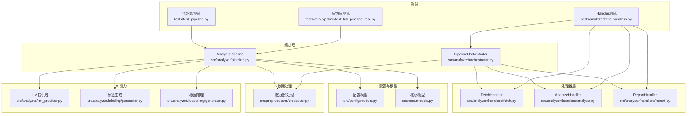
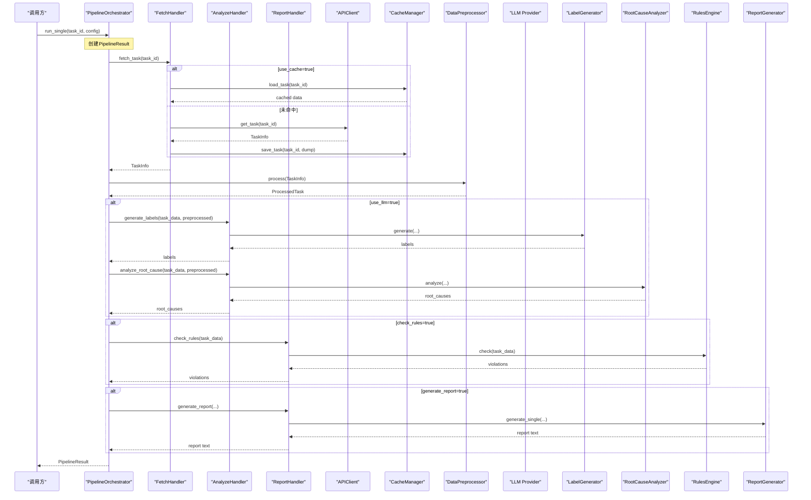
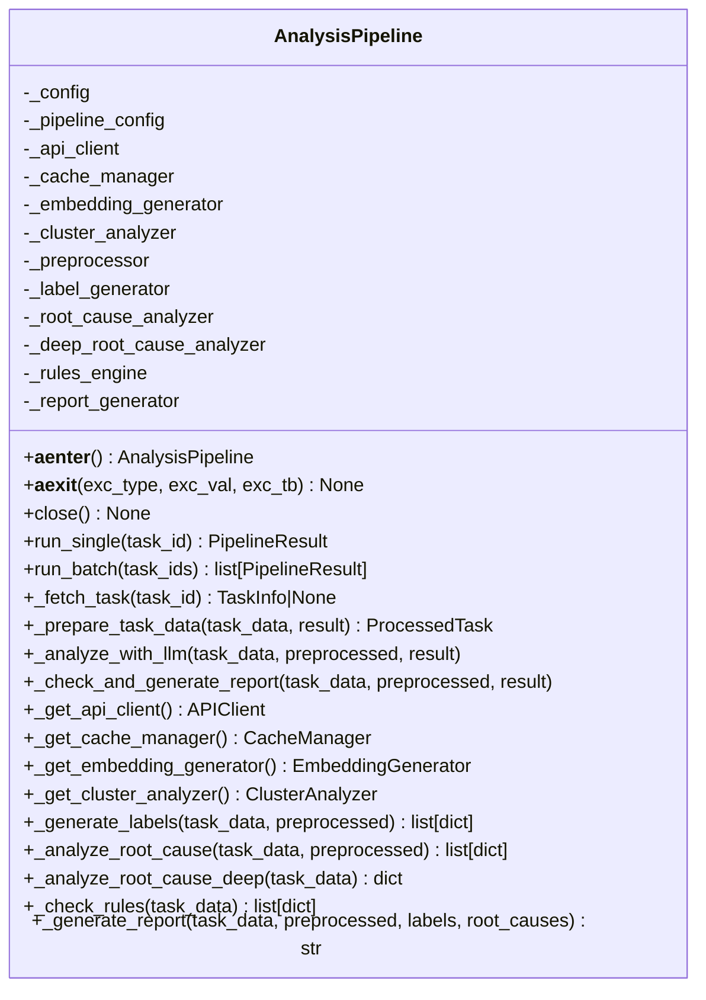
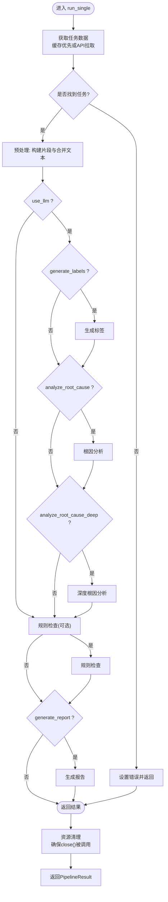
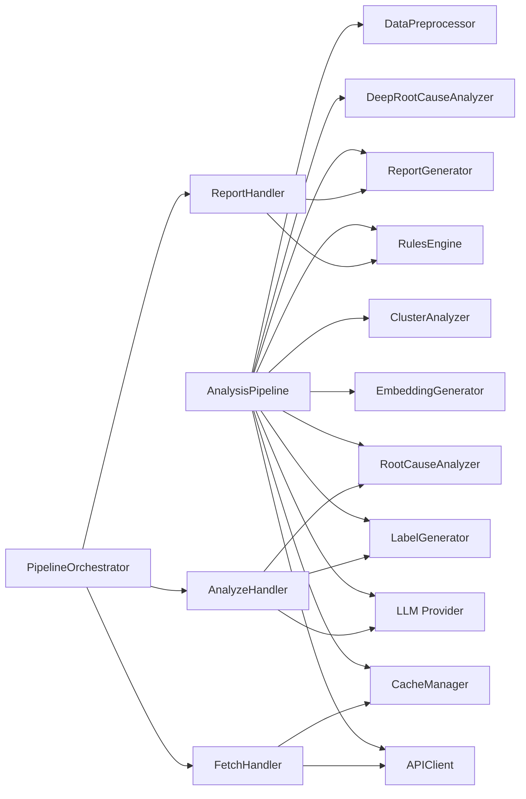

# 分析流水线编排器

<cite>
**本文引用的文件**   
- [src/analyzer/pipeline.py](file://src/analyzer/pipeline.py)
- [src/analyzer/orchestrator.py](file://src/analyzer/orchestrator.py)
- [src/analyzer/handlers/fetch.py](file://src/analyzer/handlers/fetch.py)
- [src/analyzer/handlers/analyze.py](file://src/analyzer/handlers/analyze.py)
- [src/analyzer/handlers/report.py](file://src/analyzer/handlers/report.py)
- [src/config/models.py](file://src/config/models.py)
- [src/core/models.py](file://src/core/models.py)
- [src/preprocessor/processor.py](file://src/preprocessor/processor.py)
- [src/analyzer/llm_provider.py](file://src/analyzer/llm_provider.py)
- [src/analyzer/labeling/generator.py](file://src/analyzer/labeling/generator.py)
- [src/analyzer/reasoning/generator.py](file://src/analyzer/reasoning/generator.py)
- [tests/test_pipeline.py](file://tests/test_pipeline.py)
- [tests/analyzer/test_handlers.py](file://tests/analyzer/test_handlers.py)
- [tests/e2e/pipeline/test_full_pipeline_real.py](file://tests/e2e/pipeline/test_full_pipeline_real.py)
</cite>

## 更新摘要
**变更内容**   
- 改进了异步上下文管理器模式，确保在异常情况下也能正确调用close()方法
- 增强了资源清理机制，防止API客户端和缓存管理器的资源泄漏
- 优化了错误处理流程，确保PipelineResult始终包含task_id信息
- 改进了测试用例，验证异常场景下的资源正确释放

## 目录
1. [简介](#简介)
2. [项目结构](#项目结构)
3. [核心组件](#核心组件)
4. [架构总览](#架构总览)
5. [详细组件分析](#详细组件分析)
6. [依赖关系分析](#依赖关系分析)
7. [性能考量](#性能考量)
8. [故障排查指南](#故障排查指南)
9. [结论](#结论)
10. [附录：使用示例与最佳实践](#附录使用示例与最佳实践)

## 简介
本技术文档围绕 AnalysisPipeline 分析流水线编排器展开，系统性阐述其作为系统核心协调器的设计模式与实现细节。重点覆盖以下方面：
- **增强的异步上下文管理器模式**：确保在任何情况下都能正确释放资源
- **改进的错误处理与资源清理机制**：使用try-finally块确保pipeline.close()在异常情况下也能正确调用
- run_single 与 run_batch 方法的工作流程、调用顺序与数据传递
- PipelineConfig 配置项对缓存、LLM 分析、标签生成、根因分析、规则检查、报告生成的开关控制
- Handler架构重构后的新设计模式和扩展点
- 向后兼容性与迁移策略

## 项目结构
AnalysisPipeline 位于 src/analyzer/pipeline.py，负责编排从任务获取、预处理、可选的 LLM 分析（标签与根因）、深度根因分析、规则检查到报告生成的完整流程。相关关键模块包括：
- 配置模型：src/config/models.py
- 核心数据模型：src/core/models.py
- 数据预处理：src/preprocessor/processor.py
- LLM 提供者适配：src/analyzer/llm_provider.py
- 标签生成：src/analyzer/labeling/generator.py
- 根因推理：src/analyzer/reasoning/generator.py
- **新增** 编排器：src/analyzer/orchestrator.py
- **新增** 处理器：src/analyzer/handlers/
- 单元测试：tests/test_pipeline.py, tests/analyzer/test_handlers.py



**图表来源**
- [src/analyzer/pipeline.py:66-122](file://src/analyzer/pipeline.py#L66-L122)
- [src/analyzer/orchestrator.py:20-40](file://src/analyzer/orchestrator.py#L20-L40)
- [src/analyzer/handlers/fetch.py:15-30](file://src/analyzer/handlers/fetch.py#L15-L30)
- [src/analyzer/handlers/analyze.py:18-34](file://src/analyzer/handlers/analyze.py#L18-L34)
- [src/analyzer/handlers/report.py:14-28](file://src/analyzer/handlers/report.py#L14-L28)

**章节来源**
- [src/analyzer/pipeline.py:66-122](file://src/analyzer/pipeline.py#L66-L122)
- [src/analyzer/orchestrator.py:20-40](file://src/analyzer/orchestrator.py#L20-L40)
- [src/analyzer/handlers/fetch.py:15-30](file://src/analyzer/handlers/fetch.py#L15-L30)
- [src/analyzer/handlers/analyze.py:18-34](file://src/analyzer/handlers/analyze.py#L18-L34)
- [src/analyzer/handlers/report.py:14-28](file://src/analyzer/handlers/report.py#L14-L28)

## 核心组件
- **AnalysisPipeline**：传统编排器，提供异步上下文管理、单任务与批量运行、聚类分析、缓存与外部服务集成、规则检查与报告生成等能力，保持向后兼容。**已增强** 异步上下文管理器以确保资源正确释放。
- **PipelineOrchestrator**：新的编排器，采用Handler架构，通过组合FetchHandler、AnalyzeHandler、ReportHandler实现关注点分离。
- **FetchHandler**：专门负责从API或缓存获取任务数据的处理器。
- **AnalyzeHandler**：专门负责LLM驱动的分析任务，包括标签生成和根因分析。
- **ReportHandler**：专门负责规则检查和报告生成的处理器。
- **PipelineConfig**：运行时开关，控制是否启用缓存、LLM 分析、标签生成、根因分析、深度根因分析、规则检查与报告生成，以及输出路径。
- **PipelineResult**：单次运行的结果载体，包含原始任务数据、预处理结果、标签、根因、违规、聚类ID、报告文本与错误信息。**已改进** 确保即使出错也包含task_id。
- **DataPreprocessor**：将 TaskInfo 转换为结构化片段并拼接为统一文本，供后续分析使用。
- **LLMProvider 及适配器**：封装 OpenAI 等 LLM 调用接口；内部 _LLMClientAdapter 将 provider.generate(system,user) 适配为 generate(prompt)。
- **LabelGenerator / RootCauseAnalyzer**：基于 LLM 的标签生成与根因推理，返回结构化结果。
- **RulesEngine**：规则引擎，用于规范检查与违规检测。
- **ReportGenerator**：报告生成器，根据输入组装 Markdown/HTML/JSON 等格式的报告。

**章节来源**
- [src/analyzer/pipeline.py:35-64](file://src/analyzer/pipeline.py#L35-L64)
- [src/analyzer/orchestrator.py:20-40](file://src/analyzer/orchestrator.py#L20-L40)
- [src/analyzer/handlers/fetch.py:15-30](file://src/analyzer/handlers/fetch.py#L15-L30)
- [src/analyzer/handlers/analyze.py:18-34](file://src/analyzer/handlers/analyze.py#L18-L34)
- [src/analyzer/handlers/report.py:14-28](file://src/analyzer/handlers/report.py#L14-L28)

## 架构总览
系统现在支持两种架构模式：传统的AnalysisPipeline单体架构和新的Handler-based架构。PipelineOrchestrator采用组合模式，将复杂的分析流程分解为三个独立的处理器，每个处理器专注于单一职责。



**图表来源**
- [src/analyzer/orchestrator.py:42-106](file://src/analyzer/orchestrator.py#L42-L106)
- [src/analyzer/handlers/fetch.py:32-54](file://src/analyzer/handlers/fetch.py#L32-L54)
- [src/analyzer/handlers/analyze.py:35-103](file://src/analyzer/handlers/analyze.py#L35-L103)
- [src/analyzer/handlers/report.py:29-85](file://src/analyzer/handlers/report.py#L29-L85)

## 详细组件分析

### 增强的异步上下文管理器与生命周期管理
**已改进** AnalysisPipeline现在具有更健壮的异步上下文管理器实现，确保在任何情况下都能正确释放资源：

- **增强的__aexit__方法**：无论是否发生异常，都会调用close()方法确保资源释放
- **改进的close()方法**：安全地关闭APIClient和CacheManager，避免重复关闭导致异常
- **资源清理保证**：即使在run_single执行过程中抛出异常，也能确保所有外部依赖被正确关闭



**图表来源**
- [src/analyzer/pipeline.py:66-122](file://src/analyzer/pipeline.py#L66-L122)
- [src/analyzer/pipeline.py:245-291](file://src/analyzer/pipeline.py#L245-L291)
- [src/analyzer/pipeline.py:293-467](file://src/analyzer/pipeline.py#L293-L467)

**章节来源**
- [src/analyzer/pipeline.py:101-120](file://src/analyzer/pipeline.py#L101-L120)
- [src/analyzer/pipeline.py:245-291](file://src/analyzer/pipeline.py#L245-L291)

### 改进的错误处理与资源清理机制
**已改进** 系统现在实现了更健壮的错误处理和资源清理机制：

- **异常安全的资源管理**：使用async with语法确保即使发生异常也能正确调用close()
- **测试验证**：端到端测试验证了在异常情况下资源的正确释放
- **错误信息完整性**：PipelineResult始终包含task_id，便于错误追踪

```python
# 改进的资源管理模式
async with pipeline:
    result = await pipeline.run_single(task_id)
    # 即使run_single抛出异常，close()也会被自动调用
```

**章节来源**
- [tests/e2e/pipeline/test_full_pipeline_real.py:337-345](file://tests/e2e/pipeline/test_full_pipeline_real.py#L337-L345)
- [tests/e2e/pipeline/test_full_pipeline_real.py:359-366](file://tests/e2e/pipeline/test_full_pipeline_real.py#L359-L366)

### run_single 工作流程与数据传递
- 入口：run_single(task_id) 初始化 PipelineResult，按序执行：
  1) 获取任务数据：优先走缓存，未命中则调用 API 并回写缓存（受 use_cache 控制）。
  2) 预处理：将 TaskInfo 转为 ProcessedTask，提取多段内容并拼接为 combined_text，写入 result.preprocessed。
  3) LLM 分析（可选）：若 use_llm=true，则根据 generate_labels 与 analyze_root_cause 开关分别调用标签生成与根因推理；若 analyze_root_cause_deep=true，再调用深度根因分析。
  4) 规则检查与报告生成（可选）：根据 check_rules 与 generate_report 开关执行。
- **增强的异常处理**：整个 try 块捕获异常并写入 result.error，保证单个任务失败不影响其他任务（在批量场景下尤为关键），同时确保资源正确释放。
- 数据流：task_data -> preprocessed -> labels/root_causes/deep_root_causes -> violations -> report。



**图表来源**
- [src/analyzer/pipeline.py:121-143](file://src/analyzer/pipeline.py#L121-L143)
- [src/analyzer/pipeline.py:149-163](file://src/analyzer/pipeline.py#L149-L163)
- [src/analyzer/pipeline.py:233-249](file://src/analyzer/pipeline.py#L233-L249)

**章节来源**
- [src/analyzer/pipeline.py:121-143](file://src/analyzer/pipeline.py#L121-L143)
- [src/analyzer/pipeline.py:149-163](file://src/analyzer/pipeline.py#L149-L163)
- [src/analyzer/pipeline.py:233-249](file://src/analyzer/pipeline.py#L233-L249)

### run_batch 并发执行与容错
- 使用 asyncio.gather 并行执行多个 run_single，return_exceptions=False 表示不收集异常对象，而是让异常传播；但每个 run_single 内部已捕获异常并写入 result.error，因此最终返回的结果列表长度与输入一致，部分任务失败不会中断整体流程。
- 适用于大规模任务批处理，结合缓存与并发显著降低端到端耗时。

**章节来源**
- [src/analyzer/pipeline.py:318-329](file://src/analyzer/pipeline.py#L318-L329)
- [tests/test_pipeline.py:514-558](file://tests/test_pipeline.py#L514-L558)

### 配置选项 PipelineConfig 的作用与影响
- use_cache：是否启用缓存读取与写入。开启后优先从缓存加载任务，未命中则拉取 API 并回写。
- use_llm：是否启用 LLM 分析。仅当该开关为真时，才会尝试进行标签与根因分析。
- generate_labels：是否在 LLM 模式下生成标签。
- analyze_root_cause：是否在 LLM 模式下进行根因分析。
- analyze_root_cause_deep：是否进行增强型五层根因分析（需要 LLM 可用且能获取已有分析数据）。
- check_rules：是否进行规则检查。
- generate_report：是否生成报告。
- output_path：输出路径（当前主要用于报告输出目录）。

**章节来源**
- [src/analyzer/pipeline.py:42-54](file://src/analyzer/pipeline.py#L42-L54)
- [tests/test_pipeline.py:9-37](file://tests/test_pipeline.py#L9-L37)

### 各分析步骤的实现要点
- **标签生成（LabelGenerator）**：构造系统提示与用户提示，调用 LLM 生成 JSON，解析为结构化标签列表。不可用时返回空列表，不抛异常。
- **根因分析（RootCauseAnalyzer）**：类似地构造提示，结合标签上下文进行根因推理，返回结构化根因列表。
- **深度根因分析（DeepRootCauseAnalyzer）**：通过 _LLMClientAdapter 适配 provider.generate(system,user) 为 generate(prompt)，并从 API 获取已有分析数据，构建 FaultAnalysisInput 进行分析。
- **规则检查（RulesEngine）**：对 task_data 执行规则匹配，返回违规列表。
- **报告生成（ReportGenerator）**：根据任务数据、分段、标签、根因与建议生成报告文本。

**章节来源**
- [src/analyzer/labeling/generator.py:55-104](file://src/analyzer/labeling/generator.py#L55-L104)
- [src/analyzer/reasoning/generator.py:67-127](file://src/analyzer/reasoning/generator.py#L67-L127)
- [src/analyzer/pipeline.py:507-563](file://src/analyzer/pipeline.py#L507-L563)
- [src/analyzer/pipeline.py:583-640](file://src/analyzer/pipeline.py#L583-L640)
- [src/analyzer/pipeline.py:642-655](file://src/analyzer/pipeline.py#L642-L655)
- [src/analyzer/pipeline.py:771-800](file://src/analyzer/pipeline.py#L771-L800)

## 依赖关系分析
- **外部依赖**：
  - APIClient：任务数据获取与已有分析数据拉取。**已改进** 确保在异常情况下也能正确关闭。
  - CacheManager：本地缓存读写。**已改进** 确保在异常情况下也能正确关闭。
  - EmbeddingGenerator / ClusterAnalyzer：聚类分析（run_clustering）。
  - LLMProvider：OpenAI 等 LLM 调用。
  - RulesEngine：规则检查。
  - ReportGenerator：报告生成。
- **内部依赖**：
  - DataPreprocessor：数据预处理。
  - LabelGenerator / RootCauseAnalyzer：LLM 驱动的分析。
  - DeepRootCauseAnalyzer：增强根因分析。
- **耦合与内聚**：
  - AnalysisPipeline 作为编排器，职责清晰，通过懒加载降低启动耦合。
  - PipelineOrchestrator 通过Handler模式实现更好的关注点分离。
  - 各分析组件独立，通过配置开关组合，具备良好的可扩展性。



**图表来源**
- [src/analyzer/pipeline.py:459-480](file://src/analyzer/pipeline.py#L459-L480)
- [src/analyzer/pipeline.py:482-505](file://src/analyzer/pipeline.py#L482-L505)
- [src/analyzer/orchestrator.py:20-40](file://src/analyzer/orchestrator.py#L20-L40)

**章节来源**
- [src/analyzer/pipeline.py:459-480](file://src/analyzer/pipeline.py#L459-L480)
- [src/analyzer/pipeline.py:482-505](file://src/analyzer/pipeline.py#L482-L505)
- [src/analyzer/orchestrator.py:20-40](file://src/analyzer/orchestrator.py#L20-L40)

## 性能考量
- **并发**：run_batch 使用 asyncio.gather 并发执行，显著提升吞吐。
- **缓存**：use_cache=true 可减少网络请求与重复计算，适合多次运行相同任务集。
- **懒加载**：外部依赖按需创建，避免不必要的初始化成本。
- **文本截断**：DataPreprocessor 对合并文本进行最大长度限制，防止超出 LLM 上下文窗口。
- **Handler架构优势**：新的Handler架构允许更细粒度的并行处理和资源管理。
- **改进的资源管理**：增强的异步上下文管理器减少了资源泄漏风险，提高了系统稳定性。
- **建议**：
  - 大批量任务优先开启 use_cache 与 use_llm=false 的离线预处理阶段，再在第二阶段开启 LLM 分析。
  - 合理设置 LLM 的 temperature 与 max_tokens，平衡质量与成本。
  - 对高频规则检查可考虑结果缓存或增量更新。
  - 在新项目中优先考虑使用PipelineOrchestrator以获得更好的性能和可维护性。
  - **重要**：始终使用 async with 语句来确保资源正确释放。

## 故障排查指南
- **任务不存在**：run_single 中若 _fetch_task 返回 None，result.error 会被设置为"Task X not found"。
- **预处理异常**：预处理抛出异常会被捕获并写入 result.error，可通过日志定位具体原因。
- **LLM 不可用**：当 create_llm_provider 返回 None 或 is_available=false，标签与根因分析返回空列表，不会崩溃。
- **规则引擎异常**：规则检查抛出异常会被捕获并记录到 result.error。
- **资源未释放**：**已改进** 确认使用 async with 或在完成后显式调用 close()，确保 APIClient 被正确关闭。现在即使发生异常也能确保资源释放。
- **Handler架构问题**：如果PipelineOrchestrator出现问题，检查各个Handler的依赖注入是否正确。
- **错误信息不完整**：**已改进** PipelineResult现在总是包含task_id，便于错误追踪和调试。

**章节来源**
- [src/analyzer/pipeline.py:121-143](file://src/analyzer/pipeline.py#L121-L143)
- [src/analyzer/pipeline.py:507-563](file://src/analyzer/pipeline.py#L507-L563)
- [tests/test_pipeline.py:370-404](file://tests/test_pipeline.py#L370-L404)
- [tests/test_pipeline.py:406-451](file://tests/test_pipeline.py#L406-L451)
- [tests/test_pipeline.py:682-716](file://tests/test_pipeline.py#L682-L716)
- [tests/e2e/pipeline/test_full_pipeline_real.py:337-366](file://tests/e2e/pipeline/test_full_pipeline_real.py#L337-L366)

## 结论
AnalysisPipeline 以清晰的编排职责、灵活的配置开关与健壮的错误处理，实现了从数据获取、预处理、LLM 分析、规则检查到报告生成的全链路自动化。**已显著改进** 的异步上下文管理器确保了在任何情况下都能正确释放资源，防止资源泄漏。新增的Handler架构提供了更好的关注点分离和可维护性，同时保持了完全的向后兼容性。其增强的异步上下文管理与懒加载策略提升了资源利用率与可维护性，配合并发批处理与缓存机制，可在生产环境中稳定高效地运行。

## 附录：使用示例与最佳实践

### 基本用法（单任务）- 传统方式
- 使用 async with 创建并自动释放资源。**已改进** 现在即使发生异常也能确保资源正确释放。
- 设置 PipelineConfig 控制功能开关。
- 调用 run_single 获取 PipelineResult。

参考路径
- [tests/test_pipeline.py:118-157](file://tests/test_pipeline.py#L118-L157)

### 基本用法（单任务）- 新Handler架构
- 创建PipelineOrchestrator实例，注入各个Handler。
- 设置 PipelineConfig 控制功能开关。
- 调用 run_single 获取 PipelineResult。

```python
from src.analyzer.orchestrator import PipelineOrchestrator
from src.analyzer.handlers.fetch import FetchHandler
from src.analyzer.handlers.analyze import AnalyzeHandler
from src.analyzer.handlers.report import ReportHandler
from src.analyzer.pipeline import PipelineConfig

# 创建处理器
fetch_handler = FetchHandler(api_client=api_client, cache_manager=cache_manager)
analyze_handler = AnalyzeHandler(llm_provider=llm_provider)
report_handler = ReportHandler()

# 创建编排器
orchestrator = PipelineOrchestrator(
    fetch_handler=fetch_handler,
    analyze_handler=analyze_handler,
    report_handler=report_handler
)

# 配置和运行
config = PipelineConfig(use_llm=True, generate_labels=True)
result = await orchestrator.run_single(task_id, config)
```

### 批量处理
- 传入任务 ID 列表，run_batch 并发执行。
- 注意部分任务失败会在对应 result.error 中体现，但不影响其他任务。

参考路径
- [tests/test_pipeline.py:176-202](file://tests/test_pipeline.py#L176-L202)
- [tests/test_pipeline.py:514-558](file://tests/test_pipeline.py#L514-L558)

### 配置建议
- **开发调试**：use_llm=false，仅做预处理与规则检查，快速验证流程。
- **生产环境**：use_cache=true，use_llm=true，按需开启标签与根因分析；必要时开启深度根因分析。
- **报告输出**：generate_report=true，output_path 指向持久化目录。
- **架构选择**：新项目推荐使用PipelineOrchestrator，现有项目可继续使用AnalysisPipeline。

参考路径
- [src/analyzer/pipeline.py:42-54](file://src/analyzer/pipeline.py#L42-L54)
- [tests/test_pipeline.py:19-37](file://tests/test_pipeline.py#L19-L37)

### 自定义分析流程与扩展新步骤
- **新增分析步骤（传统方式）**：
  - 在 AnalysisPipeline 中添加私有方法（如 _do_custom_step），并在合适位置（例如 _analyze_with_llm 或 _check_and_generate_report）调用。
  - 通过 PipelineConfig 增加开关字段，控制是否启用。
- **新增分析步骤（Handler架构）**：
  - 创建新的Handler类，实现特定的分析逻辑。
  - 在PipelineOrchestrator中添加对新Handler的调用。
- **替换 LLM 提供者**：
  - 实现新的 LLMProvider 类，并在 create_llm_provider 中根据配置选择。
- **扩展预处理**：
  - 在 DataPreprocessor 中新增片段类型与合并逻辑，并在 run_single 的数据流中使用。

参考路径
- [src/analyzer/pipeline.py:165-179](file://src/analyzer/pipeline.py#L165-L179)
- [src/analyzer/llm_provider.py:55-67](file://src/analyzer/llm_provider.py#L55-L67)
- [src/preprocessor/processor.py:1-40](file://src/preprocessor/processor.py#L1-L40)

### 向后兼容性说明
- AnalysisPipeline 保持完全向后兼容，所有现有API保持不变。
- 内部方法如 _fetch_task、_check_rules、_generate_report 等仍然可用。
- 可以逐步迁移到新的Handler架构，无需一次性重构。

**章节来源**
- [tests/analyzer/test_handlers.py:305-357](file://tests/analyzer/test_handlers.py#L305-L357)
- [tests/test_pipeline.py:644-679](file://tests/test_pipeline.py#L644-L679)

### 资源管理最佳实践
**已改进** 现在推荐以下资源管理模式：

```python
# 推荐的资源管理模式
async with AnalysisPipeline(config=config_manager) as pipeline:
    result = await pipeline.run_single(task_id)
    # 即使run_single抛出异常，close()也会被自动调用
    if result.error:
        logger.error(f"Task {task_id} failed: {result.error}")
    else:
        logger.info(f"Task {task_id} completed successfully")

# 手动资源管理（不推荐，但兼容）
pipeline = AnalysisPipeline(config=config_manager)
try:
    result = await pipeline.run_single(task_id)
finally:
    await pipeline.close()  # 确保资源释放
```

**章节来源**
- [tests/e2e/pipeline/test_full_pipeline_real.py:337-345](file://tests/e2e/pipeline/test_full_pipeline_real.py#L337-L345)
- [tests/e2e/pipeline/test_full_pipeline_real.py:359-366](file://tests/e2e/pipeline/test_full_pipeline_real.py#L359-L366)