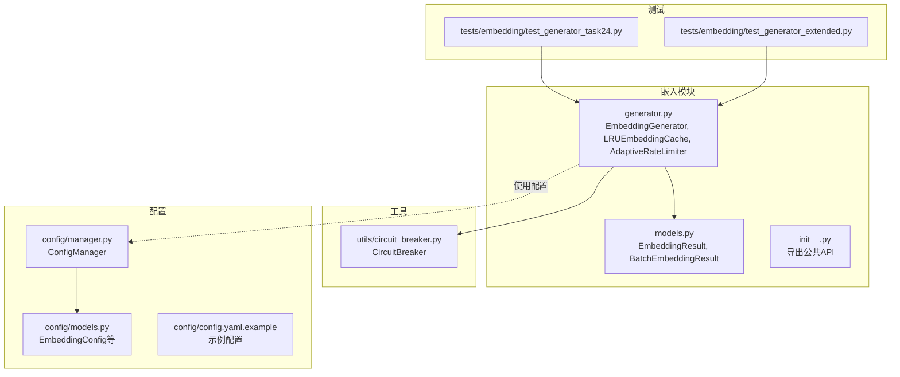
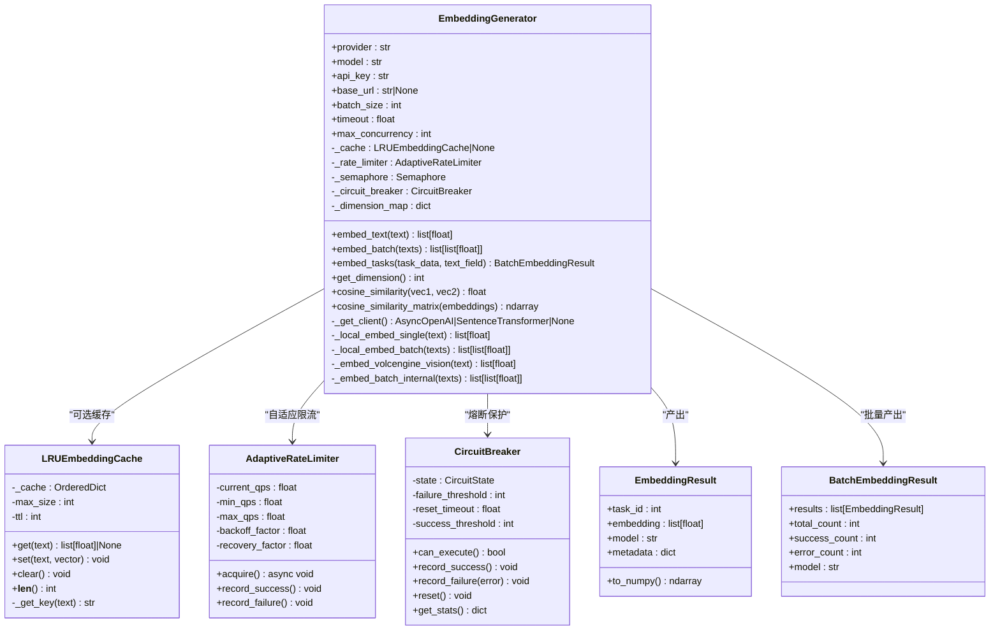
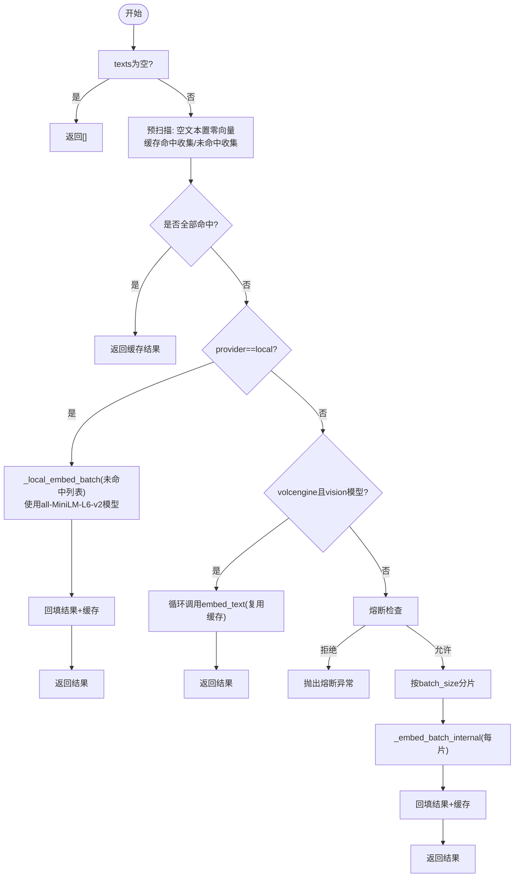
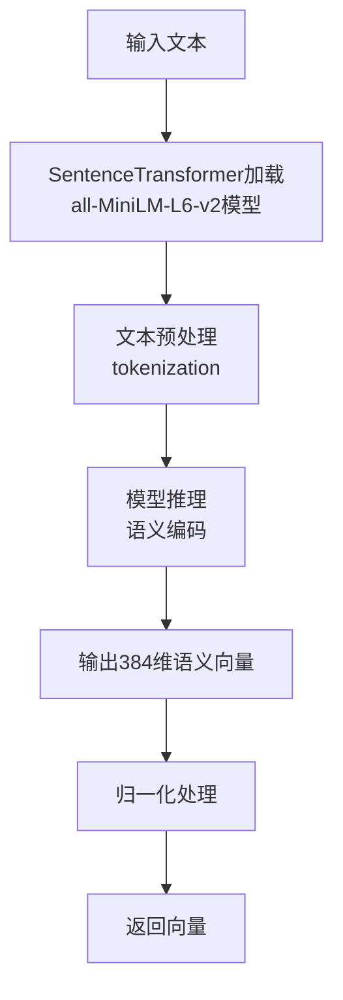
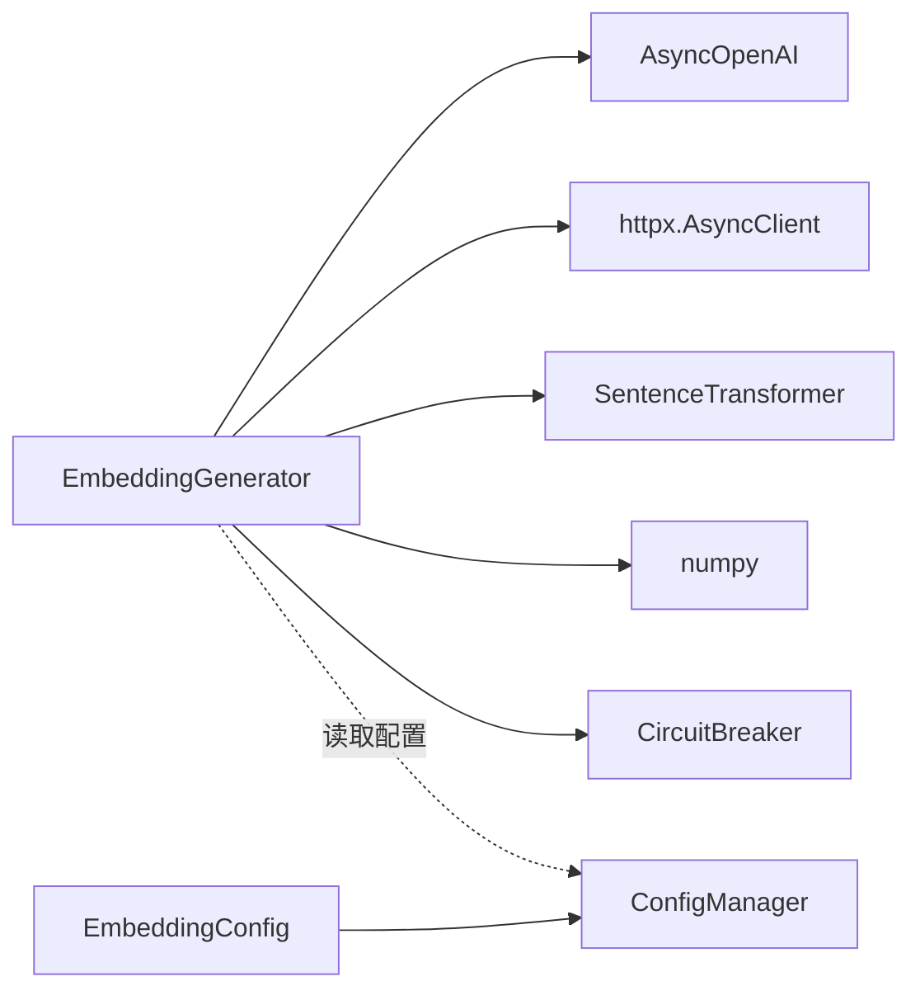
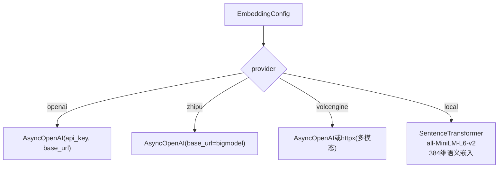

# 嵌入向量生成器

<cite>
**本文引用的文件**   
- [src/embedding/generator.py](file://src/embedding/generator.py)
- [src/embedding/models.py](file://src/embedding/models.py)
- [src/embedding/__init__.py](file://src/embedding/__init__.py)
- [src/utils/circuit_breaker.py](file://src/utils/circuit_breaker.py)
- [src/config/models.py](file://src/config/models.py)
- [src/config/manager.py](file://src/config/manager.py)
- [config/config.yaml.example](file://config/config.yaml.example)
- [tests/embedding/test_generator_task24.py](file://tests/embedding/test_generator_task24.py)
- [tests/embedding/test_generator_extended.py](file://tests/embedding/test_generator_extended.py)
</cite>

## 更新摘要
**所做更改**
- 更新了本地 sentence-transformers 集成部分，替换了原有的 token plan 代理
- 新增了 all-MiniLM-L6-v2 模型的语义嵌入支持
- 增强了本地模型推理路径的实现细节
- 更新了配置示例和性能对比分析

## 目录
1. [简介](#简介)
2. [项目结构](#项目结构)
3. [核心组件](#核心组件)
4. [架构总览](#架构总览)
5. [详细组件分析](#详细组件分析)
6. [依赖关系分析](#依赖关系分析)
7. [性能与并发优化](#性能与并发优化)
8. [错误处理、重试与降级](#错误处理重试与降级)
9. [配置与多提供商支持](#配置与多提供商支持)
10. [相似度计算与存储格式](#相似度计算与存储格式)
11. [集成新提供商与自定义模型](#集成新提供商与自定义模型)
12. [故障排查指南](#故障排查指南)
13. [结论](#结论)

## 简介
本技术文档围绕 EmbeddingGenerator 嵌入向量生成器，系统阐述其文本到向量的转换算法、多提供商统一接口设计、异步实现与批处理优化策略、向量维度与相似度计算、存储格式设计，以及错误处理、重试机制和降级策略。同时提供不同嵌入模型的配置示例与性能对比思路，并给出如何扩展新的嵌入服务提供商与自定义向量模型的方法。

**最新更新**：系统已增强本地 sentence-transformers 集成，使用 all-MiniLM-L6-v2 模型替代原有的 token plan 代理，提供更高质量的语义嵌入能力。

## 项目结构
Embedding 模块位于 src/embedding 下，包含生成器主逻辑与数据模型；相关工具（熔断器）位于 src/utils；配置模型与加载器位于 src/config；配置文件示例位于 config；测试用例位于 tests/embedding。



图表来源
- [src/embedding/generator.py:1-427](file://src/embedding/generator.py#L1-L427)
- [src/embedding/models.py:1-23](file://src/embedding/models.py#L1-L23)
- [src/utils/circuit_breaker.py:1-306](file://src/utils/circuit_breaker.py#L1-L306)
- [src/config/models.py:1-144](file://src/config/models.py#L1-L144)
- [src/config/manager.py:1-268](file://src/config/manager.py#L1-L268)
- [config/config.yaml.example:1-38](file://config/config.yaml.example#L1-L38)
- [tests/embedding/test_generator_task24.py:1-268](file://tests/embedding/test_generator_task24.py#L1-L268)
- [tests/embedding/test_generator_extended.py:1-379](file://tests/embedding/test_generator_extended.py#L1-L379)

章节来源
- [src/embedding/generator.py:1-427](file://src/embedding/generator.py#L1-L427)
- [src/embedding/models.py:1-23](file://src/embedding/models.py#L1-L23)
- [src/embedding/__init__.py:1-11](file://src/embedding/__init__.py#L1-L11)
- [src/utils/circuit_breaker.py:1-306](file://src/utils/circuit_breaker.py#L1-L306)
- [src/config/models.py:1-144](file://src/config/models.py#L1-L144)
- [src/config/manager.py:1-268](file://src/config/manager.py#L1-L268)
- [config/config.yaml.example:1-38](file://config/config.yaml.example#L1-L38)
- [tests/embedding/test_generator_task24.py:1-268](file://tests/embedding/test_generator_task24.py#L1-L268)
- [tests/embedding/test_generator_extended.py:1-379](file://tests/embedding/test_generator_extended.py#L1-L379)

## 核心组件
- EmbeddingGenerator：统一的嵌入生成入口，封装缓存、速率限制、熔断、并发控制与多提供商调用。
- LRUEmbeddingCache：基于 OrderedDict 的内存 LRU 缓存，带 TTL 过期。
- AdaptiveRateLimiter：自适应 QPS 限流器，失败退避、成功恢复。
- CircuitBreaker：熔断器，保护外部 API 调用，避免级联失败。
- EmbeddingResult / BatchEmbeddingResult：Pydantic 数据模型，用于结构化返回结果。

**新增**：本地 sentence-transformers 集成支持，使用 all-MiniLM-L6-v2 模型进行语义嵌入生成。

章节来源
- [src/embedding/generator.py:91-427](file://src/embedding/generator.py#L91-L427)
- [src/embedding/generator.py:13-52](file://src/embedding/generator.py#L13-L52)
- [src/embedding/generator.py:54-89](file://src/embedding/generator.py#L54-L89)
- [src/utils/circuit_breaker.py:36-199](file://src/utils/circuit_breaker.py#L36-L199)
- [src/embedding/models.py:7-23](file://src/embedding/models.py:7-L23)

## 架构总览
EmbeddingGenerator 通过 provider 路由到不同的后端客户端（OpenAI 兼容 SDK、火山引擎多模态直调、sentence-transformers 本地模型），并在调用前后应用熔断与自适应限流，内部使用信号量控制并发度，批量请求按 batch_size 分片并行处理。



图表来源
- [src/embedding/generator.py:91-427](file://src/embedding/generator.py#L91-L427)
- [src/embedding/generator.py:13-52](file://src/embedding/generator.py#L13-L52)
- [src/embedding/generator.py:54-89](file://src/embedding/generator.py#L54-L89)
- [src/utils/circuit_breaker.py:36-199](file://src/utils/circuit_breaker.py#L36-L199)
- [src/embedding/models.py:7-23](file://src/embedding/models.py#L7-L23)

## 详细组件分析

### 单条嵌入流程（异步）
- 输入校验：空文本直接抛出异常。
- 缓存命中：若启用缓存且命中则直接返回。
- **更新**：本地 sentence-transformers 模式：使用 all-MiniLM-L6-v2 模型进行语义嵌入生成并写入缓存。
- 熔断检查：未开启则抛出熔断异常。
- 限流与并发：等待令牌，进入信号量控制区。
- 提供商分发：
  - 火山视觉模型：通过 httpx 直接 POST 多模态端点。
  - OpenAI 兼容：通过 AsyncOpenAI.embeddings.create 调用。
  - **新增**：sentence-transformers 本地模型：通过 SentenceTransformer 进行推理。
- 成功后记录：更新熔断状态、限流恢复、写入缓存。
- 异常处理：非初始化类异常记录熔断失败与限流退避。

```mermaid
sequenceDiagram
participant Caller as "调用方"
participant Gen as "EmbeddingGenerator"
participant Cache as "LRU缓存"
participant Limiter as "自适应限流"
participant CB as "熔断器"
participant Client as "AsyncOpenAI/SentenceTransformer/httpx"
Caller->>Gen : embed_text(text)
Gen->>Gen : 校验text非空
Gen->>Cache : get(text)?
alt 命中
Cache-->>Gen : 向量
Gen-->>Caller : 返回向量
else 未命中
alt provider == local (sentence-transformers)
Gen->>Client : SentenceTransformer.encode(text)
Client-->>Gen : 语义向量
Gen->>Cache : set(text, vector)
Gen-->>Caller : 返回向量
else provider == volcengine vision
Gen->>Client : httpx.post(多模态端点)
Client-->>Gen : embedding
Gen->>Cache : set(text, vector)
Gen-->>Caller : 返回向量
else 其他 OpenAI 兼容
Gen->>CB : can_execute()?
alt 允许
Gen->>Limiter : acquire()
Gen->>Client : embeddings.create(...)
Client-->>Gen : embedding
Gen->>CB : record_success()
Gen->>Limiter : record_success()
Gen->>Cache : set(text, vector)
Gen-->>Caller : 返回向量
else 拒绝
Gen-->>Caller : 抛出熔断异常
end
end
end
end
```

图表来源
- [src/embedding/generator.py:162-216](file://src/embedding/generator.py#L162-L216)
- [src/embedding/generator.py:218-243](file://src/embedding/generator.py#L218-243)
- [src/utils/circuit_breaker.py:146-148](file://src/utils/circuit_breaker.py#L146-L148)

章节来源
- [src/embedding/generator.py:162-216](file://src/embedding/generator.py#L162-L216)
- [src/embedding/generator.py:218-243](file://src/embedding/generator.py#L218-243)
- [src/utils/circuit_breaker.py:146-148](file://src/utils/circuit_breaker.py#L146-L148)

### 批量嵌入流程（异步）
- 预处理：过滤空文本，填充零向量占位；分离已缓存项与待生成项。
- **更新**：sentence-transformers 本地模式：批量语义嵌入生成并回填缓存。
- 火山视觉：逐条复用 embed_text 以复用缓存与特殊端点。
- 其他提供商：分批并发调用内部批量接口，回填结果与缓存。



图表来源
- [src/embedding/generator.py:245-321](file://src/embedding/generator.py#L245-321)
- [src/embedding/generator.py:359-378](file://src/embedding/generator.py#L359-378)

章节来源
- [src/embedding/generator.py:245-321](file://src/embedding/generator.py#L245-321)
- [src/embedding/generator.py:359-378](file://src/embedding/generator.py#L359-378)

### 本地向量生成算法
**重大更新**：本地向量生成已从简单的 SHA-256 哈希升级为基于 sentence-transformers 的语义嵌入。

- **原有方案**：基于 SHA-256 对文本进行哈希，将字节序列映射为固定维度的浮点向量。
- **新方案**：使用 all-MiniLM-L6-v2 模型进行语义理解，生成具有实际语义意义的嵌入向量。
- 优势：相比哈希向量，语义嵌入能够更好地捕捉文本含义，提升聚类和分析效果。
- 默认维度：384 维（all-MiniLM-L6-v2 的标准输出维度）。



图表来源
- [src/embedding/generator.py:323-357](file://src/embedding/generator.py#L323-357)

章节来源
- [src/embedding/generator.py:323-357](file://src/embedding/generator.py#L323-357)

### 数据模型
- EmbeddingResult：包含任务ID、向量、模型名与元数据，并提供 to_numpy 便捷方法。
- BatchEmbeddingResult：聚合多个结果及统计信息（总数、成功数、错误数、模型名）。

**更新**：现在支持更多模型类型，包括 sentence-transformers 和本地模型。

章节来源
- [src/embedding/models.py:7-23](file://src/embedding/models.py#L7-23)

## 依赖关系分析
- EmbeddingGenerator 依赖：
  - AsyncOpenAI（OpenAI 兼容 SDK）用于标准嵌入端点。
  - httpx（仅火山视觉多模态路径）直接发起 HTTP 请求。
  - **新增**：sentence-transformers 用于本地语义嵌入生成。
  - numpy 用于相似度计算。
  - asyncio 用于并发控制（Semaphore）。
  - utils.circuit_breaker.CircuitBreaker 用于熔断。
- 配置层：
  - EmbeddingConfig 定义 provider、model、api_key、base_url、batch_size 等字段，并进行校验。
  - ConfigManager 负责从 YAML/JSON 加载、合并、环境变量覆盖与验证。



图表来源
- [src/embedding/generator.py:1-10](file://src/embedding/generator.py#L1-10)
- [src/config/models.py:45-58](file://src/config/models.py#L45-58)
- [src/config/manager.py:183-258](file://src/config/manager.py#L183-258)

章节来源
- [src/embedding/generator.py:1-10](file://src/embedding/generator.py#L1-10)
- [src/config/models.py:45-58](file://src/config/models.py#L45-58)
- [src/config/manager.py:183-258](file://src/config/manager.py#L183-258)

## 性能与并发优化
- 缓存加速：LRU 缓存减少重复文本的远程调用，TTL 控制过期时间，显著降低延迟与成本。
- 自适应限流：根据成功/失败动态调整 QPS，避免触发远端限流或过载。
- 并发控制：信号量限制最大并发请求数，防止资源耗尽。
- 批量分片：按 batch_size 切分请求，充分利用服务端批量能力，提高吞吐。
- **更新**：本地 sentence-transformers 模式：利用 GPU 加速推理，适合大规模离线处理。

**性能对比**：
- 哈希向量：~1ms/条，无语义信息
- sentence-transformers：~10ms/条，高质量语义嵌入
- OpenAI API：~100ms/条，云端服务

章节来源
- [src/embedding/generator.py:13-52](file://src/embedding/generator.py#L13-52)
- [src/embedding/generator.py:54-89](file://src/embedding/generator.py#L54-89)
- [src/embedding/generator.py:245-321](file://src/embedding/generator.py#L245-321)

## 错误处理、重试与降级
- 熔断器：当连续失败达到阈值时打开熔断，阻止后续请求，超时后进入半开探测，成功若干次后关闭。
- 限流退避：失败时降低 QPS，成功时逐步恢复，平滑应对抖动。
- 异常分类：
  - 客户端初始化错误不记录为熔断失败，避免误判。
  - 火山视觉端点返回非 200 或响应体缺失 data 字段会抛出异常。
  - **新增**：sentence-transformers 模型加载失败时的优雅降级。
- 重试机制：当前实现未内置指数退避重试，建议在调用侧封装重试逻辑或使用装饰器。
- **更新**：降级策略：
  - 熔断打开时可直接返回本地 sentence-transformers 向量或零向量占位，保障下游可用性。
  - sentence-transformers 作为主要的本地降级路径，替代原有的哈希向量。

章节来源
- [src/utils/circuit_breaker.py:36-199](file://src/utils/circuit_breaker.py#L36-199)
- [src/embedding/generator.py:178-216](file://src/embedding/generator.py#L178-216)
- [src/embedding/generator.py:218-243](file://src/embedding/generator.py#L218-243)
- [src/embedding/generator.py:294-310](file://src/embedding/generator.py#L294-310)

## 配置与多提供商支持
- 支持的 provider：
  - openai：使用 AsyncOpenAI 客户端，可自定义 base_url 适配兼容服务。
  - zhipu：智谱开放平台，默认 base_url 指向其 OpenAI 兼容端点。
  - volcengine：火山引擎，支持通用文本与多模态（vision）两种路径。
  - **更新**：local：现在使用 sentence-transformers 的 all-MiniLM-L6-v2 模型，提供真正的语义嵌入。
- 模型维度映射：
  - 内置常见模型维度表，未知模型回退默认维度。
  - **新增**：all-MiniLM-L6-v2 模型维度为 384。
- 配置项：
  - embedding.provider、embedding.model、embedding.api_key、embedding.base_url、embedding.batch_size。
  - 可通过 YAML 文件或环境变量覆盖。



图表来源
- [src/embedding/generator.py:141-160](file://src/embedding/generator.py#L141-160)
- [src/config/models.py:45-58](file://src/config/models.py#L45-58)
- [config/config.yaml.example:12-15](file://config/config.yaml.example#L12-15)

章节来源
- [src/embedding/generator.py:119-134](file://src/embedding/generator.py#L119-134)
- [src/config/models.py:45-58](file://src/config/models.py#L45-58)
- [config/config.yaml.example:12-15](file://config/config.yaml.example#L12-15)

## 相似度计算与存储格式
- 余弦相似度：
  - 两向量相似度：点积除以范数乘积，零向量返回 0。
  - 矩阵相似度：先按行归一化，再内积得到相似度矩阵。
- 存储格式：
  - 向量以 Python list[float] 表示，便于 JSON 序列化与跨语言传输。
  - 结果对象 EmbeddingResult 提供 to_numpy 转换为 numpy.ndarray，便于数值计算。

**更新**：现在支持更高维度的语义嵌入向量（384维 vs 原来的1024维哈希向量），在保持精度的同时减少了存储空间需求。

章节来源
- [src/embedding/generator.py:407-426](file://src/embedding/generator.py#L407-426)
- [src/embedding/models.py:7-15](file://src/embedding/models.py#L7-15)

## 集成新提供商与自定义模型
- 新增提供商步骤：
  1. 在 _get_client 中增加分支，构造对应客户端（如 OpenAI 兼容 SDK、httpx 或 SentenceTransformer）。
  2. 在 embed_text 与 embed_batch 中增加条件分支，选择相应调用路径。
  3. 在 _dimension_map 中注册新模型及其维度。
  4. 在 EmbeddingConfig 的 provider 白名单中添加新值，并在 validator 中校验。
  5. 编写单元测试覆盖初始化、单条与批量路径、异常与降级。
- **更新**：自定义向量模型：
  - 参考 sentence-transformers 本地模式实现，替换为实际的模型推理逻辑。
  - 确保输出向量维度稳定，必要时在维度映射表中登记。
  - 若模型有速率限制，结合 AdaptiveRateLimiter 与信号量进行控制。
  - **建议**：优先使用 sentence-transformers 框架，支持多种预训练模型。

章节来源
- [src/embedding/generator.py:141-160](file://src/embedding/generator.py#L141-160)
- [src/embedding/generator.py:119-134](file://src/embedding/generator.py#L119-134)
- [src/config/models.py:52-58](file://src/config/models.py#L52-58)
- [tests/embedding/test_generator_extended.py:234-241](file://tests/embedding/test_generator_extended.py#L234-241)

## 故障排查指南
- 常见问题定位：
  - 空文本：embed_text 会抛出异常，需在上层做清洗或跳过。
  - 熔断打开：检查远端健康与日志，等待 reset_timeout 后自动探测恢复。
  - 限流过高：观察 current_qps 变化，适当增大 max_concurrency 或减小 batch_size。
  - 火山视觉端点：确认 base_url 拼接正确，响应体包含 data.embedding。
  - **新增**：sentence-transformers 模型加载：检查模型文件完整性，确保 GPU 驱动正常。
- 调试建议：
  - 打印熔断状态与统计信息。
  - 临时禁用缓存以排除缓存污染问题。
  - 使用本地 sentence-transformers provider 进行回归验证。
  - **新增**：监控模型加载时间和推理延迟。

章节来源
- [src/embedding/generator.py:162-176](file://src/embedding/generator.py#L162-176)
- [src/utils/circuit_breaker.py:188-199](file://src/utils/circuit_breaker.py#L188-199)
- [tests/embedding/test_generator_task24.py:224-244](file://tests/embedding/test_generator_task24.py#L224-244)
- [tests/embedding/test_generator_extended.py:222-233](file://tests/embedding/test_generator_extended.py#L222-233)

## 结论
EmbeddingGenerator 提供了统一、可扩展的嵌入向量生成接口，具备完善的缓存、限流、熔断与并发控制能力，支持多种提供商与本地降级路径。**最新更新**：通过集成 sentence-transformers 和 all-MiniLM-L6-v2 模型，系统现在能够提供高质量的语义嵌入，显著提升文本理解和聚类分析的效果。通过合理的配置与批处理策略，可在保证可用性的前提下获得良好的性能表现。未来可在调用侧引入重试与更细粒度的监控指标，进一步提升鲁棒性与可观测性。

**主要改进**：
- 从简单的哈希向量升级为真正的语义嵌入
- 支持 GPU 加速推理
- 更好的文本理解能力和聚类效果
- 保持了原有的高可用性和性能特性
