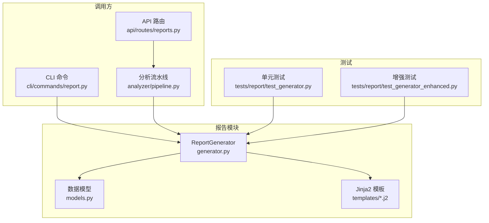
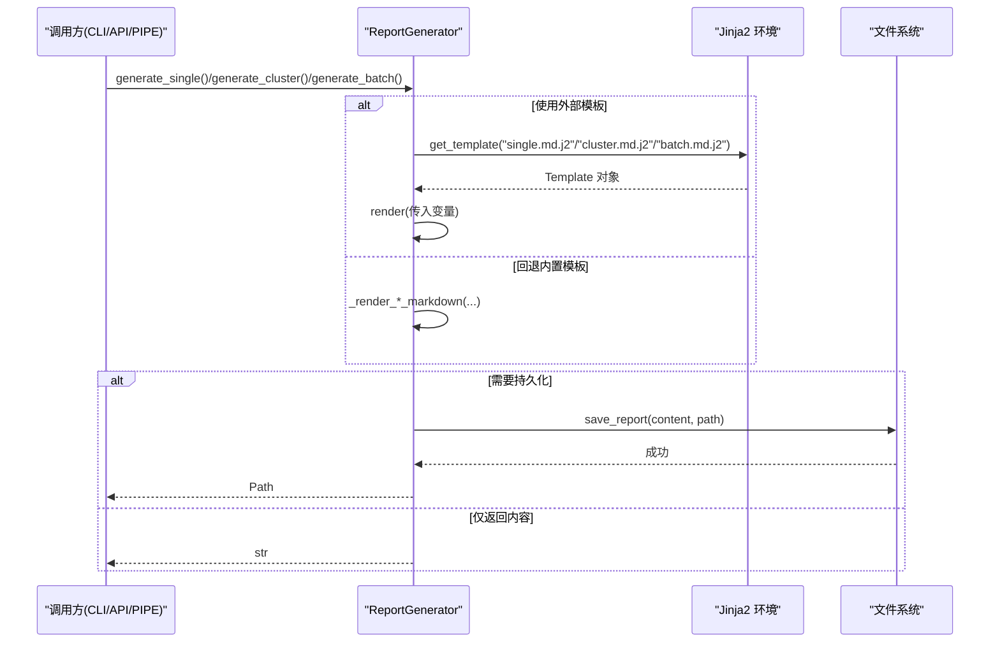
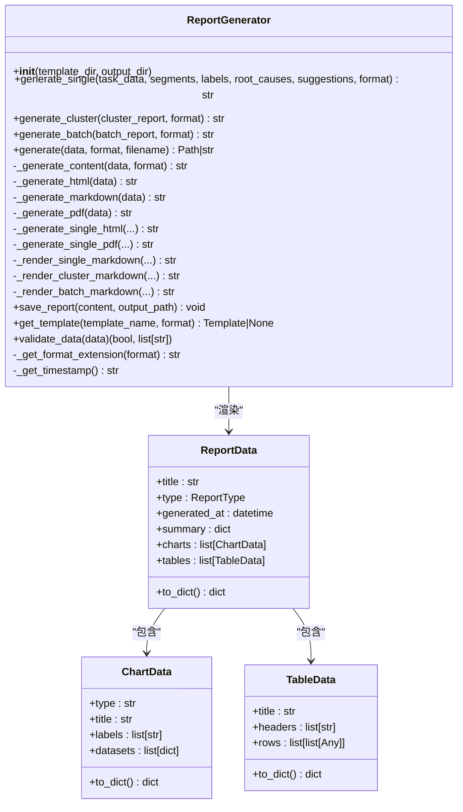
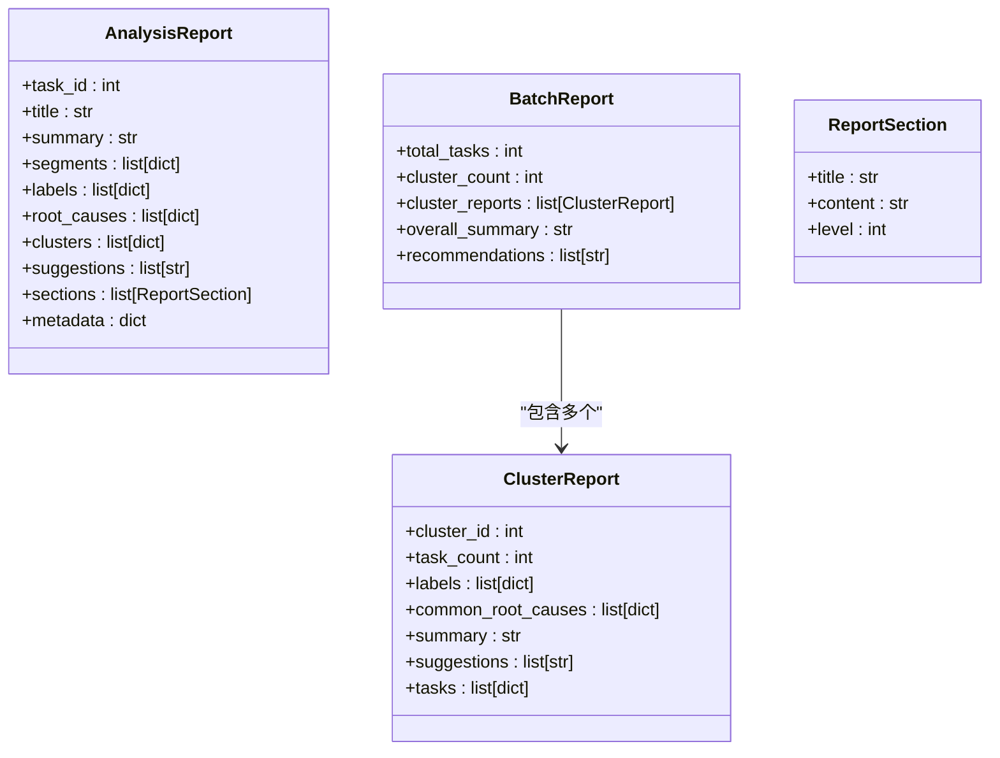
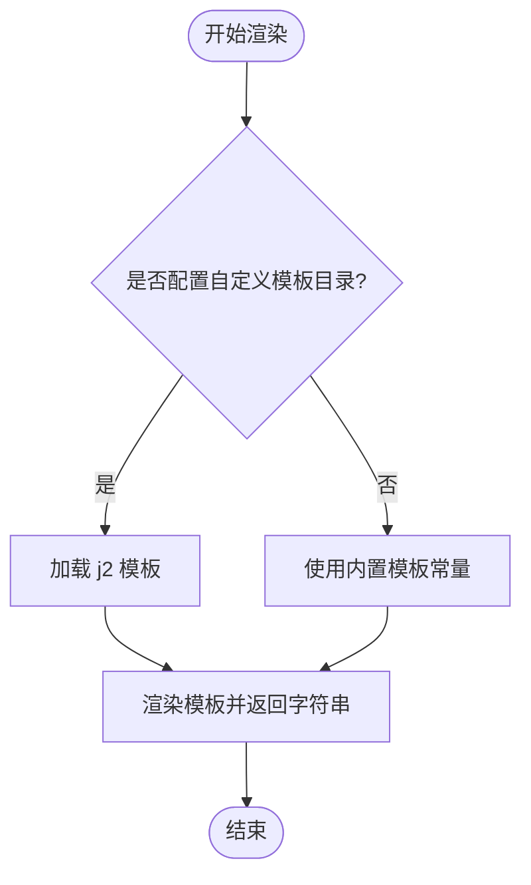
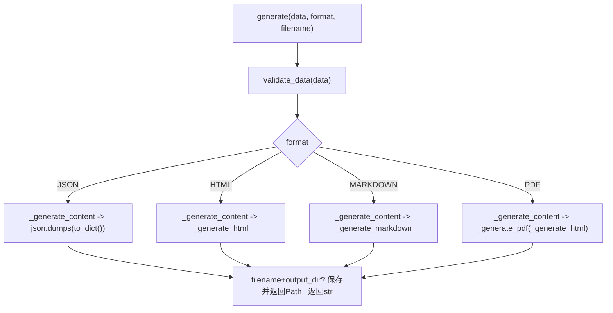
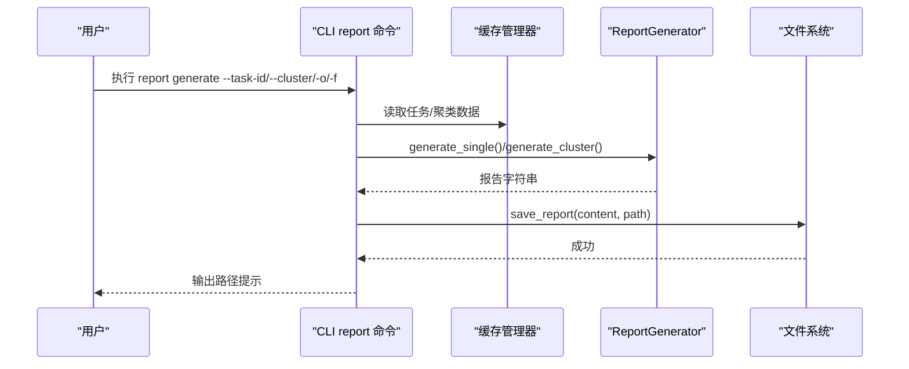
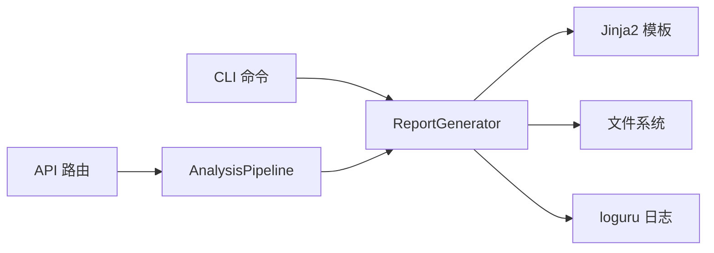

# 报告生成器

<cite>
**本文引用的文件**
- [src/report/generator.py](file://src/report/generator.py)
- [src/report/models.py](file://src/report/models.py)
- [src/report/templates/single.md.j2](file://src/report/templates/single.md.j2)
- [src/report/templates/cluster.md.j2](file://src/report/templates/cluster.md.j2)
- [src/report/templates/batch.md.j2](file://src/report/templates/batch.md.j2)
- [src/report/__init__.py](file://src/report/__init__.py)
- [src/cli/commands/report.py](file://src/cli/commands/report.py)
- [src/api/routes/reports.py](file://src/api/routes/reports.py)
- [src/analyzer/pipeline.py](file://src/analyzer/pipeline.py)
- [tests/report/test_generator.py](file://tests/report/test_generator.py)
- [tests/report/test_generator_enhanced.py](file://tests/report/test_generator_enhanced.py)
</cite>

## 目录
1. [简介](#简介)
2. [项目结构](#项目结构)
3. [核心组件](#核心组件)
4. [架构总览](#架构总览)
5. [详细组件分析](#详细组件分析)
6. [依赖关系分析](#依赖关系分析)
7. [性能与可扩展性](#性能与可扩展性)
8. [故障排查指南](#故障排查指南)
9. [结论](#结论)
10. [附录：模板变量与扩展指南](#附录模板变量与扩展指南)

## 简介
本技术文档围绕 ReportGenerator 报告生成器，系统阐述多格式报告（Markdown、HTML、JSON、PDF）的生成机制与实现细节。重点覆盖：
- 模板渲染与内容组装流程
- 单个任务报告、聚类报告、批量报告的生成逻辑
- 动态内容与格式化策略
- 自定义模板开发与样式定制方法
- 报告文件管理与存储策略
- 数据完整性校验与质量保证
- 新增报告格式与自定义内容模块的扩展方式

## 项目结构
报告相关代码集中在 src/report 目录下，包含生成器、数据模型与 Jinja2 模板；CLI 与 API 层提供调用入口；测试用例覆盖关键路径与边界条件。

图表来源
- [src/report/generator.py:222-248](file://src/report/generator.py#L222-L248)
- [src/report/models.py:1-52](file://src/report/models.py#L1-L52)
- [src/report/templates/single.md.j2:1-58](file://src/report/templates/single.md.j2#L1-L58)
- [src/report/templates/cluster.md.j2:1-36](file://src/report/templates/cluster.md.j2#L1-L36)
- [src/report/templates/batch.md.j2:1-31](file://src/report/templates/batch.md.j2#L1-L31)
- [src/cli/commands/report.py:1-140](file://src/cli/commands/report.py#L1-L140)
- [src/api/routes/reports.py:1-130](file://src/api/routes/reports.py#L1-L130)
- [src/analyzer/pipeline.py:450-468](file://src/analyzer/pipeline.py#L450-L468)
- [tests/report/test_generator.py:1-272](file://tests/report/test_generator.py#L1-L272)
- [tests/report/test_generator_enhanced.py:1-178](file://tests/report/test_generator_enhanced.py#L1-L178)

章节来源
- [src/report/__init__.py:1-29](file://src/report/__init__.py#L1-L29)

## 核心组件
- ReportFormat/ReportType：枚举定义支持的输出格式与报告类型。
- ChartData/TableData/ReportData：通用报告数据结构，用于 HTML/Markdown 等格式的渲染。
- AnalysisReport/ClusterReport/BatchReport：面向业务场景的结构化报告数据模型。
- ReportGenerator：核心生成器，负责模板加载、渲染、保存与校验。

章节来源
- [src/report/generator.py:13-89](file://src/report/generator.py#L13-L89)
- [src/report/models.py:1-52](file://src/report/models.py#L1-L52)

## 架构总览
报告生成器的整体流程如下：
- 输入：任务数据、聚类数据或批量聚合数据
- 处理：根据目标格式选择渲染路径（Markdown/HTML/JSON/PDF），优先尝试外部 Jinja2 模板，失败回退到内置模板
- 输出：返回字符串内容或保存到指定目录的文件路径

图表来源
- [src/report/generator.py:250-303](file://src/report/generator.py#L250-L303)
- [src/report/generator.py:305-344](file://src/report/generator.py#L305-L344)
- [src/report/generator.py:346-393](file://src/report/generator.py#L346-L393)
- [src/report/generator.py:702-706](file://src/report/generator.py#L702-L706)
- [src/report/templates/single.md.j2:1-58](file://src/report/templates/single.md.j2#L1-L58)
- [src/report/templates/cluster.md.j2:1-36](file://src/report/templates/cluster.md.j2#L1-L36)
- [src/report/templates/batch.md.j2:1-31](file://src/report/templates/batch.md.j2#L1-L31)

## 详细组件分析

### 报告生成器类（ReportGenerator）
职责与要点：
- 初始化时可选加载自定义模板目录，构建 Jinja2 Environment
- 提供 generate_single/generate_cluster/generate_batch 三种生成入口
- 统一通过 generate/_generate_content 分发至具体渲染器
- 支持 Markdown/HTML/JSON/PDF 四种格式，其中 PDF 当前以 HTML 作为包装
- 提供 validate_data 进行基础完整性校验
- 提供 save_report 将内容写入磁盘

图表来源
- [src/report/generator.py:222-790](file://src/report/generator.py#L222-L790)
- [src/report/generator.py:32-89](file://src/report/generator.py#L32-L89)

章节来源
- [src/report/generator.py:222-790](file://src/report/generator.py#L222-L790)

### 数据模型（AnalysisReport/ClusterReport/BatchReport）
- AnalysisReport：单任务完整报告数据，包含分段、标签、根因、建议等
- ClusterReport：聚类报告数据，包含聚类ID、任务数、标签、共同根因、摘要与建议
- BatchReport：批量报告数据，包含总体统计、各聚类报告集合、整体建议

图表来源
- [src/report/models.py:1-52](file://src/report/models.py#L1-L52)

章节来源
- [src/report/models.py:1-52](file://src/report/models.py#L1-L52)

### 模板系统与变量替换机制
- 模板位置：src/report/templates/*.j2
- 加载顺序：若提供 template_dir 且存在，则优先从该目录加载同名模板；否则回退到内置默认模板
- 变量映射：
  - 单任务报告：task_id/title/summary/segments/labels/root_causes/suggestions/metadata.generated_at
  - 聚类报告：cluster_id/task_count/labels/common_root_causes/summary/suggestions
  - 批量报告：total_tasks/cluster_count/cluster_reports/recommendations/generated_at
- 内置模板常量：DEFAULT_TEMPLATE/CLUSTER_TEMPLATE/BATCH_TEMPLATE 作为回退渲染源

图表来源
- [src/report/generator.py:232-248](file://src/report/generator.py#L232-L248)
- [src/report/generator.py:250-303](file://src/report/generator.py#L250-L303)
- [src/report/generator.py:305-344](file://src/report/generator.py#L305-L344)
- [src/report/generator.py:346-393](file://src/report/generator.py#L346-L393)
- [src/report/generator.py:707-716](file://src/report/generator.py#L707-L716)
- [src/report/templates/single.md.j2:1-58](file://src/report/templates/single.md.j2#L1-L58)
- [src/report/templates/cluster.md.j2:1-36](file://src/report/templates/cluster.md.j2#L1-L36)
- [src/report/templates/batch.md.j2:1-31](file://src/report/templates/batch.md.j2#L1-L31)

章节来源
- [src/report/generator.py:232-248](file://src/report/generator.py#L232-L248)
- [src/report/generator.py:250-303](file://src/report/generator.py#L250-L303)
- [src/report/generator.py:305-344](file://src/report/generator.py#L305-L344)
- [src/report/generator.py:346-393](file://src/report/generator.py#L346-L393)
- [src/report/generator.py:707-716](file://src/report/generator.py#L707-L716)
- [src/report/templates/single.md.j2:1-58](file://src/report/templates/single.md.j2#L1-L58)
- [src/report/templates/cluster.md.j2:1-36](file://src/report/templates/cluster.md.j2#L1-L36)
- [src/report/templates/batch.md.j2:1-31](file://src/report/templates/batch.md.j2#L1-L31)

### 多格式渲染与内容组装
- Markdown：直接拼接结构化文本，支持标题、列表、表格等
- HTML：内嵌模板字符串，渲染为带样式的页面；PDF 目前复用 HTML 作为包装
- JSON：将 ReportData.to_dict() 序列化为 JSON 字符串
- 统一入口 generate/_generate_content 根据格式分派

图表来源
- [src/report/generator.py:395-447](file://src/report/generator.py#L395-L447)
- [src/report/generator.py:589-673](file://src/report/generator.py#L589-L673)
- [src/report/generator.py:675-700](file://src/report/generator.py#L675-L700)
- [src/report/generator.py:577-587](file://src/report/generator.py#L577-L587)

章节来源
- [src/report/generator.py:395-447](file://src/report/generator.py#L395-L447)
- [src/report/generator.py:589-673](file://src/report/generator.py#L589-L673)
- [src/report/generator.py:675-700](file://src/report/generator.py#L675-L700)
- [src/report/generator.py:577-587](file://src/report/generator.py#L577-L587)

### 调用入口与集成点
- CLI：report 命令支持按任务ID、聚类ID或全量生成报告，默认输出到 ./output/
- API：/reports/{task_id} 接口支持 html/markdown/json 格式，内部通过 AnalysisPipeline 获取结果后返回
- Pipeline：在分析阶段构造建议并调用 ReportGenerator.generate_single

图表来源
- [src/cli/commands/report.py:17-113](file://src/cli/commands/report.py#L17-L113)
- [src/report/generator.py:250-303](file://src/report/generator.py#L250-L303)
- [src/report/generator.py:305-344](file://src/report/generator.py#L305-L344)
- [src/report/generator.py:702-706](file://src/report/generator.py#L702-L706)

章节来源
- [src/cli/commands/report.py:17-113](file://src/cli/commands/report.py#L17-L113)
- [src/api/routes/reports.py:16-105](file://src/api/routes/reports.py#L16-L105)
- [src/analyzer/pipeline.py:450-468](file://src/analyzer/pipeline.py#L450-L468)

## 依赖关系分析
- 模块内聚：ReportGenerator 集中管理渲染与保存逻辑，数据模型独立定义，模板与渲染解耦
- 外部依赖：Jinja2 模板引擎、loguru 日志、标准库 pathlib/datetime/json
- 耦合点：
  - CLI/API 通过函数式接口调用生成器，不感知内部实现细节
  - Pipeline 仅在生成阶段注入建议字段，保持低耦合

图表来源
- [src/cli/commands/report.py:1-140](file://src/cli/commands/report.py#L1-140)
- [src/api/routes/reports.py:1-130](file://src/api/routes/reports.py#L1-L130)
- [src/analyzer/pipeline.py:450-468](file://src/analyzer/pipeline.py#L450-L468)
- [src/report/generator.py:1-10](file://src/report/generator.py#L1-L10)

章节来源
- [src/report/generator.py:1-10](file://src/report/generator.py#L1-L10)
- [src/report/generator.py:222-248](file://src/report/generator.py#L222-L248)

## 性能与可扩展性
- 模板加载：首次创建 Environment 时加载模板，避免重复 IO
- 渲染路径：优先外部模板，失败快速回退内置模板，降低异常成本
- 输出策略：支持内存字符串与文件路径两种返回模式，便于不同场景复用
- 扩展建议：
  - 新增格式：在 ReportFormat 中增加枚举值，并在 _generate_content 中添加分支
  - 新增模板：在自定义模板目录放置同名 .j2 文件，确保变量名一致
  - 新增内容块：在 ReportData/ChartData/TableData 中扩展字段，并在模板中引用

章节来源
- [src/report/generator.py:232-248](file://src/report/generator.py#L232-L248)
- [src/report/generator.py:395-447](file://src/report/generator.py#L395-L447)
- [src/report/generator.py:32-89](file://src/report/generator.py#L32-L89)

## 故障排查指南
常见问题与定位：
- 模板未找到：检查 template_dir 是否存在且包含对应 j2 文件；确认文件名后缀与格式匹配
- 变量缺失：核对模板中使用的变量是否在调用处正确传入
- 输出目录权限：确认 output_dir 可写，必要时自动创建父目录
- 格式不支持：确认 ReportFormat 枚举值与 _generate_content 分支一致

定位参考：
- 模板加载与回退逻辑
- 数据校验错误信息
- 保存文件时的目录创建与写入

章节来源
- [src/report/generator.py:232-248](file://src/report/generator.py#L232-L248)
- [src/report/generator.py:707-716](file://src/report/generator.py#L707-L716)
- [src/report/generator.py:718-737](file://src/report/generator.py#L718-L737)
- [src/report/generator.py:702-706](file://src/report/generator.py#L702-L706)

## 结论
ReportGenerator 提供了稳定、可扩展的报告生成能力，通过 Jinja2 模板与内置模板双轨机制，兼顾灵活性与鲁棒性。其清晰的接口设计与完善的测试覆盖，使得在多格式输出、动态内容渲染与质量保障方面具备良好工程实践价值。

## 附录：模板变量与扩展指南

### 模板变量清单
- 单任务报告（single.md.j2）
  - task_id/title/summary/segments/labels/root_causes/suggestions/metadata.generated_at
- 聚类报告（cluster.md.j2）
  - cluster_id/task_count/labels/common_root_causes/summary/suggestions
- 批量报告（batch.md.j2）
  - total_tasks/cluster_count/cluster_reports/recommendations/generated_at

章节来源
- [src/report/templates/single.md.j2:1-58](file://src/report/templates/single.md.j2#L1-L58)
- [src/report/templates/cluster.md.j2:1-36](file://src/report/templates/cluster.md.j2#L1-L36)
- [src/report/templates/batch.md.j2:1-31](file://src/report/templates/batch.md.j2#L1-L31)

### 自定义模板开发步骤
- 准备模板目录：创建自定义模板目录，放入 single.md.j2/cluster.md.j2/batch.md.j2
- 初始化生成器：传入 template_dir 参数，使生成器优先加载自定义模板
- 变量对齐：确保模板中的变量名与调用处传入的键一致
- 样式定制：在 HTML 模板中调整 CSS，或在 Markdown 模板中使用语法控制呈现

章节来源
- [src/report/generator.py:232-248](file://src/report/generator.py#L232-L248)
- [src/report/generator.py:250-303](file://src/report/generator.py#L250-L303)
- [src/report/generator.py:305-344](file://src/report/generator.py#L305-L344)
- [src/report/generator.py:346-393](file://src/report/generator.py#L346-L393)

### 新增报告格式示例（思路）
- 在 ReportFormat 中新增枚举值（如 XML）
- 在 _generate_content 中增加分支，实现 XML 序列化或转换逻辑
- 在 _get_format_extension 中补充扩展名映射
- 编写单元测试验证新格式的输出与保存行为

章节来源
- [src/report/generator.py:23-30](file://src/report/generator.py#L23-L30)
- [src/report/generator.py:395-447](file://src/report/generator.py#L395-L447)
- [src/report/generator.py:567-575](file://src/report/generator.py#L567-L575)
- [tests/report/test_generator.py:170-186](file://tests/report/test_generator.py#L170-L186)