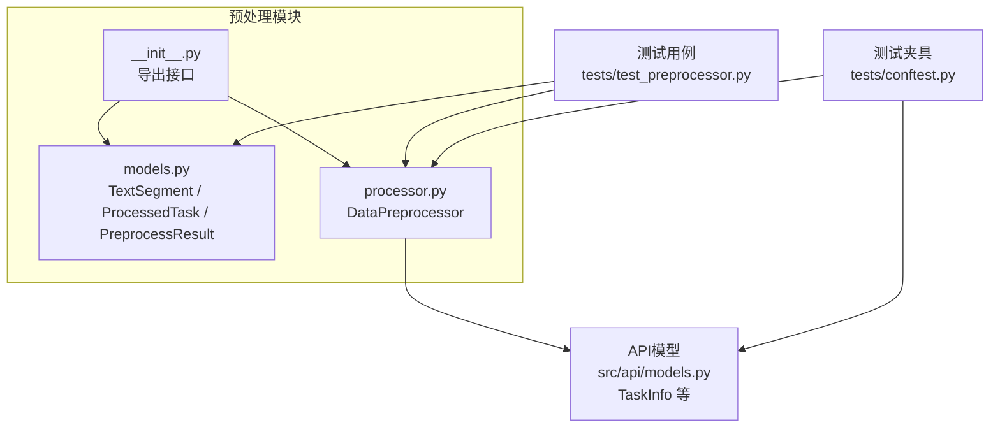
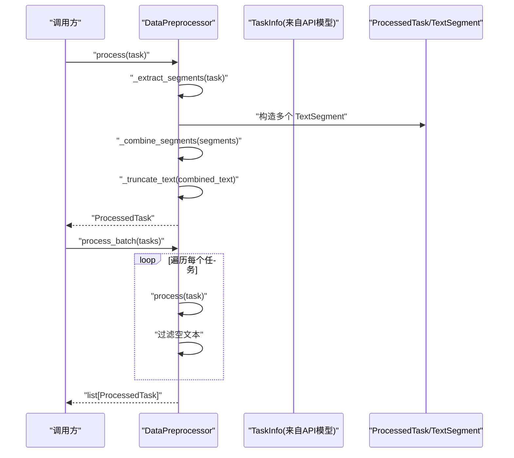
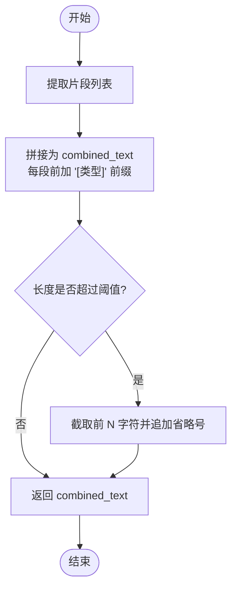
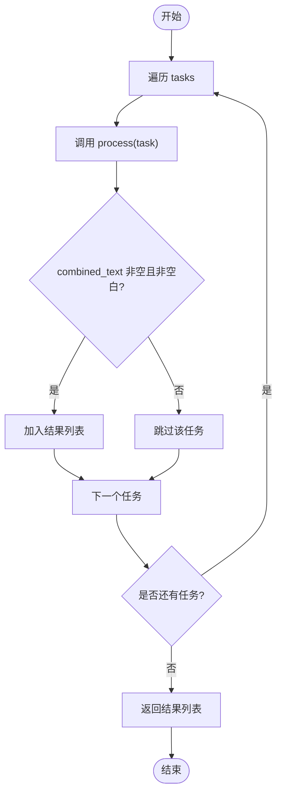
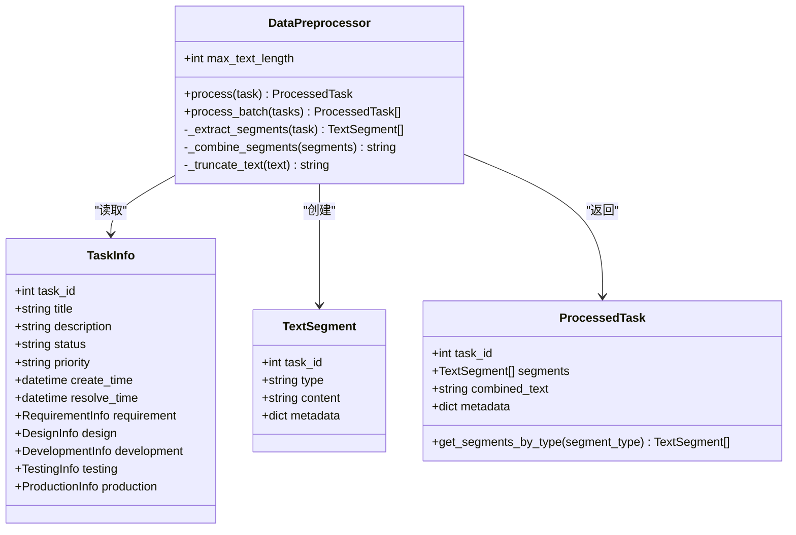

# 数据预处理模块

<cite>
**本文引用的文件**   
- [src/preprocessor/__init__.py](file://src/preprocessor/__init__.py)
- [src/preprocessor/models.py](file://src/preprocessor/models.py)
- [src/preprocessor/processor.py](file://src/preprocessor/processor.py)
- [src/api/models.py](file://src/api/models.py)
- [tests/test_preprocessor.py](file://tests/test_preprocessor.py)
- [tests/conftest.py](file://tests/conftest.py)
- [config/config.yaml.example](file://config/config.yaml.example)
</cite>

## 目录
1. [简介](#简介)
2. [项目结构](#项目结构)
3. [核心组件](#核心组件)
4. [架构总览](#架构总览)
5. [详细组件分析](#详细组件分析)
6. [依赖关系分析](#依赖关系分析)
7. [性能考虑](#性能考虑)
8. [故障排查指南](#故障排查指南)
9. [结论](#结论)
10. [附录](#附录)

## 简介
本技术文档聚焦于 DataPreprocessor 数据预处理模块，面向故障单数据的清洗、格式化与标准化。该模块负责从结构化任务对象中提取多源文本片段（如标题、描述、需求、设计、提交记录、代码评审、测试用例、缺陷、生产日志与堆栈等），将其合并为统一格式的 combined_text，并按类型进行分段管理，输出 ProcessedTask 模型供后续嵌入、聚类与分析使用。

## 项目结构
预处理模块位于 src/preprocessor 下，包含：
- 模型定义：TextSegment、ProcessedTask、PreprocessResult
- 处理器实现：DataPreprocessor（提取、合并、截断、批量处理）
- 对外导出：__init__.py 暴露主要类

图表来源
- [src/preprocessor/__init__.py:1-12](file://src/preprocessor/__init__.py#L1-L12)
- [src/preprocessor/models.py:1-29](file://src/preprocessor/models.py#L1-L29)
- [src/preprocessor/processor.py:1-200](file://src/preprocessor/processor.py#L1-L200)
- [src/api/models.py:1-91](file://src/api/models.py#L1-L91)
- [tests/test_preprocessor.py:1-244](file://tests/test_preprocessor.py#L1-L244)
- [tests/conftest.py:1-80](file://tests/conftest.py#L1-L80)

章节来源
- [src/preprocessor/__init__.py:1-12](file://src/preprocessor/__init__.py#L1-L12)
- [src/preprocessor/models.py:1-29](file://src/preprocessor/models.py#L1-L29)
- [src/preprocessor/processor.py:1-200](file://src/preprocessor/processor.py#L1-L200)
- [src/api/models.py:1-91](file://src/api/models.py#L1-L91)
- [tests/test_preprocessor.py:1-244](file://tests/test_preprocessor.py#L1-L244)
- [tests/conftest.py:1-80](file://tests/conftest.py#L1-L80)

## 核心组件
- TextSegment：表示一个文本片段，包含任务ID、类型、内容与元数据。
- ProcessedTask：表示经过预处理的完整任务，包含片段列表、合并后的文本与元数据，并提供按类型筛选片段的方法。
- PreprocessResult：用于批量处理结果汇总，包括成功/失败计数与错误信息。
- DataPreprocessor：核心处理器，提供 process 与 process_batch 方法，完成片段提取、合并、截断与过滤。

章节来源
- [src/preprocessor/models.py:1-29](file://src/preprocessor/models.py#L1-L29)
- [src/preprocessor/processor.py:1-200](file://src/preprocessor/processor.py#L1-L200)

## 架构总览
预处理流程将 TaskInfo 输入转换为 ProcessedTask 输出，关键步骤如下：
- 片段提取：根据 TaskInfo 的各字段生成不同类别的 TextSegment。
- 片段合并：以“[类型]”为前缀拼接各片段内容，形成 combined_text。
- 文本截断：依据 max_text_length 限制长度，避免下游模型上下文溢出。
- 批量处理：对任务列表逐一处理并过滤空文本，返回有效结果。

图表来源
- [src/preprocessor/processor.py:9-24](file://src/preprocessor/processor.py#L9-L24)
- [src/preprocessor/processor.py:193-199](file://src/preprocessor/processor.py#L193-L199)
- [src/api/models.py:69-83](file://src/api/models.py#L69-L83)
- [src/preprocessor/models.py:13-21](file://src/preprocessor/models.py#L13-L21)

## 详细组件分析

### 数据模型与分段策略
- TextSegment
  - 字段：task_id、type、content、metadata
  - type 分类标准（由提取逻辑决定）：
    - title：任务标题
    - description：任务描述
    - requirement：需求描述
    - design：设计文档
    - commit：提交记录（含变更文件列表）
    - code_review：代码评审（含评审意见与是否通过）
    - test_case：测试用例
    - defect：缺陷记录
    - symptom：故障现象
    - log：生产日志
    - stack_trace：堆栈信息
    - resolution：解决方案
    - production：兜底占位（当存在生产信息但无具体片段时）
- ProcessedTask
  - 字段：task_id、segments、combined_text、metadata
  - 辅助方法：get_segments_by_type(segment_type) 可按类型筛选片段
- PreprocessResult
  - 字段：tasks、total_count、success_count、error_count、errors
  - 用途：聚合批量处理统计与错误信息（当前处理器未直接使用该模型，但可作为扩展点）

章节来源
- [src/preprocessor/models.py:6-29](file://src/preprocessor/models.py#L6-L29)
- [src/preprocessor/processor.py:26-178](file://src/preprocessor/processor.py#L26-L178)

### combined_text 生成逻辑
- 生成规则：
  - 遍历 segments，为每个片段添加“[类型]”前缀，后接内容
  - 使用双换行分隔各片段，保证可读性与可解析性
- 截断策略：
  - 若 combined_text 超过 max_text_length，则截取前 N 个字符并追加省略号
- 目的：
  - 统一格式，便于下游嵌入与检索
  - 控制长度，避免超出模型上下文窗口

图表来源
- [src/preprocessor/processor.py:180-191](file://src/preprocessor/processor.py#L180-L191)

### 批量处理方法 process_batch 的实现细节
- 行为：
  - 遍历 tasks，逐个调用 process
  - 过滤掉 combined_text 为空或仅空白字符的结果
  - 返回有效的 ProcessedTask 列表
- 适用场景：
  - 大批量任务预处理，减少 I/O 与网络开销
  - 在内存允许范围内进行顺序处理，避免并发复杂性

图表来源
- [src/preprocessor/processor.py:193-199](file://src/preprocessor/processor.py#L193-L199)

章节来源
- [src/preprocessor/processor.py:193-199](file://src/preprocessor/processor.py#L193-L199)

### 配置选项与自定义处理规则开发指南
- 现有配置项（示例配置文件）：
  - api、llm、embedding、clustering、cache、rules、output、logging
  - 这些配置主要用于系统其他模块（如 LLM、嵌入、聚类、缓存、规则引擎等）
- 预处理相关配置建议：
  - max_text_length：可在 DataPreprocessor 初始化时传入，控制 combined_text 的最大长度
  - 未来可扩展：
    - 片段权重与排序策略
    - 片段去重与噪声过滤规则
    - 自定义片段类型与提取逻辑
- 自定义处理规则开发指南：
  - 继承或组合 DataPreprocessor，重写 _extract_segments 以支持新字段或新来源
  - 新增片段类型需在 type 分类中明确语义，并在 get_segments_by_type 中保持一致
  - 如需持久化配置，可将 max_text_length 与规则路径写入 config.yaml，并在应用启动时加载

章节来源
- [config/config.yaml.example:1-38](file://config/config.yaml.example#L1-L38)
- [src/preprocessor/processor.py:6-8](file://src/preprocessor/processor.py#L6-L8)

### 数据处理示例与异常场景
以下为基于测试用例的典型用法与边界情况（不展示源码，仅提供路径参考）：
- 基本处理：
  - 使用 sample_task 构建 TaskInfo，调用 preprocessor.process(sample_task)，验证生成的片段数量与 combined_text 包含关键字
  - 参考：[tests/test_preprocessor.py:16-28](file://tests/test_preprocessor.py#L16-L28)
- 片段提取验证：
  - 检查 title、description、commit、production 等片段的类型与内容
  - 参考：[tests/test_preprocessor.py:23-52](file://tests/test_preprocessor.py#L23-L52)
- 空任务处理：
  - 当 title 与 description 均为空时，仍应返回 ProcessedTask，但 combined_text 可能为空
  - 参考：[tests/test_preprocessor.py:62-75](file://tests/test_preprocessor.py#L62-L75)
- 元数据校验：
  - 确保每个 TextSegment 的 task_id、type、content 均正确填充
  - 参考：[tests/test_preprocessor.py:76-83](file://tests/test_preprocessor.py#L76-L83)
- 批量处理与过滤：
  - 批量处理时应过滤空文本；重复任务应得到相同数量的结果
  - 参考：[tests/test_preprocessor.py:136-150](file://tests/test_preprocessor.py#L136-L150)
- 文本截断：
  - 设置较小的 max_text_length，验证 combined_text 长度不超过阈值
  - 参考：[tests/test_preprocessor.py:152-156](file://tests/test_preprocessor.py#L152-L156)
- 需求与设计片段：
  - 当 TaskInfo 包含 RequirementInfo 与 DesignInfo 时，应生成对应类型的片段
  - 参考：[tests/test_preprocessor.py:157-185](file://tests/test_preprocessor.py#L157-L185)
- 测试与缺陷片段：
  - TestingInfo 中的 test_cases 与 defects 应分别生成 test_case 与 defect 片段
  - 参考：[tests/test_preprocessor.py:187-201](file://tests/test_preprocessor.py#L187-L201)
- 代码评审片段：
  - DevelopmentInfo.code_reviews 应生成 code_review 片段
  - 参考：[tests/test_preprocessor.py:203-224](file://tests/test_preprocessor.py#L203-L224)
- 生产信息兜底：
  - 当存在 ProductionInfo 但症状、日志、堆栈、解决方案均为空时，应生成 production 占位片段
  - 参考：[tests/test_preprocessor.py:226-243](file://tests/test_preprocessor.py#L226-L243)

章节来源
- [tests/test_preprocessor.py:16-243](file://tests/test_preprocessor.py#L16-L243)
- [tests/conftest.py:22-49](file://tests/conftest.py#L22-L49)

## 依赖关系分析
- DataPreprocessor 依赖 API 层的 TaskInfo 及其子模型（RequirementInfo、DesignInfo、DevelopmentInfo、TestingInfo、ProductionInfo 等）
- 测试模块依赖 DataPreprocessor 与 TaskInfo，用于构造样本数据与断言处理结果
- 配置示例文件用于系统级配置，预处理模块可通过初始化参数接收相关阈值

图表来源
- [src/api/models.py:69-83](file://src/api/models.py#L69-L83)
- [src/preprocessor/models.py:6-21](file://src/preprocessor/models.py#L6-L21)
- [src/preprocessor/processor.py:5-24](file://src/preprocessor/processor.py#L5-L24)

章节来源
- [src/api/models.py:1-91](file://src/api/models.py#L1-L91)
- [src/preprocessor/models.py:1-29](file://src/preprocessor/models.py#L1-L29)
- [src/preprocessor/processor.py:1-200](file://src/preprocessor/processor.py#L1-L200)

## 性能考虑
- 时间复杂度：
  - process：O(N)，N 为片段数量（取决于 TaskInfo 字段规模）
  - process_batch：O(M*N)，M 为任务数量
- 空间复杂度：
  - 主要为 combined_text 与 segments 列表的内存占用
- 优化建议：
  - 合理设置 max_text_length，避免过长文本导致下游模型处理缓慢
  - 对于超大数据集，可考虑分块处理与流式写入磁盘
  - 若需并发，可在外层引入线程池或进程池，注意共享状态与资源竞争

## 故障排查指南
- 常见问题：
  - combined_text 为空：检查 TaskInfo 的 title/description 是否为空；确认 process_batch 的空文本过滤逻辑
  - 片段缺失：核对 TaskInfo 的子模型字段是否填充（如 requirement.description、design.design_document、development.commits/code_reviews、testing.test_cases/defects、production.symptoms/logs/stack_traces/resolution）
  - 文本超长：调整 max_text_length 或在外部进行更精细的分段策略
- 定位方法：
  - 打印 segments 的类型与内容，确认提取逻辑是否符合预期
  - 使用单元测试覆盖边界条件（空任务、空生产信息等）

章节来源
- [tests/test_preprocessor.py:62-75](file://tests/test_preprocessor.py#L62-L75)
- [tests/test_preprocessor.py:226-243](file://tests/test_preprocessor.py#L226-L243)
- [src/preprocessor/processor.py:193-199](file://src/preprocessor/processor.py#L193-L199)

## 结论
DataPreprocessor 提供了稳定、可扩展的数据预处理能力，能够将多源异构的故障单数据标准化为统一的 ProcessedTask 结构，并通过 combined_text 与 segments 的组合满足下游嵌入与聚类的需要。通过合理的配置与自定义扩展，可以适配更多业务场景与数据来源。

## 附录
- 配置示例文件路径：[config/config.yaml.example](file://config/config.yaml.example)
- 测试夹具与样例数据：[tests/conftest.py](file://tests/conftest.py)
- 测试用例集合：[tests/test_preprocessor.py](file://tests/test_preprocessor.py)
