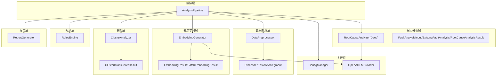
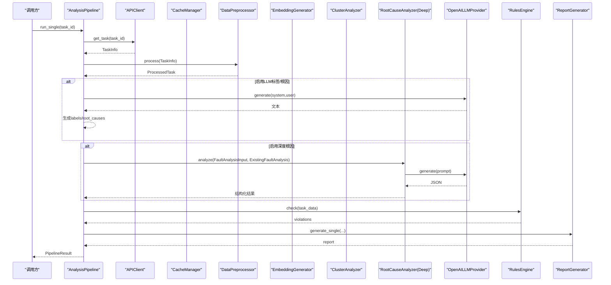
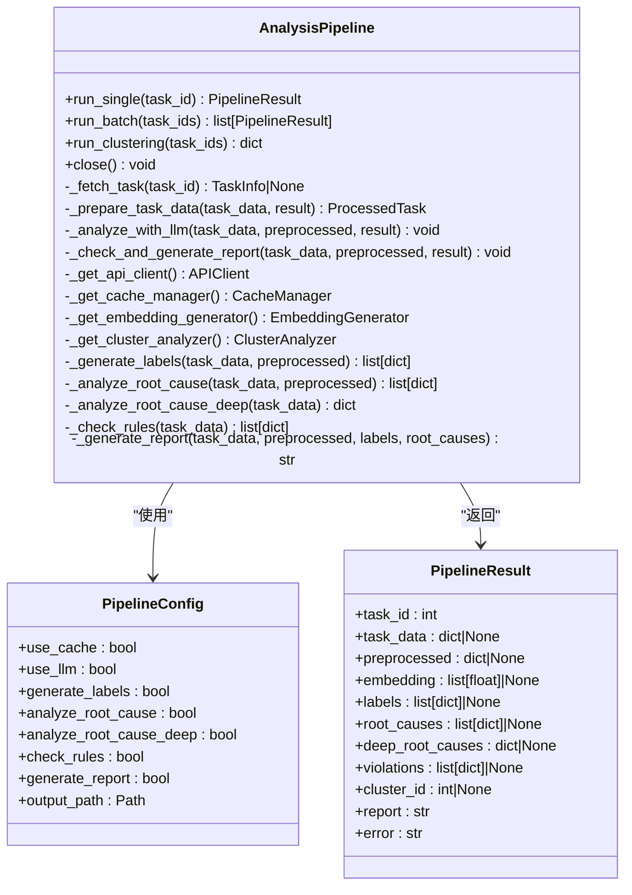
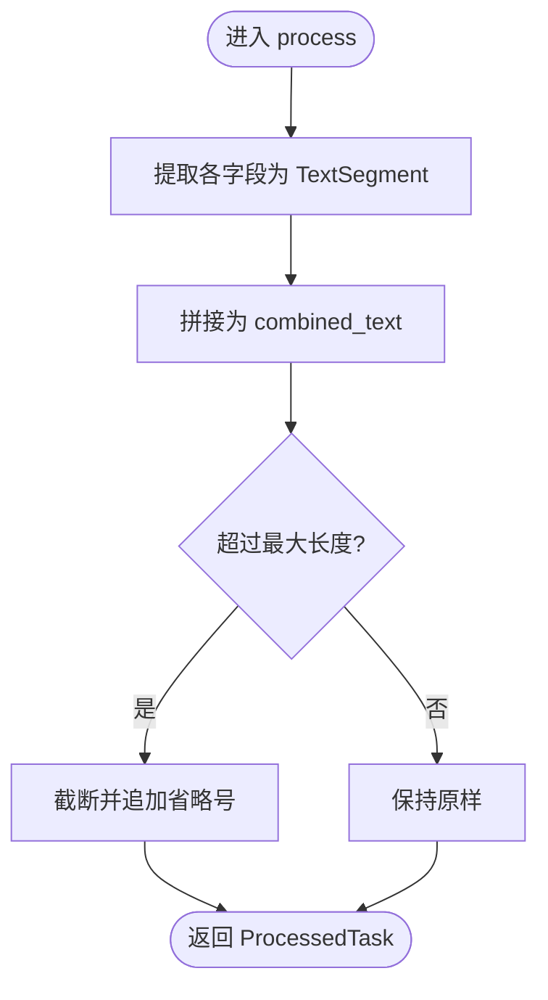
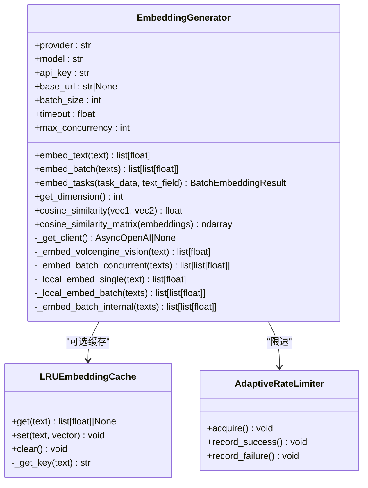
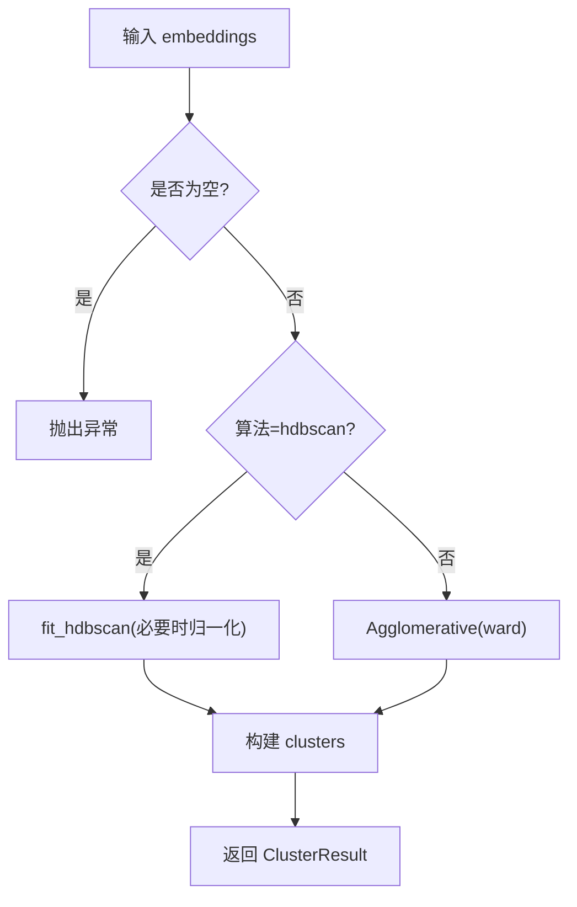
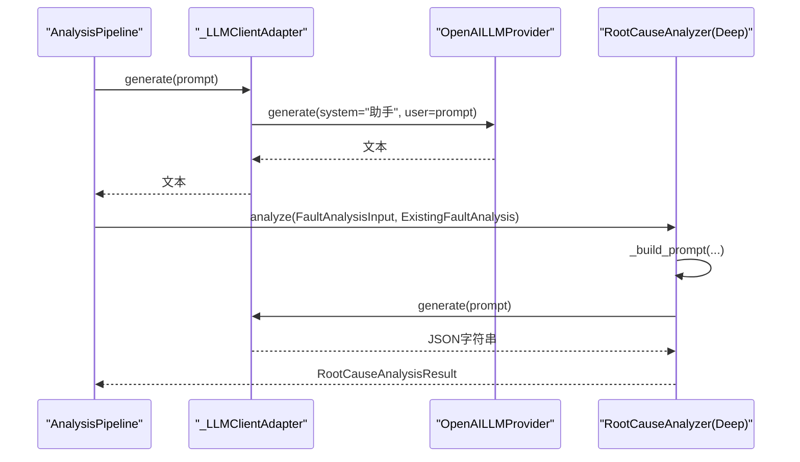
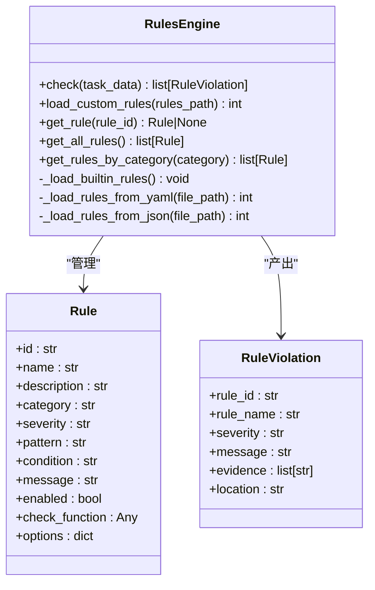
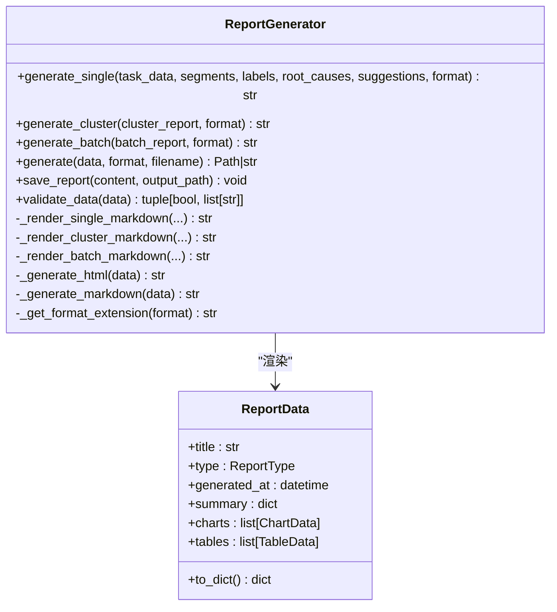
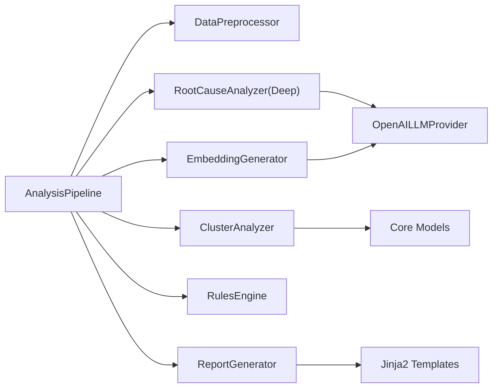

# 核心组件

<cite>
**本文引用的文件**   
- [src/analyzer/pipeline.py](file://src/analyzer/pipeline.py)
- [src/preprocessor/processor.py](file://src/preprocessor/processor.py)
- [src/preprocessor/models.py](file://src/preprocessor/models.py)
- [src/embedding/generator.py](file://src/embedding/generator.py)
- [src/embedding/models.py](file://src/embedding/models.py)
- [src/clustering/analyzer.py](file://src/clustering/analyzer.py)
- [src/clustering/models.py](file://src/clustering/models.py)
- [src/core/models.py](file://src/core/models.py)
- [src/analysis/root_cause/analyzer.py](file://src/analysis/root_cause/analyzer.py)
- [src/analysis/root_cause/models.py](file://src/analysis/root_cause/models.py)
- [src/rules/engine.py](file://src/rules/engine.py)
- [src/report/generator.py](file://src/report/generator.py)
- [src/analyzer/llm_provider.py](file://src/analyzer/llm_provider.py)
- [src/config/manager.py](file://src/config/manager.py)
</cite>

## 目录
1. [引言](#引言)
2. [项目结构](#项目结构)
3. [核心组件](#核心组件)
4. [架构总览](#架构总览)
5. [详细组件分析](#详细组件分析)
6. [依赖关系分析](#依赖关系分析)
7. [性能考量](#性能考量)
8. [故障排查指南](#故障排查指南)
9. [结论](#结论)
10. [附录](#附录)

## 引言
本文件面向Bug聚类分析系统的核心组件，聚焦于AnalysisPipeline编排器的设计与实现，并系统阐述数据预处理、嵌入生成、聚类分析、根因分析、规则引擎与报告生成等关键模块的职责、接口、依赖关系与数据流向。文档同时覆盖异步调用模式、错误处理机制、初始化配置示例与最佳实践、扩展点与自定义组件开发指南，以及组件生命周期管理与资源清理策略。

## 项目结构
系统采用分层与模块化组织方式：
- 编排层：AnalysisPipeline负责端到端流程编排与并发控制
- 数据处理层：DataPreprocessor将原始任务数据标准化为片段化文本
- 表示学习层：EmbeddingGenerator提供多提供商的向量化能力（含缓存、熔断、自适应限流）
- 聚类层：ClusterAnalyzer基于HDBSCAN或Agglomerative进行聚类
- 根因分析层：RootCauseAnalyzer结合LLM进行深度五层根因分析
- 规则层：RulesEngine执行内置与自定义规则检查
- 报告层：ReportGenerator输出Markdown/HTML/JSON等多格式报告
- 支撑层：ConfigManager统一配置加载与环境变量覆盖；LLMProvider抽象外部大模型调用

图表来源
- [src/analyzer/pipeline.py:66-122](file://src/analyzer/pipeline.py#L66-L122)
- [src/preprocessor/processor.py:5-24](file://src/preprocessor/processor.py#L5-L24)
- [src/embedding/generator.py:91-135](file://src/embedding/generator.py#L91-L135)
- [src/clustering/analyzer.py:8-46](file://src/clustering/analyzer.py#L8-L46)
- [src/analysis/root_cause/analyzer.py:44-116](file://src/analysis/root_cause/analyzer.py#L44-L116)
- [src/rules/engine.py:217-352](file://src/rules/engine.py#L217-L352)
- [src/report/generator.py:222-303](file://src/report/generator.py#L222-L303)
- [src/config/manager.py:42-100](file://src/config/manager.py#L42-L100)
- [src/analyzer/llm_provider.py:4-52](file://src/analyzer/llm_provider.py#L4-L52)

章节来源
- [src/analyzer/pipeline.py:66-122](file://src/analyzer/pipeline.py#L66-L122)
- [src/config/manager.py:42-100](file://src/config/manager.py#L42-L100)

## 核心组件
本节概述各核心组件职责与对外接口，便于快速理解系统分工。

- AnalysisPipeline编排器
  - 职责：协调数据获取、预处理、标签/根因分析、规则检查、报告生成与批量/聚类分析；管理异步资源与错误传播
  - 关键方法：run_single、run_batch、run_clustering、close
- DataPreprocessor数据预处理
  - 职责：从任务对象提取标题、描述、需求、设计、提交、评审、测试、生产日志等片段，合并为统一文本并截断
  - 关键方法：process、process_batch
- EmbeddingGenerator嵌入生成
  - 职责：对接多种向量模型（OpenAI/Zhipu/Volcengine/本地），支持LRU缓存、熔断器、自适应限流与并发控制
  - 关键方法：embed_text、embed_batch、embed_tasks、get_dimension
- ClusterAnalyzer聚类分析
  - 职责：基于HDBSCAN或Agglomerative对嵌入向量进行聚类，计算中心与噪声点统计
  - 关键方法：fit_predict
- RootCauseAnalyzer根因分析（深度）
  - 职责：构造Prompt，调用LLM进行五层根因分析与改进建议生成，解析结构化结果
  - 关键方法：analyze、analyze_to_dict
- RulesEngine规则引擎
  - 职责：加载内置/自定义规则，基于正则与条件对任务数据进行违规检测
  - 关键方法：check、load_custom_rules、get_all_rules
- ReportGenerator报告生成
  - 职责：根据模板渲染单条/聚类/批量报告，支持Markdown/HTML/JSON/PDF（HTML包装）
  - 关键方法：generate_single、generate_cluster、generate_batch、generate

章节来源
- [src/analyzer/pipeline.py:66-122](file://src/analyzer/pipeline.py#L66-L122)
- [src/preprocessor/processor.py:5-24](file://src/preprocessor/processor.py#L5-L24)
- [src/embedding/generator.py:91-135](file://src/embedding/generator.py#L91-L135)
- [src/clustering/analyzer.py:8-46](file://src/clustering/analyzer.py#L8-L46)
- [src/analysis/root_cause/analyzer.py:44-116](file://src/analysis/root_cause/analyzer.py#L44-L116)
- [src/rules/engine.py:217-352](file://src/rules/engine.py#L217-L352)
- [src/report/generator.py:222-303](file://src/report/generator.py#L222-L303)

## 架构总览
下图展示AnalysisPipeline如何串联各组件完成端到端分析，包括异步并发与可选分支。

图表来源
- [src/analyzer/pipeline.py:105-170](file://src/analyzer/pipeline.py#L105-L170)
- [src/analyzer/llm_provider.py:38-52](file://src/analyzer/llm_provider.py#L38-L52)
- [src/analysis/root_cause/analyzer.py:79-116](file://src/analysis/root_cause/analyzer.py#L79-L116)
- [src/rules/engine.py:324-352](file://src/rules/engine.py#L324-L352)
- [src/report/generator.py:250-303](file://src/report/generator.py#L250-L303)

## 详细组件分析

### AnalysisPipeline编排器
- 设计要点
  - 通过PipelineConfig开关控制是否启用缓存、LLM标签、根因分析、深度根因、规则检查与报告生成
  - 使用async上下文管理器确保资源关闭（如APIClient）
  - run_batch通过asyncio.gather并发执行多个run_single
  - run_clustering内部顺序：拉取任务→预处理→批量嵌入→聚类→组装结果
- 数据流
  - TaskInfo → 预处理 → ProcessedTask → 可选LLM分析 → 规则检查 → 报告生成
- 错误处理
  - run_single捕获异常并写入result.error，保证批处理不中断
- 资源管理
  - __aenter__/__aexit__/close确保外部客户端释放

图表来源
- [src/analyzer/pipeline.py:35-64](file://src/analyzer/pipeline.py#L35-L64)
- [src/analyzer/pipeline.py:66-122](file://src/analyzer/pipeline.py#L66-L122)
- [src/analyzer/pipeline.py:171-226](file://src/analyzer/pipeline.py#L171-L226)
- [src/analyzer/pipeline.py:228-291](file://src/analyzer/pipeline.py#L228-L291)
- [src/analyzer/pipeline.py:293-467](file://src/analyzer/pipeline.py#L293-L467)

章节来源
- [src/analyzer/pipeline.py:66-122](file://src/analyzer/pipeline.py#L66-L122)
- [src/analyzer/pipeline.py:171-226](file://src/analyzer/pipeline.py#L171-L226)
- [src/analyzer/pipeline.py:228-291](file://src/analyzer/pipeline.py#L228-L291)
- [src/analyzer/pipeline.py:293-467](file://src/analyzer/pipeline.py#L293-L467)

### DataPreprocessor数据预处理
- 职责与流程
  - 从TaskInfo中提取多源片段（标题、描述、需求、设计、提交、评审、测试用例/缺陷、生产症状/日志/堆栈/解决方案）
  - 按类型拼接为统一文本，并进行长度截断
  - 提供process_batch用于批量过滤空内容
- 数据结构
  - TextSegment：包含type/content/metadata
  - ProcessedTask：包含segments/combined_text/metadata

图表来源
- [src/preprocessor/processor.py:9-24](file://src/preprocessor/processor.py#L9-L24)
- [src/preprocessor/processor.py:26-178](file://src/preprocessor/processor.py#L26-L178)
- [src/preprocessor/processor.py:180-191](file://src/preprocessor/processor.py#L180-L191)
- [src/preprocessor/processor.py:193-199](file://src/preprocessor/processor.py#L193-L199)
- [src/preprocessor/models.py:6-21](file://src/preprocessor/models.py#L6-L21)

章节来源
- [src/preprocessor/processor.py:9-24](file://src/preprocessor/processor.py#L9-L24)
- [src/preprocessor/processor.py:26-178](file://src/preprocessor/processor.py#L26-L178)
- [src/preprocessor/processor.py:180-191](file://src/preprocessor/processor.py#L180-L191)
- [src/preprocessor/processor.py:193-199](file://src/preprocessor/processor.py#L193-L199)
- [src/preprocessor/models.py:6-21](file://src/preprocessor/models.py#L6-L21)

### EmbeddingGenerator嵌入生成
- 关键特性
  - 多提供商适配（OpenAI/Zhipu/Volcengine/本地）
  - LRU缓存（按文本哈希键+TTL）
  - 熔断器（失败阈值与重置超时）
  - 自适应速率限制器（成功加速、失败退避）
  - 并发控制（信号量）与分批处理
- 算法与复杂度
  - embed_batch内部按batch_size分片并发调用，时间复杂度近似O(N/batch_size * T_call)，空间复杂度O(N*dim)
  - cosine_similarity_matrix利用归一化矩阵乘法，时间复杂度O(N^2*dim)
- 错误处理
  - 客户端初始化错误不记录为熔断失败
  - 网络异常触发熔断计数与限流回退

图表来源
- [src/embedding/generator.py:91-135](file://src/embedding/generator.py#L91-L135)
- [src/embedding/generator.py:162-216](file://src/embedding/generator.py#L162-L216)
- [src/embedding/generator.py:245-310](file://src/embedding/generator.py#L245-L310)
- [src/embedding/generator.py:312-378](file://src/embedding/generator.py#L312-L378)
- [src/embedding/generator.py:380-408](file://src/embedding/generator.py#L380-L408)
- [src/embedding/generator.py:410-426](file://src/embedding/generator.py#L410-L426)
- [src/embedding/generator.py:13-52](file://src/embedding/generator.py#L13-L52)
- [src/embedding/generator.py:54-89](file://src/embedding/generator.py#L54-L89)
- [src/embedding/models.py:7-23](file://src/embedding/models.py#L7-L23)

章节来源
- [src/embedding/generator.py:91-135](file://src/embedding/generator.py#L91-L135)
- [src/embedding/generator.py:162-216](file://src/embedding/generator.py#L162-L216)
- [src/embedding/generator.py:245-310](file://src/embedding/generator.py#L245-L310)
- [src/embedding/generator.py:312-378](file://src/embedding/generator.py#L312-L378)
- [src/embedding/generator.py:380-408](file://src/embedding/generator.py#L380-L408)
- [src/embedding/generator.py:410-426](file://src/embedding/generator.py#L410-L426)
- [src/embedding/models.py:7-23](file://src/embedding/models.py#L7-L23)

### ClusterAnalyzer聚类分析
- 算法选择
  - HDBSCAN优先，若缺失则回退至Agglomerative（ward连接）
  - 余弦距离通过L2归一化后等价欧氏距离，提升效率
- 输出
  - ClusterResult包含labels/n_clusters/n_noise/clusters
  - ClusterInfo包含cluster_id/size/centroid/member_indices

图表来源
- [src/clustering/analyzer.py:22-46](file://src/clustering/analyzer.py#L22-L46)
- [src/clustering/analyzer.py:48-95](file://src/clustering/analyzer.py#L48-L95)
- [src/clustering/analyzer.py:97-121](file://src/clustering/analyzer.py#L97-L121)
- [src/core/models.py:91-116](file://src/core/models.py#L91-L116)
- [src/core/models.py:210-229](file://src/core/models.py#L210-L229)

章节来源
- [src/clustering/analyzer.py:22-46](file://src/clustering/analyzer.py#L22-L46)
- [src/clustering/analyzer.py:48-95](file://src/clustering/analyzer.py#L48-L95)
- [src/clustering/analyzer.py:97-121](file://src/clustering/analyzer.py#L97-L121)
- [src/core/models.py:91-116](file://src/core/models.py#L91-L116)
- [src/core/models.py:210-229](file://src/core/models.py#L210-L229)

### RootCauseAnalyzer根因分析（深度）
- 工作流
  - 构造FaultAnalysisInput与ExistingFaultAnalysis
  - 调用LLM生成JSON，转换为结构化RootCauseAnalysisResult
- 适配
  - 通过_LLMClientAdapter将system/user双提示转为单prompt接口

图表来源
- [src/analyzer/pipeline.py:369-426](file://src/analyzer/pipeline.py#L369-L426)
- [src/analyzer/pipeline.py:24-32](file://src/analyzer/pipeline.py#L24-L32)
- [src/analysis/root_cause/analyzer.py:56-116](file://src/analysis/root_cause/analyzer.py#L56-L116)
- [src/analyzer/llm_provider.py:38-52](file://src/analyzer/llm_provider.py#L38-L52)

章节来源
- [src/analyzer/pipeline.py:369-426](file://src/analyzer/pipeline.py#L369-L426)
- [src/analysis/root_cause/analyzer.py:56-116](file://src/analysis/root_cause/analyzer.py#L56-L116)
- [src/analyzer/llm_provider.py:38-52](file://src/analyzer/llm_provider.py#L38-L52)

### RulesEngine规则引擎
- 功能
  - 内置规则集合（安全/代码/性能等）
  - 支持从YAML/JSON加载自定义规则
  - 基于正则匹配与条件表达式进行违规检测
- 兼容性
  - 提供RuleEngine旧API兼容层，便于测试与历史集成

图表来源
- [src/rules/models.py:5-51](file://src/rules/models.py#L5-L51)
- [src/rules/engine.py:217-352](file://src/rules/engine.py#L217-L352)
- [src/rules/engine.py:73-137](file://src/rules/engine.py#L73-L137)

章节来源
- [src/rules/models.py:5-51](file://src/rules/models.py#L5-L51)
- [src/rules/engine.py:217-352](file://src/rules/engine.py#L217-L352)
- [src/rules/engine.py:73-137](file://src/rules/engine.py#L73-L137)

### ReportGenerator报告生成
- 能力
  - 单条/聚类/批量报告生成
  - 模板渲染（Jinja2），支持自定义模板目录
  - 输出Markdown/HTML/JSON/PDF（HTML包装）
- 数据模型
  - ReportData/ChartData/TableData用于结构化报告数据

图表来源
- [src/report/generator.py:222-303](file://src/report/generator.py#L222-L303)
- [src/report/generator.py:305-393](file://src/report/generator.py#L305-L393)
- [src/report/generator.py:395-447](file://src/report/generator.py#L395-L447)
- [src/report/generator.py:449-553](file://src/report/generator.py#L449-L553)
- [src/report/generator.py:577-673](file://src/report/generator.py#L577-L673)
- [src/report/generator.py:675-700](file://src/report/generator.py#L675-L700)
- [src/report/generator.py:702-790](file://src/report/generator.py#L702-L790)

章节来源
- [src/report/generator.py:222-303](file://src/report/generator.py#L222-L303)
- [src/report/generator.py:305-393](file://src/report/generator.py#L305-L393)
- [src/report/generator.py:395-447](file://src/report/generator.py#L395-L447)
- [src/report/generator.py:449-553](file://src/report/generator.py#L449-L553)
- [src/report/generator.py:577-673](file://src/report/generator.py#L577-L673)
- [src/report/generator.py:675-700](file://src/report/generator.py#L675-L700)
- [src/report/generator.py:702-790](file://src/report/generator.py#L702-L790)

## 依赖关系分析
- 组件耦合
  - AnalysisPipeline作为编排者，强依赖其他组件但通过懒加载与配置解耦
  - EmbeddingGenerator与RootCauseAnalyzer均依赖LLMProvider
  - ClusterAnalyzer仅依赖数值库与核心模型
  - RulesEngine自包含规则定义与加载逻辑
  - ReportGenerator依赖模板系统与Pydantic数据类
- 外部依赖
  - OpenAI SDK（可选）、httpx（火山视觉）、numpy、hdbscan/sklearn（聚类）、jinja2（报告）
- 循环依赖
  - 未发现直接循环导入；模块间通过明确的数据模型与接口通信

图表来源
- [src/analyzer/pipeline.py:66-122](file://src/analyzer/pipeline.py#L66-L122)
- [src/embedding/generator.py:91-135](file://src/embedding/generator.py#L91-L135)
- [src/analysis/root_cause/analyzer.py:44-116](file://src/analysis/root_cause/analyzer.py#L44-L116)
- [src/clustering/analyzer.py:8-46](file://src/clustering/analyzer.py#L8-L46)
- [src/report/generator.py:222-303](file://src/report/generator.py#L222-L303)
- [src/analyzer/llm_provider.py:4-52](file://src/analyzer/llm_provider.py#L4-L52)

章节来源
- [src/analyzer/pipeline.py:66-122](file://src/analyzer/pipeline.py#L66-L122)
- [src/embedding/generator.py:91-135](file://src/embedding/generator.py#L91-L135)
- [src/analysis/root_cause/analyzer.py:44-116](file://src/analysis/root_cause/analyzer.py#L44-L116)
- [src/clustering/analyzer.py:8-46](file://src/clustering/analyzer.py#L8-L46)
- [src/report/generator.py:222-303](file://src/report/generator.py#L222-L303)
- [src/analyzer/llm_provider.py:4-52](file://src/analyzer/llm_provider.py#L4-L52)

## 性能考量
- 嵌入生成
  - 使用LRU缓存减少重复请求；自适应限流避免超限；熔断器保护下游服务
  - 并发控制与分批处理降低延迟峰值
- 聚类分析
  - 余弦距离通过归一化转欧氏，提高HDBSCAN/Agglomerative效率
- 规则检查
  - 正则匹配在较小文本上开销可控；可考虑预编译正则优化
- 报告生成
  - 模板渲染为CPU密集型，批量场景可考虑并行渲染与缓存中间结果

## 故障排查指南
- 常见问题
  - 未配置LLM导致标签/根因为空：检查ConfigManager中llm.api_key与create_llm_provider返回值
  - 嵌入服务不可用：查看CircuitBreakerError与AdaptiveRateLimiter状态，适当调整阈值与超时
  - 聚类结果为空或全噪声：检查min_cluster_size/min_samples与数据规模
  - 规则无命中：确认BUILTIN_RULES与自定义规则路径是否正确加载
- 定位步骤
  - 在AnalysisPipeline.run_single中捕获result.error并打印堆栈
  - 在EmbeddingGenerator中记录熔断与限流事件
  - 在RulesEngine.check前后记录匹配数量
  - 在ReportGenerator.validate_data时校验必填字段

章节来源
- [src/analyzer/pipeline.py:105-122](file://src/analyzer/pipeline.py#L105-L122)
- [src/embedding/generator.py:178-216](file://src/embedding/generator.py#L178-L216)
- [src/clustering/analyzer.py:22-35](file://src/clustering/analyzer.py#L22-L35)
- [src/rules/engine.py:324-352](file://src/rules/engine.py#L324-L352)
- [src/report/generator.py:718-737](file://src/report/generator.py#L718-L737)

## 结论
AnalysisPipeline以清晰的分层与可扩展的组件设计，实现了从数据准备到报告输出的完整闭环。通过缓存、熔断、限流与并发控制，系统在稳定性与性能之间取得平衡。借助配置驱动与模板化报告，系统具备良好的可维护性与可观测性。未来可在规则评估器与根因验证环节引入更多自动化指标，进一步提升分析质量与落地性。

## 附录

### 组件初始化配置示例与最佳实践
- 配置加载
  - 使用ConfigManager从YAML/JSON加载，并通过环境变量覆盖关键字段（如LLM_API_KEY、EMBEDDING_MODEL等）
- 推荐参数
  - EmbeddingGenerator：batch_size=100、max_concurrency=10、enable_cache=True、cache_ttl=86400
  - ClusterAnalyzer：algorithm="hdbscan"、min_cluster_size=3、min_samples=2、metric="cosine"
  - RulesEngine：开启builtin规则，按需加载custom规则
  - ReportGenerator：指定template_dir与output_dir以便持久化
- 最佳实践
  - 使用async with AnalysisPipeline确保资源释放
  - 在批处理前预热缓存与模型客户端
  - 对高QPS场景调低初始qps并观察自适应恢复效果
  - 为报告模板预留占位符与默认值，增强鲁棒性

章节来源
- [src/config/manager.py:191-243](file://src/config/manager.py#L191-L243)
- [src/embedding/generator.py:91-135](file://src/embedding/generator.py#L91-L135)
- [src/clustering/analyzer.py:8-19](file://src/clustering/analyzer.py#L8-L19)
- [src/report/generator.py:225-248](file://src/report/generator.py#L225-L248)

### 扩展点与自定义组件开发指南
- 自定义嵌入提供商
  - 在EmbeddingGenerator._get_client中新增provider分支，遵循AsyncOpenAI接口或自行实现HTTP调用
- 自定义聚类算法
  - 在ClusterAnalyzer.fit_predict中添加新算法分支，并确保返回labels与构建clusters一致
- 自定义规则
  - 在rules/custom下添加YAML/JSON规则文件，或通过load_custom_rules动态加载
- 自定义报告模板
  - 在template_dir下放置single.md.j2/cluster.md.j2/batch.md.j2，ReportGenerator将优先使用自定义模板
- 自定义根因分析
  - 替换RootCauseAnalyzer中的LLM适配器或Prompt模板，保持输入输出契约不变

章节来源
- [src/embedding/generator.py:141-160](file://src/embedding/generator.py#L141-L160)
- [src/clustering/analyzer.py:29-35](file://src/clustering/analyzer.py#L29-L35)
- [src/rules/engine.py:239-310](file://src/rules/engine.py#L239-L310)
- [src/report/generator.py:237-248](file://src/report/generator.py#L237-L248)
- [src/analysis/root_cause/analyzer.py:56-77](file://src/analysis/root_cause/analyzer.py#L56-L77)

### 组件生命周期管理与资源清理策略
- AnalysisPipeline
  - 支持async上下文管理，__aexit__自动调用close释放APIClient
- EmbeddingGenerator
  - 客户端懒创建，建议在进程退出时显式关闭底层HTTP连接（如需）
- RulesEngine
  - 规则加载一次性完成，无需频繁重建
- ReportGenerator
  - 模板环境可复用，避免重复初始化

章节来源
- [src/analyzer/pipeline.py:88-103](file://src/analyzer/pipeline.py#L88-L103)
- [src/embedding/generator.py:141-160](file://src/embedding/generator.py#L141-L160)
- [src/report/generator.py:237-248](file://src/report/generator.py#L237-L248)