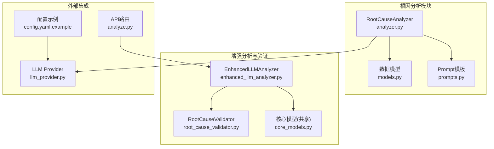
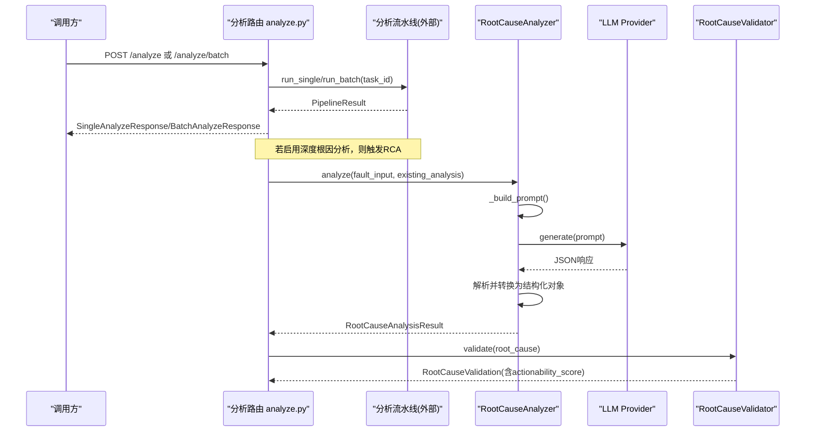
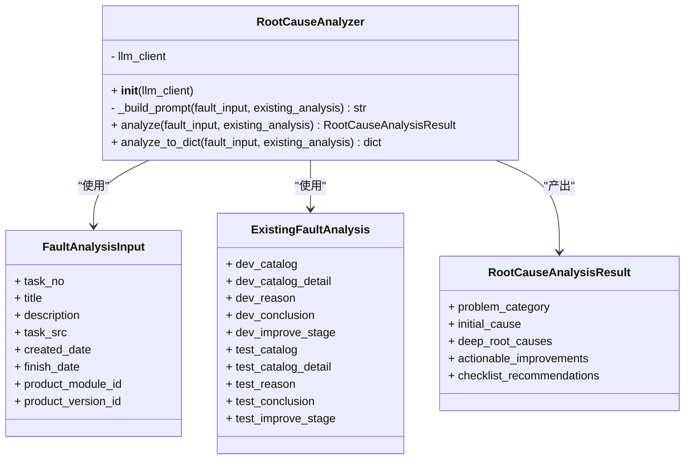
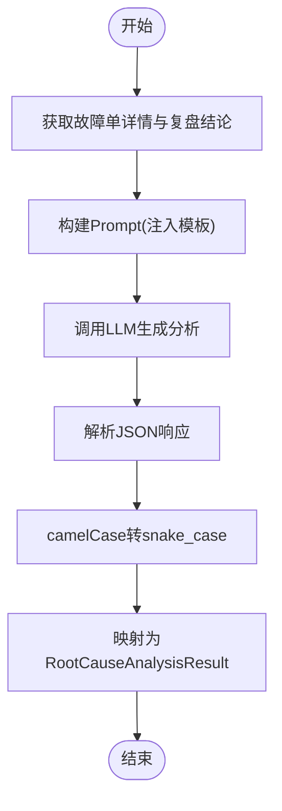
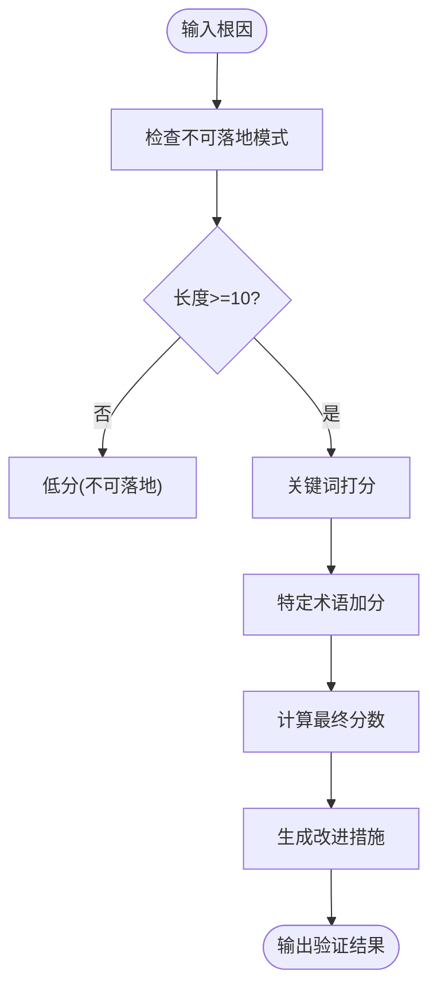
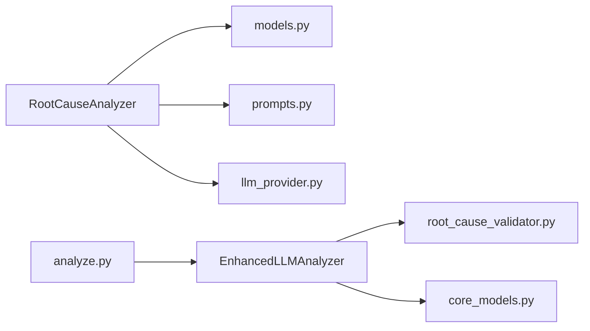

# 根因分析器

<cite>
**本文引用的文件**   
- [analyzer.py](file://src/analysis/root_cause/analyzer.py)
- [models.py](file://src/analysis/root_cause/models.py)
- [prompts.py](file://src/analysis/root_cause/prompts.py)
- [enhanced_llm_analyzer.py](file://src/analysis/enhanced_llm_analyzer.py)
- [root_cause_validator.py](file://src/analysis/root_cause_validator.py)
- [core_models.py](file://src/core/models.py)
- [analyze.py](file://src/api/routes/analyze.py)
- [llm_provider.py](file://src/analyzer/llm_provider.py)
- [config.yaml.example](file://config/config.yaml.example)
- [test_analyzer.py](file://tests/analysis/root_cause/test_analyzer.py)
- [根因分析方案设计.md](file://docs/根因分析方案设计.md)
</cite>

## 目录
1. [引言](#引言)
2. [项目结构](#项目结构)
3. [核心组件](#核心组件)
4. [架构总览](#架构总览)
5. [详细组件分析](#详细组件分析)
6. [依赖关系分析](#依赖关系分析)
7. [性能与可扩展性](#性能与可扩展性)
8. [故障排查指南](#故障排查指南)
9. [结论](#结论)
10. [附录](#附录)

## 引言
本技术文档围绕 RootCauseAnalyzer 根因分析器，系统性阐述其基于大语言模型（LLM）的深度根因分析实现。重点包括：
- 5层追问机制的设计思想与递归分析策略
- FaultAnalysisInput 与 ExistingFaultAnalysis 数据模型的结构与用途
- Prompt 模板管理与动态提示词构建机制
- 与现有故障分析系统的集成方式与数据映射关系
- 根因分析结果的解析与结构化处理逻辑
- 分析质量评估与置信度计算方法
- 如何自定义分析提示词并扩展新的分析维度

## 项目结构
根因分析相关代码位于 src/analysis/root_cause 目录下，包含分析器、数据模型与Prompt模板；同时通过增强型分析器与验证器协同工作，形成“LLM深度分析 + 规则验证”的闭环。

图示来源
- [analyzer.py:44-131](file://src/analysis/root_cause/analyzer.py#L44-L131)
- [models.py:8-67](file://src/analysis/root_cause/models.py#L8-L67)
- [prompts.py:1-85](file://src/analysis/root_cause/prompts.py#L1-L85)
- [enhanced_llm_analyzer.py:23-74](file://src/analysis/enhanced_llm_analyzer.py#L23-L74)
- [root_cause_validator.py:139-187](file://src/analysis/root_cause_validator.py#L139-L187)
- [core_models.py:329-379](file://src/core/models.py#L329-L379)
- [analyze.py:58-119](file://src/api/routes/analyze.py#L58-L119)
- [llm_provider.py:4-52](file://src/analyzer/llm_provider.py#L4-L52)
- [config.yaml.example:6-10](file://config/config.yaml.example#L6-L10)

章节来源
- [analyzer.py:44-131](file://src/analysis/root_cause/analyzer.py#L44-L131)
- [models.py:8-67](file://src/analysis/root_cause/models.py#L8-L67)
- [prompts.py:1-85](file://src/analysis/root_cause/prompts.py#L1-L85)
- [enhanced_llm_analyzer.py:23-74](file://src/analysis/enhanced_llm_analyzer.py#L23-L74)
- [root_cause_validator.py:139-187](file://src/analysis/root_cause_validator.py#L139-L187)
- [core_models.py:329-379](file://src/core/models.py#L329-L379)
- [analyze.py:58-119](file://src/api/routes/analyze.py#L58-L119)
- [llm_provider.py:4-52](file://src/analyzer/llm_provider.py#L4-L52)
- [config.yaml.example:6-10](file://config/config.yaml.example#L6-L10)

## 核心组件
- RootCauseAnalyzer：负责将故障输入与现有复盘结论组装为Prompt，调用LLM进行根因分析，并将响应解析为结构化结果。
- 数据模型：FaultAnalysisInput、ExistingFaultAnalysis、RootCause、ActionableImprovement、RootCauseAnalysisResult 定义输入输出契约。
- Prompt模板：ROOT_CAUSE_ANALYSIS_PROMPT 提供分层分析要求与JSON输出规范。
- EnhancedLLMAnalyzer：整合违规检测、代码变更分析、根因提取与可落地性验证，生成完整分析文本。
- RootCauseValidator：对根因的可落地性进行评分与改进措施生成，支持规则与LLM两种验证路径。
- API路由：暴露单条与批量分析接口，统一封装流水线执行与结果转换。
- LLM Provider：抽象LLM调用能力，当前提供OpenAI异步客户端实现。

章节来源
- [analyzer.py:44-131](file://src/analysis/root_cause/analyzer.py#L44-L131)
- [models.py:8-67](file://src/analysis/root_cause/models.py#L8-L67)
- [prompts.py:1-85](file://src/analysis/root_cause/prompts.py#L1-L85)
- [enhanced_llm_analyzer.py:23-74](file://src/analysis/enhanced_llm_analyzer.py#L23-L74)
- [root_cause_validator.py:139-187](file://src/analysis/root_cause_validator.py#L139-L187)
- [analyze.py:58-119](file://src/api/routes/analyze.py#L58-L119)
- [llm_provider.py:4-52](file://src/analyzer/llm_provider.py#L4-L52)

## 架构总览
下图展示从API到根因分析的端到端流程，以及增强分析与验证的协作关系。

图示来源
- [analyze.py:58-119](file://src/api/routes/analyze.py#L58-L119)
- [analyzer.py:56-116](file://src/analysis/root_cause/analyzer.py#L56-L116)
- [llm_provider.py:38-52](file://src/analyzer/llm_provider.py#L38-L52)
- [root_cause_validator.py:147-187](file://src/analysis/root_cause_validator.py#L147-L187)

## 详细组件分析

### RootCauseAnalyzer 组件
- 职责
  - 构建Prompt：将故障信息与现有复盘结论注入模板，形成结构化提示词。
  - 调用LLM：异步发起生成请求，记录日志便于追踪。
  - 解析响应：将LLM返回的JSON转换为内部数据结构，自动进行键名大小写转换以适配Python命名约定。
  - 同步包装：提供 analyze_to_dict 以便在非异步环境使用。
- 关键方法
  - _build_prompt：按模板字段填充，确保包含问题分类、深层根因挖掘与输出格式约束。
  - analyze：主入口，完成调用、解析与对象构造。
  - analyze_to_dict：在事件循环中运行异步方法并序列化为字典。

图示来源
- [analyzer.py:44-131](file://src/analysis/root_cause/analyzer.py#L44-L131)
- [models.py:8-67](file://src/analysis/root_cause/models.py#L8-L67)

章节来源
- [analyzer.py:56-116](file://src/analysis/root_cause/analyzer.py#L56-L116)
- [models.py:8-67](file://src/analysis/root_cause/models.py#L8-L67)

### 数据模型与用途
- FaultAnalysisInput：承载故障单基本信息，作为LLM分析的上下文输入。
- ExistingFaultAnalysis：承载现有系统给出的研发与测试环节复盘结论，作为参考起点而非直接复制。
- RootCause：表示深层根因条目，包含层级、根因描述、推理依据与证据。
- ActionableImprovement：表示可落地的改进措施，包含类型、具体行动、责任方与优先级。
- RootCauseAnalysisResult：聚合问题分类、初始归因、深层根因列表、改进措施与建议清单。

章节来源
- [models.py:8-67](file://src/analysis/root_cause/models.py#L8-L67)

### Prompt模板管理与动态提示词构建
- 模板位置：ROOT_CAUSE_ANALYSIS_PROMPT 定义了角色设定、输入信息、分析要求与JSON输出格式。
- 动态构建：_build_prompt 将 FaultAnalysisInput 与 ExistingFaultAnalysis 的字段注入模板，保证每次分析具备最新上下文。
- 设计要点
  - 明确问题分类与深层根因挖掘步骤，引导LLM进行“为什么”追问。
  - 强调不要直接复制现有结论，而是以其为起点继续深挖。
  - 规定严格的JSON输出结构，便于后续解析与结构化存储。

章节来源
- [prompts.py:1-85](file://src/analysis/root_cause/prompts.py#L1-L85)
- [analyzer.py:56-77](file://src/analysis/root_cause/analyzer.py#L56-L77)

### 与现有故障分析系统的集成与数据映射
- 集成点
  - API路由 expose 单条与批量分析接口，内部调用 AnalysisPipeline 执行任务。
  - 当启用深度根因分析时，RCA 被触发，结合现有复盘结论进行二次深挖。
- 数据映射
  - 故障单详情 -> FaultAnalysisInput
  - 复盘结论 -> ExistingFaultAnalysis
  - LLM响应 -> RootCauseAnalysisResult（经键名转换与对象构造）

图示来源
- [analyze.py:58-119](file://src/api/routes/analyze.py#L58-L119)
- [analyzer.py:92-116](file://src/analysis/root_cause/analyzer.py#L92-L116)

章节来源
- [analyze.py:58-119](file://src/api/routes/analyze.py#L58-L119)
- [analyzer.py:92-116](file://src/analysis/root_cause/analyzer.py#L92-L116)

### 根因分析结果的解析与结构化处理
- 解析流程
  - 接收LLM返回的字符串，尝试解析为JSON。
  - 递归将camelCase键转换为snake_case，以匹配Python dataclass字段。
  - 将deep_root_causes与actionable_improvements分别映射为对象列表。
  - 填充problem_category、initial_cause与checklist_recommendations等字段。
- 健壮性
  - 对于缺失字段提供默认值，避免解析失败导致整体崩溃。

章节来源
- [analyzer.py:92-116](file://src/analysis/root_cause/analyzer.py#L92-L116)

### 分析质量评估与置信度计算
- 可落地性验证（RootCauseValidator）
  - 规则路径：通过不可落地模式匹配、关键词打分与长度阈值判断是否可落地，并给出actionability_score与改进措施建议。
  - LLM路径：可选地调用LLM进行更深入的验证，解析其返回的JSON以得到评分与反馈。
- 置信度计算（ViolationDetection）
  - 基于是否存在违规片段、相关规范数量与片段长度等因素加权计算置信度。
- 综合输出
  - EnhancedLLMAnalyzer 将违规检测结果、根因与验证结果组合成完整的分析文本，便于下游消费。

图示来源
- [root_cause_validator.py:147-233](file://src/analysis/root_cause_validator.py#L147-L233)
- [violation_detector.py:122-143](file://src/analysis/violation_detector.py#L122-L143)
- [enhanced_llm_analyzer.py:122-170](file://src/analysis/enhanced_llm_analyzer.py#L122-L170)

章节来源
- [root_cause_validator.py:147-233](file://src/analysis/root_cause_validator.py#L147-L233)
- [violation_detector.py:122-143](file://src/analysis/violation_detector.py#L122-L143)
- [enhanced_llm_analyzer.py:122-170](file://src/analysis/enhanced_llm_analyzer.py#L122-L170)

### 5层追问机制与递归分析策略
- 设计思想
  - 第一层：现象描述（故障现象与影响范围）
  - 第二层：问题分类（开发引入/测试泄露/需求问题/外部依赖）
  - 第三层：初步归因（来自现有系统，作为参考起点）
  - 第四层：深层根因（设计/编码/测试/流程/知识管理层面）
  - 第五层：可落地的改进措施（直接改进/流程改进）
- 递归策略
  - 针对“场景考虑不全”等泛化归因，持续追问“为什么没考虑到”，定位具体环节与流程缺失。
  - 每个根因必须附带证据，避免空泛结论。
  - 改进措施需具体可执行，避免模糊表述。

章节来源
- [根因分析方案设计.md:91-143](file://docs/根因分析方案设计.md#L91-L143)
- [prompts.py:31-84](file://src/analysis/root_cause/prompts.py#L31-L84)

### 自定义分析提示词与扩展新维度
- 自定义提示词
  - 修改 ROOT_CAUSE_ANALYSIS_PROMPT，增加新的分析维度或业务领域约束。
  - 在 _build_prompt 中注入更多上下文字段（如产品模块、版本信息等）。
- 扩展维度
  - 在 Prompt 中新增“分析要求”小节，指导LLM输出新的JSON字段。
  - 在 models.py 中扩展 RootCauseAnalysisResult 与子对象，保持解析与校验一致。
- 安全与合规
  - 结合 PromptGuard 进行注入防护，确保用户输入不被恶意改写系统指令。

章节来源
- [prompts.py:1-85](file://src/analysis/root_cause/prompts.py#L1-L85)
- [models.py:58-67](file://src/analysis/root_cause/models.py#L58-L67)
- [analyzer.py:56-77](file://src/analysis/root_cause/analyzer.py#L56-L77)

## 依赖关系分析
- 模块内耦合
  - RootCauseAnalyzer 强依赖 models 与 prompts，弱依赖 LLM Provider。
  - EnhancedLLMAnalyzer 聚合 ViolationDetector、RootCauseValidator、CodeChangeAnalyzer，形成复合分析能力。
- 外部依赖
  - LLM Provider 依赖 openai 异步客户端，可通过配置切换 provider 与模型参数。
  - API 路由依赖 FastAPI 与 loguru 日志库。
- 潜在风险
  - LLM服务不稳定：需增加重试与降级策略。
  - JSON解析异常：需加强容错与回退逻辑。

图示来源
- [analyzer.py:44-131](file://src/analysis/root_cause/analyzer.py#L44-L131)
- [enhanced_llm_analyzer.py:23-74](file://src/analysis/enhanced_llm_analyzer.py#L23-L74)
- [root_cause_validator.py:139-187](file://src/analysis/root_cause_validator.py#L139-L187)
- [core_models.py:329-379](file://src/core/models.py#L329-L379)
- [analyze.py:58-119](file://src/api/routes/analyze.py#L58-L119)
- [llm_provider.py:4-52](file://src/analyzer/llm_provider.py#L4-L52)

章节来源
- [analyzer.py:44-131](file://src/analysis/root_cause/analyzer.py#L44-L131)
- [enhanced_llm_analyzer.py:23-74](file://src/analysis/enhanced_llm_analyzer.py#L23-L74)
- [root_cause_validator.py:139-187](file://src/analysis/root_cause_validator.py#L139-L187)
- [core_models.py:329-379](file://src/core/models.py#L329-L379)
- [analyze.py:58-119](file://src/api/routes/analyze.py#L58-L119)
- [llm_provider.py:4-52](file://src/analyzer/llm_provider.py#L4-L52)

## 性能与可扩展性
- 性能考量
  - LLM调用为I/O密集型，建议使用异步客户端与连接池优化。
  - 批量分析应控制并发度，避免过载。
- 可扩展性
  - 通过替换 LLM Provider 实现多模型支持。
  - 通过扩展 Prompt 与数据模型，灵活增加分析维度。
  - 通过配置中心集中管理模型参数与超时策略。

[本节为通用指导，不直接分析具体文件]

## 故障排查指南
- LLM调用失败
  - 检查 API Key、模型名称与base_url是否正确。
  - 查看日志中的错误堆栈，确认网络与鉴权状态。
- JSON解析异常
  - 确认LLM返回符合约定的JSON结构。
  - 增加容错与回退逻辑，避免整体失败。
- 根因不可落地
  - 根据 RootCauseValidator 的反馈调整Prompt，引导LLM输出更具体的根因与措施。
- 单元测试辅助
  - 使用 MockLLMClient 模拟LLM响应，验证解析与映射逻辑。

章节来源
- [llm_provider.py:4-52](file://src/analyzer/llm_provider.py#L4-L52)
- [analyzer.py:92-116](file://src/analysis/root_cause/analyzer.py#L92-L116)
- [root_cause_validator.py:147-187](file://src/analysis/root_cause_validator.py#L147-L187)
- [test_analyzer.py:14-55](file://tests/analysis/root_cause/test_analyzer.py#L14-L55)

## 结论
RootCauseAnalyzer 通过“模板驱动 + 结构化解析 + 可落地性验证”的组合，实现了从泛化归因到深层根因的系统化挖掘。配合 EnhancedLLMAnalyzer 与 RootCauseValidator，形成了“LLM深度分析 + 规则验证”的闭环，既保证了分析质量，又提升了改进措施的可操作性。未来可在以下方向持续优化：
- 强化LLM稳定性与容错机制
- 扩展知识库与历史根因模式识别
- 完善自动化checklist生成与跟踪闭环

[本节为总结性内容，不直接分析具体文件]

## 附录
- 配置项说明（节选）
  - llm.provider：LLM提供商标识
  - llm.model：模型名称
  - llm.temperature：采样温度
  - llm.max_tokens：最大生成长度
- 参考设计文档
  - 根因分析方案设计：详细阐述了5层追问机制与代码规范对照分析思路

章节来源
- [config.yaml.example:6-10](file://config/config.yaml.example#L6-L10)
- [根因分析方案设计.md:233-261](file://docs/根因分析方案设计.md#L233-L261)