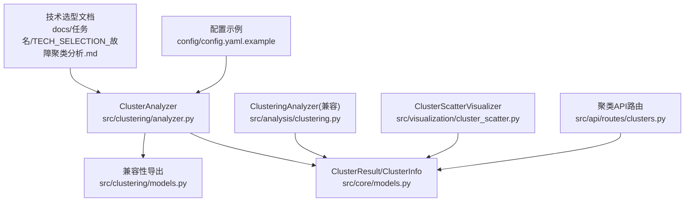
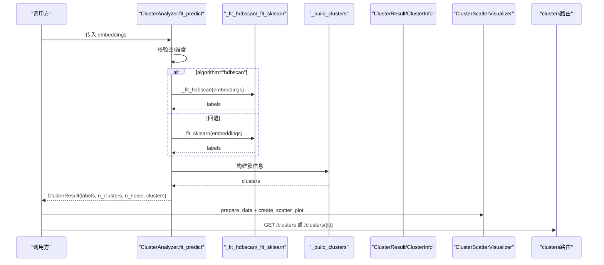
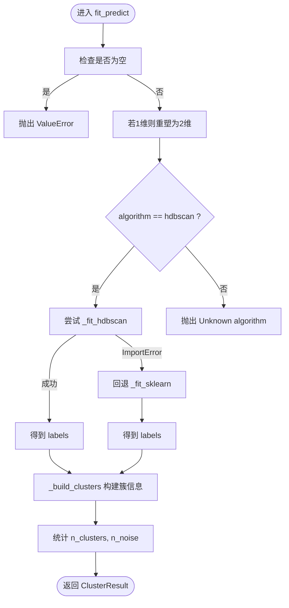
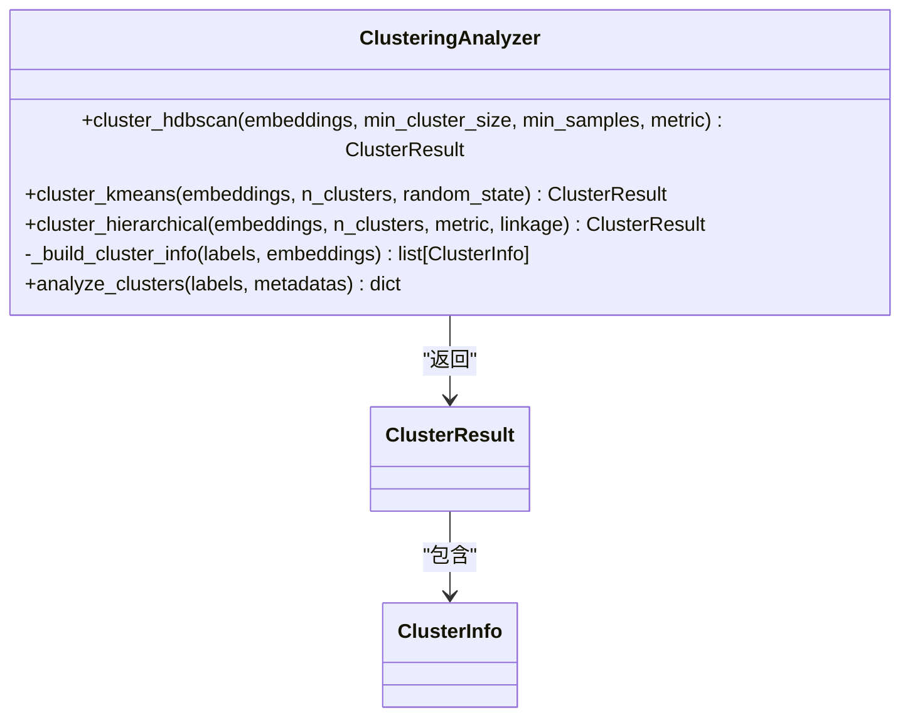
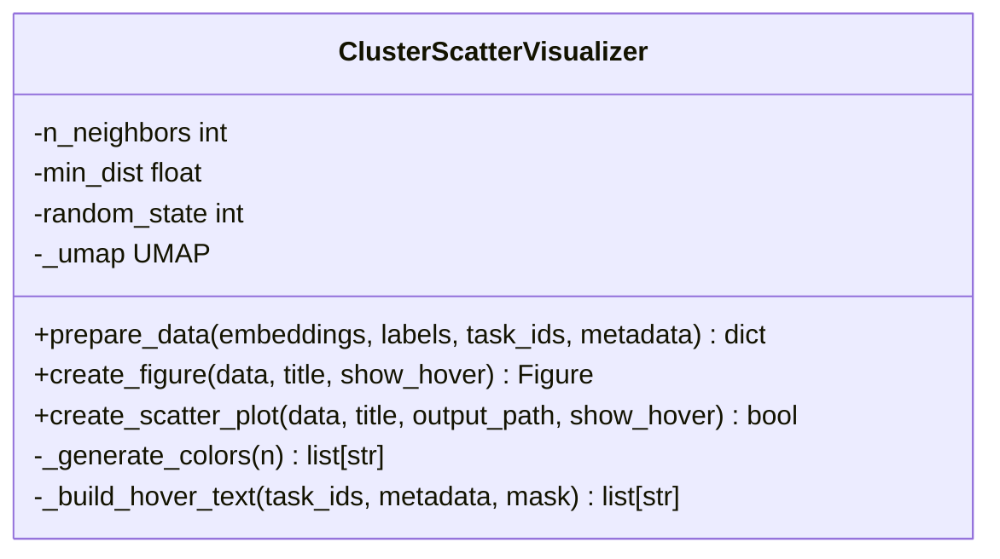
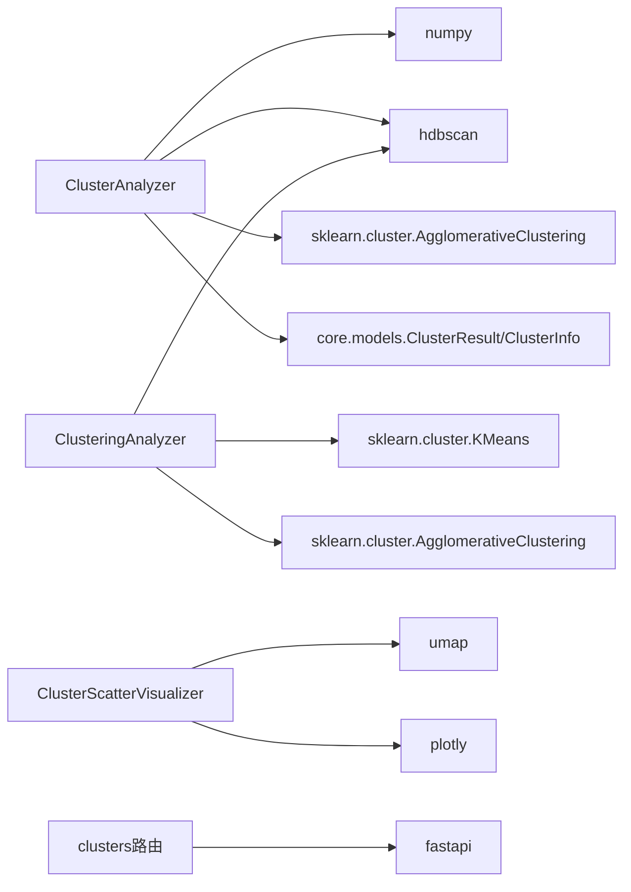

# 聚类分析器

<cite>
**本文引用的文件**
- [src/clustering/analyzer.py](file://src/clustering/analyzer.py)
- [src/clustering/models.py](file://src/clustering/models.py)
- [src/core/models.py](file://src/core/models.py)
- [src/analysis/clustering.py](file://src/analysis/clustering.py)
- [src/visualization/cluster_scatter.py](file://src/visualization/cluster_scatter.py)
- [src/api/routes/clusters.py](file://src/api/routes/clusters.py)
- [config/config.yaml.example](file://config/config.yaml.example)
- [tests/test_clustering.py](file://tests/test_clustering.py)
- [tests/clustering/test_analyzer_extended.py](file://tests/clustering/test_analyzer_extended.py)
- [docs/任务名/TECH_SELECTION_故障聚类分析.md](file://docs/任务名/TECH_SELECTION_故障聚类分析.md)
</cite>

## 目录
1. [简介](#简介)
2. [项目结构](#项目结构)
3. [核心组件](#核心组件)
4. [架构总览](#架构总览)
5. [详细组件分析](#详细组件分析)
6. [依赖关系分析](#依赖关系分析)
7. [性能与复杂度](#性能与复杂度)
8. [配置与参数调优](#配置与参数调优)
9. [评估指标与结果解释](#评估指标与结果解释)
10. [可视化建议](#可视化建议)
11. [扩展指南：新增算法与自定义相似度](#扩展指南新增算法与自定义相似度)
12. [故障排查](#故障排查)
13. [结论](#结论)

## 简介
本技术文档围绕 ClusterAnalyzer 聚类分析器，系统阐述其多种聚类算法的实现与选择策略（HDBSCAN、K-Means、层次聚类），深入解析 fit_predict 方法在向量空间中的相似性计算与聚类边界确定机制，说明噪声点识别与异常值处理策略，并提供不同算法的配置参数说明、效果评估指标、结果解释方法与可视化建议。同时给出如何添加新聚类算法和自定义相似度度量函数的扩展指南。

## 项目结构
与聚类分析相关的关键代码分布在以下模块：
- 核心分析器：src/clustering/analyzer.py
- 兼容型分析器：src/analysis/clustering.py
- 数据模型：src/core/models.py、src/clustering/models.py
- 可视化：src/visualization/cluster_scatter.py
- API 路由：src/api/routes/clusters.py
- 配置示例：config/config.yaml.example
- 测试用例：tests/test_clustering.py、tests/clustering/test_analyzer_extended.py
- 技术选型文档：docs/任务名/TECH_SELECTION_故障聚类分析.md

图表来源
- [src/clustering/analyzer.py:1-121](file://src/clustering/analyzer.py#L1-L121)
- [src/core/models.py:91-230](file://src/core/models.py#L91-L230)
- [src/clustering/models.py:1-25](file://src/clustering/models.py#L1-L25)
- [src/analysis/clustering.py:1-316](file://src/analysis/clustering.py#L1-L316)
- [src/visualization/cluster_scatter.py:1-234](file://src/visualization/cluster_scatter.py#L1-L234)
- [src/api/routes/clusters.py:1-195](file://src/api/routes/clusters.py#L1-L195)
- [config/config.yaml.example:16-21](file://config/config.yaml.example#L16-L21)
- [docs/任务名/TECH_SELECTION_故障聚类分析.md:51-76](file://docs/任务名/TECH_SELECTION_故障聚类分析.md#L51-L76)

章节来源
- [src/clustering/analyzer.py:1-121](file://src/clustering/analyzer.py#L1-L121)
- [src/core/models.py:91-230](file://src/core/models.py#L91-L230)
- [src/clustering/models.py:1-25](file://src/clustering/models.py#L1-L25)
- [src/analysis/clustering.py:1-316](file://src/analysis/clustering.py#L1-L316)
- [src/visualization/cluster_scatter.py:1-234](file://src/visualization/cluster_scatter.py#L1-L234)
- [src/api/routes/clusters.py:1-195](file://src/api/routes/clusters.py#L1-L195)
- [config/config.yaml.example:16-21](file://config/config.yaml.example#L16-L21)
- [docs/任务名/TECH_SELECTION_故障聚类分析.md:51-76](file://docs/任务名/TECH_SELECTION_故障聚类分析.md#L51-L76)

## 核心组件
- ClusterAnalyzer：面向生产的主分析器，默认使用 HDBSCAN；当 metric=cosine 时进行 L2 归一化以等价余弦距离；支持导入失败回退到基于 sklearn 的层次聚类；提供 fit_predict 统一接口并返回结构化结果。
- ClusteringAnalyzer（兼容）：提供 HDBSCAN、K-Means、层次聚类的独立方法，便于历史调用或对比实验。
- 数据模型：ClusterResult、ClusterInfo 定义标签、簇信息、质心、成员索引等字段，用于标准化输出。
- 可视化：ClusterScatterVisualizer 使用 UMAP 将高维嵌入降维至 2D，生成交互式散点图，支持悬停显示任务ID与元数据。
- API 路由：提供获取聚类列表与详情的 REST 接口，内部维护内存缓存。

章节来源
- [src/clustering/analyzer.py:8-121](file://src/clustering/analyzer.py#L8-L121)
- [src/analysis/clustering.py:22-316](file://src/analysis/clustering.py#L22-L316)
- [src/core/models.py:91-230](file://src/core/models.py#L91-L230)
- [src/visualization/cluster_scatter.py:14-234](file://src/visualization/cluster_scatter.py#L14-L234)
- [src/api/routes/clusters.py:1-195](file://src/api/routes/clusters.py#L1-L195)

## 架构总览
下图展示了从输入嵌入到聚类结果、再到可视化和 API 的整体流程。

图表来源
- [src/clustering/analyzer.py:22-121](file://src/clustering/analyzer.py#L22-L121)
- [src/core/models.py:210-230](file://src/core/models.py#L210-L230)
- [src/visualization/cluster_scatter.py:33-183](file://src/visualization/cluster_scatter.py#L33-L183)
- [src/api/routes/clusters.py:24-166](file://src/api/routes/clusters.py#L24-L166)

## 详细组件分析

### ClusterAnalyzer 主分析器
- 初始化参数
  - algorithm: 当前实现仅支持 "hdbscan"；未知算法会抛出错误。
  - min_cluster_size: 最小簇大小阈值。
  - min_samples: HDBSCAN 的最小样本数。
  - metric: 距离度量，支持 "cosine" 与底层支持的度量；当为 "cosine" 时执行 L2 归一化并使用欧氏距离以提升效率。
- fit_predict 工作流程
  - 输入校验：拒绝空嵌入；若为一维则重塑为二维。
  - 算法分支：优先尝试 HDBSCAN；若导入失败则回退到基于 AgglomerativeClustering 的层次聚类。
  - 构建簇信息：按标签分组，计算每个簇的质心和成员索引。
  - 统计噪声与簇数量：label=-1 视为噪声点。
- 相似度与边界
  - 余弦相似度通过 L2 归一化后等价于欧氏距离，从而利用 HDBSCAN 对欧氏距离的高效实现。
  - 层次聚类回退路径中，当 linkage="ward" 时强制使用欧氏距离。
- 噪声与异常值
  - 当数据量小于 min_cluster_size 时直接标记全部为噪声。
  - 零范数向量在归一化时被保护（分母置1），避免除零异常。
  - NaN/Inf 未做显式清洗，可能由下游库抛出异常或产生不确定结果。

图表来源
- [src/clustering/analyzer.py:22-121](file://src/clustering/analyzer.py#L22-L121)

章节来源
- [src/clustering/analyzer.py:8-121](file://src/clustering/analyzer.py#L8-L121)
- [tests/clustering/test_analyzer_extended.py:15-274](file://tests/clustering/test_analyzer_extended.py#L15-L274)
- [tests/test_clustering.py:82-120](file://tests/test_clustering.py#L82-L120)

### ClusteringAnalyzer（兼容层）
- 提供三种方法的独立入口：
  - cluster_hdbscan：直接使用 HDBSCAN，记录参数与日志。
  - cluster_kmeans：使用 KMeans，固定 n_init=10，无噪声点。
  - cluster_hierarchical：使用 AgglomerativeClustering，linkage="ward" 时强制 metric="euclidean"。
- 统一的 _build_cluster_info 构建 ClusterInfo 列表。
- analyze_clusters：对标签与元数据进行聚合分析，统计每簇最常见根因与任务ID集合。

图表来源
- [src/analysis/clustering.py:22-316](file://src/analysis/clustering.py#L22-L316)
- [src/core/models.py:210-230](file://src/core/models.py#L210-L230)

章节来源
- [src/analysis/clustering.py:22-316](file://src/analysis/clustering.py#L22-L316)

### 数据模型
- ClusterResult：包含 labels、n_clusters、n_noise、clusters、probabilities、metadata；提供 get_cluster、get_noise_indices 辅助方法。
- ClusterInfo：包含 cluster_id、size、centroid、member_indices、label、keywords、metadata。
- DimensionReductionResult：用于降维结果的通用模型（UMAP 等）。

章节来源
- [src/core/models.py:91-230](file://src/core/models.py#L91-L230)
- [src/clustering/models.py:1-25](file://src/clustering/models.py#L1-L25)

### 可视化组件
- ClusterScatterVisualizer：
  - prepare_data：校验输入长度一致性，使用 UMAP 将高维嵌入降至 2D。
  - create_figure：按标签分组绘制散点，噪声点用灰色，其他簇分配颜色；支持悬停文本。
  - create_scatter_plot：保存 HTML 文件，便于分享与交互。

图表来源
- [src/visualization/cluster_scatter.py:14-234](file://src/visualization/cluster_scatter.py#L14-L234)

章节来源
- [src/visualization/cluster_scatter.py:14-234](file://src/visualization/cluster_scatter.py#L14-L234)

### API 路由
- GET /clusters：返回聚类列表、总数、噪声数量。
- GET /clusters/{cluster_id}：返回指定聚类的详情与任务列表。
- update_cluster_cache：根据任务级结果更新内存缓存。

章节来源
- [src/api/routes/clusters.py:24-195](file://src/api/routes/clusters.py#L24-L195)

## 依赖关系分析
- ClusterAnalyzer 依赖：
  - numpy：数值计算与形状操作。
  - hdbscan：首选聚类算法。
  - sklearn.cluster.AgglomerativeClustering：回退方案。
  - src.core.models.ClusterResult/ClusterInfo：结果建模。
- ClusteringAnalyzer 依赖：
  - hdbscan、sklearn.cluster.KMeans、AgglomerativeClustering。
  - src.clustering.models 向后兼容导出。
- 可视化依赖：
  - umap：降维。
  - plotly：交互式绘图。
- API 依赖：
  - fastapi、loguru、ConfigManager。

图表来源
- [src/clustering/analyzer.py:1-121](file://src/clustering/analyzer.py#L1-L121)
- [src/analysis/clustering.py:1-316](file://src/analysis/clustering.py#L1-L316)
- [src/visualization/cluster_scatter.py:1-234](file://src/visualization/cluster_scatter.py#L1-L234)
- [src/api/routes/clusters.py:1-195](file://src/api/routes/clusters.py#L1-L195)

章节来源
- [src/clustering/analyzer.py:1-121](file://src/clustering/analyzer.py#L1-L121)
- [src/analysis/clustering.py:1-316](file://src/analysis/clustering.py#L1-L316)
- [src/visualization/cluster_scatter.py:1-234](file://src/visualization/cluster_scatter.py#L1-L234)
- [src/api/routes/clusters.py:1-195](file://src/api/routes/clusters.py#L1-L195)

## 性能与复杂度
- HDBSCAN
  - 时间复杂度近似 O(N log N) 到 O(N^2)，取决于数据分布与实现优化；在高维场景下建议使用余弦相似度并通过归一化转为欧氏距离以提升性能。
  - 空间复杂度受邻域图构建影响，通常 O(N d)。
- 层次聚类（AgglomerativeClustering，ward）
  - 时间复杂度 O(N^3) 或 O(N^2 log N)，适合中小规模数据；大规模数据建议先降维或使用 HDBSCAN。
- K-Means
  - 时间复杂度 O(I N K d)，I 为迭代次数，K 为簇数，d 为维度；对初始中心敏感，可多次运行取最优。
- 余弦相似度处理
  - 归一化开销 O(N d)，但能显著提升语义向量的聚类质量与稳定性。

[本节为通用性能讨论，不直接分析具体文件]

## 配置与参数调优
- 配置文件位置：config/config.yaml.example
  - clustering.algorithm: 推荐 "hdbscan"
  - clustering.min_cluster_size: 控制最小簇大小，过小易碎片化，过大易合并异类
  - clustering.min_samples: HDBSCAN 密度估计参数，越大越保守
  - clustering.metric: 推荐 "cosine"，配合归一化使用
- 参数调优建议
  - HDBSCAN
    - min_cluster_size：依据业务语义粒度调整，常见范围 3~10
    - min_samples：与 min_cluster_size 同阶，略小或相等
    - metric："cosine" 适用于文本/语义向量；若数据已归一化，可使用 "euclidean"
  - K-Means
    - n_clusters：结合肘部法则或轮廓系数选择
    - random_state：固定种子保证可复现
  - 层次聚类
    - linkage="ward" 要求欧氏距离；metric 会被强制为 "euclidean"
    - n_clusters：可通过树状图或业务需求决定

章节来源
- [config/config.yaml.example:16-21](file://config/config.yaml.example#L16-L21)
- [docs/任务名/TECH_SELECTION_故障聚类分析.md:51-76](file://docs/任务名/TECH_SELECTION_故障聚类分析.md#L51-L76)

## 评估指标与结果解释
- 常用指标
  - 轮廓系数（Silhouette Score）：衡量簇内紧密度与簇间分离度，取值 [-1, 1]，越高越好。
  - Davies–Bouldin Index：越小表示簇分离度越好。
  - Calinski–Harabasz Index：越大表示簇间离散度高且簇内紧凑。
- 结果解释
  - 查看 ClusterResult.n_clusters 与 n_noise，了解整体结构与噪声比例。
  - 遍历 result.clusters，关注 size 与 centroid，理解各簇规模与代表方向。
  - 使用 analyze_clusters 聚合元数据，提取每簇最常见根因与任务ID集合，辅助业务解读。
- 可视化辅助
  - 使用 UMAP 降维后的 2D 散点图观察簇分布与噪声点聚集情况。
  - 悬停展示任务ID与根因，快速定位关键样本。

[本节为通用评估指导，不直接分析具体文件]

## 可视化建议
- 使用 ClusterScatterVisualizer.prepare_data 准备数据，确保 embeddings、labels、task_ids 长度一致。
- 使用 create_scatter_plot 生成 HTML 文件，便于浏览器交互浏览。
- 对于大规模数据，可适当增大 UMAP 的 n_neighbors 以获得更全局的结构，或减小 min_dist 使点更分散。
- 噪声点（label=-1）在图中以灰色显示，便于区分。

章节来源
- [src/visualization/cluster_scatter.py:33-183](file://src/visualization/cluster_scatter.py#L33-L183)

## 扩展指南：新增算法与自定义相似度
- 新增聚类算法
  - 在 ClusterAnalyzer 中添加新的算法分支（如 "kmeans"、"dbscan"），并在构造函数中接收相应参数。
  - 实现对应的私有拟合方法（例如 _fit_kmeans），遵循现有模式：预处理（必要时归一化）、调用第三方库、返回 labels。
  - 在 fit_predict 中增加分支逻辑，并确保 _build_clusters 能正确处理新算法的标签体系。
  - 参考现有实现：
    - 主分析器分支与回退逻辑：[src/clustering/analyzer.py:29-35](file://src/clustering/analyzer.py#L29-L35)
    - 兼容层 K-Means 实现：[src/analysis/clustering.py:95-156](file://src/analysis/clustering.py#L95-L156)
- 自定义相似度度量函数
  - 若需引入非标准度量，可在预处理阶段将原始嵌入转换为“距离矩阵”或“核矩阵”，再适配到支持预计算距离的聚类算法（如某些版本的 DBSCAN/HDBSCAN 支持 metric='precomputed'）。
  - 注意：当前主分析器在 metric="cosine" 时采用归一化+欧氏距离的策略；如需自定义度量，建议在外部封装一个适配器，将自定义相似度映射为欧氏距离或预计算距离矩阵。
  - 参考相似度选型文档：[docs/任务名/TECH_SELECTION_故障聚类分析.md:51-76](file://docs/任务名/TECH_SELECTION_故障聚类分析.md#L51-L76)

章节来源
- [src/clustering/analyzer.py:29-35](file://src/clustering/analyzer.py#L29-L35)
- [src/analysis/clustering.py:95-156](file://src/analysis/clustering.py#L95-L156)
- [docs/任务名/TECH_SELECTION_故障聚类分析.md:51-76](file://docs/任务名/TECH_SELECTION_故障聚类分析.md#L51-L76)

## 故障排查
- 空嵌入或维度错误
  - 现象：fit_predict 抛出 ValueError。
  - 处理：确保输入为非空二维数组；一维输入会被自动重塑为 (1, d)。
  - 参考：[src/clustering/analyzer.py:22-28](file://src/clustering/analyzer.py#L22-L28)
- 未知算法
  - 现象：传入不支持的 algorithm 字符串。
  - 处理：仅支持 "hdbscan"；如需其他算法，请扩展主分析器或改用兼容层。
  - 参考：[src/clustering/analyzer.py:34-35](file://src/clustering/analyzer.py#L34-L35)
- HDBSCAN 导入失败
  - 现象：ImportError。
  - 处理：自动回退到层次聚类；也可安装 hdbscan 以启用首选算法。
  - 参考：[src/clustering/analyzer.py:29-33](file://src/clustering/analyzer.py#L29-L33)
- 数据量不足
  - 现象：样本数小于 min_cluster_size 时全部标记为噪声。
  - 处理：降低 min_cluster_size 或增加样本。
  - 参考：[src/clustering/analyzer.py:51-52](file://src/clustering/analyzer.py#L51-L52)
- 零范数向量
  - 现象：norm 为零导致除零风险。
  - 处理：归一化时对零范数进行保护（分母置1）。
  - 参考：[src/clustering/analyzer.py:57-59](file://src/clustering/analyzer.py#L57-L59)
- NaN/Inf 值
  - 现象：可能导致异常或不确定结果。
  - 处理：在预处理阶段清洗或替换缺失值。
  - 参考：[tests/clustering/test_analyzer_extended.py:238-274](file://tests/clustering/test_analyzer_extended.py#L238-L274)
- 可视化数据不一致
  - 现象：prepare_data 报错长度不一致。
  - 处理：确保 embeddings、labels、task_ids 长度一致。
  - 参考：[src/visualization/cluster_scatter.py:51-55](file://src/visualization/cluster_scatter.py#L51-L55)

章节来源
- [src/clustering/analyzer.py:22-59](file://src/clustering/analyzer.py#L22-L59)
- [tests/clustering/test_analyzer_extended.py:15-274](file://tests/clustering/test_analyzer_extended.py#L15-L274)
- [src/visualization/cluster_scatter.py:51-55](file://src/visualization/cluster_scatter.py#L51-L55)

## 结论
ClusterAnalyzer 以 HDBSCAN 为核心，辅以余弦相似度归一化与层次聚类回退，提供了稳定、可扩展的聚类能力。通过标准化的 ClusterResult/ClusterInfo 输出、UMAP 可视化与 API 集成，形成了从数据到洞察的完整链路。建议在生产环境中优先使用 HDBSCAN 与 cosine 度量，并结合轮廓系数等指标进行参数调优与结果验证。如需扩展新算法或自定义相似度，可参照现有模式在主分析器或兼容层中进行模块化接入。
