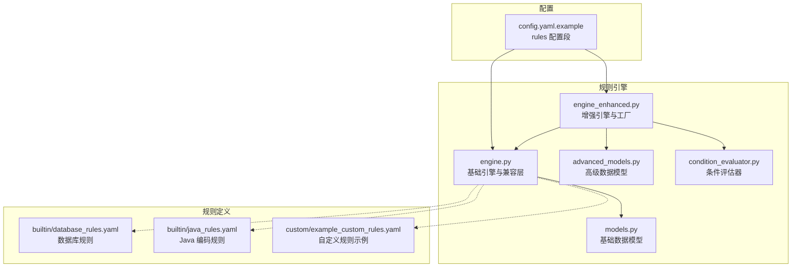
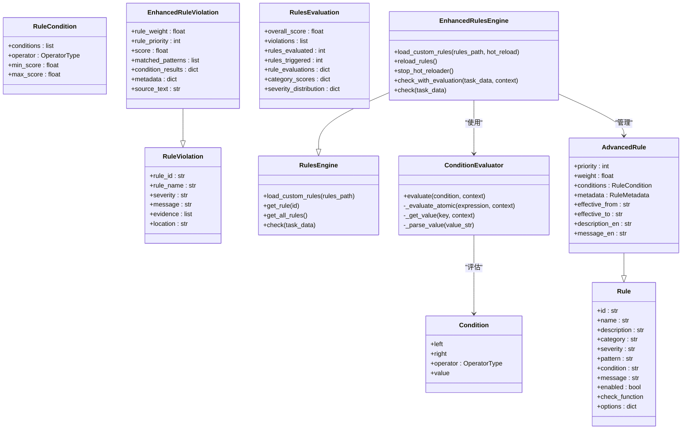
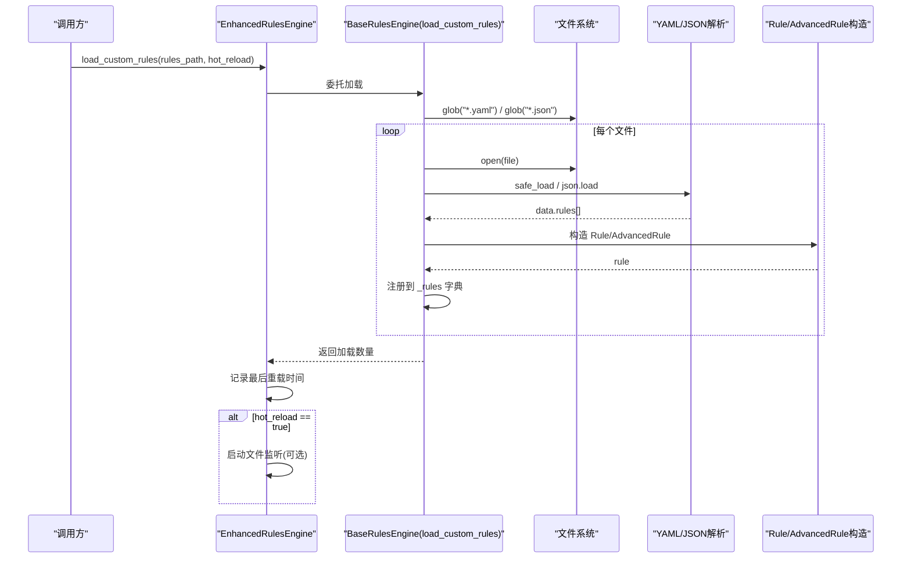
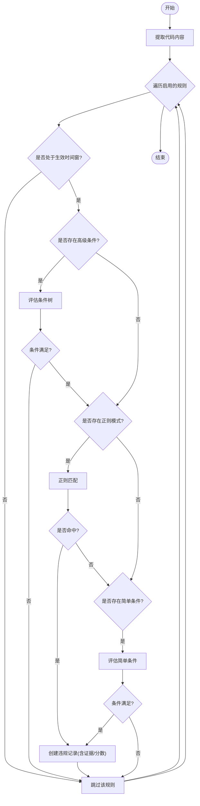
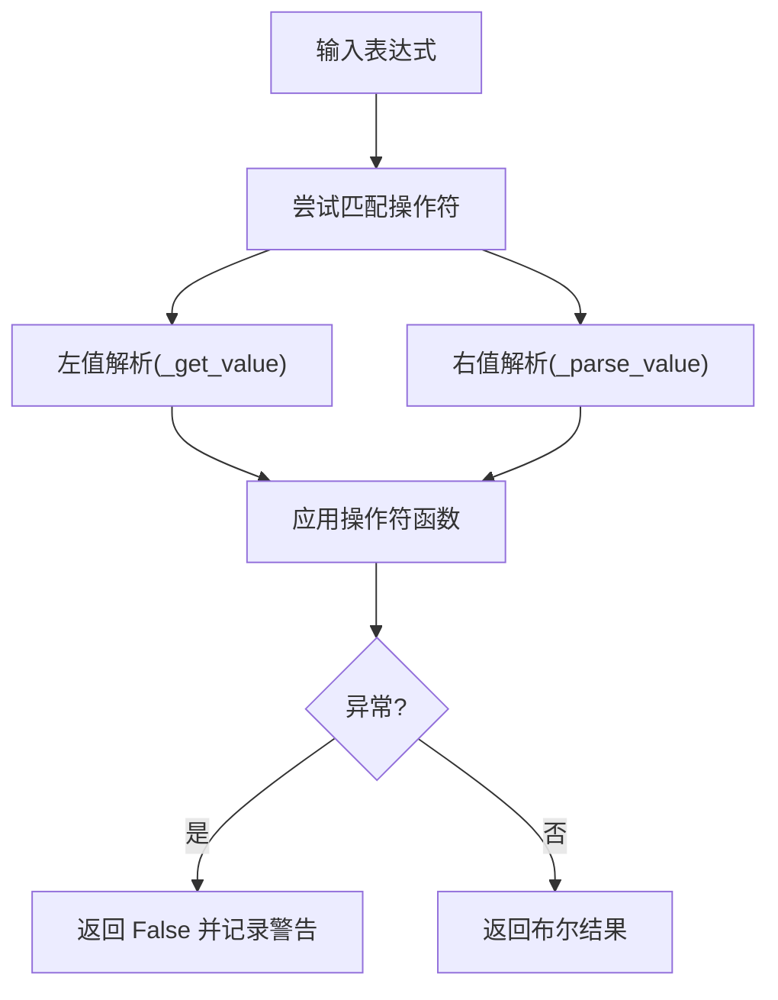
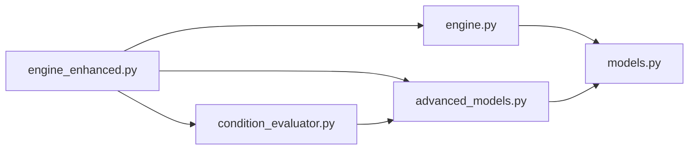

# 规则引擎

<cite>
**本文引用的文件**   
- [src/rules/engine.py](file://src/rules/engine.py)
- [src/rules/models.py](file://src/rules/models.py)
- [src/rules/advanced_models.py](file://src/rules/advanced_models.py)
- [src/rules/condition_evaluator.py](file://src/rules/condition_evaluator.py)
- [src/rules/engine_enhanced.py](file://src/rules/engine_enhanced.py)
- [src/rules/builtin/database_rules.yaml](file://src/rules/builtin/database_rules.yaml)
- [src/rules/builtin/java_rules.yaml](file://src/rules/builtin/java_rules.yaml)
- [src/rules/custom/example_custom_rules.yaml](file://src/rules/custom/example_custom_rules.yaml)
- [config/config.yaml.example](file://config/config.yaml.example)
- [tests/rules/test_engine.py](file://tests/rules/test_engine.py)
- [tests/rules/test_condition_evaluator.py](file://tests/rules/test_condition_evaluator.py)
- [tests/rules/test_advanced_rules.py](file://tests/rules/test_advanced_rules.py)
</cite>

## 更新摘要
**变更内容**   
- 更新了性能与可扩展性章节，反映RulesEngine.check()方法的字符串拼接优化
- 新增了内存安全限制说明，包含500KB大小限制以防止内存耗尽
- 更新了违规检测的报告生成与证据收集部分，体现list+join方法的使用
- 增强了故障排查指南中的性能相关问题处理

## 目录
1. [简介](#简介)
2. [项目结构](#项目结构)
3. [核心组件](#核心组件)
4. [架构总览](#架构总览)
5. [详细组件分析](#详细组件分析)
6. [依赖关系分析](#依赖关系分析)
7. [性能与可扩展性](#性能与可扩展性)
8. [故障排查指南](#故障排查指南)
9. [结论](#结论)
10. [附录](#附录)

## 简介
本技术文档围绕 RulesEngine 规则引擎，系统阐述规则加载、解析与执行的核心机制，覆盖 YAML 规则语法与校验要点、内置规则库（数据库相关规则与 Java 编码规范检查）、条件评估器实现与表达式语言支持、自定义规则开发与测试方法、违规检测的报告生成与证据收集机制、规则版本管理与热重载能力，以及如何扩展新规则类型与集成外部规则源。

## 项目结构
规则引擎位于 src/rules 模块，包含基础模型、增强模型、条件评估器、基础引擎与增强引擎，以及内置与自定义规则示例。配置项在 config/config.yaml.example 中提供 rules 相关选项。

图表来源
- [src/rules/engine.py:217-352](file://src/rules/engine.py#L217-L352)
- [src/rules/engine_enhanced.py:22-130](file://src/rules/engine_enhanced.py#L22-L130)
- [src/rules/models.py:5-51](file://src/rules/models.py#L5-L51)
- [src/rules/advanced_models.py:18-102](file://src/rules/advanced_models.py#L18-L102)
- [src/rules/condition_evaluator.py:12-165](file://src/rules/condition_evaluator.py#L12-L165)
- [src/rules/builtin/database_rules.yaml:1-39](file://src/rules/builtin/database_rules.yaml#L1-L39)
- [src/rules/builtin/java_rules.yaml:1-48](file://src/rules/builtin/java_rules.yaml#L1-L48)
- [src/rules/custom/example_custom_rules.yaml:1-41](file://src/rules/custom/example_custom_rules.yaml#L1-L41)
- [config/config.yaml.example:27-31](file://config/config.yaml.example#L27-L31)

章节来源
- [src/rules/engine.py:217-352](file://src/rules/engine.py#L217-L352)
- [src/rules/engine_enhanced.py:22-130](file://src/rules/engine_enhanced.py#L22-L130)
- [src/rules/models.py:5-51](file://src/rules/models.py#L5-L51)
- [src/rules/advanced_models.py:18-102](file://src/rules/advanced_models.py#L18-L102)
- [src/rules/condition_evaluator.py:12-165](file://src/rules/condition_evaluator.py#L12-L165)
- [src/rules/builtin/database_rules.yaml:1-39](file://src/rules/builtin/database_rules.yaml#L1-L39)
- [src/rules/builtin/java_rules.yaml:1-48](file://src/rules/builtin/java_rules.yaml#L1-L48)
- [src/rules/custom/example_custom_rules.yaml:1-41](file://src/rules/custom/example_custom_rules.yaml#L1-L41)
- [config/config.yaml.example:27-31](file://config/config.yaml.example#L27-L31)

## 核心组件
- 基础数据模型：Rule、RuleViolation、RuleCheckResult、RulesConfig，用于描述规则、违规与检查结果。
- 高级数据模型：AdvancedRule、EnhancedRuleViolation、RulesEvaluation、Condition、OperatorType、RuleCondition、RuleMetadata，用于表达复杂条件、评分与评估报告。
- 条件评估器：ConditionEvaluator，支持 AND/OR/NOT 组合与丰富的原子操作符（比较、包含、正则匹配、存在性、空值等）。
- 基础引擎：RulesEngine，负责加载内置与自定义规则（YAML/JSON），基于正则模式与简单条件进行违规检测。
- 增强引擎：EnhancedRulesEngine，继承基础引擎，增加优先级、权重、时间有效性、条件树评估、评分与评估报告；并提供热重载能力与工厂类。

章节来源
- [src/rules/models.py:5-51](file://src/rules/models.py#L5-L51)
- [src/rules/advanced_models.py:18-102](file://src/rules/advanced_models.py#L18-L102)
- [src/rules/condition_evaluator.py:12-165](file://src/rules/condition_evaluator.py#L12-L165)
- [src/rules/engine.py:217-352](file://src/rules/engine.py#L217-L352)
- [src/rules/engine_enhanced.py:22-130](file://src/rules/engine_enhanced.py#L22-L130)

## 架构总览
规则引擎采用"模型 + 引擎 + 评估器"的分层设计：
- 模型层：基础与高级模型分别承载轻量与增强语义。
- 引擎层：基础引擎提供最小可用能力；增强引擎在此基础上扩展条件树、评分、热重载与评估报告。
- 评估器层：条件评估器独立于引擎，可复用并支持表达式语言。

图表来源
- [src/rules/models.py:5-51](file://src/rules/models.py#L5-L51)
- [src/rules/advanced_models.py:18-102](file://src/rules/advanced_models.py#L18-L102)
- [src/rules/engine.py:217-352](file://src/rules/engine.py#L217-L352)
- [src/rules/engine_enhanced.py:22-130](file://src/rules/engine_enhanced.py#L22-L130)
- [src/rules/condition_evaluator.py:12-165](file://src/rules/condition_evaluator.py#L12-L165)

## 详细组件分析

### 规则加载与解析（YAML/JSON）
- 支持从 YAML 与 JSON 文件加载规则列表，要求顶层包含 rules 数组，每条规则至少包含 id、name、description、category、severity、pattern/condition、message 等字段。
- 基础引擎与增强引擎均提供 load_custom_rules，内部遍历 *.yaml 与 *.json 文件并构造 Rule/AdvancedRule 对象。
- 内置规则通过常量或导入方式注入到引擎初始化流程中。

图表来源
- [src/rules/engine.py:239-310](file://src/rules/engine.py#L239-L310)
- [src/rules/engine_enhanced.py:52-74](file://src/rules/engine_enhanced.py#L52-L74)

章节来源
- [src/rules/engine.py:239-310](file://src/rules/engine.py#L239-L310)
- [src/rules/engine_enhanced.py:52-74](file://src/rules/engine_enhanced.py#L52-L74)

### 规则执行与违规检测
- 基础引擎 check：提取任务数据中的代码内容（如 development.commits.message），对每条启用规则的 pattern 进行正则匹配，命中则生成 RuleViolation 并附带证据片段。
- 增强引擎 _check_rules：按 priority 降序执行，先判断 effective 时间窗口，再评估 conditions（若存在），随后进行 pattern 匹配或 condition 字符串评估，最终生成 EnhancedRuleViolation 并计算 score。

图表来源
- [src/rules/engine.py:324-352](file://src/rules/engine.py#L324-L352)
- [src/rules/engine_enhanced.py:170-258](file://src/rules/engine_enhanced.py#L170-258)

章节来源
- [src/rules/engine.py:324-352](file://src/rules/engine.py#L324-L352)
- [src/rules/engine_enhanced.py:170-258](file://src/rules/engine_enhanced.py#L170-258)

### 条件评估器与表达式语言
- 支持的原子操作符包括：==、!=、>、<、>=、<=、contains、not_contains、matches、in、not_in、starts_with、ends_with、exists、is_empty。
- 支持布尔、数字、字符串、JSON 列表的自动解析；支持点号访问嵌套键；支持裸键布尔求值。
- 支持组合操作符 AND/OR/NOT，构建条件树，具备短路求值特性。

图表来源
- [src/rules/condition_evaluator.py:77-165](file://src/rules/condition_evaluator.py#L77-L165)

章节来源
- [src/rules/condition_evaluator.py:12-165](file://src/rules/condition_evaluator.py#L12-L165)

### 内置规则库与使用方法
- 数据库相关规则（database_rules.yaml）：覆盖 SQL 注入风险、SELECT *、循环内查询（N+1）、索引列上使用函数等常见缺陷。
- Java 编码规范规则（java_rules.yaml）：覆盖空指针未防御、吞异常、资源未关闭、非线程安全集合、调试输出残留等。
- 使用方法：将对应 YAML 放入自定义规则路径或通过引擎内置加载逻辑引入，确保 enabled 为 true。

章节来源
- [src/rules/builtin/database_rules.yaml:1-39](file://src/rules/builtin/database_rules.yaml#L1-L39)
- [src/rules/builtin/java_rules.yaml:1-48](file://src/rules/builtin/java_rules.yaml#L1-L48)

### 自定义规则开发指南
- 参考 example_custom_rules.yaml 的字段说明与示例，编写 id、name、description、category、severity、pattern/condition、message、enabled。
- 建议遵循前缀命名约定，避免与内置规则冲突；优先使用 pattern 进行文本匹配，必要时使用 condition 进行上下文条件判定。
- 将自定义规则文件放置至配置的 custom_paths 目录，引擎会自动扫描加载。

章节来源
- [src/rules/custom/example_custom_rules.yaml:1-41](file://src/rules/custom/example_custom_rules.yaml#L1-L41)
- [config/config.yaml.example:27-31](file://config/config.yaml.example#L27-L31)

### 规则测试方法
- 基础引擎测试：验证规则注册、运行、统计与异常处理，确保 run_all 返回兼容的结果结构与属性。
- 条件评估器测试：覆盖所有操作符、边界情况与错误恢复，验证复合条件与上下文传递。
- 增强引擎测试：验证优先级、权重、时间有效性、评分与分类得分计算，以及旧接口兼容性。

章节来源
- [tests/rules/test_engine.py:1-367](file://tests/rules/test_engine.py#L1-L367)
- [tests/rules/test_condition_evaluator.py:1-407](file://tests/rules/test_condition_evaluator.py#L1-L407)
- [tests/rules/test_advanced_rules.py:1-331](file://tests/rules/test_advanced_rules.py#L1-L331)

### 违规检测的报告生成与证据收集
- 基础引擎：在匹配成功后，将最多前若干条匹配片段作为 evidence 附加到 RuleViolation。
- 增强引擎：在 EnhancedRuleViolation 中额外记录 matched_patterns、score、rule_weight、rule_priority、source_text 等；并通过 _generate_evaluation 汇总整体分数、严重级别分布与分类得分。

**已更新** 证据收集机制现已采用高效的list+join方法进行字符串拼接，显著提升大型规则集处理的性能，并实现了500KB大小限制以防止内存溢出。

章节来源
- [src/rules/engine.py:324-352](file://src/rules/engine.py#L324-L352)
- [src/rules/engine_enhanced.py:299-373](file://src/rules/engine_enhanced.py#L299-L373)

### 规则版本管理与热重载
- 版本管理：AdvancedRule.metadata.version 等元数据可用于版本控制；effective_from/effective_to 支持时间窗生效策略。
- 热重载：EnhancedRulesEngine 支持在 load_custom_rules 时开启 hot_reload，基于文件系统事件触发 reload_rules，重新加载内置与自定义规则并更新统计信息。

章节来源
- [src/rules/advanced_models.py:38-63](file://src/rules/advanced_models.py#L38-L63)
- [src/rules/engine_enhanced.py:52-130](file://src/rules/engine_enhanced.py#L52-L130)

### 扩展新规则类型与集成外部规则源
- 新增规则类型：可在 AdvancedRule 上扩展字段并在 _check_single_rule 中增加相应分支逻辑；或在 engine.py 中扩展基础 Rule 的 check_function 执行路径。
- 外部规则源：在 load_custom_rules 中增加新的格式解析（例如 XML/CSV/远程 API），将外部数据映射为 Rule/AdvancedRule 后注册到 _rules 字典；结合热重载实现动态更新。

章节来源
- [src/rules/engine.py:239-310](file://src/rules/engine.py#L239-L310)
- [src/rules/engine_enhanced.py:52-130](file://src/rules/engine_enhanced.py#L52-L130)

## 依赖关系分析
- 模块内依赖：
  - engine_enhanced 依赖 engine（继承）、advanced_models、condition_evaluator。
  - advanced_models 依赖 models。
  - condition_evaluator 依赖 advanced_models 的 Condition 与 OperatorType。
- 外部依赖：
  - YAML 解析（PyYAML）与 JSON 标准库。
  - 热重载可选依赖 watchdog（Observer/FileSystemEventHandler）。

图表来源
- [src/rules/engine.py:217-352](file://src/rules/engine.py#L217-L352)
- [src/rules/engine_enhanced.py:22-130](file://src/rules/engine_enhanced.py#L22-L130)
- [src/rules/advanced_models.py:18-102](file://src/rules/advanced_models.py#L18-L102)
- [src/rules/condition_evaluator.py:12-165](file://src/rules/condition_evaluator.py#L12-L165)

章节来源
- [src/rules/engine.py:217-352](file://src/rules/engine.py#L217-L352)
- [src/rules/engine_enhanced.py:22-130](file://src/rules/engine_enhanced.py#L22-L130)
- [src/rules/advanced_models.py:18-102](file://src/rules/advanced_models.py#L18-L102)
- [src/rules/condition_evaluator.py:12-165](file://src/rules/condition_evaluator.py#L12-L165)

## 性能与可扩展性
- 正则匹配：对大文本进行多次 re.findall 可能带来开销，建议合并匹配或预编译正则以提升性能。
- 条件评估：复杂条件树会增加递归评估成本，应尽量减少嵌套深度与冗余操作符。
- 热重载：文件监听会引入额外线程与 I/O 开销，建议在开发环境启用，生产环境按需关闭或降低监控粒度。
- 可扩展性：通过工厂类与继承体系，易于在不破坏现有接口的情况下扩展新功能。

**已更新** 关键性能优化：RulesEngine.check()方法中的字符串拼接操作已替换为更高效的list+join方法，显著提升了大型规则集处理的性能。同时实现了500KB大小限制以防止内存耗尽，有效避免了生产环境中的潜在内存溢出错误。这一改进特别适用于处理大量规则或大型代码文件的场景。

[本节为通用指导，不直接分析具体文件]

## 故障排查指南
- 规则加载失败：检查 YAML/JSON 文件格式与 rules 数组结构，确认 id 唯一性与必填字段完整。
- 条件表达式误判：注意操作符子串歧义（如 contains 与 not_contains、in 与 is_empty 的匹配顺序），建议使用更明确的表达式或重构条件树。
- 热重载无效：确认 watchdog 已安装且目标目录存在；检查 on_modified 回调是否被触发与 reload_rules 是否抛出异常。
- 评估分数异常：检查 severity 与 priority、weight 的组合是否符合预期，确认 _calculate_violation_score 的计算逻辑。
- **新增** 内存溢出问题：如果处理大型规则集时出现内存不足，检查是否触发了500KB大小限制，考虑分批处理或优化规则复杂度。
- **新增** 性能问题：如果发现规则检查速度缓慢，确认是否使用了优化的list+join方法，避免在大规模数据处理中使用低效的字符串拼接。

章节来源
- [src/rules/engine.py:252-310](file://src/rules/engine.py#L252-L310)
- [src/rules/condition_evaluator.py:77-165](file://src/rules/condition_evaluator.py#L77-L165)
- [src/rules/engine_enhanced.py:76-130](file://src/rules/engine_enhanced.py#L76-L130)
- [src/rules/engine_enhanced.py:319-333](file://src/rules/engine_enhanced.py#L319-L333)

## 结论
规则引擎以清晰的分层设计与可扩展的数据模型为基础，提供了从基础到增强的完整能力集：规则加载与解析、正则与条件驱动的执行、详细的证据与评估报告、版本与热重载支持。通过内置规则库与自定义规则示例，用户可快速落地数据库与 Java 编码规范检查，并逐步扩展更多领域规则。

**已更新** 最新性能优化确保了在处理大型规则集时的稳定性和高效性，通过list+join方法和内存限制机制，为生产环境提供了更加可靠的保障。

[本节为总结性内容，不直接分析具体文件]

## 附录

### YAML 规则语法与校验要点
- 顶层必须包含 rules 数组。
- 每条规则必填字段：id、name、description、category、severity、pattern 或 condition、message。
- enabled 默认 true，false 时规则将被跳过。
- category 与 severity 建议使用枚举值，便于后续统计与过滤。

章节来源
- [src/rules/custom/example_custom_rules.yaml:1-41](file://src/rules/custom/example_custom_rules.yaml#L1-L41)
- [src/rules/engine.py:252-310](file://src/rules/engine.py#L252-L310)

### 配置项说明（rules 段）
- builtin_enabled：是否启用内置规则。
- custom_paths：自定义规则目录列表，引擎会扫描其中的 YAML/JSON 文件。

章节来源
- [config/config.yaml.example:27-31](file://config/config.yaml.example#L27-L31)