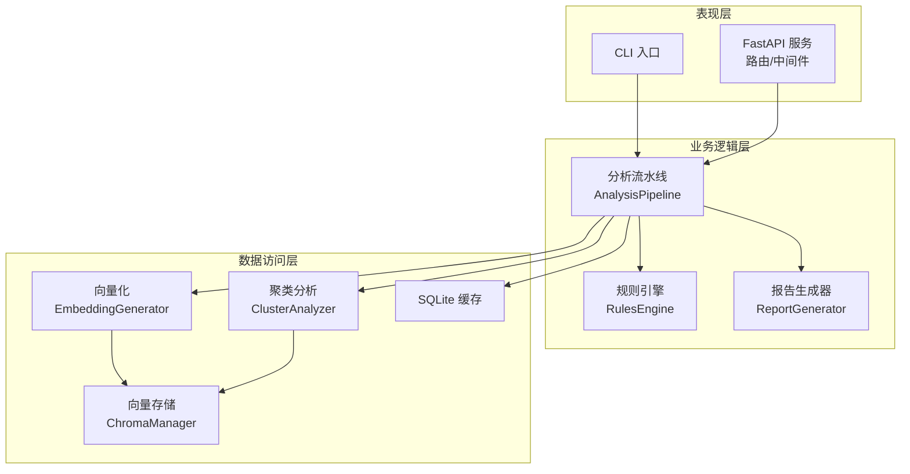
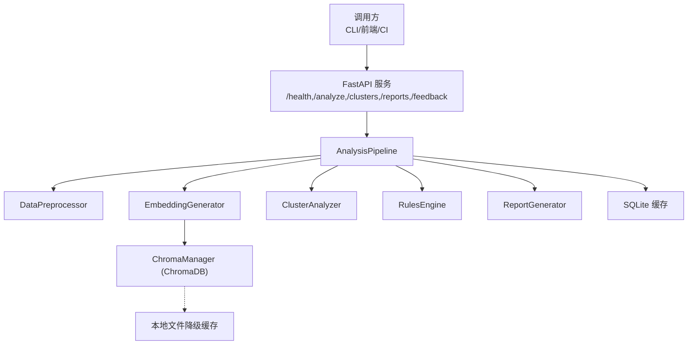
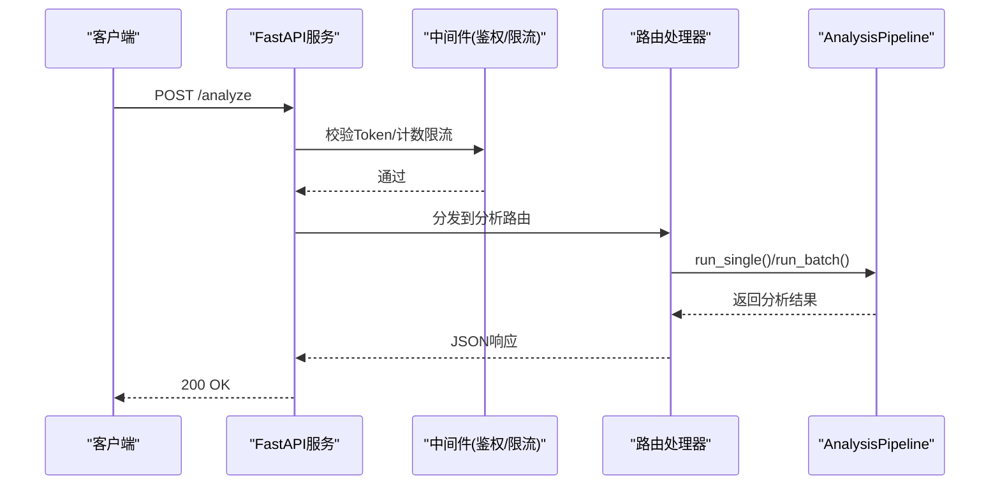
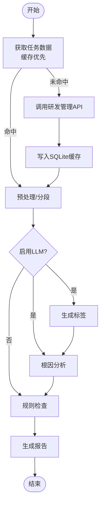
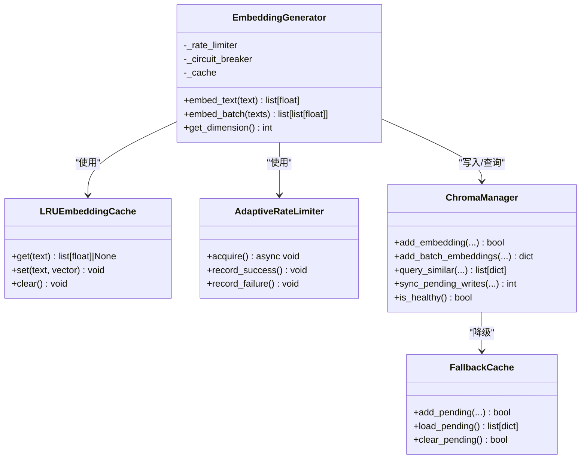
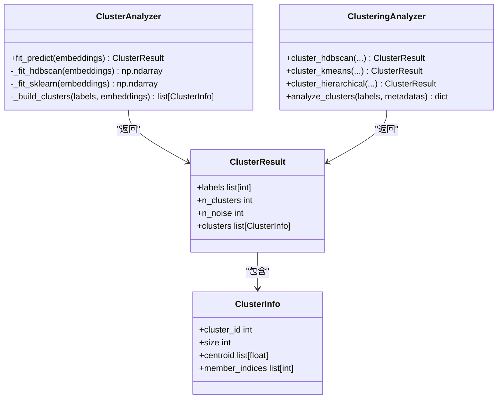
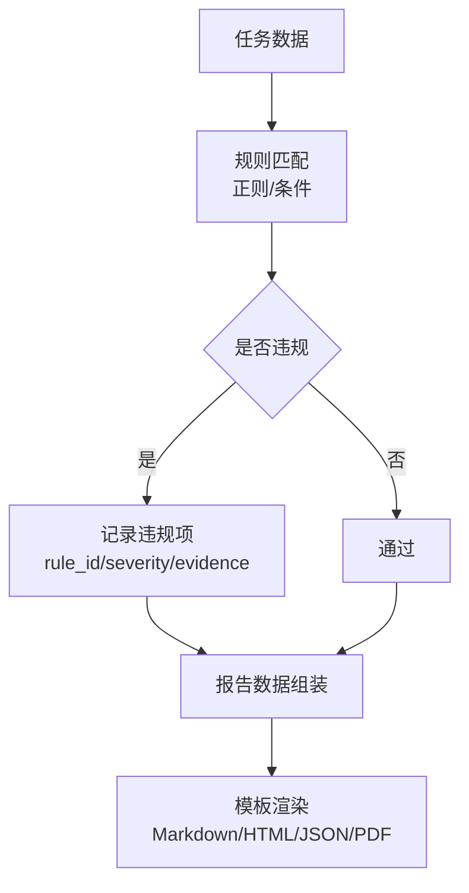
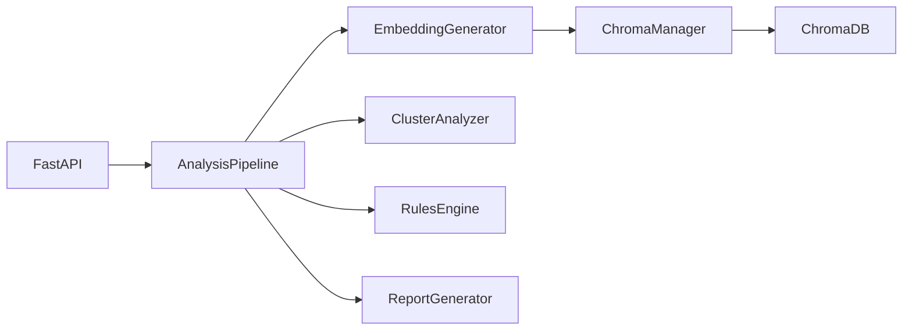
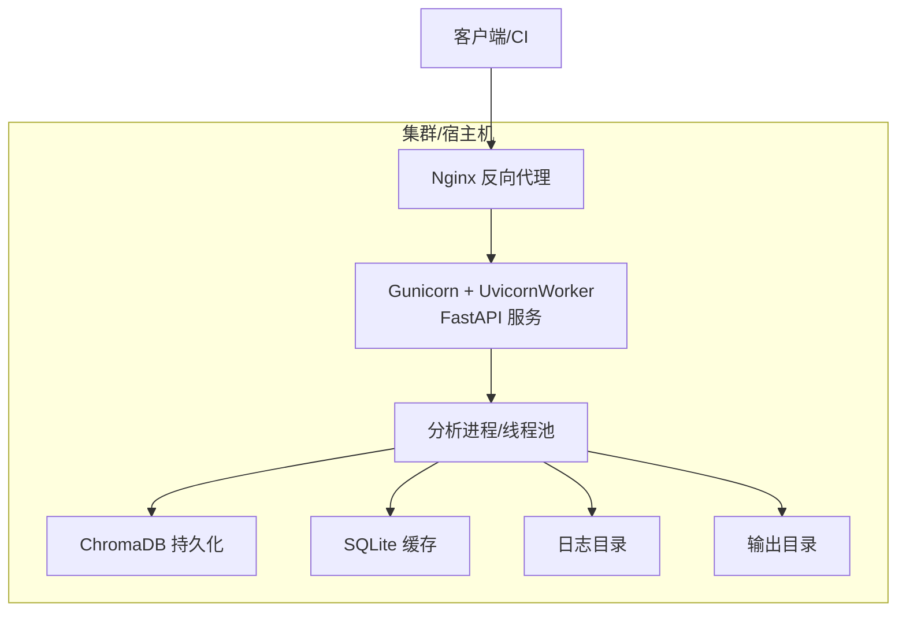

# 系统概览

<cite>
**本文引用的文件**   
- [README.md](file://README.md)
- [architecture.yaml](file://architecture.yaml)
- [DEPLOYMENT.md](file://docs/DEPLOYMENT.md)
- [API.md](file://docs/API.md)
- [server.py](file://src/api/server.py)
- [pipeline.py](file://src/analyzer/pipeline.py)
- [clustering.py](file://src/analysis/clustering.py)
- [chroma_manager.py](file://src/storage/chroma_manager.py)
- [manager.py](file://src/config/manager.py)
- [models.py](file://src/core/models.py)
- [analyzer.py](file://src/clustering/analyzer.py)
- [generator.py](file://src/embedding/generator.py)
- [engine.py](file://src/rules/engine.py)
- [report_generator.py](file://src/report/generator.py)
- [pyproject.toml](file://pyproject.toml)
</cite>

## 目录
1. [引言](#引言)
2. [项目结构](#项目结构)
3. [核心组件](#核心组件)
4. [架构总览](#架构总览)
5. [详细组件分析](#详细组件分析)
6. [依赖关系分析](#依赖关系分析)
7. [性能与可扩展性](#性能与可扩展性)
8. [部署拓扑与基础设施](#部署拓扑与基础设施)
9. [故障排查指南](#故障排查指南)
10. [结论](#结论)

## 引言
本系统为“AI驱动的故障复盘分析工具”，面向研发管理场景，提供无预设标签的自动聚类、智能标签生成、根因分析与规范冲突识别等能力。系统采用分层架构：表现层（CLI/API服务）、业务逻辑层（分析流水线与规则引擎）、数据访问层（向量数据库与缓存），并通过异步处理与事件驱动思想组织关键流程，支持高并发与弹性扩展。

主要目标
- 不依赖预设分类，从历史故障数据中自动习得模式
- 基于嵌入向量的HDBSCAN聚类发现相似故障群
- 结合LLM进行标签生成与根因推理，输出可落地的改进建议
- 通过规则引擎检测编码与安全规范违规
- 提供REST API与CLI双入口，便于集成到CI/CD与日常运维

技术选型要点
- FastAPI + Uvicorn：高性能异步HTTP服务，原生OpenAPI文档
- HDBSCAN：无需预定义簇数，对噪声鲁棒，适合未知分布的缺陷模式
- ChromaDB：轻量级本地持久化向量库，具备容错与降级机制
- OpenAI兼容Embedding接口：统一抽象多供应商，支持自适应限流与熔断
- Pydantic + YAML/Env配置：强类型校验与环境覆盖，利于生产治理

**章节来源**
- [README.md:1-101](file://README.md#L1-L101)

## 项目结构
仓库采用按领域与职责划分的模块化结构，核心目录说明如下：
- src/api：FastAPI服务、路由、中间件、客户端模型
- src/analyzer：分析编排（AnalysisPipeline）
- src/analysis：具体分析模块（聚类、解释性、违规检测等）
- src/clustering：聚类算法封装（HDBSCAN/KMeans/层次）
- src/embedding：文本/多模态向量化（含LRU缓存、自适应限流、熔断）
- src/storage：ChromaDB管理器（带重试与本地降级）
- src/rules：规则引擎与内置规则集
- src/report：报告模板与生成器（Markdown/HTML/JSON/PDF包装）
- src/config：配置加载、合并与环境变量覆盖
- src/core：跨模块共享的数据模型
- src/cli：命令行入口（typer）
- docs：部署、API、排障等文档

**图表来源**
- [server.py:1-152](file://src/api/server.py#L1-L152)
- [pipeline.py:1-468](file://src/analyzer/pipeline.py#L1-L468)
- [analyzer.py:1-121](file://src/clustering/analyzer.py#L1-L121)
- [generator.py:1-427](file://src/embedding/generator.py#L1-L427)
- [chroma_manager.py:1-687](file://src/storage/chroma_manager.py#L1-L687)
- [engine.py:1-376](file://src/rules/engine.py#L1-L376)
- [report_generator.py:1-790](file://src/report/generator.py#L1-L790)

**章节来源**
- [architecture.yaml:1-106](file://architecture.yaml#L1-L106)
- [pyproject.toml:1-165](file://pyproject.toml#L1-L165)

## 核心组件
- 分析流水线（AnalysisPipeline）
  - 负责端到端编排：拉取任务数据、预处理、可选LLM分析（标签/根因）、规则检查、报告生成、聚类执行
  - 支持单任务与批量并发执行；内部使用异步并发聚合结果
- 向量化（EmbeddingGenerator）
  - 支持多供应商（OpenAI兼容）、本地哈希向量回退
  - 内建LRU缓存、自适应QPS限流、熔断器与信号量并发控制
- 聚类分析（ClusterAnalyzer / analysis.clustering）
  - 默认HDBSCAN，支持KMeans与层次聚类；余弦距离通过归一化+欧氏近似实现
- 规则引擎（RulesEngine）
  - 内置安全/代码/性能等多类规则，支持YAML/JSON自定义规则加载与正则匹配
- 向量存储（ChromaManager）
  - 持久化集合、批量写入、元数据过滤查询、健康检查、失败重试与本地文件降级
- 报告生成（ReportGenerator）
  - 单任务/聚类/批量报告，支持Markdown/HTML/JSON/PDF（PDF以HTML包装）
- 配置管理（ConfigManager）
  - YAML/JSON加载、深合并、环境变量覆盖、Pydantic强类型校验

**章节来源**
- [pipeline.py:1-468](file://src/analyzer/pipeline.py#L1-L468)
- [generator.py:1-427](file://src/embedding/generator.py#L1-L427)
- [analyzer.py:1-121](file://src/clustering/analyzer.py#L1-L121)
- [clustering.py:1-316](file://src/analysis/clustering.py#L1-L316)
- [engine.py:1-376](file://src/rules/engine.py#L1-L376)
- [chroma_manager.py:1-687](file://src/storage/chroma_manager.py#L1-L687)
- [report_generator.py:1-790](file://src/report/generator.py#L1-L790)
- [manager.py:1-268](file://src/config/manager.py#L1-L268)

## 架构总览
系统采用三层分离与插件化设计：
- 表现层：CLI与FastAPI服务，提供REST接口与健康检查，承载认证与速率限制中间件
- 业务逻辑层：AnalysisPipeline作为编排中心，串联预处理、向量化、聚类、规则检查、报告生成
- 数据访问层：ChromaDB用于向量检索与持久化，SQLite用于任务缓存，外部LLM/Embedding服务通过适配器接入

**图表来源**
- [server.py:1-152](file://src/api/server.py#L1-L152)
- [pipeline.py:1-468](file://src/analyzer/pipeline.py#L1-L468)
- [chroma_manager.py:1-687](file://src/storage/chroma_manager.py#L1-L687)

## 详细组件分析

### 表现层：FastAPI服务与中间件
- 应用创建与生命周期管理：初始化CORS、注册路由、注入Token校验与速率限制中间件
- 路由分组：健康检查、分析、聚类、报告、反馈
- 启动方式：uvicorn运行，支持环境变量配置主机/端口/令牌/限流

**图表来源**
- [server.py:1-152](file://src/api/server.py#L1-L152)
- [pipeline.py:1-468](file://src/analyzer/pipeline.py#L1-L468)

**章节来源**
- [server.py:1-152](file://src/api/server.py#L1-L152)
- [API.md:1-514](file://docs/API.md#L1-L514)

### 业务逻辑层：分析流水线
- 单任务流程：获取任务数据→预处理→可选LLM分析（标签/根因/深度根因）→规则检查→报告生成
- 批量流程：并发拉取任务→预处理→批量嵌入→聚类→统计汇总
- 缓存策略：优先读取SQLite缓存，未命中则调用研发管理系统API并回填缓存

**图表来源**
- [pipeline.py:1-468](file://src/analyzer/pipeline.py#L1-L468)

**章节来源**
- [pipeline.py:1-468](file://src/analyzer/pipeline.py#L1-L468)

### 数据访问层：向量化与向量存储
- 向量化
  - 多供应商适配（OpenAI兼容），本地哈希向量回退
  - LRU缓存键为文本SHA256，TTL过期清理
  - 自适应QPS限流：成功加速、失败退避
  - 熔断器：连续失败触发保护，超时后尝试恢复
- 向量存储
  - 持久化集合、批量upsert、元数据过滤、相似度查询
  - 连接健康检查、指数退避重试
  - 本地文件降级：pending_writes.jsonl记录待同步数据，支持后续同步

**图表来源**
- [generator.py:1-427](file://src/embedding/generator.py#L1-L427)
- [chroma_manager.py:1-687](file://src/storage/chroma_manager.py#L1-L687)

**章节来源**
- [generator.py:1-427](file://src/embedding/generator.py#L1-L427)
- [chroma_manager.py:1-687](file://src/storage/chroma_manager.py#L1-L687)

### 聚类分析组件
- ClusterAnalyzer：封装HDBSCAN/KMeans/层次聚类，支持余弦距离近似与参数自适应
- analysis.clustering：提供多种算法实现与聚类信息构建，包含噪声点统计与聚类摘要

**图表来源**
- [analyzer.py:1-121](file://src/clustering/analyzer.py#L1-L121)
- [clustering.py:1-316](file://src/analysis/clustering.py#L1-L316)
- [models.py:1-426](file://src/core/models.py#L1-L426)

**章节来源**
- [analyzer.py:1-121](file://src/clustering/analyzer.py#L1-L121)
- [clustering.py:1-316](file://src/analysis/clustering.py#L1-L316)
- [models.py:1-426](file://src/core/models.py#L1-L426)

### 规则引擎与报告生成
- 规则引擎：内置安全/代码/性能规则，支持YAML/JSON自定义规则；通过正则匹配与条件评估产出违规项
- 报告生成：Jinja2模板渲染，支持Markdown/HTML/JSON/PDF（PDF以HTML包装），支持单任务/聚类/批量报告

**图表来源**
- [engine.py:1-376](file://src/rules/engine.py#L1-L376)
- [report_generator.py:1-790](file://src/report/generator.py#L1-L790)

**章节来源**
- [engine.py:1-376](file://src/rules/engine.py#L1-L376)
- [report_generator.py:1-790](file://src/report/generator.py#L1-L790)

### 配置管理与数据模型
- 配置管理：支持YAML/JSON加载、深合并、环境变量覆盖、Pydantic强类型校验
- 数据模型：Task/AnalysisResult/ClusterResult/EmbeddingResult等，贯穿各模块，保证一致性与可验证性

**章节来源**
- [manager.py:1-268](file://src/config/manager.py#L1-L268)
- [models.py:1-426](file://src/core/models.py#L1-L426)

## 依赖关系分析
- 模块耦合与内聚
  - API层仅依赖配置、中间件与路由，低耦合
  - 分析流水线集中编排，依赖明确，内聚度高
  - 向量化与向量存储解耦，通过接口契约交互
- 外部依赖
  - FastAPI/Uvicorn：HTTP服务与ASGI服务器
  - HDBSCAN/sklearn：聚类算法
  - ChromaDB：向量数据库
  - OpenAI兼容SDK：Embedding/LLM调用
  - Jinja2：模板渲染
  - Pydantic/YAML：配置与数据校验

**图表来源**
- [server.py:1-152](file://src/api/server.py#L1-L152)
- [pipeline.py:1-468](file://src/analyzer/pipeline.py#L1-L468)
- [generator.py:1-427](file://src/embedding/generator.py#L1-L427)
- [analyzer.py:1-121](file://src/clustering/analyzer.py#L1-L121)
- [engine.py:1-376](file://src/rules/engine.py#L1-L376)
- [chroma_manager.py:1-687](file://src/storage/chroma_manager.py#L1-L687)

**章节来源**
- [pyproject.toml:1-165](file://pyproject.toml#L1-L165)

## 性能与可扩展性
- 并发与吞吐
  - 分析流水线批量任务使用asyncio.gather并发执行
  - 向量化使用信号量控制并发度，分批提交，避免突发流量
  - 自适应限流根据成功率动态调整QPS，失败时退避
- 容错与降级
  - 向量化熔断器防止雪崩
  - ChromaDB操作重试与本地文件降级，保障可用性
- 可扩展性
  - 新增Embedding供应商仅需在EmbeddingGenerator中添加分支与维度映射
  - 规则引擎支持YAML/JSON动态加载，无需重启
  - 聚类算法可通过ClusterAnalyzer参数切换或扩展新算法

[本节为通用指导，不直接分析具体文件]

## 部署拓扑与基础设施
- 环境要求
  - Python >= 3.10，内存建议≥4GB（推荐8GB），磁盘≥10GB
  - 可选：Docker、Kubernetes、Nginx
- 部署方式
  - 本地：虚拟环境安装依赖，设置.env，运行CLI或API服务
  - Docker：镜像构建，容器挂载data/output/logs卷，暴露8000端口
  - Kubernetes：Deployment/Service/Ingress/HPA/PVC，资源请求/限制与探针配置
  - 反向代理：Gunicorn + UvicornWorker，Nginx转发与静态资源
- 数据与备份
  - data/chroma（ChromaDB）、data/cache.db（SQLite）、output、logs
  - 支持定时备份与恢复脚本

**图表来源**
- [DEPLOYMENT.md:1-800](file://docs/DEPLOYMENT.md#L1-L800)

**章节来源**
- [DEPLOYMENT.md:1-800](file://docs/DEPLOYMENT.md#L1-L800)

## 故障排查指南
- 常见问题定位
  - API不可用：检查健康端点、端口占用、环境变量（API_HOST/API_PORT/TOKEN/RATE_LIMIT）
  - 向量写入失败：查看ChromaManager重试与降级日志，确认本地降级文件是否存在待同步记录
  - 嵌入服务异常：观察熔断器状态与限流指标，必要时降低并发或提高QPS上限
  - 规则误报/漏报：核对内置与自定义规则表达式，逐步缩小匹配范围
- 诊断手段
  - 查看服务日志（loguru）与系统日志（systemd/journalctl）
  - 使用kubectl/port-forward测试服务连通性
  - 检查ChromaDB集合统计与待同步数量

**章节来源**
- [chroma_manager.py:1-687](file://src/storage/chroma_manager.py#L1-L687)
- [DEPLOYMENT.md:1-800](file://docs/DEPLOYMENT.md#L1-L800)

## 结论
本系统以分层架构与插件化设计为核心，围绕“无预设标签的自动聚类”和“AI驱动的根因分析”展开，结合规则引擎与报告体系形成闭环。通过异步并发、自适应限流与熔断、向量库降级等工程实践，兼顾了准确性与稳定性。在生产环境中，借助Docker/Kubernetes与反向代理可实现高可用与弹性伸缩，满足大规模故障复盘与分析需求。