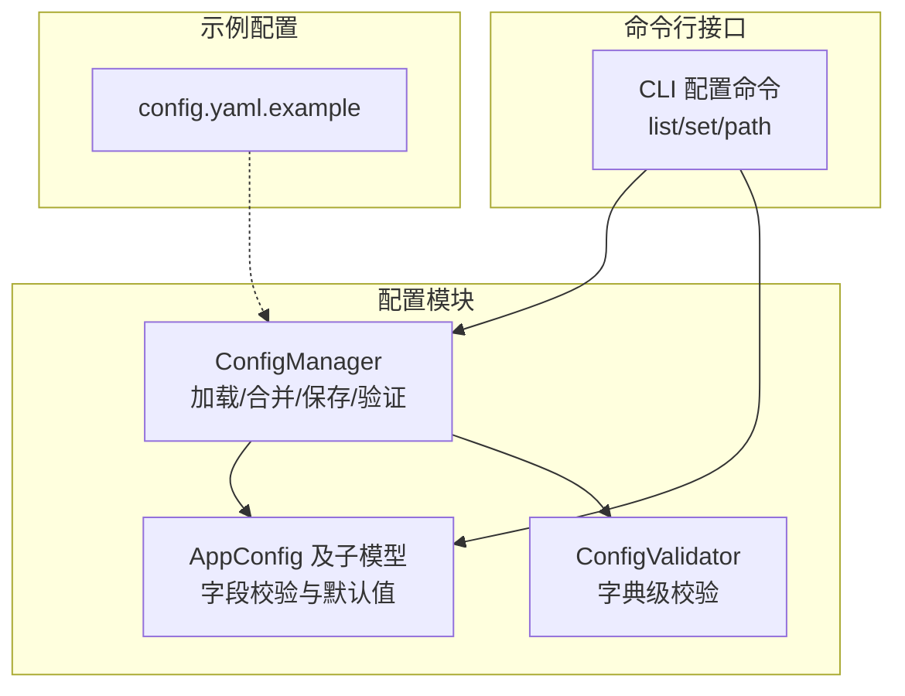
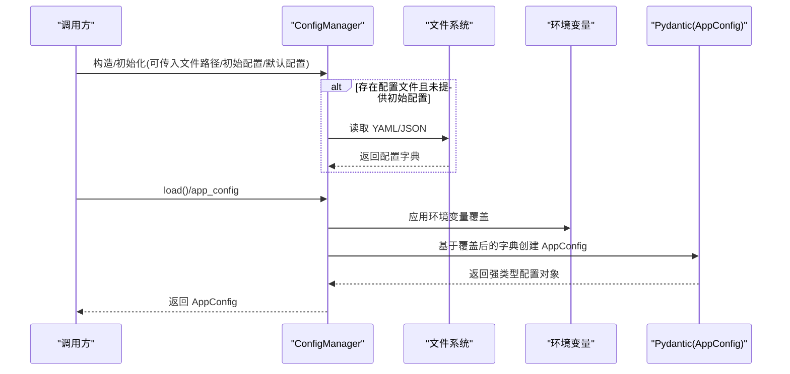
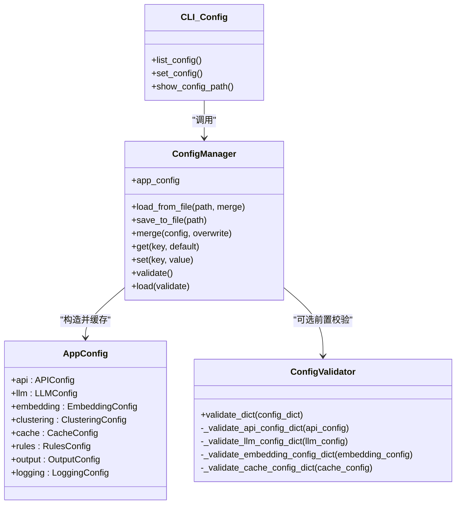

# 配置系统

<cite>
**本文引用的文件**   
- [src/config/manager.py](file://src/config/manager.py)
- [src/config/models.py](file://src/config/models.py)
- [src/config/validator.py](file://src/config/validator.py)
- [config/config.yaml.example](file://config/config.yaml.example)
- [src/cli/commands/config.py](file://src/cli/commands/config.py)
- [tests/config/test_manager.py](file://tests/config/test_manager.py)
- [tests/config/test_validator.py](file://tests/config/test_validator.py)
</cite>

## 目录
1. [简介](#简介)
2. [项目结构](#项目结构)
3. [核心组件](#核心组件)
4. [架构总览](#架构总览)
5. [详细组件分析](#详细组件分析)
6. [依赖关系分析](#依赖关系分析)
7. [性能与扩展性考虑](#性能与扩展性考虑)
8. [故障排除指南](#故障排除指南)
9. [结论](#结论)
10. [附录](#附录)

## 简介
本文件面向 Bug 聚类分析系统的配置子系统，系统性说明 ConfigManager 的配置管理机制、配置文件结构、环境变量覆盖、配置验证规则、动态更新能力以及 CLI 工具的使用方式。文档同时给出完整的配置项说明、默认值、优先级与覆盖机制、错误处理策略，并提供最佳实践与排障建议，帮助读者在生产与开发环境中正确管理与维护配置。

## 项目结构
配置子系统位于 src/config 目录下，包含管理器、数据模型与校验器；CLI 命令提供查看与设置配置的便捷入口；示例配置文件位于 config 目录。

图表来源
- [src/config/manager.py:42-112](file://src/config/manager.py#L42-L112)
- [src/config/models.py:135-144](file://src/config/models.py#L135-L144)
- [src/config/validator.py:16-51](file://src/config/validator.py#L16-L51)
- [src/cli/commands/config.py:15-69](file://src/cli/commands/config.py#L15-L69)
- [config/config.yaml.example:1-38](file://config/config.yaml.example#L1-L38)

章节来源
- [src/config/manager.py:42-112](file://src/config/manager.py#L42-L112)
- [src/config/models.py:135-144](file://src/config/models.py#L135-L144)
- [src/config/validator.py:16-51](file://src/config/validator.py#L16-L51)
- [src/cli/commands/config.py:15-69](file://src/cli/commands/config.py#L15-L69)
- [config/config.yaml.example:1-38](file://config/config.yaml.example#L1-L38)

## 核心组件
- ConfigManager：负责配置文件的读取（YAML/JSON）、合并、写入、键值访问、环境覆盖、验证与 AppConfig 实例化。
- AppConfig 及其子模型：使用 Pydantic 定义配置结构与强类型校验，提供默认值与约束。
- ConfigValidator：对原始字典进行独立校验，便于在构建 AppConfig 之前快速定位问题。
- CLI 配置命令：提供 list、set、path 三个子命令，用于查看、修改与显示当前配置路径。

章节来源
- [src/config/manager.py:42-112](file://src/config/manager.py#L42-L112)
- [src/config/models.py:4-144](file://src/config/models.py#L4-L144)
- [src/config/validator.py:16-51](file://src/config/validator.py#L16-L51)
- [src/cli/commands/config.py:15-69](file://src/cli/commands/config.py#L15-L69)

## 架构总览
配置加载与生效流程如下：从文件或内存初始化配置，支持深度合并与环境变量覆盖，最终通过 Pydantic 模型生成强类型的 AppConfig 对象供业务使用。

图表来源
- [src/config/manager.py:70-73](file://src/config/manager.py#L70-L73)
- [src/config/manager.py:183-189](file://src/config/manager.py#L183-L189)
- [src/config/manager.py:191-243](file://src/config/manager.py#L191-L243)
- [src/config/models.py:135-144](file://src/config/models.py#L135-L144)

## 详细组件分析

### ConfigManager 类
职责与能力
- 初始化：支持从文件、内存字典或默认配置初始化；若未提供初始配置且存在默认配置，则自动填充默认值。
- 文件 I/O：load_from_file/save_to_file 支持 YAML 与 JSON；save_to_file 会自动创建父目录。
- 合并：merge/_deep_merge 实现深度合并，支持是否覆盖已有键。
- 访问：get/set 支持点号分隔的嵌套键访问与设置。
- 验证：validate 将配置转换为 AppConfig 以触发 Pydantic 校验。
- 环境变量：_apply_env_overrides 将指定环境变量映射到配置项并覆盖对应值。
- 生命周期：reset 重置为默认或空状态；load/app_config 懒加载并缓存 AppConfig 实例。

关键行为与复杂度
- 深度合并时间复杂度 O(N)，N 为源配置字典节点数；空间复杂度取决于拷贝深度。
- get/set 按路径逐层遍历，时间复杂度 O(D)，D 为路径层级深度。
- 环境变量解析 _parse_env_value 支持布尔、整型、浮点与字符串自动推断。

热重载与动态更新
- 当前 ConfigManager 未内置文件监听与热重载机制。可通过外部进程监控配置文件变更，并在变更后调用 merge/load 重新加载与重建 AppConfig。
- 对于需要运行时热更新的场景，建议在业务层封装一个“配置服务”，监听文件变化后调用 ConfigManager.merge 与 app_config 刷新。

错误处理
- 文件不存在：抛出 ConfigNotFoundError。
- 键不存在：get 无默认时抛出 ConfigKeyError。
- 校验失败：validate 或 load 可能抛出 ConfigValidationError（内部包装 Pydantic 异常）。

章节来源
- [src/config/manager.py:42-112](file://src/config/manager.py#L42-L112)
- [src/config/manager.py:146-160](file://src/config/manager.py#L146-L160)
- [src/config/manager.py:118-144](file://src/config/manager.py#L118-L144)
- [src/config/manager.py:161-173](file://src/config/manager.py#L161-L173)
- [src/config/manager.py:175-182](file://src/config/manager.py#L175-L182)
- [src/config/manager.py:183-189](file://src/config/manager.py#L183-L189)
- [src/config/manager.py:191-243](file://src/config/manager.py#L191-L243)
- [src/config/manager.py:245-268](file://src/config/manager.py#L245-L268)

### 配置模型与校验（AppConfig 及子模型）
- APIConfig：base_url、timeout、retry、api_key、api_path_prefix，含 URL 前缀与数值范围校验。
- LLMConfig：provider、model、api_key、temperature、max_tokens、base_url，含 provider 白名单与温度/token 范围校验。
- EmbeddingConfig：provider、model、api_key、base_url、batch_size，含 provider 白名单与批大小校验。
- ClusteringConfig：algorithm、min_cluster_size、min_samples、metric，含算法与度量白名单校验。
- CacheConfig：enabled、ttl、storage、db_path，含存储类型与 TTL 非负校验，sqlite/file 需 db_path。
- RulesConfig：builtin_enabled、custom_paths。
- OutputConfig：format、directory，含输出格式白名单校验。
- LoggingConfig：level、format、file，含日志级别白名单校验。
- AppConfig：聚合以上各子配置，提供统一入口。

校验策略
- 使用 Pydantic Field 与 field_validator 完成类型与业务规则校验。
- 当配置缺失必填项或取值越界时，构造 AppConfig 会抛出异常，由 ConfigManager.validate 捕获并包装为 ConfigValidationError。

章节来源
- [src/config/models.py:4-144](file://src/config/models.py#L4-L144)

### 字典级校验器（ConfigValidator）
- validate_dict：对 api、llm、embedding、cache 四个主要段进行结构化校验，汇总错误列表。
- 分段校验方法：分别检查必填项、URL 格式、枚举值、数值范围等。
- 适用场景：在构建 AppConfig 之前快速诊断配置问题，或在测试中隔离校验逻辑。

章节来源
- [src/config/validator.py:16-51](file://src/config/validator.py#L16-L51)
- [src/config/validator.py:53-87](file://src/config/validator.py#L53-L87)
- [src/config/validator.py:89-125](file://src/config/validator.py#L89-L125)
- [src/config/validator.py:127-168](file://src/config/validator.py#L127-L168)
- [src/config/validator.py:170-196](file://src/config/validator.py#L170-L196)

### CLI 配置命令
- list：列出当前配置的关键项（API、LLM、Embedding、Clustering、Cache、Output）。
- set：通过 key=value 形式设置配置项并持久化到文件。
- path：显示当前使用的配置文件路径（含默认路径提示）。

注意
- set 命令仅做字符串赋值，不会触发类型转换或校验；如需严格校验，建议使用程序化方式或通过 AppConfig 构造。

章节来源
- [src/cli/commands/config.py:15-69](file://src/cli/commands/config.py#L15-L69)

### 环境变量支持与覆盖机制
- 支持的环境变量映射包括：API_*、LLM_*、EMBEDDING_*、CLUSTERING_*、CACHE_*、RULES_*、OUTPUT_*、LOGGING_* 等。
- 覆盖时机：在获取 AppConfig 或执行 validate 时，先复制当前配置字典，再应用环境变量覆盖，最后构造 AppConfig。
- 类型推断：true/false 转为布尔，否则尝试整数、浮点数，最后回退为字符串。

优先级顺序
- 当前实现中，环境变量在每次获取 AppConfig 时都会应用到配置副本上，因此其效果等同于“最高优先级”的运行时覆盖。
- 若结合命令行参数与配置文件，建议遵循以下通用优先级（从高到低）：
  1) 环境变量（运行时覆盖）
  2) 命令行参数（如通过 CLI 传入 --config 指定不同文件）
  3) 配置文件（YAML/JSON）
  4) 默认配置（defaults）
- 注意：当前代码未直接解析命令行参数覆盖具体配置项，CLI 主要用于查看与设置文件内容。

章节来源
- [src/config/manager.py:191-243](file://src/config/manager.py#L191-L243)
- [src/config/manager.py:183-189](file://src/config/manager.py#L183-L189)
- [src/config/manager.py:245-268](file://src/config/manager.py#L245-L268)

### 配置项详解与默认值
- API
  - base_url：字符串，可为空；若提供必须以 http:// 或 https:// 开头。
  - timeout：正整数秒。
  - retry：0~10 次。
  - api_key：字符串。
  - api_path_prefix：字符串，通常以 / 开头。
- LLM
  - provider：枚举，支持 openai/qwen/wenxin/zhipu/custom/volcengine。
  - model：字符串，必填。
  - api_key：字符串，必填。
  - temperature：0.0~1.0。
  - max_tokens：正整数。
  - base_url：可选，若提供需合法 URL。
- Embedding
  - provider：枚举，支持 openai/bge/m3e/codebert/zhipu/local/volcengine/custom。
  - model：字符串，必填。
  - api_key：非 local 提供商必填。
  - base_url：可选，若提供需合法 URL。
  - batch_size：正整数。
- Clustering
  - algorithm：枚举，支持 hdbscan/kmeans/dbscan。
  - min_cluster_size：≥2。
  - min_samples：≥1。
  - metric：枚举，支持 cosine/euclidean/manhattan。
- Cache
  - enabled：布尔。
  - ttl：≥0 秒。
  - storage：枚举，支持 sqlite/file/memory。
  - db_path：sqlite/file 模式必填。
- Rules
  - builtin_enabled：布尔。
  - custom_paths：自定义规则路径列表。
- Output
  - format：枚举，支持 markdown/html/json。
  - directory：输出目录路径。
- Logging
  - level：枚举，支持 DEBUG/INFO/WARNING/ERROR/CRITICAL。
  - format：日志格式模板。
  - file：可选日志文件路径。

章节来源
- [src/config/models.py:4-144](file://src/config/models.py#L4-L144)

### 配置文件示例
仓库提供示例配置文件，可作为基线参考。该示例展示了各段的常用字段与典型取值。

章节来源
- [config/config.yaml.example:1-38](file://config/config.yaml.example#L1-L38)

### 配置验证规则与错误处理
- 验证入口
  - ConfigManager.validate：复制配置并应用环境变量覆盖，然后尝试构造 AppConfig，捕获异常并返回错误列表。
  - ConfigValidator.validate_dict：对原始字典进行分段校验，适合在构建 AppConfig 前快速定位问题。
- 常见错误
  - 必填项缺失：如 API base_url/api_key/api_path_prefix、LLM model/api_key、Embedding model 等。
  - 格式错误：URL 不以 http(s):// 开头、路径前缀不以 / 开头。
  - 范围越界：timeout/retry/max_tokens/ttl/batch_size 等数值不满足约束。
  - 枚举非法：provider/algorithm/metric/storage/format/level 不在允许集合内。
- 错误包装
  - ConfigManager 将 Pydantic 异常包装为 ConfigValidationError，便于上层统一处理。

章节来源
- [src/config/manager.py:161-173](file://src/config/manager.py#L161-L173)
- [src/config/validator.py:16-51](file://src/config/validator.py#L16-L51)
- [src/config/validator.py:53-87](file://src/config/validator.py#L53-L87)
- [src/config/validator.py:89-125](file://src/config/validator.py#L89-L125)
- [src/config/validator.py:127-168](file://src/config/validator.py#L127-L168)
- [src/config/validator.py:170-196](file://src/config/validator.py#L170-L196)

### 动态配置更新与迁移策略
- 动态更新
  - 通过 ConfigManager.merge 合并新配置片段，随后再次访问 app_config 即可获得最新强类型配置。
  - 可在外部进程监听配置文件变更，触发 merge + app_config 刷新。
- 迁移策略
  - 新增字段：在模型中增加字段并提供合理默认值，保持向后兼容。
  - 废弃字段：保留旧字段但标记弃用，逐步引导迁移至新字段。
  - 版本化：在配置顶层引入 version 字段，配合迁移脚本在启动时执行必要的数据转换。
  - 校验增强：在 validator 中补充兼容性检查，避免旧配置在新版本下静默失效。

章节来源
- [src/config/manager.py:146-160](file://src/config/manager.py#L146-L160)
- [src/config/manager.py:183-189](file://src/config/manager.py#L183-L189)
- [src/config/models.py:4-144](file://src/config/models.py#L4-L144)

### 配置调试与排障清单
- 快速验证
  - 使用 ConfigValidator.validate_dict 对当前配置字典进行校验，定位具体错误信息。
  - 使用 CLI 的 list 命令查看已生效的关键配置项。
- 常见问题
  - 环境变量未生效：确认环境变量名与映射一致，且在 load/app_config 前已设置。
  - 文件路径错误：确保配置文件存在且可读；save_to_file 会自动创建父目录，load_from_file 不会。
  - 类型不匹配：CLI set 仅写字符串，必要时通过程序化方式或环境变量自动类型推断。
  - 校验失败：根据错误消息修正字段值或枚举项。
- 日志与观测
  - 调整 logging.level 与 logging.file，记录配置加载与校验过程。
  - 在 CI/CD 中加入配置校验步骤，防止错误配置进入生产。

章节来源
- [src/config/validator.py:16-51](file://src/config/validator.py#L16-L51)
- [src/cli/commands/config.py:15-69](file://src/cli/commands/config.py#L15-L69)
- [src/config/manager.py:102-117](file://src/config/manager.py#L102-L117)
- [src/config/models.py:117-133](file://src/config/models.py#L117-L133)

## 依赖关系分析
配置模块内部依赖关系清晰：ConfigManager 依赖 AppConfig 模型进行强类型校验，同时可借助 ConfigValidator 进行前置校验；CLI 命令依赖 ConfigManager 暴露的能力。

图表来源
- [src/config/manager.py:42-112](file://src/config/manager.py#L42-L112)
- [src/config/models.py:135-144](file://src/config/models.py#L135-L144)
- [src/config/validator.py:16-51](file://src/config/validator.py#L16-L51)
- [src/cli/commands/config.py:15-69](file://src/cli/commands/config.py#L15-L69)

章节来源
- [src/config/manager.py:42-112](file://src/config/manager.py#L42-L112)
- [src/config/models.py:135-144](file://src/config/models.py#L135-L144)
- [src/config/validator.py:16-51](file://src/config/validator.py#L16-L51)
- [src/cli/commands/config.py:15-69](file://src/cli/commands/config.py#L15-L69)

## 性能与扩展性考虑
- 性能
  - 深度合并与类型转换仅在需要时执行（懒加载 AppConfig），避免不必要的开销。
  - 环境变量解析采用轻量级类型推断，开销极低。
- 扩展性
  - 新增配置段：在 models.py 中添加新模型并在 AppConfig 中组合，同时在 manager.py 的环境变量映射中补充映射。
  - 新增校验：在 validator.py 中增加对应校验方法，或在模型中使用 field_validator。
  - 热重载：在业务层封装文件监听与配置刷新逻辑，结合 merge 与 app_config 实现无缝切换。

[本节为通用指导，无需源码引用]

## 故障排除指南
- 现象：启动时报配置校验失败
  - 排查：使用 ConfigValidator.validate_dict 打印错误列表；对照模型字段约束逐项修正。
- 现象：环境变量未生效
  - 排查：确认环境变量名与映射一致；在调用 load/app_config 前设置；检查 _parse_env_value 的类型推断是否符合预期。
- 现象：CLI set 后值类型不符合预期
  - 排查：CLI set 仅写字符串；如需类型转换，请通过环境变量或程序化方式设置。
- 现象：保存失败
  - 排查：确认目标路径权限；save_to_file 会自动创建父目录，load_from_file 不会。

章节来源
- [src/config/validator.py:16-51](file://src/config/validator.py#L16-L51)
- [src/config/manager.py:191-243](file://src/config/manager.py#L191-L243)
- [src/cli/commands/config.py:42-58](file://src/cli/commands/config.py#L42-L58)
- [src/config/manager.py:102-117](file://src/config/manager.py#L102-L117)

## 结论
本配置系统以 Pydantic 模型为核心，结合 ConfigManager 的文件 I/O、合并与覆盖能力，提供了稳定、可扩展且易于验证的配置管理方案。通过环境变量覆盖与 CLI 工具，开发者与运维人员可以灵活地在不同环境中管理配置。建议在生产环境启用严格的配置校验与日志记录，并结合 CI/CD 流程保障配置质量。

[本节为总结，无需源码引用]

## 附录

### 环境变量映射一览（节选）
- API_BASE_URL → api.base_url
- API_TIMEOUT → api.timeout
- API_RETRY → api.retry
- DEVCLOUD_TOKEN → api.api_key
- LLM_PROVIDER → llm.provider
- LLM_MODEL → llm.model
- LLM_API_KEY → llm.api_key
- LLM_TEMPERATURE → llm.temperature
- LLM_MAX_TOKENS → llm.max_tokens
- LLM_BASE_URL → llm.base_url
- EMBEDDING_PROVIDER → embedding.provider
- EMBEDDING_MODEL → embedding.model
- EMBEDDING_API_KEY → embedding.api_key
- EMBEDDING_BASE_URL → embedding.base_url
- EMBEDDING_BATCH_SIZE → embedding.batch_size
- CLUSTERING_ALGORITHM → clustering.algorithm
- CLUSTERING_MIN_CLUSTER_SIZE → clustering.min_cluster_size
- CLUSTERING_MIN_SAMPLES → clustering.min_samples
- CLUSTERING_METRIC → clustering.metric
- CACHE_ENABLED → cache.enabled
- CACHE_TTL → cache.ttl
- CACHE_STORAGE → cache.storage
- CACHE_DB_PATH → cache.db_path
- RULES_BUILTIN_ENABLED → rules.builtin_enabled
- OUTPUT_FORMAT → output.format
- OUTPUT_DIRECTORY → output.directory
- LOG_LEVEL → logging.level
- LOG_FILE → logging.file

章节来源
- [src/config/manager.py:191-243](file://src/config/manager.py#L191-L243)

### 最佳实践
- 使用示例配置文件作为基线，按需裁剪与扩展。
- 敏感信息（如 API Key）优先通过环境变量注入，避免落盘。
- 在 CI/CD 中集成配置校验，尽早发现错误。
- 对运行期频繁变更的配置项，采用环境变量覆盖；对静态配置，使用配置文件管理。
- 定期审计配置变更，记录原因与影响范围。

[本节为通用指导，无需源码引用]